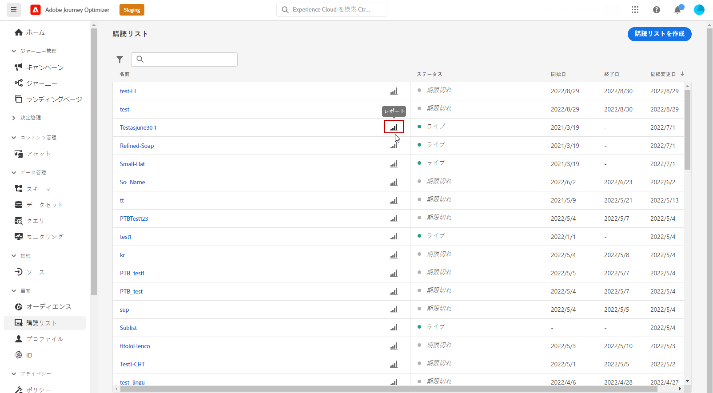

# 購読のグローバルレポート {#subscription-report-global}

購読 **[!UICONTROL グローバルレポート]** 選択した期間の購読者のアクティビティに関する詳細が表示されます。 過去 24 時間の購読のみを測定するには、 [配信登録ライブレポート](subscription-report-live.md).

レポートにアクセスするには、 **[!UICONTROL グローバルレポート]** を選択します。

購読 **[!UICONTROL グローバルレポート]** は、購読と購読解除を示す様々なウィジェットに分割されます。 必要に応じて、各ウィジェットのサイズを変更したり削除したりできます。この機能について詳しくは、この[節](global-report.md)を参照してください。

**[!UICONTROL 購読パフォーマンス]** KPI と&#x200B;**[!UICONTROL ジャーニー別の購読]**/**[!UICONTROL ジャーニー別の購読解除]**&#x200B;テーブルには、ランディングページに対する訪問者のエンゲージメントに関する主な情報の詳細が示されます。テーブルと KPI には、次のように、ランディングページに関連して使用できるデータが含まれています。

* **[!UICONTROL 購読]**：該当する期間中の購読の合計数。

* **[!UICONTROL 購読解除]**：該当する期間中の購読解除の合計数。

**[!UICONTROL 購読パフォーマンス]**&#x200B;グラフには、該当する期間中の購読の推移が表示されます。

**購読 - 分類**&#x200B;および&#x200B;**購読解除 - 分類**&#x200B;は、メッセージ、ランディングページおよびチャネルに応じて、選択した期間に購読または購読解除したユーザーの合計数を表します。
