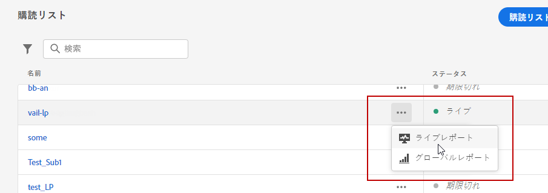

# 購読ライブレポート {#subscription-report-live}

購読 **[!UICONTROL ライブレポート]** は、過去 24 時間の購読者のアクティビティに関する詳細のみを表示します。 選択した期間で購読を測定するには、 [購読のグローバルレポート](subscription-report-global.md).

レポートにアクセスするには、 **[!UICONTROL ライブレポート]** を選択します。

購読 **[!UICONTROL ライブレポート]** は、購読と購読解除を示す様々なウィジェットに分割されます。 必要に応じて、各ウィジェットのサイズを変更したり削除したりできます。この機能について詳しくは、この[節](live-report.md)を参照してください。

**[!UICONTROL 購読パフォーマンス]** KPI と&#x200B;**[!UICONTROL ジャーニー別の購読]**/**[!UICONTROL ジャーニー別の購読解除]**&#x200B;テーブルには、ランディングページに対する訪問者のエンゲージメントに関する主な情報の詳細が示されます。テーブルと KPI には、次のように、ランディングページに関連して使用できるデータが含まれています。

* **[!UICONTROL 購読]**：過去 24 時間の購読の合計数。

* **[!UICONTROL 購読解除]**：過去 24 時間の購読解除の合計数。

**[!UICONTROL 購読パフォーマンス]**&#x200B;グラフには、過去 24 時間の購読の推移が表示されます。

**購読 - 分類**&#x200B;および&#x200B;**購読解除 - 分類**&#x200B;グラフは、メッセージ、ランディングページ、チャネルに応じて、過去 24 時間に購読または購読解除したユーザーの合計数を表します。

