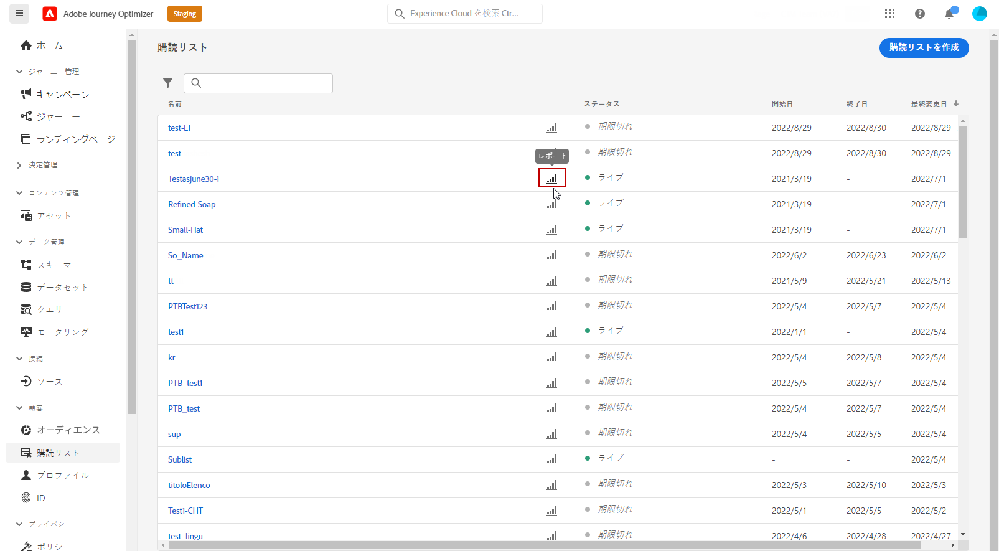
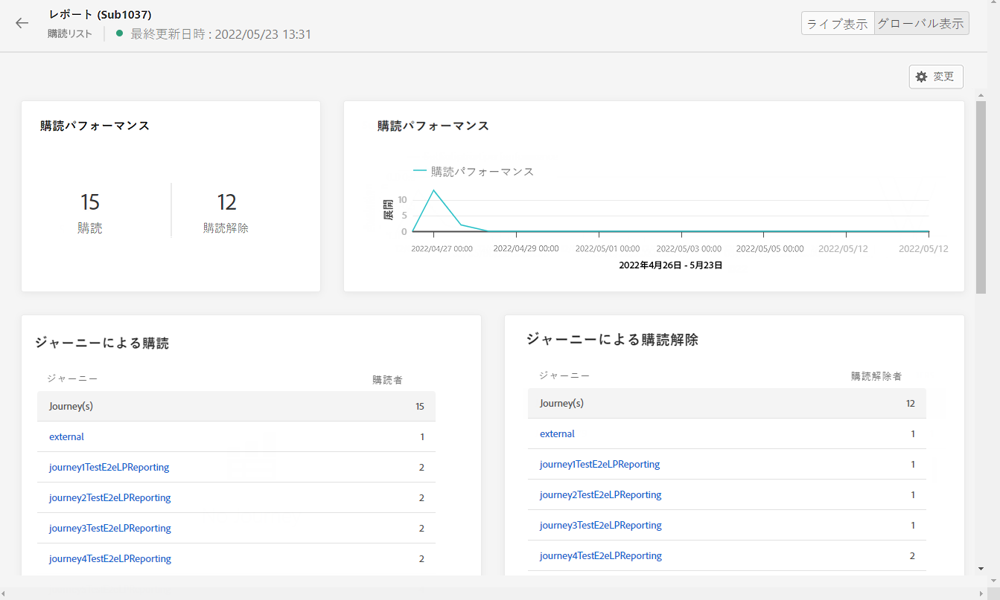
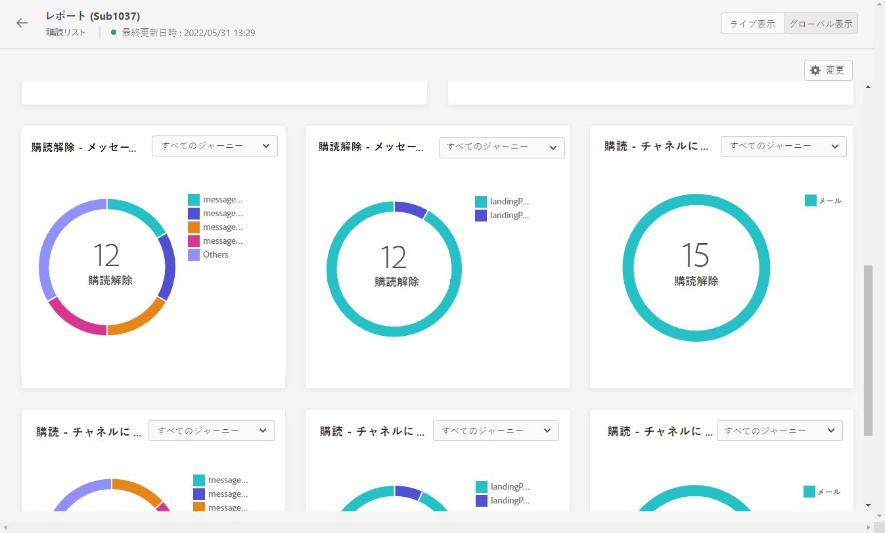

# 購読ライブレポート {#subscription-report-live}

>[!CONTEXTUALHELP]
>id="ajo_subscription_live_report"
>title="購読ライブレポート"
>abstract="購読ライブレポートでは、過去 24 時間のみの購読者のアクティビティをリアルタイムで測定および視覚化できます。レポートは、購読と購読解除の詳細を示す様々なウィジェットに分割されています。各レポートダッシュボードは、ウィジェットのサイズ変更や削除を行うことで変更できます。"

「過去 24 時間」タブからアクセスできるライブレポートには、過去 24 時間以内に発生したイベントが、イベント発生から最小 2 分の時間間隔で表示されます。これに対し、Customer Journey Analyticsレポートでは、少なくとも 2 時間前に発生したイベントに焦点を当て、選択した期間のイベントが表示されます。

レポートにアクセスするには、選択したサブスクリプションリストの「**[!UICONTROL レポート]**」アイコンをクリックします。

購読&#x200B;**[!UICONTROL ライブレポート]**&#x200B;は、購読と購読解除の詳細を示す様々なウィジェットに分割されています。必要に応じて、各ウィジェットのサイズを変更したり削除したりできます。この機能について詳しくは、この[節](live-report.md)を参照してください。

**[!UICONTROL 購読パフォーマンス]** KPI と&#x200B;**[!UICONTROL ジャーニー別の購読]**/**[!UICONTROL ジャーニー別の購読解除]**&#x200B;テーブルには、ランディングページに対する訪問者のエンゲージメントに関する主な情報の詳細が示されます。テーブルと KPI には、次のように、ランディングページに関連して使用できるデータが含まれています。

* **[!UICONTROL 購読]**：過去 24 時間の購読の合計数。

* **[!UICONTROL 購読解除]**：過去 24 時間の購読解除の合計数。

**[!UICONTROL 購読パフォーマンス]**&#x200B;グラフには、過去 24 時間の購読の推移が表示されます。

**購読 - 分類**&#x200B;および&#x200B;**購読解除 - 分類**&#x200B;グラフは、メッセージ、ランディングページ、チャネルに応じて、過去 24 時間に購読または購読解除したユーザーの合計数を表します。
