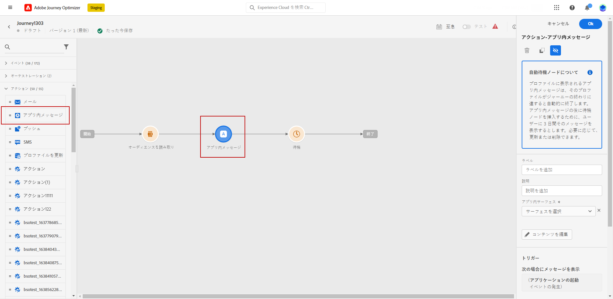
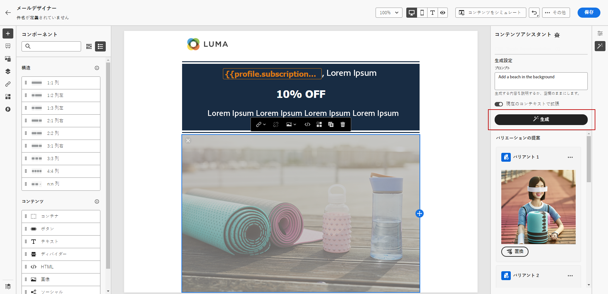

# 早期リリースノート {#e-release-notes}

[!DNL Adobe Journey Optimizer] は、新機能、既存機能の強化、およびバグ修正を継続的に提供します。[リリースノート](release-notes.md)では、すべての変更が各月の最終週にまとめられます。

以下の早期リリースノートは、リリースの公開日まで予告なく変更される場合があります。リンク、画面、更新されたドキュメントは、リリース日に[リリースノート](release-notes.md)で公開されます。

## 2023 年 8 月の早期リリースノート {#aug-rn-2023}

**リリース日**:2023 年 8 月 23 日～24 日

### 新機能{#aug-2023-features}

このリリースでは、以下に示す新機能が導入されています。

<table>
<thead>
<tr>
<th><strong>ジャーニーのアプリ内チャネル</strong> </th>
</tr>
</thead>
<tbody>
<tr>
<td>

ジャーニー内で、パーソナライズされたアプリ内メッセージをアプリのユーザーに送信できるようになりました。 Journey Optimizer を使用して通知をデザインし、メッセージのレイアウト、表示、テキストおよびボタンをカスタマイズして、シームレスなエクスペリエンスを作成します。

詳しくは、<a href="../in-app/get-started-in-app.md">詳細なドキュメント</a>を参照してください。

</tr>
</tbody>
</table>

<table>
<thead>
<tr>
<th><strong>シードリストを含む E メールの検証</strong> </th>
</tr>
</thead>
<tbody>
<tr>
<td>

Journey Optimizerでシードリストを作成および管理できるようになりました。 シードリストは、実際のオーディエンスに電子メールを送信する前に送信する、テスト用電子メールアドレスで構成されます。 この機能を使用して、送信された E メールコピーを監視し、すべての表示形式、URL、画像、リンクが正しいことを確認します。

<!--p>For more information, refer to the <a href="../audience/get-started-audience-orchestration.md">detailed documentation</a>.</p-->
</td>
</tr>
</tbody>
</table>

<table>
<thead>
<tr>
<th><strong>テキストおよび画像のコンテンツアシスタント</strong> </th>
</tr>
</thead>
<tbody>
<tr>
<td>

メッセージを作成し、パーソナライズしたら、コンテンツアシスタントを使用してコンテンツを次のレベルに移動します。 コンテンツアシスタントを使用して、様々なメインタイトルや画像を試すことで、メッセージの影響を最適化できるようになりました。 各バリアントは独自の処理として管理され、どのタイトルがより効果的にクリックを生み出すかを測定および比較します。

<!--p>For more information, refer to the <a href="../start/search-filter-categorize.md#tags">detailed documentation</a>.</p-->
</td>
</tr>
</tbody>
</table>

### 機能強化 {#aug-2023-improvements}

このリリースでは、以下に示す機能強化が含まれています。

**API**

コンテンツフラグメントを作成および管理する新しい API が利用できるようになりました。 [詳細情報](https://developer.adobe.com/journey-optimizer-apis/references/content-templates/#tag/Content-fragment-API){target="_blank"}。

**メールチャネル**

* E メールの表面の設定で、トランザクションメッセージのオーディエンスにスパムの苦情が原因で抑制された E メールアドレスを含める新しいオプションが使用できます。 マーケティングメッセージがスパムとしてマークされても、これらのプロファイルは、パスワードのリセットやアカウント明細書などのトランザクションメッセージを受け取ることができます。 このオプションはデフォルトでは無効です。

**ジャーニー**

* カスタムアクションで API 呼び出し応答を活用し、これらの応答に基づいてジャーニーを調整できるようになりました。
* 新しいタイプのシステムアラートが導入されました。カスタムアクションが失敗した場合に通知を受信できるようになりました。
