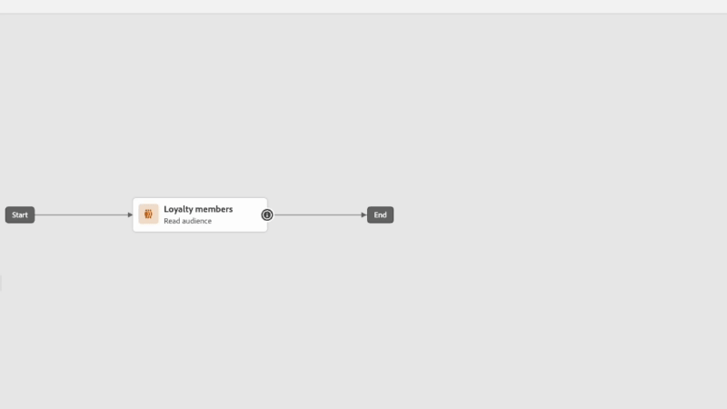

# 早期リリースノート {#e-release-notes}

[!DNL Adobe Journey Optimizer] は、新機能、既存機能の強化、およびバグ修正を継続的に提供します。[リリースノート](release-notes.md)では、各月の終わりにすべての変更がまとめられます。

以下の早期リリースノートは、リリースの公開日まで予告なく変更される場合があります。リンク、画面、更新されたドキュメントは、リリース日に[リリースノート](release-notes.md)で公開されます。

## 2024年4月先行リリースノート {#e-2024}

****&#x200B;リリース日：2024年4月30日（PT）

### 新機能 {#e-features}

このリリースでは、以下に説明する新機能が提供されています。

<!--table>
<thead>
<tr>
<th><strong>Business rules - Private Beta</strong> </th>
</tr>
</thead>
<tbody>
<tr>
<td>

It is now possible to create and apply rule sets to your marketing communications.  

</td>
</tr>
</tbody>
</table-->

<!--table>
<thead>
<tr>
<th><strong>Experience Decisioning - Limited Availability</strong> </th>
</tr>
</thead>
<tbody>
<tr>
<td>

Experience Decisioning simplifies personalization by offering a centralized catalog of marketing offers known as 'decision items' and a sophisticated decision engine. This engine leverages rules and ranking criteria to select and present the most relevant decision items to each individual.

These decision items are seamlessly integrated into a wide range of inbound surfaces through the new code-based experience channel, now accessible within Journey Optimizer campaigns. Experience Decisioning decision policies are available for use in code-based experience campaigns only.

Experience Decisioning is currently only available for a set of organizations (Limited Availability). To gain access, contact your Adobe representative.

</td>
</tr>
</tbody>
</table-->

<!--table>
<thead>
<tr>
<th><strong>Personalization - Local Lookups - Multi-Entity Support - Beta</strong> </th>
</tr>
</thead>
<tbody>
<tr>
<td>

TBD

</td>
</tr>
</tbody>
</table-->

<table>
<thead>
<tr>
<th><strong>マルチメディア メッセージ サービス （MMS） – すべてのプロバイダー</strong> </th>
</tr>
</thead>
<tbody>
<tr>
<td>

SMS チャネルを使用すると、マルチメディアメッセージサービス（MMS）メッセージを送信して通信を強化し、画像、GIF またはビデオを顧客と共有できます。当初は Sinch でのみ利用可能でしたが、MMS は Infobip と Twilio でも利用可能になりました。

</td>
</tr>
</tbody>
</table>

<table>
<thead>
<tr>
<th><strong>ジャーニーデザイナーとライブレポートの改善</strong> </th>
</tr>
</thead>
<tbody>
<tr>
<td>

このリリースでは、ジャーニーのキャンバスユーザーインターフェイスが改善され、より直感的で効率的なユーザーエクスペリエンスが提供されます。 アクティビティは、クリック数を減らすことで、ジャーニーキャンバスをより明確に表示し、より多くの情報を提供します。

ジャーニーキャンバスデザインの改善に加えて、過去 24 時間のレポート指標をジャーニーキャンバスで直接確認できる機能を導入します。 

 注意 ：この変更は徐々にロールアウトされます。 お使いの環境で変更がすぐに表示されない場合があります。

詳しくは、 <a href="new-canvas.md">詳細なドキュメント</a>を参照してください。

</td>
</tr>
</tbody>
</table>

<!-- table>
<thead>
<tr>
<th><strong>AI Assistant - Experience Variant Generation - Beta</strong> </th>
</tr>
</thead>
<tbody>
<tr>
<td>

Once you have created and personalized your message, take your content to the next level with the AI assistant. You can now use the AI assistant to optimize your message's impact by experimenting with different main titles, and images. Each variant is managed as a unique Treatment, to measure and compare which title effectively generates more clicks.

</td>
</tr>
</tbody>
</table-->

<!--table>
<thead>
<tr>
<th><strong>IP Warmup Workflow - LA</strong> </th>
</tr>
</thead>
<tbody>
<tr>
<td>

You can now easily perform IP warmup workflows directly from the Journey Optimizer interface in a standardized and efficient way that follows the best practices for optimal deliverability.

</td>
</tr>
</tbody>
</table-->

<!--table>
<thead>
<tr>
<th><strong>Email Surface Personalization - Private beta </strong> </th>
</tr>
</thead>
<tbody>
<tr>
<td>

You can now define dynamic subdomains and personalized header parameters when creating email channel surfaces, for increased flexibility and control over your email settings.

</td>
</tr>
</tbody>
</table-->

### 機能強化 {#e-improvements}

このリリースでは、以下に示す機能強化が含まれています。

<!--
* **Experience Decisioning + Code-based experiences (LA)**: You can now leverage the Experience decisioning feature to use decision items in your code-based campaigns. Note: The Code-based experience channel and Experience decisioning are not available for organizations that have purchased the Adobe Healthcare Shield and Privacy and Security Shield add-on offerings.
-->
<!--
* **Expression Fragments supported for Web and In-App**: Expression fragments are now available for the Web and In-app channels. 
-->

<!--
* **DULE for AJO Channel Surface**: It is now possible to apply a label on certain profile attributes to restrict their usage inside a channel surface through marketing actions.
-->

<!--
* **List-Unsubscribe updates**: Following on the recent Gmail and Yahoo announcements for bulk senders, Journey Optimizer supports the "post/1-click" List-Unsubscribe option. 
-->

<!--
**Decision management** 

* The **Change log** tab allowing you to see all the changes that have been made to an offer or a decision has been removed. Changes related to offers and decisions can now be seen in the **Audits** menu.

**Experience decisionning**

From beta to LA, the following improvements that have been added:

* You can now leverage context data from Adobe Experience Platform in your decision rules using the **Context data** tab.  
* A new "Manage Experience decisions" permission is now available for the Decision Management resource. It allows you to manage rights related to Experience Decisioning.   
* You can now add multiple capping rules for a given decision item in Experience Decisioning. This allows you to increase the level of control over the way offers are sent.
* You can now create custom reporting dashboards of Experience Decisioning campaigns using [!DNL Customer Journey Analytics].
-->

**設定**

* チャネルサーフェスレベルでマーケティングアクションを選択できるようになりました。サーフェスで使用すると、顧客の環境設定に従うために、そのマーケティングアクションに関連付けられたすべての同意ポリシーが活用されます。
* チャネルサーフェスでオブジェクトレベルのアクセス制御を使用できるようになりました。

