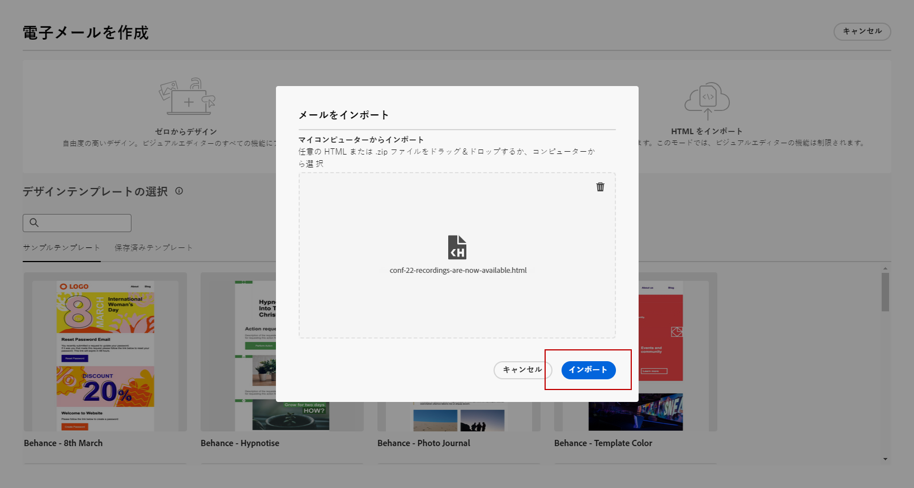

# 早期リリースノート {#e-release-notes}

[!DNL Adobe Journey Optimizer] は、新機能、既存機能の強化、およびバグ修正を継続的に提供します。[リリースノート](release-notes.md)では、すべての変更が各月の最終週にまとめられます。

以下の早期リリースノートは、リリースの公開日まで予告なく変更される場合があります。リンク、画面、更新されたドキュメントは、リリース日に[リリースノート](release-notes.md)で公開されます。

## 2023年7月早期リリースノート {#july-rn-2023}

**リリース日**：7月26～27日（PT）

### 新機能{#july-2023-features}

このリリースでは、以下に示す新機能が導入されています。

<table>
<thead>
<tr>
<th><strong>オーディエンス構成</strong> </th>
</tr>
</thead>
<tbody>
<tr>
<td>

コンポジションワークフローを作成して既存の Adobe Experience Platform オーディエンスをビジュアルキャンバスに組み合わせたり、様々なアクティビティ（分割、除外など）を活用して新しいオーディエンスを作成したりできるようになりました。新しく作成したオーディエンスは、既存のオーディエンスと共に Adobe Experience Platform に保存され、顧客をターゲットにする Journey Optimizer キャンペーンで活用できます。

詳しくは、<a href="../audience/get-started-audience-orchestration.md">詳細なドキュメント</a>を参照してください。

オーディエンス構成は、新しい Adobe Experience Platform の「オーディエンス」メニューに完全に統合され、オーディエンスの一元化されたポータルとして機能します。セグメントのトレンドと重複を含む新しいダッシュボードを含む参照ページを使用して、新しいインサイトを見つけ、フォルダー化やタグ付けのための組織ツールを探索できるようになりました。このエクスペリエンス内には、標準化されたオーディエンスのラベル付け用のガバナンスコントロールと、アクティベーションワークフローを管理するオーディエンスのライフサイクル管理機能が組み込まれています。この新しい管理エクスペリエンスにより、1 か所から簡単かつ安全にオーディエンスを管理できるようになりました。詳しくは、<a href="https://experienceleague.adobe.com/docs/experience-platform/segmentation/ui/overview.html?lang=ja" target="_blank">Adobe Experience Platform ドキュメント</a>を参照してください。

</td>
</tr>
</tbody>
</table>

<!--table>
<thead>
<tr>
<th><strong>Direct mail channel</strong> </th>
</tr>
</thead>
<tbody>
<tr>
<td>

You can now add direct mail messages in your campaigns. Direct mail is an offline channel that allows you to personalize and generate the files required by direct mail providers to send mail to your customers.

When you prepare a direct mail delivery, Journey Optimizer generates a file including all the targeted profiles and the chosen contact information (postal address for example). You will then be able to send this file to your direct mail provider who will take care of the actual sending.

For more information, refer to the <a href="../direct-mail/create-direct-mail.md">detailed documentation</a>.

</tr>
</tbody>
</table-->

<table>
<thead>
<tr>
<th><strong>メールデザイナー用の HTML コンテンツの変換</strong> </th>
</tr>
</thead>
<tbody>
<tr>
<td>

Journey Optimizer のメールエディターで、HTML コンテンツを読み込んで変換できるようになりました。コンテンツブロックは自動的に識別され、メールデザイナーで使用できます。その強力なデザイン機能を使用して、更新とパーソナライズを行います。

<!--p>For more information, refer to the <a href="../audience/get-started-audience-orchestration.md">detailed documentation</a>.</p-->
</td>
</tr>
</tbody>
</table>

<table>
<thead>
<tr>
<th><strong>Journey Optimizer でのタグの使用</strong> </th>
</tr>
</thead>
<tbody>
<tr>
<td>

キャンペーンやジャーニーに加えて、Adobe Experience Platform 統合タグをランディングページ、コンテンツテンプレート、フラグメント、購読リストに割り当てることができるようになりました。これにより、簡単に分類し、すべてのリストでの検索とナビゲーションを改善できます。 

詳しくは、<a href="../start/search-filter-categorize.md#tags">詳細なドキュメント</a>を参照してください。

</td>
</tr>
</tbody>
</table>

<table>
<thead>
<tr>
<th><strong>コンテンツテンプレート API</strong> </th>
</tr>
</thead>
<tbody>
<tr>
<td>

専用 API を使用して Adobe Journey Optimizer コンテンツテンプレートを作成および管理できるようになり、既存のコンテンツシステムとシームレスに統合できます。

<!--
For more information, refer to the <a href="../start/search-filter-categorize.md#tags">detailed documentation</a>.
-->
</td>
</tr>
</tbody>
</table>

### 機能強化 {#july-2023-improvements}

このリリースでは、以下に示す機能強化が含まれています。

<!--
**Journeys**

* You can now leverage API call responses in custom actions and orchestrate your journey based on these responses.-->
* 新しいタイプのシステムアラートが導入されました。カスタムアクションが失敗した場合に通知を受信できるようになりました。—>

**キャンペーン**

* キャンペーンに関連するコンテキストイベントが、パーソナライゼーションエディターの「コンテキスト属性」メニューで使用できるようになりました。

**オーディエンス**

ジャーニーまたはキャンペーンのオーディエンスピッカーが強化され、オーディエンスの接触チャネルと更新頻度を表示する新しい列が追加されました。

オーディエンスの構成ポータルのリリースに伴い、Adobe Experience Platform と Adobe Journey Optimizer は、システムおよびドキュメント内での「オーディエンス」と「セグメント」の使用法を更新しました。

* オーディエンス：共通の特徴や行動を共有する人物、アカウント、世帯、その他のエンティティのセットです。
* セグメント定義：Adobe Experience Platform では、ターゲットオーディエンスの重要な特徴や行動の説明に使用される一連のルールです。この用語は、以前は「セグメント」と呼ばれていました。

その結果、Adobe Journey Optimizer と Adobe Experience Platform UI 内では、この新しいオーディエンスの作成と管理のパスを反映して、「セグメント」が「オーディエンス」に置き換えられるようになります。

**API**

Adobe Journey Optimizer API 認証 - アクセストークンを生成する JWT メソッドは非推奨（廃止予定）となりました。すべての新しい統合は、OAuth サーバー間認証方法を使用して作成する必要があります。また、アドビでは、既存の統合を OAuth 方法に移行することをお勧めします。[詳細情報](https://developer.adobe.com/journey-optimizer-apis/references/authentication/)

**その他の変更**

Journey Optimizerデータセットのクラウドストレージの宛先への書き出しを、パブリックベータ版としてすべてのお客様が利用できるようになりました。 この機能を使用すると、データセットの内容を書き出すために、クラウドストレージの場所とのライブ接続を確立できます。[詳細情報](../data/export-datasets.md)

