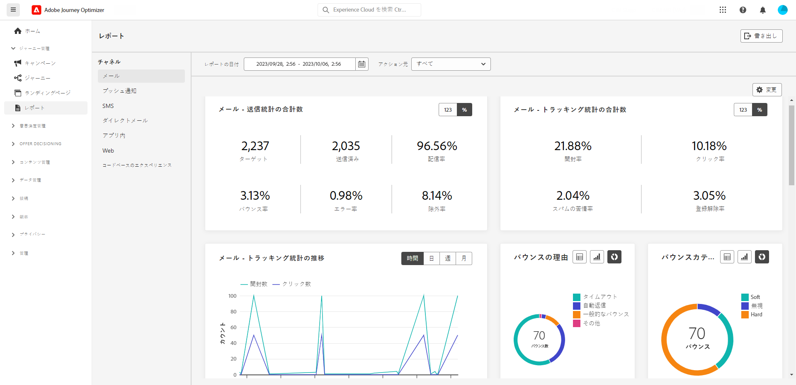

# 早期リリースノート {#e-release-notes}

[!DNL Adobe Journey Optimizer] は、新機能、既存機能の強化、およびバグ修正を継続的に提供します。[リリースノート](release-notes.md)では、すべての変更が各月の最終週にまとめられます。

以下の早期リリースノートは、リリースの公開日まで予告なく変更される場合があります。リンク、画面、更新されたドキュメントは、リリース日に[リリースノート](release-notes.md)で公開されます。

## 2023年9月早期リリースノート {#sept-rn-2023}

**リリース日**：2023年9月26～27日（PT）

### 新機能{#sept-2023-features}

このリリースでは、以下に示す新機能が導入されています。

<table>
<thead>
<tr>
<th><strong>統合されたチャネルレポート</strong> </th>
</tr>
</thead>
<tbody>
<tr>
<td>

チャネルレポート機能は、チャネルレベルでのトラフィックとエンゲージメント指標の包括的な概要をアナリストやマーケターに提供します。「レポート」メニューにアクセスするには、「チャネルレポートを表示」する権限が必要です。

<!--p>For more information, refer to the <a href="../in-app/get-started-in-app.md">detailed documentation</a>.</p-->
</tr>
</tbody>
</table>

<table>
<thead>
<tr>
<th><strong>データセットの書き出し先（GA）</strong> </th>
</tr>
</thead>
<tbody>
<tr>
<td>

Journey Optimizer データセットのクラウドストレージの宛先への書き出しが一般提供されるようになりました。この機能を使用すると、データセットの内容を書き出すために、クラウドストレージの場所とのライブ接続を確立できます。

<!--p>For more information, refer to the <a href="../audience/get-started-audience-orchestration.md">detailed documentation</a>.</p-->
</td>
</tr>
</tbody>
</table>

<table>
<thead>
<tr>
<th><strong>サンドボックスごとのモバイルアプリケーション資格情報ストレージ</strong> </th>
</tr>
</thead>
<tbody>
<tr>
<td>

この新機能を使用すると、プッシュ資格情報を簡単に管理し、アプリサーフェスの専用サンドボックスに関連付けることができます。

詳しくは、<a href="../in-app/inapp-configuration.md">詳細なドキュメント</a>を参照してください。

</tr>
</tbody>
</table>

<table>
<thead>
<tr>
<th><strong>計算属性</strong> </th>
</tr>
</thead>
<tbody>
<tr>
<td>

計算属性を使用すると、直感的なユーザーインターフェイスを通じてイベントデータをプロファイル属性に簡単に要約でき、動作ベースのセグメント化、パーソナライゼーション、アクティベーションを強化できます。この機能を使用すると、計算属性をセルフサービス方式で作成して管理し、セグメント化、リアルタイム顧客プロファイルの宛先、Journey Optimizer で使用できます。  
また、計算属性を使用すると、セグメント化とジャーニーのワークフローが簡素化され、関連するエクスペリエンスをシームレスに提供できます。詳しくは、<a href="https://experienceleague.adobe.com/docs/experience-platform/profile/computed-attributes/overview.html?lang=ja">詳細なドキュメント</a>を参照してください。

</tr>
</tbody>
</table>

### 機能強化 {#sept-2023-improvements}

このリリースでは、以下に示す機能強化が含まれています。

<!--**Audiences**

* You can now target audiences uploaded from a CSV file into journeys and campaigns.
* You can now target audiences resulting from composition workflows into journeys. -->

**パーソナライゼーション**

* ビジュアルフラグメントに加えて、Journey Optimizer インターフェイスから式エディターを通じて式フラグメントを作成、保存、再利用できるようになりました。式フラグメントは、以前に保存した式を置き換えます。

**アラート**

* 新しいタイプのシステムアラートが導入されました。オーディエンスの読み取りが失敗した場合に通知を受信できるようになりました。

**Web チャネル**

* Web デザイナービジュアルエディターで単一アプリケーション（SPA）を作成できるようになりました。これにより、web ページの変更を適用する特定のビューを選択できます。ビューは、サイト全体またはサイト上のビジュアル要素のグループ（ホームページ、製品サイト全体、すべてのチェックアウトページの配信設定フレームなど）として定義できます。SPA で Adobe Journey Optimizer web キャンペーンを作成して実行するには、Adobe Experience Platform Web SDK 実装でビューを定義するために、開発者の 1 回限りの設定が必要です。

* Web デザイナーを使用してページを編集する際、コンポーネントを選択してデザイナーインターフェイスから編集しなくても、**変更**&#x200B;パネルから直接コンテンツに新しい変更を追加できるようになりました。
* Web サブドメインを設定する際に、Adobe に既にデリゲートされているサブドメインを使用することに加えて、独自のサブドメインを追加するオプションが追加されました。

**ジャーニー**

* カスタムアクション応答のサポートは、現在一般提供（GA）されています。これにより、カスタムアクションで API 呼び出し応答を活用し、これらの応答に基づいてジャーニーを調整できます。さらに、すべてのカスタムアクションを（エンドポイントあたり）毎秒 5000 件の呼び出しに制限するための新しいガードレールが追加されました。
* ジャーニーを複製する際に、ジャーニーのコピーの名前を定義できるようになりました。

<!--
* The maximum duration that you can define in the Wait activity is now 29 days instead of 30.
-->

**メールチャネル**

メールサーフェス設定の新しいオプションを使用すると、メールアドレスが Adobe Journey Optimizer の抑制リストに記載されている場合でも、トランザクションメッセージをプロファイルに送信することを選択できます。

**SMS チャネル**

2 つの新しいフィールド、「**オプトインメッセージ**」と「**ヘルプメッセージ**」を API 設定画面に追加し、ユーザーが受信キーワードの応答をカスタマイズできるようになりました。これは、Sinch SMS プロバイダーでのみ使用できます。

**レポート**

Journey Optimizer レポートを CSV ファイルとして書き出せるようになりました。[詳細情報](../reports/global-report.md#export-reports)

<!--**Decision management**

Enhancements have been made to the audience picker in journeys or campaigns, with the addition of new columns displaying the origin and update frequency of audiences.    -->
