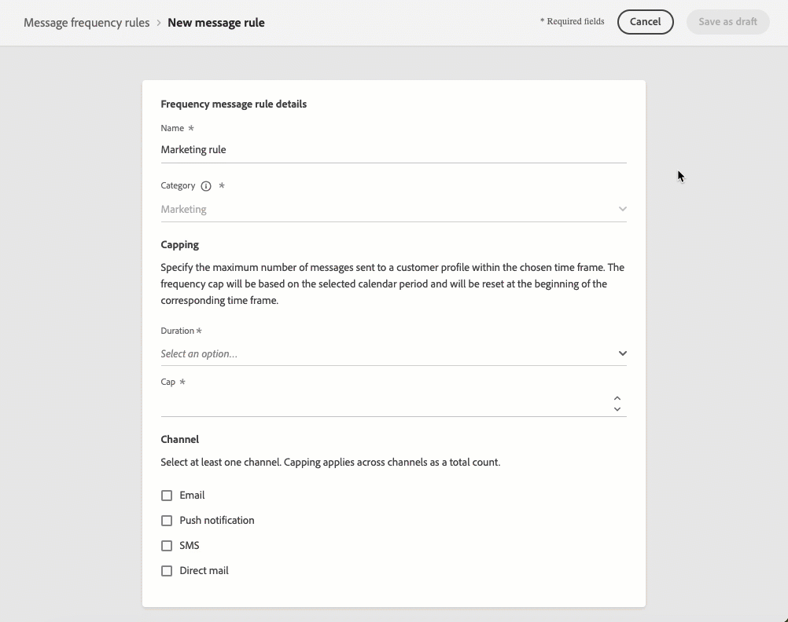

# 早期リリースノート {#e-release-notes}

[!DNL Adobe Journey Optimizer] は、新機能、既存機能の強化、およびバグ修正を継続的に提供します。[リリースノート](release-notes.md)では、すべての変更が各月の最終週にまとめられます。

以下の早期リリースノートは、リリースの公開日まで予告なく変更される場合があります。リンク、画面、更新されたドキュメントは、リリース日に[リリースノート](release-notes.md)で公開されます。

## 2024年2月早期リリースノート {#e-2024}

**リリース日**：2024年2月21～22日（PT）

### 新機能{#e-features}

このリリースでは、以下に示す新機能が導入されています。

<table>
<thead>
<tr>
<th><strong>Web アプリ内メッセージ</strong> </th>
</tr>
</thead>
<tbody>
<tr>
<td>

新しい web アプリ内メッセージ機能を使用して、モーダルオーバーレイメッセージを通じてパーソナライズされたコンテンツを web サイトに直接表示できるようになりました。この機能により、web 訪問者と効果的に関わり、ユーザーインタラクション、定着率およびコンバージョン率を向上させることができます。  

</tr>
</tbody>
</table>

<table>
<thead>
<tr>
<th><strong>SMS とダイレクトメールの頻度ルール</strong> </th>
</tr>
</thead>
<tbody>
<tr>
<td>

SMS チャネルとダイレクトメールチャネルの頻度ルールを作成できるようになりました。頻度ルールでは、フリークエンシーキャップに達すると、過度に要求されたプロファイルをメッセージとアクションから自動的に除外します。   

</tr>
</tbody>
</table>

### 機能強化 {#e-improvements}

このリリースでは、以下に示す機能強化が含まれています。

**オーディエンス**

* **シードリスト** - **シードリスト**&#x200B;の使用時にバリアントがサポートされるようになりました。ターゲットオーディエンスからの各プロファイルと同様に、シードアドレスは、同じメッセージのすべてのバリアント（コンテンツ実験の異なる処理など）のコピーを受信します。

以前はベータ版として提供されていましたが、現在は次の機能強化がすべてのユーザーに提供されています。

* **オーディエンスコンポジションを通じて作成されたオーディエンス**&#x200B;をターゲットにし、ジャーニーのエンリッチメント属性を活用できるようになりました。[詳細情報](../building-journeys/read-audience.md)

* **CSV ファイルからアップロードされたオーディエンス**&#x200B;を、ジャーニーやキャンペーンにターゲットできるようになりました。[詳細情報](../audience/about-audiences.md#segments-in-journey-optimizer)

  >[!AVAILABILITY]
  >
  >* オーディエンス構成とカスタムアップロード（CSV ファイル）からのオーディエンスと属性の使用は、現在、Healthcare Shield または Privacy and Security Shield では使用できません。
  >* CSV ファイルからのオーディエンスアップロードの機能強化は、初回リリース後の数日間にわたって段階的にロールアウトされる予定です。即時にアクセスできるユーザーもいますが、自分のアカウントで使用できるようになるまでに遅延が生じる場合があります。

**ジャーニー**

* **ジャーニーをフィルタリング** - 既存の定義済み日付フィルターに加えて、**カスタム日付を使用してジャーニーインベントリをフィルタリング**&#x200B;できるようになりました。これにより、特定の日付、特定の月内、年間全体、指定した期間内に作成または公開されたジャーニーを表示することで、リストを絞り込むことができます。
* **カスタムアクション** - **content-type** ヘッダーを更新できるようになりました。この新しい **content-type** は JSON コンテンツを参照する必要があります。
* **設定** - stepEvents のidentityMap 属性が事前に入力されるようになりました。プライマリ ID は「primary = true」として定義されます。
* **ユーザーインターフェイス** - エクスペリエンスを向上させるために、ジャーニー画面の上部バーが再編成されました。様々な更新が行われるなか、ジャーニーのプロパティにアクセスできる「鉛筆」アイコンが、上部バーの左側、ジャーニー名の横に表示されるようになりました。

**SMS チャネル**

* **オプトイン／オプトアウトのキーワード** - SMS チャネルを設定する際に、環境設定に従って&#x200B;**オプトインおよびオプトアウトキーワード**&#x200B;をカスタマイズできるようになりました。Journey Optimizer は、これらの指定されたキーワードに基づいて応答をトリガーします。

**キャンペーン**

* **API トリガーキャンペーン** - API トリガーのキャンペーンをアクティブ化した後に生成される cURL コードが強化されました。メッセージで使用されるすべてのパーソナライゼーション（プロファイルとコンテキスト）変数が含まれるようになりました。

**意思決定管理**

* **キャッピングルール** - 1 つのオファーに対して&#x200B;**複数のキャッピングルール**&#x200B;を追加できるようになりました。これにより、オファーの送信方法に対する制御レベルを向上させることができます。

**コンテンツテンプレート**

* **サムネール** - **サムネール表示**&#x200B;がコンテンツテンプレートとフラグメントに対して使用できるようになり、視覚的なアクセスが向上しました。

  >[!AVAILABILITY]
  >
  >この機能は、少数の顧客向けに限定提供（LA）でリリースされています。

* **マルチチャネルテンプレート** - コンテンツテンプレートは、web を除く&#x200B;**すべてのチャネル**&#x200B;で使用できるようになりました。メールの場合、タイプ（HTML またはコンテンツ）を選択できるようになりました。
