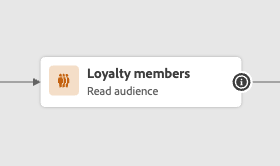
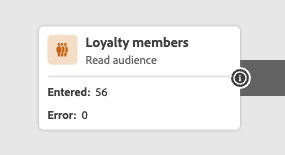

# 改善されたジャーニー designer へようこそ {#new-canvas}

Journey Optimizerでは、ユーザーエクスペリエンスと社内プロセスの改善を目的とした&#x200B;**簡素化されたジャーニーモデル**&#x200B;を提供するようになりました。 4月リリース以降では、次の機能を利用できます。

* 近代化されたUI エクスペリエンスのために作成された&#x200B;**再設計されたジャーニーキャンバス**
* ジャーニーキャンバスで直接利用できる&#x200B;**ライブレポート** UI

>[!NOTE]
>
>この機能のロールアウトはプログレッシブになります。 すぐに変更内容が表示されない場合があります。

## ジャーニーモデルの更新

新しいジャーニーモデルは既存のジャーニーモデルと一緒に存在します。つまり、**2つの異なるモデル**&#x200B;を使用するジャーニーが存在します。

* レガシーモデル
* 新しいモデル

レガシーモデル内のすべてのジャーニーは維持されます。 引き続き、編集、テスト、または公開できます。 従来のモデルのジャーニーから作成された新しいバージョンも、そのモデルに残ります。 これらのジャーニーには&#x200B;**機能的な変更**&#x200B;はありません。

下のスクリーンショットに示すように、ノードは丸みを帯びています。これは、レガシーモデルのジャーニーの古いUIです。

ただし、**新しいジャーニーを作成**&#x200B;または&#x200B;**既存のジャーニーを複製**&#x200B;すると、新しいモデルになります。 多くの顧客が新しいモデルに移行するまで、従来のモデルでのジャーニーは引き続きサポートされます。

新しいジャーニーモデルには1つの制限があります。従来のモデルから新しいモデルにアクティビティを&#x200B;**コピーして貼り付けることはできず、その逆も**&#x200B;です。 これを行う場合は、従来のジャーニーを複製して新しいモデルに切り替え、アクティビティをコピーすることをお勧めします。

以下のスクリーンショットでは、ジャーニーキャンバス用に再設計されたUIを確認できます（新しいモデルでのみ使用可能）。

**ジャーニーデザイナーに追加された新しい機能（ライブレポートを含む）は、この時点から新しいモデルのジャーニーでのみ使用できます。**

## ジャーニーキャンバスのデザインの改善

新しいジャーニーモデルでは、Adobe Experience Cloud ソリューションとアプリのエコシステムにシームレスに適合し、直感的で効率的なユーザーエクスペリエンスを実現する、改善された新しい&#x200B;**ジャーニーキャンバス UI**&#x200B;を導入します。 新しいモデルのジャーニーは、その新しいデザインになります。

アクティビティは、次の機能を備えた正方形のボックスで表されるようになりました。

* アクティビティタイプを表す最初の行は、多くの場合、よりコンテキスト情報（オーディエンスの読み取り上げ時に、選択したオーディエンスの名前が含まれます）によって上書きされます。また、オーディエンスを定義する場合は、カスタムラベルによって上書きされます。
* 2行目は常にアクティビティタイプを表します。

この新しいUIは、**わかりやすいアクティビティラベルとタイプ**&#x200B;を提供することで、ジャーニーキャンバスの読みやすさを向上させます。

また、製品チームは、クリック数を減らしながらキャンバスに関する詳細な情報を追加することができます。 「詳細」の例としては、ジャーニーキャンバスにライブレポートを含めることがあります。この場合、エラーが発生したためにアクティビティに入ったプロファイルと離脱したプロファイルを確認できます。

## ジャーニーキャンバスでのライブレポート

改善されたジャーニーキャンバスのレイアウトに加えて、ユーザーがジャーニーキャンバス内で直接ライブレポートと呼ばれる&#x200B;**過去24時間**&#x200B;のリアルタイムレポート指標を表示できるようにする新機能が導入されています。

新しいモデルを使用するライブジャーニー内の各アクティビティに対して、次のアクセス権があります。

* このアクティビティに入力したプロファイルの数。
* エラーのため、このアクティビティを終了したプロファイルの数です。

<!--
`
With every live journey on the new model, you will be able to see two types of "last 24 hours" reporting information:

* On a **new insert**, you will see:
    * The number of profiles that have been exported for audience-triggered journeys. You will see the number of profiles available in the last export job alongside the time when that export has been made.
    * The number of profiles who exited the journey
    * The percentage of errors
    
* **On each activity**, you will see the number of profiles who entered that activity and the number who exited because of an error:
    
-->
<!--
Please note that you may see differences between the number of exported profiles and the number of profiles flowing through the journey. The exported profiles count only provides information about the last export job being made while the number of profiles entering an activity only contains profiles who did it in the last 24 hours. This can especially be visible on recurring daily journeys as there could be a data overlap between two days.
-->
