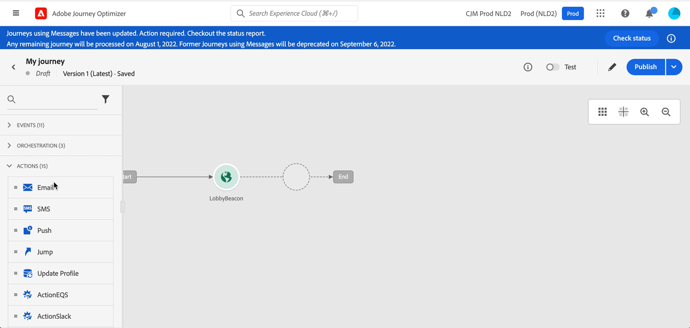

# リリースノート 2022 {#release-notes-2022}

このページは、2022年にリリースされた [!DNL Journey Optimizer] の機能と改善点をすべて一覧表示しています。

## 2022年10月リリース {#oct-2022-release}

<!--

### New capability{#oct-2022-features}

<table>
<thead>
<tr>
<th><strong>Direct Mail Channel (Limited Availability)</strong> </th>
</tr>
</thead>
<tbody>
<tr>
<td>

You can now add direct mail messages in your campaigns and journeys. Direct mail is an offline channel that allows you to personalize and generate the files required by direct mail providers to send mail to your customers.

When you prepare a direct mail delivery, Journey Optimizer generates a file including all the targeted profiles and the chosen contact information (postal address for example). You will then be able to send this file to your direct mail provider who will take care of the actual sending.

</td>
</tr>
</tbody>
</table>

-->

### 機能強化 {#oct-2022-improvements}

**ジャーニー**

* 「**繰り返し時に再エントリを強制する**」オプションを、繰り返しの「オーディエンスを読み取り」スケジュールパラメーターに追加しました。このオプションを使用すると、ジャーニーにまだ存在するすべてのプロファイルを、次回の実行時に自動的に終了させることができます。このオプションを無効にした場合、プロファイルは、別のオカレンスに再エントリする前に、ジャーニーを終了する必要があります。[詳細情報](../building-journeys/read-audience.md#configuring-segment-trigger-activity)

**管理**

* サブドメイン、ランディングページのサブドメイン、PTR レコードおよび IP プールの設定はすべてのサンドボックスに共通であるため、これらの設定のいずれかを変更すると実稼動サンドボックスにも影響することを警告するメッセージをユーザーインターフェイスに追加しました。
* 抑制リストを CSV ファイルとしてユーザーインターフェイスからアップロードする手順を変更しました。[詳細情報](../configuration/manage-suppression-list.md#download-suppression-list)

**キャンペーン**

* 完了したキャンペーンと停止したキャンペーンをアーカイブできるようになりました。[詳細情報](../campaigns/modify-stop-campaign.md#archive)

## 2022年9月リリース{#sept-2022-release}

### 新機能{#sept-2022-features}

<table>
<thead>
<tr>
<th><strong>動的コンテンツと新規条件付きルールビルダー</strong> </th>
</tr>
</thead>
<tbody>
<tr>
<td>

動的コンテンツを作成して、条件ルールに基づいてメッセージのコンテンツを適応させられるようになりました。
 

条件ルールは、式エディター内のビジュアルルールビルダーで作成し、ジャーニーやキャンペーンで後から再利用するために保存できます。

詳しくは、<a href="../personalization/get-started-dynamic-content.md">詳細なドキュメント</a>を参照してください。
</td>
</tr>
</tbody>
</table>

<table>
<thead>
<tr>
<th><strong>API トリガーキャンペーン</strong> </th>
</tr>
</thead>
<tbody>
<tr>
<td>

既存のスケジュール済みキャンペーンに加えて、Journey Optimizer で API トリガーキャンペーンを作成し、API を使用して外部システムから呼び出すことができるようになりました。

これにより、パスワードのリセットや OTP トークンなど、運用上のメッセージおよびトランザクションメッセージの様々なニーズに対応できます。

詳しくは、<a href="../campaigns/api-triggered-campaigns.md">詳細なドキュメント</a>を参照してください。
</td>
</tr>
</tbody>
</table>

<table>
<thead>
<tr>
<th><strong>データアクセス制御</strong> </th>
</tr>
</thead>
<tbody>
<tr>
<td>

属性ベースのアクセス制御により、管理者は特定の属性に基づいて、特定のオブジェクトへのアクセスを制御できます。 これらの属性は、オブジェクトに追加されるメタデータ（ラベルなど）にすることができます。 このリリース以降、管理者は、特定のフィールドやオブジェクト、およびそれらのフィールドやオブジェクトに対応するデータのみにアクセスできるユーザーの役割を定義することもできます。

 属性ベースのアクセス制御の使用は、現在、選択した顧客に限定されており、将来のリリースですべての環境にデプロイされます。

詳しくは、<a href="../administration/object-based-access.md">詳細なドキュメント</a>を参照してください。
</td>
</tr>
</tbody>
</table>

<table>
<thead>
<tr>
<th><strong>データガバナンスとプライバシー</strong> </th>
</tr>
</thead>
<tbody>
<tr>
<td>

Data Usage Labeling and Enforcement（DULE）ガバナンスフレームワークにより、Journey Optimizer は Adobe Experience Platform ガバナンスポリシーを活用して、機密フィールドがカスタムアクションを通じてサードパーティのシステムにエクスポートされるのを防ぐことができるようになりました。制限されたフィールドがカスタムアクションパラメーターで特定されると、エラーが表示され、ジャーニーの公開ができなくなります。

Data Usage Labeling and Enforcement（DULE）の使用は、現在、選択した顧客に限定されており、将来のリリースですべての環境にデプロイされます。

詳しくは、<a href="../action/action-privacy.md">詳細なドキュメント</a>を参照してください。
</td>
</tr>
</tbody>
</table>

<table>
<thead>
<tr>
<th><strong>自動同意適用（同意ポリシー）</strong> </th>
</tr>
</thead>
<tbody>
<tr>
<td>

Adobe Experience Platform では、顧客の同意設定に従ってマーケティングポリシーを簡単に採用および実施できます。同意ポリシーは、Adobe Experience Platform で定義されます。Journey Optimizer では、これらの同意ポリシーをカスタムアクションに適用できます。例えば、メール、プッシュまたは SMS 通信の受信に同意しない顧客を除外する同意ポリシーを定義できます。

自動同意適用は、現在、Healthcare Shield アドオン機能を購入した組織でのみ利用できます。

詳しくは、<a href="../action/consent.md">詳細なドキュメント</a>を参照してください。
</td>
</tr>
</tbody>
</table>

<table>
<thead>
<tr>
<th><strong>権限管理</strong> </th>
</tr>
</thead>
<tbody>
<tr>
<td>

Journey Optimizer では、機能およびオブジェクトの権限を管理するためのユーザーの役割およびアクセスポリシーの定義をサポートしています。<strong>Adobe Experience Cloud の権限</strong>を通じて、役割を作成および管理すると共に、それらの役割に対して必要なリソース権限を割り当てることができます。また、権限では、特定の役割に関連付けられたラベル、サンドボックス、ユーザーを管理することもできます。

 権限の使用は、現在、選択したユーザーに限定されており、将来のリリースですべての環境にデプロイされます。

詳しくは、<a href="../administration/attribute-based-access.md">詳細なドキュメント</a>を参照してください。
</td>
</tr>
</tbody>
</table>

<table>
<thead>
<tr>
<th><strong>アラートと監視</strong> </th>
</tr>
</thead>
<tbody>
<tr>
<td>

Journey Optimizer のユーザーは、ユーザーインターフェイスを通じてシステムアラートにアクセスして、ジャーニーが想定どおりに動作しない場合に通知を受け取れるようになりました。使用可能なアラートを確認し、購読できます。このリリースで使用できる最初のアラートは、定義された時間枠内に「オーディエンスを読み取り」アクティビティがプロファイルを処理しなかった場合に警告します。このワークフローのロックが解除されると、さらに多くの情報が表示されます。

<!--p>For more information, refer to the <a href="../reports/alerts.md">detailed documentation</a>.</p-->
</td>
</tr>
</tbody>
</table>

<!--table>
<thead>
<tr>
<th><strong>Data Hygiene</strong> </th>
</tr>
</thead>
<tbody>
<tr>
<td>

Adobe Experience Platform provides a suite of data hygiene capabilities that allow you manage your stored data through programmatic deletions of consumer records and datasets. This capability is now available for Adobe Journey Optimizer. 

You can manage your data stores to ensure that information is used as expected, is updated when incorrect data needs fixing, and is deleted when organizational policies deem it necessary.

<strong>Caution</strong> - Data Hygiene capabilities are currently only available for organizations that have purchased the Healthcare Shield add-on offering.

For more information, refer to the <a href="../building-journeys/read-audience.md#configuring-segment-trigger-activity">detailed documentation</a>.
</td>
</tr>
</tbody>
</table-->

### 機能強化{#sept-2022-improvements}

**ジャーニー**

* この&#x200B;**エンティティデータセット**&#x200B;は、Adobe Journey Optimizer の標準のデータセットとして使用できるようになりました。この参照データセットには、トラッキングとフィードバックのデータセット情報を強化するメタデータが含まれています。これにより、より分かりやすいデータを使用して、レポートやクエリを改善できます。 [詳細情報](../data/datasets-query-examples.md#entity-dataset)
* 同じイベントに対してジャーニーが誤って複数回トリガーされるのを防ぐために、新しいガードレールが（イベントまたはオーディエンスの選定で始まる）単一ジャーニーに追加されました。プロファイルの再エントリは、デフォルトで一時的に（5 分間）ブロックされるようになりました。[詳細情報](../start/guardrails.md#events-g)

**管理**

* 許可リストをアクティブ化または非アクティブ化すると、新しい警告が表示され、各アクションの影響の詳細を確認できるようになりました。[詳細情報](../configuration/allow-list.md#enable-allow-list)
* チャネル設定の作成、IP プールの作成、抑制リストと許可リストの管理、SMS チャネルの設定を行うためのユーザーインターフェイスが更新されました。
* 指定したサブドメインに対して最初のチャネル設定を作成する場合、処理時間は 10 分から 10 日かかり、そのサブドメインを使用する後続のサーフェスに対しては最大 3 時間かかります。[詳細情報](../configuration/channel-surfaces.md#create-channel-surface)
* ランディングページプリセットとランディングページサブドメインの作成を行うためのユーザーインターフェイスが更新されました。[詳細情報](../landing-pages/lp-subdomains.md)

**監査制御**

* Journey Optimizer を使用すると、キャンペーン、ジャーニー、メッセージ、ランディングページなど、様々なサービスや機能に対してシステム内のユーザーが実行したアクションを識別できます。監査ログリソースには、その他の様々なアクションに対する変更が含まれるようになり、アクティビティが発生すると自動的に記録されます。詳しくは、[このページ](../privacy/audit-logs.md)を参照してください。

**アーカイブのサポート**

* 新しい&#x200B;**エンティティデータセット**&#x200B;には、アーカイブ目的で、すべてのチャネルにおける送信済みメッセージのフォーマット広告構造を書き出すことができるテンプレートフィールドが含まれています。[詳細情報](../configuration/archiving-support.md)

**ランディングページ**

* 同じランディングページ内の別のページから取得したコンテキストデータを使用できるようになりました。例えば、チェックボックスをプライマリランディングページのサブスクリプションリストにリンクさせた場合は、「ありがとうございました」サブページでそのサブスクリプションリストを使用できます。[詳細情報](../landing-pages/lp-content.md#use-primary-page-context)

<!--* When configuring the primary page, you can now create additional data to enable storing information when the landing page is being submitted. [Learn more](../landing-pages/lp-content.md#use-additional-data)-->

<!--* You can now use information that was submitted on a landing page to send communications to your customers. For example, if a user subscribes to a given subscription list, you can leverage that information to send an email recommending other subscription lists to that user.-->

### その他の変更{#sept-2022-other}

* ジャーニーバーストモードは、Campaign 迅速配信モードに置き換えられました。[詳細情報](../push/create-push.md#rapid-delivery)
* パフォーマンスを向上させるために、オーディエンスを読み取り、オーディエンスの選定またはビジネスイベントアクティビティで始まるジャーニーでは、エクスペリエンスイベントフィールドグループを使用できなくなりました。この変更は、新しいジャーニーにのみ適用されます。既存のジャーニーは、現在の動作を維持します。[詳細情報](../start/guardrails.md#expression-editor)
* スケジュールされた「オーディエンスを読み取り」ジャーニーの 1 時間の制限が削除されました。これらのジャーニーは遅延なく実行できるようになりました。

## 2022年8月リリース {#aug-2022-release}

### 新機能

<table>
<thead>
<tr>
<th><strong>Journey Optimizer でのキャンペーンの作成と管理</strong> </th>
</tr>
</thead>
<tbody>
<tr>
<td>

Journey Optimizer キャンペーンを使用すると、様々なチャネルを使用して、特定のオーディエンスに 1 回限りのコンテンツを配信できます。ジャーニーを使用する場合、アクションはシーケンスで順番に実行されるように設計されています。 キャンペーンでは、アクションは指定したスケジュールに基づいて同時にまたは即時に実行されます。 

キャンペーンを作成する方法を<a href="../campaigns/get-started-with-campaigns.md">詳細なドキュメント</a>および<a href="https://video.tv.adobe.com/v/346680">機能に関するビデオ</a>で説明します。
</td>
</tr>
</tbody>
</table>

<table>
<thead>
<tr>
<th><strong>ユーザーへの SMS の送信（一般公開）</strong> </th>
</tr>
</thead>
<tbody>
<tr>
<td>

<b>Sinch</b> または <b>Twilio</b> との統合を使用して、Journey Optimizer で SMS の作成、パーソナライズおよび送信ができるようになりました。

SMS の作成および送信方法については、こちらの<a href="../sms/create-sms.md">詳細ドキュメント</a>を参照してください。

</td>
</tr>
</tbody>
</table>

<!--table>
<thead>
<tr>
<th><strong>New Dynamic Expression Builder</strong> </th>
</tr>
</thead>
<tbody>
<tr>
<td>

You can now create conditional content blocks across different authoring services to personalize your content.

In addition to the Personalization Expression Library, the Expression Editor provides a new Conditional Rule Builder to help you design and save your content blocks.

For more information, refer to the <a href="../building-journeys/read-audience.md#configuring-segment-trigger-activity">detailed documentation</a>.
</td>
</tr>
</tbody>
</table-->

### 機能強化

**レポーティング**

* 同意ポリシーのテーブルとグラフがジャーニーのグローバルレポートで使用できるようになりました。これらのウィジェットを使用すると、カスタムアクションでポリシーから除外されたプロファイルをトラックできます。[詳細情報](../reports/journey-global-report-cja.md#journey-global)

  最新のウィジェットにアクセスするには、異なるレポートダッシュボードをリセットする必要があることに注意してください。ダッシュボードのカスタマイズについて詳しくは、[詳細ドキュメント](../reports/report-gs-cja.md)を参照してください。

**管理**

* SMS チャネルで使用するプライマリ電話番号を更新できるようになりました。[詳細情報](../configuration/primary-email-addresses.md)

## 2022年7月リリース {#july-2022-release}

### 新機能

<table>
<thead>
<tr>
<th><strong>新しいインラインメッセージフロー</strong> </th>
</tr>
</thead>
<tbody>
<tr>
<td>

Journey Optimizer では、メッセージをオーサリングするための新しいフローがジャーニーで提供されるようになりました。 インラインメッセージにより、ユーザーの時間を大幅に節約し、Journey Optimizer でメール、プッシュ通知または SMS を作成して配信するためのワークフロープロセスを合理化します。メッセージを別の手順として削除し、代わりにジャーニーキャンバス上でのアクションの一部としてインラインで編集できるようにすると、ユーザーがコンテンツをデザインおよび編集するためにクリックするボタンや、ナビゲートする画面が少なくて済みます。

</td>
</tr>
</tbody>
</table>

<table>
<thead>
<tr>
<th><strong>属性ベースのアクセス制御（使用制限あり）</strong> </th>
</tr>
</thead>
<tbody>
<tr>
<td>

組織またはデータの使用範囲を定義するラベルが付いたスキーマフィールドを識別できるようになりました。 管理者は、権限インターフェイスを使用して、XDM スキーマフィールドをカバーするアクセスポリシーを定義し、ユーザーまたはユーザーのグループ（内部、外部、またはサードパーティのユーザー）に付与するアクセス権をより適切に管理し、特定の種類のデータ（機密性の高い個人データ／SPD など）へのアクセスを管理できます。

属性ベースのアクセス制御の使用は、現在、選択したユーザーに制限されており、将来のリリースですべての環境にデプロイされます。

詳しくは、<a href="../administration/attribute-based-access.md">詳細なドキュメント</a>を参照してください。

</td>
</tr>
</tbody>
</table>

<table>
<thead>
<tr>
<th><strong>Batch Decisioning ジョブ</strong> </th>
</tr>
</thead>
<tbody>
<tr>
<td>

ユーザーインターフェイスからバッチ決定ジョブを実行できるよりました。これにより、開発者はバッチ API ジョブを実行する必要がなくなり、マーケティングに必要な時間を短縮できます。この新しいインターフェイスでは、ジョブを作成し、現在／過去のジョブを管理できます。

詳しくは、<a href="../offers/batch-delivery.md">詳細なドキュメントを参照してください。

</td>
</tr>
</tbody>
</table>

<table>
<thead>
<tr>
<th><strong>最もパフォーマンスの高いオファーを意思決定で自動的に使用（利用制限あり）</strong> </th>
</tr>
</thead>
<tbody>
<tr>
<td>

意思決定管理で、パーソナライズされた最適化モデルシステムを使用できるようになりました。この新しいタイプのモデルを使用すると、オーディエンスとオファーのパフォーマンスに応じて、オファーを最適化およびパーソナライズできます。

パーソナライズされた最適化 AI モデルの使用は、現在、選択したユーザーに制限されており、将来のリリースですべての環境にデプロイされます。

詳しくは、 <a href="../offers/ranking/personalized-optimization-model.md">詳細なドキュメント</a>を参照してください。

</td>
</tr>
</tbody>
</table>

### 機能強化

**ジャーニー**

* **ジャーニーの終了** - ジャーニーキャンバスで、**終了**&#x200B;アクティビティがパレットから削除されました。デフォルトで終了タグが各パスの最後に追加され、削除できなくなりました。この機能強化により、どこで顧客がジャーニーから離脱したのか、ジャーニーの実務担当者が何もしなくても、より適切にレポートできるようになりました。詳しくは、[ドキュメント](../building-journeys/end-journey.md)および[機能に関するビデオ](https://video.tv.adobe.com/v/345376){target="_blank"}を参照してください。

* ジャーニープロパティで「**プロファイルのタイムゾーン**」オプションは、デフォルトではオフになっています。[詳細情報](../building-journeys/timezone-management.md#timezone-from-profiles)

**メッセージ**

* メッセージプリセットは&#x200B;**チャネル設定**&#x200B;になりました。[詳細情報](../configuration/channel-surfaces.md)

**管理**

* **PTR レコードの編集** - PTR レコードを更新する際の処理時間が、最大でわずか 3 時間になりました。[詳細情報](../configuration/ptr-records.md#processing)

* **許可リスト UI** - Journey Optimizer ユーザーインターフェイスを使用して、新しいメールアドレスまたはドメインを許可リストに追加できるようになりました。[詳細情報](../configuration/allow-list.md)

* **許可リストロジックの更新** - リストが空でも、機能が有効になるとすぐに許可リストロジックが適用されるようになりました。[詳細情報](../configuration/allow-list.md#logic)

* **URL トラッキングパラメーター** - 式エディターを使用して、電子メールサーフェスで URL トラッキングパラメーターを設定できるようになりました（プリセット）。[詳細情報](../email/email-settings.md#url-tracking)

**意思決定管理**

* **オーディエンスサイズ** - 決定ルールの作成時、オファーの実施要件を設定するオーディエンスやルールの選択時または決定範囲へのオーディエンスやルールの追加時に、新しいオーディエンスサイズ推定コンポーネントがユーザーインターフェイスに表示されるようになりました。

## 2022年6月リリース {#june-2022-release}

### 新機能

<table>
<thead>
<tr>
<th><strong>ユーザーへの SMS の送信（使用制限あり）</strong> </th>
</tr>
</thead>
<tbody>
<tr>
<td>

<b>Sinch</b> または <b>Twilio</b> との統合を使用して、Journey Optimizer で SMS の作成、パーソナライズおよび送信ができるようになりました。

<!--img src="assets/do-not-localize/SMS.gif"/-->

SMS チャネルは現在、一連の組織でのみ使用できます（使用制限があります）。 詳しくは、アドビ担当者にお問い合わせください。

SMS の作成および送信方法については、この<a href="../sms/create-sms.md">詳細なドキュメント</a>を参照してください。

</td>
</tr>
</tbody>
</table>

<table>
<thead>
<tr>
<th><strong>Adobe Stock との統合による効果的な画像の迅速な検索</strong> </th>
</tr>
</thead>
<tbody>
<tr>
<td>

Adobe Stock と Adobe Journey Optimizer E メールデザイナーの統合プラグインを使用すると、メッセージオーサリングで使用する画像のナビゲーション、ライセンス取得および保存を簡単に行うことができます。  新しい「<b>類似のストックフォトを検索</b>」オプションを使用すると、画像の内容、カラーおよび構成に一致するストックフォトを見つけることもできます。 

詳しくは、<a href="../integrations/stock.md">詳細なドキュメント</a>を参照してください。

</td>
</tr>
</tbody>
</table>

<table>
<thead>
<tr>
<th><strong>すべてのメールでの「BCC でメールを送信」の使用</strong> </th>
</tr>
</thead>
<tbody>
<tr>
<td>

BCC（ブラインドカーボンコピー）でメールを送信機能を使用して、Adobe Journey Optimizer から送信されたメールを保存できるようになりました。メールプリセットでこのオプションを有効にして、送信されたすべてのメールが BCC アドレスにブラインドコピーされるようにします。

詳しくは、<a href="../configuration/archiving-support.md#bcc-email">詳細なドキュメント</a>を参照してください。

</td>
</tr>
</tbody>
</table>

<!--<table>
<thead>
<tr>
<th><strong>Automatically use the best performing offer in your decisions</strong> </th>
</tr>
</thead>
<tbody>
<tr>
<td>

You can now use personalized optimization model systems in Decision Management. This new type of model allows you to optimize and personalize offers based on audiences and offer performance.

The use of personalized optimization AI models is currently restricted to selected users, and will be deployed to all environments in a future release.

For more information, refer to the <a href="../offers/ranking/personalized-optimization-model.md">detailed documentation</a>.

</td>
</tr>
</tbody>
</table>-->

<table>
<thead>
<tr>
<th><strong>サンドボックス間でのオブジェクトのコピー</strong> </th>
</tr>
</thead>
<tbody>
<tr>
<td>

Journey Optimizer サンドボックスから別のサンドボックスに（例：非実稼動サンドボックスから実稼動サンドボックスに）、エクスペリエンスを再作成できるようになりました。この新しい機能では、ジャーニーが正しく実行されるために必要なオブジェクトを含め、ジャーニー全体が一方の環境からもう一方の環境にコピーされます。ジャーニーに加えて、オファー、メッセージ、スキーマ、データセット、データソース、イベント、アクションなど、他のコンポーネントもコピーできます。

詳しくは、 <a href="../building-journeys/copy-to-sandbox.md">詳細なドキュメント</a>を参照してください。
</td>
</tr>
</tbody>
</table>

### 機能強化

**意思決定管理**

* **HTML および JSON ファイルのサポート** - 外部の HTML ファイルと JSON ファイルを Adobe Experience Cloud アセットライブラリからオファー表示域のコンテンツにドラッグ＆ドロップできるようになりました。[詳細情報](../offers/offer-library/add-representations.md#html-json)

**メール**

* **テンプレートとして保存** - メールコンテンツをテンプレートとして保存し、他のメッセージを作成する際に再利用できるようになりました。[詳細情報](../content-management/content-templates.md#save-as-template)

**管理**

* **トラッキング URL パラメーターのプレビュー** - メッセージプリセットを設定する際に、URL トラッキングパラメーターを定義すると、結果として生成されるトラッキング URL の動的プレビューが表示されるようになりました。[詳細情報](../email/email-settings.md#url-tracking)

* **メッセージプリセットの編集** - メッセージプリセットを更新する際、処理時間は最大 3 時間に制限されるようになりました。[詳細情報](../configuration/channel-surfaces.md#edit-channel-surface)

* **IP プールの編集** - IP プールを更新する際、処理時間は最大 3 時間に制限されるようになりました。[詳細情報](../configuration/ip-pools.md#edit-ip-pool)

## 2022年5月リリース {#may-2022-release}

### 新機能

<table>
<thead>
<tr>
<th><strong>メッセージ頻度ルール</strong> </th>
</tr>
</thead>
<tbody>
<tr>
<td>

過度に配信を受けているプロファイルをメッセージやアクションから自動的に除外するクロスチャネルのビジネスルールを設定できるようになりました。

詳しくは、<a href="../configuration/frequency-rules.md">詳細なドキュメント</a>を参照してください。

</td>
</tr>
</tbody>
</table>

<table>
<thead>
<tr>
<th><strong>意思決定管理 - AI ランキング自動最適化モデル</strong> </th>
</tr>
</thead>
<tbody>
<tr>
<td>

意思決定管理で、トレーニング済みモデルシステムを使用できるようになりました。この新しい機能は、特定のプロファイルに対して表示するオファーをランク付けします。

詳しくは、<a href="../offers/offer-activities/configure-offer-selection.md#use-ranking-strategy">詳細なドキュメント</a>を参照してください。

</td>
</tr>
</tbody>
</table>

<!--table>
<thead>
<tr>
<th><strong>Attribute-based Access Control (ABAC)</strong> </th>
</tr>
</thead>
<tbody>
<tr>
<td>

Permission management in Journey Optimizer has been extended to data access. You can now manage data access for specific teams or groups of users (i.e. internal, external, 3rd parties) ​and manage access to specific types of data (i.e. Sensitive Personal Data/SPD).

This capability is available for a limited set of customers.

For more information, refer to the <a href="../landing-pages/create-lp.md">detailed documentation</a>.

</td>
</tr>
</tbody>
</table-->

<table>
<thead>
<tr>
<th><strong>Journey Optimizer 監査ログ</strong> </th>
</tr>
</thead>
<tbody>
<tr>
<td>

Adobe Journey Optimizer リソースでユーザーが実行したアクションを監視できるようになりました。

詳しくは、 <a href="../privacy/audit-logs.md">詳細なドキュメント</a>を参照してください。

</td>
</tr>
</tbody>
</table>

### 機能強化

**パーソナライゼーション**

* **文字を非表示にする新しいヘルパー関数** - `mask` ヘルパー関数を使用すると、文字列の一部を「X」文字に置き換えることができます。[詳細情報](../personalization/functions/string.md#mask)

**ランディングページ**

* **フォームのないランディングページ** - フォームを含まず、訪問者のアクションを必要としないランディングページを作成および公開できるようになりました。
* **ランディングページテンプレート** - ランディングページをテンプレートとして保存し、他のランディングページを作成する際に再利用できるようになりました。[詳細情報](../landing-pages/lp-templates.md)
* **プライマリページに戻る** - 同じランディングページ内の任意のサブページからプライマリページへのリンクを追加できるようになりました。
* **カスタム JavaScript のサポート** - ランディングページコンテンツにカスタム JavaScript を追加して、高度なスタイル設定を実行したり、ランディングページにカスタム動作を追加したりできるようになりました。[詳細情報](../landing-pages/lp-custom-js.md)

**ジャーニー**

* **オーディエンスを読み取り** - 1 回限りの「オーディエンスを読み取り」ジャーニーは、ジャーニーの実行から 30 日後に、完了ステータスに移行するようになりました。スケジュールされた「オーディエンスを読み取り」の場合は、最後の実行から 30 日後になります。[詳細情報](../building-journeys/read-audience.md)
* **式エディター** - [limit](../building-journeys/functions/functionlimit.md) 関数が追加され、リストの項目数を制限できるようになりました。[sort](../building-journeys/functions/functionsort.md) 関数を使用して、リストオブジェクトを並べ替えることができるようになりました。また、listObject のサポートが [discint](../building-journeys/functions/functiondistinct.md) および [distinctWithNull](../building-journeys/functions/functiondistinctwithnull.md) 関数に追加されました。

**管理**

* **ライセンス使用状況ダッシュボードの更新** - [!DNL Adobe Journey Optimizer] でユーザーインターフェイス使用できるライセンス使用状況ダッシュボードに、**ライセンス済み**&#x200B;の平均プロファイルリッチネスの正確な値を反映できるようになりました。この指標表示域にドロップが表示されます。つまり、ライセンス制限が正しくレポートされました。 [詳細情報](../audience/license-usage.md)

## 2022年4月リリース {#april-2022-release}

### 機能強化

**ランディングページ**

* **「オプトイン／オプトアウト」チェックボックスの新しいオプション** - サブスクリプションランディングページにオプトイン／オプトアウト用の単一チェックボックスを挿入できるようになりました。ユーザーは、同意（オプトイン）するにはチェックボックスをオンにし、同意を削除（オプトアウト）するにはオフにする必要があります。[詳細情報](../landing-pages/design-lp.md#define-lp-specific-content)

* **ランディングページのフィールドの事前入力** - ユーザーがランディングページのフィールドにプロファイル情報を事前入力できるようになりました。[詳細情報](../landing-pages/create-lp.md#configure-primary-page)

**意思決定管理**

* **Edge での Decisioning API** - Edge Decisioning API では、意思決定管理で管理されるパーソナライズされたオファーを配信およびレンダリングできます。意思決定管理ユーザーインターフェイス（UI）または API を使用して、オファーとその他の関連オブジェクトを作成できます。[詳細情報](../offers/api-reference/offer-delivery-api/edge-decisioning-api.md)

**管理**

* **PTR 送信時間** - PTR 編集の有効期間が数時間になりました。[詳細情報](../configuration/ptr-records.md#processing)

**メールデザイン**

* **20 個の新しいメールテンプレート**&#x200B;が Journey Optimizer でメールコンテンツをデザインするために使用できるようになりました。

**ユーザーインターフェイス**

* **Journey Optimizer UI のコンテキストヘルプ** - Journey Optimizer の複数のページにコンテキストヘルプのリンクを追加しました。「i」アイコンが使用可能な場合は、このアイコンをクリックすると、現在の機能の簡単な説明が表示され、関連記事にアクセスできます。

**Adobe Campaign Standard との統合**

Adobe Campaign Standard をご利用のお客様は、Journey Optimizer を使用してメール、プッシュ通知および SMS を送信できるようになりました。新しい組み込みアクションを使用すると、Journey Optimizer への Campaign Standard トランザクションメッセージ機能を活用できます。[詳細情報](../action/acs-action.md)

<!--
### Fixes

* Fixed an issue which caused tracking reports not to be available as the `JourneyActionId` was not properly populated. PLATIR-19854, CJM-26006
* Fixed an error on business events which could block the journey publication. CJM-25931
* Fixed an issue which could prevent images in Email Designer templates from being displayed. PLATIR-18176, CJM-25008
-->

## 2022年3月リリース {#march-2022-release}

### 機能強化

**ジャーニー**

* 統合プロファイルスキーマに不要なフィールドが含まれないようにするために、ジャーニーステップイベントスキーマはプロファイルに対してデフォルトでは有効にならなくなりました。必要に応じて、有効にすることができます。[詳細情報](../reports/sharing-overview.md)
* エクスポートジョブに関連する新しいステップイベントが、Journey Optimizer から Adobe Experience Platform に送信されるようになりました。クエリの例がドキュメントに追加されました。[詳細情報](../reports/query-examples.md)

**意思決定管理**

* すべてのユーザーまたは 1 つの特定のプロファイルに対して、およびすべてのプレースメントまたは各プレースメントに対して、オファーキャッピングを適用するかどうかを指定できるようになりました。[詳細情報](../offers/offer-library/add-constraints.md#capping)
* Batch Decisioning API を使用すると、組織は、1 回の呼び出しで特定のオーディエンスのすべてのプロファイルに対して意思決定管理機能を使用できます。オーディエンス内の各プロファイルに対するオファーコンテンツは、AEP データセットに配置され、カスタムバッチワークフローで使用できます。[詳細情報](../offers/api-reference/offer-delivery-api/batch-decisioning-api.md)

**管理**

* メールヘッダー内の登録解除リンクをメッセージプリセットレベルで有効／無効にでき、カスタム購読解除 URL をメッセージレベルで設定できるようになりました。[詳細情報](../configuration/channel-surfaces.md#list-unsubscribe)
* 許可リストは、実稼働サンドボックスと非実稼働サンドボックスの [!DNL Journey Optimizer] インターフェイスを介して、有効または無効にできるようになりました。[詳細情報](../configuration/allow-list.md#enable-allow-list)

**パーソナライゼーション**

* 40 を超えるパーソナライゼーション式をライブラリに保存できるようになりました。[詳細情報](../personalization/use-expression-fragments.md)

## 2022年2月リリース {#feb-2022-release}

### 新機能

<table>
<thead>
<tr>
<th><strong>サブスクリプションランディングページ</strong> </th>
</tr>
</thead>
<tbody>
<tr>
<td>

Journey Optimizer でランディングページを作成およびデザインし、ユーザーをオンラインフォームに誘導して、コミュニケーションの受信をオプトインまたはオプトアウトしたり、ニュースレターなどの特定のサービスに購読したりできるようになりました。

詳しくは、<a href="../landing-pages/create-lp.md">詳細なドキュメント</a>および関連する<a href="../landing-pages/lp-use-cases.md">サンプルユースケース</a>を参照してください。

</td>
</tr>
</tbody>
</table>

<table>
<thead>
<tr>
<th><strong>新規パーソナライゼーション式ライブラリ</strong> </th>
</tr>
</thead>
<tbody>
<tr>
<td>

Journey Optimizer には、事前定義されたパーソナライゼーション式にアクセスできるライブラリが用意されるようになりました。これらの式は、管理者ユーザーが設定します。

詳しくは、<a href="../personalization/use-expression-fragments.md">詳細なドキュメント</a>を参照してください。

</td>
</tr>
</tbody>
</table>

<!--table>
<thead>
<tr>
<th><strong>API Developer Site and Suppression API</strong> </th>
</tr>
</thead>
<tbody>
<tr>
<td>

Journey Optimizer provide RESTful APIs that allow you to programmatically perform key operations in your applications.
Developer SDK for Journey Optimizer is now available with the Suppression API (beta).

With this API, you can control your outgoing messages using suppression and allow lists.
The suppression list helps you with honoring the ISPs' feedback to preserve sending IP reputation. The allow list helps you ensure that you send only to those email addresses which are in the allowed list, and typically to ensure that you don't send mails to customers from your development sandbox.

See <a href="https://developer.adobe.com/journey-optimizer-apis/">Adobe Journey Optimizer APIs</a>.

</td>
</tr>
</tbody>
</table-->

<table>
<thead>
<tr>
<th><strong>UTM トラッキングパラメーターを使用してメッセージをトラッキングする情報を渡す</strong> </th>
</tr>
</thead>
<tbody>
<tr>
<td>

Journey Optimizer のメッセージコンテンツで、リンクに UTM パラメーターを追加できるようになりました。これにより、そのリンクに関する追加データが提供され、ユーザーがリンクをクリックした場所と理由を特定するのに役立ちます。

詳しくは、 <a href="../configuration/channel-surfaces.md#configure-email-settings">詳細なドキュメント</a>を参照してください。

</td>
</tr>
</tbody>
</table>

### 機能強化

**ジャーニー**

* パフォーマンスを最適化するために、1 週間トリガーされていないテストモードのすべてのジャーニーが、ドラフトステータスに戻るようになりました。[詳細情報](../building-journeys/testing-the-journey.md#important_notes)
* Journey Optimizer と Adobe Campaign v7/v8 の統合が最適化され、パフォーマンスが向上しました。キャッピングのデフォルト設定は、5 分につき呼び出し 4,000 件に変更されました。[詳細情報](../action/acc-action.md#important-notes)

**レポーティング**

* 配信は、ステータスに応じてフィルタリングできるようになりました。
   * メッセージの実行リストで、配信のリストから配達確認を除外できるようになりました。
   * ライブレポートまたはグローバルレポートから、テストイベントの除外を選択できます。

* 即時にメッセージを送信した人の数、1 時間の最適化、2 時間の最適化などでメッセージを送信した人の数などの、送信時間の最適化データに関するレポートにアクセスできるようになりました。

<!--* decision management reports are now available in Journey Optimizer. You can access the following metrics: Offers sent - Offers' impression rate - Offers' click rate - Breakdown report on Offers' sent.-->

**意思決定管理**

* ランキングと AI ランキングが 1 つのタブにグループ化されました。

## 2022年1月リリース {#january-2022-release}

### 新機能

<table>
<thead>
<tr>
<th><strong>ジャーニー - プロファイルキャップ条件による IP ランプアップの最適化</strong> </th>
</tr>
</thead>
<tbody>
<tr>
<td>

ジャーニーで<strong>条件</strong>アクティビティを設定する際、プロファイルのキャップを定義できるようになりました。この新しい条件タイプを使用すると、ジャーニーパスの最大プロファイル数を設定できます。この制限に到達すると、エントリするプロファイルは代替パスを使用します。これにより、配信の量を増やすことができます（IP ランプアップ）。例えば、1 日目に 1000 通のメッセージ、2 日目に 2000 通というように、ドメインでの実行を分割して配信を増やす場合があります。

詳しくは、<a href="../building-journeys/condition-activity.md#profile_cap">詳細なドキュメント</a>を参照してください。

</td>
</tr>
</tbody>
</table>

<table>
<thead>
<tr>
<th><strong>ジャーニー - 「オーディエンスを読み取り」の改善</strong> </th>
</tr>
</thead>
<tbody>
<tr>
<td>

<strong>増分読み取り</strong>オプションが、繰り返しの<strong>オーディエンスを読み取り</strong>アクティビティに追加されました。このオプションを使用すると、ジャーニーの最後の実行以降にオーディエンスにエントリした個人のみをターゲットにすることができます。最初の実行では、常にすべてのオーディエンスメンバーがターゲットになります。

詳しくは、 <a href="../building-journeys/read-audience.md#configuring-segment-trigger-activity">詳細なドキュメント</a>を参照してください。
</td>
</tr>
</tbody>
</table>

### 機能強化

**ジャーニー**

* Journey Optimizer ステップイベントを、[Adobe Customer Journey Analytics](https://experienceleague.adobe.com/docs/analytics-platform/using/cja-overview/cja-overview.html?lang=ja) の他のデータセットにリンクできるようになりました。ビルトイン Journey Step Event スキーマの **profileID** フィールドが、ID フィールドとして定義されるようになりました。[詳細情報](../reports/sharing-overview.md#integration-cja)

**意思決定管理**

* 公開済みメッセージ内で直接または間接的に参照されるオファー、フォールバックオファー、オファーコレクション、オファー決定を更新すると、その更新は、対応するメッセージに自動的に反映されるようになり、再公開する必要がなくなりました。[詳細情報](../offers/offers-e2e.md#insert-decision-in-email)

* 特定のテストプロファイルに配信するオファーをシミュレートする際に、デフォルトのシミュレーション設定を変更し、トラブルシューティング目的で使用できる、シミュレーションに対応したコードを表示できるようになりました。[詳細情報](../offers/offer-activities/simulation.md#define-simulation-settings)

**管理**

* 管理者は、CNAME を設定したサブドメインを使用して PTR レコードを編集できるようになりました。[詳細情報](../configuration/ptr-records.md#edit-ptr-subdomains-cname)

**パーソナライゼーション**

* **お気に入りに追加** - パーソナライゼーション使用時の効率を向上させるために、お気に入りを保存するという概念を導入しました。お気に入りメニューに異なる属性を追加すると、最も頻繁に使用する項目にすばやくアクセスできます。[詳細情報](../personalization/personalize.md#fav)
