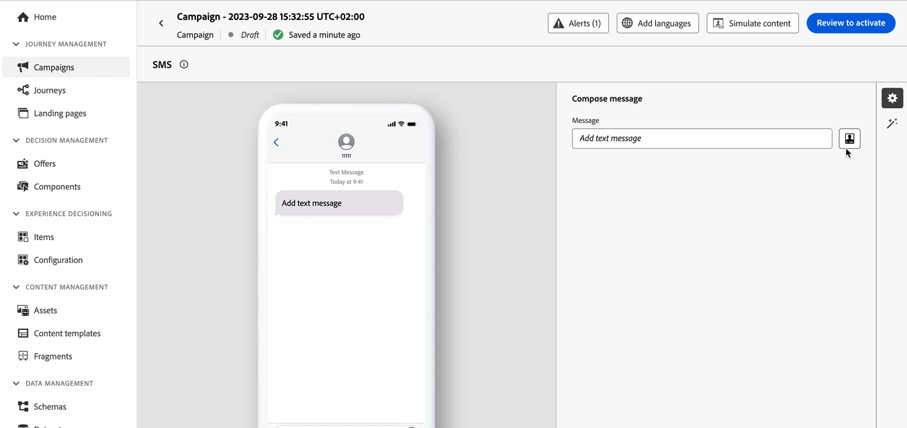
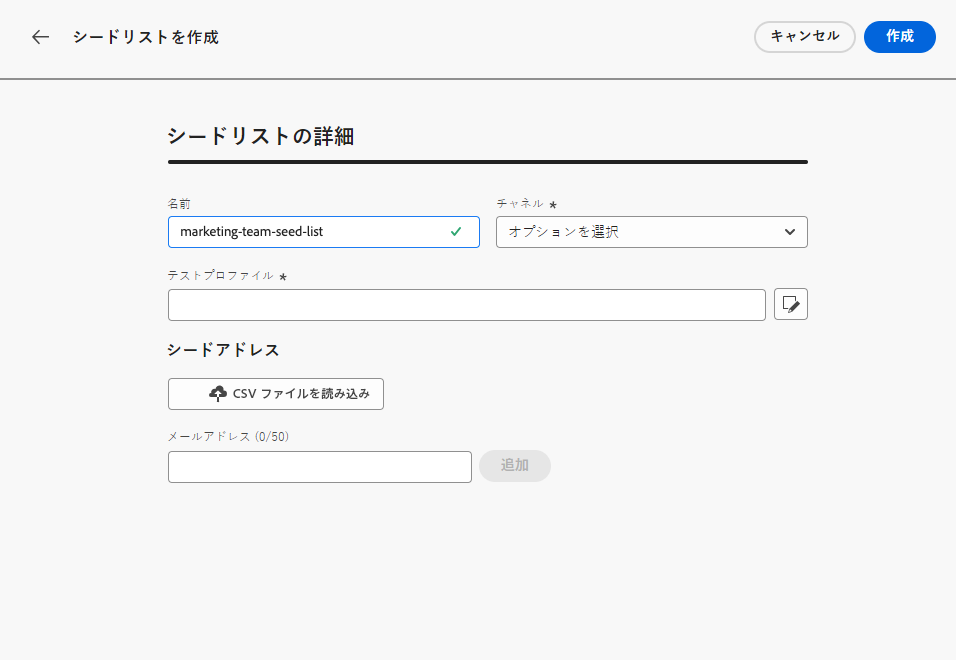
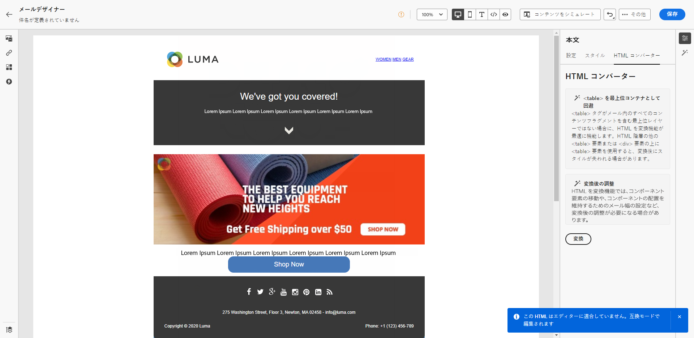

# リリースノート 2023 {#release-notes-2023}

このページでは、2023年にリリースされた [!DNL Journey Optimizer] の機能と改善点をすべて一覧表示しています。

## 2023年10月リリース {#oct-rn-2023}

### 新機能{#oct-2023-features}

このリリースでは、以下に示す新機能が導入されています。

<table>
<thead>
<tr>
<th><strong>サンドボックスツール</strong> </th>
</tr>
</thead>
<tbody>
<tr>
<td>

サンドボックスツールを使用すると、パッケージの書き出しと読み込みを活用して、複数のサンドボックス間でオブジェクトをコピーできます。パッケージは、1 つのオブジェクトまたは複数のオブジェクトで構成できます。パッケージに含まれるオブジェクトは、同じサンドボックスからのものである必要があります。

<!--img src="../data/assets/dataset-export-setup.png"-->

詳しくは、<a href="../building-journeys/copy-to-sandbox.md">詳細なドキュメント</a>を参照してください。

</td>
</tr>
</tbody>
</table>

<table>
<thead>
<tr>
<th><strong>SMS のマルチメディアメッセージサービス（MMS）</strong> </th>
</tr>
</thead>
<tbody>
<tr>
<td>

SMS チャネルを使用すると、マルチメディアメッセージサービス（MMS）メッセージを送信して通信を強化し、画像、GIF またはビデオを顧客と共有できます。この機能は現在、Sinch でのみ使用可能です。

詳しくは、 <a href="../sms/create-sms.md#mms-content">詳細なドキュメント</a>を参照してください。

</tr>
</tbody>
</table>

### 機能強化 {#oct-2023-improvements}

このリリースでは、以下に示す機能強化が含まれています。

**オーディエンス**

* CSV ファイルからアップロードされたオーディエンスを、ジャーニーやキャンペーンにターゲットできるようになりました。[詳細情報](../audience/about-audiences.md#segments-in-journey-optimizer)
* オーディエンス構成を通じて作成されたオーディエンスをターゲットにし、ジャーニーのエンリッチメント属性を活用できるようになりました。[詳細情報](../building-journeys/read-audience.md)

>[!AVAILABILITY]
>
>これらの機能は現在、ベータ版として使用可能です。

<!--
**Spam scoring for emails**

* When simulating an email content, a new option enables you to check how your content performs against inboxes spam filtering. This feature is currently proposed to a set of customers only (Limited Availability), and available for the Email channel.-->

**キャンペーン**

<!--* You can now stop a live one-time campaign, make modifications and resume it again. This improvement is available in Beta.-->
* キャンペーンのいずれかでエラーが発生した場合、キャンペーンのステータスと共に、キャンペーンリストに警告アイコンが表示されるようになりました。[詳細情報](../campaigns/modify-stop-campaign.md#statuses)

**ジャーニー**

* 待機時間として定義できる最大期間は、30 日ではなく 29 日になりました。この改善は、待機時間がジャーニーの 30 日間を超えるのを防ぐために導入されました。これは、以下に適用されます。

   * [待機アクティビティ](../building-journeys/wait-activity.md)の「**時間**」フィールド
   * [ジャーニープロパティ](../building-journeys/journey-properties.md#entrance)の&#x200B;**再エントリ待機期間**
   * [イベントアクティビティ](../building-journeys/general-events.md#events-specific-time)のタイムアウト定義の「**待機**」フィールド。

<!--
**Consent in channel configuration**

* You can now select a marketing action at the channel configuration level. When used in a surface, all consent policies associated with that marketing action are leveraged in order to respect the preferences of your customers.-->

**意思決定管理**

* 意思決定管理インターフェイスのオファーキャッピングに関連するいくつかのラベルが更新されました。[詳細情報](../offers/offer-library/add-constraints.md#capping)

## 2023年9月リリース {#sept-rn-2023}

### 新機能{#sept-2023-features}

このリリースでは、以下に示す新機能が導入されています。

<table>
<thead>
<tr>
<th><strong>計算属性</strong> </th>
</tr>
</thead>
<tbody>
<tr>
<td>

計算属性を使用すると、直感的なユーザーインターフェイスを通じてイベントデータをプロファイル属性に簡単に要約でき、動作ベースのセグメント化、パーソナライゼーション、アクティベーションを強化できます。この機能を使用すると、計算属性をセルフサービス方式で作成して管理し、セグメント化、リアルタイム顧客プロファイルの宛先、Journey Optimizer で使用できます。  
また、計算属性を使用すると、セグメント化とジャーニーのワークフローが簡素化され、関連するエクスペリエンスをシームレスに提供できます。詳しくは、<a href="../audience/computed-attributes.md">詳細なドキュメント</a>を参照してください。

</tr>
</tbody>
</table>

<table>
<thead>
<tr>
<th><strong>統合されたチャネルレポート</strong> </th>
</tr>
</thead>
<tbody>
<tr>
<td>

チャネルレポート機能は、チャネルレベルでのトラフィックとエンゲージメント指標の包括的な概要をアナリストやマーケターに提供します。

<b>レポート</b>メニューにアクセスするには、<b>チャネルレポートを表示</b>する権限が必要です。

詳しくは、<a href="../reports/channel-report-cja.md">詳細なドキュメント</a>を参照してください。

</tr>
</tbody>
</table>

<table>
<thead>
<tr>
<th><strong>データセットの書き出し先（GA）</strong> </th>
</tr>
</thead>
<tbody>
<tr>
<td>

Journey Optimizer データセットのクラウドストレージの宛先への書き出しが一般提供されるようになりました。この機能を使用すると、データセットの内容を書き出すために、クラウドストレージの場所とのライブ接続を確立できます。

詳しくは、<a href="../data/export-datasets.md">詳細なドキュメント</a>を参照してください。

</td>
</tr>
</tbody>
</table>

<table>
<thead>
<tr>
<th><strong>サンドボックスごとのモバイルアプリケーション資格情報ストレージ</strong> </th>
</tr>
</thead>
<tbody>
<tr>
<td>

この新機能を使用すると、プッシュ資格情報を簡単に管理し、アプリサーフェスの専用サンドボックスに関連付けることができます。

詳しくは、<a href="../in-app/inapp-configuration.md#channel-prerequisites">詳細なドキュメント</a>を参照してください。

</tr>
</tbody>
</table>

### 機能強化 {#sept-2023-improvements}

このリリースでは、以下に示す機能強化が含まれています。

**意思決定管理**

* 意思決定管理オブジェクトの作成と管理のための新しい API が使用できるようになりました。これらの API により、パフォーマンスの向上とユーザーエクスペリエンスの強化が実現します。従来の API は、2024年3月27日（PT）までサポートされます。[詳細情報](../offers/api-reference/getting-started.md)

**パーソナライゼーション**

* ビジュアルフラグメントに加えて、Journey Optimizer インターフェイスから式エディターを通じて式フラグメントを作成、保存、再利用できるようになりました。式フラグメントは、以前に保存した式を置き換えます。[詳細情報](../personalization/use-expression-fragments.md)

**アラート**

* 新しいタイプのシステムアラートが導入されました。「**オーディエンスの読み取り**」アクティビティが失敗した場合に通知を受信できるようになりました。[詳細情報](../reports/alerts.md)。

**Web チャネル**

* Web ビジュアルエディターで単一アプリケーション（SPA）を作成できるようになりました。これにより、web ページの変更を適用する特定のビューを選択できます。ビューは、サイト全体またはサイト上のビジュアル要素のグループ（ホームページ、製品サイト全体、すべてのチェックアウトページの配信設定フレームなど）として定義できます。Adobe Experience Platform Web SDK 実装でビューを定義するには、開発者による 1 回限りの設定が必要です。これにより、マーケターは SPA で Adobe Journey Optimizer web キャンペーンを作成して実行できるようになります。[詳細情報](../web/web-spa.md)

* Web デザイナーを使用してページを編集する際、コンポーネントを選択してデザイナーインターフェイスから編集しなくても、変更パネルから直接コンテンツに新しい変更を追加できるようになりました。[詳細情報](../web/manage-web-modifications.md#add-modifications)

* Web サブドメインを設定する際に、Adobe に既にデリゲートされているサブドメインを使用することに加えて、独自のサブドメインを追加するオプションが追加されました。[詳細情報](../web/web-delegated-subdomains.md#web-configure-new-subdomain)

**ジャーニー**

* ジャーニーを複製する際に、ジャーニーのコピーの名前を定義できるようになりました。[詳細情報](../building-journeys/journey-gs.md#duplicate-a-journey)

* カスタムアクション応答のサポートは、現在一般提供（GA）されています。この機能により、カスタムアクションで API 呼び出し応答を活用し、これらの応答に基づいてジャーニーを調整できます。また、カスタムアクションの呼び出しを自動的に制限する[新しいキャッピングガードレール](../start/guardrails.md#custom-actions-g)が追加されました。[詳細情報](../action/action-response.md)
<!--
* The maximum duration that you can define in the Wait activity is now 29 days instead of 30.
-->

**メールチャネル**

* メールサーフェス設定の新しいオプションを使用すると、メールアドレスが Adobe [!DNL Journey Optimizer] の抑制リストに記載されている場合でも、トランザクションメッセージをプロファイルに送信することを選択できます。[詳細情報](../email/email-settings.md#send-to-suppressed-email-addresses)

**SMS チャネル**

* 2 つの新しいフィールド、「**オプトインメッセージ**」と「**ヘルプメッセージ**」を API 設定画面に追加し、ユーザーが受信キーワードの応答をカスタマイズできるようになりました。これは、Sinch SMS プロバイダーでのみ使用できます。[詳細情報](../sms/sms-configuration.md)

* SMS のオプトアウトは、チャネルレベルでは管理されなくなりました。現在は番号に固有になっています。つまり、一部のプロファイルが特定の番号やショートコードからオプトアウトした場合でも、SMS メッセージの送信に使用している他の番号からメッセージを送信できることになります。新しいオプションを使用すると、特定のサーフェスに使用する&#x200B;**オプトアウト番号**&#x200B;を選択できます。[詳細情報](../sms/sms-configuration.md)

**ダイレクトメールチャネル**

* ダイレクトメールプロバイダー向けのファイルをサーバーに転送する際に、ファイルを暗号化できるようになりました。これを行うには、ファイルルーティング設定画面で新しいフィールドを使用して、暗号化キーをコピー＆ペーストできます。[詳細情報](../direct-mail/direct-mail-configuration.md)

**レポート**

* Journey Optimizer レポートを CSV ファイルとして書き出せるようになりました。詳しくは、[詳細なドキュメント](../reports/report-gs-cja.md)を参照してください。

**Assets**

* Assets の新しいオプションを使用すると、Journey Optimizer でアセットのリポジトリを選択できます。このソリューションを所有している場合は、Assets Essentials リポジトリまたは Assets as a Cloud Service リポジトリを選択できます。[詳細情報](../integrations/assets.md)

<!--**Decision management**

Enhancements have been made to the audience picker in journeys or campaigns, with the addition of new columns displaying the origin and update frequency of audiences.    -->

## 2023年8月リリース {#aug-rn-2023}

### 新機能{#aug-2023-features}

このリリースでは、以下に示す新機能が導入されています。

<table>
<thead>
<tr>
<th><strong>ジャーニーでのアプリ内メッセージを送信</strong> </th>
</tr>
</thead>
<tbody>
<tr>
<td>

ジャーニー内で、アプリユーザーにパーソナライズされたアプリ内メッセージを送信できるようになりました。Journey Optimizer を使用して通知をデザインし、メッセージのレイアウト、表示、テキストおよびボタンをカスタマイズして、シームレスなエクスペリエンスを作成します。

詳しくは、<a href="../in-app/create-in-app.md">詳細なドキュメント</a>を参照してください。

</tr>
</tbody>
</table>

<table>
<thead>
<tr>
<th><strong>シードリストを使用したメールの検証</strong> </th>
</tr>
</thead>
<tbody>
<tr>
<td>

Journey Optimizer でシードリストを作成および管理できるようになりました。シードリストに含む内部アドレスは、配信の実行時に実際のオーディエンスに追加でき、対象プロファイルとまったく同じメッセージを受け取ることができます。この機能を使用して、送信したやりとりを監視し、すべての表示形式、URL、画像、リンクが正しいことを確認します。

詳しくは、 <a href="../configuration/seed-lists.md">詳細なドキュメント</a>を参照してください。

</td>
</tr>
</tbody>
</table>

<!--table>
<thead>
<tr>
<th><strong>Generate text and images with the Content assistant</strong> </th>
</tr>
</thead>
<tbody>
<tr>
<td>

Once you have created and personalized your message, take your content to the next level with the Content assistant. You can now use the Content assistant to optimize your message's impact by experimenting with different main titles, and images. Each variant is managed as a unique Treatment, to measure and compare which title effectively generates more clicks.

This capability is currently available as a private beta.

For more information, refer to the <a href="../start/search-filter-categorize.md#tags">detailed documentation</a>.

</td>
</tr>
</tbody>
</table-->

### 機能強化 {#aug-2023-improvements}

このリリースでは、以下に示す機能強化が含まれています。

<!--
**APIs**

A new API to create and manage Content Fragments is now available. [Learn more](https://developer.adobe.com/journey-optimizer-apis/references/content-templates/#tag/Content-fragment-API){target="_blank"}.-->

<!--**Email channel**

A new option is available in the email surface settings to include email addresses suppressed due to spam complaint in your transactional messages audiences. Even if they marked marketing messages as spam, these profiles can then receive transactional messages, such as password reset or account statements. This option is disabled by default.-->

**ジャーニー**

* カスタムアクションで API 呼び出し応答を活用し、これらの応答に基づいてジャーニーを調整できるようになりました。この機能は現在、ベータ版として使用可能です。[詳細情報](../action/action-response.md)。
* 新しいタイプのシステムアラートが導入されました。カスタムアクションが失敗した場合に通知を受信できるようになりました。[詳細情報](../reports/alerts.md)。
  <!--* When duplicating a journey, you can now define the name of the journey copy.-->

**ダイレクトメール**

* ファイルルーティング設定で、サーバーの種類として Azure を選択できるようになりました。[詳細情報](../direct-mail/direct-mail-configuration.md#file-routing-configuration)
* ダイレクトメールのサーフェス設定で、列区切り記号フィールドとして、アンパサンド（&amp;）を使用できるようになりました。[詳細情報](../direct-mail/direct-mail-configuration.md#direct-mail-surface)

## 2023年7月リリース {#july-rn-2023}

### 新機能{#july-2023-features}

<table>
<thead>
<tr>
<th><strong>オーディエンス構成</strong> </th>
</tr>
</thead>
<tbody>
<tr>
<td>

構成ワークフローを作成して既存の Adobe Experience Platform オーディエンスをビジュアルキャンバスに組み合わせたり、様々なアクティビティ（分割、除外など）を活用して新しいオーディエンスを作成したりできるようになりました。新しく作成したオーディエンスは、既存のオーディエンスと共に Adobe Experience Platform に保存され、顧客をターゲットにする Journey Optimizer キャンペーンで活用できます。

詳しくは、<a href="../audience/get-started-audience-orchestration.md">詳細なドキュメント</a>を参照してください。

オーディエンス構成は、新しい Adobe Experience Platform の「オーディエンス」メニューに完全に統合され、オーディエンスの一元化されたポータルとして機能します。セグメントのトレンドと重複を含む新しいダッシュボードを含む参照ページを使用して、新しいインサイトを見つけ、フォルダー化やタグ付けのための組織ツールを探索できるようになりました。このエクスペリエンス内には、標準化されたオーディエンスのラベル付け用のガバナンスコントロールと、アクティベーションワークフローを管理するオーディエンスのライフサイクル管理機能が組み込まれています。この新しい管理エクスペリエンスにより、1 か所から簡単かつ安全にオーディエンスを管理できるようになりました。詳しくは、<a href="https://experienceleague.adobe.com/docs/experience-platform/segmentation/ui/overview.html?lang=ja" target="_blank">Adobe Experience Platform ドキュメント</a>を参照してください。

</td>
</tr>
</tbody>
</table>

<table>
<thead>
<tr>
<th><strong>ダイレクトメールチャネル</strong> </th>
</tr>
</thead>
<tbody>
<tr>
<td>

キャンペーンにダイレクトメールメッセージを追加できるようになりました。ダイレクトメールは、ダイレクトメールプロバイダーが顧客にメールを送信するために必要なファイルをパーソナライズおよび生成できるオフラインチャネルです。

ダイレクトメール配信を準備すると、Journey Optimizer によって、すべてのターゲットプロファイルと選択した連絡先情報（住所など）を含むファイルが生成されます。その後、このファイルを実際の発送処理を行うダイレクトメールプロバイダーに送信できます。

現時点では、Adobe Healthcare Shield アドオン製品を購入した組織では、ダイレクトメールチャネルを利用できません。

詳しくは、<a href="../direct-mail/get-started-direct-mail.md">詳細なドキュメント</a>を参照してください。

</tr>
</tbody>
</table>

<table>
<thead>
<tr>
<th><strong>E メールデザイナー用の HTML コンテンツの変換</strong> </th>
</tr>
</thead>
<tbody>
<tr>
<td>

Journey Optimizer のメールエディターで、HTML コンテンツを読み込んで変換できるようになりました。コンテンツブロックは自動的に識別され、E メールデザイナーで使用できます。その強力なデザイン機能を使用して、更新とパーソナライズを行います。

詳しくは、<a href="../email/existing-content.md">詳細なドキュメント</a>を参照してください。

</td>
</tr>
</tbody>
</table>

<table>
<thead>
<tr>
<th><strong>Journey Optimizer でのタグの使用</strong> </th>
</tr>
</thead>
<tbody>
<tr>
<td>

キャンペーンやジャーニーに加えて、Adobe Experience Platform 統合タグをランディングページ、コンテンツテンプレート、フラグメント、購読リストに割り当てることができるようになりました。これにより、簡単に分類し、すべてのリストでの検索とナビゲーションを改善できます。 

詳しくは、<a href="../start/search-filter-categorize.md#tags">詳細なドキュメント</a>を参照してください。

</td>
</tr>
</tbody>
</table>

<table>
<thead>
<tr>
<th><strong>コンテンツテンプレート API</strong> </th>
</tr>
</thead>
<tbody>
<tr>
<td>

専用 API を使用して Adobe Journey Optimizer コンテンツテンプレートを作成および管理できるようになり、既存のコンテンツシステムとシームレスに統合できます。

詳しくは、 <a href="https://developer.adobe.com/journey-optimizer-apis/references/content/">詳細なドキュメント</a>を参照してください。

</td>
</tr>
</tbody>
</table>

### 機能強化 {#july-2023-improvements}

このリリースでは、以下に示す機能強化が含まれています。

**キャンペーン**

キャンペーンに関連するコンテキストイベントが、パーソナライゼーションエディターの「コンテキスト属性」メニューで使用できるようになりました。

**オーディエンス**

ジャーニーまたはキャンペーンのオーディエンスピッカーが強化され、オーディエンスの接触チャネルと更新頻度を表示する新しい列が追加されました。オーディエンス構成ポータルのリリースに伴い、Adobe Experience Platform と Adobe Journey Optimizer は、システムおよびドキュメント内での「オーディエンス」と「セグメント」の使用法を更新しました。

* オーディエンス：共通の特徴や行動を共有する人物、アカウント、世帯、その他のエンティティのセットです。
* セグメント定義：Adobe Experience Platform では、ターゲットオーディエンスの重要な特徴や行動の説明に使用される一連のルールです。この用語は、以前は「セグメント」と呼ばれていました。

その結果、Adobe Journey Optimizer と Adobe Experience Platform UI 内では、オーディエンスの作成と管理のこうした新しいパスを反映して、「セグメント」が「オーディエンス」に置き換えられています。

**API**

Adobe Journey Optimizer API 認証用のアクセストークンを生成する JWT メソッドは非推奨（廃止予定）となりました。すべての新しい統合は、OAuth サーバー間認証方法を使用して作成する必要があります。また、アドビでは、既存の統合を OAuth 方法に移行することをお勧めします。[詳細情報](https://developer.adobe.com/journey-optimizer-apis/references/authentication/){target="_blank"}。

**その他の変更**

クラウドストレージの宛先への Journey Optimizer データセットの書き出しは、パブリックベータ版としてすべてのお客様が利用できるようになりました。この機能を使用すると、データセットの内容を書き出すために、クラウドストレージの場所とのライブ接続を確立できます。[詳細情報](../data/export-datasets.md)

## 2023年6月リリース {#june-rn-2023}

<table>
<thead>
<tr>
<th><strong>マーケティングユースケースに対応する API トリガーキャンペーン</strong> </th>
</tr>
</thead>
<tbody>
<tr>
<td>

API を使用して、外部システムから Adobe Journey Optimizer でマーケティングキャンペーンをトリガーできるようになりました。

このリリースまでは、API トリガーキャンペーン機能は、パスワードリセットや OTP トークンなどの様々な運用およびトランザクションメッセージのニーズをカバーしていましたが、マーケティングキャンペーンの作成には使用できませんでした。API トリガーキャンペーンで使用できるチャネルは、メール、SMS およびプッシュメッセージです。

詳しくは、<a href="../campaigns/api-triggered-campaigns.md">詳細なドキュメント</a>を参照してください。
</td>
</tr>
</tbody>
</table>

<!--
### Improvements {#june-2023-improvements}

**Audiences**

Enhancements have been made to the audience picker in journeys or campaigns, with the addition of new columns displaying the origin and update frequency of audiences.

**Journeys**

You can now leverage API call responses in custom actions and orchestrate your journey based on these responses.
-->

<!--
## June 2023 early release notes {#june-rn-2023}

Information below is subject to change without prior notice until the release availability date. Updated documentation will be published at the release date, and direct links will be added on this page.

**Audiences**

Enhancements have been made to the audience picker in journeys or campaigns, with the addition of new columns displaying the origin and update frequency of audiences.    

**Journeys**

* You can now leverage API call responses in custom actions and orchestrate your journey based on these responses.     

* A new type of system alert has been introduced. You can now get notified when a custom action fails.
-->

## 2023年5月リリース {#may-rn-2023}

### 新機能{#may-2023-features}

<table>
<thead>
<tr>
<th><strong>キャンペーンでのコンテンツ実験</strong> </th>
</tr>
</thead>
<tbody>
<tr>
<td>

Adobe Journey Optimizer でキャンペーンでの実験がサポートされるようになりました。実験はランダム化試験です。オンラインテストのコンテキストでは、ランダムに選択された一部のユーザーにはメッセージの特定のバリエーションを表示し、別のランダムに選択された一連のユーザーには別のバリエーションや処理を行うことを意味します。公開後、メールの開封数、購読数、購入数など、興味のある結果指標を測定できます。

詳しくは、<a href="../content-management/content-experiment.md">詳細なドキュメント</a>を参照してください。

</td>
</tr>
</tbody>
</table>

<!--
<table>
<thead>
<tr>
<th><strong>Objective reporting and performance measurement in campaigns</strong> </th>
</tr>
</thead>
<tbody>
<tr>
<td>

You can now measure the performance of your campaigns across inbound and outbound through dedicated reports. Adobe Journey Optimizer reports can retrieve additional metrics to use in the Objectives tab of your campaign reports.

For more information, refer to the <a href="../reports/campaign-global-report-cja.md">detailed documentation</a>.

</td>
</tr>
</tbody>
</table>
-->

<table>
<thead>
<tr>
<th><strong>メールコンテンツでのフラグメントの作成と使用</strong> </th>
</tr>
</thead>
<tbody>
<tr>
<td>

フラグメントを作成、使用、管理して、メールとコンテンツテンプレートをすばやく組み立てることができるようになりました。フラグメントは、設計プロセスを改善および加速するために、Journey Optimizer キャンペーンおよびジャーニー全体にわたる複数のメールで参照できる、事前に作成された再利用可能なコンポーネントです。

詳しくは、<a href="../content-management/fragments.md">詳細なドキュメント</a>を参照してください。

</td>
</tr>
</tbody>
</table>

<table>
<thead>
<tr>
<th><strong>キャンペーンでのタグの使用（ベータ版）</strong> </th>
</tr>
</thead>
<tbody>
<tr>
<td>

これで、Adobe Experience Platform 統合タグをキャンペーンに割り当てることができるようになりました。これにより、キャンペーンを簡単に分類し、キャンペーンリストからの検索を改善できます。統合タグ機能は現在ベータ版です。

詳しくは、<a href="../start/search-filter-categorize.md#tags">詳細なドキュメント</a>を参照してください。

</td>
</tr>
</tbody>
</table>

<table>
<thead>
<tr>
<th><strong>パーソナライズされた最適化 AI ランキングモデル（一般提供）</strong> </th>
</tr>
</thead>
<tbody>
<tr>
<td>

パーソナライズされた最適化 AI ランキングモデルが意思決定管理で一般公開されました。この新しいタイプのモデルを使用すると、オーディエンスとオファーのパフォーマンスに応じて、オファーを最適化およびパーソナライズできます。

詳しくは、 <a href="../offers/ranking/personalized-optimization-model.md">詳細なドキュメント</a>を参照してください。

</td>
</tr>
</tbody>
</table>

### 機能強化 {#may-2023-improvements}

**オーディエンス**

* オーディエンスポータル機能の一般提供に備えて、Adobe Experience Platform では、システムおよびドキュメント内での「オーディエンス」と「セグメント」の使用方法を更新しています。

   * オーディエンス：共通の特徴や行動を共有する人物、アカウント、世帯、その他のエンティティのセットです。
   * セグメント定義：Adobe Experience Platform では、ターゲットオーディエンスの重要な特徴や行動の説明に使用される一連のルールです。この用語は、以前は「セグメント」と呼ばれていました。

  その結果、Adobe Journey Optimizer と Adobe Experience Platform UI 内では、この新しいオーディエンスの作成と管理のパスを反映して、「セグメント」が「オーディエンス」に置き換えられるようになります。

  メッセージの受信をターゲットにしたプロファイルのグループを参照する際の「オーディエンス」という用語の翻訳を、一部の言語について、すべてのデジタルエクスペリエンス製品全体で統一しました。

   * ドイツ語：Zielgruppe
   * ポルトガル語（ブラジル）：público-alvo
   * スペイン語：público destinatario

<!--* Enhancements have been made to the audience picker in journeys or campaigns, with the addition of new columns displaying the origin and update frequency of audiences.-->

**SMS チャネル**

* SMS チャネル設定を指定する際に、Infobip がベンダープロバイダーとして追加されました。[詳細情報](../sms/sms-configuration.md)
* Twillio - API 資格情報のセットアップに、Twillio アカウントとシームレスに統合するためのメッセージングサービス SID を追加する機能が含まれるようになりました。[詳細情報](../sms/sms-configuration.md)

**アプリ内チャネル**

* Adobe Places Service に新しいメッセージトリガールールを追加しました。[詳細情報](../in-app/inapp-configuration.md)
* デバイスイベントをキャプチャしてトリガールールとして追加するための新しい Adobe Experience Platform Assurance 機能を追加しました。

<!--
**Journeys**

* You can now leverage API call responses in custom actions and orchestrate your journey based on these responses.
-->

**キャンペーン**

* 省略記号アクションメニューを使用して、インベントリ画面からキャンペーンを複製できるようになりました。[詳細情報](../campaigns/modify-stop-campaign.md#duplicate)
* ライブキャンペーンに対するドラフトの変更を削除できるようになりました。
* キャンペーンのアクティブ化の手順を合理化しました。[詳細情報](../campaigns/modify-stop-campaign.md)

**意思決定管理**

* オファーのステータスが&#x200B;**[!UICONTROL ドラフト]**&#x200B;であり、これまでにフリークエンシーキャップを有効にして公開したことがない場合、そのオファーのフリークエンシーキャップを編集できるようになりました。[詳細情報](../offers/offer-library/add-constraints.md#frequency-capping)

**パーソナライゼーション**

* HTML コンテンツで作業する際に、パーソナライゼーションエディターから直接アセット参照を選択して挿入できるようになりました。

### 修正点{#may-2023-fixes}

* アプリ内メッセージ - キャンペーンのスケジュールがメッセージの頻度設定と競合していた問題を修正しました。

## 2023年4月リリース {#apr-rn-2023}

<!--Information below is subject to change without prior notice until the release availability date. Updated documentation will be published at the release date, and direct links will be added on this page.

**Release date**: April 27, 2023-->

### 新機能{#apr-2023-features}

<table>
<thead>
<tr>
<th><strong>Web チャネル（一般公開）</strong> </th>
</tr>
</thead>
<tbody>
<tr>
<td>

Adobe Journey Optimizer は、web チャネルのサポートを追加することにより、クロスチャネル機能を拡張しています。スマートで直感的なビジュアルインターフェイスを使用して、他のチャネルと同様に web エクスペリエンスを作成、変更、プレビューし、エンドユーザーエクスペリエンスをパーソナライズできるようになりました。現在、Journey Optimizer では、キャンペーンでのみ web エクスペリエンスを作成できます。

詳しくは、<a href="../web/get-started-web.md">詳細なドキュメント</a>を参照してください。

</tr>
</tbody>
</table>

<table>
<thead>
<tr>
<th><strong>モバイルオンボーディングのクイックスタートワークフロー（ベータ版）</strong> </th>
</tr>
</thead>
<tbody>
<tr>
<td>

新しいモバイルオンボーディングのクイックスタートワークフローが利用できるようになりました。この新しい製品機能を使用すると、Adobe Journey Optimizer で Mobile SDK を迅速に設定、モバイルイベント データの収集と検証を開始、モバイルプッシュ通知を送信できます。この機能は、パブリックベータ版としてデータ収集ホームページから入手できます。

詳しくは、<a href="../push/mobile-onboarding-wf.md">詳細なドキュメント</a>を参照してください。

</td>
</tr>
</tbody>
</table>

<table>
<thead>
<tr>
<th><strong>新しいジャーニーダッシュボード（ベータ版）</strong> </th>
</tr>
</thead>
<tbody>
<tr>
<td>

 ジャーニーダッシュボードが次の 2 つのタブに分割されました。

<ul><li>「<strong>概要</strong>」タブを使用して、ジャーニーに関連する主要な指標を表示する新しいダッシュボードにアクセスします。</li>
<li>「<strong>参照</strong>」タブを使用して、すべてのジャーニーのリストにアクセスします。</li></ul>

この機能には、パブリックベータ版としてすべてのジャーニーでアクセスできます。

詳しくは、 <a href="../building-journeys/journey-gs.md#journey-access">詳細なドキュメント</a>を参照してください。

</td>
</tr>
</tbody>
</table>

### 機能強化 {#april-2023-improvements}

**ジャーニー**

* ジャーニーキャンバスのメッセージアクティビティと終了タグにアクティビティ ID が表示されるようになりました。これにより、レポーティングとリターゲティングが向上します。
* アクション、データソース、イベント、ジャーニーに表示される設定パネルのレイアウトが改善されました。
* 規模の拡大を支援するための、安全対策を備えたキャンバス上のノード数に対する新しいインサイト：ジャーニーあたり最大ノード数 50 で、ジャーニーの読み取り、QA およびトラブルシューティングが常に容易になります。[詳細情報](../start/guardrails.md#journeys-guardrails-journeys)
* ジャーニーに[メール](../email/create-email.md)、[SMS](../sms/create-sms.md)、[プッシュ](../push/create-push.md)のアクションを追加すると、デフォルトでは、現在のジャーニーのそのチャネルで前回に使用したサーフェスと共に、サーフェスが事前入力されるようになりました。
* カスタムアクションで静的クエリパラメーターまたは動的クエリパラメーターを定義できるようになりました。[詳細情報](../action/about-custom-action-configuration.md#url-configuration)

**レポート**

* Journey Optimizer レポートを PDF として書き出せるようになりました。[詳細情報](../reports/report-gs-cja.md)

**コンテンツデザイナー**

* Adobe Journey Optimizer コンテンツデザイナーが更新され、デザインスタイルとコンポーネントにアクセスしやすくなりました。この新しいバージョンは、ユーザーエクスペリエンスの向上を実現し、パフォーマンスの向上、ダークモードの部分互換性、新しいアクセシビリティ標準のサポートを備えています。

## 2023年3月リリース {#mar-2023}

### 新機能{#mar-2023-features}

<table>
<thead>
<tr>
<th><strong>アプリ内チャネル（一般公開）</strong> </th>
</tr>
</thead>
<tbody>
<tr>
<td>

キャンペーン内で、アプリユーザーにパーソナライズされたアプリ内メッセージを送信できるようになりました。 Journey Optimizer を使用して通知をデザインし、メッセージのレイアウト、表示、テキストおよびボタンをカスタマイズして、シームレスなエクスペリエンスを作成します。

詳しくは、<a href="../in-app/get-started-in-app.md">詳細なドキュメント</a>を参照してください。

</tr>
</tbody>
</table>

<table>
<thead>
<tr>
<th><strong>SMS のクリックの追跡</strong> </th>
</tr>
</thead>
<tbody>
<tr>
<td>

SMS のクリックの追跡を使用すると、短縮 URL のパフォーマンスを監視し、短縮 URL をクリックしたユーザーを特定し、このデータを使用して、後続のキャンペーンでこれらの顧客を再度ターゲットに設定できます。

詳しくは、<a href="../sms/create-sms.md#sms-content">詳細なドキュメント</a>を参照してください。

</td>
</tr>
</tbody>
</table>

<table>
<thead>
<tr>
<th><strong>ジャーニーでのタグの使用（ベータ版）</strong> </th>
</tr>
</thead>
<tbody>
<tr>
<td>

Journey Optimizer の実務担当者は、タグを使用してビジネスオブジェクトを整理できるようになりました。タグを使用すると、オブジェクトをすばやく簡単に分類でき、検索が改善されます。この機能は現在ベータ版であり、ジャーニーでのみ使用できます。

詳しくは、 <a href="../start/search-filter-categorize.md#tags">詳細なドキュメント</a>を参照してください。

</td>
</tr>
</tbody>
</table>

### 機能強化 {#mar-2023-improvements}

**ジャーニー**

* 新しい **Throttling API** では、1 秒あたりに送信されるイベントの数に制限を設定して、外部システムや API での過剰なトラフィックのスパイクを防ぐことができます。設定制限に達すると、以降のすべての API 呼び出しは、受け取った順序で、可能な限り早くキューに登録されて処理されます。この機能では、すべてのサンドボックスに対して 1 つのスロットル設定のみがサポートされることに注意してください。[詳細情報](../configuration/external-systems.md)
* ジャーニーキャンバスが強化され、よりシンプルで改善されたユーザーエクスペリエンスが実現しました。キャンバスの各パスの最後に、空のプレースホルダーが削除されています。これで、パスの最後にあるアクティビティをドラッグするだけで、アクティビティを追加できます。
* ジャーニーキャンバスで、**終了**&#x200B;タグは、以前のアクティビティの名前で自動的に設定されなくなりました。必要に応じて、カスタムラベルを手動で追加できます。
* ジャーニープロパティのデフォルトのタイムアウトとエラーの時間が 5 秒から 30 秒に変更されました。[詳細情報](../configuration/external-systems.md#timeout)
* 「オーディエンスを読み取り」アクティビティのデフォルトのスロットル率が、1 秒あたり 20,000 件から 5,000 件のメッセージに変更されました。[詳細情報](../building-journeys/read-audience.md#configuring-segment-trigger-activity)
* インターフェイスを通じて送信されたイベントのみをリッスンするガードレールが、テストモードに追加されました。 外部ツールから送信されたイベントは考慮されません。 [詳細情報](../building-journeys/testing-the-journey.md)

<!-- 
* When adding an Email, SMS or Push action in a journey, the surface is now pre-filled, by default, with the last used surface for that channel.
* A new type of system alert has been introduced. You can now get notified when a custom action fails. [Learn more](../reports/alerts.md)
* Timeout and error management has been improved in journeys. Timeout and error paths are now always added on the canvas. A new toolbar button is available to show/hide these paths. [Learn more](../building-journeys/journey-gs.md#timeout_and_error)
* The Journey dashboard is now split in two tabs:
    * Use the **Overview** tab to access a new dashboard which displays key metrics related to your journeys.
    * Use the **Browse** tab to access list of all journeys.
-->

**意思決定管理**

* Adobe Experience Platform 全体で最近リリースされたタグ機能との潜在的な混乱を防ぐために、意思決定管理タグの名前を「コレクション修飾子」に変更しました。

  「タグ」という用語は、意思決定管理のユーザーインターフェイスでは使用されなくなりましたが、API やデータセットなどのバックエンドサービスでは引き続き使用します。

* オファーのキャッピングカウンターを日単位、週単位または月単位でリセットできるようになりました。[詳細情報](../offers/offer-library/add-constraints.md#capping)

* また、オファー決定支援キャッピングのために、参照する Adobe Experience Platform イベントを選択することもできます。[詳細情報](../offers/offer-library/add-constraints.md#capping)

* プレースメントの作成画面に追加のパラメーターが追加されました。これを使用すると、1 つのオファーを複数のプレースメントにまたがって複製できるかどうかを制御し、オファーのコンテンツとメタデータを API 応答に含めるかどうかを指定できます。[詳細情報](../offers/offer-library/creating-placements.md)

**パーソナライゼーション**

* 式エディターに文字列ベースのプロファイル属性に対するデフォルトの代替テキストを含めることができるようになりました。これらの値は、選択した属性が結果を返さない場合に表示されます。[詳細情報](../personalization/personalization-build-expressions.md#add)

**レポート**

* レポートウィジェットの機能が改善され、ユーザーによるデータの表示方法をカスタマイズできるようになりました。この改善により、グラフ、表、ドーナツグラフなど、複数のビジュアライゼーションオプションの中から選択できるようになりました。

  最新のウィジェットにアクセスするには、異なるレポートダッシュボードをリセットする必要があることに注意してください。ダッシュボードのカスタマイズについて詳しくは、[詳細ドキュメント](../reports/report-gs-cja.md)を参照してください。

## 2023年2月リリース {#feb-2023}

### 新機能{#feb-2023-features}

<table>
<thead>
<tr>
<th><strong>アプリ内チャネル（ベータ版）</strong> </th>
</tr>
</thead>
<tbody>
<tr>
<td>

キャンペーン内で、アプリユーザーにパーソナライズされたアプリ内メッセージを送信できるようになりました。 Journey Optimizer を使用して通知をデザインし、メッセージのレイアウト、表示、テキストおよびボタンをカスタマイズして、シームレスなエクスペリエンスを作成します。

<strong>注意</strong> - この機能は現在ベータ版です。ベータ版のユーザーのみがご利用いただけます。 ベータ版プログラムに参加するには、アドビカスタマーケアにお問い合わせください。

詳しくは、<a href="../in-app/get-started-in-app.md">詳細なドキュメント</a>を参照してください。

</td>
</tr>
</tbody>
</table>

<table>
<thead>
<tr>
<th><strong>Journey Optimizer データセットのクラウドストレージへの書き出し（ベータ版）</strong> </th>
</tr>
</thead>
<tbody>
<tr>
<td>

データセットの内容を書き出すために、クラウドストレージの場所とのライブ接続を確立できるようになりました。使用可能な宛先は次のとおりです。Amazon S3 Cloud Storage、Azure Blob、Azure Data Lake Gen 2、Data Landing Zone、Google Cloud Storage、SFTP。

<strong>注意</strong> - この機能は現在ベータ版です。すべての Adobe Journey Optimizer ユーザーがご利用いただけます。 アクセス権がない場合は、アドビ担当者に相談して、宛先へのアクセス権を取得してください。

詳しくは、 <a href="../data/export-datasets.md">詳細なドキュメント</a>を参照してください。

</td>
</tr>
</tbody>
</table>

<!--

<table>
<thead>
<tr>
<th><strong>Performance Measurement in campaigns</strong> </th>
</tr>
</thead>
<tbody>
<tr>
<td>

You can now measure the performance of your campaigns across inbound and outbound through dedicated reports. Adobe Journey Optimizer reports can retrieve additional metrics to use in the <strong>Objective</strong> tab of your campaign reports. 

For more information, refer to the <a href="../privacy/data-hygiene.md">detailed documentation</a>.

</td>
</tr>
</tbody>
</table>

+++ Learn more about Performance Measurement

The **[!UICONTROL Objective]** tab of your Campaign report allows you to better fine-tune your deliveries' reports by targeting one specific metric. With this feature, you can effectively track and analyze your campaign's performance and make informed decisions to improve your results.

The **[!UICONTROL Objectives]** listed are linked to **[!UICONTROL Datasets]** that define a connection to a system in order to retrieve additional information. A list of pre-configured **[!UICONTROL Objectives]** is available, but you can also customize your report by adding new **[!UICONTROL Datasets]** and defining your own objectives. 

By selecting the desired Objectives, the **[!UICONTROL Performance overview]** and **[!UICONTROL Campaign objective]** widgets provide a comprehensive and insightful summary of your delivery performance, allowing you to closely monitor and evaluate the success of your campaign.

With the **[!UICONTROL Campaign objective]** widget, you can also choose to compare your primary objective against another performance metric.

Note that each widget can be resized and deleted as needed.
+++

<table>
<thead>
<tr>
<th><strong>Use Tags in your Journeys</strong> </th>
</tr>
</thead>
<tbody>
<tr>
<td>

As a Journey Optimizer practitioner, you can now organize your business objects using tags. Tags are a quick and easy way of classifying objects to improve search. Tags are currently only available for Journeys.

</td>
</tr>
</tbody>
</table>

-->

### 機能強化 {#feb-2023-improvements}

**ジャーニー**

* ジャーニープロパティに「**再エントリ待機期間**」フィールドが追加されました。このフィールドでは、（イベントまたはオーディエンスの選定で始まる）単一ジャーニーで、プロファイルがジャーニーに再度エントリできるようになるまでの待機時間を定義できます。これにより、ジャーニーが同じイベントに対して誤って複数回トリガーされるのを防ぎます。デフォルトでは、このフィールドは 5 分に設定されています。[詳細情報](../building-journeys/journey-properties.md#entrance)

* **ジャーニーの開始日と終了日**&#x200B;が改善されました。開始日を指定していない場合は、公開時に自動的に追加されるようになりました。**オーディエンスを読み取り**&#x200B;ジャーニーで、終了日を追加できるようになりました。その日付に達したプロファイルを自動的に終了できます。[詳細情報](../building-journeys/journey-gs.md#dates)

<!--

* The Journey canvas has been enhanced for a simpler and improved user experience. At the end of each path in the canvas, the empty placeholders have been removed. You can now simply add your activities by dragging them anywhere between nodes. [Learn more](../building-journeys/using-the-journey-designer.md)

* Timeout and error management has been improved in journeys. Timeout and error paths are now always added on the canvas. A new toolbar button is available to show/hide these paths. [Learn more](../building-journeys/journey-gs.md#timeout_and_error)

* A new type of system alert has been introduced. You can now get notified when a custom action fails. [Learn more](../reports/alerts.md)

* The Journey dashboard is now split in two tabs:
    * Use the **Overview** tab to access a new dashboard which displays key metrics related to your journeys.
    * Use the **Browse** tab to access list of all journeys.
-->

**管理**

* **許可リスト** - 許可リストを .csv ファイルとしてダウンロードできるようになりました。[詳細情報](../configuration/allow-list.md#download-allowed-list)

* **メールサーフェス** - メールサーフェスの設定にさらにチェックが追加されました。サブドメインの MX レコードが&#x200B;**返信先（メール）アドレス**&#x200B;または **BCC メールアドレス**&#x200B;が正しく設定されていない場合、メールサーフェスを作成できなくなりました。設定するか、別の設定を使用する必要があります。 [詳細情報](../email/email-settings.md#reply-to-email)

* **メールサーフェス** - メールサーフェス設定の **URLトラッキングパラメーター**&#x200B;セクションで、Adobe Analytics トラッキングとの互換性のために、各&#x200B;**値**&#x200B;フィールドの制限が 255 文字から 5 KB に更新されました。[詳細情報](../email/email-settings.md#url-tracking)

**意思決定管理**

* **プレースメント** - プレースメントの作成画面に追加のパラメーターが追加されました。これを使用すると、1 つのオファーを複数のプレースメントにまたがって複製できるかどうかを制御し、オファーのコンテンツとメタデータを API 応答に含めるかどうかを指定できます。[詳細情報](../offers/offer-library/creating-placements.md)

* **URL のパーソナライゼーション** - オファーの表示域にコンテンツとして URL を追加する場合、式エディターを使用して、これらの URL をパーソナライズできるようになりました。[詳細情報](../offers/offer-library/add-representations.md)

## 2023年1月リリース {#jan-2023-release}

### 新機能{#jan-2023-features}

<table>
<thead>
<tr>
<th><strong>データハイジーン</strong> </th>
</tr>
</thead>
<tbody>
<tr>
<td>

Adobe Experience Platform は、消費者レコードとデータセットをプログラムで削除することで、保存されたデータを管理できる、一連のデータハイジーン機能を提供します。この機能は、Adobe Journey Optimizer で使用できるようになりました。 

データストアを管理して、情報が期待どおりに使用され、必要な場合は不適切なデータの修正が更新され、組織のポリシーで必要と判断された場合は削除されるようになります。

<strong>注意</strong> - データハイジーン機能は、現在、<strong>Healthcare Shield</strong> および<strong>プライバシーとセキュリティシールド</strong>アドオン機能を購入した組織でのみ利用できます。

詳しくは、<a href="../privacy/data-hygiene.md">詳細なドキュメント</a>を参照してください。
</td>
</tr>
</tbody>
</table>

<table>
<thead>
<tr>
<th><strong>メールコンテンツテンプレート</strong> </th>
</tr>
</thead>
<tbody>
<tr>
<td>

ジャーニーやキャンペーン全体で活用できるスタンドアロンのコンテンツテンプレートを作成し、すばやく再利用できるようになりました。
 

コンテンツテンプレートを作成、編集、使用する方法については<a href="https://experienceleague.adobe.com/docs/journey-optimizer-learn/tutorials/email-channel/content-templates.html?lang=ja">このビデオ</a>をご覧ください。 詳しくは、 <a href="../content-management/content-templates.md">詳細なドキュメント</a>を参照してください。

</td>
</tr>
</tbody>
</table>

### 機能強化 {#jan-2023-improvements}

**ジャーニー**

* **オーディエンスの選定**&#x200B;または&#x200B;**オーディエンスを読み取り**&#x200B;をジャーニーに追加すると、名前空間には、最後に使用した名前空間がデフォルトで事前入力されるようになりました。詳しくは、[オーディエンスの選定](../building-journeys/audience-qualification-events.md#about-segment-qualification)および[オーディエンスを読み取り](../building-journeys/read-audience.md#configuring-segment-trigger-activity)の節を参照してください。

* ジャーニーキャンバスのツールバーに新しいボタンが表示され、ジャーニーのスクリーンショットをダウンロードできます。

**E メールデザイナー**

* **HTML を書き出し**&#x200B;メニューからメールの内容を書き出せるようになりました。書き出されたファイルは、アーカイブ（.ZIP）ファイルで使用できます。

**管理**

* 新しいサブセクションでは、**返信先（メール）**&#x200B;アドレスを作成し、適切な返信管理を行うためのレコメンデーションを説明します。[詳細情報](../email/email-settings.md#reply-to-email)

* **IP プール**&#x200B;の作成または編集時に、関連付けられている PTR レコードが IP リストに表示され、選択した IP アドレスにカーソルを合わせると表示されるようになりました。[詳細情報](../configuration/ip-pools.md#create-ip-pool)

* チャネル設定で IP プールが選択された後、IP アドレスにカーソルを合わせると、PTR レコード情報が表示されるようになりました。[詳細情報](../email/email-settings.md#subdomains-and-ip-pools)

* [PTR レコード](../configuration/ptr-records.md#edit-ptr-record)および[実行フィールド](../configuration/primary-email-addresses.md)編集用のユーザーインターフェイスが更新されました。 

* サブドメインの作成および編集用のユーザーインターフェイスが改善されました。 [詳細情報](../configuration/delegate-subdomain.md)

* 抑制リストの&#x200B;**最近のアップロード**&#x200B;画面が更新されました。[詳細情報](../configuration/manage-suppression-list.md#recent-uploads)

**キャンペーン**

* API トリガーキャンペーンを実行するためのサンプル cURL リクエストが自動生成され、キャンペーン画面で使用できるようになりました。 [詳細情報](../campaigns/api-triggered-campaigns.md)

**パーソナライゼーション**

* 新しいヘルパー関数（formatCurrency、charCodeAt、stringToDate、toString、formatNumber、toHexString）を使用できます。さらに、toDateTimeOnly 関数では、文字列、日付、長さ、整数の各フィールドタイプを受け入れるようになりました。 [詳細情報](../personalization/functions/functions.md)
