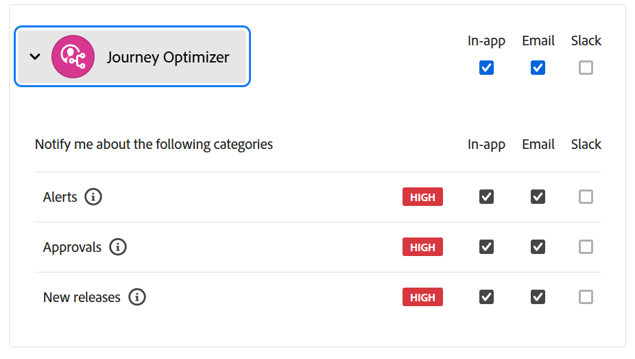

# リリースノート 2025 {#release-notes-2025}

このページでは、2025年にリリースされた [!DNL Journey Optimizer] の機能と改善点をすべて一覧表示しています。

## 2025年7月リリースノート {#25-7-rn}

**リリース日**：2025年7月29日（PT）

### 新機能 {#features-25-7}

このリリースに含まれる新機能を以下に示します。

#### 機能

<table>
<thead>
<tr>
<th><strong>ブランド</strong> </th>
</tr>
</thead>
<tbody>
<tr>
<td>

独自のブランドを作成およびカスタマイズして、コミュニケーション全体で視覚的および言語的なアイデンティティを明確に定義できるようになりました。ブランドのアラインメントスコアを使用すると、コンテンツがブランドのトーン、スタイル、ガイドラインをどの程度反映しているかに関するリアルタイムのフィードバックを受け取ることができ、送信するすべてのメッセージで一貫してブランドらしさを確保するのに役立ちます。

この機能は、以前はベータ版でリリースされていましたが、現在はすべての環境で使用できるようになりました（一般提供）。

詳しくは、<a href="../content-management/brands.md">詳細なドキュメント</a>を参照してください。

</td>
</tr>
</tbody>
</table>

<table>
<thead>
<tr>
<th><strong>メールチャネルでの決定の使用</strong> </th>
</tr>
</thead>
<tbody>
<tr>
<td>

メールジャーニーとキャンペーンに決定ポリシーを追加できるようになりました。決定ポリシーは、配信する最適なコンテンツを各オーディエンスメンバーに応じて動的に返すことを目的に、決定エンジンを活用するオファーのためのコンテナです。

この機能は、限定提供です。アクセス権を取得するには、アドビ担当者にお問い合わせください。

詳しくは、<a href="../experience-decisioning/create-decision.md">詳細なドキュメント</a>を参照してください

</td>
</tr>
</tbody>
</table>

<table>
<thead>
<tr>
<th><strong>LINE チャネル</strong> </th>
</tr>
</thead>
<tbody>
<tr>
<td>

Adobe Journey Optimizer では、クロスチャネル機能を拡張し、LINE チャネルのサポートを含めました。この機能強化により、LINE エクスペリエンスを作成、編集、プレビューできます。これにより、よりパーソナライズされた魅力的なインタラクションが可能になります。LINE を使用すると、より多くのお客様とつながり、関連性の高いコンテンツを送信し、エンゲージメントを向上させることができます。

LINE チャネルは、以前はリクエストのみ使用できましたが、現在はすべてのユーザーが使用できるようになりました（一般提供）。

詳しくは、<a href="../../rp_landing_pages/line-landing-page.md">詳細なドキュメント</a>を参照してください。
</td>
</tr>
</tbody>
</table>

<table>
<thead>
<tr>
<th><strong>ジャーニーのドライラン</strong> </th>
</tr>
</thead>
<tbody>
<tr>
<td>

ジャーニーのドライランは、Adobe Journey Optimizer の特別なジャーニー公開モードで、ジャーニー実務担当者は実際の顧客に連絡したり、プロファイル情報を更新したりすることなく、実際の実稼動データを使用してジャーニーをテストできます。この機能により、ジャーニー実務担当者は、ジャーニーをライブで公開する前に、ジャーニーのデザインとオーディエンスのターゲティングに自身を持つことができます。

この機能は、以前は限定提供でリリースされていましたが、現在はすべての環境で使用できるようになりました（一般提供）。

詳しくは、<a href="../building-journeys/journey-dry-run.md">詳細なドキュメント</a>を参照してください。

</td>
</tr>
</tbody>
</table>

<table>
<thead>
<tr>
<th><strong>ジャーニーの補助 ID</strong> </th>
</tr>
</thead>
<tbody>
<tr>
<td>

プロファイル ID と、注文 ID、サブスクリプション ID、処方箋 ID などの別の識別子を使用してジャーニーをトリガーできるようになりました。これにより、同じプロファイルを同じジャーニーに複数回同時に含めることができます。これにより、各インスタンスがジャーニーを通じて独自のパスに従いながら、複数の注文やサブスクリプションを並行して管理するなどのシナリオが可能になります。

ジャーニーでの追加の ID の使用は、以前は限定提供でリリースされていましたが、現在はすべての環境で使用できるようになりました。この一般提供リリースで、この機能には、オーディエンスを読み取りジャーニーのサポートが含まれるようになりました。

詳しくは、<a href="../building-journeys/supplemental-identifier.md">詳細なドキュメント</a>を参照してください。

</td>
</tr>
</tbody>
</table>

### 製品内アラート

Journey Optimizer 製品リリースに関する&#x200B;**メールおよび製品内アラート**&#x200B;を登録できるようになりました。

登録するには：

* **Adobe Experience Cloud 環境設定**&#x200B;に移動します
* **通知**&#x200B;の下にある **Journey Optimizer の新しいリリース**&#x200B;を見つけます
* アプリ内通知およびメール通知の有効化

{width="70%" align="left"}

### ジャーニー条件の変更 {#ee-change@}

7月8日（PT）以降、新しい顧客組織では、ジャーニー条件で使用される式エディターで、エクスペリエンスイベントを使用した式の作成はサポートされなくなります。その結果、[Experience Platform データソース](../datasource/adobe-experience-platform-data-source.md)のエクスペリエンスイベントは式の作成に使用できません。エクスペリエンスイベントを使用して式／ロジックを作成する際の代替アプローチとベストプラクティスについて詳しくは、[こちら](../building-journeys/exp-event-lookup.md)を参照してください。

単一ジャーニーでジャーニーコンテキストイベントデータにアクセスする方法に変更はありません。式エディターとパーソナライゼーションエディターでは、ユーザーは最初のジャーニーイベントで渡されたデータに引き続きアクセスできます。

詳しくは、[この FAQ](../building-journeys/exp-event-lookup.md#faq-ee) を参照してください。

### 機能強化 {#25-7-improv}

このリリースに含まれる機能強化を以下に示します。

* **キャンペーン**

   * **キャンペーンでの複数のインバウンドアクション** - キャンペーンオーケストレーションを簡素化するために、1 つのキャンペーンで複数のインバウンドアクションを定義できるようになりました。この機能により、複数のコードベースのエクスペリエンス、アプリ内メッセージ、コンテンツカード、web アクションを、各アクションに特定のコンテンツを含めて、同時に異なる場所に配信できます。
     [詳細情報](../campaigns/campaign-action.md#multi-action)

   * **キャンペーンインベントリの再編成** - スケジュールキャンペーンと API トリガーキャンペーンが、キャンペーンインベントリの別々のタブに分割され、ナビゲーションと管理が容易になりました。

[詳細情報](../campaigns/manage-campaigns.md)

* **データ管理**
   * **意思決定管理システムデータセットのアップデート** - 削除されたパーソナライズ済みのオファーとフォールバックオファーは、「decision_object_repository_personalized_offers」データセットと「decision_object_repository_fallback_offers」データセットでアーカイブ済みとしてマークされるようになりました。データセット内の既存のレコードは変更されません。

[詳細情報](../offers/export-catalog/access-dataset.md)

* **ジャーニー**
   * **ジャーニーサンドボックスツールの機能強化** - パッケージの書き出しと読み込み機能を使用して複数のサンドボックス間でジャーニーをコピーする際に、次の機能も使用できるようになりました。
      * 宛先で既存のイベントを選択
      * ジャーニーとは別にイベント上でコピー
      * フィールドグループ／データソースの関係を検出し、存在する場合は宛先にリンクし、存在しない場合は作成します。

[詳細情報](../configuration/copy-objects-to-sandbox.md)

* **チャネル - アプリ内**
   * **アプリ内キーと値のペア** - アプリ内メッセージでは、キーと値のペアを定義して、メッセージペイロードにカスタム変数を含めることができます。これらのキーと値のペアを使用すると、特定の設定とユースケースに基づいて、追加のデータを渡すことができます。[詳細情報](../in-app/design-in-app.md)

* **チャネル - コンテンツカード**

   * **ルールベースのキャンペーン不適格** - 追加の配信ルールを編集する際、以前の配信ルールオプションが 3 つの異なるルールタイプに置き換えられ、メッセージのタイミングと表示をより適切に制御できるようになりました。
      * 次の場合にメッセージを表示：コンテンツカードを表示するタイミングを決定する条件。
      * 次の場合にメッセージを閉じる：コンテンツカードを一時的に非表示にする条件。表示条件が再び満たされると、再表示される場合があります。
      * 次の場合にメッセージを失格とする：コンテンツカードが再び表示されないようにする永続的な条件。

[詳細情報](../content-card/design-content-card.md)

* **決定**
   * **移行ツール API** - Journey Optimizer チームは現在、意思決定管理エンティティを決定に移行するための移行ツール API に取り組んでいます。このツールにより、依存関係の解決とロールバック機能を備えたサンドボックス間のシームレスな移行が可能になります。ご興味がありましたら、アドビ担当者にお問い合わせください。

* **パーソナライゼーション**
   * パーソナライゼーションエディターに新しいヘルパー関数「SHA256」が追加されました。この関数は、文字列の sha256 ハッシュを計算して返すために使用されます。

[詳細情報](../personalization/functions/string.md#sha256)

## 2025年6月リリースノート {#25-6-rn}

**リリース日**：2025年6月18日（PT）

### 新機能 {#25-06-features}

このリリースに含まれる新機能を以下に示します。

<table>
<thead>
<tr>
<th><strong>決定の Adobe Experience Platform データセット（ベータ版）</strong> </th>
</tr>
</thead>
<tbody>
<tr>
<td>

以前はパーソナライゼーションに使用できた Adobe Experience Platform データセットを、決定に活用できるようになりました。これにより、決定属性の定義をデータセットの追加データに拡張し、属性を 1 つずつ手動で更新する必要がなく、定期的に変更される一括更新を行うことができます。例えば、可用性、待機時間などです。

この機能は現在、パブリックベータ版としてすべてのお客様にご使用いただけます。アクセス権をご希望の場合は、アカウント担当者にお問い合わせください。

詳しくは、<a href="../experience-decisioning/aep-data-exd.md">詳細なドキュメント</a>を参照してください。

公開日：2025年6月20日（PT）

</td>
</tr>
</tbody>
</table>

<table>
<thead>
<tr>
<th><strong>RCS メッセージ</strong> </th>
</tr>
</thead>
<tbody>
<tr>
<td>

カスタム SMS プロバイダーソリューションと統合することで、サードパーティのプロバイダーを通じて、リッチ通信サービス（RCS）メッセージを設定、カスタマイズ、配信できるようになりました。

詳しくは、<a href="../sms/sms-configuration-custom.md">詳細なドキュメント</a>を参照してください。

</td>
</tr>
</tbody>
</table>

<table>
<thead>
<tr>
<th><strong>コードベースのエクスペリエンスコンテンツのフォームフィールド</strong> </th>
</tr>
</thead>
<tbody>
<tr>
<td>

JSON または HTML コンテンツテンプレートでは、特定の編集可能なフィールドを定義できるようになりました。これにより、技術ユーザー以外がコードを操作することなく、コードベースのエクスペリエンスチャネルオーサリング内のフォームビューでコンテンツを簡単に編集できます。 さらに、コードベースのエクスペリエンスコンテンツテンプレートを定義する際に、テンプレートに決定ポリシーを挿入できるようになり、再利用性と使いやすさが向上します。

詳しくは、<a href="../code-based/code-based-form-fields.md">詳細なドキュメント</a>を参照してください。

</td>
</tr>
</tbody>
</table>

<!--
<table>
<thead>
<tr>
<th><strong>Custom delegation method for subdomains</strong> </th>
</tr>
</thead>
<tbody>
<tr>
<td>

In addition to the full delegation and the CNAME method, a new subdomain configuration method is now available: the Custom delegation method, which enables you to fully own controlling and maintaining all aspects of DNS that are required for delivering, rendering and tracking messages.

</td>
</tr>
</tbody>
</table>
-->

<table>
<thead>
<tr>
<th><strong>ジャーニーのコンテンツ決定アクティビティ</strong> </th>
</tr>
</thead>
<tbody>
<tr>
<td>

ジャーニーキャンバスの専用のコンテンツ決定アクティビティを通じてパーソナライズされたオファーをジャーニーに含め、条件やカスタムアクションなどのジャーニーアクティビティで使用できるようになりました。

この機能は、一連の組織でのみ使用でき（限定提供）、今後のリリースでグローバルにロールアウトされる予定です。

詳しくは、<a href="../building-journeys/content-decision.md">詳細なドキュメント</a>を参照してください。

</td>
</tr>
</tbody>
</table>

<table>
<thead>
<tr>
<th><strong>ジャーニーのドライラン</strong> </th>
</tr>
</thead>
<tbody>
<tr>
<td>

ジャーニーのドライランは、Adobe Journey Optimizer の特別なジャーニー公開モードで、ジャーニー実務担当者は実際の顧客に連絡したり、プロファイル情報を更新したりすることなく、実際の実稼動データを使用してジャーニーをテストできます。この機能により、ジャーニー実務担当者は、ジャーニーをライブで公開する前に、ジャーニーのデザインとオーディエンスのターゲティングに自身を持つことができます。

この機能は、一連の組織でのみ使用でき（限定提供）、今後のリリースでグローバルにロールアウトされる予定です。

詳しくは、<a href="../building-journeys/journey-dry-run.md">詳細なドキュメント</a>を参照してください。

</td>
</tr>
</tbody>
</table>

<table>
<thead>
<tr>
<th><strong>ジャーニーの一時停止と再開</strong> </th>
</tr>
</thead>
<tbody>
<tr>
<td>

これで、ジャーニーを一時停止して再開できるようになりました。この機能により、顧客体験を止めずにライブジャーニーを一時中断できるので、ジャーニー実務担当者はより優れた制御と柔軟性を得ることができます。一時停止すると、通信は送信されず、ジャーニーが再開されるまでプロファイルは中断状態のままになります。

1 つのジャーニーのみを一時停止および再開することや、ジャーニーのグループに対して一括で一時停止および再開の操作を実行することができます。

さらに、一時停止したジャーニーにグローバルフィルターを適用して、属性に基づいてプロファイルを除外できます。

この機能は、一連の組織でのみ使用でき（限定提供）、今後のリリースでグローバルにロールアウトされる予定です。

詳しくは、<a href="../building-journeys/journey-pause.md">詳細なドキュメント</a>を参照してください。

</td>
</tr>
</tbody>
</table>

<table>
<thead>
<tr>
<th><strong>実験の勝者を拡大</strong> </th>
</tr>
</thead>
<tbody>
<tr>
<td>

「実験の勝者を拡大」を使用すると、実験の勝利バリエーションをすべてのオーディエンスに自動または手動でロールアウトできます。この機能により、最もパフォーマンスの高い処理が特定されると、手動で常に監視することなく、そのリーチと効果を最大化できます。

詳しくは、<a href="../content-management/content-experiment.md">詳細なドキュメント</a>を参照してください。

リリース日：2025年6月2日（PT）
</td>
</tr>
</tbody>
</table>

<table>
<thead>
<tr>
<th><strong>競合と優先順位付け</strong> </th>
</tr>
</thead>
<tbody>
<tr>
<td>

Journey Optimizer では、過剰な数のインタラクションで顧客が圧倒されるのを避けるために、キャンペーンとジャーニーの量とタイミングを管理することが不可欠です。Journey Optimizer では、以前は制限付きアクセス（LA）組織でのみ使用できた競合の管理と優先順位付けのためのツールがいくつか提供されるようになりましたが、現在は一般提供（GA）されています。

この機能は、以前は限定提供でリリースされていましたが、現在はすべての環境で使用できます。この一般提供リリースでは、次の機能強化が導入されました。

<ul>
<li>サポートの拡張：競合管理ツールでは、オーディエンスを読み取りジャーニーに加えて、単一ジャーニーとオーディエンスの選定ジャーニーの両方がサポートされるようになりました。</li>
<li>トラブルシューティングの改善：クエリサービスで 2 つの新しいステップイベントフィールドが使用できるようになりました。これにより、プロファイルがジャーニーまたはキャンペーンから却下された理由を分析できます。</li>
<li>レポートの強化：レポートには、ジャーニーまたはキャンペーンからプロファイルを除外した特定のルールが示されるようになり、透明性が向上し、実用的なインサイトが提供されます。</li></ul>

詳しくは、<a href="../conflict-prioritization/gs-conflict-prioritization.md">詳細なドキュメント</a>を参照してください。

リリース日：2025年6月3日（PT）

</td>
</tr>
</tbody>
</table>

### 機能強化 {#25-06-improv}

このリリースに含まれる機能強化を以下に示します。

* **チャネルルールセット**

   * キャッピングの&#x200B;**カスタム期間ウィンドウ** - チャネルルールセットの設定画面で新しい「**すべて**」フィールドが使用できるようになりました。これにより、指定した期間に応じて、複数の日、週、月にわたってフリークエンシーキャップルールを適用できます。

   * **時間単位での頻度キャップのリセット** - チャネルルールセットに対して時間単位でキャップを適用できるようになりました。この機能は、一連の組織でのみ使用できます（限定提供）。有効にするには、カスタマーケアにお問い合わせください。

   * **毎日の期間** - 以前は限定提供で使用できたチャネルルールセットの「毎日」のフリークエンシーキャップは、すべてのお客様が使用できるようになりました。

  詳しくは、[詳細なドキュメント](../conflict-prioritization/channel-capping.md)を参照してください。

* **コードベースのエクスペリエンス**

   * コードベースのエクスペリエンスコンテンツテンプレートで決定ポリシーを追加できるようになりました。これにより、編集可能なフォームフィールドでオファーを活用できます。[詳細情報](../code-based/code-based-form-fields.md)

   * コードベースのエクスペリエンスジャーニーまたはキャンペーン編集画面から、パーソナライゼーションエディターを開くことなく、決定ポリシーを直接追加できるようになりました。[詳細情報](../code-based/create-code-based.md#edit-code)

* **E メールデザイナーのカスタム CSS のサポート**

  Journey Optimizer では、E メールデザイナー内で直接、メールコンテンツにカスタム CSS を追加できるようになりました。[詳細情報](../email/custom-css.md)

* **キャンペーン用の新しいタブ付きナビゲーション**

  新しいナビゲーションパターンにより、コンテンツのオーサリングにすばやくアクセスでき、キャンペーンをまたいだ設定のさらなる拡張がサポートされます。[詳細情報](../campaigns/create-campaign.md)

* **決定**

   * **サンドボックスのコピーと決定**（公開日：2025年6月3日（PT））- 決定オブジェクトをサンドボックス間でコピーできるようになり、テストとデプロイメントのワークフローが効率化されます。[詳細情報](../configuration/copy-objects-to-sandbox.md#decisioning)

   * **決定ルールの決定項目属性のサポート**（公開日：2025年6月4日（PT））- 決定項目属性を活用して決定ルールを作成できるようになりました。[詳細情報](../experience-decisioning/rules.md#create)

* **インタラクティブメッセージ実行 API の更新** – リリース日：2025年6月6日（PT）

  インタラクティブメッセージ実行 API で、今後のキャンペーン実行のスケジュールを削除できるようになりました。[詳細情報](https://developer.adobe.com/journey-optimizer-apis/references/messaging/){target="_blank"}

## 2025年5月リリースノート {#25-5-rn}

<!--**Release date**: May 20-21, 2025-->

### 新機能 {#25-05-features}

このリリースに含まれる新機能を以下に示します。

<table>
<thead>
<tr>
<th><strong>キャンペーンとジャーニーインベントリのカレンダー表示</strong> </th>
</tr>
</thead>
<tbody>
<tr>
<td>

ジャーニーとキャンペーンのリストでカレンダー表示を使用できるようになりました。これにより、すべてのジャーニーとキャンペーンのアクティベーションをそれぞれのリストで視覚化できます。

この変更は現在、一連の組織のみが使用できます（限定提供）。利用申請するには、<a href="https://forms.cloud.microsoft/r/FC49afuJVi" target="_blank">このフォーム</a>を使用します。

詳しくは、<a href="../building-journeys/journey-ui.md">ジャーニーの参照とフィルタリング</a>、<a href="../campaigns/manage-campaigns.md">キャンペーンへのアクセス</a>の節を参照してください。

リリース日：2025年5月28日（PT）

</td>
</tr>
</tbody>
</table>

<table>
<thead>
<tr>
<th><strong>Adobe Experience Manager コンテンツフラグメントの統合</strong> </th>
</tr>
</thead>
<tbody>
<tr>
<td>

Adobe Experience Manager と Adobe Journey Optimizer の統合により、Journey Optimizer コンテンツ内で Adobe Experience Manager コンテンツフラグメントを簡単に使用できるようになりました。このシームレスな接続により、Journey Optimizer で AEM コンテンツに直接アクセスして使用することが簡単になります。

以前は限られた組織（LA）でのみ利用可能だったこの機能は、次の機能強化を伴って GA になりました。エディターモードを使用して、フラグメント署名内でプレースホルダーを定義し、パーソナライゼーション値をマッピングできるようになりました。

<ul>
<!--li>Create offers by directly selecting an AEM Content Fragment.</li>
<li>Define placeholders and map personalization values within the fragment signature using the Editor mode.</li-->
</ul>
 

詳しくは、<a href="../integrations/aem-fragments.md">詳細なドキュメント</a>を参照してください。

公開日：2025年5月23日（PT）

</td>
</tr>
</tbody>
</table>

<table>
<thead>
<tr>
<th><strong>Adobe Experience Manager Dynamic Media の統合</strong> </th>
</tr>
</thead>
<tbody>
<tr>
<td>

Dynamic Media アセットが Journey Optimizer で直接使用可能になり、アクセスできるようになりました。この統合により、次のことを実行できます。

<ul>
<li>リアルタイム更新でアセットを一元管理。</li>
<li>幅や高さなどのアセット設定を即座に変更。</li>
<li>コンテンツを更新し、パーソナライゼーションフィールドを追加して、Dynamic Media テンプレートをカスタマイズ。</li>
</ul>
 

この機能は、以前は限定提供でリリースされていましたが、現在はすべての環境で使用できるようになりました（一般提供）。

詳しくは、<a href="../integrations/aem-dynamic.md">詳細なドキュメント</a>を参照してください。

公開日：2025年5月23日（PT）

</td>
</tr>
</tbody>
</table>

<table>
<thead>
<tr>
<th><strong>イベントトリガージャーニーの補足 ID</strong> </th>
</tr>
</thead>
<tbody>
<tr>
<td>

プロファイル ID と、注文 ID、サブスクリプション ID、処方箋 ID などの別の識別子を使用してジャーニーをトリガーできるようになりました。これにより、同じプロファイルを同じジャーニーに複数回同時に含めることができます。これにより、各インスタンスがジャーニーを通じて独自のパスに従いながら、複数の注文やサブスクリプションを並行して管理するなどのシナリオが可能になります。

詳しくは、<a href="../building-journeys/supplemental-identifier.md">詳細なドキュメント</a>を参照してください。

この機能は、一連の組織でのみ使用できます（限定提供）。アクセスするには、アドビ担当者にお問い合わせください。

公開日：2025年5月23日（PT）

</td>
</tr>
</tbody>
</table>

<table>
<thead>
<tr>
<th><strong>コンテンツバリエーションのシミュレート</strong> </th>
</tr>
</thead>
<tbody>
<tr>
<td>
<!--p>Previously available in beta, content variations simulation is now generally available (GA). It allows you to preview different variations of your content using sample input data uploaded from a CSV or JSON file or added manually. All the attributes used in your content for personalization are automatically detected by the system and can be used for your tests to create multiple variants.</p-->

この機能は、以前は限定提供でリリースされていましたが、現在はすべての環境で使用できます。この一般提供リリースでは、この機能に多言語コンテンツとコンテンツ実験のサポートが含まれるようになり、様々な言語や処理でのバリエーションをテストできるようになりました。さらに、（プロファイル属性に加えて）コンテキスト属性もサポートされるようになり、より動的で状況に応じたコンテンツテストが可能になりました。

詳しくは、<a href="../test-approve/simulate-sample-input.md">詳細なドキュメント</a>を参照してください。

公開日：2025年5月23日（PT）

</td>
</tr>
</tbody>
</table>

<table>
<thead>
<tr>
<th><strong>オーディエンスを読み取りスケジュールのバッチセグメント化ジョブとの同期</strong> </th>
</tr>
</thead>
<tbody>
<tr>
<td>

バッチセグメント化完了後に毎日のジャーニー実行をトリガーできるようになりました。このオプションは、すべてのお客様に対して毎日スケジュールされているジャーニーで使用できるようになりました。これを使用すると、バッチセグメント化ジョブからのオーディエンスデータを待機する時間枠を最大 6 時間まで定義できます。これにより、ジャーニーは最新のデータで実行されるか、準備が整っていない場合はスキップされます。

この機能は、以前は限定提供でリリースされていましたが、現在はすべての環境で使用できるようになりました（一般提供）。

詳しくは、<a href="../building-journeys/read-audience.md#schedule">詳細なドキュメント</a>を参照してください。

リリース日：2025年5月20日（PT）

</td>
</tr>
</tbody>
</table>

<table>
<thead>
<tr>
<th><strong>カスタム SMS プロバイダー</strong> </th>
</tr>
</thead>
<tbody>
<tr>
<td>

Journey Optimizer では、デフォルトのオプションに加えて、Sinch、Infobip、Twilio などの追加の SMS プロバイダーを設定できるようになりました。カスタム SMS プロバイダー設定を使用すると、サードパーティプロバイダーを直接統合し、動的メッセージ用の高度なペイロードカスタマイズを活用し、同意設定（オプトイン／オプトアウト）を管理してコンプライアンスを確保できます。

詳しくは、<a href="../sms/sms-configuration-custom.md">詳細なドキュメント</a>を参照してください。

この機能は、以前は限定提供でリリースされていましたが、現在はすべての環境で使用できるようになりました（一般提供）。

リリース日：2025年5月20日（PT）

</td>
</td>
</tr>
</tbody>
</table>

<table>
<thead>
<tr>
<th><strong>E メールデザイナーのテーマ</strong> </th>
</tr>
</thead>
<tbody>
<tr>
<td>

事前承認済みのテーマをすばやく適用して、すべてのメールにわたってブランドの一貫性を確保し、キャンペーン作成プロセスを高速化し、デザインチームへの依存を減らしながら高品質のメールを独自に作成できるようになりました。

この機能は現在ベータ版で、ベータ版のお客様のみご利用いただけます。ベータ版プログラムに参加するには、アドビ担当者にお問い合わせください。

詳しくは、<a href="../email/apply-email-themes.md">詳細なドキュメント</a>を参照してください。

公開日：2025年5月14日（PT）

</td>
</tr>
</tbody>
</table>

<table>
<thead>
<tr>
<th><strong>決定 - 新しい AI 式ビルダー</strong> </th>
</tr>
</thead>
<tbody>
<tr>
<td>

新しく改善されたインターフェイスから条件を定義および組み合わせることで、特定の決定ランキング式を作成できるようになりました。静的なオファーの優先度のみに依存するのではなく、ガイド付きインターフェイスを通じて、AI モデルスコア、オファーの優先度、プロファイル属性、オファー属性、コンテキストシグナルを組み合わせたカスタムランキング式を定義できます。

詳しくは、<a href="../experience-decisioning/ranking/ranking-formulas.md">詳細なドキュメント</a>を参照してください。

公開日：2025年5月14日（PT）

</td>
</tr>
</tbody>
</table>

### 機能強化 {#25-05-improv}

このリリースに含まれる機能強化を以下に示します。

* **サンドボックスコピーをサポートする新しいキャンペーンオブジェクト** – リリース日：2025年5月15日（PT）

  パッケージのエクスポートとインポート機能を使用して、複数のサンドボックス間でキャンペーンをコピーすると、チャネル設定、実験のバリアントと設定、決定ポリシーと項目などの依存関係もコピーされるようになりました。[詳細情報](../configuration/copy-objects-to-sandbox.md)

* **ランディングページのフォルダー** - 公開日：2025年5月9日（PT）

  ランディングページを簡単に管理することを目的に、フォルダーを使用して、より効果的に効率化された階層に整理できるようになりました。[詳細情報](../landing-pages/manage-lp.md)

* **ダイレクトメール：SFTP 接続用の SSH キーのサポート** - 公開日：2025年5月5日（PT）

  ダイレクトメールファイルのルーティング設定では、パスワード認証タイプの既存の SFTP に加えて、SSH キー認証を使用してダイレクトメールファイルを SFTP サーバーにエクスポートできるようになりました。[詳細情報](../direct-mail/direct-mail-configuration.md)

* **パーソナライゼーション用のピルのアクティベーション** - 公開日：2025年5月5日（PT）

  パーソナライゼーションエディターに新しい「ピル」ボタンが追加されました。有効にすると、プロファイルとコンテキスト属性がピルとして表示され、コードの読みやすさが向上します。[詳細情報](../personalization/personalization-build-expressions.md#options)

  >[!AVAILABILITY]
  >
  >この機能は、今後 30 日間にわたってすべての環境に段階的にロールアウトされます。

* **Web チャネルでの「URL にリダイレクト」のサポート** – リリース日：2025年5月20日（PT）

  Journey Optimizer web チャネルでは、ビジュアルエディターで新しいバリエーションを作成するのではなく、訪問者を別の既存の URL にリダイレクトできるようになりました。この機能を使用すると、ページ内のいくつかの要素を変更するだけでなく、完全に異なる 2 つのページを比較する実験を実行できます。[詳細情報](../web/create-web.md#web-redirect-to-url)

* **テンプレートとフラグメントのフォルダー** - リリース日：2025年5月20日（PT）

  フォルダーを使用すると、オブジェクトを構造化された階層に簡単かつ効果的に整理できます。以前は一連の組織（LA）に対して提供されていましたが、すべてのユーザー（GA）に対してコンテンツテンプレートとフラグメントを管理できるようになりました。詳しくは、[コンテンツテンプレート](../content-management/access-content-templates.md#folders)および[フラグメント](../content-management/manage-fragments.md#folders)の節を参照してください。

* **メールテンプレートでのクリックの追跡** – リリース日：2025年5月20日（PT）

  メールコンテンツの画像マップ内の `<area>` 要素のクリックの追跡が [!DNL Journey Optimizer] でネイティブにサポートされるようになりました。これは、画像マップ領域が標準のハイパーリンクと同じトラッキングラッピング、トラッキングデータおよび追加されたパラメーターを確実に受け取るようにするためです。[メッセージトラッキングの詳細情報](../email/message-tracking.md#manage-tracking)

<!--
* **Decisioning - Leverage Adobe Experience Platform datasets** 
  
  Journey Optimizer now allows you to leverage Adobe Experience Platform datasets in the following Decisioning objects: eligibility rules, ranking formulas, and capping rules.-->

* **キャンペーンリストの右側のパネル** – リリース日：2025年5月20日（PT）

  キャンペーンリストでキャンペーンを選択すると、詳細を表示するパネルが開くようになりました。

<!--* **Form fields in code-based experience content**

  In content templates, you can now define specific JSON or HTML fields which enable non-technical users to easily edit content in code-based experiences without the need to manipulate code.-->

<!--* **Subdomains - 'Custom delegation' method**  
  In addition to the full delegation and the CNAME method, a new subdomain configuration method is now available: the Custom delegation method, which enables you to fully own controlling and maintaining all aspects of DNS that are required for delivering, rendering, and tracking messages.
  -->

## 2025年4月リリースノート {#25-4-rn}

**リリース日**：2025年4月29日～30日（PT）

### 新機能 {#25-04-features}

このリリースに含まれる新機能を以下に示します。

<table>
<thead>
<tr>
<th><strong>パーソナライゼーションエディター - 実践で学ぶ</strong> </th>
</tr>
</thead>
<tbody>
<tr>
<td>

パーソナライゼーション式を実験できる、パーソナライゼーションプレイグラウンドが使用できるようになりました。これを使用すると、サンプルテンプレートやペイロードを探索しながら、独自のパーソナライゼーション式を開始して試すことができます。

詳しくは、<a href="../personalization/personalize.md#playground">詳細なドキュメント</a>を参照してください。

公開日：2025年4月24日（PT）

</td>
</tr>
</tbody>
</table>

<!--table>
<thead>
<tr>
<th><strong>Adobe Experience Manager as a Cloud Service integration</strong> </th>
</tr>
</thead>
<tbody>
<tr>
<td>

The integration between Adobe Journey Optimizer and Adobe Experience Manager as a Cloud Service is now released in General Availability (GA). This integration enables seamless content sourcing and management for personalized customer journeys.

For more information, refer to the <a href="../integrations/aem-templates.md">detailed documentation</a>.

</td>
</tr>
</tbody>
</table-->

<!--<table>
<thead>
<tr>
<th><strong>Simulate content variations (General Availability)</strong> </th>
</tr>
</thead>
<tbody>
<tr>
<td>

Previously available in beta, content variations simulation is now generally available (GA). It allows you to preview different variations of your content using sample input data uploaded from a CSV or JSON file or added manually. All the attributes used in your content for personalization are automatically detected by the system and can be used for your tests to create multiple variants.

With the General Availability release, the feature now includes support for multilingual content and content experiments, enabling you to test variations across different languages and treatments. Additionally, it now supports contextual attributes (in addition to profile attributes), allowing for even more dynamic and situational content testing.

</td>
</tr>
</tbody>
</table>-->

<table>
<thead>
<tr>
<th><strong>LINE チャネル</strong> </th>
</tr>
</thead>
<tbody>
<tr>
<td>

Adobe Journey Optimizer では、クロスチャネル機能を拡張し、LINE チャネルのサポートを含めました。この機能強化により、LINE エクスペリエンスを作成、編集、プレビューできます。これにより、よりパーソナライズされた魅力的なインタラクションが可能になります。LINE を使用すると、より多くのお客様とつながり、関連性の高いコンテンツを送信し、エンゲージメントを向上させることができます。

LINE チャネルは、リクエストに応じて、Adobe Journey Optimizer のお客様に対して有効になります。組織でこの機能を有効にするには、アドビカスタマーケアまたはアドビ担当者にお問い合わせください。

詳しくは、<a href="../../rp_landing_pages/line-landing-page.md">詳細なドキュメント</a>を参照してください。
</td>
</tr>
</tbody>
</table>

<!--table>
<thead>
<tr>
<th><strong>Custom SMS provider (General Availability)</strong> </th>
</tr>
</thead>
<tbody>
<tr>
<td>

Adobe Journey Optimizer now supports custom SMS providers, allowing you to integrate your preferred SMS services for enhanced communication flexibility.

For more information, refer to the <a href="../sms/sms-configuration-custom.md">detailed documentation</a>.
</td>
</tr>
</tbody>
</table-->

<table>
<thead>
<tr>
<th><strong>ジャーニー指標</strong> </th>
</tr>
</thead>
<tbody>
<tr>
<td>

ジャーニー指標が使用可能になり、ビジネスの主要指標をまたいでアクティビティの影響を測定し、パフォーマンスに関するより明確なインサイトを得ることができるようになりました。

 

詳しくは、<a href="../building-journeys/success-metrics.md">詳細なドキュメント</a>を参照してください。

公開日：2025年4月9日（PT）

</td>
</tr>
</tbody>
</table>

<!--<table>
<thead>
<tr>
<th><strong>Calendar view for campaign and journey inventory (Limited Availability)</strong> </th>
</tr>
</thead>
<tbody>
<tr>
<td>

A new calendar view is now available for campaigns and journey activations. This feature provides a visual representation of scheduled activities, allowing you to view and manage your campaigns and journeys more effectively. Selecting a calendar item opens a right rail with detailed information. This feature is currently in Limited Availability.

</td>
</tr>
</tbody>
</table>-->

<table>
<thead>
<tr>
<th><strong>Adobe Express の統合（限定提供）</strong> </th>
</tr>
</thead>
<tbody>
<tr>
<td>

Adobe Journey Optimizer は Adobe Express と統合され、アセットをジャーニーオーケストレーションとシームレスに接続できるようになりました。この統合により、キャンペーン全体でパーソナライズされたコンテンツをデザインおよびデプロイするプロセスが簡素化されます。 

この統合は、現在、Healthcare Shield または Privacy and Security Shield では使用できません。

詳しくは、<a href="../integrations/express.md">詳細なドキュメント</a>を参照してください。

</td>
</tr>
</tbody>
</table>

<table>
<thead>
<tr>
<th><strong>バッチセグメント化の完了後に毎日のジャーニー実行をトリガー（限定提供）</strong> </th>
</tr>
</thead>
<tbody>
<tr>
<td>

毎日スケジュールされているジャーニーの場合、新しいオプションを使用すると、バッチセグメント化ジョブからのオーディエンスデータを待機する時間枠を最大 6 時間まで定義できます。これにより、ジャーニーは最新のデータで実行されるか、準備が整っていない場合はスキップされます。「バッチオーディエンス評価の後にトリガー」オプションは、一連の組織でのみ使用できます（限定提供）。アクセスするには、アドビ担当者にお問い合わせください。

詳しくは、<a href="../building-journeys/read-audience.md#schedule">詳細なドキュメント</a>を参照してください。

</td>
</tr>
</tbody>
</table>

<!--table>
<thead>
<tr>
<th><strong>Themes in the Email Designer (Beta)</strong> </th>
</tr>
</thead>
<tbody>
<tr>
<td>

You can now quickly apply pre-approved styling themes to your email content to ensure brand consistency across all emails, speed up your campaign creation process and independently produce hight-quality emails while reducing dependency on design teams.

This capability is currently in beta version and only available to beta customers. To join the beta program, contact your Adobe representative.

For more information, refer to the <a href="../content-management/brands-score.md">detailed documentation</a>.

Availability date: May 5, 2025

</td>
</tr>
</tbody>
</table-->

<table>
<thead>
<tr>
<th><strong>ブランド一致スコア (Beta)</strong> </th>
</tr>
</thead>
<tbody>
<tr>
<td>

ブランド一致スコア機能は、明確なフィードバックを E メールデザイナーで直接提供し、コンテンツがブランドのトーン、スタイル、ガイドラインと一致しているかどうかを確認するのに役立ちます。この機能はベータ版で使用可能です。

詳しくは、 <a href="../content-management/brands-score.md">詳細なドキュメント</a>を参照してください。

</td>
</tr>
</tbody>
</table>

<!--
<table>
<thead>
<tr>
<th><strong>Decisioning - New AI formula builder</strong> </th>
</tr>
</thead>
<tbody>
<tr>
<td>

You can now create specific Decisioning ranking formulas by defining and combining criteria from a new improved interface. Ranking formulas allow you to define rules that will determine which decision items should be presented first, rather than taking into account the priority scores.

For more information, refer to the <a href="../content-management/brands-score.md">detailed documentation</a>.

Availability date: May 5, 2025

</td>
</tr>
</tbody>
</table>
-->

### 機能強化 {#25-04-improv}

**キャンペーンプレビュー API**

既存の配達確認の送信機能に加えて、キャンペーンをプレビューするための新しい API を使用できるようになりました。[詳細情報](https://developer.adobe.com/journey-optimizer-apis/references/simulations/#operation/createCampaignPreview){target="_blank"}。

**サンドボックスツール**

* **カスタムアクション用のサンドボックスツール**

  サンドボックスツール機能を使用してコピーできる Adobe Journey Optimizer オブジェクトのリストにカスタムアクションが含まれるようになり、テストとデプロイメントが効率化されます。[詳細情報](../configuration/copy-objects-to-sandbox.md)

* **キャンペーン用のサンドボックスツール** - 公開日：2025年4月3日（PT）

  パッケージのエクスポート機能とインポート機能を使用して、複数のサンドボックス間でキャンペーンをコピーできるようになりました。キャンペーンは、プロファイル、オーディエンス、スキーマ、インラインメッセージおよび依存オブジェクトに関連するすべての項目と共にコピーされます。決定項目、データ使用ラベル、言語設定など、一部の項目はコピーされません。[詳細情報](../configuration/copy-objects-to-sandbox.md#custom-actions)

**パーソナライゼーション**

* **新しいコンテキスト属性**

  新しいコンテキスト属性の **Message Profile Id** が、パーソナライゼーションエディターから選択できるようになりました。これは、配信内で各ターゲットプロファイルに送信された各メッセージを一意に識別する、メッセージ指向の属性です。この一意の ID は、例えば、受信者が開いたリンクやクリックしたリンクを区別するための URL トラッキングパラメーターとして使用できます。

* **属性パネルに表示される属性** - 公開日：2025年4月2日（PT）

  パーソナライゼーションエディターの属性パネルには、デフォルトで入力した属性のみが表示されるようになりました。すべての属性を表示するには、設定ボタンを使用して「**[!UICONTROL 入力した属性のみを表示]**」オプションをオフに切り替えます。[詳細情報](../personalization/personalization-build-expressions.md)

**メールチャネル**

* **パーソナライズされた URL トラッキング** - 公開日：2025年4月30日（PT）

  メール設定の柔軟性と制御性を高めるために、コンテンツ内のリンクごとに E メールデザイナーでパーソナライズする代わりに、メールチャネル設定レベルですべての URL トラッキングパラメーターを一度にパーソナライズできるようになりました。[詳細情報](../email/surface-personalization.md#personalize-url-tracking)

* **E メールデザイナー** - 公開日：2025年4月1日（PT）

  Journey Optimizer のアクセシビリティを強化するために、E メールデザイナーで 2 つの新しいフィールドが使用できるようになりました。これらは、メールコンテンツの `<html>` 要素の `<title>` 要素と `lang` 属性に対応しています。これらの設定は、メールの「**[!UICONTROL 本文]**」セクションの「**[!UICONTROL プリヘッダー]**」フィールドに加えて定義できます。[詳細情報](../email/email-metadata.md)

**ユースケースのプレイブック**

* **プレイブックのオーサリングと共有（Private Beta）** - 独自のユースケースプレイブックを作成、管理、共有できるようになりました。この機能は、現在、一連の組織に対してのみ Private Beta として使用できます。アクセスするには、アドビ担当者にお問い合わせください。[詳細情報](../start/playbooks.md)

**ナビゲーション**

* **コンテンツ管理** - 公開日：2025年4月2日（PT）

  コンテンツテンプレートとフラグメントを簡単に管理することを目的に、フォルダーを使用して、より効果的に構造化された階層に整理できるようになりました。詳しくは、[コンテンツテンプレート](../content-management/access-content-templates.md#folders)および[フラグメント](../content-management/manage-fragments.md#folders)の節を参照してください。

  >[!AVAILABILITY]
  >
  >この機能強化は、一連の組織のみが使用できます（限定提供）。

<!--- **Folders for content templates and fragments** - Availability date: May 5, 2025

  Previously available for a set of organizations (LA), folders are now available to all users (GA) to manage their content templates and fragments. Folders let you organize your content templates and fragments more easily and effectively into a structured hierarchy.

<!--- **Right rail in campaigns list**  

  A right rail has been added to the campaigns list, providing detailed information when a campaign is selected.-->

<!--**Playbooks**

- **Create your own playbooks (Beta)**
  
  You can now create your own playbooks in Adobe Journey Optimizer, enabling greater customization and flexibility in journey planning.-->

## 2025年3月リリースノート {#25-3-rn}

### 新機能 {#25-03-features}

このリリースに含まれる新機能を以下に示します。

<!--table>
<thead>
<tr>
<th><strong>Integration with Adobe Express (Limited Availability)</strong> </th>
</tr>
</thead>
<tbody>
<tr>
<td>

The Adobe Express integration in Adobe Journey Optimizer lets you use Adobe Express's editing tools directly during content creation, enabling you to resize, remove backgrounds, crop, and convert assets to JPEG or PNG.

Adobe Express integration in Adobe Journey Optimizer is currently only available for a set of organizations (Limited Availability). It cannot be deployed for use with Healthcare Shield or Privacy and Security Shield.

For more information, refer to the <a href="../integrations/express.md">detailed documentation</a>.

 

</td>
</tr>
</tbody>
</table-->

<!--table>
<thead>
<tr>
<th><strong>Journey metrics</strong> </th>
</tr>
</thead>
<tbody>
<tr>
<td>

Journey metrics are now available, allowing you to measure the impact of your activities across the key metrics of your business and to provide clearer insights into your performance.

For more information, refer to the <a href="../building-journeys/success-metrics.md">detailed documentation</a>.

</td>
</tr>
</tbody>
</table-->

<!-- table>
<thead>
<tr>
<th><strong>Calendar view for journeys (Limited Availability)</strong> </th>
</tr>
</thead>
<tbody>
<tr>
<td>

A calendar view is now available in Journey Optimizer to visualize all journeys activations. From this view, you can browse your journeys and check details and properties.

This change is only available for a set of organizations (Limited Availability). To gain access, contact your Adobe representative.

For more information, refer to the <a href="../conflict-prioritization/rule-sets.md">detailed documentation</a>.

</td>
</tr>
</tbody>
</table-->

<table>
<thead>
<tr>
<th><strong>Dynamic Media との統合（限定提供）</strong> </th>
</tr>
</thead>
<tbody>
<tr>
<td>

Dynamic Media アセットが Journey Optimizer で直接使用可能になり、アクセスできるようになりました。この統合により、次のことを実行できます。
<ul>
<li>リアルタイム更新でアセットを一元管理</li>
<li>幅や高さなどのアセット設定を即座に変更</li>
<li>コンテンツを更新し、パーソナライゼーションフィールドを追加して、Dynamic Media テンプレートをカスタマイズ</li>
</ul>

この統合は、一連の組織のみが使用できます（限定提供）。アクセスするには、アドビ担当者にお問い合わせください。

詳しくは、<a href="../integrations/aem-dynamic.md">詳細なドキュメント</a>を参照してください。

</td>
</tr>
</tbody>
</table>

<table>
<thead>
<tr>
<th><strong>Adobe GenStudio との統合（限定提供）</strong> </th>
</tr>
</thead>
<tbody>
<tr>
<td>

マーケティング効率を高め、ブランドの一貫性を維持するために、パフォーマンスマーケティングエクスペリエンス用の GenStudio を Journey Optimizer とシームレスに統合できるようになりました。これにより、GenStudio の AI を活用したコンテンツ作成と Journey Optimizer の高度なオーケストレーション機能を活用できるようになります。

Journey Optimizer での GenStudio 統合は、現在、Healthcare Shield またはプライバシーとセキュリティシールド（限定提供）では使用できません。

詳しくは、<a href="../integrations/genstudio.md">詳細なドキュメント</a>を参照してください。

</td>
</tr>
</tbody>
</table>

<table>
<thead>
<tr>
<th><strong>柔軟なオーディエンス評価（GA）</strong> </th>
</tr>
</thead>
<tbody>
<tr>
<td>

以前は一連の組織（LA）に対して提供されていましたが、柔軟なオーディエンス評価はすべてのユーザー（GA）対して提供されるようになりました。この機能を使用すると、選択したオーディエンスに対してオンデマンドでセグメント化ジョブを実行できるので、Journey Optimizer のジャーニーやキャンペーンにオーディエンスをターゲティングする前に、常に最新のオーディエンスデータを確保できます。

詳しくは、 <a href="../audience/creating-a-segment-definition.md#flexible">詳細なドキュメント</a>を参照してください。

</tr>
</tbody>
</table>
</table>

<!--table>
<thead>
<tr>
<th><strong>LINE channel (Limited Availability)</strong> </th>
</tr>
</thead>
<tbody>
<tr>
<td>

Adobe Journey Optimizer has expanded its cross-channel capabilities to include support for the LINE channel. This enhancement allows you to create, edit, and preview LINE experiences enabling more personalized and engaging interactions. With LINE, you can connect with more customers, send relevant content, and improve your engagement.

This capability is only available for a set of organizations (Limited Availability). To gain access, contact your Adobe representative.

For more information, refer to the <a href="../conflict-prioritization/rule-sets.md">detailed documentation</a>.

</td>
</tr>
</tbody>
</table-->

### 機能強化 {#25-03-improv}

**パーソナライゼーションエディター**（公開日：3月12日（PT））

Journey Optimizer パーソナライゼーションエディターが更新され、新しい機能が追加されました。
* **コードエディターのデザインの更新** - 操作性と焦点を向上させる、よりクリーンで最新のインターフェイス。
* **検索と置換** - エディター内でコンテンツをすばやく検索して置換する機能が追加されました。
* **取り消しとやり直しのサポート** - 変更を簡単に元に戻したり、再適用したりできます。
* **カスタマイズ可能なフォントサイズ** - 読みやすくなるように、エディターのフォントサイズを調整できます。
* **インライン JSON 検証** - エラー検出を高速化するには、JSON コンテンツに対してリアルタイムのクライアントサイド検証を提供します。
* **プロファイル属性とコンテキスト属性のオートコンプリート** - コンテンツ作成を効率化するスマートな候補を表示します。
* **構文のハイライト表示の強化** - コード構造をより視覚的に区別することで、読みやすさを向上します。

詳しくは、[詳細なドキュメント](../personalization/personalization-build-expressions.md)を参照してください。

**承認**

承認ポリシーの条件を定義する際に、タグやオブジェクトカテゴリでフィルタリングするオプションが追加されました。

詳しくは、[詳細なドキュメント](../test-approve/approval-policies.md)を参照してください。

**設定**

* Adobe Experience Platform 統合タグをチャネル設定に割り当てることができるようになりました。これにより、簡単に分類し、すべてのリストでの検索とナビゲーションを改善できます。[詳細情報](../configuration/channel-surfaces.md#channel-config-tags)

* Journey Optimizer でメールサブドメインを設定または編集する際に、親ドメインで使用可能な場合は、関連付けられた DMARC レコードを独自に管理することを選択できるようになりました。[詳細情報](../configuration/dmarc-record.md#set-up-dmarc)

**ビジネスルール**

バッチセグメント化を使用したジャーニーとキャンペーンで、毎日のフリークエンシーキャップを使用できるようになりました。毎日のフリークエンシーキャップルールの正確性を確保するには、キャンペーンまたはジャーニーを作成する際に、最も優先度の高い名前空間を選択します。名前空間の優先度について詳しくは、[ID サービスガイド](https://experienceleague.adobe.com/ja/docs/experience-platform/identity/features/identity-graph-linking-rules/namespace-priority){target="_blank"}を参照してください。

ルールセットでの毎日のフリークエンシーキャップは、一連の組織のみが使用できます（限定提供）。アクセスするには、アドビ担当者にお問い合わせください。

ビジネスルールについて詳しくは、[詳細なドキュメント](../conflict-prioritization/rule-sets.md)を参照してください。

**コンテンツテンプレート**

HTML タイプのコンテンツテンプレートは非推奨（廃止予定）になりました。[!DNL Journey Optimizer] で以前に作成した既存の HTML コンテンツテンプレートは引き続き使用できます。[詳しくは、コンテンツテンプレートを参照してください](../content-management/content-templates.md)

<!--**Deliverability**

You can now choose to have your emails relayed to your SMTP servers instead of being sent directly from Journey Optimizer to ISPs. This allows you to route final email deliveries through your own Mail Transfer Agents and IPs, or to perform final validations on the emails before sending them to your recipients. The SMTP relay capacity is available on demand - contact your Adobe representative.-->

## 2025年2月リリースノート {#25-02-rn}

**リリース日**：2025年2月18～19日（PT）

### 新機能 {#25-02-features}

このリリースに含まれる新機能を以下に示します。

<table>
<thead>
<tr>
<th><strong>ビジネスルールの作成と管理</strong> </th>
</tr>
</thead>
<tbody>
<tr>
<td>

ルールセットを使用して、ビジネスルールを作成できるようになりました。ルールセットは、チャネルをまたいでキャンペーンやジャーニーアクション内で送信されるメッセージを制限し、ジャーニーへのプロファイルエントリを制御するのに役立つルールのグループです。

<ul><li>チャネルルールセットを作成して、1 つまたは複数のチャネルをまたいで送信されるメッセージの数を制限します。これらをキャンペーンまたはジャーニーアクションに適用して、ルールセットで定義されたルールを適用します。チャネルルールセットを使用すると、通信タイプに基づいてキャップルールを適用できます。例えば、「プロモーションメッセージ」を制限するルールセットと、「ニュースレター」を制限するルールセットを設定します。送信する通信のタイプに応じて、キャンペーンまたはジャーニーアクションに適切なルールセットを適用します。</li>
<li> ジャーニールールセットを作成して、ジャーニーへのプロファイルエントリを制御します。プロファイルが特定の期間内にジャーニーにエントリできる頻度や、プロファイルが同時に登録できるジャーニーの数を制限します。これらをジャーニーレベルで適用して、適切なエントリ管理を確保します。</li></ul>

以前は一連の組織（LA）に対して提供されていましたが、ビジネスルールはすべてのユーザー（GA）に対して提供されるようになりました。ジャーニードメインのビジネスルールは、引き続き一部の組織（LA）でのみ使用できます。

詳しくは、<a href="../conflict-prioritization/rule-sets.md">詳細なドキュメント</a>を参照してください。

</td>
</tr>
</tbody>
</table>

<table>
<thead>
<tr>
<th><strong>AI アシスタントを使用したランディングページの生成</strong> </th>
</tr>
</thead>
<tbody>
<tr>
<td>

AI アシスタントを使用して、完全なページデザイン、パーソナライズされたテキスト、カスタマイズされたビジュアルなど、ランディングページ用の魅力的なコンテンツを作成できるようになりました。

詳しくは、<a href="../content-management/generative-lp.md">詳細なドキュメント</a>を参照してください。

</td>
</tr>
</tbody>
</table>

<table>
<thead>
<tr>
<th><strong>AI アシスタントを使用したブランド (Beta)</strong> </th>
</tr>
</thead>
<tbody>
<tr>
<td>

独自のブランドを設定して、ブランドの視覚的および言語的 ID を定義できるようになりました。 

この機能は、一部のお客様に Private Beta としてリリースされています。今後のリリースでは、すべてのお客様が段階的に利用できるようになる予定です。

詳しくは、<a href="../content-management/brands.md">詳細なドキュメント</a>を参照してください。

</td>
</tr>
</tbody>
</table>

<table>
<thead>
<tr>
<th><strong>カスタムアクションのトラブルシューティング</strong> </th>
</tr>
</thead>
<tbody>
<tr>
<td>

Adobe Journey Optimizer から直接実際の API 呼び出しを行って、カスタムアクション設定を検証できるようになりました。この新しい機能は、ジャーニーでカスタムアクションを使用する前または使用した後に、カスタムアクションのトラブルシューティングを行うのに役立ちます。 

詳しくは、<a href="../action/troubleshoot-custom-action.md">詳細なドキュメント</a>を参照してください。

<!--p> This capability is only available for a set of organizations (Limited Availability). To gain access, contact your Adobe representative.</p-->
</td>
</tr>
</tbody>
</table>

<table>
<thead>
<tr>
<th><strong>柔軟なオーディエンス評価（限定提供）</strong> </th>
</tr>
</thead>
<tbody>
<tr>
<td>

柔軟なオーディエンス評価を使用すると、選択したオーディエンスに対してオンデマンドでセグメント化ジョブを実行できるので、Journey Optimizer のジャーニーやキャンペーンにオーディエンスをターゲティングする前に、常に最新のオーディエンスデータを確保できます。

詳しくは、<a href="../audience/creating-a-segment-definition.md#flexible">詳細なドキュメント</a>を参照してください。

この機能は、一連の組織でのみ使用できます（限定提供）。アクセスするには、アドビ担当者にお問い合わせください。

リリース日：2025年1月28日（PT）

</tr>
</tbody>
</table>
</table>

### 機能強化 {#25-02-improvements}

2月の更新では、以下の機能強化が行われます。

* **データセットの有効期間（TTL）** - 今月以降、新しいサンドボックスと新しい組織の Journey Optimizer システム生成データセットに、次のように有効期間（TTL）ガードレールがロールアウトされます。

   * プロファイルストアのデータの場合は 90 日
   * データレイクのデータの場合は 13 か月

  この変更は、後続のフェーズで既存のお客様のサンドボックスにロールアウトされます。

  この更新について詳しくは、[専用のよくある質問](../data/datasets-ttl.md#frequently-asked-questions)を参照してください。

<!--* **Playbooks** - You can now create and publish your own Use Case Playbooks in Journey Optimizer.-->

* **ダイレクトメール** - ダイレクトメールチャネル設定でのファイルルーティングに、新しいサーバータイプである Data Landing Zone がサポートされるようになりました。[詳細情報](../direct-mail/direct-mail-configuration.md#file-routing-configuration)

* **SMS** - 配信、フィードバック、インバウンド、コールバックの URL を上書きして、複数の地域のエンドポイントからの SMS メッセージ配信を管理できるようになりました。これをサポートすることを目的に、API 資格情報設定に新しい「上書き URL」フィールドが追加されました。この変更は、Sinch プロバイダーでのみ使用できます。[詳細情報](../sms/sms-configuration-sinch.md)

* **パーソナライゼーション**（公開日：2025年1月29日（PT））- パーソナライゼーションエディターで新しい日付／時刻ヘルパー関数が使用できるようになりました。[詳細情報](../personalization/functions/dates.md)

<!--
* The personalization editor has been enhanced with new capabilities such as Auto-complete, Search, and filtering options. You can also show or hide deprecated attributes.-->

* **メール設定** - アドビの外部で同意を管理している場合は、メールチャネル設定の一部として、カスタムの登録解除メールアドレスとカスタムのワンクリック登録解除 URL を設定できるようになりました。[詳細情報](../email/list-unsubscribe.md#custom-managed)

  {width="80%"}

* **決定**（公開日：2025年1月28日（PT））- 決定では、項目カタログのスキーマを編集する際に、オブジェクトデータタイプがサポートされるようになりました。[詳細情報](../experience-decisioning/catalogs.md)
