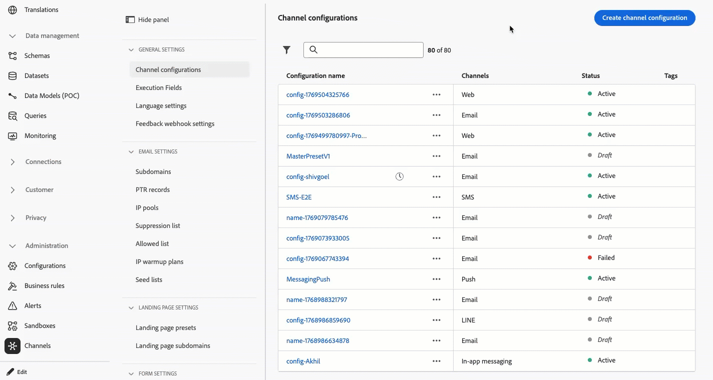

# リリースノート 2026 {#release-notes-2026}

このページは、2026年にリリースされた [!DNL Journey Optimizer] の機能と改善点をすべて一覧表示しています。

## 26年2月のリリースノート {#feb-26-01-rn}

### 新機能 {#feb-26-01-features}

<table>
<thead>
<tr>
<th><strong>ジャーニー調停</strong> </th>
</tr>
</thead>
<tbody>
<tr>
<td>

<strong> ランキング式</strong>を使用して、顧客プロファイル属性と文脈要因に基づいてジャーニーの優先順位スコアを自動的に高め、顧客が最も関連性の高いジャーニーに確実に入れるようにできるようになりました。

この機能は、一連の組織でのみ使用できます（限定提供）。アクセス権を取得するには、アドビ担当者にお問い合わせください。

詳しくは、<a href="../conflict-prioritization/journey-ranking-formulas.md">詳細なドキュメント</a>を参照してください。

公開日：2026年2月24日（PT）

</td>
</tr>
</tbody>
</table>

<table>
<thead>
<tr>
<th><strong>ジャーニーのアクションアクティビティ</strong> </th>
</tr>
</thead>
<tbody>
<tr>
<td>

Journey Optimizerでは、新しい汎用<strong> アクションアクティビティ </strong>をサポートしています。これにより、シングルアクションとマルチアクションのインバウンドアクショングループの両方を設定でき、ジャーニーキャンバス内で効率的なアクション設定が可能になります。 特に、この新機能により、次のことが可能になります。

<ul>
<li>ジャーニーキャンバス内の簡素化されたネイティブアクション設定。</li>
<li>複数アクションのインバウンドアクショングループを作成する処理能力。</li>
<li>組み込みのチャネルアクションに最適化を追加する機能。</li>
<li>あらゆるアクションに実験と多言語オプションの両方を追加できる機能。</li>
</ul>

この機能は、以前は限定提供でリリースされていましたが、現在はすべての環境で使用できるようになりました（一般提供）。

詳しくは、<a href="../building-journeys/journey-action.md">詳細なドキュメント</a>を参照してください。

公開日：2026年2月20日（PT）

<strong> メモ：</strong>すべてのネイティブチャネルにアクションジャーニーアクティビティからアクセスできるようになりました。 従来のネイティブチャネルアクティビティは、3月リリースで非推奨（廃止予定）となります。 従来のアクションを含む既存のジャーニーは、そのまま機能し続けます。移行は必要ありません。

</td>
</tr>
</tbody>
</table>

<table>
<thead>
<tr>
<th><strong>アウトバウンドメッセージのウェーブ送信</strong> </th>
</tr>
</thead>
<tbody>
<tr>
<td>

Journey Optimizerのキャンペーンやジャーニーからのメッセージを、管理されたバッチで経時的に配信するようにスケジュールできるようになりました。

Wave sendingには、次のような利点があります。

<ul>
<li>配信品質の向上：スプレッド配信を長期的に実施することで、送信者としてのレピュテーションを維持し、迷惑メールとしてフラグを立てるリスクを低減できます。</li>
<li>負荷制御 – 1回に送信するメッセージの数を制限することで、下流のシステム（コールセンター、ランディングページなど）での負担を回避します。</li>
<li>大量のコンテンツと時間的制約のあるユースケース – 大規模なオーディエンスに適している場合や、タイミングを制御する必要がある場合（コールセンターのキャパシティ、ランプアップ、タイムバウンドのオファーなど）に適しています。</li>
</ul>

<strong> キャンペーン </strong>では、この機能はすべての環境で使用できます（一般提供）。 詳しくは、<a href="../campaigns/send-using-waves.md">詳細なドキュメント</a>を参照してください。

<strong> ジャーニー</strong>では、この機能は一連の組織でのみ使用できます（利用制限あり） – アクセスを取得するには、Adobe担当者にお問い合わせください。 詳しくは、<a href="../building-journeys/send-using-waves.md">詳細なドキュメント</a>を参照してください。

公開日：2026年2月19日（PT）

</td>
</tr>
</tbody>
</table>

<table>
<thead>
<tr>
<th><strong>サブドメインをカスタム委任に移行する</strong> </th>
</tr>
</thead>
<tbody>
<tr>
<td>

CNAME委任モードを使用してサブドメインをインターフェイスから直接カスタムデリゲーションに移行できるようになりました。これにより、チャネル設定を再作成することなく、会社のガイドラインに沿ってより厳格なセキュリティポリシーに対応できます。

この機能は、一連の組織でのみ使用できます（限定提供）。アクセス権を取得するには、アドビ担当者にお問い合わせください。

詳しくは、<a href="../configuration/custom-subdomain-migration.md">詳細なドキュメント</a>を参照してください。

公開日：2026年2月19日（PT）

</td>
</tr>
</tbody>
</table>

<table>
<thead>
<tr>
<th><strong>web プッシュ通知チャネル</strong> </th>
</tr>
</thead>
<tbody>
<tr>
<td>

Adobe Journey Optimizerは<strong>Web プッシュ通知</strong>をサポートするようになり、プッシュチャネルをモバイル以外にも拡張します。 <strong>モバイルブラウザーとデスクトップブラウザー</strong>の両方に通知をシームレスに配信できるので、アプリを必要とせずにデバイス上で直接顧客にリーチできます。この機能強化により、モバイルプッシュで既に使用可能なものと同じオーサリングワークフローとターゲティング機能を活用して、タイムリーでパーソナライズされたメッセージを用いて、リアルタイムでユーザーに関与できるようになります。

以前はBetaでリリースされていましたが、この機能はすべての環境で使用できます（一般提供）。

詳しくは、<a href="../push/push-configuration-web.md">詳細なドキュメント</a>を参照してください。

公開日：2026年2月13日（PT）

</td>
</tr>
</tbody>
</table>

<table>
<thead>
<tr>
<th><strong>コンテンツ決定アクティビティ</strong> </th>
</tr>
</thead>
<tbody>
<tr>
<td>

新しい<strong> コンテンツ決定アクティビティ </strong>がジャーニーキャンバスで利用できるようになりました。パーソナライズされたオファーをカスタマージャーニーに直接統合できます。 このアクティビティを使用すると、適格性ベースの分岐を作成するための条件、オファーデータを外部システムに渡すためのカスタムアクション、完全にパーソナライズされた顧客体験を構築するためのその他のアクティビティなど、ジャーニー全体を通じて、意思決定ベースのコンテンツを配信し、それらのオファーを参照できます。

この機能は、以前は限定提供でリリースされていましたが、現在はすべての環境で使用できるようになりました（一般提供）。

詳しくは、<a href="../building-journeys/content-decision.md">詳細なドキュメント</a>を参照してください。

公開日：2026年2月10日（PT）

</td>
</tr>
</tbody>
</table>

<table>
<thead>
<tr>
<th><strong>セルフサービス移行ツール API</strong> </th>
</tr>
</thead>
<tbody>
<tr>
<td>

移行ツール APIを使用して、<strong>意思決定管理</strong> エンティティを<strong>Decisioning</strong>にプログラムで移行できるようになりました。機能は次のとおりです。

<ul>
<li>柔軟な移行範囲（サンドボックス、オファー、決定レベル）</li>
<li>自動化された依存関係分析と検証</li>
<li>完了した移行のロールバックサポート</li>
<li>オブジェクトマッピングを含む詳細な移行レポート</li>
</ul>

詳しくは、<a href="../experience-decisioning/decisioning-migration-api.md">詳細なドキュメント</a>を参照してください。

公開日：2026年2月3日（PT）

</td>
</tr>
</tbody>
</table>

<table>
<thead>
<tr>
<th><strong>カスタムアクションの監視</strong> </th>
</tr>
</thead>
<tbody>
<tr>
<td>

新しいモニタリングダッシュボードと強化されたジャーニーステップイベントデータにより、insightでカスタムアクションエンドポイントの健全性とパフォーマンスをより詳細に把握できます。 成功した呼び出し、エラー、スループット、応答時間、キューの待機時間を追跡して、異常値が発生したタイミング、場所、理由をすばやく把握します。

この機能は、以前は限定提供でリリースされていましたが、現在はすべての環境で使用できるようになりました（一般提供）。

詳しくは、<a href="../action/reporting.md">詳細なドキュメント</a>を参照してください。

公開日：2026年2月3日（PT）

</td>
</tr>
</tbody>
</table>

<table>
<thead>
<tr>
<th><strong>SMS チャネルでの意思決定サポート</strong> </th>
</tr>
</thead>
<tbody>
<tr>
<td>

決定機能を使用して、SMS メッセージのコンテンツをパーソナライズおよび最適化できるようになりました。 優先度スコア、数式、AI モデルを使用して、顧客に最適なコンテンツを表示します。

詳しくは、<a href="../experience-decisioning/create-decision.md">詳細なドキュメント</a>を参照してください。

公開日：2026年2月2日（PT）

</td>
</tr>
</tbody>
</table>

### 機能強化 {#feb-26-01-improv}

このリリースに含まれる機能強化を以下に示します。

#### 設定

* **ジャーニー式でのエクスペリエンスイベントの使用** - 2026年4月1日以降、ジャーニー式でのエクスペリエンスイベント属性の使用は、過去90日間にこの機能を使用していない組織ではサポートされなくなります。 この機能は、2025年7月8日以降、新規顧客組織では既に使用できません。 代替案については、「[ ジャーニー内のエクスペリエンスイベントの検索](../building-journeys/exp-event-lookup.md)」を参照してください。

#### コンテンツ管理

<!--
* **Update brands with new color tab** - Brand guidelines help ensure your brand is presented consistently across all touchpoints. The new <strong>Colors</strong> section defines the standards for your brand's color system, outlining how colors are selected, organized, and applied across experiences. It ensures consistent use of primary, secondary, accent, and neutral colors to support a cohesive, accessible, and recognizable brand identity. [Read more](../content-management/brands.md)
-->

* **テーマを使用して画像をメールテンプレートに変換する** - Journey Optimizerで画像をメールテンプレートに変換する際に、生成されたHTMLがブランドパラメーターに従うように、テーマを入力として使用できるようになりました。 背景色、ボタン色、フォント、行間、余白、パディングなどのスタイル設定が自動的に適用されるため、手作業によるデザイン作業が減り、最小限の編集ですぐに利用できるテンプレートを提供できます。 [詳細情報](../content-management/image-to-html.md)

  ご利用いただけます。2026年2月17日

<!--* **Text mode for fragments** - You can now create and manage text versions of your fragments, supporting workflows that rely on plain text content and providing the same flexibility as in email content. [Read more](../content-management/create-fragments.md)-->

#### E メールデザイナー

* **テキストインデント** - テキストコンポーネントの最初の段落に、プロパティパネルから直接、カスタマイズ可能な左インデントを適用できるようになりました。 <!--The new **Indentation** control lets you define indentation in pixels or percentage via a numeric input or slider, with live preview on the canvas. -->これは、エディトリアルや記事などの長文コンテンツの読みやすさを向上させます。 [詳細情報](../email/get-started-email-style.md)

  ご利用いただけます。2026年2月18日

#### 決定

* **DecisioningでAdobe Experience Platform データを使用するためのEdge インバウンドサポート** - DecisioningでのAdobe Experience Platform データの使用は、ジャーニーでのメールとカスタムアクションに加えて、エッジインバウンドユースケースをサポートするようになりました。 [詳細情報](../experience-decisioning/aep-data-exd.md)

  この機能は、一連の組織でのみ使用できます（限定提供）。アクセス権を取得するには、アドビ担当者にお問い合わせください。

* **コードベースのエクスペリエンスチャネルでの決定プレビュー** - コードベースのエクスペリエンスチャネルで決定を設定する際に、決定項目をプレビューできるようになりました。 プレビューは、本番稼働前にオーサリングインターフェイスで直接利用できます。 [詳細情報](../code-based/test-code-based.md#preview-code-based)

  公開日：2026年2月18日（PT）

<!--THIS WAS FINALLY NOT RELEASED IN FEBRUARY

* **Attach fragments to decision items** - Journey Optimizer now provides the ability to attach fragments to decision items which can be leveraged in code-based experience campaigns through decision policies. [Read more](../experience-decisioning/fragments-decision-policies.md)

  Previously released in Limited Availability, this capability is now available to all environments (General Availability).

  Availability date: February 12, 2026.-->

#### パーソナライゼーション

* **実行メタデータヘルパー** - `executionMetadata` ヘルパー関数は、すべてのJourney Optimizer ユーザーが利用できるようになりました。 このツールを使用すると、コンテキスト情報を任意のネイティブアクションに動的に追加し、データセットに取り込んで外部システムに書き出すことができます。 [詳細情報](../personalization/functions/helpers.md#execution-metadata)

  この機能は、以前は限定提供でリリースされていましたが、現在はすべての環境で使用できるようになりました（一般提供）。

  ご利用いただけます。2026年2月20日

#### SMS

* **SMS Webhook** - WebhookがすべてのSMS プロバイダーでサポートされるようになりました。 インバウンド Webhookは、受信メッセージを取得する受信Webhookと、配信レシート、ステータス更新、その他のメッセージ関連イベントを受信するフィードバック webhookを設定できます。 [詳細情報](../sms/sms-webhook.md)

  ご利用いただけます。2026年2月2日

## 2026年1月リリースノート {#jan-26-rn}

<!--**Release date**: January 27-28, 2026-->

### 新機能 {#jan-26-01-features}

<table>
<thead>
<tr>
<th><strong>プッシュチャネルでの意思決定のサポート</strong> </th>
</tr>
</thead>
<tbody>
<tr>
<td>

<strong>決定</strong>で<strong> プッシュ通知</strong>のコンテンツをパーソナライズおよび最適化できるようになりました。 優先度スコア、数式、AI モデルを使用して、顧客に最適なコンテンツを表示します。

プッシュ通知を使用したエクスペリエンス決定には、モバイル SDKの特定のバージョンが必要です。 この機能を実装する前に、<a href="https://developer.adobe.com/client-sdks/home/release-notes/" target="_blank"> リリースノート </a>を確認して、必要なバージョンを特定し、それに応じてアップグレードされていることを確認してください。 また、<a href="https://developer.adobe.com/client-sdks/home/current-sdk-versions/" target="_blank">このセクション </a>では、お使いのプラットフォームで利用可能なすべてのSDK バージョンを表示できます。

詳しくは、<a href="../experience-decisioning/create-decision.md">詳細なドキュメント</a>を参照してください。

公開日：2026年1月30日（PT）

</td>
</tr>
</tbody>
</table>

<table>
<thead>
<tr>
<th><strong>ジャーニーのダイレクトメールチャネル</strong> </th>
</tr>
</thead>
<tbody>
<tr>
<td>

以前はキャンペーンに制限されていた、<strong>ダイレクトメール</strong>チャネルがジャーニーキャンバスで使用できるようになりました。これにより、ダイレクトメールをジャーニーに組み込むことができます。ダイレクトメールは、ファイル抽出設定と時間ベースの頻度設定をサポートし、<strong>バッチシナリオと 1 対 1 ジャーニーシナリオ</strong>の両方で使用できるようになりました。

この機能は、以前は限定提供でリリースされていましたが、現在はすべての環境で使用できるようになりました（一般提供）。

詳しくは、<a href="../direct-mail/get-started-direct-mail.md">詳細なドキュメント</a>を参照してください。

公開日：2026年1月29日（PT）

</td>
</tr>
</tbody>
</table>

<table>
<thead>
<tr>
<th><strong>クワイエットアワー（時間ベースの除外）</strong> </th>
</tr>
</thead>
<tbody>
<tr>
<td>

<strong>クワイエットアワー</strong>では、メール、SMS、プッシュ、WhatsApp の各チャネルについて、時間ベースの除外を定義できます。これにより、特定の期間中にメッセージが送信されなくなり、顧客の環境設定やコンプライアンス要件を適用できます。クワイエットアワーは、キャンペーンやジャーニー内の個々のアクションに割り当てて、正確な制御を行うことができる<strong>ルールセット</strong>を通じて適用できます。

この機能は、以前は限定提供でリリースされていましたが、現在はすべての環境で使用できるようになりました。この一般提供リリースでは、顧客がクワイエットアワーが完了するまでキャンペーンアクションをキューに入れる機能と、アクティブ化されたクワイエットアワールールをプレビューする機能が含まれるようになりました。

詳しくは、<a href="../conflict-prioritization/quiet-hours.md">詳細なドキュメント</a>を参照してください。

公開日：2026年1月29日（PT）

</td>
</tr>
</tbody>
</table>

<table>
<thead>
<tr>
<th><strong>メッセージのエクスポート</strong> </th>
</tr>
</thead>
<tbody>
<tr>
<td>

新しい<strong>メッセージのエクスポート</strong>機能がメールおよび SMS チャネルで使用できるようになりました。この機能を使用すると、送信したメッセージのコンテンツを専用の Experience Platform データセットに自動的にエクスポートできるので、次の操作を実行できます。

<ul>
<li>規制コンプライアンス要件（HIPAA など）を満たす</li>
<li>法的請求やカスタマーケアへの問い合わせに対するメッセージをアーカイブ</li>
<li>個人に送信したパーソナライズされたコンテンツのコピーを保持</li>
</ul>

レコードは、取り込みから 7 日間、AJO メッセージエクスポートデータセットに保持されます。この保存期間は、Experience Platformの配信先を介して独自のストレージに書き出すことができます。 この機能は、チャネル設定レベルで有効になり、エクスポートするメッセージを<strong>詳細に制御</strong>できます。

この機能は、メッセージのエクスポートのアドオン機能を購入した組織がメールおよび SMS チャネルでのみ使用できます。詳しくは、アドビ担当者にお問い合わせください。

詳しくは、<a href="../configuration/message-export.md#message-export">詳細なドキュメント</a>を参照してください。

公開日：2026年1月28日（PT）

</td>
</tr>
</tbody>
</table>

<table>
<thead>
<tr>
<th><strong>オーケストレーションキャンペーンのダイレクトメールチャネル</strong> </th>
</tr>
</thead>
<tbody>
<tr>
<td>

ダイレクトメールチャネルがオーケストレーションキャンペーンで使用できるようになりました。<strong>ダイレクトメールアクティビティ</strong>では、オーケストレーションキャンペーン内でのダイレクトメール送信が促進され、1 回限りのメッセージと繰り返しメッセージの両方を送信できます。これは、ダイレクトメールプロバイダーが必要とする<strong>抽出ファイル</strong>を生成するプロセスを自動化するのに役立ちます。チャネルアクティビティをオーケストレーションキャンペーンキャンバスに組み合わせて、顧客の行動とデータに基づいてアクションをトリガーできるクロスチャネルキャンペーンを作成できます。

詳しくは、<a href="../orchestrated/activities/channels.md#channel">詳細なドキュメント</a>を参照してください。

公開日：2026年1月28日（PT）

</td>
</tr>
</tbody>
</table>

<table>
<thead>
<tr>
<th><strong>Journey エージェント - ジャーニーの作成</strong> </th>
</tr>
</thead>
<tbody>
<tr>
<td>

Journey エージェントに作成機能が用意され、Journey Optimizer ユーザーは<strong>自然言語インターフェイス</strong>を通じてマーケティングジャーニーを作成および設定できるようになりました。これらの新しいスキルを使用すると、実務担当者は<strong>対話型プロンプト</strong>で要件を説明するだけで、すばやくジャーニーを作成できます。このイノベーションにより、ジャーニーの作成プロセスが効率化され、マーケターは技術的な設定ではなく戦略に集中できます。

詳しくは、<a href="../start/ai-features.md#journey-agent">詳細なドキュメント</a>を参照してください。

公開日：2026年1月12日（PT）

</td>
</tr>
</tbody>
</table>

<table>
<thead>
<tr>
<th><strong>アクションキャンペーン取得 API</strong> </th>
</tr>
</thead>
<tbody>
<tr>
<td>

新しい Journey Optimizer API が使用可能になり、詳細、バージョン、設定などの<strong>キャンペーン関連データ</strong>をプログラムで取得および検査できるようになりました。

詳しくは、<a href="https://developer.adobe.com/journey-optimizer-apis/references/campaigns-retrieve/" target="_blank">詳細なドキュメント</a>を参照してください。

公開日：2025年11月24日（PT）

</td>
</tr>
</tbody>
</table>

<table>
<thead>
<tr>
<th><strong>E メールデザイナーのテーマ</strong> </th>
</tr>
</thead>
<tbody>
<tr>
<td>

<strong>事前承認済みのテーマ</strong>をすばやく適用して、すべてのメールにわたって<strong>ブランドの一貫性</strong>を確保し、キャンペーン作成プロセスを高速化し、デザインチームへの依存関係を減らしながら高品質のメールを独自に作成できるようになりました。

この機能は、以前はベータ版でリリースされていましたが、現在は一部の組織で使用できるようになりました（限定提供）。アクセスするには、アドビ担当者にお問い合わせください。

詳しくは、<a href="../email/apply-email-themes.md">詳細なドキュメント</a>を参照してください。

公開日：2025年11月5日（PT）

</td>
</tr>
</tbody>
</table>

### 機能強化 {#jan-26-01-improv}

#### AI

* **AI アシスタントコンテンツ品質チェック** - ブランド一致に加えて、ブランドガイドラインに依存せずに、全体的な<strong>コンテンツ品質</strong>を評価して、<strong>読みやすさ</strong>、一貫性、有効性に関する潜在的な問題を明らかにできるようになりました。これらの自動チェックは、不明確なメッセージ、一貫性のないトーン、構造上のギャップを特定するのに役立ちます。 [詳細情報](../content-management/brands-score.md#validate-quality)。

  [この機能について詳しくは、ビデオを参照してください](https://video.tv.adobe.com/v/3470544/?learn=on)。

#### ジャーニー

* **ネイティブメッセージアクションと Adobe Campaign メッセージアクションを組み合わせ** - Journey Optimizer では、<strong>Adobe Campaign v7／v8</strong> のメッセージアクションと<strong>ネイティブチャネルアクション</strong>を同じジャーニーで組み合わせることができるようになりました。[詳細情報](../building-journeys/using-adobe-campaign-v7-v8.md)

  公開日：2026年1月27日（PT）

* **カスタムアクションエラー応答ペイロード** - カスタムアクションに対してオプションの<strong>エラー応答ペイロード</strong>を定義できるようになりました。呼び出しが失敗すると、エラーペイロードがジャーニーコンテキスト（アクションの errorResponse ノードの下）で公開され、`jo_status_code` と共に<strong>タイムアウト／エラー分岐</strong>で使用できるようになり、よりリッチなフォールバックロジックとデバッグがサポートされます。[詳細情報](../action/about-custom-action-configuration.md#define-the-message-parameters)

  公開日：2026年1月27日（PT）

* **ジャーニーでのペイロードサイズの検証** - Journey Optimizer では、最適なパフォーマンスとシステムの安定性を確保するために<strong>ペイロードサイズ</strong>を検証するようになりました。ジャーニーを作成または公開する際に、ペイロードサイズが推奨制限に近づいたり超えたりすると、ジャーニー設定を最適化する実用的なガイダンスと共に、明確な<strong>警告とエラー</strong>が表示されます。このプロアクティブな検証は、潜在的な問題を早期に特定し、ジャーニーのパフォーマンスを維持するのに役立ちます。[詳細情報](../start/guardrails.md#journey-payload-size)

  公開日：2026年1月27日（PT）

* **ジャーニーアラート** - ジャーニーに<strong>事前設定済みの新しいアラート</strong>が使用可能です。
   * <strong>プロファイル破棄率超過</strong> - しきい値を超えた、過去 5 分間にエントリ済みのプロファイル数に対するプロファイル破棄率。
   * <strong>カスタムアクションエラー率超過</strong> - しきい値を超えた、過去 5 分間に成功した HTTP 呼び出し数に対するカスタムアクションエラー率。
   * <strong>プロファイルエラー率超過</strong> - しきい値を超えた、過去 5 分間にエントリ済みのプロファイル数に対するプロファイルエラー率。

  詳しくは、[詳細なドキュメント](../reports/alerts.md)を参照してください。

  公開日：2025年10月14日（PT）。

#### オーケストレーションキャンペーン

* **オーディエンスのデータ使用ラベルの継承** - Adobe Experience Platform で適用されたラベルは、オーケストレーションキャンペーンで<strong>オーディエンス</strong>を保存する際に自動的に引き継がれるようになり、手動による <strong>DULE タグ付け</strong>が削減されます。[詳細情報](../orchestrated/activities/save-audience.md)

* **パラメーターを含む定義済みフィルター** - 再利用可能で編集可能なルールのために、オーケストレーションキャンペーンで<strong>パラメーター</strong>を含む<strong>定義済みフィルター</strong>を作成できるようになりました。[詳細情報](../orchestrated/predefined-filters.md)

* **属性の選択と配分値のコピー** - オーケストレーションキャンペーンの<strong>値の配分</strong>ビューから直接<strong>値を選択またはコピー</strong>できるようになりました。[詳細情報](../orchestrated/build-query.md)

* **送信前のメッセージ確認** - 誤った送信を減らすために、オーケストレーションキャンペーンを送信する前に<strong>確認手順</strong>がデフォルトで有効になりました。[詳細情報](../orchestrated/activities/channels.md#confirm-message-sending)

* **定義済みリターゲティングフィルター** - オーケストレーションキャンペーンのユースケースでより簡単なリターゲティングをサポートするために、このリリースでは新しい<strong>キャンペーンフィードバックフィルター</strong>が導入されています。これらのフィルターを使用すると、送信済み、開封のみ、開封済みまたはクリック済み、開封済みおよびクリック済みなどの<strong>メッセージエンゲージメント</strong>に基づいてオーディエンスを直接ターゲットにし、リターゲティングする特定のキャンペーンまたは移行中のキャンペーンを選択できます。[詳細情報](../orchestrated/retarget.md)

* **レート制御のサポート** - オーケストレーションキャンペーンでは、配信のペースを調整し、<strong>ボリュームの制約</strong>に合わせて<strong>レート制御</strong>がサポートされるようになりました。[詳細情報](../orchestrated/activities/channels.md#rate-control)

* **再起動ボタン** - オーケストレーションキャンペーンに<strong>再起動ボタン</strong>が含まれるようになり、キャンペーンを公開する前に必要に応じてすばやく<strong>実行を再起動</strong>できるようになりました。[詳細情報](../orchestrated/start-monitor-campaigns.md)

* **ユーザー生成メタデータのサポート** - オーケストレーションキャンペーンのパーソナライゼーションエディターで、<strong>executionMetadata ヘルパー関数</strong>が使用できるようになりました。これにより、任意のネイティブアクションにコンテキスト情報を添付し、データセットに保存して外部システムにエクスポートできます。[詳細情報](../personalization/functions/helpers.md#execution-metadata)

  公開日：2026年1月27日（PT）

* **ライブキャンペーンをドラフト状態に戻す** – 実行エラーが発生した場合、またはスケジュールされたキャンペーンを実行を開始する前に変更する必要がある場合に、ライブオーケストレーションされたキャンペーンをドラフト状態に戻せるようになりました。 このオプションは、最初のメッセージが送信されるまで使用できます。 [詳細情報](../orchestrated/start-monitor-campaigns.md#back-to-draft)

#### キャンペーン

* **プロファイルタイムゾーン**&#x200B;を使用してキャンペーンをスケジュール – キャンペーンのスケジュール設定では、各プロファイルの<strong> タイムゾーン </strong>を使用して、意図した現地時間にメッセージを配信できるようになりました。 [詳細情報](../campaigns/campaign-schedule.md)

  **注**：この改善は、一連の組織（制限付き可用性）でのみ使用できます。

  公開日：2026年1月27日（PT）

#### 権限

* **ジャーニーとキャンペーンの自己承認を防ぐ** - <strong>承認ポリシー</strong>を作成または設定する際に、ジャーニーまたはキャンペーンの作成者が<strong>自身のオブジェクトを承認</strong>できないようにするオプションが追加されました。[詳細情報](../test-approve/approval-policies.md)

  公開日：2026年1月27日（PT）
