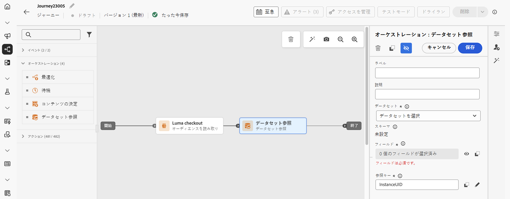
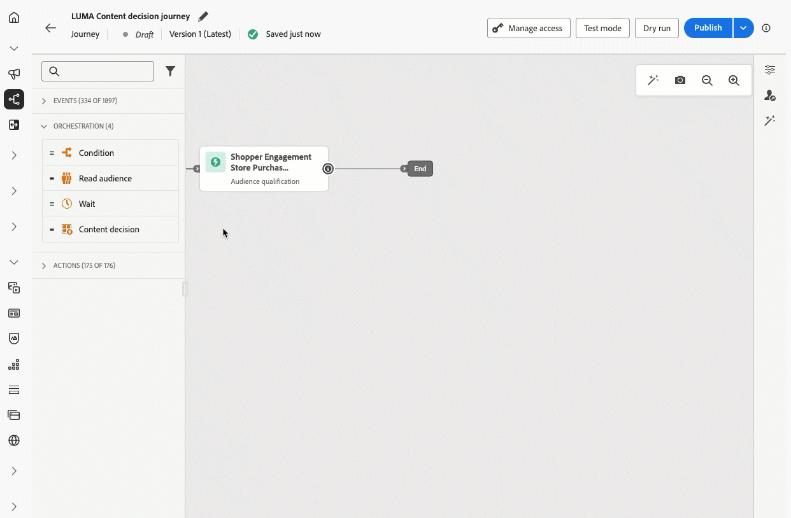
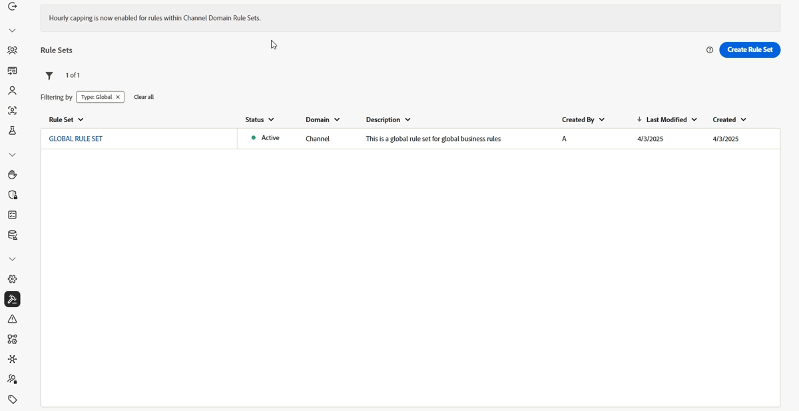
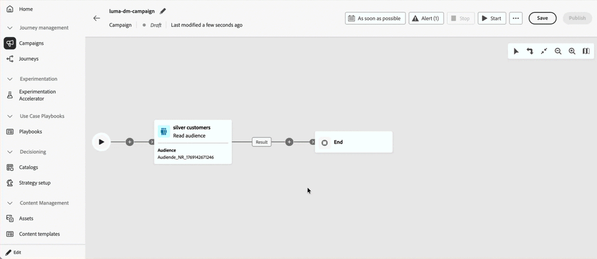

# 2026年リリースノート {#release-notes-2026}

このページでは、2026年にリリースされた [!DNL Journey Optimizer] の機能と改善点をすべて一覧表示しています。

## 2026年5月リリースノート {#may-26-rn}

### ジャーニー {#may-26-journeys}

このリリースでは、ジャーニーに次の機能と機能強化が追加されました。
<table>
<thead>
<tr>
<th><strong>ジャーニーフラグメント（限定提供）</strong> </th>
</tr>
</thead>
<tbody>
<tr>
<td>

Adobe Journey Optimizer で<strong>ジャーニーフラグメント</strong>を作成できるようになりました。 ジャーニーフラグメントは、一度作成すればサンドボックスをまたいで任意のジャーニーにドロップできる、再利用可能なジャーニーノードのセットです。 実施要件の確認、優先チャネルのルーティングロジック、ウェルカムシーケンスなど、フラグメントを使用することで、チームは毎回同じロジックをゼロから再作成することなく、より迅速に作業を進め、一貫性を維持できます。

作成したフラグメントは、専用の<strong>フラグメント在庫</strong>に保存され、<strong>ジャーニーフラグメント</strong>アクティビティを使用して任意のジャーニーに挿入できます。

<!--

-->

この機能は、一連の組織でのみ使用できます（限定提供）。 アクセスするには、アドビ担当者にお問い合わせください。

詳しくは、 <a href="../building-journeys/journey-fragments.md">詳細なドキュメント</a>を参照してください。

公開日：2026年5月13日（PT）

</td>
</tr>
</tbody>
</table>

<table>
<thead>
<tr>
<th><strong>ジャーニーシミュレーション（限定提供）</strong> </th>
</tr>
</thead>
<tbody>
<tr>
<td>

これで、ジャーニーを<strong>シミュレーション</strong>に設定できます。 このモードを使用すると、<strong>シミュレートされたユーザー</strong>を使用してロジックを検証できます。 これらはシミュレーション専用に作成された一時的なプロファイルで、Adobe Experience Platform で永続的なテストプロファイルを管理することなく、自由にテストできます。

この機能は現在、基本機能を備えた限定提供として、すべてのお客様にご利用いただけます。

詳しくは、<a href="../building-journeys/simulate-journey.md">詳細ドキュメント</a>を参照してください。

公開日：2026年5月5日（PT）

</td>
</tr>
</tbody>
</table>

<!--
<table>
<thead>
<tr>
<th><strong>Journey path optimization – Targeting (General Availability)</strong> </th>
</tr>
</thead>
<tbody>
<tr>
<td>

Use the new <strong>Optimize</strong> node to target specific audiences to determine the best path to meet your business-centric KPIs.

This tool allows you to develop more effective marketing campaigns that are more likely to resonate at the 1:1 level, improve marketing personalization efforts for customers and enhance critical customer engagement KPIs, such as conversions and revenue.

Previously available in Limited Availability, this capability is now available to all environments.

Availability date: June 1, 2026

</td>
</tr>
</tbody>
</table>

<table>
<thead>
<tr>
<th><strong>Journey Arbitration – ranking formulas (General Availability)</strong> </th>
</tr>
</thead>
<tbody>
<tr>
<td>

You can now use formulas to automatically boost journey priority scores based on customer profile attributes and contextual factors, ensuring customers enter the most relevant journeys.

Previously available in Limited Availability, this capability is now available to all environments.

Availability date: June 1, 2026

</td>
</tr>
</tbody>
</table>
-->

### オーケストレーションキャンペーン {#may-26-oc}

このリリースでは、オーケストレーションキャンペーンに次の機能と機能強化が追加されました。

<table>
<thead>
<tr>
<th><strong>連結されたオーケストレーションキャンペーン</strong> </th>
</tr>
</thead>
<tbody>
<tr>
<td>

オーケストレーションキャンペーンは、別のオーケストレーションキャンペーンの<strong>終了アクティビティ</strong>から直接トリガーすることで、相互にリンクできるようになりました。

これにより、複雑なオーケストレーションロジックをより小さく再利用可能なフローに分割でき、毎回再作成する代わりに、複数の親キャンペーンから呼び出すことができます。 実行時に渡されるペイロードは、ダウンストリームキャンペーンでセグメント化とパーソナライゼーションに使用できるので、リンクされた各キャンペーンは、受信したコンテキストに基づいて動作できます。

詳しくは、<a href="../orchestrated/trigger-orchestrated-campaign.md#signal-end">詳細ドキュメント</a>を参照してください。

公開日：2026年5月20日（PT）

</td>
</tr>
</tbody>
</table>

* **エンリッチメントアクティビティでリンクを追加** - オーケストレーションキャンペーンのエンリッチメントアクティビティで、「リンクを追加」機能が使用できるようになりました。 これにより、作業用テーブルデータと既存のデータベーステーブルとの間に直接的な関係を作成できます。

  公開日：2026年5月20日（PT）

<!--
+++ Coming soon — **Information below is subject to change.**

The following orchestrated campaign capability is expected in the upcoming days or weeks.

<table>
<thead>
<tr>
<th><strong>File-based targeting for orchestrated campaigns (Limited Availability)</strong> </th>
</tr>
</thead>
<tbody>
<tr>
<td>

Orchestrated campaigns now support loading a CSV or TXT file directly into the campaign canvas as the targeting audience, without first ingesting the file into Adobe Experience Platform. The file data is consumed at execution time and is not persisted as an Adobe Experience Platform dataset. During file setup, you can define column mappings, data types, NULL handling, and per-column error policies. This supports ad-hoc sends or partner list campaigns where building a full ingestion pipeline is not practical.

This capability is only available for a set of organizations (Limited Availability). To gain access, contact your Adobe representative.

Availability date: June 1, 2026

</td>
</tr>
</tbody>
</table>

* **Loop-based personalization for relational data** - The personalization editor now supports a Loop block that iterates over relational collections, such as orders, accounts, or bookings, and renders one content block per record inside a single email or SMS. Collections are configured through the data picker using personalization tokens, with no expression writing required.

  Availability date: Early June, 2026

* **Personalize email sender details per recipient and campaign** - Orchestrated campaigns now support personalization of email header fields, including From name, From address, and Reply-To, using profile attributes or relational data. This allows sender details to reflect the relevant advisor, location, or branch for each recipient, rather than routing all sends through a single corporate address.

  Header values can be set at the channel level and overridden per campaign using contextual data for more precise control.

  Availability date: Early June, 2026

+++
-->

### 決定 {#may-26-decisioning}

このリリースでは、決定に次の機能と機能強化が追加されました。

<table>
<thead>
<tr>
<th><strong>決定ルールとランキング式 AI 最適化</strong> </th>
</tr>
</thead>
<tbody>
<tr>
<td>

[!DNL Adobe Journey Optimizer] は、AI を使用して、簡素化できる決定ルールとランキング式を検出するようになりました。 在庫では、AI が最適化の機会を特定したルールには赤いインジケーターが表示されます。 インジケーターをクリックすると、AI が提案したバージョンと共に元の式が表示されます。 そこからファイルをダウンロードして、各バージョンでシミュレートされたプロファイルが評価される仕組みを確認し、同一に動作することを確認してから、式を最適化された式に置き換えることができます。

詳しくは、 <a href="../start/ai-features.md#decisioning-optimization">詳細なドキュメント</a>を参照してください。

公開日：2026年5月5日（PT）

</td>
</tr>
</tbody>
</table>

* **決定での Adobe Experience Manager コンテンツフラグメント** - Adobe Experience Manager コンテンツフラグメントを決定の決定項目にマッピングし、決定ポリシー内で活用することで、適切なフラグメントを適切な顧客に適切なタイミングで配信できるようになりました。 [詳細情報](../integrations/aem-fragments.md#aem-decisioning)

  この機能は、一連の組織でのみ使用できます（限定提供）。 アクセス権を取得するには、アドビ担当者にお問い合わせください。

  公開日：2026年5月20日（PT）

* **キャンペーンの概要からの決定ポリシーの詳細** - キャンペーンの概要ページから、キャンペーンを複製または編集することなく、選択戦略、決定項目、フォールバックオファーなど、各決定ポリシーの完全な構造を確認できるようになりました。 また、JSON 形式の概要をクリップボードにコピーして、アドビサポートまたはエンジニアリングチームにトラブルシューティングを依頼することもできます。 [詳細情報](../experience-decisioning/use-decision-policy.md#decision-policy-summary)

  公開日：2026年5月20日（PT）

* **移行ワークフローの決定に関する API** - 依存関係分析および移行ワークフローを作成する API 契約が更新されました。リクエスト URL に&#x200B;**クエリパラメーター**&#x200B;として **`request-level`**（`sandbox`、`offer` または `decision`）を渡します。 リクエストレベルは、JSON 本文に含めて送信しないでください。 [詳細情報](../experience-decisioning/decisioning-migration-api.md)

  公開日：2026年5月6日（PT）

### メールチャネル {#may-26-email}

このリリースでは、メールチャネルに次の機能と機能強化が追加されました。

<table>
<thead>
<tr>
<th><strong>E メールデザイナーのディープリンク</strong> </th>
</tr>
</thead>
<tbody>
<tr>
<td>

E メールデザイナーの専用オプションを使用して、メールコンテンツにディープリンクを追加できるようになりました。 これにより、ユーザーはブラウザーやアプリストアにリダイレクトされずに、アプリ内の適切なコンテンツに直接アクセスでき、コンテキストとエンゲージメントが維持されます。

ディープリンクオプションは、すべてのお客様が使用できますが、ディープリンクは、必要な設定とモバイルアプリの実装手順を完了した場合にのみ機能します。

詳しくは、<a href="../email/deeplinks.md">詳細ドキュメント</a>を参照してください。

公開日：2026年5月12日（PT）

</td>
</tr>
</tbody>
</table>

* **フラグメントでの継承の違反の制限** - フラグメントを作成または編集する際に、メールで使用される場合にフラグメントを変更できるかどうかを選択できるようになりました。 フラグメントをロックすることで、表示されるすべての場所で同期が維持され、ブランド標準やコンプライアンス要件に違反する可能性のあるローカル編集を防ぐことができます。 この設定は後で更新でき、今後の使用に適用されます。 [詳細情報](../content-management/create-fragments.md#lock-visual-fragment)

  公開日：2026年5月21日（PT）

### モバイルメッセージ（SMS、MMS、RCS） {#may-26-mobile}

このリリースでは、モバイルメッセージに次の機能と機能強化が追加されました。

<table>
<thead>
<tr>
<th><strong>新しいモバイルメッセージチャネルと強化された RCS メッセージ</strong> </th>
</tr>
</thead>
<tbody>
<tr>
<td>

Adobe Journey Optimizer では、SMS、MMS、RCS が単一の<strong>モバイルメッセージ</strong>アクションに統合され、すべてのモバイルメッセージタイプを 1 か所から簡単に管理できるようになりました。 この更新の一環として、新しいネイティブなオーサリングエクスペリエンスを通じて、画像、カルーセル、推奨アクションなどのリッチメディア RCS メッセージを Journey Optimizer で直接作成できるようになりました。

詳しくは、 <a href="../mobile/get-started-mobile.md">詳細なドキュメント</a>を参照してください。

公開日：2026年5月20日（PT）

</td>
</tr>
</tbody>
</table>

* **文字カウント** - Adobe Journey Optimizer では、文字カウントを使用して SMS メッセージの長さをリアルタイムで監視できるようになりました。 メッセージが複数のセグメントに分割されるタイミングを確認できるので、書式設定をより適切に管理し、送信コストの予期しない増加を回避できます。 [詳細情報](../mobile/create-mobile-message.md)

* **カスタムデータセットに対する SMS インバウンド** - **SMS API 資格情報**&#x200B;で、デフォルトのトラッキングデータセットだけでなく、選択した&#x200B;**カスタムのプロファイル対応エクスペリエンスイベントデータセット**&#x200B;に&#x200B;**インバウンド SMS** をルーティングします。 [詳細情報](../mobile/mobile-webhook.md)

* **Webhook インターフェイスの機能強化** - SMS webhook を設定する際に、ユーザーインターフェイスに実用的な例を含む組み込みの設定ガイドが含まれるようになりました。これにより、設定フローを離れることなく、プロバイダーのペイロードを調整し、問題のトラブルシューティングを行うことが簡単になります。 [詳細情報](../mobile/mobile-webhook.md)

* **SMS コンテンツのディープリンク** - URL ヘルパー機能を使用して、SMS コンテンツにディープリンクを追加できるようになりました。 これにより、必要な設定とモバイルアプリの実装手順を完了した場合に、受信者は web ブラウザーやアプリストアを通じてルーティングすることなく、目的のアプリ内コンテンツに直接移動できます。 [詳細情報](../email/deeplinks.md)

### WhatsApp チャネル {#may-26-whatsapp}

このリリースでは、WhatsApp チャネルに次の機能強化が追加されました。

* **WhatsApp ボタンのサポートとトラッキング** - WhatsApp テンプレートは、**クイック返信**、**コールトゥアクション - URL**、**コールトゥアクション - 電話番号**&#x200B;をサポートするようになりました。**コードをコピー**&#x200B;はサポートされていません。 Journey Optimizer は、サポートされているボタンを送信し、他のチャネルのレポートと共にインタラクションを追跡します。

* **WhatsApp チャネルコンテキストデータ** - Journey Optimizer は、WhatsApp チャネルから返される追加のインタラクションデータをキャプチャし、**AJO EmailTrackingExperienceEvent データセット**&#x200B;の `whatsAppChannelContext` フィールドグループに保存するようになりました。 [詳細情報](../whatsapp/send-whatsapp.md#whatsapp-channel-context)

  +++ 次のフィールドがキャプチャされ、オーディエンスの作成や WhatsApp エンゲージメントの分析に使用できます。

   * **`messageType`** - WhatsApp メッセージタイプ（例：`templateBased`、`response`）
   * **`inboundMessage`** - インバウンド返信コンテンツ（例：`stop`、`start`、`subscribe`）
   * **`inboundNumber`** - インバウンドメッセージを受信した送信者 ID
   * **`channelType`** - チャネルカテゴリ （`Utility`、`Marketing` または `Promotional`）
   * **`profileNumber`** - インバウンドメッセージを受信した電話番号
   * **`origTimestamp`** - Meta／WhatsApp の元のタイムスタンプ
   * **`status`** - 標準化されたプロバイダーのフィードバック （`sent`、`delivered`、`bounce`、`error`、`delay`、`duplicate`、`denylist`、`exclude` または `unknown`）と生のプロバイダーのステータスメッセージを含む配信ステータス
   * **`reactionEvent`** - ユーザー応答のコンテンツ：反応の場合は絵文字、特定のメッセージへの返信の場合はメッセージテキスト
   * **`reactionMessageID`** - 応答する元のメッセージの ID
   * **`reactionActionName`** – 応答アクションのタイプ（`react`、`unreact` または `reply`）
   * **`interactiveSelectedTitle`** - WhatsApp インタラクティブメッセージからユーザーが選択したタイトル
   * **`interactiveType`** - インタラクティブ メッセージタイプ（`list reply`、`button reply` または `button`）
   * **`interactiveSelectedDescription`** - 選択した WhatsApp インタラクティブオプションの説明
   * **`interactiveSelectedID`** - WhatsApp から選択したオプションの ID

  +++

### コンテンツと統合 {#may-26-content}

このリリースでは、コンテンツ管理と統合に次の機能と機能強化が追加されました。

<table>
<thead>
<tr>
<th><strong>コンテンツアドバイザーセレクター</strong> </th>
</tr>
</thead>
<tbody>
<tr>
<td>

Journey Optimizer は、Experience Manager Assets とコンテンツフラグメントの両方を選択するための統合モーダルである<strong>コンテンツアドバイザーセレクター</strong>を使用するようになりました。 新しいセレクターには、以下が含まれます。

<ul>
<li><strong>参照、検索、フィルタリング</strong>：すべてのアセットとフラグメントをまたいで実行できます。</li>
<li><strong>AI セマンティック検索</strong>：例えば、「山の中のコーヒー」のように、必要な内容をプレーンな言葉で記述することで、単なるテキスト一致ではなく、意味とコンテンツに基づいて文脈に沿って関連性の高いアセットを表示できます。 また、多言語クエリもサポートされています。</li>
<li><strong>概要のアップロード</strong>：マーケティングの概要をアップロードすると、そのコンテンツと要件に基づいてキャンペーンのコンテキストに一致するアセットが自動的に表示されます。</li>
<li><strong>Dynamic Media レンディション</strong>：セレクターから離れることなく、動的アセットの画像レンディションを選択して適用できます。</li>
</ul>

詳しくは、 <a href="../integrations/aem-content-advisor.md">詳細なドキュメント</a>を参照してください。

公開日：2026年5月19日（PT）

</td>
</tr>
</tbody>
</table>

<table>
<thead>
<tr>
<th><strong>統合</strong> </th>
</tr>
</thead>
<tbody>
<tr>
<td>

<b>統合</b>機能を使用すると、サードパーティのデータソースを Adobe Journey Optimizer に直接接続できます。 この機能により、外部データと<b>構成可能なコンテンツ</b>の取り込み方法が簡素化され、あらゆるチャネルをまたいで、パーソナライズされた動的なメッセージを容易に配信できるようになります。

この機能は、以前はベータ版でリリースされていましたが、現在はすべての環境で使用できるようになりました（一般提供）。

詳しくは、<a href="../integrations/integrations.md">詳細なドキュメント</a>を参照してください。

公開日：2026年5月4日（PT）

</td>
</tr>
</tbody>
</table>

* **アセットセレクターでの組織間のリポジトリへのアクセス** - Adobe Experience Manager アセットセレクター内で、複数の組織をまたいでリポジトリからアセットをシームレスに選択できるようになりました。

<!--
+++ Coming soon — **Information below is subject to change.**

* **Message Feedback Event Dataset moving to batch ingestion** - The `AJO Message Feedback Event Dataset` is transitioning from streaming to batch ingestion mode. This change ensures that data ingestion does not exceed streaming ingestion limits. If you use this dataset in Customer Journey Analytics reports or run queries against it, expect an increase in data latency of up to 2 hours going forward.

  Availability date: June 1, 2026

+++
-->

### 使いやすさの向上 {#may-26-usability}

2026年5月には、次の使いやすさの向上もリリースされました。

#### リスト

* **一括アクション** - **キャンペーン**、**フラグメント**、**テンプレート**&#x200B;のリストで複数の項目を一度に選択し、単一のアクションバーから一括操作を実行できるようになりました。これには、項目のパッケージへの追加、フォルダーへの移動、タグの編集、アクセス権の管理、アーカイブまたは削除が含まれます。 [詳細情報](../start/search-filter-categorize.md#bulk-actions)

  

* **並べ替えと列のサイズ変更** - **キャンペーン**、**フラグメント**、**テンプレート**&#x200B;のリストで、任意の列ヘッダーをクリックすることで並べ替えがサポートされるようになりました。 また、キャンペーンフォルダー表示では、**[!UICONTROL 優先度]**&#x200B;と&#x200B;**[!UICONTROL チャネル設定]**&#x200B;による並べ替えとフィルタリングも使用できます。 **フラグメント**&#x200B;と&#x200B;**テンプレート**&#x200B;のリストの列幅もサイズ変更できます。列の境界線をドラッグして、最も関心のあるデータに合わせて調整します。 [詳細情報](../start/search-filter-categorize.md#filter-lists)

#### コンテンツのオーサリング

* **インラインプロファイル属性編集** - E メールデザイナーのインラインプロファイル属性編集は、4月に初めてリリースされました。 5月のリリースの一環として、この機能は AI アシスタントから切り離され、プッシュチャネルエディターに拡張されました。 [詳細情報](../personalization/personalize.md#inline-personalization)

  

* **プッシュチャネルエディターのリンク URL ツールチップ** - リンクまたはメディアフィールドの URL が長すぎて表示できない場合、フィールドの横にツールチップアイコンが常に表示されます。アイコンにポインタを合わせると、完全な URL が表示されます。 [詳細情報](../push/design-push.md#on-click-behavior)

  

<!--
#### Simulation & Preview

* **Redesigned preview experience** - The content preview screen has been redesigned with a side-by-side layout that lets you compare how your content renders across multiple profiles at a glance, enabling quicker and more confident reviews before sending. [Learn more](../test-approve/simulate-sample-input.md#preview)

  
-->

<!--
+++ Coming soon — **Information below is subject to change.**

* **Folders for journeys and campaigns** - You can now organize your journeys and campaigns into folders to improve navigation and management in the interface.

  Availability date: Early June, 2026

+++
-->

## 2026年4月リリースノート {#april-26-rn}

### 新機能 {#april-26-features}

2026年4月にリリースされた機能は次のとおりです。

<table>
<thead>
<tr>
<th><strong>オーケストレーションキャンペーンでの増分クエリアクティビティ</strong> </th>
</tr>
</thead>
<tbody>
<tr>
<td>

<strong>オーケストレーションキャンペーン</strong>では、前回の実行以降に新しく実施要件を満たすプロファイルまたはイベントのみをターゲットにする<strong>増分クエリ</strong>アクティビティがサポートされるようになりました。

これにより、クエリのワークロードを軽減し、時間の経過と共に重複した送信を回避する一方で、繰り返しキャンペーンは新規オーディエンス（新規登録者、新たに選定されたロイヤルティメンバー、類似のセグメント）に焦点を当てることができます。

詳しくは、<a href="../orchestrated/activities/incremental-query.md#incremental-query-configuration">詳細なドキュメント</a>を参照してください。

公開日：2026年4月30日（PT）

</td>
</tr>
</tbody>
</table>

<table>
<thead>
<tr>
<th><strong>メールヘッダーの送信者パラメーター</strong> </th>
</tr>
</thead>
<tbody>
<tr>
<td>

Journey Optimizer では、送信者（Sender）と作成者（From）が異なるメールを送信できるようになりました。 これに対応しているメールクライアントでは、通常、「Sender が From に代わって送信」としてレンダリングするか、「経由」インジケーターが表示されます。 この機能を設定するには、メールチャネル設定のオプションの「<strong>送信者ヘッダー</strong>」フィールドに入力します。

詳しくは、<a href="../email/header-parameters.md#sender-header">詳細ドキュメント</a>を参照してください。

</td>
</tr>
</tbody>
</table>

<table>
<thead>
<tr>
<th><strong>電子メールチャネル設定の CC フィールド</strong> </th>
</tr>
</thead>
<tbody>
<tr>
<td>

メールチャネル設定でオプションの CC（カーボンコピー）フィールドを設定できるようになりました。 BCC とは異なり、CC 受信者はプライマリ受信者にも表示されるため、透明性のあるコミュニケーションと明確な担当者の特定が可能になります。

これにより、リレーションシップマネージャーやアカウントオーナーなど、適切な関係者を各メッセージに自動的にコピーすることができ、同時に顧客がフォローアップのために誰に連絡すべきかを確実に把握することができます。

CC フィールドはパーソナライゼーションをサポートしているので、単一の設定でプロファイルデータに基づいてコピーを動的にルーティングでき、追加設定なしで複数のユースケースに対応できます。

詳しくは、<a href="../configuration/cc-email-field.md">詳細ドキュメント</a>を参照してください。

</td>
</tr>
</tbody>
</table>

<table>
<thead>
<tr>
<th><strong>サンドボックスをまたいでオーケストレーションキャンペーンをコピー</strong> </th>
</tr>
</thead>
<tbody>
<tr>
<td>

サンドボックスツールは、オーケストレーションキャンペーンのあるサンドボックスから別のサンドボックスへのパッケージ化とコピーをサポートするようになりました。 これにより、各環境でキャンペーンを手動で再作成する必要がなくなります。 キャンペーンをパッケージ化すると、結合ポリシーやメッセージなどのコアとなる依存オブジェクトが自動的に含まれるので、インポートされたキャンペーンは設定と検証の準備が整った状態で到達します。 本番環境を保護するために、インポートされたすべてのキャンペーンはターゲットサンドボックス内でドラフトステータスとなり、チームはキャンペーンが公開される前にレビューと承認のステップを行うことができます。

詳しくは、<a href="../configuration/copy-objects-to-sandbox.md">詳細ドキュメント</a>を参照してください。

</td>
</tr>
</tbody>
</table>

<table>
<thead>
<tr>
<th><strong>MCP を介した Journey Optimizer AI Agent の統合</strong> </th>
</tr>
</thead>
<tbody>
<tr>
<td>

Adobe Journey Optimizer は、<strong>MCP（Model Context Protocol）サーバー</strong>を提供するようになり、キャンペーン、チャネル設定、サンドボックス操作を、MCP 互換アプリケーション内から直接利用できるようになりました。 この統合により、様々なペルソナが同じオーケストレーションデータを使用して共同作業を行うことができます。 Adobe Journey Optimizer REST API に対してクエリを記述したり、複数の UI 画面を操作したりする代わりに、会話形式で意図を説明し、LLM で適切な MCP ツールを呼び出すことができます。 この機能は現在、Claude Web 版とデスクトップ版で使用できます。

この機能は、パブリックベータ版のすべてのユーザーが使用できます。

詳しくは、 <a href="../integrations/ajo-mcp.md">詳細なドキュメント</a>を参照してください。

</td>
</tr>
</tbody>
</table>

<table>
<thead>
<tr>
<th><strong>ジャーニーの判別 - AI モデル</strong> </th>
</tr>
</thead>
<tbody>
<tr>
<td>

ランキング式で<strong>AI モデル</strong>を使用して、顧客プロファイル属性とコンテキスト要因に基づいてジャーニーの優先度スコアを自動的に高め、顧客が最も関連性の高いジャーニーにエントリできるようにしました。

この機能は、一連の組織でのみ使用できます（限定提供）。 アクセスするには、アドビ担当者にお問い合わせください。

詳しくは、<a href="../conflict-prioritization/journey-ai-models.md">詳細ドキュメント</a>を参照してください。

</td>
</tr>
</tbody>
</table>

<table>
<thead>
<tr>
<th><strong>Adobe Express の統合</strong> </th>
</tr>
</thead>
<tbody>
<tr>
<td>

Adobe Journey Optimizer の <b>Adobe Express 統合</b>では、コンテンツ作成中に Adobe Express の編集ツールを直接使用でき、背景のサイズ変更、削除、切り抜き、アセットの JPEG または PNG への変換ができるようになります。

この機能は、以前は限定提供でリリースされていましたが、現在はすべての環境で使用できるようになりました（一般提供）。

詳しくは、<a href="../integrations/express.md">詳細ドキュメント</a>を参照してください。

公開日：2026年4月23日（PT）

</td>
</tr>
</tbody>
</table>

<table>
<thead>
<tr>
<th><strong>AI インボックス用のメールの最適化</strong> </th>
</tr>
</thead>
<tbody>
<tr>
<td>

Adobe Journey Optimizer に、Apple Intelligence や Gmail の Google Gemini などの AI を活用したインボックス向けにメールを最適に構造化する新機能が追加されました。

AI アシスタントが受信者のメールの読み方や対応方法をますます制御するようになるにつれ、この機能は、要約、トリアージ、優先順位付け、インテント抽出など、ダウンストリームの AI タスクをまたいで優れたパフォーマンスを発揮するコンテンツの生成と作成に役立ちます。

詳しくは、<a href="../email/llm-email-optimizer.md">AI インボックス用のメールの最適化</a>を参照してください。

公開日：2026年4月17日（PT）

</td>
</tr>
</tbody>
</table>

<table>
<thead>
<tr>
<th><strong>パーソナライゼーション式用 AI アシスタント</strong> </th>
</tr>
</thead>
<tbody>
<tr>
<td>

[!DNL Adobe Journey Optimizer] 自然言語プロンプトを有効なパーソナライゼーション式と条件付きロジックに変換する <strong>AI アシスタント</strong>が、パーソナライゼーションエディターと E メールデザイナーに直接含まれるようになりました。構文の専門知識は必要ありません。 達成したいパーソナライゼーションを説明すると、AI がすぐに適用できる使いやすいコードを生成したり、フォローアッププロンプトを通じて調整したりできます。

アシスタントは、逆方向にも機能します。 既存の式を選択して、ロジックの説明、問題の特定、改善の提案を依頼します。 これにより、新しい式のオーサリングだけでなく、チームをまたいで既存の式をレビューおよびデバッグするのに役立ちます。

詳しくは、<a href="../content-management/generative-personalization-expressions.md">パーソナライゼーション式用 AI アシスタント</a>を参照してください。

公開日：2026年4月13日（PT）

</td>
</tr>
</tbody>
</table>

<table>
<thead>
<tr>
<th><strong>ジャーニーのパス実験</strong> </th>
</tr>
</thead>
<tbody>
<tr>
<td>

新しい<strong>最適化</strong>ノードを使用して A/B テストまたはマルチアームバンディット実験を実行して、ビジネス目標に焦点を合わせた KPI を達成する最適なパスを決定します。このツールを使用すると、コミュニケーション、シーケンス、タイミングをテスト、調整、カスタマイズし、顧客に最も効果的にリーチできます。

この機能は、以前は限定提供でリリースされていましたが、現在はすべての環境で使用できるようになりました（一般提供）。

一般提供の一部として、このリリースでは、<strong>実験タイプ</strong>の選択（A/B テストまたはマルチアームバンディット）と、単一ジャーニーの<strong>勝者をスケール</strong>が導入されています。

詳しくは、<a href="../building-journeys/path-experimentation.md">詳細ドキュメント</a>を参照してください。

公開日：2026年4月7日（PT）

</td>
</tr>
</tbody>
</table>

<table>
<thead>
<tr>
<th><strong>インボックス</strong> </th>
</tr>
</thead>
<tbody>
<tr>
<td>

<strong>インボックス</strong>は、コンテンツカードで使用できるモバイル機能で、顧客がアプリや web サイト内に、ユーザーに送信されたメッセージを表示する一元化された場所を作成できるようにします。 これにより、メッセージが却下された後もアクセス可能な状態が維持されるので、マーケティングコミュニケーションの有効期間を延長できます。

詳しくは、<a href="../inbox/inbox-gs.md">詳細ドキュメント</a>を参照してください。

公開日：2026年4月7日（PT）

</td>
</tr>
</tbody>
</table>

<table>
<thead>
<tr>
<th><strong>メールチャネルでの決定のサポート</strong> </th>
</tr>
</thead>
<tbody>
<tr>
<td>

<strong>決定</strong>を使用して、メールメッセージのコンテンツをパーソナライズおよび最適化できるようになりました。 優先度スコア、数式、AI モデルを活用して、各受信者に最も関連性の高いオファーやコンテンツを表示します。

この機能は、以前は限定提供でリリースされていましたが、現在はすべての環境で使用できるようになりました（一般提供）。 この一般提供リリースでは、ミラーページがサポートされるようになりました。

詳しくは、<a href="../experience-decisioning/create-decision-policy.md">詳細ドキュメント</a>を参照してください。

公開日：2026年4月6日（PT）

</td>
</tr>
</tbody>
</table>

### 機能強化 {#april-26-improv}

2026年4月には、次の機能強化もリリースされました。

#### AI

<!--
* **Brand alignment score in Campaign dashboard** - You can now assess your brand alignment score directly within your Campaign dashboard to ensure content stays on-brand. This allows you to verify guidelines at a glance without having to open the content designer.
-->

* **プロンプトアシスタントの機能強化** - プロンプトアシスタントは、ユーザープロンプトをリアルタイムで分析し、明確さ、完全性、コンテキストのギャップを特定することで、AI コンテンツ生成を強化します。 これは、書き換えの改善を提案し、オーディエンス、トーン、意図などの主な詳細を含むプロンプトに強化するための、実用的なガイダンスを提供します。 また、この機能は、生成前にユーザーが入力を調整できるように、ターゲットにする明確な質問を行います。 これにより、より少ない反復で、より正確で高品質な出力が得られます。 [詳細情報](../content-management/ai-assistant-prompting-guide.md#prompt-assistant)

  公開日：2026年5月5日（PT）

#### プッシュ

* **チャネル設定でアプリ ID をパーソナライズ** - プッシュチャネル設定で、「**アプリ ID**」フィールドをパーソナライズできるようになりました。これにより、各受信者はプロファイル情報に基づいて適切なブランドからのプッシュ通知を受信できます。 [詳細情報](../push/push-configuration.md#app-id-personalization)

#### 決定

* **移行ワークフローの決定に関する API** - 依存関係分析および移行ワークフローを作成する API 契約が更新されました。リクエスト URL に&#x200B;**クエリパラメーター**&#x200B;として **`request-level`**（`sandbox`、`offer` または `decision`）を渡します。 リクエストレベルは、JSON 本文に含めて送信しないでください。 [詳細情報](../experience-decisioning/decisioning-migration-api.md)

  公開日：2026年5月6日（PT）

* **フラグメントを決定項目に添付** - Journey Optimizer では、決定ポリシーを通じてコードベースのエクスペリエンスやメールキャンペーンで活用できるフラグメントを決定項目に添付できるようになりました。 [詳細情報](../experience-decisioning/fragments-decision-policies.md)

  この機能は、以前は限定提供でリリースされていましたが、現在はすべての環境で使用できるようになりました（一般提供）。

* **一時的に使用できないフラグメントはスキップされる** - 決定項目でフラグメントを使用する際に、フラグメントが Edge で一時的に使用できない場合、そのフラグメントはスキップされ、ジャーニーまたはキャンペーンは失敗することなくレンダリングが続行されます。 [詳細情報](../experience-decisioning/fragments-decision-policies.md#temporary-unavailable-fragments)

  公開日：2026年4月14日（PT）

#### Adobe Experience Manager の統合

* **Adobe Experience Manager コンテンツフラグメントのバリエーションのサポート** - Adobe Experience Manager コンテンツフラグメントを挿入する際に、**コンテンツフラグメントのバリエーション**（例：言語やチャネルのバリアント）を選択できるようになりました。ロケールや多言語のシナリオに対する処理が改善されました。 [詳細情報](../integrations/aem-fragments.md#aem-variations)

  この機能は、以前は限定提供でリリースされていましたが、現在はすべての環境で使用できるようになりました（一般提供）。

* **オーサリング中の Adobe Experience Manager コンテンツフラグメントコンテキスト** - テキストフィールドとコンテンツブロック間を移動しても、選択したコンテンツフラグメントはアクティブなままなので、**AEM コンテンツアドバイザーを開く**&#x200B;を毎回開き直すことなく、フラグメントフィールドを追加できます。 [詳細情報](../integrations/aem-fragments.md)

  この機能は、以前は限定提供でリリースされていましたが、現在はすべての環境で使用できるようになりました（一般提供）。

#### メールデザイン

* **メールコンテンツ用の高度な HTML エディター** - 高度な HTML モードでは、E メールデザイナーでコンテンツの HTML ソースを編集し、ソースに高度な式（条件など）を追加し、変更を失うことなく HTML ビューとデスクトップビューを切り替えることができます。

  以前はメールコンテンツテンプレートでのみ使用できたこの機能は、メールコンテンツテンプレートに加えて、E メールデザイナーの&#x200B;**メール**&#x200B;コンテンツ（例：ジャーニーやキャンペーンで作成されたメール）にもデプロイされるようになりました。 現在は、限定提供です。アクセス権を取得するには、アドビ担当者にお問い合わせください。 [詳細情報](../email/email-expert-mode.md)

  公開日：2026年4月9日（PT）

#### ジャーニー

* **ジャーニープロパティに表示されるジャーニーペイロードの現在のサイズ** - ジャーニープロパティパネルに、設定された制限と比較したジャーニーペイロードの現在のサイズが表示されるようになりました。例：*1.5 MB（4 MB 中）*。 この読み取り専用インジケーターを使用すると、公開前にジャーニーの複雑さを監視し、ペイロードサイズ制限の超過によるエラーを回避できます。 [詳細情報](../building-journeys/journey-properties.md#journey-payload-size)

  公開日：2026年4月30日（PT）

#### ジャーニーパスの最適化

* **実験タイプ** - パス実験を設定する際に、A/B 実験（開始時に固定分割）またはマルチアームバンディット（毎週重み付けが更新される自動分割）を選択できるようになりました。 [詳細情報](../building-journeys/path-experimentation.md)

  公開日：2026年4月7日（PT）

* **パス実験：勝者をスケール** - 実験の勝利パスをすべてのオーディエンスに自動または手動でロールアウトできるようになりました。 勝者が決定したら、実験を常に監視することなく、そのリーチと効果を増幅できます。 [詳細情報](../building-journeys/path-experimentation.md#scale-winner)

  この機能は、単一ジャーニー（イベントトリガーおよびオーディエンスの選定）でのみ使用できます。 オーディエンスを読み取りジャーニーでは使用できません。

  公開日：2026年4月7日（PT）

* **条件** - [最適化](../building-journeys/optimize.md)アクティビティは、ジャーニーで条件付きパスを作成するための新しい手段です。 UI から削除された以前の&#x200B;**条件**&#x200B;アクティビティに置き換わります。 すべての条件付きロジックは保持され、**最適化**&#x200B;アクティビティの条件を通じて処理されるようになりました。 [詳細情報](../building-journeys/conditions.md)

  この機能は、以前は限定提供でリリースされていましたが、現在はすべての環境で使用できるようになりました（一般提供）。

  公開日：2026年4月7日（PT）

#### オーケストレーションキャンペーン

* **オーケストレーションキャンペーンのグローバル変数** - オーケストレーションキャンペーンでは、一度定義すればワークフロー内のすべてのアクティビティで再利用できるグローバル変数がサポートされるようになりました。これにより、設定がシンプル化され、動的な値、式、コンテンツのパーソナライゼーションで一貫性が確保されます。 [詳細情報](../orchestrated/global-variables.md)
* **データモデラーの機能強化** - 調整されたリレーショナルスキーマで、複数のフィールドにまたがる複合キーがサポートされるようになりました。 また、DDLファイルからスキーマを読み込むと定義済みリストも取り込まれ、DDL ファイルまたは Excel ファイルのいずれかから読み込むと、テーブル間の複合関係が自動的に作成されます。 エンティティ関係ビューでは、ファイルのアップロード後、複合リンクにテーブル間のフィールドペアリングの完全なセットが表示されるようになりました。 [詳細情報](../orchestrated/gs-schemas.md)

## 2026年3月リリースノート {#march-26-rn}

[新機能](#march-26-features)および[機能強化](#march-26-improv)の節では、既に使用可能な機能について説明します。<!--The [Coming soon](#coming-soon) section lists features and improvements scheduled for release later in March.-->

<!--
**The pre-release notes below are subject to change without prior notice until the release availability date**. Links, screens and updated documentation are published in the release notes, at the release date.

See also [Adobe Experience Platform pre-release notes](https://experienceleague.adobe.com/en/docs/experience-platform/release-notes/pre-release-notes){target="_blank"}.
-->

**リリース日**：2026年3月24～25日（PT）

### 新機能 {#march-26-features}

<table>
<thead>
<tr>
<th><strong>URL パラメーターの暗号化</strong> </th>
</tr>
</thead>
<tbody>
<tr>
<td>

メールメッセージに追加されたトラッキングリンクやランディングページリンクに含まれる URL パラメーターを暗号化できるようになり、機密性の高いパラメーターデータにさらなるセキュリティレイヤーが提供されます。

<ul>
<li>専用の<strong>管理</strong>レジストリに暗号化キーを登録して管理します。</li>
<li>式で新しい「暗号化」ヘルパー関数を使用して、レンダリング時に保護するクエリパラメーターの URL 内の機密データを暗号化します。</li>
</ul>

この機能は、一連の組織でのみ使用できます（限定提供）。 アクセスするには、アドビ担当者にお問い合わせください。

詳しくは、<a href="../personalization/url-parameter-encryption.md">詳細ドキュメント</a>を参照してください。

公開日：2026年3月31日（PT）

</td>
</tr>
</tbody>
</table>

<table>
<thead>
<tr>
<th><strong>メールコンテンツテンプレートへの画像の変換</strong> </th>
</tr>
</thead>
<tbody>
<tr>
<td>

Journey Optimizer では、画像を直接メールコンテンツテンプレートに変換できるようになりました。 AI を活用した分析により、視覚的な参照から構造化された HTML テンプレートを自動生成することで、メールデザインの時間を大幅に短縮できます。

この機能は、以前は限定提供でリリースされていましたが、現在はすべての環境で使用できるようになりました（一般提供）。

詳しくは、<a href="../content-management/image-to-html.md">詳細ドキュメント</a>を参照してください。

公開日：2026年3月31日（PT）

</td>
</tr>
</tbody>
</table>

<table>
<thead>
<tr>
<th><strong>ランディングページのカスタムフォーム</strong> </th>
</tr>
</thead>
<tbody>
<tr>
<td>

[!DNL Journey Optimizer] を使用すると、ランディングページを通じてプロファイル属性を取得できます。

特定のデータセットに基づいて、ニーズに合わせてカスタマイズされたカスタムフォームを作成、デザイン、管理します。 その後、ランディングページでこれらのフォームを活用して、各フォームに定義されたデータセットに選択したプロファイル属性を追加できます。

この機能は、以前は米国とオーストラリアの顧客向けに限定提供でリリースされていましたが、現在はすべての環境で使用できるようになりました（一般提供）。

詳しくは、<a href="../landing-pages/lp-forms.md">詳細ドキュメント</a>を参照してください。

公開日：2026年3月26日（PT）

</td>
</tr>
</tbody>
</table>

<table>
<thead>
<tr>
<th><strong>オーケストレーションキャンペーンのテストアクティビティ</strong> </th>
</tr>
</thead>
<tbody>
<tr>
<td>

新しい<strong>テスト</strong>アクティビティが、オーケストレーションキャンペーンで使用できるようになりました。 このアクティビティにより、定義済みの条件に基づいてワークフローの実行を異なる分岐にルーティングし、ライブ配信をアクティブ化する前にキャンペーンのロジックと設定を検証できます。

詳しくは、<a href="../orchestrated/activities/test.md">詳細ドキュメント</a>を参照してください。

</td>
</tr>
</tbody>
</table>

<table>
<thead>
<tr>
<th><strong>ジャーニーでのデータセット参照のサポート</strong> </th>
</tr>
</thead>
<tbody>
<tr>
<td>

ジャーニーの新しい<strong>データセット参照</strong>アクティビティを使用すると、実行時に Adobe Experience Platform レコードデータセットからデータを動的に取得できます。これにより、プロファイルやイベントペイロードに含まれていない情報にアクセスできるので、顧客とのインタラクションの関連性を高め、タイムリーな状態を維持できます。

以前は制限された一連の組織に対して限定提供でリリースされていましたが、ジャーニーのデータセット参照アクティビティは、限定提供のまま、[データセット参照]（../data/lookup-aep-data.md）の資格を持つすべての顧客が使用できるようになりました。

詳しくは、<a href="../building-journeys/dataset-lookup.md">詳細ドキュメント</a>を参照してください。

</td>
</tr>
</tbody>
</table>

<table>
<thead>
<tr>
<th><strong>チャネル固有のジャーニーアクティビティに代わるアクションアクティビティ</strong> </th>
</tr>
</thead>
<tbody>
<tr>
<td>

2026年2月の<strong>アクションアクティビティ</strong>の一般提供に続いて、ジャーニーキャンバスでの従来のネイティブチャネルアクティビティ（メール、プッシュ、SMS、アプリ内、web、コードベースのエクスペリエンス、コンテンツカード）は非推奨（廃止予定）となりました。

これで、チャネル固有の個別のノードの必要性に代わり、単一のアクションアクティビティを使用してすべてのチャネルアクションを設定する必要があります。

従来のチャネルアクティビティを使用している既存のジャーニーでは、変更や移行を必要とせずに引き続き機能します。

詳しくは、<a href="../building-journeys/journey-action.md">詳細ドキュメント</a>を参照してください。

</td>
</tr>
</tbody>
</table>

<table>
<thead>
<tr>
<th><strong>メールテンプレート用の高度な HTML エディター</strong> </th>
</tr>
</thead>
<tbody>
<tr>
<td>

メールコンテンツテンプレートの高度な HTML モードでは、E メールデザイナーでコンテンツの HTML ソースを編集し、ソースに高度な式（条件など）を追加し、変更を失うことなく HTML ビューとデスクトップビューを切り替えることができます。

この機能は、メールチャネルのコンテンツテンプレートでのみ使用できます。 現在は、限定提供です。アクセス権を取得するには、アドビ担当者にお問い合わせください。

詳しくは、<a href="../email/email-expert-mode.md">詳細ドキュメント</a>を参照してください。

公開日：2026年3月10日（PT）

</td>
</tr>
</tbody>
</table>

<table>
<thead>
<tr>
<th><strong>カスタム Firefly モデルとサードパーティの画像生成モデルの統合</strong> </th>
</tr>
</thead>
<tbody>
<tr>
<td>

標準およびカスタムの Firefly モデルと、承認済みのサードパーティ画像モデルをシームレスに統合することで、画像生成時の柔軟性、コントロール、ブランド一致を向上できます。

ニーズに適したモデルの選択：

<ul><li> <strong>Adobe モデル</strong>（Firefly Image Model 4 を活用）は、追加設定なしで即座に画像生成を実現します</li><li> <strong>パートナーモデル</strong>（Gemini 2.5 Flash を活用）は、特殊な機能を提供します</li><li><strong>カスタムモデル</strong>（独自のアセットでトレーニングされたブランド固有のモデル）は、ブランドアイデンティティ、スタイル、ビジュアルガイドラインに正確に一致したブランドに即した生成を実現します</li></ul>

詳しくは、<a href="../content-management/generative-models.md">詳細なドキュメント</a>を参照してください。

公開日：2026年3月2日（PT）

</td>
</tr>
</tbody>
</table>

<table>
<thead>
<tr>
<th><strong>iOS のライブアクティビティ</strong> </th>
</tr>
</thead>
<tbody>
<tr>
<td>

Adobe Journey Optimizer の <strong>iOS ライブアクティビティ</strong>を使用すると、リアルタイムのエクスペリエンスを顧客のロック画面や Dynamic Island に直接提供できます。 注文トラッキングやフライトステータスからイベントのカウントダウン、ライブスコア、配送の進行状況まで、ユーザーがアプリを開く必要なく、ライブアップデートを提供します。 オーディエンスがいる場所で、まさに適切なタイミングで、情報を提供し、エンゲージメントを高めます。

この機能は、以前はベータ版でリリースされていましたが、現在はすべての環境で使用できるようになりました（一般提供）。

詳しくは、<a href="../mobile-live/get-started-mobile-live.md">詳細なドキュメント</a>を参照してください。

公開日：2026年3月3日（PT）

</td>
</tr>
</tbody>
</table>

<table>
<thead>
<tr>
<th><strong>Journey エージェント：チャネルコンテンツ作成</strong> </th>
</tr>
</thead>
<tbody>
<tr>
<td>

<strong>Adobe Experience Platform エージェントオーケストレーター</strong>を活用した <strong>Journey エージェント</strong>は、Journey Optimizer で使用でき、自然言語インターフェイスを通じてジャーニーを分析できます。 また、Journey エージェントで直接チャネル固有のコンテンツを生成および管理して、メールやプッシュなどのチャネルのコンテンツを作成し、テンプレートを適用してプレビューし、プロンプトを通じてトーンやスタイルを調整し、コンテキスト内での編集用に<strong>コンテンツデザイナー</strong>でコンテンツを開くことができるようになりました。

この機能は、一連の組織でのみ使用できます（限定提供）。 アクセス権を取得するには、アドビ担当者にお問い合わせください。

詳しくは、<a href="https://experienceleague.adobe.com/docs/experience-cloud-ai/experience-cloud-ai/agents/ajo-agent.html?lang=ja" target="_blank">詳細なドキュメント</a>を参照してください。

公開日：2026年3月4日（PT）

</td>
</tr>
</tbody>
</table>

<table>
<thead>
<tr>
<th><strong>AI モデル監視</strong> </th>
</tr>
</thead>
<tbody>
<tr>
<td>

Journey Optimizer では、決定 AI モデルの健全性、トレーニングステータス、パフォーマンスを監視できるようになりました。 これにより、トレーニングの成功を検証し、失敗のトラブルシューティングを行い、成果への影響を理解することで、AI を使用して顧客ごとに最適なオファーを選択できます。 この機能は<strong>決定</strong>でのみ使用できます（従来の意思決定管理モデルでは使用できません）。

この機能は現在、<strong>パーソナライズされた最適化</strong>モデルでのみ使用できます（自動最適化では使用できません）。

詳しくは、<a href="../experience-decisioning/ranking/ai-model-observability.md">詳細ドキュメント</a>を参照してください。

公開日：2026年3月9日（PT）

</td>
</tr>
</tbody>
</table>

<table>
<thead>
<tr>
<th><strong>シグナルを使用したオーケストレーションキャンペーンのトリガー</strong> </th>
</tr>
</thead>
<tbody>
<tr>
<td>

オーケストレーションキャンペーンは、<strong>API シグナル</strong>経由でトリガーできるようになりました。 これを設定するには、ターゲットキャンペーンを<strong>シグナルによりトリガー</strong>として設定し、公開してから、API 呼び出しを使用して実行します。 API 呼び出しに含まれるパラメーターは、実行中のキャンペーン内の変数として使用できます。 シグナルによってトリガーされるオーケストレーションキャンペーンは<strong>バッチ</strong>キャンペーンのままで、API によってトリガーされるキャンペーンとは異なります。

詳しくは、<a href="../orchestrated/trigger-orchestrated-campaign.md">詳細ドキュメント</a>を参照してください。

</td>
</tr>
</tbody>
</table>

<table>
<thead>
<tr>
<th><strong>オーケストレーションキャンペーンのトランザクションカテゴリ</strong> </th>
</tr>
</thead>
<tbody>
<tr>
<td>

オーケストレーションキャンペーンでは、チャネルアクティビティを<strong>トランザクション</strong>カテゴリに設定できるようになりました。 これは、トランザクションチャネルの設定をそのアクティビティに適用し、ビジネスルールを適用しない場合や、顧客のオプトインが不要な場合に役立ちます。

詳しくは、<a href="../orchestrated/activities/channels.md#add">詳細ドキュメント</a>を参照してください。

この機能は、今後数日間にわたってすべての地域に段階的にロールアウトされます。

</td>
</tr>
</tbody>
</table>

### 機能強化 {#march-26-improv}

このリリースに含まれる機能強化を以下に示します。

#### パーソナライゼーション

* **完全／ベース URL のパーソナライゼーション** - プロファイル属性（例：ドメインやパス）を使用して、宛先 URL をパーソナライズできます。 この機能を有効にするには、受け入れたドメインのリストをアドビに提供します。 [詳細情報](../personalization/personalization-build-expressions.md#where)

  この機能は、以前はジャーニーでの使用に限定提供でリリースされていましたが、現在はすべての環境で使用できるようになりました（一般提供）。

  公開日：2026年4月1日（PT）

#### レポート

* **送信時間の最適化：更新されたコントロールの場所と新しい上昇率レポート** - 送信時間の最適化（STO）コントロールは、アクション設定メニューに移動されました。 また、ジャーニーレポートで新しい上昇率レポートを使用できるようになりました。このレポートを使用して、キャンペーンのパフォーマンス指標に対する STO の影響を測定できます。 [詳細情報](../reports/channel-report-cja.md#optimization-models)

  公開日：2026年3月27日（PT）

<!--
* **Exclude bot clicks for email and SMS reporting** - Email and SMS reporting now automatically filters out bot clicks from click metrics, providing more accurate engagement data and preventing automated traffic from inflating your performance figures.

#### Email Designer

* **Email Designer displayed in Unified Shell** - The Email Designer is now displayed within the Unified Shell experience, providing a consistent navigation and header experience that aligns with other Adobe applications.

* **Text mode support in fragments** - To support text-based email workflows, you can now create and manage text versions of your visual fragments for optimal use in the plain text version of emails that include that fragment.

  **Caution:** When using a fragment that was created before the current release, the fragment text version may be incorrectly rendered—both in the Email Designer and in the final email delivered to your recipients. For best results with older fragments, edit, save and republish each fragment.
-->

#### 設定

<!--* **Folders for journeys and campaigns** - You can now organize your journeys and campaigns into folders, enabling structured navigation and easier management for teams working with large volumes of content. This capability is only available for a set of organizations (Limited Availability). To gain access, contact your Adobe representative.-->

* **AJO ドメイン証明書の更新に失敗しました** - メール配信品質に使用されるドメイン証明書の有効期限が近づいている場合や既に期限切れになっている場合に、メールまたは Journey Optimizer 通知センターでシステムアラートを受信するように登録できるようになりました。 [詳細情報](../reports/alerts.md#alert-certificates-renewal-unsuccessful)

  公開日：2026年3月26日（PT）

* **AJO セカンダリ受信者フィードバックイベントデータセットの名前変更** - `AJO Email BCC Feedback Event` データセットは `AJO Secondary Recipient Feedback Event` データセットに名前が変更されました。 影響は状況によって異なります。

   * **既存のユーザー**：表示名のみが更新されます。 基になるテーブル名は変更されないままです。
   * **新しいユーザーとサンドボックス**：表示名とテーブル名の両方に新しい名前が反映されます。
   * **新しいサンドボックスを持つ既存のユーザー**：表示名とテーブル名の両方が新しい名前に更新されます。

  >[!NOTE]
  >
  >新しいデータセットには、新しい名前がすぐに表示されます。 古いデータセット名の場合、バックフィルと紐付けは段階的に進められ、完了するのに数週間かかる場合があります。

  公開日：2026年3月2日（PT）

#### ジャーニー

* **プロファイルを更新アクション：複数のプロファイル属性のサポート** - **プロファイルを更新**&#x200B;アクションアクティビティは、1 つのノードで最大 5 つのプロファイル属性の更新をサポートするようになりました。 以前は、各アクションで一度に更新できる属性は 1 つのみで、複数のノードで複数の属性を更新する必要がありました。 新しい「**別のフィールドを更新**」ボタンを使用して、フィールドと値のペアを追加し、キャンバスの複雑さを軽減してパフォーマンスを向上させます。 [詳細情報](../building-journeys/update-profiles.md)

* **ジャーニーでのアウトバウンドメッセージのウェーブ送信** - Journey Optimizer ジャーニーからのメッセージを、時間の経過と共に制御されたバッチで配信するようにスケジュールできるようになりました。 [詳細情報](../building-journeys/send-using-waves.md)

  この機能は、以前はジャーニーでの使用に限定提供でリリースされていましたが、現在はすべての環境で使用できるようになりました（一般提供）。

  公開日：2026年3月16日（PT）

* **ジャーニーの技術的な詳細の一時停止と再開の詳細** - ジャーニーの&#x200B;**技術的な詳細**&#x200B;に、一時停止と再開に関する追加情報（最後の一時停止と再開の日時、各アクションを実行したユーザーの表示名と内部識別子、一時停止動作、最大一時停止期間、自動再開状態などの一時停止中のジャーニー設定の完全なセット）が含まれるようになりました。 [詳細情報](../building-journeys/journey-properties.md)

  公開日：2026年3月2日（PT）

#### 決定

* **決定の移行 - オファー属性とコンテキスト属性** - Migration API エンティティマッピングに、**オファー属性**（パーソナライズされたオファー項目スキーマの `migratedofferattributes`）と&#x200B;**コンテキスト属性**（移行データセットスキーマの `migratedcontextattributes`）がリストされるようになりました。 [詳細情報](../experience-decisioning/decisioning-migration-api.md#entity-mapping)

  公開日：2026年3月31日（PT）

<!--
## Coming soon {#coming-soon}

The features and improvements below are planned for release later in March/early April. Release dates and scope are **subject to change without prior notice**.

WAITING RELEASE DATE CONFIRMATION * **Target dimension simplification in Orchestrated Campaigns** - The active targeting dimension is now shown on the workflow canvas, so you can see which dimension is used by a channel activity. The multi-entity segmentation flow is simpler as you no longer need a separate "Change dimension" activity. Moreover, you can now choose explicitly whether messages are sent at the profile level or at a secondary dimension level.

WAITING RELEASE DATE CONFIRMATION
* **Target dimension simplification in Orchestrated Campaigns** - The active targeting dimension is now shown on the workflow canvas, so you can see which dimension is used by a channel activity. The multi-entity segmentation flow is simpler as you no longer need a separate "Change dimension" activity. Moreover, you can now choose explicitly whether messages are sent at the profile level or at a secondary dimension level.
-->

## 2026年2月リリースノート {#feb-26-01-rn}

### 新機能 {#feb-26-01-features}

<table>
<thead>
<tr>
<th><strong>ジャーニーの判別</strong> </th>
</tr>
</thead>
<tbody>
<tr>
<td>

<strong>ランキング式</strong>を使用して、顧客プロファイル属性とコンテキスト要因に基づいてジャーニーの優先度スコアを自動的に高め、顧客が最も関連性の高いジャーニーにエントリできるようにしました。

この機能は、一連の組織でのみ使用できます（限定提供）。 アクセスするには、アドビ担当者にお問い合わせください。

詳しくは、 <a href="../conflict-prioritization/journey-ranking-formulas.md">詳細なドキュメント</a>を参照してください。

公開日：2026年2月24日（PT）

</td>
</tr>
</tbody>
</table>

<table>
<thead>
<tr>
<th><strong>ジャーニーのアクションアクティビティ</strong> </th>
</tr>
</thead>
<tbody>
<tr>
<td>

Journey Optimizer は、単一アクションと複数アクションのインバウンドアクショングループの両方を設定できる新しい汎用<strong>アクションアクティビティ</strong>をサポートしているので、ジャーニーキャンバス内でのアクション設定を効率化できます。 特に、この新機能により、次のことが可能になります。

<ul>
<li>ジャーニーキャンバス内の簡素化されたネイティブアクション設定。</li>
<li>複数アクションのインバウンドアクショングループを作成する処理能力。</li>
<li>組み込みのチャネルアクションに最適化を追加する機能。</li>
<li>任意のアクションに実験オプションと多言語オプションの両方を追加する機能。</li>
</ul>

この機能は、以前は限定提供でリリースされていましたが、現在はすべての環境で使用できるようになりました（一般提供）。

詳しくは、<a href="../building-journeys/journey-action.md">詳細なドキュメント</a>を参照してください。

公開日：2026年2月20日（PT）

<strong>メモ：</strong>すべてのネイティブチャネルは、アクションジャーニーアクティビティを通じてアクセスできるようになりました。 従来のネイティブチャネルアクティビティは、3月リリースで非推奨（廃止予定）となります。 従来のアクションを含む既存のジャーニーは、そのまま引き続き機能します。移行は不要です。

</td>
</tr>
</tbody>
</table>

<table>
<thead>
<tr>
<th><strong>アウトバウンドメッセージのウェーブ送信</strong> </th>
</tr>
</thead>
<tbody>
<tr>
<td>

Journey Optimizer キャンペーンやジャーニーからのメッセージを、時間の経過と共に制御されたバッチで配信するようにスケジュールできるようになりました。

ウェーブ送信には、次のメリットがあります。

<ul>
<li>配信品質の向上 - 時間の経過と共に送信を分散させることで、強力な送信者の評判を維持し、スパムとしてフラグ付けされているリスクを軽減できます。</li>
<li>負荷制御 - 一度に送信されるメッセージ数を制限して、ダウンストリームシステム（例：コールセンター、ランディングページ）への過負荷を回避します。</li>
<li>大量で時間的制約のあるユースケース - 大規模なオーディエンス向けや、タイミングを制御する必要がある場合（例：コールセンターの処理能力、立ち上げ、期間限定オファー）に適しています。</li>
</ul>

<strong>キャンペーン</strong>では、この機能はすべての環境で使用できます（一般提供）。 詳しくは、<a href="../campaigns/send-using-waves.md">詳細なドキュメント</a>を参照してください。

<strong>ジャーニー</strong>では、この機能は、一連の組織でのみ使用できます（限定提供）。アクセス権を取得するには、アドビ担当者にお問い合わせください。 詳しくは、 <a href="../building-journeys/send-using-waves.md">詳細なドキュメント</a>を参照してください。

公開日：2026年2月19日（PT）

</td>
</tr>
</tbody>
</table>

<table>
<thead>
<tr>
<th><strong>カスタムデリゲーションへのサブドメインの移行</strong> </th>
</tr>
</thead>
<tbody>
<tr>
<td>

CNAME デリゲーションモードを使用しているサブドメインをインターフェイスからカスタムデリゲーションに直接移行できるようになりました。これにより、チャネル設定を再作成することなく、会社のガイドラインに沿ってより厳格なセキュリティポリシーに対応できます。

この機能は、一連の組織でのみ使用できます（限定提供）。 アクセスするには、アドビ担当者にお問い合わせください。

詳しくは、 <a href="../configuration/custom-subdomain-migration.md">詳細なドキュメント</a>を参照してください。

公開日：2026年2月19日（PT）

</td>
</tr>
</tbody>
</table>

<table>
<thead>
<tr>
<th><strong>Web プッシュ通知チャネル</strong> </th>
</tr>
</thead>
<tbody>
<tr>
<td>

Adobe Journey Optimizer は <strong>web プッシュ通知</strong>をサポートするようになり、プッシュチャネルがモバイル以外にも拡張されました。 <strong>モバイルブラウザーとデスクトップブラウザー</strong>の両方に通知をシームレスに配信できるので、アプリを必要とせずにデバイス上で直接顧客にリーチできます。 この機能強化により、モバイルプッシュで既に使用可能なものと同じオーサリングワークフローとターゲティング機能を活用して、タイムリーでパーソナライズされたメッセージを用いて、リアルタイムでユーザーに関与できるようになります。

この機能は、以前はベータ版でリリースされていましたが、すべての環境で使用できる予定です（一般提供）。

詳しくは、<a href="../push/push-configuration-web.md">詳細なドキュメント</a>を参照してください。

公開日：2026年2月13日（PT）

</td>
</tr>
</tbody>
</table>

<table>
<thead>
<tr>
<th><strong>コンテンツ決定アクティビティ</strong> </th>
</tr>
</thead>
<tbody>
<tr>
<td>

パーソナライズされたオファーを顧客ジャーニーに直接統合する、新しい<strong>コンテンツ決定アクティビティ</strong>が、ジャーニーキャンバスで使用できるようになりました。 このアクティビティにより、実施要件ベースの分岐を作成する条件、オファーデータを外部システムに渡すカスタムアクション、完全にパーソナライズされたカスタマーエクスペリエンスを作成するその他のアクティビティで、決定に基づくコンテンツを配信し、ジャーニー全体でこれらのオファーを参照できます。

この機能は、以前は限定提供でリリースされていましたが、現在はすべての環境で使用できるようになりました（一般提供）。

詳しくは、<a href="../building-journeys/content-decision.md">詳細ドキュメント</a>を参照してください。

公開日：2026年2月10日（PT）

</td>
</tr>
</tbody>
</table>

<table>
<thead>
<tr>
<th><strong>セルフサービス移行ツール API</strong> </th>
</tr>
</thead>
<tbody>
<tr>
<td>

Migration tooling API では、プログラムで<strong>意思決定管理</strong>エンティティを<strong>決定</strong>に移行できるようになりました。機能は次のとおりです。

<ul>
<li>柔軟な移行範囲（サンドボックス、オファー、決定レベル）</li>
<li>自動化された依存関係分析と検証</li>
<li>完了した移行のロールバックサポート</li>
<li>オブジェクトマッピングを含む詳細な移行レポート</li>
</ul>

詳しくは、<a href="../experience-decisioning/decisioning-migration-api.md">詳細なドキュメント</a>を参照してください。

公開日：2026年2月3日（PT）

</td>
</tr>
</tbody>
</table>

<table>
<thead>
<tr>
<th><strong>カスタムアクションの監視</strong> </th>
</tr>
</thead>
<tbody>
<tr>
<td>

新しい監視ダッシュボードと強化されたジャーニーステップイベントデータを使用して、カスタムアクションエンドポイントの健全性とパフォーマンスに関するより深いインサイトを得ることができます。 成功した呼び出し、エラー、スループット、応答時間、キューの待機時間を追跡して、異常値が発生したタイミング、場所、理由をすばやく把握します。

この機能は、以前は限定提供でリリースされていましたが、現在はすべての環境で使用できるようになりました（一般提供）。

詳しくは、<a href="../action/reporting.md">詳細なドキュメント</a>を参照してください。

公開日：2026年2月3日（PT）

</td>
</tr>
</tbody>
</table>

<table>
<thead>
<tr>
<th><strong>SMS チャネルでの決定のサポート</strong> </th>
</tr>
</thead>
<tbody>
<tr>
<td>

決定を使用して、SMS メッセージのコンテンツをパーソナライズおよび最適化できるようになりました。 優先度スコア、数式、AI モデルを使用して、顧客に最適なコンテンツを表示します。

詳しくは、<a href="../experience-decisioning/create-decision.md">詳細なドキュメント</a>を参照してください。

公開日：2026年2月2日（PT）

</td>
</tr>
</tbody>
</table>

### 機能強化 {#feb-26-01-improv}

このリリースに含まれる機能強化を以下に示します。

#### 設定

* **ジャーニー式のエクスペリエンスイベントの使用** - 2026年4月1日（PT）以降、ジャーニー式のエクスペリエンスイベント属性の使用は、過去 90 日間にこの機能を使用していない組織ではサポートされなくなります。 この機能は、2025年7月8日（PT）以降、新規顧客組織では既に使用できません。 代替手段について詳しくは、[ジャーニーのエクスペリエンスイベント参照](../building-journeys/exp-event-lookup.md)を参照してください。

#### コンテンツ管理

<!--
* **Update brands with new color tab** - Brand guidelines help ensure your brand is presented consistently across all touchpoints. The new <strong>Colors</strong> section defines the standards for your brand's color system, outlining how colors are selected, organized, and applied across experiences. It ensures consistent use of primary, secondary, accent, and neutral colors to support a cohesive, accessible, and recognizable brand identity. [Read more](../content-management/brands.md)
-->

* **テーマを使用したメールテンプレートへの画像の変換** - Journey Optimizer で画像をメールテンプレートに変換する際に、テーマを入力として使用できるようになりました。これにより、生成される HTML がブランドパラメーターに準拠します。 背景色、ボタンカラー、フォント、行間、余白、パディングなどのスタイル設定は自動的に適用されるので、手作業によるデザイン作業が軽減され、最小限の編集ですぐに使用できるテンプレートが提供されます。 [詳細情報](../content-management/image-to-html.md)

  公開日：2026年2月17日（PT）

<!--* **Text mode for fragments** - You can now create and manage text versions of your fragments, supporting workflows that rely on plain text content and providing the same flexibility as in email content. [Read more](../content-management/create-fragments.md)-->

#### E メールデザイナー

* **テキストのインデント** - プロパティパネルから、テキストコンポーネントの段落の最初の行にカスタマイズ可能な左インデントを直接適用できるようになりました。 <!--The new **Indentation** control lets you define indentation in pixels or percentage via a numeric input or slider, with live preview on the canvas. -->これにより、エディトリアルや記事などの長文コンテンツの読みやすさが向上します。 [詳細情報](../email/get-started-email-style.md)

  公開日：2026年2月18日（PT）

#### 決定

* **決定での Adobe Experience Platform データの使用のエッジインバウンドサポート** - 決定での Adobe Experience Platform データの使用は、ジャーニーでのメールやカスタムアクションに加えて、エッジインバウンドユースケースをサポートするようになりました。 [詳細情報](../experience-decisioning/aep-data-exd.md)

  この機能は、一連の組織でのみ使用できます（限定提供）。 アクセス権を取得するには、アドビ担当者にお問い合わせください。

* **コードベースのエクスペリエンスチャネルでの決定のプレビュー** - コードベースのエクスペリエンスチャネルで決定を設定する際に、決定項目をプレビューできるようになりました。 公開前に、オーサリングインターフェイスでプレビューを直接使用できます。 [詳細情報](../code-based/test-code-based.md#preview-code-based)

  公開日：2026年2月18日（PT）

<!--
THIS WAS FINALLY NOT RELEASED IN FEBRUARY

* **Attach fragments to decision items** - Journey Optimizer now provides the ability to attach fragments to decision items which can be leveraged in code-based experience campaigns through decision policies. [Read more](../experience-decisioning/fragments-decision-policies.md)

  Previously released in Limited Availability, this capability is now available to all environments (General Availability).

  Availability date: February 12, 2026.
-->

#### パーソナライゼーション

* **実行メタデータヘルパー** - `executionMetadata` ヘルパー関数は、すべての Journey Optimizer のお客様が使用できるようになりました。 これを使用すると、任意のネイティブアクションにコンテキスト情報を動的に追加し、データセットにキャプチャして外部システムにエクスポートできます。 [詳細情報](../personalization/functions/helpers.md#execution-metadata)

  この機能は、以前は限定提供でリリースされていましたが、現在はすべての環境で使用できるようになりました（一般提供）。

  公開日：2026年2月20日（PT）

#### SMS

* **SMS Webhook** - Webhook がすべての SMS プロバイダーでサポートされるようになりました。 各 Webhook を意図した目的（受信メッセージを取得するインバウンド Webhook と、配信レシート、ステータス更新、その他のメッセージ関連イベントを受信するフィードバック Webhook）に基づいて設定できます。 [詳細情報](../mobile/mobile-webhook.md)

  公開日：2026年2月2日（PT）

## 2026年1月リリースノート {#jan-26-rn}

<!--**Release date**: January 27-28, 2026-->

### 新機能 {#jan-26-01-features}

<table>
<thead>
<tr>
<th><strong>プッシュチャネルでの決定のサポート</strong> </th>
</tr>
</thead>
<tbody>
<tr>
<td>

<strong>決定</strong>を使用して、<strong>プッシュ通知</strong>のコンテンツをパーソナライズおよび最適化できるようになりました。 優先度スコア、数式、AI モデルを使用して、顧客に最適なコンテンツを表示します。

プッシュ通知を使用したエクスペリエンス決定には、Mobile SDK の特定のバージョンが必要です。 この機能を実装する前に、<a href="https://developer.adobe.com/client-sdks/home/release-notes" target="_blank">リリースノート</a>を確認して必要なバージョンを特定し、それに応じてアップグレードされていることを確認してください。 また、<a href="https://developer.adobe.com/client-sdks/home/current-sdk-versions" target="_blank">この節</a>では、お使いのプラットフォームで使用可能なすべての SDK バージョンを表示できます。

詳しくは、<a href="../experience-decisioning/create-decision.md">詳細なドキュメント</a>を参照してください。

公開日：2026年1月30日（PT）

</td>
</tr>
</tbody>
</table>

<table>
<thead>
<tr>
<th><strong>ジャーニーのダイレクトメールチャネル</strong> </th>
</tr>
</thead>
<tbody>
<tr>
<td>

以前はキャンペーンに制限されていた、<strong>ダイレクトメール</strong>チャネルがジャーニーキャンバスで使用できるようになりました。これにより、ダイレクトメールをジャーニーに組み込むことができます。 ダイレクトメールは、ファイル抽出設定と時間ベースの頻度設定をサポートし、<strong>バッチシナリオと 1 対 1 ジャーニーシナリオ</strong>の両方で使用できるようになりました。

この機能は、以前は限定提供でリリースされていましたが、現在はすべての環境で使用できるようになりました（一般提供）。

詳しくは、<a href="../direct-mail/get-started-direct-mail.md">詳細なドキュメント</a>を参照してください。

公開日：2026年1月29日（PT）

</td>
</tr>
</tbody>
</table>

<table>
<thead>
<tr>
<th><strong>クワイエットアワー（時間ベースの除外）</strong> </th>
</tr>
</thead>
<tbody>
<tr>
<td>

<strong>クワイエットアワー</strong>では、メール、SMS、プッシュ、WhatsApp の各チャネルについて、時間ベースの除外を定義できます。 これにより、特定の期間中にメッセージが送信されなくなり、顧客の環境設定やコンプライアンス要件を適用できます。 クワイエットアワーは、キャンペーンやジャーニー内の個々のアクションに割り当てて、正確な制御を行うことができる<strong>ルールセット</strong>を通じて適用できます。

この機能は、以前は限定提供でリリースされていましたが、現在はすべての環境で使用できるようになりました。 この一般提供リリースでは、顧客がクワイエットアワーが完了するまでキャンペーンアクションをキューに入れる機能と、アクティブ化されたクワイエットアワールールをプレビューする機能が含まれるようになりました。

詳しくは、<a href="../conflict-prioritization/quiet-hours.md">詳細なドキュメント</a>を参照してください。

公開日：2026年1月29日（PT）

</td>
</tr>
</tbody>
</table>

<table>
<thead>
<tr>
<th><strong>メッセージのエクスポート</strong> </th>
</tr>
</thead>
<tbody>
<tr>
<td>

新しい<strong>メッセージのエクスポート</strong>機能がメールおよび SMS チャネルで使用できるようになりました。 この機能を使用すると、送信したメッセージのコンテンツを専用の Experience Platform データセットに自動的にエクスポートできるので、次の操作を実行できます。

<ul>
<li>規制コンプライアンス要件（HIPAA など）を満たす</li>
<li>法的請求やカスタマーケアへの問い合わせに対するメッセージをアーカイブ</li>
<li>個人に送信したパーソナライズされたコンテンツのコピーを保持</li>
</ul>

レコードは、取り込みから 7 日間、AJO メッセージエクスポートデータセットに保持されます。 この保持期間中は、Experience Platform の宛先経由で独自のストレージにエクスポートできます。 この機能は、チャネル設定レベルで有効になり、エクスポートするメッセージを<strong>詳細に制御</strong>できます。

この機能は、メッセージのエクスポートのアドオン機能を購入した組織がメールおよび SMS チャネルでのみ使用できます。 詳しくは、アドビ担当者にお問い合わせください。

詳しくは、<a href="../configuration/message-export.md#message-export">詳細なドキュメント</a>を参照してください。

公開日：2026年1月28日（PT）

</td>
</tr>
</tbody>
</table>

<table>
<thead>
<tr>
<th><strong>オーケストレーションキャンペーンのダイレクトメールチャネル</strong> </th>
</tr>
</thead>
<tbody>
<tr>
<td>

ダイレクトメールチャネルがオーケストレーションキャンペーンで使用できるようになりました。 <strong>ダイレクトメールアクティビティ</strong>では、オーケストレーションキャンペーン内でのダイレクトメール送信が促進され、1 回限りのメッセージと繰り返しメッセージの両方を送信できます。 これは、ダイレクトメールプロバイダーが必要とする<strong>抽出ファイル</strong>を生成するプロセスを自動化するのに役立ちます。 チャネルアクティビティをオーケストレーションキャンペーンキャンバスに組み合わせて、顧客の行動とデータに基づいてアクションをトリガーできるクロスチャネルキャンペーンを作成できます。

詳しくは、<a href="../orchestrated/activities/channels.md#channel">詳細なドキュメント</a>を参照してください。

公開日：2026年1月28日（PT）

</td>
</tr>
</tbody>
</table>

<table>
<thead>
<tr>
<th><strong>Journey エージェント - ジャーニーの作成</strong> </th>
</tr>
</thead>
<tbody>
<tr>
<td>

Journey エージェントに作成機能が用意され、Journey Optimizer ユーザーは<strong>自然言語インターフェイス</strong>を通じてマーケティングジャーニーを作成および設定できるようになりました。 これらの新しいスキルを使用すると、実務担当者は<strong>対話型プロンプト</strong>で要件を説明するだけで、すばやくジャーニーを作成できます。 このイノベーションにより、ジャーニーの作成プロセスが効率化され、マーケターは技術的な設定ではなく戦略に集中できます。

詳しくは、<a href="../start/ai-features.md#journey-agent">詳細なドキュメント</a>を参照してください。

公開日：2026年1月12日（PT）

</td>
</tr>
</tbody>
</table>

<table>
<thead>
<tr>
<th><strong>アクションキャンペーン取得 API</strong> </th>
</tr>
</thead>
<tbody>
<tr>
<td>

新しい Journey Optimizer API が使用可能になり、詳細、バージョン、設定などの<strong>キャンペーン関連データ</strong>をプログラムで取得および検査できるようになりました。

詳しくは、<a href="https://developer.adobe.com/journey-optimizer-apis/references/campaigns-retrieve" target="_blank">詳細なドキュメント</a>を参照してください。

公開日：2025年11月24日（PT）

</td>
</tr>
</tbody>
</table>

<table>
<thead>
<tr>
<th><strong>E メールデザイナーのテーマ</strong> </th>
</tr>
</thead>
<tbody>
<tr>
<td>

<strong>事前承認済みのテーマ</strong>をすばやく適用して、すべてのメールにわたって<strong>ブランドの一貫性</strong>を確保し、キャンペーン作成プロセスを高速化し、デザインチームへの依存関係を減らしながら高品質のメールを独自に作成できるようになりました。

この機能は、以前はベータ版でリリースされていましたが、現在は一部の組織で使用できるようになりました（限定提供）。 アクセスするには、アドビ担当者にお問い合わせください。

詳しくは、 <a href="../email/apply-email-themes.md">詳細なドキュメント</a>を参照してください。

公開日：2025年11月5日（PT）

</td>
</tr>
</tbody>
</table>

### 機能強化 {#jan-26-01-improv}

#### AI

* **AI アシスタントコンテンツ品質チェック** - ブランド一致に加えて、ブランドガイドラインに依存せずに、全体的な<strong>コンテンツ品質</strong>を評価して、<strong>読みやすさ</strong>、一貫性、有効性に関する潜在的な問題を明らかにできるようになりました。 これらの自動チェックは、不明確なメッセージ、一貫性のないトーン、構造上のギャップを特定するのに役立ちます。 [詳細情報](../content-management/brands-score.md#validate-quality)。

  [この機能について詳しくは、ビデオを参照してください](https://video.tv.adobe.com/v/3470544/?learn=on)。

#### ジャーニー

* **ネイティブメッセージアクションと Adobe Campaign メッセージアクションを組み合わせ** - Journey Optimizer では、<strong>Adobe Campaign v7／v8</strong> のメッセージアクションと<strong>ネイティブチャネルアクション</strong>を同じジャーニーで組み合わせることができるようになりました。 [詳細情報](../building-journeys/using-adobe-campaign-v7-v8.md)

  公開日：2026年1月27日（PT）

* **カスタムアクションエラー応答ペイロード** - カスタムアクションに対してオプションの<strong>エラー応答ペイロード</strong>を定義できるようになりました。 呼び出しが失敗すると、エラーペイロードがジャーニーコンテキスト（アクションの errorResponse ノードの下）で公開され、`jo_status_code` と共に<strong>タイムアウト／エラー分岐</strong>で使用できるようになり、よりリッチなフォールバックロジックとデバッグがサポートされます。 [詳細情報](../action/about-custom-action-configuration.md#define-the-message-parameters)

  公開日：2026年1月27日（PT）

* **ジャーニーでのペイロードサイズの検証** - Journey Optimizer では、最適なパフォーマンスとシステムの安定性を確保するために<strong>ペイロードサイズ</strong>を検証するようになりました。 ジャーニーを作成または公開する際に、ペイロードサイズが推奨制限に近づいたり超えたりすると、ジャーニー設定を最適化する実用的なガイダンスと共に、明確な<strong>警告とエラー</strong>が表示されます。 このプロアクティブな検証は、潜在的な問題を早期に特定し、ジャーニーのパフォーマンスを維持するのに役立ちます。 [詳細情報](../start/guardrails.md#journey-payload-size)

  公開日：2026年1月27日（PT）

* **ジャーニーアラート** - ジャーニーに<strong>事前設定済みの新しいアラート</strong>が使用可能です。
   * <strong>プロファイル破棄率超過</strong> - しきい値を超えた、過去 5 分間にエントリ済みのプロファイル数に対するプロファイル破棄率。
   * <strong>カスタムアクションエラー率超過</strong> - しきい値を超えた、過去 5 分間に成功した HTTP 呼び出し数に対するカスタムアクションエラー率。
   * <strong>プロファイルエラー率超過</strong> - しきい値を超えた、過去 5 分間にエントリ済みのプロファイル数に対するプロファイルエラー率。

  詳しくは、[詳細なドキュメント](../reports/alerts.md)を参照してください。

  公開日：2025年10月14日（PT）。

#### オーケストレーションキャンペーン

* **オーディエンスのデータ使用ラベルの継承** - Adobe Experience Platform で適用されたラベルは、オーケストレーションキャンペーンで<strong>オーディエンス</strong>を保存する際に自動的に引き継がれるようになり、手動による <strong>DULE タグ付け</strong>が削減されます。 [詳細情報](../orchestrated/activities/save-audience.md)

* **パラメーターを含む定義済みフィルター** - 再利用可能で編集可能なルールのために、オーケストレーションキャンペーンで<strong>パラメーター</strong>を含む<strong>定義済みフィルター</strong>を作成できるようになりました。 [詳細情報](../orchestrated/predefined-filters.md)

* **属性の選択と配分値のコピー** - オーケストレーションキャンペーンの<strong>値の配分</strong>ビューから直接<strong>値を選択またはコピー</strong>できるようになりました。 [詳細情報](../orchestrated/build-query.md)

* **送信前のメッセージ確認** - 誤った送信を減らすために、オーケストレーションキャンペーンを送信する前に<strong>確認手順</strong>がデフォルトで有効になりました。 [詳細情報](../orchestrated/activities/channels.md#confirm-message-sending)

* **定義済みリターゲティングフィルター** - オーケストレーションキャンペーンのユースケースでより簡単なリターゲティングをサポートするために、このリリースでは新しい<strong>キャンペーンフィードバックフィルター</strong>が導入されています。 これらのフィルターを使用すると、送信済み、開封のみ、開封済みまたはクリック済み、開封済みおよびクリック済みなどの<strong>メッセージエンゲージメント</strong>に基づいてオーディエンスを直接ターゲットにし、リターゲティングする特定のキャンペーンまたは移行中のキャンペーンを選択できます。 [詳細情報](../orchestrated/retarget.md)

* **レート制御のサポート** - オーケストレーションキャンペーンでは、配信のペースを調整し、<strong>ボリュームの制約</strong>に合わせて<strong>レート制御</strong>がサポートされるようになりました。 [詳細情報](../orchestrated/activities/channels.md#rate-control)

* **再起動ボタン** - オーケストレーションキャンペーンに<strong>再起動ボタン</strong>が含まれるようになり、キャンペーンを公開する前に必要に応じてすばやく<strong>実行を再起動</strong>できるようになりました。 [詳細情報](../orchestrated/start-monitor-campaigns.md)

* **ユーザー生成メタデータのサポート** - オーケストレーションキャンペーンのパーソナライゼーションエディターで、<strong>executionMetadata ヘルパー関数</strong>が使用できるようになりました。これにより、任意のネイティブアクションにコンテキスト情報を添付し、データセットに保存して外部システムにエクスポートできます。 [詳細情報](../personalization/functions/helpers.md#execution-metadata)

  公開日：2026年1月27日（PT）

* **ライブキャンペーンをドラフトステータスに戻す** - 実行エラーが発生した場合や、実行開始前にスケジュール済みキャンペーンを変更する必要がある場合に、ライブのオーケストレーションキャンペーンをドラフトステータスに戻すことができるようになりました。 このオプションは、最初のメッセージが送信されるまで使用できます。 [詳細情報](../orchestrated/start-monitor-campaigns.md#back-to-draft)

#### キャンペーン

* **プロファイルのタイムゾーンを使用したキャンペーンをスケジュール** - キャンペーンのスケジュールで、各プロファイルの<strong>タイムゾーン</strong>を使用して、意図したローカル時間にメッセージを配信できるようになりました。 [詳細情報](../campaigns/campaign-schedule.md)

  **メモ**：この機能強化は、一連の組織のみが使用できます（限定提供）。

  公開日：2026年1月27日（PT）

#### 権限

* **ジャーニーとキャンペーンの自己承認を防ぐ** - <strong>承認ポリシー</strong>を作成または設定する際に、ジャーニーまたはキャンペーンの作成者が<strong>自身のオブジェクトを承認</strong>できないようにするオプションが追加されました。 [詳細情報](../test-approve/approval-policies.md)

  公開日：2026年1月27日（PT）
