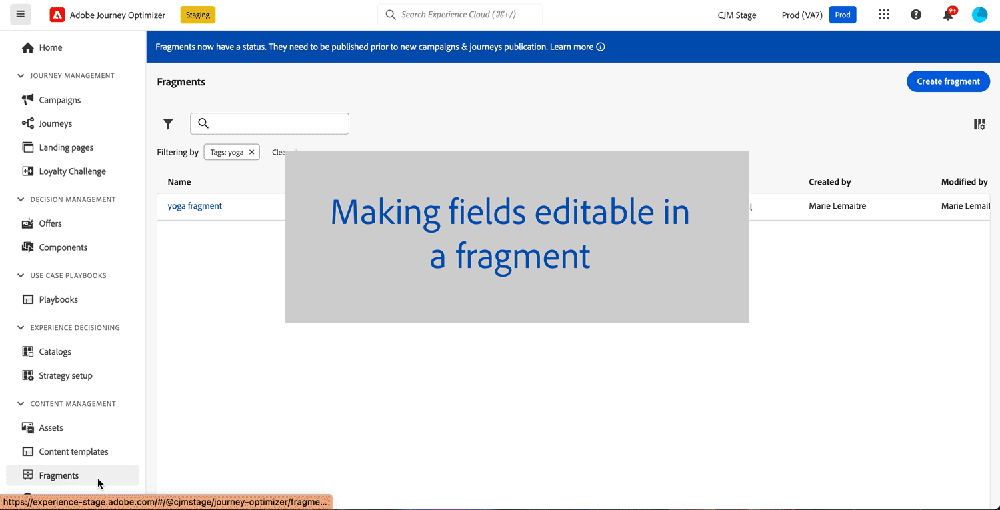

# リリースノート {#release-notes}

>[!CONTEXTUALHELP]
>id="ajo_homepage_card1"
>title="新着情報"
>abstract="**Adobe Journey Optimizer** は、新機能、既存機能の強化およびバグ修正を継続的に提供します。これらのリリースノートでは、すべての変更が各月の最終週にまとめられます。"

[!DNL Adobe Journey Optimizer] は、新機能、既存機能の強化、およびバグ修正を継続的に提供します。これらのリリースノートでは、すべての変更が各月の最終週にまとめられます。

[!DNL Adobe Journey Optimizer] が [!DNL Adobe Experience Platform] でネイティブに構築され、最新のイノベーションや改善点を引き継いでいます。以下の変更点について詳しくは、[Adobe Experience Platform リリースノート](https://experienceleague.adobe.com/docs/experience-platform/release-notes/latest.html?lang=ja){target="_blank"}を参照してください。

 今すぐ [Adobe Journey Optimizer 季刊ニュースレター](https://www.adobe.com/subscription/Adobe_Journey_Optimizer_NL.html){target="_blank"}に登録すると、最新の製品アップデート、面白い顧客事例、ユースケース、ヒントなどが、四半期ごとに直接配信されます。

## 2024年7月早期リリースノート {#27-4-2024}

**以下の早期リリースノートは、リリースの公開日まで予告なく変更される場合があります**。リンク、画面、更新されたドキュメントは、リリース日にこのページに公開されます。

**リリース日**：2024年7月30～31日（PT）

### 新機能 {#27-4-features}

このリリースでは、以下に示す新機能が導入されています。

<!--table>
<thead>
<tr>
<th><strong>IP Warmup Workflow</strong> </th>
</tr>
</thead>
<tbody>
<tr>
<td>

If you are sending email on a brand new IP address, you can now easily perform IP warmup workflows directly from the user interface. Adobe Journey Optimizer offers a standardized and efficient way to warm up your IP adresses that follows the best practices for optimal deliverability.

For more information, refer to the <a href="../configuration/ip-warmup-gs.md">detailed documentation</a>.

</td>
</tr>
</tbody>
</table-->

<table>
<thead>
<tr>
<th><strong>任意のプロバイダーでの SMS チャネル（ベータ版）</strong> </th>
</tr>
</thead>
<tbody>
<tr>
<td>

デフォルトのプロバイダーである Sinch、Infobip、Twilio に加えて、Journey Optimizer 内で追加の SMS プロバイダーを設定できるようになりました。

<!--p>For more information, refer to the <a href="../configuration/ip-warmup-gs.md">detailed documentation</a>.</p-->
</td>
</tr>
</tbody>
</table>

<table>
<thead>
<tr>
<th><strong>Federated Audience Composition （限定提供）</strong> </th>
</tr>
</thead>
<tbody>
<tr>
<td>

Federated Audience Composition がAdobe Journey Optimizerで使用できるようになりました。 これにより、企業はデータを作成して、様々なユースケースでより良く利用できます。 この新しいアプローチでは、Adobe Real-time Customer Data PlatformまたはAdobe Journey Optimizerのユーザーとして、既存のデータウェアハウスからデータセットを直接統合し、Adobe Experience Platform オーディエンスと属性をすべて 1 つのシステムで構築および強化できます。

詳しくは、 <a href="https://experienceleague.adobe.com/en/docs/federated-audience-composition/using/home"  target="_blank">詳細なドキュメント</a>を参照してください。

</td>
</tr>
</tbody>
</table>

### 機能強化 {#27-4-improvements}

このリリースでは、以下に示す機能強化が含まれています。

**ジャーニー**

* （公開日：7 月 8 日（PT）） **ジャーニーイベント設定の高度な式エディター** - イベントの設定時に高度な式エディターを活用して、より複雑な式を定義したり、イベント ID 条件で関数を使用したりできるようになりました。 [詳細情報](../event/about-creating.md#adv-exp-editor)

**オーディエンス**

* カスタムアップロード（CSV ファイル）からのオーディエンスを、プライバシーとセキュリティシールドで使用できるようになりました。

## 2024年6月リリースノート {#24-6-2024}

**リリース日**：2024年6月18～19日（PT）

### 新機能 {#june-24-features}

このリリースでは、以下に示す新機能が導入されています。

<!--table>
<thead>
<tr>
<th><strong>IP Warmup Workflow</strong> </th>
</tr>
</thead>
<tbody>
<tr>
<td>

If you are sending email on a brand new IP address, you can now easily perform IP warmup workflows directly from the user interface. Adobe Journey Optimizer offers a standardized and efficient way to warm up your IP adresses that follows the best practices for optimal deliverability.

For more information, refer to the <a href="../configuration/ip-warmup-gs.md">detailed documentation</a>.

</td>
</tr>
</tbody>
</table-->

<table>
<thead>
<tr>
<th><strong>コンテンツフラグメントのカスタマイズ</strong> </th>
</tr>
</thead>
<tbody>
<tr>
<td>

フラグメントをキャンペーンまたはジャーニーに追加する際に編集できる、フラグメント内に特定のフィールドを定義できるようになりました。これにより、使用時にコンテンツ部分を調整でき、コンテキスト固有の詳細でデフォルト値を柔軟に上書きできます。

詳しくは、<a href="../content-management/customizable-fragments.md">詳細なドキュメント</a>を参照してください。

</td>
</tr>
</tbody>
</table>

<table>
<thead>
<tr>
<th><strong>Customer Journey Analytics を使用したレポート（限定提供）</strong> </th>
</tr>
</thead>
<tbody>
<tr>
<td>

Journey Optimizer レポートでは、Customer Journey Analytics 機能との相互運用性が改善され、両方のプラットフォーム間でレポートが標準化され、データの一貫性と信頼性が向上します。Journey Optimizer と Customer Journey Analytics のシームレスな統合により、パフォーマンス指標がより明確に表示され、ユーザーはより情報に基づいた意思決定を行うことができます。

詳しくは、<a href="../reports/report-gs-cja.md">詳細なドキュメント</a>を参照してください。

</td>
</tr>
</tbody>
</table>

<table>
<thead>
<tr>
<th><strong>Adobe Journey Optimizer の AI アシスタント</strong> </th>
</tr>
</thead>
<tbody>
<tr>
<td>

AI アシスタントは、アドビのコンセプトをナビゲートして理解し、特定の環境の運用上のインサイトを得るために使用できるユーザーインターフェイス機能です。Adobe Journey Optimizer を含む Adobe Experience Cloud 全体の複数の製品で使用できます。

詳しくは、<a href="../start/ai-assistant.md">詳細なドキュメント</a>を参照してください。

</td>
</tr>
</tbody>
</table>

<table>
<thead>
<tr>
<th><strong>ジャーニーとキャンペーンでの多言語メッセージ（限定提供）</strong> </th>
</tr>
</thead>
<tbody>
<tr>
<td>

1 つのキャンペーンまたはジャーニー内で複数の言語のコンテンツを簡単に作成できるようになりました。この機能を使用すると、キャンペーンやジャーニーを編集する際に言語を切り替え、編集プロセス全体を効率化し、多言語コンテンツを効率的に管理する機能を向上させることができます。

多言語コンテンツは現在、一連の組織でのみ使用できます（限定提供）。アクセスするには、アドビ担当者にお問い合わせください。

</td>
</tr>
</tbody>
</table>

<table>
<thead>
<tr>
<th><strong>ジャーニーでの実験（限定提供）</strong> </th>
</tr>
</thead>
<tbody>
<tr>
<td>

Adobe Journey Optimizer は、キャンペーンで既に使用可能で、ジャーニーでの実験をサポートするようになりました。実験はランダム化試験です。オンラインテストのコンテキストでは、ランダムに選択された一部のユーザーにはメッセージの特定のバリエーションを表示し、別のランダムに選択された一連のユーザーには別のバリエーションや処理を行うことを意味します。公開後、メールの開封数、購読数、購入数など、興味のある結果指標を測定できます。

ジャーニーでの実験は現在、一連の組織でのみ使用できます（限定提供）。アクセスするには、アドビ担当者にお問い合わせください。

</td>
</tr>
</tbody>
</table>

<!--table>
<thead>
<tr>
<th><strong>Extended personalization data - Beta</strong> </th>
</tr>
</thead>
<tbody>
<tr>
<td>

You can now lookup and fetch data values within Adobe Experience Platform datasets, and use these values to build conditions in Adobe Journey Optimizer. You can leverage data from a lookup dataset when a relationship has been defined using an attribute inside of an array of objects. You can specify non-profile enabled datasets for lookup. Once enabled, you can use a profile attribute as a join key to the specified dataset to retrive further data for personalization.

This capability is currently available as a public beta.

</td>
</tr>
</tbody>
</table-->

### 機能強化 {#june24-improvements}

このリリースでは、以下に示す機能強化が含まれています。

#### 意思決定管理

* **意思決定管理でのマルチルールのサポート** - 意思決定管理で、特定のオファーに対して最大 10 個のキャッピングルールを追加できるようになりました。これにより、オファーの送信方法に対する制御レベルを強化できます。[詳細情報](../offers/offer-library/add-constraints.md#capping)

<!--* **Audits** - The **Change log** tab allowing you to see all the changes that have been made to an offer or a decision has been removed. Changes related to offers and decisions can now be seen in the **Audits** menu. -->

#### コンテンツフラグメント

>[!AVAILABILITY]
>
>これらの機能強化は、初回リリース後の数日間にわたって段階的にロールアウトされる予定です。即時にアクセスできるユーザーもいれば、自身の環境で使用できるようになるまでに遅延が生じるユーザーもいます。

* フラグメントを編集し、フラグメントが使用されているすべてのライブジャーニーとキャンペーンに変更を反映できるようになりました。
* コンテンツフラグメントの新しいステータス（**ドラフト**、**ライブ**、**公開**、**アーカイブ済み**）が導入されました。
* ジャーニーまたはキャンペーンでフラグメントを使用するには、フラグメントが&#x200B;**ライブ**&#x200B;ステータスになっている必要があります。フラグメント作成プロセスに新しい手順が追加され、フラグメントを公開して、ジャーニーやキャンペーンで使用できるようになりました。フラグメントの公開には、新しい権限が必要になります。

  **注意** - **ドラフト**&#x200B;および&#x200B;**ライブ** ステータスは Journey Optimizer の 6 月リリースで導入されたので、このリリースより前に作成されたすべてのフラグメントは、ジャーニーやキャンペーンで使用された場合でも、**ドラフト**&#x200B;ステータスになります。これらのフラグメントに変更を加えた場合は、[それらを公開](../content-management/create-fragments.md#publish)して「ライブ」にし、関連するキャンペーンとジャーニーにその変更を生成する必要があります。また、新しいジャーニー／キャンペーンのバージョンを作成し、公開する必要もあります。

詳しくは、[コンテンツフラグメント](../content-management/fragments.md)ドキュメントを参照してください。

#### ジャーニー

* ジャーニーのグローバルタイムアウトが 91 日間に延長されました。[詳細情報](../building-journeys/journey-properties.md#global_timeout)

  新しく作成したジャーニーには、この新しいタイムアウトが反映されます。この [FAQ の節](../building-journeys/journey-properties.md#timeout-faq)を参照してください。これらの変更は 6 月中に段階的にロールアウトされることに注意してください。

* Adobe Journey Optimizer は、プライバシーの削除／アクセスリクエストと、データライフサイクル管理リクエストもサポートするようになりました。[詳細情報](../privacy/requests.md)
* ジャーニーインベントリの列のサイズを変更できるようになりました。
  <!--* **Advanced expression editor in Event configuration** is now GA - You can now leverage the advanced expression editor while configuring an event, allowing you to define more complex expressions or use functions in the event id condition. This capability is released in Limited Availability for selected customers. [Read more](../event/about-creating.md)-->
* **結合ポリシー**（GA）- ジャーニーで使用される結合ポリシーがジャーニー全体で表示され、一貫性が保たれるようになりました。[詳細情報](../building-journeys/journey-properties.md#merge-policies)

#### キャンペーン

* Adobe Journey Optimizer でキャンペーンを作成する際、新しいモーダルでキャンペーンのタイプ（スケジュール済みまたはトリガー済み）を選択できるようになりました。[詳細情報](../campaigns/create-campaign.md)

#### メールチャネル

* **リスト登録解除** - Gmail および Yahoo が最近一括送信者向けに発表した内容に伴い、Journey Optimizer では「投稿／ワンクリック」のリスト登録解除オプションをサポートしています。詳しくは、[メールオプトアウトの管理](../email/email-opt-out.md#unsubscribe-header)および[メール設定](../email/email-settings.md#list-unsubscribe)のページを参照してください。

  **メモ** - 新しいチャネルサーフェスでは、デフォルトでリスト登録解除ヘッダーオプションがアクティブ化されます。既存のサーフェスの場合、デフォルトでは、チャネルサーフェス設定のワンクリック登録解除 URL オプションはオフになっています。以前、メール本文でワンクリックオプトアウト URL を使用していた場合、この設定は引き続き有効です。リスト登録解除チャネルサーフェス設定のワンクリック登録解除 URL がオンになっている場合、Adobe Journey Optimizer では、チャネルサーフェス設定のデフォルトで生成されたワンクリック登録解除 URL を使用します。

#### SMS チャネル

* 1 回の API 設定で各サンドボックスに一意のショートコードを追加できるようになりました。これにより、プロセスが合理化され、効率が上がります。[詳細情報](../sms/sms-configuration.md)

* 作成後、**API 資格情報の詳細**&#x200B;ページの「**API トークン**」フィールドがマスクされます。

<!--* You can now modify existing SMS configurations.-->

#### アプリ内チャネル

<!--* **Expression fragment** - Expression fragments are now available for the **In-app channel**. [Read more](../personalization/use-expression-fragments.md)-->

* これで、Edge Delivery プラグインを使用して、インバウンド実装を理解し、トラブルシューティングに必要な情報を取得できます。[詳しくは、Edge Delivery ビューを参照してください](https://experienceleague.adobe.com/ja/docs/experience-platform/assurance/view/edge-delivery){target="_blank"}。

#### ダイレクトメールチャネル

* すべてのお客様がダイレクトメールチャネルを利用できるようになりました。[詳細情報](../direct-mail/get-started-direct-mail.md)

