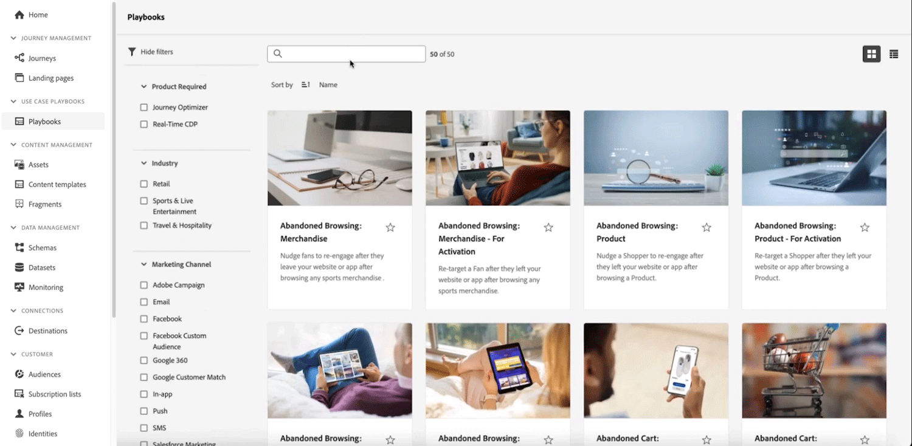

# リリースノート {#release-notes}

>[!CONTEXTUALHELP]
>id="ajo_homepage_card1"
>title="新着情報"
>abstract="**Adobe Journey Optimizer** は、新機能、既存機能の強化およびバグ修正を継続的に提供します。これらのリリースノートでは、すべての変更が各月の最終週にまとめられます。"

[!DNL Adobe Journey Optimizer] は、新機能、既存機能の強化、およびバグ修正を継続的に提供します。これらのリリースノートでは、すべての変更が各月の最終週にまとめられます。

[!DNL Adobe Journey Optimizer] が [!DNL Adobe Experience Platform] でネイティブに構築され、最新のイノベーションや改善点を引き継いでいます。以下の変更点について詳しくは、[Adobe Experience Platform リリースノート](https://experienceleague.adobe.com/docs/experience-platform/release-notes/latest.html?lang=ja){target="_blank"}を参照してください。

 今すぐ [Adobe Journey Optimizer 季刊ニュースレター](https://www.adobe.com/subscription/Adobe_Journey_Optimizer_NL.html){target="_blank"}に登録すると、最新の製品アップデート、面白い顧客事例、ユースケース、ヒントなどが、四半期ごとに直接配信されます。

## 2024年3月リリースノート {#mar-2024}

**リリース日**：2024年3月19～20日（PT）

### 新機能 {#mar-features}

このリリースでは、以下に示す新機能が導入されています。

<table>
<thead>
<tr>
<th><strong>コードベースのエクスペリエンス</strong> </th>
</tr>
</thead>
<tbody>
<tr>
<td>

新しいコードベースのエクスペリエンスチャネルでは、Adobe Journey Optimizer を使用して、あらゆるインバウンドプロパティに対して高度なパーソナライゼーションとテストを行うことができ、web アプリ、モバイルアプリ、デスクトップアプリ、ビデオコンソール、TV 接続デバイス、スマート TV、キオスク、ATM、IoT デバイスなど、多様なタッチポイントに合わせたエクスペリエンスをシームレスに配信できます。

主な機能は次のとおりです。

<ul><li> ユニバーサルパーソナライゼーション：すべてのタッチポイントにわたってパーソナライズされたエクスペリエンスを拡張し、一貫性のある調整されたユーザージャーニーを保証します</li>
<li>きめ細かい編集精度：アプリまたは web ページ内の個々の場所で特定のコンテンツを編集します</li>
<li>汎用性の高い実装：サーバーサイド、API ベースまたは SDK ベースの実装方法をサポートし、開発環境とシームレスに統合します。</li></ul>

詳しくは、 <a href="../code-based/get-started-code-based.md">詳細なドキュメント</a>を参照してください。

 
</tr>
</tbody>
</table>

### 機能強化 {#mar-improvements}

このリリースでは、以下に示す機能強化が含まれています。

**コンテンツテンプレート**

* **サムネール** - **グリッド表示**&#x200B;モードがコンテンツテンプレートに対して使用できるようになり、サムネールを表示して視覚的なアクセスが向上しました。現在、メール HTML コンテンツテンプレートのみがサポートされています。[詳細情報](../content-management/content-templates.md#template-thumbnails)

  >[!AVAILABILITY]
  >
  >この機能は、少数の顧客向けに限定提供（LA）でリリースされています。

**ジャーニー**

新しい中間ステータスが次のジャーニーオーサリングライフサイクルに追加されました。

* **ドラフト**&#x200B;ステータスと&#x200B;**ライブ**&#x200B;ステータスの間の&#x200B;**公開**&#x200B;ステータス
* **ライブ**&#x200B;ステータスと&#x200B;**停止**&#x200B;ステータスの間の&#x200B;**停止**&#x200B;ステータス
* **ドラフト**&#x200B;ステータスと&#x200B;**ドラフト（テスト）**&#x200B;ステータスの間の&#x200B;**テストモードのアクティブ化**&#x200B;または&#x200B;**テストモードの非アクティブ化**

ジャーニーが中間の状態にある場合は、読み取り専用です。[詳細情報](../building-journeys/journey-gs.md#filter)

## 2024年2月リリースノート {#feb-2024}

**リリース日**：2024年2月21～22日（PT）

### 新機能{#feb-features}

このリリースでは、以下に示す新機能が導入されています。

<table>
<thead>
<tr>
<th><strong>Web アプリ内メッセージ</strong> </th>
</tr>
</thead>
<tbody>
<tr>
<td>

新しい web アプリ内メッセージ機能を使用して、モーダルオーバーレイメッセージを通じてパーソナライズされたコンテンツを web サイトに直接表示できるようになりました。この機能により、web 訪問者と効果的に関わり、ユーザーインタラクション、定着率およびコンバージョン率を向上させることができます。  

詳しくは、<a href="../in-app/create-in-app-web.md">詳細なドキュメント</a>を参照してください。  

</tr>
</tbody>
</table>

<table>
<thead>
<tr>
<th><strong>マルチチャネルコンテンツテンプレート</strong> </th>
</tr>
</thead>
<tbody>
<tr>
<td>

メールに加えて、プッシュ、アプリ内、SMS およびダイレクトメールのチャネルでコンテンツテンプレートが使用できるようになりました。各チャネルには専用のテンプレートタイプがあります。メールの場合、コンテンツタイプを選択できるようになりました。これにより、件名をメールテンプレートの一部として保存できます。   

詳しくは、 <a href="../content-management/content-templates.md">詳細なドキュメント</a>を参照してください。  

 
</tr>
</tbody>
</table>

### 機能強化 {#feb-improvements}

このリリースでは、以下に示す機能強化が含まれています。

**オーディエンス**

* **シードリスト** - **シードリスト**&#x200B;の使用時にバリアントがサポートされるようになりました。シードアドレスは、同じメッセージのすべてのバリアント（コンテンツ実験の異なる処理など）のコピーを受信します。[詳細情報](../configuration/seed-lists.md)

以前はベータ版として提供されていましたが、現在は次の機能強化がすべてのユーザーに提供されています。

* **オーディエンスコンポジションを通じて作成されたオーディエンス**&#x200B;をターゲットにし、ジャーニーのエンリッチメント属性を活用できるようになりました。[詳細情報](../building-journeys/read-audience.md)

* **CSV ファイルからアップロードされたオーディエンス**&#x200B;を、ジャーニーやキャンペーンにターゲットできるようになりました。[詳細情報](../audience/about-audiences.md#segments-in-journey-optimizer)

  >[!AVAILABILITY]
  >
  >* オーディエンス構成とカスタムアップロード（CSV ファイル）からのオーディエンスと属性の使用は、現在、Healthcare Shield または Privacy and Security Shield では使用できません。
  >* **CSV ファイルからのオーディエンスアップロード**&#x200B;の機能強化は、初回リリース後の数日間にわたって段階的にロールアウトされる予定です。即時にアクセスできるユーザーもいれば、自身の環境で使用できるようになるまでに遅延が生じるユーザーもいます。

**ジャーニー**

* **ジャーニーをフィルタリング** - 既存の定義済み日付フィルターに加えて、**カスタム日付を使用してジャーニーインベントリをフィルタリング**&#x200B;できるようになりました。これにより、特定の日付、特定の月内、年間全体、指定した期間内に作成または公開されたジャーニーを表示することで、リストを絞り込むことができます。[詳細情報](../building-journeys/journey-gs.md#filter)
* **カスタムアクション** - **content-type** ヘッダーを更新できるようになりました。この新しい **content-type** は、JSON コンテンツを参照する必要があります。[詳細情報](../action/about-custom-action-configuration.md#url-configuration)
* **設定** - stepEvents のidentityMap 属性が事前に入力されるようになりました。プライマリ ID は「primary = true」として定義されます。[詳細情報](../reports/sharing-field-list.md)
* **ユーザーインターフェイス** - エクスペリエンスを向上させるために、ジャーニー画面の上部バーが再編成されました。様々な更新が行われるなか、ジャーニーのプロパティにアクセスできる「鉛筆」アイコンが、上部バーの左側、ジャーニー名の横に表示されるようになりました。[詳細情報](../building-journeys/journey-gs.md#change-properties)

**SMS チャネル**

* **オプトイン／オプトアウトのキーワード** - SMS チャネルを設定する際に、環境設定に従って&#x200B;**オプトインおよびオプトアウトキーワード**&#x200B;をカスタマイズできるようになりました。Journey Optimizer は、これらの指定されたキーワードに基づいて応答をトリガーします。[詳細情報](../sms/sms-configuration.md#create-api)

**キャンペーン**

* **API トリガーキャンペーン** - API トリガーのキャンペーンをアクティブ化した後に生成される cURL コードが強化されました。メッセージで使用されるすべてのパーソナライゼーション（プロファイルとコンテキスト）変数が含まれるようになりました。[詳細情報](../campaigns/api-triggered-campaigns.md#execute)

**頻度ルール**

* メールとプッシュに加えて、SMS チャネルとダイレクトメールチャネルの頻度ルールを作成できるようになりました。頻度ルールでは、フリークエンシーキャップに達すると、過度に要求されたプロファイルをメッセージとアクションから自動的に除外します。[詳細情報](../configuration/frequency-rules.md)

<!--**Decision management**

* **Capping rules** - You can now add **multiple capping rules** for one offer. This allows you to increase the level of control over the way offers are sent.-->

## 2024年1月リリースノート {#jan-2024}

**リリース日**：2024年1月30～31日（PT）

### 新機能{#jan24-features}

このリリースでは、以下に示す新機能が導入されています。

<table>
<thead>
<tr>
<th><strong>配信品質のアップデート</strong> </th>
</tr>
</thead>
<tbody>
<tr>
<td>

Journey Optimizer は、DMARC 認証テクノロジーをサポートするようになりました。

2024年2月1日（PT）以降、Google と Yahoo! は、メールの送信に使用するドメインの DMARC レコードを要求します。Journey Optimizer でアドビにデリゲートしたすべてのサブドメインや、デリゲート中のすべてのサブドメインに対して、DMARC レコードが設定されていることを確認してください。

詳しくは、<a href="../configuration/dmarc-record-update.md">詳細なドキュメント</a>を参照してください。

 
</tr>
</tbody>
</table>

<table>
<thead>
<tr>
<th><strong>ユースケースプレイブック</strong> </th>
</tr>
</thead>
<tbody>
<tr>
<td>

Real-Time CDP と Journey Optimizer における業界固有のユースケースプレイブックのカタログを活用し、Adobe Experience Platform と Adobe Journey Optimizer を使用して実行できる一般的なユースケースに対処します。

ニーズに最適なプレイブックを選択したら、それを有効にして、ジャーニー、メッセージ、スキーマ、セグメントなどのユースケースをサポートするために必要なアセットを生成し、スキーマに合わせてカスタマイズして価値実現までの時間を短縮できます。

詳しくは、 <a href="../start/playbooks.md">詳細なドキュメント</a>を参照してください。

 
</tr>
</tbody>
</table>

### 機能強化 {#jan24-improvements}

このリリースでは、以下に示す機能強化が含まれています。

**レポート**

* **新しいドメインベースの分類ウィジェット** - キャンペーンレポートとジャーニーレポートを強化するための新しいウィジェットが追加されました。**ドメイン別のバウンス理由**、**ドメイン別に送信および配信済み**、**ドメイン別の開封数およびクリック数**&#x200B;および&#x200B;**ドメイン別のバウンス数およびエラー数**&#x200B;ウィジェットは、主なメール配信とトラッキング指標のドメインレベルでの詳細な分類を提供します。[詳細情報](../reports/channel-report.md)

**SMS チャネル**

* **ダブルオプトイン** - SMS のダブルオプトインワークフローでは、デバイスからリクエストが開始された際に、ユーザーがメッセージの受信を明示的にオプトインすることが保証されます。ユーザーは、インバウンド SMS メッセージを送信して同意プロセスを開始します。同意を確認すると、最終検証をリクエストするフォローアップメッセージが送信されます。ユーザープロファイルが存在しない場合は、確認が成功すると作成されます。[詳細情報](../sms/sms-configuration.md#create-api)

  この機能は、Sinch および Infobip の SMS プロバイダーで使用できます。

**ジャーニー**

* **反応イベントの期間** - **反応イベント**&#x200B;で定義できる最大期間は、30 日ではなく 29 日になりました。[詳細情報](../building-journeys/reaction-events.md)

<!--* **Date filters** - You can now use custom dates to filter the journeys inventory, in addition to the existing predefined date filters. This allows you to refine the list by displaying journeys published on a specific date, within a particular month, throughout an entire year, or within specified time ranges. [Learn more](../building-journeys/journey-gs.md#filter)-->

* **オーディエンスを読み取り** - 「**オーディエンスを読み取り**」アクティビティは、バッチセグメントのプロファイルスナップショットデータセットに依存するようになりました。このデータセットは、スケジュールされた日次バッチジョブの実行後に 1 日に 1 回のみ生成されます。そのため、データは前回の日次バッチジョブの時点での最新になります。[詳細情報](../building-journeys/read-audience.md)

* **フィールドグループ** - このリリースでは、特定の場合にフィールドグループの保存がブロックされていた問題が修正されています。

* `<listObject>` のサポートは、複数の機能で変更されました。

**頻度ルール**

* **週別のフリークエンシーキャップ** - 顧客プロファイルに送信するメッセージの最大数を、月に加えて、1 週間あたりに指定できるようになりました。フリークエンシーキャップは、選択したカレンダー期間に基づき、対応する時間枠の開始時にリセットされます。[詳細情報](../configuration/frequency-rules.md#create-new-rule)

  >[!NOTE]
  >
  >また、日別のフリークエンシーキャップは、オンデマンドでも使用可能です。アドビ担当者にお問い合わせください。

**意思決定管理**

* **Edge でのフリークエンシーキャップ** - フリークエンシーキャップカウンターが更新され、3 秒未満で Edge Decisioning API の決定で使用できるようになりました。[詳細情報](../offers/api-reference/offer-delivery-api/start-offer-delivery-apis.md)
