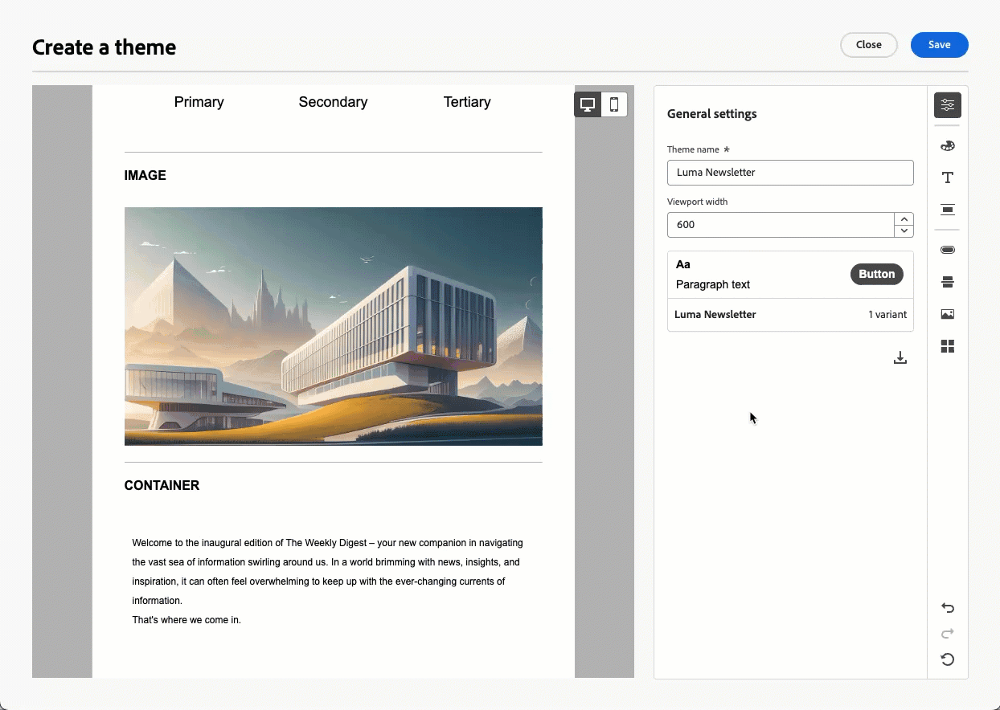

# リリースノート {#release-notes}

>[!CONTEXTUALHELP]
>id="ajo_homepage_card1"
>title="新機能"
>abstract="**Adobe Journey Optimizer** は、新機能、既存機能の強化およびバグ修正を継続的に提供します。これらのリリースノートでは、すべての変更が各月の最終週にまとめられます。"

[!DNL Adobe Journey Optimizer] は継続的な配信モデルに従っており、Adobeが新機能、機能強化および修正点を継続的に提供できるようにします。 このアプローチにより、機能をスケーラブルかつ段階的にロールアウトして、すべての環境でパフォーマンスと安定性を確保できます。

このモデルのため、リリースノートは毎月のリリースの間に更新されます。  専用の [ 最新のアップデート ](#updates-rn) セクションでは、実稼動へのデプロイ時に新機能と改善点がハイライト表示されるので、常にすべての変更がリアルタイムで通知されます。<!--For full details about the release cycle and availability phases, see [Journey Optimizer release cycle](#releases.md).-->

[!DNL Adobe Journey Optimizer] が [!DNL Adobe Experience Platform] でネイティブに構築され、最新のイノベーションや改善点を引き継いでいます。以下の変更点について詳しくは、[Adobe Experience Platform リリースノート](https://experienceleague.adobe.com/docs/experience-platform/release-notes/latest.html?lang=ja){target="_blank"}を参照してください。

## 2025 年 10 月プレリリースノート {#oct-25-10-rn}

**以下のプレリリースノートは、リリース日まで予告なく変更される場合があります**。 リンク、画面、更新済みのドキュメントは、リリース日にリリースノートに公開されます。

[Adobe Experience Platform プレリリースノート](https://experienceleague.adobe.com/ja/docs/experience-platform/release-notes/pre-release-notes){target="_blank"}も参照してください。

**リリース日**：2025年10月22日（PT）

### 新機能 {#oct-25-10-features}

<table>
<thead>
<tr>
<th><strong>無表示時間/時間ベースの除外</strong> </th>
</tr>
</thead>
<tbody>
<tr>
<td>

通知の少ない時間帯は、メール、SMS、プッシュおよび WhatsApp チャネルに対する時間ベースの除外を定義できます。 これにより、特定の期間中にメッセージが送信されないようにし、顧客の好みやコンプライアンスの要件を尊重するのに役立ちます。

クワイエットタイムは、キャンペーンやジャーニーの個々のアクションに割り当てて、正確に制御できるルールセットを通じて適用できます。 これらのプロセスを合理化することによって。

この機能は、一連の組織でのみ使用できます（限定提供）。アクセスするには、アドビ担当者にお問い合わせください。

<!--img src="assets/do-not-localize/FILE.gif"-->
<!-- p>For more information, refer to the <a href="../FILE.md">detailed documentation</a>.

</td>
</tr>
</tbody>
</table>

<table>
<thead>
<tr>
<th><strong>カスタムアクションの監視とレポート</strong> </th>
</tr>
</thead>
<tbody>
<tr>
<td>

この機能により、ライフサイクルステータスやパフォーマンスアラートなど、ジャーニーの健全性と実行がよりわかりやすく表示されます。カスタムアクションで異常な状況が発生しているタイミング、場所、理由をすばやく把握できるようになりました。

<!--img src="assets/do-not-localize/FILE.gif"-->
<!-- p>For more information, refer to the <a href="../FILE.md">detailed documentation</a>.

</td>
</tr>
</tbody>
</table>

<!--table>
<thead>
<tr>
<th><strong>RCS Basic Messaging</strong> </th>
</tr>
</thead>
<tbody>
<tr>
<td>

With the new RCS Basic add-on offering, you can now deliver basic Rich Communication Services (RCS) messaging in Journey Optimizer, enabling the following enhanced messaging capabilities subject to provider and geographical support:

<ul>
<li><strong>Branded and verified sender support:</strong> Send messages using verified business profiles with branding elements (logo, sender name, etc.).</li>
<li><strong>Message delivery insights:</strong> Receive detailed delivery reports including message status updates (e.g., sent, delivered, read).</li>
<li><strong>Link tracking:</strong> Embed and track URLs within RCS messages for engagement analytics.</li>
<li><strong>Fallback to SMS:</strong> Automatic fallback to SMS when the recipient's device does not support RCS or is temporarily unreachable via RCS.</li>
<li><strong>Basic message composition:</strong> Send basic text-based RCS messages.</li>
</ul>
<!--img src="assets/do-not-localize/FILE.gif"-->
<!-- p>For more information, refer to the <a href="../FILE.md">detailed documentation</a>.

<!--/td>
</tr>
</tbody>
</table-->

<!--table>
<thead>
<tr>
<th><strong>Direct mail channel in Orchestrated campaigns</strong> </th>
</tr>
</thead>
<tbody>
<tr>
<td>

Direct mail channel is now available in orchestrated campaigns. The Direct mail activity facilitates direct mail sending within your Orchestrated campaign, for both one-time and recurring messages. It serves to automate the process of generating the extraction file required by direct mail providers. You can combine channel activities into the Orchestrated campaign canvas to create cross-channel campaigns that can trigger actions based on customer behavior and data.

<!--img src="assets/do-not-localize/FILE.gif"-->
<!-- p>For more information, refer to the <a href="../FILE.md">detailed documentation</a>.

<!--/td>
</tr>
</tbody>
</table-->

<!--table>
<thead>
<tr>
<th><strong>Direct Mail channel in journeys</strong> </th>
</tr>
</thead>
<tbody>
<tr>
<td>

Previously limited to Campaigns, Direct Mail channel is now available on the journey canvas, enabling you to incorporate Direct Mail into your journeys. Direct Mail can now be used in both batch and 1:1 journey scenarios, with support for file extraction configuration and time-based frequency settings.

 Previously released in Limited Availability, this capability is now available to all environments (General Availability).

<!--img src="assets/do-not-localize/FILE.gif"-->
<!-- p>For more information, refer to the <a href="../FILE.md">detailed documentation</a>.

<!--/td>
</tr>
</tbody>
</table-->

<table>
<thead>
<tr>
<th><strong>アクションキャンペーンを取得する新しい API</strong> </th>
</tr>
</thead>
<tbody>
<tr>
<td>

新しいJourney Optimizer API が使用できるようになりました。これにより、詳細、バージョン、設定など、キャンペーン関連のデータをプログラムで取得し、調べることができます。

<!--img src="assets/do-not-localize/FILE.gif"-->
<!-- p>For more information, refer to the <a href="../FILE.md">detailed documentation</a>.

</td>
</tr>
</tbody>
</table>

<table>
<thead>
<tr>
<th><strong>ロイヤルティアプリ用の新しいソースコネクタ</strong> </th>
</tr>
</thead>
<tbody>
<tr>
<td>

Adobe Experience Platformで Talon.One、Capilary、Kobie の各ロイヤルティアプリ用に新しいソースコネクタが利用可能になりました。 これらのコネクタを使用すると、ロイヤルティデータをAdobe Experience Platformにシームレスにストリーミングし、これらのデータをJourney Optimizerで活用できます。

<!--img src="assets/do-not-localize/FILE.gif"-->
<!-- p>For more information, refer to the <a href="../FILE.md">detailed documentation</a>.

</td>
</tr>
</tbody>
</table>

<table>
<thead>
<tr>
<th><strong>メールチャネルでの決定のサポート</strong> </th>
</tr>
</thead>
<tbody>
<tr>
<td>

メールジャーニーとキャンペーンに決定ポリシーを追加できるようになりました。決定ポリシーは、配信する最適なコンテンツを各オーディエンスメンバーに応じて動的に返すことを目的に、決定エンジンを活用するオファーのためのコンテナです。

この機能は、以前は限定提供でリリースされていましたが、現在はすべての環境で使用できるようになりました（一般提供）。

<!--img src="assets/do-not-localize/FILE.gif"-->
<!-- p>For more information, refer to the <a href="../FILE.md">detailed documentation</a>.

</td>
</tr>
</tbody>
</table>

<table>
<thead>
<tr>
<th><strong>API トリガーメールキャンペーンの高スループットモード</strong> </th>
</tr>
</thead>
<tbody>
<tr>
<td>

API トリガーキャンペーンで新しい高スループットモードが使用できるようになりました。このモードは、大規模なリアルタイムメッセージ（1 秒あたり最大 5000 トランザクション）向けに設計され、少ない待ち時間でより高い可用性を実現します。

この機能は、Adobe 高スループットトランザクションメッセージのアドオン機能を購入した組織がメールチャネルでのみ使用できます。詳しくは、アドビ担当者にお問い合わせください。

<!--img src="assets/do-not-localize/FILE.gif"-->
<!-- p>For more information, refer to the <a href="../FILE.md">detailed documentation</a>.

</td>
</tr>
</tbody>
</table>

<table>
<thead>
<tr>
<th><strong>再利用可能なターゲティングルール</strong> </th>
</tr>
</thead>
<tbody>
<tr>
<td>

Journey Optimizerでは、専用の UI メニューからルールを作成し、キャンペーンまたはジャーニーのコンテンツ最適化の一部として、またはジャーニーの最適化アクティビティでターゲティングを構築する際に活用できるようになりました。

現在、ターゲティングルールは、Decisioning アドオン機能を購入した組織で利用でき、他の組織ではオンデマンドで利用できます（使用制限あり）。

この機能は、すべてのお客様に段階的にロールアウトされます。 それまでの間、Adobe担当者に連絡してアクセス権を取得してください。

<!--img src="assets/do-not-localize/FILE.gif"-->
<!-- p>For more information, refer to the <a href="../FILE.md">detailed documentation</a>.

</td>
</tr>
</tbody>
</table>

<table>
<thead>
<tr>
<th><strong>E メールデザイナーのテーマ</strong> </th>
</tr>
</thead>
<tbody>
<tr>
<td>

事前承認済みのテーマをすばやく適用して、すべてのメールにわたってブランドの一貫性を確保し、キャンペーン作成プロセスを高速化し、デザインチームへの依存を減らしながら高品質のメールを独自に作成できるようになりました。

以前ベータ版でリリースされていましたが、この機能は一連の組織で使用できるようになりました（使用制限あり）。 アクセスするには、アドビ担当者にお問い合わせください。

詳しくは、<a href="../email/apply-email-themes.md">詳細なドキュメント</a>を参照してください。

<!--p>Availability date: October 22, 2025</p-->
</td>
</tr>
</tbody>
</table>

<table>
<thead>
<tr>
<th><strong>新しいジャーニーアラート</strong> </th>
</tr>
</thead>
<tbody>
<tr>
<td>

新しい事前設定済みのアラートを使用して、ジャーニーの実行を監視できます。

<ul><li><a href="../reports/alerts.md#alert-discard-rate"> プロファイル破棄率を超過 </a>：過去 5 分に入力されたプロファイルに対するプロファイル破棄の割合が、しきい値を超過しました</li>
<li><a href="../reports/alerts.md#alert-custom-action-error-rate"> カスタムアクションエラー率を超えています </a>：過去 5 分間に成功した HTTP 呼び出しに対するカスタムアクションエラーの割合が、しきい値を超えています</li>
<li><a href="../reports/alerts.md#alert-profile-error-rate"> プロファイルエラー率を超過 </a>：過去 5 分に入力されたプロファイルに対する、エラーのプロファイルの割合が、しきい値を超えました。</li></ul> 
しきい値を変更し、グローバルではなく個々のジャーニーレベルのアラートを登録できます。

詳しくは、<a href="../reports/alerts.md">詳細なドキュメント</a>を参照してください。

公開日：2025 年 10 月 14 日（PT）

</td>
</tr>
</tbody>
</table>

<table>
<thead>
<tr>
<th><strong>実行メタデータヘルパー</strong> </th>
</tr>
</thead>
<tbody>
<tr>
<td>

新しい「executionMetadata」ヘルパー関数がパーソナライゼーションエディターで使用できます。 これを使用すると、任意のネイティブアクションにコンテキスト情報を追加し、外部システムに書き出すためにデータセットに取得できます。

この機能は、限定提供です。アクセス権を取得するには、アドビ担当者にお問い合わせください。

詳しくは、<a href="../personalization/functions/helpers.md#execution-metadata">詳細なドキュメント</a>を参照してください

公開日：2025 年 10 月 13 日（PT）

</td>
</tr>
</tbody>
</table>

<table>
<thead>
<tr>
<th><strong>実験エージェントが登場！</strong> </th>
</tr>
</thead>
<tbody>
<tr>
<td>

<a href="https://experienceleague.adobe.com/en/docs/experience-cloud-ai/experience-cloud-ai/agents/agent-orchestrator.html" target="_blank">Adobe Experience Platform Agent Orchestrator</a> を活用し、Journey Optimizerで実験エージェントを利用できます。 

実験エージェントは、Web サイト、メール、プッシュメッセージおよびアプリケーションをまたいでデジタル実験を実行および管理する方法を最新化する、AI を利用したツールです。 これにより、実験をより効率的に実行し、ビジネス目標を整理し、うまくいったこと、うまくいかなかったこと、次に実験する場所を強調表示した、実用的なインサイトを生成できます。

詳しくは、<a href="https://experienceleague.adobe.com/docs/experience-cloud-ai/experience-cloud-ai/agents/agent-experiment.html" target="_blank">詳細なドキュメント</a>を参照してください。

公開日：2025 年 10 月 10 日（PT）

</td>
</tr>
</tbody>
</table>

<table>
<thead>
<tr>
<th><strong>メールへの PDF 添付ファイル</strong> </th>
</tr>
</thead>
<tbody>
<tr>
<td>

Journey Optimizer で送信されるメールメッセージに静的 PDF ファイルを添付できるようになりました。

<ul>
<li>プロファイルごとに、年間最大 6 件の PDF 添付ファイル付きメッセージを送信できます。</li>
<li>各添付ファイルの最大許容ファイルサイズは 5 MB です。</li>
<li>追加のサイズまたはボリュームについては、PDF 添付ファイルアドオンを購入できます。詳しくは、アドビ担当者にお問い合わせください。</li>
</ul>

この機能は、以前は限定提供でリリースされていましたが、現在はすべての環境で使用できるようになりました（一般提供）。

詳しくは、<a href="../email/pdf-attachments.md">詳細なドキュメント</a>を参照してください。

公開日：2025 年 9 月 30 日（PT）

</td>
</tr>
</tbody>
</table>

<table>
<thead>
<tr>
<th><strong>ジャーニーを取得するパブリック API</strong> </th>
</tr>
</thead>
<tbody>
<tr>
<td>

ジャーニーと、キャンペーンやサーフェスなどの関連オブジェクトを取得する新しいJourney Optimizer API が使用できるようになりました。

詳しくは、<a href="https://developer.adobe.com/journey-optimizer-apis/references/journeys-retrieve/">詳細なドキュメント</a>を参照してください。

公開日：2025 年 9 月 25 日（PT）

</td>
</tr>
</tbody>
</table>

<!--
## Latest updates {#updates-rn}

New capabilities and improvements released in the past weeks are listed below, with their availability date. They will be grouped with the next release notes content at the end of the month. See also the latest [release notes below](#latest-rn).
-->

### 機能強化 {#updates-improvements}

**WhatsApp チャネルの実行フィールド**

メールと SMS に加えて、サンドボックスレベルで WhatsApp 配信のデフォルトの実行フィールドを更新することがわかります。 また、WhatsApp ジャーニーアクティビティの詳細設定パラメーターまたは WhatsApp チャネル設定で変更することで、グローバルに設定された実行フィールドを上書きすることもできます。<!-- [Read more](../FILE.md) -->

**Mailto （登録解除）アドレスのカスタム属性のサポート**

Journey Optimizerを使用すると、Adobe外で同意を管理している場合に、独自のワンクリック購読解除リンクとカスタム購読解除メールアドレスをメール設定に定義することで、外部カスタムエンドポイントを設定できます。 受信者が登録解除リンクをクリックすると、Journey Optimizer では、同意更新イベントにいくつかのデフォルトのプロファイル固有のパラメーターが追加されます。

カスタムエンドポイントをさらにパーソナライズするために、同意イベントにも追加されるカスタム属性を定義できるようになりました。 [詳細情報](../email/list-unsubscribe.md#custom-attributes)

>[!AVAILABILITY]
>
>この機能は、8 月 25 日（PT）以降、カスタム **[!UICONTROL ワンクリック登録解除 URL]** で既に使用できるようになり、限定提供の **[!UICONTROL 宛先（登録解除）]** オプションでリリースされました。 アクセス権を取得するには、アドビ担当者にお問い合わせください。

公開日：2025 年 10 月 6 日（PT）

## 2025年9月リリースノート {#latest-rn}

**リリース日**：2025年9月23～24日（PT）

### 新機能 {#sept-25-9-features}

<table>
<thead>
<tr>
<th><strong>Journey Optimizer 実験アクセラレーター</strong> </th>
</tr>
</thead>
<tbody>
<tr>
<td>

Journey Optimizer 実験アクセラレーターは、実験を次のレベルに引き上げるために設計された AI ファーストの製品です。Adobe Journey Optimizer および Adobe Target ユーザー向けに作成されたこの製品は、実験管理を統合し、AI を活用したインサイトと機会を提供し、新しい実験エージェントを導入します。

主な機能：

<ul>
<li><strong>統合された実験インベントリ：</strong>Adobe Journey Optimizer と Adobe Target のすべての実験を 1 つの中央ワークスペースですばやく表示、フィルタリング、管理します。</li>
<li><strong>AI 実験のインサイトと機会：</strong>GenAI 駆動型のインサイトとレコメンデーションを使用することで、統計的な読み上げを超えた結果が得られます。各実験では、共に実用的な機会とともにん、裏付けとなる論理的根拠が明らかになるので、チームは次にテストする内容をより自信を持って決定できます。</li>
<li><strong>Journey Optimizer でのマルチアームバンディット（MAB）のサポート：</strong>マルチアームバンディット実験により、無駄なトラフィックを削減しながら影響力を最大限に高めます。MAB は、オーディエンスを均等に分割するのではなく、最もパフォーマンスの高いバリエーションにより多くの訪問者をリアルタイムで自動的に割り当てるので、機能を学びながら、より多くの顧客に優れたエクスペリエンスを提供できます。</li></ul>

詳しくは、<a href="../content-management/experiment-accelerator.md">詳細なドキュメント</a>を参照してください。

公開日：2025 年 10 月 3 日（PT）

</td>
</tr>
</tbody>
</table>

<table>
<thead>
<tr>
<th><strong>Journey エージェントが公開されました</strong> </th>
</tr>
</thead>
<tbody>
<tr>
<td>

<a href="https://experienceleague.adobe.com/ja/docs/experience-cloud-ai/experience-cloud-ai/agents/agent-orchestrator" target="_blank">Adobe Experience Platform エージェントオーケストレーター</a>を活用した Journey エージェントは、Journey Optimizer で使用できます。これにより、自然言語インターフェイスを通じてジャーニーを分析できます。エージェントは、オーディエンスやスケジュールの競合と、ジャーニーでのプロファイルのドロップオフを検出して解決するのに役立ちます。近日中に、エージェント型サポートによるジャーニーを作成できます。

詳しくは、<a href="https://experienceleague.adobe.com/ja/docs/experience-cloud-ai/experience-cloud-ai/agents/ajo-agent-analyze" target="_blank">詳細なドキュメント</a>を参照してください。

公開日：2025年9月24日（PT）

</td>
</tr>
</tbody>
</table>

<table>
<thead>
<tr>
<th><strong>E メールデザイナーでのダークモード</strong> </th>
</tr>
</thead>
<tbody>
<tr>
<td>

Journey Optimizer E メールデザイナーに、ダークモード表示に切り替える機能が追加されました。この機能を使用すると、ダークモードでメールを読む受信者にのみ表示される特定のカスタム設定を定義できます。

次のことに注意してください。

<ul>
<li>ダークモードの最終的なレンダリングは、受信者のメールクライアントに応じて異なります。</li>
<li>すべてのメールクライアントがカスタムダークモードをサポートしているわけではありません。さらに、一部のメールクライアントでは、受信したすべてのメールに対して、独自のデフォルトのダークモードのみが適用されます。どちらの場合も、E メールデザイナーで定義したカスタム設定はレンダリングできません。</li>
</ul>

詳しくは、<a href="../email/dark-mode.md">詳細なドキュメント</a>を参照してください。

 
公開日：2025年9月16日（PT）

</td>
</tr>
</tbody>
</table>

<table>
<thead>
<tr>
<th><strong>ジャーニーパスの最適化</strong> </th>
</tr>
</thead>
<tbody>
<tr>
<td>

新しい最適化ノードを使用して特定のオーディエンスにターゲットを設定するか、A/B テストを実行して、ビジネス目標に焦点を合わせた KPI を達成する最適なパスを決定します。

このツールを使用すると、コミュニケーション、シーケンス、タイミングをテスト、調整、カスタマイズし、顧客に最も効果的にリーチできます。

この機能は、限定提供です。アクセス権を取得するには、アドビ担当者にお問い合わせください。

詳しくは、<a href="../building-journeys/optimize.md">詳細なドキュメント</a>を参照してください

公開日：2025年9月4日（PT）

</td>
</tr>
</tbody>
</table>

<table>
<thead>
<tr>
<th><strong>サブドメインのカスタムデリゲーションメソッド</strong> </th>
</tr>
</thead>
<tbody>
<tr>
<td>

完全なデリゲーションと CNAME メソッドに加えて、新しいサブドメイン設定メソッドとして、カスタムデリゲーションメソッドが使用できるようになりました。これにより、メッセージの配信、レンダリング、トラッキングに必要な DNS のあらゆる側面を完全に制御および管理できます。

この機能は、限定提供です。アクセス権を取得するには、アドビ担当者にお問い合わせください。

詳しくは、<a href="../configuration/delegate-custom-subdomain.md">詳細なドキュメント</a>を参照してください

公開日：2025年9月4日（PT）

</td>
</tr>
</tbody>
</table>

<table>
<thead>
<tr>
<th><strong>Adobe Experience Platform データをパーソナライゼーションと決定に使用</strong> </th>
</tr>
</thead>
<tbody>
<tr>
<td>

この機能は、以前はパブリックベータ版でリリースされていましたが、現在はすべての環境で使用できるようになりました。このリリースでは、次の機能強化が導入されました。

<ul><li>インバウンドチャネルでのデータセット参照パーソナライゼーションのサポート。</li>
<li>「datasetLookup」ヘルパー関数を式フラグメント内で使用できるようになりました。現時点では、この機能は限定された一連のお客様のみが使用できます。アクセスするには、アドビ担当者にお問い合わせください。</li>
<li>データセット管理インターフェイスのオプションを使用すると、API 呼び出しを実行しなくても、レコードベースのデータセットで参照パーソナライゼーションを有効にできるようになりました。</li>
<li>データ取り込みステータスを追跡し、データセットの検索準備が整ったタイミングを把握する監視を機能強化しました。</li>
<li>最適なパフォーマンスと信頼性を確保することを目的に、使用ガイドラインとガードレールを更新しました。</li>
<li>Adobe Experience Platform データセットを決定キャッピングルールで活用できるようになりました。</li></ul>

詳しくは、<a href="../data/lookup-aep-data.md">詳細なドキュメント</a>を参照してください。

公開日：2025年9月1日（PT）

</td>
</tr>

### 機能強化 {#sept-25-9-improvements}

* **API トリガーキャンペーンの Webhook サポート**\
  API トリガーキャンペーンで webhook がサポートされるようになりました。Webhook の URL を設定して、メッセージごとにリアルタイムのステータス更新を受信するようにすると、観測性が向上し、シームレスな監視と自動化が可能になります。 [詳細情報](../configuration/feedback-webhooks.md)

  公開日：2025 年 9 月 29 日（PT）

* **SMS チャネルの mTLS サポート**
カスタム SMS プロバイダーを設定する際に、相互 TLS（mTLS）認証を有効にするオプションが追加されました。このオプションでは、安全な接続を確立する前に、クライアントとサーバーの両方が相互の ID を確認する必要があります。[詳細情報](../sms/sms-configuration-custom.md) - 公開日：2025年9月23日（PT）

* **モデルベースのスキーマ**\
  モデルベースのスキーマを使用して、オーケストレーションキャンペーンでのリレーショナルモデリングのニーズをサポートできるようになりました。[詳細情報](../orchestrated/gs-schemas.md) - 公開日：2025年9月23日（PT）

* **ジャーニーでのデータセット参照のサポート**\
  ジャーニーの新しい&#x200B;**データセット参照**&#x200B;アクティビティを使用すると、実行時に Adobe Experience Platform レコードデータセットからデータを動的に取得できます。この機能を活用することで、プロファイルやイベントペイロードに存在しない場合があるデータにアクセスできるので、顧客とのインタラクションの関連性を高め、適切なタイミングで行えるようになります。[詳細情報](../building-journeys/dataset-lookup.md) - 公開日：2025年9月23日（PT）

  このアクティビティは、一連の組織のみが使用できます（限定提供）。アクセスするには、アドビ担当者にお問い合わせください。

* **ジャーニーカスタムアクションでのリダイレクトのサポート**\
  リダイレクト（302）がジャーニーカスタムアクションでサポートされるようになりました。- 公開日：2025年9月23日（PT）

* **チャネル設定のモニタリングアラート** - カスタムサブドメインデリゲーションタイプを使用したメールチャネル設定エラーが発生した場合に、メールまたは Journey Optimizer 通知センターでシステムアラートを受信するように登録できるようになりました。[詳細情報](../reports/alerts.md#alert-channel-config-failure) - 公開日：2025年9月23日（PT）

* **ワンクリック登録解除リクエスト** - Adobe Managed で設定したワンクリック登録解除リクエストの処理をさらに強化し、信頼性と一貫性のある処理を確保する機能強化を導入しました。- 公開日：2025年9月23日（PT）

* **カスタム認証でサポートされるようになった、ネストされた JSON 本文パラメーター**\
  カスタムアクションのカスタム認証を設定する際、ネストされた JSON オブジェクト（例：`bodyParams` 内のサブオブジェクト）がサポートされるようになりました。[詳細情報](../datasource/external-data-sources.md#custom-authentication-mode) - 公開日：2025年9月18日（PT）

* **時間単位での頻度キャップのリセット** - チャネルルールセットに対して時間単位でキャップを適用できるようになりました。この機能は、以前は限定提供で公開されていましたが、現在はすべての環境で使用し、1 時間（以前は 3 時間）を選択できるようになりました。[詳細情報](../conflict-prioritization/channel-capping.md) - 公開日：2025年9月17日（PT）

* **すべてのインバウンドチャネルのコンテンツバリエーションのシミュレート**\
  コンテンツバリエーションのシミュレートは、以前はメール、SMS、プッシュ通知チャネルでのみ公開されていましたが、すべてのインバウンドチャネルにも適用されるようになりました。[詳細情報](../test-approve/simulate-sample-input.md) - 公開日：2025年9月17日（PT）

* **決定キャッピングルールの式** - 独自の式を作成して、決定項目のキャッピングルールのしきい値を定義できるようになりました。[詳細情報](../experience-decisioning/items.md#capping) - 公開日：2025年9月16日（PT）

* **動的ドメインのサポート** - Journey Optimizer では、アドビが受け入れた定義済みドメインの完全／ベース URL パーソナライゼーションがサポートされるようになりました。[詳細情報](../personalization/personalization-build-expressions.md#where) - 公開日：2025年9月12日（PT）

  この機能は、一連のお客様に対する限定提供で使用できます。

* **Webhook** – このリリースでは、カスタム SMS プロバイダーを設定する際の Webhook に関する次の機能強化が導入されています。

   * 取得するデータのタイプに応じて、Webhook の目的（インバウンドまたはフィードバック）を定義できるようになりました。 [詳細情報](../sms/sms-configuration-custom.md#webhook) - 公開日：2025年9月23日（PT）

   * 設定を容易にするために、キーワード設定用のインターフェイスを改善しました。 [詳細情報](../sms/sms-configuration-custom.md#webhook) - 公開日：2025年9月23日（PT）

* **SMS**

   * カスタム SMS プロバイダーを設定する際に、受信 SMS に認識できないキーワードが含まれている場合に使用する **デフォルト** キーワードを定義できるようになりました。 特定のアクションに対して **カスタム** キーワードを作成することもできます。 [詳細情報](../sms/sms-configuration-custom.md) - 公開日：2025年9月23日（PT）

   * 設定で明示的に定義されていない入力ミス、単語、文など、SMS メッセージで送信される未定義の受信キーワードの応答にアクセスできるようになりました。 これらは、{InboundMessage} の下の **0}AJO メールトラッキングエクスペリエンスイベント** データセットに 13 か月間保存され **す。** Sinch、Infobip、カスタム SMS プロバイダーでのみ使用できます。  – 公開日：2025 年 9 月 23 日（PT）

<!--
* **Approval policy permissions**
  Added an option when creating or setting Approval Policy to prevent Journey/Campaign creators from approving their own objects. [Read more](../test-approve/approval-policies.md) - Availability date: Sept 23, 2025-->

<!--
### Coming soon {#sept-25-9-soon}

In the next few days, the following capabilities and enhancements are scheduled for release. **Information is subject to change**. Updated links, screens, and documentation will be shared once these updates are live in production.

<table>
<thead>
<tr>
<th><strong>New Web Push notifications channel</strong> </th>
</tr>
</thead>
<tbody>
<tr>
<td>

Adobe Journey Optimizer now supports Web Push notifications, expanding the push channel beyond mobile. You can seamlessly deliver notifications to both mobile and desktop browsers, enabling you to reach customers directly on their devices without requiring an app.

This enhancement allows you to engage users with timely, personalized messages in real time, leveraging the same authoring workflows and targeting capabilities already available for mobile push.

For more information, refer to the <a href="../FILE.md">detailed documentation</a>

Availability date: Sept XX, 2025

</td>
</tr>
</tbody>
</table>

<table>
<thead>
<tr>
<th><strong>Custom action monitoring and reporting</strong> </th>
</tr>
</thead>
<tbody>
<tr>
<td>

Custom action monitoring and reporting is now available. This capability provides better visibility into journey health and execution, including lifecycle status and performance alerts. You can now quickly understand when, where, and why an anomalous situation is occurring in a custom action.

For more information, refer to the <a href="../FILE.md">detailed documentation</a>

Availability date: Sept XX, 2025

</td>
</td>
</tr>
</tbody>
</table>

<table>
<thead>
<tr>
<th><strong>New source connectors for loyalty apps</strong> </th>
</tr>
</thead>
<tbody>
<tr>
<td>

New source connectors are now available in Adobe Experience Platform for the Talon.One, Capillary, and Kobie loyalty apps. These connectors let you seamlessly stream loyalty data into Adobe Experience Platform and leverage these data in Journey Optimizer.

</td>
</tr>
</tbody>
</table>

<table>
<thead>
<tr>
<th><strong>Landing page custom forms</strong> </th>
</tr>
</thead>
<tbody>
<tr>
<td>

With [!DNL Journey Optimizer], you can now capture profile attributes though your landing pages.

Create, design and manage custom forms tailored to your needs based on a specific dataset. You can then leverage these forms in landing pages to add the profile attributes of your choice into the dataset defined for each form.

This capability is available in Limited Availability. Contact your Adobe representative to gain access.

For more information, refer to the <a href="../landing-pages/lp-forms.md">detailed documentation</a>

Availability date: Sept XX, 2025

</td>
</tr>
</tbody>
</table>
-->
