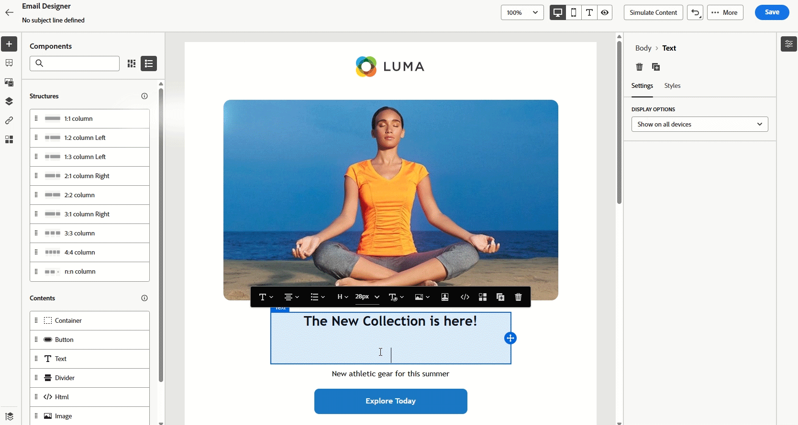

# リリースノート {#release-notes}

>[!CONTEXTUALHELP]
>id="ajo_homepage_card1"
>title="新機能"
>abstract="**Adobe Journey Optimizer** は、新機能、既存機能の強化およびバグ修正を継続的に提供します。これらのリリースノートでは、すべての変更が各月の最終週にまとめられます。"

[!DNL Adobe Journey Optimizer] は、新機能、既存機能の強化、およびバグ修正を継続的に提供します。これらのリリースノートでは、すべての変更が各月の最終週にまとめられます。[!DNL Adobe Journey Optimizer] が [!DNL Adobe Experience Platform] でネイティブに構築され、最新のイノベーションや改善点を引き継いでいます。以下の変更点について詳しくは、[Adobe Experience Platform リリースノート](https://experienceleague.adobe.com/docs/experience-platform/release-notes/latest.html?lang=ja){target="_blank"}を参照してください。

## 2025 年 6 月のリリースノート {#25-6-rn}

<!--
**Early release notes below are subject to change without prior notice until the release availability date**. Links, screens and updated documentation are published at the release date.-->

**リリース日**：2025年6月18日（PT）

<!--See also [Adobe Experience Platform Pre Release Notes](https://experienceleague.adobe.com/ja/docs/experience-platform/release-notes/pre-release-notes){target="_blank"}.-->

### 新機能 {#25-06-features}

このリリースに含まれる新機能を以下に示します。

<table>
<thead>
<tr>
<th><strong>RCS メッセージ</strong> </th>
</tr>
</thead>
<tbody>
<tr>
<td>

Journey Optimizerで Rich Communication Services （RCS）メッセージングがサポートされるようになり、プロバイダーと通信事業者のサポートに応じて、次の強化されたメッセージング機能が可能になりました。

<ul>
<li>ブランドおよび検証済みの送信者のサポート：ブランディング要素（ロゴ、送信者名など）を含む検証済みのビジネスプロファイルを使用してメッセージを送信します。</li>
<li>メッセージ配信インサイト：メッセージステータスの更新（送信済み、配信済み、読み取りなど）を含む詳細な配信レポートを受信します。</li>
<li>リンクトラッキング：エンゲージメント分析のために、RCS メッセージ内に URL を埋め込んで追跡します。</li>
<li>SMS へのフォールバック：プロファイルのデバイスが RCS をサポートしていない場合や、RCS 経由で一時的に到達できない場合に SMS に自動的にフォールバックします。</li>
<li>基本的なメッセージ構成：プロバイダーサポートに応じて、オプションのメディアとリッチ要素を含むテキストベースの RCS メッセージを送信します。</li>
</ul>
<!--p>For more information, refer to the <a href="../sms/sms-configuration.md">detailed documentation</a>.</p-->
</td>
</tr>
</tbody>
</table>

<table>
<thead>
<tr>
<th><strong>コードベースのエクスペリエンスコンテンツのフォームフィールド</strong> </th>
</tr>
</thead>
<tbody>
<tr>
<td>

技術者以外のユーザーがコードを操作しなくても、コードベースのエクスペリエンスチャネルオーサリング内でフォームビューのコンテンツを簡単に編集できる、JSON またはHTML コンテンツテンプレートの特定の編集可能フィールドを定義できるようになりました。  さらに、コードベースのエクスペリエンスコンテンツテンプレートを定義する際に、テンプレートに決定ポリシーを挿入できるようになり、再利用性と使いやすさが向上しました。

詳しくは、<a href="../code-based/code-based-form-fields.md">詳細なドキュメント</a>を参照してください。

</td>
</tr>
</tbody>
</table>

<!--
<table>
<thead>
<tr>
<th><strong>Custom delegation method for subdomains</strong> </th>
</tr>
</thead>
<tbody>
<tr>
<td>

In addition to the full delegation and the CNAME method, a new subdomain configuration method is now available: the Custom delegation method, which enables you to fully own controlling and maintaining all aspects of DNS that are required for delivering, rendering and tracking messages.

</td>
</tr>
</tbody>
</table>
-->

<table>
<thead>
<tr>
<th><strong>ジャーニーでの Content Decisioning アクティビティ</strong> </th>
</tr>
</thead>
<tbody>
<tr>
<td>

ジャーニーキャンバスの専用のコンテンツ決定アクティビティを通じてパーソナライズされたオファーをジャーニーに含め、条件やカスタムアクションなどのジャーニーアクティビティで使用できるようになりました。

この機能は一連の組織（限定提供）でのみ使用でき、今後のリリースでグローバルに展開されます。

詳しくは、<a href="../building-journeys/content-decision.md">詳細なドキュメント</a>を参照してください。

</td>
</tr>
</tbody>
</table>

<table>
<thead>
<tr>
<th><strong>ジャーニーのドライラン</strong> </th>
</tr>
</thead>
<tbody>
<tr>
<td>

ジャーニードライランは、Adobe Journey Optimizerの特別なジャーニー公開モードであり、ジャーニー実務担当者が実際の顧客に連絡したりプロファイル情報を更新したりせずに、実際の実稼動データを使用してジャーニーをテストできます。 この機能により、ジャーニー実務担当者は、ジャーニーをライブで公開する前に、ジャーニーのデザインとオーディエンスのターゲティングに自信を持つことができます。

この機能は一連の組織（限定提供）でのみ使用でき、今後のリリースでグローバルに展開されます。

詳しくは、<a href="../building-journeys/journey-dry-run.md">詳細なドキュメント</a>を参照してください。

</td>
</tr>
</tbody>
</table>

<table>
<thead>
<tr>
<th><strong>ジャーニーの一時停止と再開</strong> </th>
</tr>
</thead>
<tbody>
<tr>
<td>

これで、ジャーニーを一時停止して再開できます。 この機能を使用すると、顧客体験を中断することなくライブジャーニーを一時的に停止できるので、ジャーニー担当者は制御と柔軟性を強化できます。 一時停止すると、通信は送信されず、プロファイルはジャーニーが再開されるまで休止状態のままになります。

1 つのジャーニーのみを一時停止および再開することも、ジャーニーのグループに対して一括一時停止操作および再開操作を実行することもできます。

また、一時停止したジャーニーにグローバルフィルターを適用し、属性に基づいてプロファイルを除外できます。

この機能は一連の組織（限定提供）でのみ使用でき、今後のリリースでグローバルに展開されます。

詳しくは、<a href="../building-journeys/journey-pause.md">詳細なドキュメント</a>を参照してください。

</td>
</tr>
</tbody>
</table>

<table>
<thead>
<tr>
<th><strong>実験の勝者を拡大</strong> </th>
</tr>
</thead>
<tbody>
<tr>
<td>

「実験の勝者を拡大」を使用すると、実験の勝利バリエーションをすべてのオーディエンスに自動または手動でロールアウトできます。この機能により、最もパフォーマンスの高い処理が特定されると、手動で常に監視することなく、そのリーチと効果を最大化できます。

詳しくは、<a href="../content-management/content-experiment.md">詳細なドキュメント</a>を参照してください。

リリース日：2025年6月2日（PT）
</td>
</tr>
</tbody>
</table>

<table>
<thead>
<tr>
<th><strong>競合と優先順位付け</strong> </th>
</tr>
</thead>
<tbody>
<tr>
<td>

Journey Optimizer では、過剰な数のインタラクションで顧客が圧倒されるのを避けるために、キャンペーンとジャーニーの量とタイミングを管理することが不可欠です。Journey Optimizer では、以前は制限付きアクセス（LA）組織でのみ使用できた競合の管理と優先順位付けのためのツールがいくつか提供されるようになりましたが、現在は一般提供（GA）されています。

この機能は、以前は限定提供でリリースされていましたが、現在はすべての環境で使用できます。この一般提供リリースでは、次の機能強化が導入されました。

<ul>
<li>サポートの拡張：競合管理ツールでは、オーディエンスを読み取りジャーニーに加えて、単一ジャーニーとオーディエンスの選定ジャーニーの両方がサポートされるようになりました。</li>
<li>トラブルシューティングの改善：クエリサービスで 2 つの新しいステップイベントフィールドが使用できるようになりました。これにより、プロファイルがジャーニーまたはキャンペーンから却下された理由を分析できます。</li>
<li>レポートの強化：レポートには、ジャーニーまたはキャンペーンからプロファイルを除外した特定のルールが示されるようになり、透明性が向上し、実用的なインサイトが提供されます。</li></ul>

詳しくは、<a href="../conflict-prioritization/gs-conflict-prioritization.md">詳細なドキュメント</a>を参照してください。

リリース日：2025年6月3日（PT）

</td>
</tr>
</tbody>
</table>

### 機能強化 {#25-06-improv}

このリリースに含まれる機能強化を以下に示します。

<!--* **Channel rule sets**

  * **Custom duration window** for capping -  A new **Repeat Count** field is now available in the channel rule sets configuration screen, allowing you to apply frequency capping rules over multiple days, weeks, or months, depending on the specified duration.

  * **Hourly duration** - You can now apply capping on an hourly basis for channel rule sets.    -->

* **コードベースのエクスペリエンス**

   * 決定ポリシーをコードベースのエクスペリエンスコンテンツテンプレートで追加できるようになりました。このテンプレートを使用して、編集可能なフォームフィールドでオファーを活用できます。 [詳細情報](../code-based/code-based-form-fields.md)

   * コードベースのエクスペリエンスジャーニーまたはキャンペーン編集画面から、パーソナライゼーションエディターを開くことなく、決定ポリシーを直接追加できるようになりました。 [詳細情報](../code-based/create-code-based.md#edit-code)

* **メールDesignerでのカスタム CSS のサポート**

  Journey Optimizerで、メールDesigner内でメールコンテンツに直接カスタム CSS を追加できるようになりました。 [詳細情報](../email/custom-css.md)

* **キャンペーン用の新しいタブ付きナビゲーション**

  新しいナビゲーションパターンにより、コンテンツオーサリングにすばやくアクセスでき、キャンペーン全体でさらに設定を拡張できます。 [詳細情報](../campaigns/create-campaign.md)

* **決定** - リリース日：2025年6月3日（PT）

  決定オブジェクトをサンドボックス間でコピーできるようになり、テストとデプロイメントのワークフローを効率化できるようになりました。[詳細情報](../configuration/copy-objects-to-sandbox.md#decisioning)

* **決定ルールの決定項目属性のサポート** – リリース日：2025年6月4日（PT）

  決定項目属性を活用して、決定ルールを作成できるようになりました。[詳細情報](../experience-decisioning/rules.md#create)

* **インタラクティブメッセージ実行 API の更新** – リリース日：2025年6月6日（PT）

  インタラクティブメッセージ実行 API で、今後のキャンペーン実行のスケジュールを削除できるようになりました。[詳細情報](https://developer.adobe.com/journey-optimizer-apis/references/messaging/){target="_blank"}

## 2025年5月リリースノート {#25-5-rn}

<!--**Release date**: May 20-21, 2025-->

### 新機能 {#25-05-features}

このリリースに含まれる新機能を以下に示します。

<table>
<thead>
<tr>
<th><strong>キャンペーンとジャーニーインベントリのカレンダー表示</strong> </th>
</tr>
</thead>
<tbody>
<tr>
<td>

ジャーニーとキャンペーンのリストでカレンダー表示を使用できるようになりました。これにより、すべてのジャーニーとキャンペーンのアクティベーションをそれぞれのリストで視覚化できます。

この変更は現在、一連の組織のみが使用できます（限定提供）。利用申請するには、<a href="https://forms.cloud.microsoft/r/FC49afuJVi" target="_blank">このフォーム</a>を使用します。

詳しくは、<a href="../building-journeys/journey-ui.md">ジャーニーの参照とフィルタリング</a>、<a href="../campaigns/modify-stop-campaign.md">キャンペーンへのアクセス</a>の節を参照してください。

リリース日：2025年5月28日（PT）

</td>
</tr>
</tbody>
</table>

<table>
<thead>
<tr>
<th><strong>Adobe Experience Manager コンテンツフラグメントの統合</strong> </th>
</tr>
</thead>
<tbody>
<tr>
<td>

Adobe Experience Manager と Adobe Journey Optimizer の統合により、Journey Optimizer コンテンツ内で Adobe Experience Manager コンテンツフラグメントを簡単に使用できるようになりました。このシームレスな接続により、Journey Optimizer で AEM コンテンツに直接アクセスして使用することが簡単になります。

以前は限られた組織（LA）でのみ利用可能だったこの機能は、次の機能強化を伴って GA になりました。エディターモードを使用して、フラグメント署名内でプレースホルダーを定義し、パーソナライゼーション値をマッピングできるようになりました。

<ul>
<!--li>Create offers by directly selecting an AEM Content Fragment.</li>
<li>Define placeholders and map personalization values within the fragment signature using the Editor mode.</li-->
</ul>
 

詳しくは、<a href="../integrations/aem-fragments.md">詳細なドキュメント</a>を参照してください。

公開日：2025年5月23日（PT）

</td>
</tr>
</tbody>
</table>

<table>
<thead>
<tr>
<th><strong>Adobe Experience Manager Dynamic Media の統合</strong> </th>
</tr>
</thead>
<tbody>
<tr>
<td>

Dynamic Media アセットが Journey Optimizer で直接使用可能になり、アクセスできるようになりました。この統合により、次のことを実行できます。

<ul>
<li>リアルタイム更新でアセットを一元管理。</li>
<li>幅や高さなどのアセット設定を即座に変更。</li>
<li>コンテンツを更新し、パーソナライゼーションフィールドを追加して、Dynamic Media テンプレートをカスタマイズ。</li>
</ul>
 

この機能は、以前は限定提供でリリースされていましたが、現在はすべての環境で使用できます（一般提供）。

詳しくは、<a href="../integrations/aem-dynamic.md">詳細なドキュメント</a>を参照してください。

公開日：2025年5月23日（PT）

</td>
</tr>
</tbody>
</table>

<table>
<thead>
<tr>
<th><strong>イベントトリガージャーニーの補足 ID</strong> </th>
</tr>
</thead>
<tbody>
<tr>
<td>

プロファイル ID と、注文 ID、サブスクリプション ID、処方箋 ID などの別の識別子を使用してジャーニーをトリガーできるようになりました。これにより、同じプロファイルを同じジャーニーに複数回同時に含めることができます。これにより、各インスタンスがジャーニーを通じて独自のパスに従いながら、複数の注文やサブスクリプションを並行して管理するなどのシナリオが可能になります。

詳しくは、<a href="../building-journeys/supplemental-identifier.md">詳細なドキュメント</a>を参照してください。

この機能は、一連の組織でのみ使用できます（限定提供）。アクセスするには、アドビ担当者にお問い合わせください。

公開日：2025年5月23日（PT）

</td>
</tr>
</tbody>
</table>

<table>
<thead>
<tr>
<th><strong>コンテンツバリエーションのシミュレート</strong> </th>
</tr>
</thead>
<tbody>
<tr>
<td>
<!--p>Previously available in beta, content variations simulation is now generally available (GA). It allows you to preview different variations of your content using sample input data uploaded from a CSV or JSON file or added manually. All the attributes used in your content for personalization are automatically detected by the system and can be used for your tests to create multiple variants.</p-->

この機能は、以前は限定提供でリリースされていましたが、現在はすべての環境で使用できます。この一般提供リリースでは、この機能に多言語コンテンツとコンテンツ実験のサポートが含まれるようになり、様々な言語や処理でのバリエーションをテストできるようになりました。さらに、（プロファイル属性に加えて）コンテキスト属性もサポートされるようになり、より動的で状況に応じたコンテンツテストが可能になりました。

詳しくは、<a href="../test-approve/simulate-sample-input.md">詳細なドキュメント</a>を参照してください。

公開日：2025年5月23日（PT）

</td>
</tr>
</tbody>
</table>

<table>
<thead>
<tr>
<th><strong>オーディエンスを読み取りスケジュールのバッチセグメント化ジョブとの同期</strong> </th>
</tr>
</thead>
<tbody>
<tr>
<td>

バッチセグメント化完了後に毎日のジャーニー実行をトリガーできるようになりました。このオプションは、すべてのお客様に対して毎日スケジュールされているジャーニーで使用できるようになりました。これを使用すると、バッチセグメント化ジョブからのオーディエンスデータを待機する時間枠を最大 6 時間まで定義できます。これにより、ジャーニーは最新のデータで実行されるか、準備が整っていない場合はスキップされます。

この機能は、以前は限定提供でリリースされていましたが、現在はすべての環境で使用できます（一般提供）。

詳しくは、<a href="../building-journeys/read-audience.md#schedule">詳細なドキュメント</a>を参照してください。

リリース日：2025年5月20日（PT）

</td>
</tr>
</tbody>
</table>

<table>
<thead>
<tr>
<th><strong>カスタム SMS プロバイダー</strong> </th>
</tr>
</thead>
<tbody>
<tr>
<td>

Journey Optimizer では、デフォルトのオプションに加えて、Sinch、Infobip、Twilio などの追加の SMS プロバイダーを設定できるようになりました。カスタム SMS プロバイダー設定を使用すると、サードパーティプロバイダーを直接統合し、動的メッセージ用の高度なペイロードカスタマイズを活用し、同意設定（オプトイン／オプトアウト）を管理してコンプライアンスを確保できます。

詳しくは、<a href="../sms/sms-configuration-custom.md">詳細なドキュメント</a>を参照してください。

この機能は、以前は限定提供でリリースされていましたが、現在はすべての環境で使用できます（一般提供）。

リリース日：2025年5月20日（PT）

</td>
</td>
</tr>
</tbody>
</table>

<table>
<thead>
<tr>
<th><strong>E メールデザイナーのテーマ</strong> </th>
</tr>
</thead>
<tbody>
<tr>
<td>

事前承認済みのテーマをすばやく適用して、すべてのメールにわたってブランドの一貫性を確保し、キャンペーン作成プロセスを高速化し、デザインチームへの依存を減らしながら高品質のメールを独自に作成できるようになりました。

この機能は現在ベータ版で、ベータ版のお客様のみご利用いただけます。ベータ版プログラムに参加するには、アドビ担当者にお問い合わせください。

詳しくは、<a href="../email/apply-email-themes.md">詳細なドキュメント</a>を参照してください。

公開日：2025年5月14日（PT）

</td>
</tr>
</tbody>
</table>

<table>
<thead>
<tr>
<th><strong>決定 - 新しい AI 式ビルダー</strong> </th>
</tr>
</thead>
<tbody>
<tr>
<td>

新しく改善されたインターフェイスから条件を定義および組み合わせることで、特定の決定ランキング式を作成できるようになりました。静的なオファーの優先度のみに依存するのではなく、ガイド付きインターフェイスを通じて、AI モデルスコア、オファーの優先度、プロファイル属性、オファー属性、コンテキストシグナルを組み合わせたカスタムランキング式を定義できます。

詳しくは、<a href="../experience-decisioning/exd-ranking-formulas.md">詳細なドキュメント</a>を参照してください。

公開日：2025年5月14日（PT）

</td>
</tr>
</tbody>
</table>

### 機能強化 {#25-05-improv}

このリリースに含まれる機能強化を以下に示します。

* **サンドボックスコピーをサポートする新しいキャンペーンオブジェクト** – リリース日：2025年5月15日（PT）

  パッケージの書き出しと読み込み機能を使用して、複数のサンドボックス間でキャンペーンをコピーすると、チャネル設定、実験のバリアントと設定、決定ポリシーと項目などの依存関係もコピーされるようになりました。[詳細情報](../configuration/copy-objects-to-sandbox.md)

* **ランディングページのフォルダー** - 公開日：2025年5月9日（PT）

  ランディングページを簡単に管理することを目的に、フォルダーを使用して、より効果的に効率化された階層に整理できるようになりました。[詳細情報](../landing-pages/manage-lp.md)

* **ダイレクトメール：SFTP 接続用の SSH キーのサポート** - 公開日：2025年5月5日（PT）

  ダイレクトメールファイルのルーティング設定では、パスワード認証タイプの既存の SFTP に加えて、SSH キー認証を使用してダイレクトメールファイルを SFTP サーバーに書き出すことができるようになりました。[詳細情報](../direct-mail/direct-mail-configuration.md)

* **パーソナライゼーション用のピルのアクティベーション** - 公開日：2025年5月5日（PT）

  パーソナライゼーションエディターに新しい「ピル」ボタンが追加されました。有効にすると、プロファイルとコンテキスト属性がピルとして表示され、コードの読みやすさが向上します。[詳細情報](../personalization/personalization-build-expressions.md#options)

  >[!AVAILABILITY]
  >
  >この機能は、今後 30 日間にわたってすべての環境に段階的にロールアウトされます。

* **Web チャネルでの「URL にリダイレクト」のサポート** – リリース日：2025年5月20日（PT）

  Journey Optimizer web チャネルでは、ビジュアルエディターで新しいバリエーションを作成するのではなく、訪問者を別の既存の URL にリダイレクトできるようになりました。この機能を使用すると、ページ内のいくつかの要素を変更するだけでなく、完全に異なる 2 つのページを比較する実験を実行できます。[詳細情報](../web/create-web.md#web-redirect-to-url)

* **テンプレートとフラグメントのフォルダー** - リリース日：2025年5月20日（PT）

  フォルダーを使用すると、オブジェクトを構造化された階層に簡単かつ効果的に整理できます。以前は一連の組織（LA）に対して提供されていましたが、すべてのユーザー（GA）に対してコンテンツテンプレートとフラグメントを管理できるようになりました。詳しくは、[コンテンツテンプレート](../content-management/access-content-templates.md#folders)および[フラグメント](../content-management/manage-fragments.md#folders)の節を参照してください。

* **メールテンプレートでのクリックの追跡** – リリース日：2025年5月20日（PT）

  メールコンテンツの画像マップ内の `<area>` 要素のクリックの追跡が [!DNL Journey Optimizer] でネイティブにサポートされるようになりました。これは、画像マップ領域が標準のハイパーリンクと同じトラッキングラッピング、トラッキングデータおよび追加されたパラメーターを確実に受け取るようにするためです。[メッセージトラッキングの詳細情報](../email/message-tracking.md#manage-tracking)

<!--
* **Decisioning - Leverage Adobe Experience Platform datasets** 
  
  Journey Optimizer now allows you to leverage Adobe Experience Platform datasets in the following Decisioning objects: eligibility rules, ranking formulas, and capping rules.-->

* **キャンペーンリストの右側のパネル** – リリース日：2025年5月20日（PT）

  キャンペーンリストでキャンペーンを選択すると、詳細を表示するパネルが開くようになりました。

<!--* **Form fields in code-based experience content**

  In content templates, you can now define specific JSON or HTML fields which enable non-technical users to easily edit content in code-based experiences without the need to manipulate code.-->

<!--* **Subdomains - 'Custom delegation' method**  
  In addition to the full delegation and the CNAME method, a new subdomain configuration method is now available: the Custom delegation method, which enables you to fully own controlling and maintaining all aspects of DNS that are required for delivering, rendering, and tracking messages.
  -->

