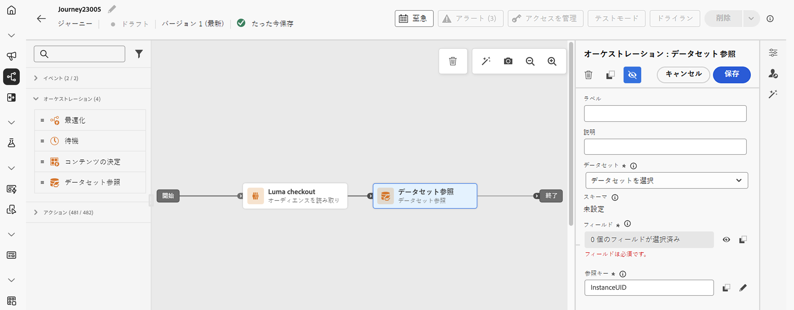
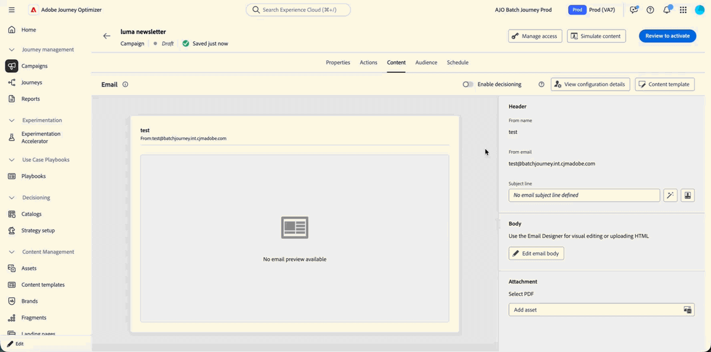

# リリースノート {#release-notes}

>[!CONTEXTUALHELP]
>id="ajo_homepage_card1"
>title="新機能"
>abstract="**Adobe Journey Optimizer**&#x200B;は、新機能、既存の機能の強化、バグ修正を継続的に提供します。 これらのリリースノートでは、すべての変更が各月の最終週にまとめられます。"

[!DNL Adobe Journey Optimizer]は継続的な配信モデルに従い、Adobeが継続的に新しい機能、機能強化、および修正を提供できるようにします。 このアプローチにより、スケーラブルで段階的な機能のロールアウトが可能になり、すべての環境をまたいでパフォーマンスと安定性を確保できます。

このモデルにより、リリースノートは毎月のリリースの間に更新されます。リリースサイクルと可用性フェーズについて詳しくは、[Journey Optimizer リリースサイクル](releases.md)を参照してください。

[!DNL Adobe Journey Optimizer] が [!DNL Adobe Experience Platform] でネイティブに構築され、最新のイノベーションや改善点を引き継いでいます。以下の変更点について詳しくは、[Adobe Experience Platform リリースノート](https://experienceleague.adobe.com/docs/experience-platform/release-notes/latest.html?lang=ja){target="_blank"}を参照してください。

## 26年3月のリリースノート {#march-26-rn}

[新機能](#march-26-features)および[改善点](#march-26-improv)のセクションでは、既に使用可能な機能について説明しています。 [近日リリース予定](#coming-soon)の節には、3月後半にリリース予定の機能と機能強化が一覧表示されます。

<!--
**The pre-release notes below are subject to change without prior notice until the release availability date**. Links, screens and updated documentation are published in the release notes, at the release date.

See also [Adobe Experience Platform pre-release notes](https://experienceleague.adobe.com/en/docs/experience-platform/release-notes/pre-release-notes){target="_blank"}.-->

**リリース日**: 2026年3月24日～25日

### 新機能 {#march-26-features}

<table>
<thead>
<tr>
<th><strong>ランディングページのカスタムフォーム</strong> </th>
</tr>
</thead>
<tbody>
<tr>
<td>

[!DNL Journey Optimizer]では、ランディングページを通じてプロファイル属性を取得できます。

特定のデータセットに基づいて、ニーズに合わせてカスタマイズされたカスタムフォームを作成、デザイン、管理します。その後、ランディングページでこれらのフォームを活用して、各フォームに定義されたデータセットに選択したプロファイル属性を追加できます。

以前は、米国およびオーストラリアのお客様に対して限定提供でリリースされていましたが、この機能はすべての環境で利用できるようになりました（一般提供）。

詳しくは、<a href="../landing-pages/lp-forms.md">詳細なドキュメント</a>を参照してください。

ご利用いただけます。2026年3月26日（PT）

</td>
</tr>
</tbody>
</table>

<table>
<thead>
<tr>
<th><strong>オーケストレーションされたキャンペーンでのアクティビティのテスト</strong> </th>
</tr>
</thead>
<tbody>
<tr>
<td>

新しい<strong> テスト </strong> アクティビティが、オーケストレーションされたキャンペーンで利用できるようになりました。 このアクティビティにより、定義された条件に基づいてワークフローの実行を異なるブランチにルーティングし、ライブ配信をアクティブ化する前にキャンペーンロジックと設定を検証できます。

詳しくは、<a href="../orchestrated/activities/test.md">詳細なドキュメント</a>を参照してください。

</td>
</tr>
</tbody>
</table>

<table>
<thead>
<tr>
<th><strong>ジャーニーでのデータセット検索のサポート</strong> </th>
</tr>
</thead>
<tbody>
<tr>
<td>

ジャーニーの新しい<strong> データセット検索</strong> アクティビティでは、実行時にAdobe Experience Platform レコードデータセットからデータを動的に取得できるので、プロファイルやイベントペイロードに含まれていない情報にアクセスできるので、顧客とのやり取りは関連性があり、タイムリーな状態を維持できます。

以前は制限付き組織セットに対して限定提供でリリースされていましたが、ジャーニーのデータセット検索アクティビティは、[ データセット検索] （../data/lookup-aep-data.md）の資格を持つすべての顧客が利用できるようになりましたが、引き続き限定提供です。

詳しくは、<a href="../building-journeys/dataset-lookup.md">詳細なドキュメント</a>を参照してください。

</td>
</tr>
</tbody>
</table>

<table>
<thead>
<tr>
<th><strong>チャネル固有のジャーニーアクティビティに代わるアクションアクティビティ</strong> </th>
</tr>
</thead>
<tbody>
<tr>
<td>

2026年2月の<strong> アクションアクティビティ </strong>の一般提供に続いて、ジャーニーキャンバス内の従来のネイティブチャネルアクティビティ（メール、プッシュ、SMS、アプリ内、Web、コードベースのエクスペリエンス、コンテンツカード）が非推奨になりました。

これで、単一の<strong> アクションアクティビティ </strong>を使用してすべてのチャネルアクションを設定し、チャネル固有のノードを個別に作成する必要がなくなりました。

従来のチャネルアクティビティを使用している既存のジャーニーは、変更や移行が必要なく、引き続き機能します。

詳しくは、<a href="../building-journeys/journey-action.md">詳細なドキュメント</a>を参照してください。

</td>
</tr>
</tbody>
</table>

<table>
<thead>
<tr>
<th><strong>メールテンプレート用の高度なHTMLエディター</strong> </th>
</tr>
</thead>
<tbody>
<tr>
<td>

電子メールコンテンツテンプレートの高度なHTML モードを使用すると、電子メールDesignerでコンテンツのHTML ソースを編集したり、ソースに高度な式（条件など）を追加したり、変更内容を失うことなくHTML ビューとデスクトップビューを切り替えたりできます。

この機能は、メールチャネルのコンテンツテンプレートでのみ使用できます。 現在、限定提供されています。アクセス権を取得するには、Adobe担当者にお問い合わせください。

詳しくは、<a href="../content-management/email-template-expert-mode.md">詳細なドキュメント</a>を参照してください。

公開日：2026年3月10日（PT）

</td>
</tr>
</tbody>
</table>

<table>
<thead>
<tr>
<th><strong>カスタム Firefly モデルとサードパーティの画像生成モデルの統合</strong> </th>
</tr>
</thead>
<tbody>
<tr>
<td>

標準Fireflyモデルとカスタム Adobe Target モデルを、承認済みのサードパーティ画像モデルとシームレスに統合することで、画像を生成する際の柔軟性、コントロール、ブランドの整合性を向上できます。

ニーズに適したモデルの選択：

<ul><li> <strong>Adobe モデル </strong> （Firefly Image Model 4を利用）は、追加設定なしで即座に画像を生成できます</li><li> <strong> パートナーモデル </strong> （Gemini 2.5 Flashを搭載）を使用した特殊機能</li><li>ブランドに即した生成を可能にする<strong> カスタムモデル </strong> （独自のアセットでトレーニングされたブランド固有のモデル）は、ブランドアイデンティティ、スタイル、ビジュアルガイドラインに正確に一致します。</li></ul>

詳しくは、<a href="../content-management/generative-models.md">詳細なドキュメント</a>を参照してください。

公開日：2026年3月2日（PT）

</td>
</tr>
</tbody>
</table>

<table>
<thead>
<tr>
<th><strong>IOSのライブアクティビティ</strong> </th>
</tr>
</thead>
<tbody>
<tr>
<td>

Adobe Journey Optimizerの<strong>iOS ライブアクティビティ </strong>を利用して、お客様のロックScreensとダイナミックアイランドにリアルタイムのエクスペリエンスを直接提供できます。 ユーザーがアプリを開かなくても、注文追跡やフライト状況からイベントカウントダウン、ライブスコア、配信の進捗状況に至るまで、ライブアップデートを配信できます。 オーディエンスがどこにいても、適切なタイミングで情報を提供し、エンゲージメントを維持しましょう。

以前はベータ版でリリースされていましたが、この機能はすべての環境で使用できるようになりました（一般提供）。

詳しくは、<a href="../mobile-live/get-started-mobile-live.md">詳細なドキュメント</a>を参照してください。

公開日：2026年3月3日（PT）

</td>
</tr>
</tbody>
</table>

<table>
<thead>
<tr>
<th><strong>Journey Agent:Channel content create</strong> </th>
</tr>
</thead>
<tbody>
<tr>
<td>

<strong>Adobe Experience Platform Agent Orchestrator</strong>を搭載した<strong>Journey Agent</strong>は、Journey Optimizerで利用でき、自然言語インターフェイスを通じてジャーニーを分析できます。 また、Journey Agentでチャネル固有のコンテンツを直接生成および管理し、電子メールやプッシュ通知などのチャネル用のコンテンツを作成したり、テンプレートを適用およびプレビューしたり、プロンプトを通じてトーンやスタイルを調整したり、コンテキストに沿った編集のために<strong>Content Designer</strong>でコンテンツを開いたりすることもできます。

この機能は、一連の組織でのみ使用できます（限定提供）。アクセス権を取得するには、アドビ担当者にお問い合わせください。

詳しくは、<a href="https://experienceleague.adobe.com/docs/experience-cloud-ai/experience-cloud-ai/agents/ajo-agent.html" target="_blank">詳細なドキュメント</a>を参照してください。

公開日：2026年3月4日（PT）

</td>
</tr>
</tbody>
</table>

<table>
<thead>
<tr>
<th><strong>AI モデル監視</strong> </th>
</tr>
</thead>
<tbody>
<tr>
<td>

Journey Optimizerでは、Decisioning AI モデルの健全性、トレーニング状況、パフォーマンスをモニタリングできるようになりました。 これにより、AIを活用する各顧客に最適なオファーを選択するために、トレーニングの成功を検証し、失敗のトラブルシューティングを行い、結果への影響を把握することができます。 この機能は、<strong>Decisioning</strong>でのみ使用できます（従来の意思決定管理モデルでは使用できません）。

この機能は現在、<strong> パーソナライズされた最適化</strong> モデルでのみ使用できます（自動最適化ではありません）。

詳しくは、<a href="../experience-decisioning/ranking/ai-model-observability.md">詳細なドキュメント</a>を参照してください。

公開日：2026年3月9日（PT）

</td>
</tr>
</tbody>
</table>

<table>
<thead>
<tr>
<th><strong>シグナルを活用したトリガーオーケストレーションされたキャンペーン</strong> </th>
</tr>
</thead>
<tbody>
<tr>
<td>

オーケストレーションされたキャンペーンは、<strong>API シグナル </strong>を介してトリガーできるようになりました。 これを設定するには、シグナル <strong>によってトリガーされた</strong> ターゲットキャンペーンを設定して公開し、API呼び出しを使用して実行します。 API呼び出しに含まれるパラメーターは、実行中のキャンペーン内で変数として使用できます。 シグナル トリガーによるオーケストレーションされたキャンペーンは<strong> バッチ </strong>のキャンペーンのままであり、API トリガーされたキャンペーンとは異なります。

詳しくは、<a href="../orchestrated/trigger-orchestrated-campaign.md">詳細なドキュメント</a>を参照してください。

</td>
</tr>
</tbody>
</table>

<table>
<thead>
<tr>
<th><strong>オーケストレーションされたキャンペーンのトランザクションカテゴリ</strong> </th>
</tr>
</thead>
<tbody>
<tr>
<td>

オーケストレーションキャンペーンで、チャネルアクティビティを<strong> トランザクション </strong> カテゴリに設定できるようになりました。 これは、そのアクティビティにトランザクションチャネル設定を適用し、ビジネスルールを適用しない場合や、顧客のオプトインが必要ない場合に役立ちます。

詳しくは、<a href="../orchestrated/activities/channels.md#add">詳細なドキュメント</a>を参照してください。

この機能は、今後数日間であらゆる地域に徐々に展開されます。

</td>
</tr>
</tbody>
</table>

### 機能強化 {#march-26-improv}

このリリースに含まれる機能強化を以下に示します。

#### レポート

* **送信時間の最適化：更新されたコントロールの場所と新しい上昇率レポート** – 送信時間の最適化（STO）コントロールがアクション設定メニューに再配置されました。 さらに、ジャーニーレポートで新しいリフトレポートを使用できるようになりました。このレポートを使用して、キャンペーンのパフォーマンス指標に対するSTOの影響を測定できます。 [詳細情報](../reports/channel-report-cja.md#optimization-models)

  公開日：2026年3月27日（PT）

<!--

* **Exclude bot clicks for email and SMS reporting** - Email and SMS reporting now automatically filters out bot clicks from click metrics, providing more accurate engagement data and preventing automated traffic from inflating your performance figures.

#### Email Designer

* **Email Designer displayed in Unified Shell** - The Email Designer is now displayed within the Unified Shell experience, providing a consistent navigation and header experience that aligns with other Adobe applications.

* **Text mode support in fragments** - To support text-based email workflows, you can now create and manage text versions of your visual fragments for optimal use in the plain text version of emails that include that fragment.

  **Caution:** When using a fragment that was created before the current release, the fragment text version may be incorrectly rendered—both in the Email Designer and in the final email delivered to your recipients. For best results with older fragments, edit, save and republish each fragment.-->
<!--
#### Decisioning

* **Optional fragments in decision items** - When using fragments in decision items, you can now make a fragment optional so that if it is temporarily unavailable on Edge, it is skipped and the journey or campaign continues rendering instead of failing.
-->

#### 設定

<!--* **Folders for journeys and campaigns** - You can now organize your journeys and campaigns into folders, enabling structured navigation and easier management for teams working with large volumes of content. This capability is only available for a set of organizations (Limited Availability). To gain access, contact your Adobe representative.-->

* **AJO ドメイン証明書の更新に失敗しました** – 電子メール配信に使用するドメイン証明書の有効期限が近づいているか、有効期限が切れている場合に、電子メールまたはJourney Optimizer通知センターでシステムアラートを受け取ることができるようになりました。 [詳細情報](../reports/alerts.md#alert-certificates-renewal-unsuccessful)

  公開日：2026年3月26日（PT）

* **AJO セカンダリ Recipient Feedback Event Dataset rename** - `AJO Email BCC Feedback Event` データセットの名前が`AJO Secondary Recipient Feedback Event` Datasetに変更されました。 影響は、状況によって異なります。

   * **既存のユーザー**：表示名のみが更新されます。 基になるテーブル名は変更されません。
   * **新しいユーザーとサンドボックス**：表示名とテーブル名の両方に新しい名前が反映されます。
   * **新しいサンドボックスを持つ既存のユーザー**：表示名とテーブル名の両方が新しい名前に更新されます。

  公開日：2026年3月2日（PT）

#### ジャーニー

* **プロファイルの更新アクション：複数のプロファイル属性のサポート** - **プロファイルの更新** アクションアクティビティで、1つのノードで最大5つのプロファイル属性の更新がサポートされるようになりました。 以前は、各アクションで一度に更新できる属性は1つだけで、複数のノードで複数の属性を更新する必要がありました。 新しい「**別のフィールドを更新**」ボタンを使用して、フィールドと値のペアを追加し、キャンバスの複雑さを軽減してパフォーマンスを向上させます。 [詳細情報](../building-journeys/update-profiles.md)

* **ジャーニー内のアウトバウンドメッセージの送信を開始** - Journey Optimizer ジャーニーからのメッセージを、管理されたバッチで配信するようにスケジュールできるようになりました。 [詳細情報](../building-journeys/send-using-waves.md)

  以前は、ジャーニーで使用するための限定可用性でリリースされていましたが、この機能はすべての環境で使用できるようになりました（一般提供）。

  公開日：2026年3月16日（PT）

* **ジャーニーの技術的な詳細**&#x200B;の一時停止と再開の詳細 – ジャーニー&#x200B;**の技術的な詳細**&#x200B;には、追加の一時停止と再開の情報（最後の一時停止と再開の日時、各アクションを実行したユーザーの表示名と内部識別子、一時停止の動作、最大一時停止の時間、自動再開の状態など）が含まれるようになりました。 [詳細情報](../building-journeys/journey-properties.md)

  公開日：2026年3月2日（PT）

## 近日リリース予定 {#coming-soon}

以下の機能と機能強化は、3月後半から4月上旬にリリース予定です。 リリース日とスコープは&#x200B;**予告なく変更される可能性があります**。

### 機能

<table>
<thead>
<tr>
<th><strong>画像をメールコンテンツテンプレートに変換</strong> </th>
</tr>
</thead>
<tbody>
<tr>
<td>

Journey Optimizerから直接、画像をメールコンテンツテンプレートに変換できるようになりました。 AIを活用した分析により、ビジュアルリファレンスから構造化されたHTMLテンプレートを自動的に生成し、メールのデザイン時間を大幅に短縮できます。

以前は制限付き可用性でリリースされていましたが、この機能はすべての環境で使用できるようになりました（一般提供）。 <a href="../content-management/image-to-html.md">詳細情報</a>

公開日：2026年3月30日（PT）

</td>
</tr>
</tbody>
</table>

<table>
<thead>
<tr>
<th><strong>URL パラメーターの暗号化</strong> </th>
</tr>
</thead>
<tbody>
<tr>
<td>

トラッキングリンクやランディングページのURL パラメーターを暗号化できるようになり、機密性の高いパラメーターデータにさらなるセキュリティレイヤーを提供します。

<ul>
<li>専用の<strong>管理</strong> レジストリに暗号化キーを登録して管理します。</li>
<li>式で新しい暗号化ヘルパーを使用して、レンダリング時に保護するクエリパラメーターのトラッキングリンクおよびランディングページ URLの機密データを暗号化します。</li>
</ul>

この機能は、一連の組織でのみ使用できます（限定提供）。アクセス権を取得するには、アドビ担当者にお問い合わせください。

公開日：2026年3月31日（PT）

</td>
</tr>
</tbody>
</table>

<table>
<thead>
<tr>
<th><strong>インボックス</strong> </th>
</tr>
</thead>
<tbody>
<tr>
<td>

<strong>受信トレイ </strong>は、コンテンツカードで利用できるモバイル機能で、ユーザーがアプリまたはweb サイト内で一元的な場所を作成して、ユーザーに送信されるメッセージを表示できるようにします。 これにより、メッセージが却下された後もアクセスできるようになり、マーケティングコミュニケーションの有効期間を延長できます。

公開日：2026年3月31日（PT）

</td>
</tr>
</tbody>
</table>

<table>
<thead>
<tr>
<th><strong>ジャーニーパスの最適化</strong> </th>
</tr>
</thead>
<tbody>
<tr>
<td>

新しい「最適化」ノードを使用して、特定のオーディエンスをターゲットにしたり、A/B テストを実行して、ビジネス中心のKPIを満たすのに最適なパスを決定したりできます。
このツールを使用すると、コミュニケーション、シーケンス、タイミングをテスト、調整、カスタマイズし、顧客に最も効果的にリーチできます。

以前は制限付き可用性でリリースされていましたが、この機能はすべての環境で使用できるようになりました（一般提供）。 <a href="../building-journeys/optimize.md">詳細情報</a>

一般提供の一環として、このリリースでは、<strong>実験タイプ </strong>の選択（A/Bまたはマルチアームドバンディット）と<strong>単一ジャーニーの勝者</strong>の拡大が導入されています。

公開日：2026年4月3日（PT）

</td>
</tr>
</tbody>
</table>

<table>
<thead>
<tr>
<th><strong>メールチャネルにおける意思決定のサポート</strong> </th>
</tr>
</thead>
<tbody>
<tr>
<td>

<strong>Decisioning</strong>を使用して、メールメッセージのコンテンツをパーソナライズおよび最適化できるようになりました。 優先順位のスコア、数式、AI モデルを活用して、各受信者に最も関連性の高いオファーやコンテンツを表示します。

以前は制限付き可用性でリリースされていましたが、この機能はすべての環境で使用できるようになりました（一般提供）。 この一般提供リリースでは、ミラーページがサポートされるようになりました。

<!--
For more information, refer to the <a href="../experience-decisioning/create-decision-policy.md">detailed documentation</a>.
-->

公開日：2026年4月3日（PT）

</td>
</tr>
</tbody>
</table>

<!--
WAITING RELEASE DATE CONFIRMATION
* **Target dimension simplification in Orchestrated Campaigns** - The active targeting dimension is now shown on the workflow canvas, so you can see which dimension is used by a channel activity. The multi-entity segmentation flow is simpler as you no longer need a separate "Change dimension" activity. Moreover, you can now choose explicitly whether messages are sent at the profile level or at a secondary dimension level.

<--
TO ADD when Path optimization is GA:

* **Experiment type** - You can now choose between A/B experiment (fixed split at the start) or Multi-armed bandit (automatic split with weekly weight updates) when configuring a path experiment.

* **Path experimentation: Scale the Winner** - You can now automatically or manually roll out the winning path of an experiment to your full audience. Once a winner is determined, you can amplify its reach and effectiveness without constantly monitoring the experiment.
This capability is available only in unitary journeys (event-triggered and Audience qualifications). It is not available for Read audience journeys.

-->
