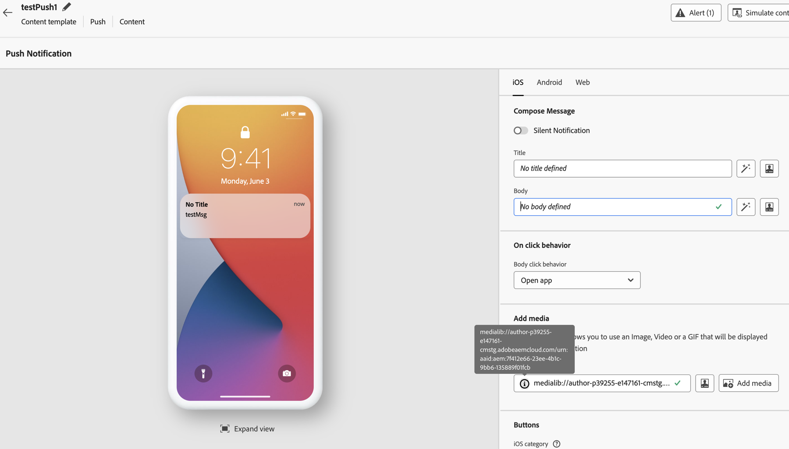

# リリースノート {#release-notes}

>[!CONTEXTUALHELP]
>id="ajo_homepage_card1"
>title="新機能"
>abstract="**Adobe Journey Optimizer** は、新機能、既存機能の強化およびバグ修正を継続的に提供します。 これらのリリースノートでは、すべての変更が各月の最終週にまとめられます。"

[!DNL Adobe Journey Optimizer] は継続的配信モデルに従って、アドビが新機能、機能強化、修正を継続的に提供できるようにします。 このアプローチにより、スケーラブルで段階的な機能のロールアウトが可能になり、すべての環境をまたいでパフォーマンスと安定性を確保できます。 このモデルにより、リリースノートは毎月のリリースの間に更新されます。 リリースサイクルと可用性フェーズについて詳しくは、[Journey Optimizer リリースサイクル](releases.md)を参照してください。

[!DNL Adobe Journey Optimizer] が [!DNL Adobe Experience Platform] でネイティブに構築され、最新のイノベーションや改善点を引き継いでいます。 以下の変更点について詳しくは、[Adobe Experience Platform リリースノート](https://experienceleague.adobe.com/docs/experience-platform/release-notes/latest.html?lang=ja){target="_blank"}を参照してください。

>[!NOTE]
>
>これらのリリースノートに記載されている機能には、各変更がいつ環境でアクセスできるようになったかを示す&#x200B;**利用可能日**&#x200B;が含まれています。 **近日公開の** アコーディオンのエントリは、今後数日または数週間で予定されています。 これらのセクションの情報は変更される場合があります。

## 26年6月の更新 {#june-26-updates}

<table>
<thead>
<tr>
<th><strong>ダイレクトメールチャネルでの意思決定のサポート</strong> </th>
</tr>
</thead>
<tbody>
<tr>
<td>

決定ポリシーをダイレクトメールジャーニーおよびキャンペーンに追加できるようになりました。 決定ポリシーは、決定エンジンを活用して、各オーディエンスメンバーに最適なコンテンツを動的に返すオファーのコンテナです。 ダイレクトメール決定は、バッチ決定のユースケースもサポートしており、特定のAdobe Experience Platform オーディエンス内の各プロファイルに対応するオファー項目を書き出すことができます。

詳しくは、<a href="../experience-decisioning/use-decision-policy.md">詳細ドキュメント</a>を参照してください。

ご利用いただけます：2026年6月3日（PT）

</td>
</tr>
</tbody>
</table>

<table>
<thead>
<tr>
<th><strong>ジャーニー表現のためのAI アシスタント（パブリックBeta）</strong> </th>
</tr>
</thead>
<tbody>
<tr>
<td>

AI アシスタントがジャーニーの高度な式エディターで動作し、自然言語プロンプトを有効な式や条件付きロジックに変換できるようになりました。 構築したい式を記述すると、AI アシスタントがすぐに適用できる使いやすいコードを生成したり、フォローアッププロンプトで微調整したりできます。

この機能は、パブリック Betaとしてすべてのお客様が利用できます。

詳しくは、<a href="../building-journeys/expression/expression-agent.md">詳細ドキュメント</a>を参照してください。

ご利用いただけます：2026年6月3日（PT）
 
</td>
</tr>
</tbody>
</table>

* **非繰り返しの読み取りオーディエンスジャーニー**&#x200B;の自動完了 – 繰り返しの&#x200B;**読み取りオーディエンス** ジャーニーが、最後にアクティブなプロファイルが終了すると、自動的に&#x200B;**停止** ステータスに移行するようになりました。 以前は、これらのジャーニーは、プロファイルがフローしなくなった場合でも、91日間のグローバルタイムアウトが期限切れになるまで&#x200B;**ライブ**&#x200B;のままでした。 この改善により、ジャーニーのステータスは、完了するとすぐに実際の実行ステータスを反映するようになり、手作業なしでジャーニーインベントリを正確に保つことができます。

  この動作は、待機期間を引き起こすノード（待機ノード、リアクションノード、イベントトリガーのトランジションなど）を含むジャーニーには適用されません。 これらのジャーニーは、標準の91日間のグローバルタイムアウトの対象のままです。 [詳細情報](../building-journeys/end-journey.md#auto-stop-non-recurring)

* **カスタムアクションでの証明書ベースのカスタム認証** - カスタムアクションで、証明書ベースのカスタム認証がサポートされるようになりました。 カスタム認証設定に`subType: "certificateCredential"`を追加することで、Journey OptimizerはAdobeのマネージド証明書を使用してJWT クライアントアサーションに署名し、アクセストークンと交換します。クライアントシークレットは必要ありません。 Azure Entra IDなど、証明書ベースのID確認を強制するエンタープライズ API向けに設計されています。 [詳細情報](../datasource/external-data-sources.md#certificate-credential)

  ご利用いただけます：2026年6月4日（PT）

## 26年5月のリリースノート {#may-26-rn}

### ジャーニー {#may-26-journeys}

このリリースでは、ジャーニーに次の機能と機能強化が追加されました。 今後数日または数週間で追加の変更が予定されています。

<table>
<thead>
<tr>
<th><strong>ジャーニーフラグメント（限定提供）</strong> </th>
</tr>
</thead>
<tbody>
<tr>
<td>

Adobe Journey Optimizerで<strong>ジャーニーフラグメント </strong>を作成できるようになりました。 ジャーニーフラグメントは、再利用可能なジャーニーノードのセットです。一度構築すれば、サンドボックスをまたいであらゆるジャーニーにドロップできます。 実施要件チェック、好みのチャネルルーティングロジック、ウェルカムシーケンスなど、フラグメントは、毎回同じロジックをゼロから再構築することなく、より迅速に行動し、一貫性を維持するのに役立ちます。

フラグメントを作成すると、専用の<strong> フラグメントインベントリ </strong>に保存され、<strong>ジャーニーフラグメント </strong> アクティビティを使用して、任意のジャーニーに挿入できます。

<!--

-->

この機能は、一連の組織でのみ使用できます（限定提供）。 アクセスするには、アドビ担当者にお問い合わせください。

詳しくは、 <a href="../building-journeys/journey-fragments.md">詳細なドキュメント</a>を参照してください。

ご利用いただけます：2026年5月13日（PT）

</td>
</tr>
</tbody>
</table>

<table>
<thead>
<tr>
<th><strong>ジャーニーシミュレーション（限定提供）</strong> </th>
</tr>
</thead>
<tbody>
<tr>
<td>

これで、ジャーニーを<strong>シミュレーション</strong>に設定できます。 このモードを使用すると、<strong>シミュレートされたユーザー</strong>を使用してロジックを検証できます。 これらはシミュレーション専用に作成された一時的なプロファイルで、Adobe Experience Platform で永続的なテストプロファイルを管理することなく、自由にテストできます。

この機能は現在、基本機能を備えた限定提供として、すべてのお客様にご利用いただけます。

詳しくは、<a href="../building-journeys/simulate-journey.md">詳細ドキュメント</a>を参照してください。

ご利用いただけます：2026年5月5日（PT）

</td>
</tr>
</tbody>
</table>

+++ 近日リリース予定 – **以下の情報は変更される可能性があります。**

今後数日または数週間で、次のジャーニー機能が提供される予定です。

<!--
<table>
<thead>
<tr>
<th><strong>Journey path optimization – Targeting (General Availability)</strong> </th>
</tr>
</thead>
<tbody>
<tr>
<td>

Use the new <strong>Optimize</strong> node to target specific audiences to determine the best path to meet your business-centric KPIs.

This tool allows you to develop more effective marketing campaigns that are more likely to resonate at the 1:1 level, improve marketing personalization efforts for customers and enhance critical customer engagement KPIs, such as conversions and revenue.

Previously available in Limited Availability, this capability is now available to all environments.

Availability date: June 1, 2026

</td>
</tr>
</tbody>
</table>

<table>
<thead>
<tr>
<th><strong>Journey Arbitration – ranking formulas (General Availability)</strong> </th>
</tr>
</thead>
<tbody>
<tr>
<td>

You can now use formulas to automatically boost journey priority scores based on customer profile attributes and contextual factors, ensuring customers enter the most relevant journeys.

Previously available in Limited Availability, this capability is now available to all environments.

Availability date: June 1, 2026

</td>
</tr>
</tbody>
</table>
-->

<table>
<thead>
<tr>
<th><strong>ジャーニーシミュレーション（一般提供）</strong> </th>
</tr>
</thead>
<tbody>
<tr>
<td>

以前はLimited Availabilityでリリースされていたジャーニーシミュレーションが、すべての環境で使用できるようになりました。 この一般提供リリースでは、Journey Agentを使用して、シミュレーションユーザーとイベントをシミュレーションメニューで直接生成できるようになりました。

利用開始日：2026年6月上旬

</td>
</tr>
</tbody>
</table>

* **非繰り返しの読み取りオーディエンスジャーニー**&#x200B;の自動完了 – 繰り返しの&#x200B;**読み取りオーディエンス** ジャーニーが、最後にアクティブなプロファイルが終了すると、自動的に&#x200B;**停止** ステータスに移行するようになりました。 以前は、これらのジャーニーは、プロファイルがフローしなくなった場合でも、91日間のグローバルタイムアウトが期限切れになるまで&#x200B;**ライブ**&#x200B;のままでした。 この改善により、ジャーニーのステータスは、完了するとすぐに実際の実行ステータスを反映するようになり、手作業なしでジャーニーインベントリを正確に保つことができます。

  この動作は、待機期間を引き起こすノード（待機ノード、リアクションノード、イベントトリガーのトランジションなど）を含むジャーニーには適用されません。 これらのジャーニーは、標準の91日間のグローバルタイムアウトの対象のままです。

  利用開始日：2026年6月上旬

* **外部オーディエンスの補足識別子のサポート** - ジャーニーの補足識別子が、CSV ファイルから読み込まれたオーディエンスやFederated Audience Compositionで作成されたオーディエンスなど、外部オーディエンスでサポートされるようになりました。 オーディエンスからID以外の属性または個人ではないID属性を補足IDとして指定できます。スキーマのラベル付けは必要ありません。

  利用開始日：2026年6月上旬

+++

### オーケストレーションキャンペーン {#may-26-oc}

このリリースでは、オーケストレーションされたキャンペーンに次の機能と機能強化が追加されました。 今後数日または数週間で追加の変更が予定されています。

<table>
<thead>
<tr>
<th><strong>ジャーニー式のためのAI アシスタント</strong> </th>
</tr>
</thead>
<tbody>
<tr>
<td>

AI アシスタントがジャーニーの高度な式エディターで動作し、自然言語プロンプトを有効な式や条件付きロジックに変換できるようになりました。 構築したい式を記述すると、AI アシスタントがすぐに適用できる使いやすいコードを生成したり、フォローアッププロンプトで微調整したりできます。

この機能は、パブリック Betaとしてすべてのお客様が利用できます。

詳しくは、<a href="../building-journeys/expression/expression-agent.md">詳細ドキュメント</a>を参照してください。

ご利用いただけます：2026年5月20日（PT）

</td>
</tr>
</tbody>
</table>

<table>
<thead>
<tr>
<th><strong>キャンペーンを連携</strong> </th>
</tr>
</thead>
<tbody>
<tr>
<td>

オーケストレーションされたキャンペーンを、別のオーケストレーションされたキャンペーンの<strong>終了アクティビティ </strong>から直接、オーケストレーションされたキャンペーンをトリガーすることで、リンクできるようになりました。

これにより、複雑なオーケストレーションロジックを、毎回再構築するのではなく、複数の親キャンペーンから呼び出すことができる、小さく再利用可能なフローに分割することができます。 実行時に渡されたペイロードは、ダウンストリームキャンペーンでセグメント化とパーソナライゼーションに使用できるため、リンクされた各キャンペーンは、受信したコンテキストに基づいて動作できます。

詳しくは、<a href="../orchestrated/trigger-orchestrated-campaign.md#signal-end">詳細ドキュメント</a>を参照してください。

ご利用いただけます：2026年5月20日（PT）

</td>
</tr>
</tbody>
</table>

* **エンリッチメントアクティビティでリンクを追加** - オーケストレーションされたキャンペーンのエンリッチメントアクティビティで、「リンクを追加」機能を使用できるようになりました。 これにより、作業用テーブルデータと既存のデータベーステーブルとの間に直接関係を作成できます。

  ご利用いただけます：2026年5月20日（PT）

<!--
+++ Coming soon — **Information below is subject to change.**

The following orchestrated campaign capability is expected in the upcoming days or weeks.

<table>
<thead>
<tr>
<th><strong>File-based targeting for orchestrated campaigns (Limited Availability)</strong> </th>
</tr>
</thead>
<tbody>
<tr>
<td>

Orchestrated campaigns now support loading a CSV or TXT file directly into the campaign canvas as the targeting audience, without first ingesting the file into Adobe Experience Platform. The file data is consumed at execution time and is not persisted as an Adobe Experience Platform dataset. During file setup, you can define column mappings, data types, NULL handling, and per-column error policies. This supports ad-hoc sends or partner list campaigns where building a full ingestion pipeline is not practical.

This capability is only available for a set of organizations (Limited Availability). To gain access, contact your Adobe representative.

Availability date: June 1, 2026

</td>
</tr>
</tbody>
</table>

* **Loop-based personalization for relational data** - The personalization editor now supports a Loop block that iterates over relational collections, such as orders, accounts, or bookings, and renders one content block per record inside a single email or SMS. Collections are configured through the data picker using personalization tokens, with no expression writing required.

  Availability date: Early June, 2026

* **Personalize email sender details per recipient and campaign** - Orchestrated campaigns now support personalization of email header fields, including From name, From address, and Reply-To, using profile attributes or relational data. This allows sender details to reflect the relevant advisor, location, or branch for each recipient, rather than routing all sends through a single corporate address.

  Header values can be set at the channel level and overridden per campaign using contextual data for more precise control.

  Availability date: Early June, 2026

+++
-->

### キャンペーン {#may-26-campaigns}

* **キャンペーンライフサイクルイベントに関する顧客アラート** – 新しいシステムアラートにより、アクションおよびAPI トリガーキャンペーンの主要なライフサイクルイベントが通知されるようになりました。 サンドボックスレベルでの購入。 [詳細情報](../reports/alerts.md)

  ご利用いただけます：2026年6月1日（PT）

<!--
+++ Coming soon — **Information below is subject to change.**

* **Override the default execution field in campaigns** - Previously available at the journey level, you can now override the default execution field set globally for your Email, SMS and WhatsApp deliveries in the campaign parameters.

  Availability date: Early June, 2026

+++
-->

### 決定 {#may-26-decisioning}

このリリースでは、次の機能と機能強化がDecisioningに追加されました。 今後数日または数週間で追加の変更が予定されています。

<table>
<thead>
<tr>
<th><strong>決定ルールとランキング式AI最適化</strong> </th>
</tr>
</thead>
<tbody>
<tr>
<td>

[!DNL Adobe Journey Optimizer] aiを使用して、簡素化できる決定ルールとランキング式を検出できるようになりました。 インベントリでは、AIが最適化機会を特定したルールに赤いインジケーターが表示されます。 インジケーターをクリックすると、AIが提案したバージョンと一緒に元のエクスプレッションが表示されます。 そこから、ファイルをダウンロードして、シミュレートされたプロファイルが各バージョンでどのように評価されるかを確認し、それらが同じように動作することを確認してから、式を最適化された式に置き換えることができます。

詳しくは、 <a href="../start/ai-features.md#decisioning-optimization">詳細なドキュメント</a>を参照してください。

ご利用いただけます：2026年5月5日（PT）

</td>
</tr>
</tbody>
</table>

* **DecisioningのAdobe Experience Manager コンテンツフラグメント** - Adobe Experience Manager コンテンツフラグメントをDecisioningの決定項目にマッピングし、意思決定ポリシー内でそれらを活用して、適切なフラグメントを適切な顧客に的確なタイミングで配信できるようになりました。 [詳細情報](../integrations/aem-fragments.md#aem-decisioning)

  この機能は、一連の組織でのみ使用できます（限定提供）。 アクセス権を取得するには、アドビ担当者にお問い合わせください。

  ご利用いただけます：2026年5月20日（PT）

* **キャンペーン概要**&#x200B;の決定ポリシーの詳細 – キャンペーン概要ページから、キャンペーンを複製または編集することなく、各決定ポリシー（選択戦略、決定項目、フォールバックオファーなど）の完全な構造を確認できるようになりました。 また、JSON サマリーをクリップボードにコピーして、Adobe サポートまたはエンジニアリングチームのトラブルシューティングを行うこともできます。 [詳細情報](../experience-decisioning/use-decision-policy.md#decision-policy-summary)

  ご利用いただけます：2026年5月20日（PT）

* **移行ワークフローAPI** – 依存関係の分析と移行ワークフローを作成するためのAPI コントラクトが更新されました。リクエスト URL （`sandbox`、`offer`または`decision`）に&#x200B;**`request-level`**&#x200B;を&#x200B;**クエリパラメーター**&#x200B;として渡します。 リクエストレベルをJSON本文で送信する必要はありません。 [詳細情報](../experience-decisioning/decisioning-migration-api.md)

  ご利用いただけます：2026年5月6日（PT）

### メールチャネル {#may-26-email}

このリリースでは、メールチャネルに次の機能と機能強化が追加されました。 今後数日または数週間で追加の変更が予定されています。

<table>
<thead>
<tr>
<th><strong>メールDesignerのディープリンク</strong> </th>
</tr>
</thead>
<tbody>
<tr>
<td>

メールDesignerの専用オプションを使用して、メールコンテンツにディープリンクを追加できるようになりました。 これにより、ユーザーはブラウザーやアプリストアにリダイレクトされずに、アプリ内の適切なコンテンツに直接アクセスでき、コンテキストとエンゲージメントが維持されます。

ディープリンクオプションはすべてのお客様が利用できますが、ディープリンクは、必要な設定とモバイルアプリの実装手順を完了した場合にのみ機能します。

詳しくは、<a href="../email/deeplinks.md">詳細ドキュメント</a>を参照してください。

ご利用いただけます：2026年5月12日（PT）

</td>
</tr>
</tbody>
</table>

* **フラグメントの継承の改ざんを制限** - フラグメントを作成または編集する際に、メールで使用するときに変更できるかどうかを選択できるようになりました。 フラグメントをロックすることで、ファイルが表示されるあらゆる場所で同期を維持し、ブランド基準やコンプライアンス要件に違反する可能性のあるローカル編集を防ぐことができます。 この設定は後で更新でき、今後の使用に適用されます。 [詳細情報](../content-management/create-fragments.md#lock-visual-fragment)

  ご利用いただけます：2026年5月21日（PT）

### モバイルメッセージ（SMS、MMS、RCS） {#may-26-mobile}

このリリースでは、次の機能と機能強化がモバイルメッセージに追加されました。

<table>
<thead>
<tr>
<th><strong>新しいモバイルメッセージチャネルと強化されたRCS メッセージ</strong> </th>
</tr>
</thead>
<tbody>
<tr>
<td>

SMS、MMS、およびRCSは、Adobe Journey Optimizerで1つの<strong> モバイルメッセージ </strong> アクションに統合されるようになりました。これにより、1か所からすべてのモバイルメッセージタイプを簡単に管理できるようになりました。 このアップデートの一環として、新しいネイティブオーサリングエクスペリエンスを通じて、画像、カルーセル、推奨アクションなどのリッチメディア RCS メッセージをJourney Optimizerで直接作成できるようになりました。

詳しくは、 <a href="../mobile/get-started-mobile.md">詳細なドキュメント</a>を参照してください。

ご利用いただけます：2026年5月20日（PT）

</td>
</tr>
</tbody>
</table>

* **文字カウント** - Adobe Journey Optimizer では、文字カウントを使用して SMS メッセージの長さをリアルタイムで監視できるようになりました。 メッセージが複数のセグメントに分割されるタイミングを確認できるので、書式設定をより適切に管理し、送信コストの予期しない増加を回避できます。 [詳細情報](../mobile/create-mobile-message.md)

* **カスタムデータセットに対する SMS インバウンド** - **SMS API 資格情報**&#x200B;で、デフォルトのトラッキングデータセットだけでなく、選択した&#x200B;**カスタムのプロファイル対応エクスペリエンスイベントデータセット**&#x200B;に&#x200B;**インバウンド SMS** をルーティングします。 [詳細情報](../mobile/mobile-webhook.md)

* **Webhook インターフェイスの機能強化** - SMS webhook を設定する際に、ユーザーインターフェイスに実用的な例を含む組み込みの設定ガイドが含まれるようになりました。これにより、設定フローを離れることなく、プロバイダーのペイロードを調整し、問題のトラブルシューティングを行うことが簡単になります。 [詳細情報](../mobile/mobile-webhook.md)

* **SMS コンテンツのディープリンク** - URL ヘルパー関数を使用して、SMS コンテンツにディープリンクを追加できるようになりました。 これにより、必要な設定とモバイルアプリの実装手順を完了した場合に、web ブラウザーやアプリストアを介して受信者をルーティングすることなく、受信者が意図したアプリ内コンテンツに直接移動できるようになります。 [詳細情報](../email/deeplinks.md)

### WhatsApp チャネル {#may-26-whatsapp}

このリリースでは、WhatsApp チャネルに次の機能強化が追加されました。

* **WhatsApp ボタンのサポートとトラッキング** - WhatsApp テンプレートは&#x200B;**クイック返信**、**Call to action - URL**、**Call to action - phone**、**コピーコード**&#x200B;をサポートしていません。 Journey Optimizerは、サポートされているボタンを送信し、インタラクションを他のチャネルレポートと並行して追跡します。

* **WhatsApp チャネルコンテキストデータ** - Journey Optimizerは、WhatsApp チャネルから返された追加のインタラクションデータを取得し、`whatsAppChannelContext` フィールドグループの&#x200B;**AJO EmailTrackingExperienceEvent データセット**&#x200B;に保存するようになりました。

  +++ 次のフィールドがキャプチャされ、オーディエンスの構築やWhatsApp エンゲージメントの分析に使用できます

   * **`messageType`** - WhatsApp メッセージの種類（例：`templateBased`、`response`）
   * **`inboundMessage`** - インバウンド返信コンテンツ （例：`stop`、`start`、`subscribe`）
   * **`inboundNumber`** – 受信メッセージを受信した送信者ID
   * **`channelType`** - チャネルカテゴリ （`Utility`、`Marketing`または`Promotional`）
   * **`profileNumber`** – 受信メッセージを受信した電話番号
   * **`origTimestamp`** - Meta / WhatsAppの元のタイムスタンプ
   * **`status`** – 標準化されたプロバイダーのフィードバック （`sent`、`delivered`、`bounce`、`error`、`delay`、`duplicate`、`denylist`、`exclude`または`unknown`）と生のプロバイダーのステータスメッセージを含む配信ステータス
   * **`reactionEvent`** - ユーザー応答のコンテンツ：反応の絵文字、または特定のメッセージへの返信のメッセージテキスト
   * **`reactionMessageID`** – 応答する元のメッセージのID
   * **`reactionActionName`** – 応答アクションの種類（`react`、`unreact`または`reply`）
   * **`interactiveSelectedTitle`** - WhatsApp インタラクティブメッセージからユーザーが選択したタイトル
   * **`interactiveType`** - インタラクティブ メッセージの種類（`list reply`、`button reply`、または`button`）
   * **`interactiveSelectedDescription`** – 選択したWhatsApp インタラクティブオプションの説明
   * **`interactiveSelectedID`** - WhatsAppから選択したオプションのID

  +++

### コンテンツと統合 {#may-26-content}

このリリースでは、コンテンツ管理と統合に次の機能と機能強化が追加されました。

<table>
<thead>
<tr>
<th><strong>Content Advisor Selector</strong> </th>
</tr>
</thead>
<tbody>
<tr>
<td>

Journey Optimizerでは、Experience Manager Assetsとコンテンツフラグメントの両方を選択するための統一モーダルである<strong>Content Advisor セレクター</strong>を使用するようになりました。 新しいセレクターには次のものが含まれます。

<ul>
<li><strong>すべてのアセットとフラグメントで</strong>を参照、検索、フィルタリングします。</li>
<li><strong>AI セマンティック検索</strong>：テキストの一致だけでなく、意味や内容に基づいてコンテキストに即したアセットを表示するために、「山の中のコーヒー」など、平易な言語で必要なものを記述します。 多言語クエリもサポートされています。</li>
<li><strong> ブリーフのアップロード </strong>: マーケティングブリーフをアップロードすると、コンテンツと要件にもとづいてキャンペーンコンテキストに沿ったアセットが自動的に表示されます。</li>
<li><strong>Dynamic Media レンディション </strong>：セレクターを離れることなく、ダイナミックアセットの画像レンディションを選択して適用します。</li>
</ul>

詳しくは、 <a href="../integrations/aem-content-advisor.md">詳細なドキュメント</a>を参照してください。

ご利用いただけます：2026年5月19日（PT）

</td>
</tr>
</tbody>
</table>

<table>
<thead>
<tr>
<th><strong>統合</strong> </th>
</tr>
</thead>
<tbody>
<tr>
<td>

<b>統合</b>機能を使用すると、サードパーティのデータソースを Adobe Journey Optimizer に直接接続できます。 この機能により、外部データと<b>構成可能なコンテンツ</b>の取り込み方法が簡素化され、あらゆるチャネルをまたいで、パーソナライズされた動的なメッセージを容易に配信できるようになります。

この機能は、以前はベータ版でリリースされていましたが、現在はすべての環境で使用できるようになりました（一般提供）。

詳しくは、<a href="../integrations/integrations.md">詳細なドキュメント</a>を参照してください。

ご利用いただけます：2026年5月4日（PT）

</td>
</tr>
</tbody>
</table>

* **Adobe Experience Managerセレクターでの組織間のリポジトリアクセス** - Assetsアセットセレクター内で、複数の組織のリポジトリから直接アセットをシームレスに選択できるようになりました。

### 管理 {#may-26-admin}

* **URL パラメーターの暗号化** - メールメッセージに追加されたトラッキングおよびランディングページのリンクで、URL パラメーターを暗号化できるようになりました。 これにより、機密性の高いパラメーターデータのセキュリティレイヤーが追加されます。 この機能は、以前は限定提供でリリースされていましたが、現在はすべての環境で使用できるようになりました（一般提供）。 [詳細情報](../personalization/url-parameter-encryption.md)

  ご利用いただけます：2026年6月1日（PT）

* **キーレジストリの新しい権限** - URL パラメーターの暗号化に必要なキーにアクセスして管理するには、2つの新しい権限が必要になりました：**キーレジストリの管理**&#x200B;と&#x200B;**キーレジストリの表示**。 [詳細情報](../administration/high-low-permissions.md#administration-permissions)

  ご利用いただけます：2026年6月1日（PT）

<!--
+++ Coming soon — **Information below is subject to change.**

* **Message Feedback Event Dataset moving to batch ingestion** - The `AJO Message Feedback Event Dataset` is transitioning from streaming to batch ingestion mode. This change ensures that data ingestion does not exceed streaming ingestion limits. If you use this dataset in Customer Journey Analytics reports or run queries against it, expect an increase in data latency of up to 2 hours going forward.

  Availability date: June 1, 2026

+++
-->

### ユーザビリティの向上 {#may-26-usability}

2026年5月には、以下のユーザビリティの改善もリリースされました。

#### Lists

* **バルクアクション** - **キャンペーン**、**フラグメント**、**テンプレート**&#x200B;のリストで複数のアイテムを一度に選択し、1つのアクションバーから一括操作を実行できるようになりました。これには、アイテムのパッケージへの追加、フォルダーへの移動、タグの編集、アクセスの管理、アーカイブまたは削除などが含まれます。 [詳細情報](../start/search-filter-categorize.md#bulk-actions)

  

* **並べ替えと列のサイズ変更** - **キャンペーン**、**フラグメント**、**テンプレート**&#x200B;のリストで、列ヘッダーをクリックして並べ替えがサポートされるようになりました。 キャンペーン フォルダー表示では、**[!UICONTROL 優先度]**&#x200B;および&#x200B;**[!UICONTROL チャネル設定]**&#x200B;による並べ替えとフィルタリングも使用できます。 **フラグメント**&#x200B;および&#x200B;**テンプレート** リストの列幅もサイズ変更可能です。最も関心のあるデータに合わせて、列の境界線をドラッグします。 [詳細情報](../start/search-filter-categorize.md#filter-lists)

#### コンテンツ作成

* **インラインプロファイル属性編集** - メールDesignerでのインラインプロファイル属性編集は、当初4月にリリースされました。 5月のリリースの一環として、この機能はAI アシスタントから切り離され、プッシュチャネルエディターに拡張されました。 [詳細情報](../personalization/personalize.md#inline-personalization)

  

* **プッシュチャネルエディターのリンク URL ツールチップ** – 任意のリンクまたはメディアフィールドのURLが長すぎて表示できない場合、ツールチップアイコンがフィールドの横に常に表示されます。URL全体を表示するには、そのフィールドにカーソルを合わせてください。 [詳細情報](../push/design-push.md#on-click-behavior)

  

<!--
#### Simulation & Preview

* **Redesigned preview experience** - The content preview screen has been redesigned with a side-by-side layout that lets you compare how your content renders across multiple profiles at a glance, enabling quicker and more confident reviews before sending. [Learn more](../test-approve/simulate-sample-input.md#preview)

  
-->

+++ 近日リリース予定 – **以下の情報は変更される可能性があります。**

* ジャーニーとキャンペーンの&#x200B;**フォルダー** - ジャーニーとキャンペーンをフォルダーに整理して、インターフェイスのナビゲーションと管理を改善できるようになりました。

  利用開始日：2026年6月上旬

+++
