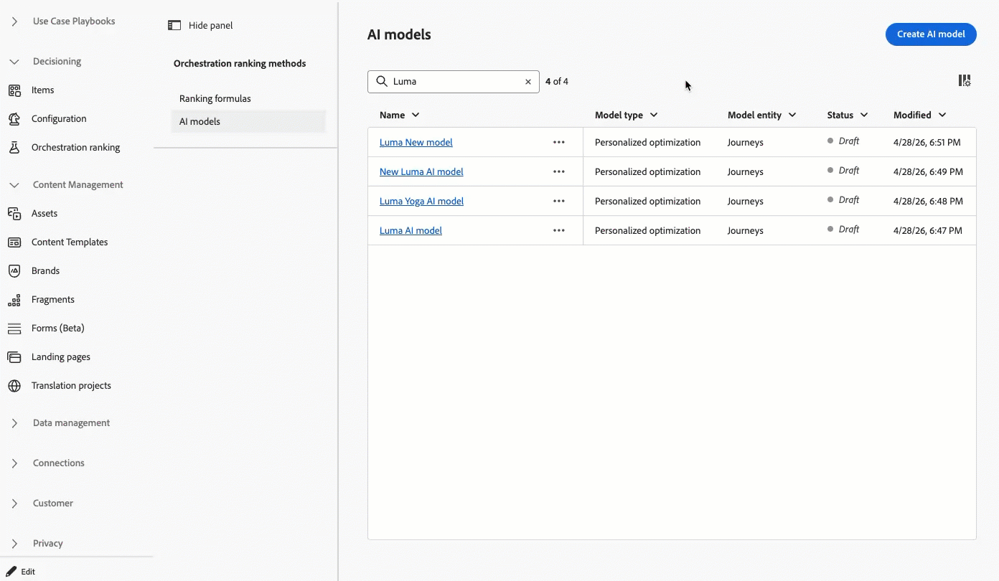
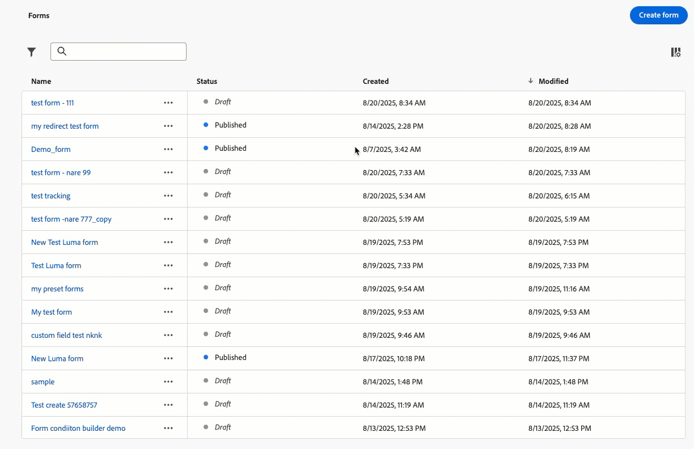

# リリースノート {#release-notes}

>[!CONTEXTUALHELP]
>id="ajo_homepage_card1"
>title="新機能"
>abstract="**Adobe Journey Optimizer**&#x200B;は、新機能、既存の機能の強化、バグ修正を継続的に提供します。 これらのリリースノートでは、すべての変更が各月の最終週にまとめられます。"

[!DNL Adobe Journey Optimizer]は継続的な配信モデルに従い、Adobeが継続的に新しい機能、機能強化、および修正を提供できるようにします。 このアプローチにより、スケーラブルで段階的な機能のロールアウトが可能になり、すべての環境をまたいでパフォーマンスと安定性を確保できます。

このモデルにより、リリースノートは毎月のリリースの間に更新されます。 リリースサイクルと可用性フェーズについて詳しくは、[Journey Optimizer リリースサイクル](releases.md)を参照してください。

[!DNL Adobe Journey Optimizer] が [!DNL Adobe Experience Platform] でネイティブに構築され、最新のイノベーションや改善点を引き継いでいます。 以下の変更点について詳しくは、[Adobe Experience Platform リリースノート](https://experienceleague.adobe.com/docs/experience-platform/release-notes/latest.html?lang=ja){target="_blank"}を参照してください。

## 26年4月のリリースノート {#april-26-rn}

<!--
**The pre-release notes below are subject to change without prior notice until the release availability date**. Links, screens and updated documentation are published in the release notes, at the release date.

See also [Adobe Experience Platform Pre-release notes](https://experienceleague.adobe.com/ja/docs/experience-platform/release-notes/pre-release-notes){target="_blank"}.
-->

4月初旬にリリースされた新機能と機能強化は、リリース日とともに発表されます。

**リリース日**: 2026年4月28日～29日

### 新機能 {#april-26-features}

<!--
<table>
<thead>
<tr>
<th><strong>Folders for journeys and campaigns</strong> </th>
</tr>
</thead>
<tbody>
<tr>
<td>

You can now organize your journeys and campaigns into <strong>folders</strong> to improve navigation and management in the interface.

This capability is only available for a set of organizations (Limited Availability). To gain access, contact your Adobe representative.

</td>
</tr>
</tbody>
</table>
-->

<table>
<thead>
<tr>
<th><strong>MCPを介したJourney Optimizer AI Agentの統合</strong> </th>
</tr>
</thead>
<tbody>
<tr>
<td>

Adobe Journey Optimizerは、キャンペーン、ロイヤルティ、チャネル設定、サンドボックス操作を直接MCP互換アプリケーション内に表示する<strong>MCP （Model Context Protocol）サーバー</strong>を提供するようになりました。 この統合により、様々なペルソナが同じオーケストレーションデータを使用して共同作業を行うことができます。 Adobe Journey Optimizer REST APIに対してクエリを作成したり、複数のUI画面を移動したりする代わりに、会話形式でインテントを説明し、LLMが適切なMCP ツールを呼び出すように設定できます。 この機能は現在、Claude Webとデスクトップで利用できます。

この機能は、パブリック Betaのすべてのユーザーが利用できます。

詳しくは、 <a href="../integrations/ajo-mcp.md">詳細なドキュメント</a>を参照してください。

</td>
</tr>
</tbody>
</table>

<table>
<thead>
<tr>
<th><strong>ジャーニー仲裁 – AI モデル</strong> </th>
</tr>
</thead>
<tbody>
<tr>
<td>

ランキング式で<strong>AI モデル </strong>を使用して、顧客プロファイル属性と文脈要因に基づいてジャーニーの優先度スコアを自動的に高め、顧客が最も関連性の高いジャーニーに確実にエントリできるようにしました。

この機能は、一連の組織でのみ使用できます（限定提供）。 アクセスするには、アドビ担当者にお問い合わせください。

詳しくは、<a href="../conflict-prioritization/journey-ai-models.md">詳細なドキュメント</a>を参照してください。

</td>
</tr>
</tbody>
</table>

<table>
<thead>
<tr>
<th><strong>Adobe Express の統合</strong> </th>
</tr>
</thead>
<tbody>
<tr>
<td>

Adobe Journey Optimizerの<b>Adobe Express統合</b>では、コンテンツ作成時にAdobe Expressの編集ツールを直接使用でき、背景のサイズ変更、削除、切り抜き、アセットのJPEGまたはPNGへの変換が可能になります。

この機能は、以前は限定提供でリリースされていましたが、現在はすべての環境で使用できるようになりました（一般提供）。

詳しくは、<a href="../integrations/express.md">詳細なドキュメント</a>を参照してください。

ご利用いただけます：2026年4月23日（PT）

</td>
</tr>
</tbody>
</table>

<table>
<thead>
<tr>
<th><strong>AIを活用した受信トレイへの電子メールの最適化</strong> </th>
</tr>
</thead>
<tbody>
<tr>
<td>

Adobe Journey Optimizerでは、GmailのApple IntelligenceやGoogle GeminiなどのAIを活用した受信トレイに合わせて電子メールを最適に構造化する、新しい機能が追加されました。

AI アシスタントが受信者の電子メールの読み取りや行動をますます制御するようになるなか、この機能を利用することで、要約、トリアージ、優先順位付け、インテント抽出など、さまざまなAI タスクにおいて優れたパフォーマンスを発揮するコンテンツを生成およびオーサリングできるようになります。

詳しくは、<a href="../email/llm-email-optimizer.md">AI インボックス用メールの最適化</a>を参照してください。

ご利用いただけます：2026年4月17日（PT）

</td>
</tr>
</tbody>
</table>

<table>
<thead>
<tr>
<th><strong>PERSONALIZATION Expressions用AI アシスタント</strong> </th>
</tr>
</thead>
<tbody>
<tr>
<td>

[!DNL Adobe Journey Optimizer] 現在では、<strong>AI アシスタント </strong>がパーソナライゼーションエディターとメール Designerに直接含まれており、自然言語プロンプトを有効なパーソナライゼーション式と条件付きロジックに変換します。構文の専門知識は必要ありません。 達成したいパーソナライゼーションを記述すると、AIがすぐに適用できる使いやすいコードを生成したり、フォローアッププロンプトで改善したりできます。

アシスタントも逆に動作します。 既存の式を選択して、ロジックの説明、問題の特定、改善の提案を依頼します。 これにより、新しいエクスプレッションのオーサリングだけでなく、チーム全体で既存のエクスプレッションをレビューおよびデバッグするのに役立ちます。

詳しくは、<a href="../content-management/generative-personalization-expressions.md">Personalization エクスプレッション用AI アシスタント </a>を参照してください。

ご利用いただけます：2026年4月13日（PT）

</td>
</tr>
</tbody>
</table>

<table>
<thead>
<tr>
<th><strong>ジャーニーパスの検証</strong> </th>
</tr>
</thead>
<tbody>
<tr>
<td>

新しい<strong>最適化</strong> ノードを使用して、A/B テストまたはマルチアームドバンディット実験を実行し、ビジネス中心のKPIを満たすのに最適なパスを決定します。 このツールを使用すると、コミュニケーション、シーケンス、タイミングをテスト、調整、カスタマイズし、顧客に最も効果的にリーチできます。

この機能は、以前は限定提供でリリースされていましたが、現在はすべての環境で使用できるようになりました（一般提供）。

一般提供の一環として、このリリースでは、<strong>実験タイプ </strong>の選択（A/Bまたはマルチアームドバンディット）と<strong>単一ジャーニーの勝者</strong>の拡大が導入されています。

詳しくは、<a href="../building-journeys/path-experimentation.md">詳細なドキュメント</a>を参照してください。

ご利用いただけます：2026年4月7日（PT）

</td>
</tr>
</tbody>
</table>

<table>
<thead>
<tr>
<th><strong>インボックス</strong> </th>
</tr>
</thead>
<tbody>
<tr>
<td>

<strong>受信トレイ </strong>は、コンテンツカードで利用できるモバイル機能で、ユーザーがアプリまたはweb サイト内で一元的な場所を作成して、ユーザーに送信されるメッセージを表示できるようにします。 これにより、メッセージが却下された後もアクセスできるようになり、マーケティングコミュニケーションの有効期間を延長できます。

詳しくは、<a href="../inbox/inbox-gs.md">詳細なドキュメント</a>を参照してください。

ご利用いただけます：2026年4月7日（PT）

</td>
</tr>
</tbody>
</table>

<table>
<thead>
<tr>
<th><strong>メールチャネルにおける意思決定のサポート</strong> </th>
</tr>
</thead>
<tbody>
<tr>
<td>

<strong>Decisioning</strong>を使用して、メールメッセージのコンテンツをパーソナライズおよび最適化できるようになりました。 優先順位のスコア、数式、AI モデルを活用して、各受信者に最も関連性の高いオファーやコンテンツを表示します。

この機能は、以前は限定提供でリリースされていましたが、現在はすべての環境で使用できるようになりました（一般提供）。 この一般提供リリースでは、ミラーページがサポートされるようになりました。

詳しくは、<a href="../experience-decisioning/create-decision-policy.md">詳細なドキュメント</a>を参照してください。

ご利用いただけます：2026年4月6日（PT）

</td>
</tr>
</tbody>
</table>

### 機能強化 {#april-26-improv}

<!--
#### AI

* **Brand alignment score in Campaign dashboard** - You can now assess your brand alignment score directly within your Campaign dashboard to ensure content stays on-brand. This allows you to verify guidelines at a glance without having to open the content designer.

* **Prompt Assistant enhancement** - Prompt Assistant enhances AI content generation by analyzing user prompts in real time and identifying gaps in clarity, completeness, and context. It suggests improved rewrites and provides actionable guidance to enrich prompts with key details like audience, tone, and intent. The feature also asks targeted clarifying questions to help users refine their inputs before generation. This results in more accurate, high-quality outputs with fewer iterations. [Learn more](../content-management/ai-assistant-prompting-guide.md)
-->

#### 決定

* **決定項目にフラグメントを添付** - Journey Optimizerでは、決定項目にフラグメントを添付できるようになりました。この機能は、決定ポリシーを通じて、コードベースのエクスペリエンスおよびメールキャンペーンで活用できます。 この機能は、以前は限定提供でリリースされていましたが、現在はすべての環境で使用できるようになりました（一般提供）。 [詳細情報](../experience-decisioning/fragments-decision-policies.md)

* **一時的に利用できないフラグメントがスキップされる** – 決定項目でフラグメントを使用する場合、Edgeでフラグメントが一時的に利用できない場合、そのフラグメントはスキップされ、ジャーニーまたはキャンペーンは失敗する代わりにレンダリングを続行します。 [詳細情報](../experience-decisioning/fragments-decision-policies.md#temporary-unavailable-fragments)

  ご利用いただけます：2026年4月14日（PT）

<!--
#### SMS

* **Character Count** - In Adobe Journey Optimizer, you can now use the Character Count to monitor the length of your SMS messages in real time. It helps you see when a message will be split into multiple segments to better manage formatting and avoid unexpected increases in sending costs. [Read more](../sms/create-sms.md)

* **Opt-out and consent at phone number and sender** - For SMS, Journey Optimizer now records marketing consent and opt-out at the level of both the profile's phone number and short code. 

  This capability is currently only available for Sinch SMS configurations. [Read more](../sms/sms-configuration-sinch.md)

* **SMS inbounds to a custom dataset** - In **SMS API credentials**, route **inbound SMS** to a **custom, profile-enabled Experience Event dataset** you select instead of only the default tracking dataset. [Read more](../sms/sms-webhook.md)

* **Webhook interface enhancement** - When configuring SMS webhooks, the user interface now includes a built-in setup guide with practical examples, making it easier to align provider payloads and troubleshoot issues without leaving the configuration flow. [Read more](../sms/sms-webhook.md)

#### WhatsApp

* **WhatsApp interactive buttons and tracking** - WhatsApp in Journey Optimizer now supports interactive buttons required by your templates and use cases, along with built-in interaction tracking so you can measure engagement and analyze performance alongside your other channel reporting.
-->

#### Adobe Experience Managerとの連携

* **Adobe Experience Manager コンテンツフラグメントのバリエーションのサポート** - Adobe Experience Manager コンテンツフラグメントを挿入する際に、**コンテンツフラグメントのバリエーション** （言語やチャネルのバリエーションなど）を選択でき、ロケールや多言語シナリオの処理が改善されました。 [詳細情報](../integrations/aem-fragments.md#aem-variations)

  この機能は、一連の組織でのみ使用できます（限定提供）。 アクセスするには、アドビ担当者にお問い合わせください。

  ご利用いただけます：2026年4月3日（PT）

* **オーサリング中のAdobe Experience Manager コンテンツフラグメントのコンテキスト** - テキストフィールドとコンテンツブロック間を移動しても、コンテンツフラグメントの選択範囲はアクティブなままなので、**AEM コンテンツアドバイザー**&#x200B;を毎回開き直さずに、さらにフラグメントフィールドを追加できます。 [詳細情報](../integrations/aem-fragments.md)

  この機能は、一連の組織でのみ使用できます（限定提供）。 アクセスするには、アドビ担当者にお問い合わせください。

  ご利用いただけます：2026年4月1日（PT）

#### メールデザイン

* **電子メールコンテンツ用の高度なHTML エディター** – 高度なHTML モードを使用すると、電子メール DesignerでコンテンツのHTML ソースを編集したり、ソースに高度な式（条件など）を追加したり、変更内容を失うことなくHTML ビューとデスクトップビューを切り替えたりできます。

  以前はメールコンテンツテンプレートでのみ使用できましたが、この機能は、メールコンテンツテンプレートに加えて、メールDesignerの&#x200B;**メール** コンテンツ（ジャーニーやキャンペーンで作成されたメールなど）にデプロイされました。 現在、限定提供されています。アクセス権を取得するには、Adobe担当者にお問い合わせください。 [詳細情報](../email/email-expert-mode.md)

  ご利用いただけます：2026年4月9日（PT）

#### ジャーニーパスの最適化

* **実験タイプ** - パス実験を設定する際に、A/B実験（開始時に固定分割）またはマルチアームドバンディット（週単位の更新による自動分割）のいずれかを選択できるようになりました。 [詳細情報](../building-journeys/path-experimentation.md)

  ご利用いただけます：2026年4月7日（PT）

* **パス実験：勝者を拡大** – 実験の勝者パスを自動的または手動で完全なオーディエンスにロールアウトできるようになりました。 勝者を決定したら、実験を継続的に監視することなく、そのリーチと効果を増幅できます。 [詳細情報](../building-journeys/path-experimentation.md#scale-winner)

  この機能は、単一ジャーニー（イベントトリガーおよびオーディエンスの選定）でのみ使用できます。 オーディエンスの読み取りジャーニーには使用できません。

  ご利用いただけます：2026年4月7日（PT）

* **条件** - [最適化](../building-journeys/optimize.md) アクティビティは、ジャーニーで条件付きパスを作成するための新しい手段です。 UIから削除された以前の&#x200B;**条件** アクティビティに置き換わります。 すべての条件付きロジックは保持され、**最適化** アクティビティの条件を通じて処理されるようになりました。 [詳細情報](../building-journeys/conditions.md)

  この機能は、以前は限定提供でリリースされていましたが、現在はすべての環境で使用できるようになりました（一般提供）。

  ご利用いただけます：2026年4月7日（PT）

## 近日リリース予定 {#coming-soon}

次の機能と機能強化は、今後数日以内にリリースされる予定です。 **情報は変更される場合があります**。 更新したリンク、画面、ドキュメントは、これらの更新が実稼動環境で公開すると共有されます。

### 新機能 {#comming-soon-features}

<table>
<thead>
<tr>
<th><strong>サンドボックスをまたいで調整されたキャンペーンをコピー</strong> </th>
</tr>
</thead>
<tbody>
<tr>
<td>

サンドボックスツールが、オーケストレーションされたキャンペーンのパッケージ化と、あるサンドボックスから別のサンドボックスへのコピーをサポートするようになりました。 これにより、各環境で施策を手作業で再構築する必要がなくなります。 キャンペーンをパッケージ化すると、結合ポリシーやメッセージなどのキャンペーンの中核的な依存オブジェクトが自動的に含まれるため、インポートしたキャンペーンは設定と検証の準備ができたままになります。 本番環境を保護するために、インポートしたすべてのキャンペーンが、ターゲットサンドボックスのドラフトステータスに置かれ、キャンペーンが公開される前にレビューと承認のステップをチームに提供します。

<!--

-->
<!--
For more information, refer to the <a href="../integrations/express.md">detailed documentation</a>.
-->
</td>
</tr>
</tbody>
</table>

<table>
<thead>
<tr>
<th><strong>統合</strong> </th>
</tr>
</thead>
<tbody>
<tr>
<td>

<b>統合</b>機能を使用すると、サードパーティのデータソースをAdobe Journey Optimizerに直接接続できます。 この機能により、外部データと<b>構成可能なコンテンツ </b>の取り込み方法が簡素化され、あらゆるチャネルをまたいで、パーソナライズされた動的なメッセージを容易に配信できるようになります。

以前はベータ版でリリースされていましたが、この機能はすべての環境で使用できるようになりました（一般提供）。

</td>
</tr>
</tbody>
</table>

<table>
<thead>
<tr>
<th><strong>ジャーニーシミュレーション</strong> </th>
</tr>
</thead>
<tbody>
<tr>
<td>

これで、ジャーニーを<strong> シミュレーション </strong>に設定できます。 このモードを使用すると、<strong> シミュレートされたユーザー</strong>を使用してロジックを検証できます。 これらはシミュレーション専用に作成された一時的なプロファイルで、Adobe Experience Platformで永続的なテストプロファイルを管理することなく、自由にテストできます。

この機能は、必須の機能を備えた限定的な可用性としてすべてのお客様が利用できます。

<!--p></p-->
</td>
</tr>
</tbody>
</table>

<table>
<thead>
<tr>
<th><strong>オーケストレーションされたキャンペーンでの増分クエリアクティビティ</strong> </th>
</tr>
</thead>
<tbody>
<tr>
<td>

<strong> オーケストレーションされたキャンペーン </strong>は、前回の実行以降に新たに対象となったプロファイルまたはイベントのみをターゲットとする<strong>増分クエリ </strong> アクティビティをサポートするようになりました。

これにより、定期的なキャンペーンでは、新規オーディエンス（新規登録、新たに適格なロイヤルティメンバーなど）に重点を置きながら、クエリの作業負荷を軽減し、時間の経過に伴う冗長な送信を避けることができます。

</td>
</tr>
</tbody>
</table>

<table>
<thead>
<tr>
<th><strong>メールヘッダーの送信者パラメーター</strong> </th>
</tr>
</thead>
<tbody>
<tr>
<td>

Journey Optimizerを使用すると、送信者（送信者）とオーサリングエンティティ（送信者）が異なるメールを送信できるようになりました。 これをサポートするメールクライアントは、通常、「送信者の代理で送信者」としてレンダリングするか、「経由」インジケーターを表示します。 この機能を設定するには、メールチャネル設定のオプションの<strong>送信者ヘッダー</strong> フィールドに入力します。

この機能は、一連の組織でのみ使用できます（限定提供）。 アクセスするには、アドビ担当者にお問い合わせください。

<!--

-->

詳しくは、<a href="../email/header-parameters.md">詳細なドキュメント</a>を参照してください。

</td>
</tr>
</tbody>
</table>

<table>
<thead>
<tr>
<th><strong>電子メールチャネル設定のCC フィールド</strong> </th>
</tr>
</thead>
<tbody>
<tr>
<td>

メールチャネル設定でオプションのCC （カーボンコピー）フィールドを設定できるようになりました。 BCCとは異なり、CC受信者はプライマリ受信者に対して表示されるため、透明性のあるコミュニケーションと明確なオーナーシップが可能になります。

これにより、リレーションシップマネージャーやアカウントオーナーなど、各メッセージの適切な関係者を自動的にコピーすることができ、同時に顧客がフォローアップのために誰に連絡すべきかを確実に把握することができます。

CC フィールドはパーソナライゼーションをサポートしているので、単一の設定でプロファイルデータに基づいてコピーを動的にルーティングできるため、追加の設定なしで複数のユースケースに対応できます。

<!--

-->

詳しくは、<a href="../configuration/cc-email-field.md">詳細なドキュメント</a>を参照してください。

</td>
</tr>
</tbody>
</table>

<table>
<thead>
<tr>
<th><strong>電子メールDesignerのディープリンク</strong> </th>
</tr>
</thead>
<tbody>
<tr>
<td>

メールDesignerの専用オプションを使用して、メールコンテンツにディープリンクを追加できるようになりました。

これにより、ユーザーはブラウザーやアプリストアにリダイレクトされずに、適切なアプリ内コンテンツに直接移動され、コンテキストとエンゲージメントが維持されます。

<!--

-->

詳しくは、 <a href="../email/message-tracking.md">詳細なドキュメント</a>を参照してください。

</td>
</tr>
</tbody>
</table>

### 機能強化 {#comming-soon-improv}

#### プッシュ

* **チャネル設定でアプリ IDをパーソナライズ** - プッシュチャネル設定設定で、**アプリ ID** フィールドをパーソナライズして、各受信者がプロファイル情報に基づいて適切なブランドからプッシュ通知を受け取れるようにできるようになりました。 [詳細情報](../push/push-configuration.md)

#### 設定

* **URL パラメーター暗号化キーに対する特定の権限** - URL パラメーター暗号化キーにアクセスして管理するには、新しい権限が作成されました。 これで、**View Key Registry**&#x200B;および&#x200B;**Manage Key Registry**&#x200B;権限が付与されている必要があります。<!--[Read more](../personalization/url-parameter-encryption.md#create-keys)-->

#### オーケストレーションキャンペーン

* **Data Modelerの機能強化** - オーケストレーションされたリレーショナルスキーマが、複数のフィールドにまたがる複合キーをサポートするようになりました。 DDL ファイルからスキーマを読み込むと、列挙も行われ、DDLまたはExcel ファイルから読み込むと、テーブル間に複合関係が自動的に作成されます。 エンティティ関係ビューで、ファイルのアップロード後に、テーブル間のフィールドペアリングの完全なセットが複合リンクに表示されるようになりました。

* **オーケストレーションされたキャンペーンのグローバル変数** - オーケストレーションされたキャンペーンは、ワークフロー内のすべてのアクティビティで一度定義して再利用できるグローバル変数をサポートするようになり、設定を簡素化し、動的な値、式、コンテンツのパーソナライゼーションで一貫性を確保します。
