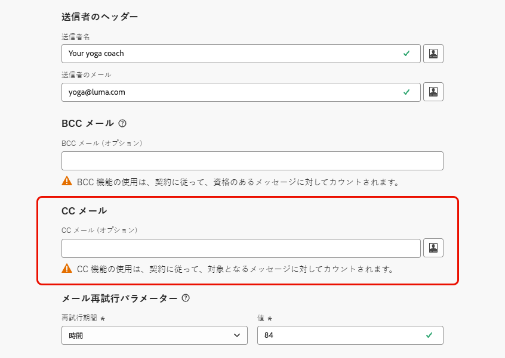

# リリースノート {#release-notes}

>[!CONTEXTUALHELP]
>id="ajo_homepage_card1"
>title="新機能"
>abstract="**Adobe Journey Optimizer** は、新機能、既存機能の強化およびバグ修正を継続的に提供します。 これらのリリースノートでは、すべての変更が各月の最終週にまとめられます。"

[!DNL Adobe Journey Optimizer] は継続的配信モデルに従って、アドビが新機能、機能強化、修正を継続的に提供できるようにします。 このアプローチにより、スケーラブルで段階的な機能のロールアウトが可能になり、すべての環境をまたいでパフォーマンスと安定性を確保できます。

このモデルにより、リリースノートは毎月のリリースの間に更新されます。 リリースサイクルと可用性フェーズについて詳しくは、[Journey Optimizer リリースサイクル](releases.md)を参照してください。

[!DNL Adobe Journey Optimizer] が [!DNL Adobe Experience Platform] でネイティブに構築され、最新のイノベーションや改善点を引き継いでいます。 以下の変更点について詳しくは、[Adobe Experience Platform リリースノート](https://experienceleague.adobe.com/docs/experience-platform/release-notes/latest.html?lang=ja){target="_blank"}を参照してください。

>[!NOTE]
>
>近日公開される予定の？ 今後の機能が正式にリリースされる前に、[ プレリリースノート ](e-release-notes.md)を参照してください。

## 26年5月の更新 {#may-26-rn}

2026年5月にリリースされた機能と改善点は次のとおりです。

<table>
<thead>
<tr>
<th><strong>ジャーニーフラグ</strong> </th>
</tr>
</thead>
<tbody>
<tr>
<td>

Adobe Journey Optimizerで<strong>ジャーニーフラグメント </strong>を作成できるようになりました。 ジャーニーフラグメントは、再利用可能なジャーニーノードのセットです。一度構築すれば、サンドボックスをまたいであらゆるジャーニーにドロップできます。 実施要件のチェック、好みのチャネルルーティングロジック、ウェルカムシーケンスなど、フラグメントは、同じロジックを毎回ゼロから再構築することなく、より迅速に作業し、一貫性を維持するのに役立ちます。

フラグメントを作成すると、専用の<strong> フラグメントインベントリ </strong>に保存され、<strong>ジャーニーフラグメント </strong> アクティビティを使用して、任意のジャーニーに挿入できます。

<!--

-->

この機能は、一連の組織でのみ使用できます（限定提供）。 アクセス権を取得するには、アドビ担当者にお問い合わせください。

詳しくは、 <a href="../building-journeys/journey-fragments.md">詳細なドキュメント</a>を参照してください。

ご利用いただけます：2026年5月13日（PT）

</td>
</tr>
</tbody>
</table>

<table>
<thead>
<tr>
<th><strong>E メールデザイナーのディープリンク</strong> </th>
</tr>
</thead>
<tbody>
<tr>
<td>

E メールデザイナーの専用オプションを使用して、メールコンテンツにディープリンクを追加できるようになりました。

これにより、ユーザーはブラウザーやアプリストアにリダイレクトされずに、アプリ内の適切なコンテンツに直接アクセスでき、コンテキストとエンゲージメントが維持されます。

詳しくは、 <a href="../email/deeplinks.md">詳細なドキュメント</a>を参照してください。

ご利用いただけます：2026年5月12日（PT）

</td>
</tr>
</tbody>
</table>

<table>
<thead>
<tr>
<th><strong>ジャーニーシミュレーション</strong> </th>
</tr>
</thead>
<tbody>
<tr>
<td>

これで、ジャーニーを<strong>シミュレーション</strong>に設定できます。 このモードを使用すると、<strong>シミュレートされたユーザー</strong>を使用してロジックを検証できます。 これらはシミュレーション専用に作成された一時的なプロファイルで、Adobe Experience Platform で永続的なテストプロファイルを管理することなく、自由にテストできます。

この機能は現在、基本機能を備えた限定提供として、すべてのお客様にご利用いただけます。

詳しくは、 <a href="../building-journeys/simulate-journey.md">詳細なドキュメント</a>を参照してください。

ご利用いただけます：2026年5月5日（PT）

</td>
</tr>
</tbody>
</table>

<table>
<thead>
<tr>
<th><strong>決定ルールとランキング式AI最適化</strong> </th>
</tr>
</thead>
<tbody>
<tr>
<td>

[!DNL Adobe Journey Optimizer] aiを使用して、簡素化できる決定ルールとランキング式を検出できるようになりました。 インベントリでは、AIが最適化機会を特定したルールに赤いインジケーターが表示されます。 インジケーターをクリックすると、AIが提案したバージョンと一緒に元のエクスプレッションが表示されます。 そこから、ファイルをダウンロードして、シミュレートされたプロファイルが各バージョンでどのように評価されるかを確認し、それらが同じように動作することを確認してから、式を最適化された式に置き換えることができます。

詳しくは、 <a href="../start/ai-features.md#decisioning-optimization">詳細なドキュメント</a>を参照してください。

ご利用いただけます：2026年5月5日（PT）

</td>
</tr>
</tbody>
</table>

<table>
<thead>
<tr>
<th><strong>統合</strong> </th>
</tr>
</thead>
<tbody>
<tr>
<td>

<b>統合</b>機能を使用すると、サードパーティのデータソースを Adobe Journey Optimizer に直接接続できます。 この機能により、外部データと<b>構成可能なコンテンツ</b>の取り込み方法が簡素化され、あらゆるチャネルをまたいで、パーソナライズされた動的なメッセージを容易に配信できるようになります。

この機能は、以前はベータ版でリリースされていましたが、現在はすべての環境で使用できるようになりました（一般提供）。

詳しくは、<a href="../integrations/integrations.md">詳細なドキュメント</a>を参照してください。

ご利用いただけます：2026年5月4日（PT）

</td>
</tr>
</tbody>
</table>

### 機能強化 {#may-26-improv}

2026年5月には以下の改善もリリースされました。

#### 決定

* **移行ワークフローAPI** – 依存関係の分析と移行ワークフローを作成するためのAPI コントラクトが更新されました。リクエスト URL （`sandbox`、`offer`または`decision`）に&#x200B;**`request-level`**&#x200B;を&#x200B;**クエリパラメーター**&#x200B;として渡します。 リクエストレベルをJSON本文で送信する必要はありません。 [詳細情報](../experience-decisioning/decisioning-migration-api.md)

  ご利用いただけます：2026年5月6日（PT）

#### SMS

<!--
* **Opt-out and consent at phone number and sender** - For SMS, Journey Optimizer now records marketing consent and opt-out at the level of both the profile's phone number and short code. 

  This capability is currently only available for Sinch SMS configurations. [Read more](../sms/sms-configuration-sinch.md)
-->

* **文字カウント** - Adobe Journey Optimizer では、文字カウントを使用して SMS メッセージの長さをリアルタイムで監視できるようになりました。 メッセージが複数のセグメントに分割されるタイミングを確認できるので、書式設定をより適切に管理し、送信コストの予期しない増加を回避できます。 [詳細情報](../sms/create-sms.md)

* **カスタムデータセットに対する SMS インバウンド** - **SMS API 資格情報**&#x200B;で、デフォルトのトラッキングデータセットだけでなく、選択した&#x200B;**カスタムのプロファイル対応エクスペリエンスイベントデータセット**&#x200B;に&#x200B;**インバウンド SMS** をルーティングします。 [詳細情報](../sms/sms-webhook.md)

* **Webhook インターフェイスの機能強化** - SMS webhook を設定する際に、ユーザーインターフェイスに実用的な例を含む組み込みの設定ガイドが含まれるようになりました。これにより、設定フローを離れることなく、プロバイダーのペイロードを調整し、問題のトラブルシューティングを行うことが簡単になります。 [詳細情報](../sms/sms-webhook.md)

#### WhatsApp

* **WhatsApp ボタンのサポートとトラッキング** - WhatsApp テンプレートは&#x200B;**クイック返信**、**Call to action - URL**、**Call to action - phone**、**コピーコード**&#x200B;をサポートしていません。 Journey Optimizerは、サポートされているボタンを送信し、インタラクションを他のチャネルレポートと並行して追跡します。

<!-- 
## Coming soon {#coming-soon}

The following capabilities and enhancements are scheduled for release in the next few days. **Information is subject to change**. Updated links, screens, and documentation will be shared once these updates are live in production.

### New capabilities {#comming-soon-features}
-->

## 26年4月のリリースノート {#april-26-rn}

**リリース日**：2026年4月28〜29日（PT）

### 新機能 {#april-26-features}

2026年4月にリリースされた機能は次のとおりです。

<table>
<thead>
<tr>
<th><strong>オーケストレーションキャンペーンでの増分クエリアクティビティ</strong> </th>
</tr>
</thead>
<tbody>
<tr>
<td>

<strong>オーケストレーションキャンペーン</strong>では、前回の実行以降に新しく実施要件を満たすプロファイルまたはイベントのみをターゲットにする<strong>増分クエリ</strong>アクティビティがサポートされるようになりました。

これにより、クエリのワークロードを軽減し、時間の経過と共に重複した送信を回避する一方で、繰り返しキャンペーンは新規オーディエンス（新規登録者、新たに選定されたロイヤルティメンバー、類似のセグメント）に焦点を当てることができます。

詳しくは、<a href="../orchestrated/activities/incremental-query.md#incremental-query-configuration">詳細なドキュメント</a>を参照してください。

ご利用いただけます：2026年4月30日（PT）

</td>
</tr>
</tbody>
</table>

<table>
<thead>
<tr>
<th><strong>メールヘッダーの送信者パラメーター</strong> </th>
</tr>
</thead>
<tbody>
<tr>
<td>

Journey Optimizer では、送信者（Sender）と作成者（From）が異なるメールを送信できるようになりました。 これに対応しているメールクライアントでは、通常、「Sender が From に代わって送信」としてレンダリングするか、「経由」インジケーターが表示されます。 この機能を設定するには、メールチャネル設定のオプションの「<strong>送信者ヘッダー</strong>」フィールドに入力します。

詳しくは、 <a href="../email/header-parameters.md#sender-header">詳細なドキュメント</a>を参照してください。

</td>
</tr>
</tbody>
</table>

<table>
<thead>
<tr>
<th><strong>電子メールチャネル設定の CC フィールド</strong> </th>
</tr>
</thead>
<tbody>
<tr>
<td>

メールチャネル設定でオプションの CC（カーボンコピー）フィールドを設定できるようになりました。 BCC とは異なり、CC 受信者はプライマリ受信者にも表示されるため、透明性のあるコミュニケーションと明確な担当者の特定が可能になります。

これにより、リレーションシップマネージャーやアカウントオーナーなど、適切な関係者を各メッセージに自動的にコピーすることができ、同時に顧客がフォローアップのために誰に連絡すべきかを確実に把握することができます。

CC フィールドはパーソナライゼーションをサポートしているので、単一の設定でプロファイルデータに基づいてコピーを動的にルーティングでき、追加設定なしで複数のユースケースに対応できます。

詳しくは、 <a href="../configuration/cc-email-field.md">詳細なドキュメント</a>を参照してください。

</td>
</tr>
</tbody>
</table>

<table>
<thead>
<tr>
<th><strong>サンドボックスをまたいでオーケストレーションキャンペーンをコピー</strong> </th>
</tr>
</thead>
<tbody>
<tr>
<td>

サンドボックスツールは、オーケストレーションキャンペーンのあるサンドボックスから別のサンドボックスへのパッケージ化とコピーをサポートするようになりました。 これにより、各環境でキャンペーンを手動で再作成する必要がなくなります。 キャンペーンをパッケージ化すると、結合ポリシーやメッセージなどのコアとなる依存オブジェクトが自動的に含まれるので、インポートされたキャンペーンは設定と検証の準備が整った状態で到達します。 本番環境を保護するために、インポートされたすべてのキャンペーンはターゲットサンドボックス内でドラフトステータスとなり、チームはキャンペーンが公開される前にレビューと承認のステップを行うことができます。

詳しくは、 <a href="../configuration/copy-objects-to-sandbox.md">詳細なドキュメント</a>を参照してください。

</td>
</tr>
</tbody>
</table>

<table>
<thead>
<tr>
<th><strong>MCP を介した Journey Optimizer AI Agent の統合</strong> </th>
</tr>
</thead>
<tbody>
<tr>
<td>

Adobe Journey Optimizerは、MCP互換アプリケーション内でキャンペーン、チャネル設定、サンドボックス操作を直接表示する<strong>MCP （Model Context Protocol）サーバー</strong>を提供するようになりました。 この統合により、様々なペルソナが同じオーケストレーションデータを使用して共同作業を行うことができます。 Adobe Journey Optimizer REST API に対してクエリを記述したり、複数の UI 画面を操作したりする代わりに、会話形式で意図を説明し、LLM で適切な MCP ツールを呼び出すことができます。 この機能は現在、Claude Web 版とデスクトップ版で使用できます。

この機能は、パブリックベータ版のすべてのユーザーが使用できます。

詳しくは、 <a href="../integrations/ajo-mcp.md">詳細なドキュメント</a>を参照してください。

</td>
</tr>
</tbody>
</table>

<table>
<thead>
<tr>
<th><strong>ジャーニーの判別 - AI モデル</strong> </th>
</tr>
</thead>
<tbody>
<tr>
<td>

ランキング式で<strong>AI モデル</strong>を使用して、顧客プロファイル属性とコンテキスト要因に基づいてジャーニーの優先度スコアを自動的に高め、顧客が最も関連性の高いジャーニーにエントリできるようにしました。

この機能は、一連の組織でのみ使用できます（限定提供）。 アクセス権を取得するには、アドビ担当者にお問い合わせください。

詳しくは、 <a href="../conflict-prioritization/journey-ai-models.md">詳細なドキュメント</a>を参照してください。

</td>
</tr>
</tbody>
</table>

<table>
<thead>
<tr>
<th><strong>Adobe Express の統合</strong> </th>
</tr>
</thead>
<tbody>
<tr>
<td>

Adobe Journey Optimizer の <b>Adobe Express 統合</b>では、コンテンツ作成中に Adobe Express の編集ツールを直接使用でき、背景のサイズ変更、削除、切り抜き、アセットの JPEG または PNG への変換ができるようになります。

この機能は、以前は限定提供でリリースされていましたが、現在はすべての環境で使用できるようになりました（一般提供）。

詳しくは、 <a href="../integrations/express.md">詳細なドキュメント</a>を参照してください。

公開日：2026年4月23日（PT）

</td>
</tr>
</tbody>
</table>

<table>
<thead>
<tr>
<th><strong>AI インボックス用のメールの最適化</strong> </th>
</tr>
</thead>
<tbody>
<tr>
<td>

Adobe Journey Optimizer に、Apple Intelligence や Gmail の Google Gemini などの AI を活用したインボックス向けにメールを最適に構造化する新機能が追加されました。

AI アシスタントが受信者のメールの読み方や対応方法をますます制御するようになるにつれ、この機能は、要約、トリアージ、優先順位付け、インテント抽出など、ダウンストリームの AI タスクをまたいで優れたパフォーマンスを発揮するコンテンツの生成と作成に役立ちます。

詳しくは、<a href="../email/llm-email-optimizer.md">AI インボックス用のメールの最適化</a>を参照してください。

公開日：2026年4月17日（PT）

</td>
</tr>
</tbody>
</table>

<table>
<thead>
<tr>
<th><strong>パーソナライゼーション式用 AI アシスタント</strong> </th>
</tr>
</thead>
<tbody>
<tr>
<td>

[!DNL Adobe Journey Optimizer] 現在では、<strong>AI アシスタント </strong>がパーソナライゼーションエディターとメール Designerに直接含まれており、自然言語プロンプトを有効なパーソナライゼーション式と条件付きロジックに変換します。構文の専門知識は必要ありません。 達成したいパーソナライゼーションを説明すると、AI がすぐに適用できる使いやすいコードを生成したり、フォローアッププロンプトを通じて調整したりできます。

アシスタントは、逆方向にも機能します。 既存の式を選択して、ロジックの説明、問題の特定、改善の提案を依頼します。 これにより、新しい式のオーサリングだけでなく、チームをまたいで既存の式をレビューおよびデバッグするのに役立ちます。

詳しくは、<a href="../content-management/generative-personalization-expressions.md">パーソナライゼーション式用 AI アシスタント</a>を参照してください。

公開日：2026年4月13日（PT）

</td>
</tr>
</tbody>
</table>

<table>
<thead>
<tr>
<th><strong>ジャーニーのパス実験</strong> </th>
</tr>
</thead>
<tbody>
<tr>
<td>

新しい<strong>最適化</strong>ノードを使用して A/B テストまたはマルチアームバンディット実験を実行して、ビジネス目標に焦点を合わせた KPI を達成する最適なパスを決定します。 このツールを利用すれば、コミュニケーション、シーケンス、タイミングをテスト、変更、カスタマイズし、顧客に最もリーチできます。

この機能は、以前は限定提供でリリースされていましたが、現在はすべての環境で使用できるようになりました（一般提供）。

一般提供の一部として、このリリースでは、<strong>実験タイプ</strong>の選択（A/B テストまたはマルチアームバンディット）と、単一ジャーニーの<strong>勝者をスケール</strong>が導入されています。

詳しくは、 <a href="../building-journeys/path-experimentation.md">詳細なドキュメント</a>を参照してください。

公開日：2026年4月7日（PT）

</td>
</tr>
</tbody>
</table>

<table>
<thead>
<tr>
<th><strong>インボックス</strong> </th>
</tr>
</thead>
<tbody>
<tr>
<td>

<strong>インボックス</strong>は、コンテンツカードで使用できるモバイル機能で、顧客がアプリや web サイト内に、ユーザーに送信されたメッセージを表示する一元化された場所を作成できるようにします。 これにより、メッセージが却下された後もアクセス可能な状態が維持されるので、マーケティングコミュニケーションの有効期間を延長できます。

詳しくは、 <a href="../inbox/inbox-gs.md">詳細なドキュメント</a>を参照してください。

公開日：2026年4月7日（PT）

</td>
</tr>
</tbody>
</table>

<table>
<thead>
<tr>
<th><strong>メールチャネルでの決定のサポート</strong> </th>
</tr>
</thead>
<tbody>
<tr>
<td>

<strong>決定</strong>を使用して、メールメッセージのコンテンツをパーソナライズおよび最適化できるようになりました。 優先度スコア、数式、AI モデルを活用して、各受信者に最も関連性の高いオファーやコンテンツを表示します。

この機能は、以前は限定提供でリリースされていましたが、現在はすべての環境で使用できるようになりました（一般提供）。 この一般提供リリースでは、ミラーページがサポートされるようになりました。

詳しくは、 <a href="../experience-decisioning/create-decision-policy.md">詳細なドキュメント</a>を参照してください。

公開日：2026年4月6日（PT）

</td>
</tr>
</tbody>
</table>

### 機能強化 {#april-26-improv}

2026年4月には以下の改善もリリースされました。

#### AI

<!--
* **Brand alignment score in Campaign dashboard** - You can now assess your brand alignment score directly within your Campaign dashboard to ensure content stays on-brand. This allows you to verify guidelines at a glance without having to open the content designer.
-->

* **プロンプトアシスタントの機能強化** - プロンプトアシスタントは、ユーザープロンプトをリアルタイムで分析し、明確さ、完全性、コンテキストのギャップを特定することで、AI コンテンツ生成を強化します。 これは、書き換えの改善を提案し、オーディエンス、トーン、意図などの主な詳細を含むプロンプトに強化するための、実用的なガイダンスを提供します。 また、この機能は、生成前にユーザーが入力を調整できるように、ターゲットにする明確な質問を行います。 これにより、より少ない反復で、より正確で高品質な出力が得られます。 [詳細情報](../content-management/ai-assistant-prompting-guide.md#prompt-assistant)

  ご利用いただけます：2026年5月5日（PT）

#### プッシュ

* **チャネル設定でアプリ ID をパーソナライズ** - プッシュチャネル設定で、「**アプリ ID**」フィールドをパーソナライズできるようになりました。これにより、各受信者はプロファイル情報に基づいて適切なブランドからのプッシュ通知を受信できます。 [詳細情報](../push/push-configuration.md#app-id-personalization)

#### 決定

* **移行ワークフローAPI** – 依存関係の分析と移行ワークフローを作成するためのAPI コントラクトが更新されました。リクエスト URL （`sandbox`、`offer`または`decision`）に&#x200B;**`request-level`**&#x200B;を&#x200B;**クエリパラメーター**&#x200B;として渡します。 リクエストレベルをJSON本文で送信する必要はありません。 [詳細情報](../experience-decisioning/decisioning-migration-api.md)

  ご利用いただけます：2026年5月6日（PT）

* **フラグメントを決定項目に添付** - Journey Optimizer では、決定ポリシーを通じてコードベースのエクスペリエンスやメールキャンペーンで活用できるフラグメントを決定項目に添付できるようになりました。 [詳細情報](../experience-decisioning/fragments-decision-policies.md)

  この機能は、以前は限定提供でリリースされていましたが、現在はすべての環境で使用できるようになりました（一般提供）。

* **一時的に使用できないフラグメントはスキップされる** - 決定項目でフラグメントを使用する際に、フラグメントが Edge で一時的に使用できない場合、そのフラグメントはスキップされ、ジャーニーまたはキャンペーンは失敗することなくレンダリングが続行されます。 [詳細情報](../experience-decisioning/fragments-decision-policies.md#temporary-unavailable-fragments)

  公開日：2026年4月14日（PT）

#### Adobe Experience Manager の統合

* **Adobe Experience Manager コンテンツフラグメントのバリエーションのサポート** - Adobe Experience Manager コンテンツフラグメントを挿入する際に、**コンテンツフラグメントのバリエーション** （言語やチャネルのバリエーションなど）を選択でき、ロケールや多言語シナリオの処理が改善されました。 [詳細情報](../integrations/aem-fragments.md#aem-variations)

  この機能は、以前は限定提供でリリースされていましたが、現在はすべての環境で使用できるようになりました（一般提供）。

* **オーサリング中の Adobe Experience Manager コンテンツフラグメントコンテキスト** - テキストフィールドとコンテンツブロック間を移動しても、選択したコンテンツフラグメントはアクティブなままなので、**AEM コンテンツアドバイザーを開く**&#x200B;を毎回開き直すことなく、フラグメントフィールドを追加できます。 [詳細情報](../integrations/aem-fragments.md)

  この機能は、以前は限定提供でリリースされていましたが、現在はすべての環境で使用できるようになりました（一般提供）。

#### メールデザイン

* **メールコンテンツ用の高度な HTML エディター** - 高度な HTML モードでは、E メールデザイナーでコンテンツの HTML ソースを編集し、ソースに高度な式（条件など）を追加し、変更を失うことなく HTML ビューとデスクトップビューを切り替えることができます。

  以前はメールコンテンツテンプレートでのみ使用できたこの機能は、メールコンテンツテンプレートに加えて、E メールデザイナーの&#x200B;**メール**&#x200B;コンテンツ（例：ジャーニーやキャンペーンで作成されたメール）にもデプロイされるようになりました。 現在は、限定提供です。アクセス権を取得するには、アドビ担当者にお問い合わせください。 [詳細情報](../email/email-expert-mode.md)

  公開日：2026年4月9日（PT）

#### ジャーニー

* **ジャーニープロパティに表示される現在のジャーニーペイロードサイズ** - ジャーニープロパティパネルに、設定された制限と比較したジャーニーペイロードの現在のサイズが表示されるようになりました（例：*1.5 MB （4 MB中）*）。 この読み取り専用インジケーターは、公開前にジャーニーの複雑さを監視し、ペイロードサイズの制限を超えることに起因するエラーを回避するのに役立ちます。 [詳細情報](../building-journeys/journey-properties.md#journey-payload-size)

  ご利用いただけます：2026年4月30日（PT）

#### ジャーニーパスの最適化

* **実験タイプ** - パス実験を設定する際に、A/B 実験（開始時に固定分割）またはマルチアームバンディット（毎週重み付けが更新される自動分割）を選択できるようになりました。 [詳細情報](../building-journeys/path-experimentation.md)

  公開日：2026年4月7日（PT）

* **パス実験：勝者をスケール** - 実験の勝利パスをすべてのオーディエンスに自動または手動でロールアウトできるようになりました。 勝者が決定したら、実験を常に監視することなく、そのリーチと効果を増幅できます。 [詳細情報](../building-journeys/path-experimentation.md#scale-winner)

  この機能は、単一ジャーニー（イベントトリガーおよびオーディエンスの選定）でのみ使用できます。 オーディエンスを読み取りジャーニーでは使用できません。

  公開日：2026年4月7日（PT）

* **条件** - [最適化](../building-journeys/optimize.md)アクティビティは、ジャーニーで条件付きパスを作成するための新しい手段です。 UI から削除された以前の&#x200B;**条件**&#x200B;アクティビティに置き換わります。 すべての条件付きロジックは保持され、**最適化**&#x200B;アクティビティの条件を通じて処理されるようになりました。 [詳細情報](../building-journeys/conditions.md)

  この機能は、以前は限定提供でリリースされていましたが、現在はすべての環境で使用できるようになりました（一般提供）。

  公開日：2026年4月7日（PT）

#### オーケストレーションキャンペーン

* **オーケストレーションキャンペーンのグローバル変数** - オーケストレーションキャンペーンでは、一度定義すればワークフロー内のすべてのアクティビティで再利用できるグローバル変数がサポートされるようになりました。これにより、設定がシンプル化され、動的な値、式、コンテンツのパーソナライゼーションで一貫性が確保されます。 [詳細情報](../orchestrated/global-variables.md)
* **データモデラーの機能強化** - 調整されたリレーショナルスキーマで、複数のフィールドにまたがる複合キーがサポートされるようになりました。 また、DDLファイルからスキーマを読み込むと定義済みリストも取り込まれ、DDL ファイルまたは Excel ファイルのいずれかから読み込むと、テーブル間の複合関係が自動的に作成されます。 エンティティ関係ビューでは、ファイルのアップロード後、複合リンクにテーブル間のフィールドペアリングの完全なセットが表示されるようになりました。 [詳細情報](../orchestrated/gs-schemas.md)

