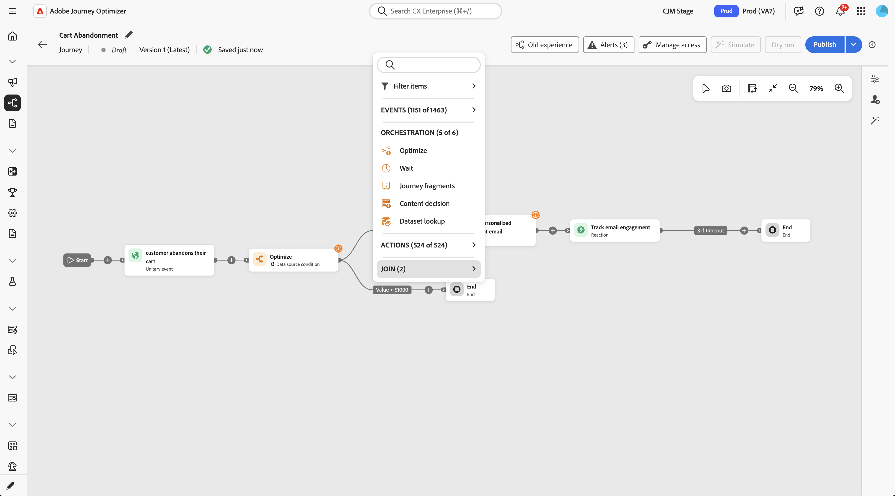
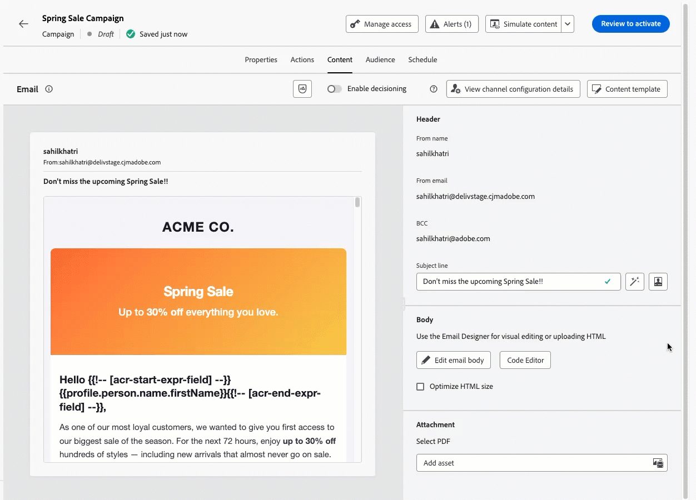
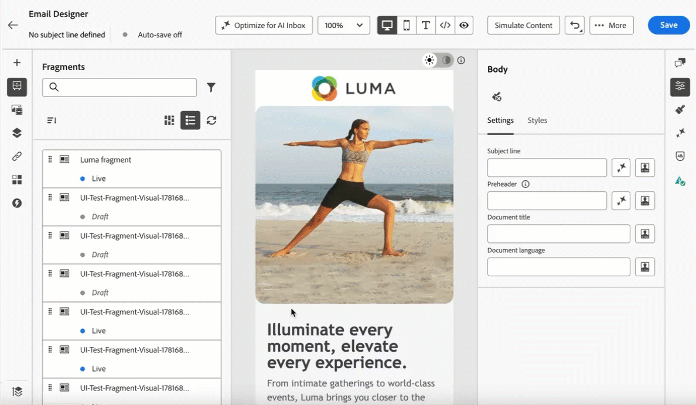

# リリースノート {#release-notes}

>[!CONTEXTUALHELP]
>id="ajo_homepage_card1"
>title="新機能"
>abstract="**Adobe Journey Optimizer** は、新機能、既存機能の強化およびバグ修正を継続的に提供します。 これらのリリースノートでは、すべての変更が各月の最終週にまとめられます。"

[!DNL Adobe Journey Optimizer] は継続的配信モデルに従って、アドビが新機能、機能強化、修正を継続的に提供できるようにします。 このアプローチにより、スケーラブルで段階的な機能のロールアウトが可能になり、すべての環境をまたいでパフォーマンスと安定性を確保できます。 このモデルにより、リリースノートは毎月のリリースの間に更新されます。 リリースサイクルと可用性フェーズについて詳しくは、[Journey Optimizer リリースサイクル](releases.md)を参照してください。

[!DNL Adobe Journey Optimizer] が [!DNL Adobe Experience Platform] でネイティブに構築され、最新のイノベーションや改善点を引き継いでいます。 以下の変更点について詳しくは、[Adobe Experience Platform リリースノート](https://experienceleague.adobe.com/docs/experience-platform/release-notes/latest.html?lang=ja){target="_blank"}を参照してください。

>[!NOTE]
>
>これらのリリースノートに記載されている機能には、各変更がお客様の環境でアクセス可能になるタイミングを示す&#x200B;**公開日**&#x200B;が含まれています。 **近日リリース予定**&#x200B;のアコーディオンへのエントリは、今後数日または数週間以内に予定されています。 次の節の情報は変更される場合があります。

## 26年7月の更新 {#july-26-updates}

### 新機能 {#july-26-new-capabilities}

<table>
<thead>
<tr>
<th><strong>E メールデザイナーのコンテンツチェック</strong> </th>
</tr>
</thead>
<tbody>
<tr>
<td>

Journey Optimizer に、E メールデザイナーでの自動技術検証が直接含まれるようになりました。これにより、送信前に HTML や CSS の問題を把握できます。

チェック対象には、<code>&lt;script&gt;</code> タグおよび <code>&lt;base&gt;</code> タグ、Microsoft Outlook でレイアウトを崩す場合がある空の div、HTML メタ更新タグ、Gmail でレンダリングエラーをトリガーする CSS または HTML のサイズしきい値など、サポートされていない要素が含まれます。

結果は、エラー、警告または情報通知としてオーサリングパネルに直接表示され、コンテキストの詳細とワンクリック修正が可能な場合は表示されるので、エディターを離れることなく問題を解決できます。

この機能は、以前は限定提供で公開されていましたが、現在はすべてのお客様に一般提供されるようになりました。

詳しくは、<a href="../email/content-check.md">詳細ドキュメント</a>を参照してください。

公開日：2026年7月16日（PT）

</td>
</tr>
</tbody>
</table>

<table>
<thead>
<tr>
<th><strong>オーケストレーションされたキャンペーンでのファイルベースのターゲティング</strong> </th>
</tr>
</thead>
<tbody>
<tr>
<td>

オーケストレーションされたキャンペーンでは、最初にAdobe Experience Platformにファイルを取り込むことなく、<strong>CSVまたはTXT ファイル </strong>をターゲットオーディエンスとしてキャンペーンキャンバスに直接読み込むことがサポートされるようになりました。 ファイルデータは実行時に消費され、Adobe Experience Platform データセットとして保持されません。 ファイルの設定時に、列のマッピング、データタイプ、NULL処理、列ごとのエラーポリシーを定義できます。 検証に失敗した行は、キャンペーンが実行される前に却下され、ログに記録されます。これにより、手作業による事前処理なしでオーディエンスをクリーンに保つことができます。 これは、完全な取り込みパイプラインの構築が実用的ではないアドホック送信やパートナーリストキャンペーンに特に適しています。

詳しくは、<a href="../orchestrated/activities/load-file.md">詳細ドキュメント</a>を参照してください。

 ご利用いただけます：2026年7月6日（PT）

</td>
</tr>
</tbody>
</table>

### 改善点 {#july-26-improvements}

* **AJO MCP サーバーの新しいツール** - [!DNL Adobe Journey Optimizer] MCP サーバーには、さらに5つの読み取り専用&#x200B;**チャネル設定ツール**&#x200B;が公開され、AI アシスタントから直接チャネル設定、サポートリソース、およびマーケティングアクションをクエリできるようになりました。 **List Channel Configurations** （すべてのAJO チャネルで）、**Get Channel Configuration**、**List Configuration Resources**、**Get Configuration Resource**、および&#x200B;**List Marketing Actions**&#x200B;を使用できるようになりました。 [詳細情報](../integrations/ajo-mcp.md#mcp-tools)

  ご利用いただけます：2026年7月9日（PT）

### 使いやすさの向上 {#july-26-usability}

2026年7月にリリースされた操作性の改善点は次のとおりです。

#### コンテンツ管理

* **フラグメントインベントリ**&#x200B;のクイック起動ショートカット - **[!UICONTROL その他のアクション]** ボタンを使用して、フラグメントリストから一般的なアクションにすばやくアクセスできるようになりました。 使用可能なショートカットには、フラグメントの編集、詳細の開き方、ドラフトバージョンの破棄などがあります。 [詳細情報](../content-management/manage-fragments.md#quick-launch-fragments)

  

* **テンプレート インベントリのクイック起動ショートカット** - コンテンツテンプレートリストの&#x200B;**[!UICONTROL その他のアクション]** ボタンで、テンプレートの詳細の編集、コンテンツのシミュレーション、テンプレートの削除など、一般的なアクションにすばやくアクセスできるようになりました。 メールテンプレートの場合、件名とメール本文の編集、プルーフの表示または送信、迷惑メールレポートの実行、メールのレンダリングを追加のショートカットで実行できます。 [詳細情報](../content-management/access-content-templates.md#quick-launch-templates)

  

#### ジャーニー

ジャーニーキャンバスに&#x200B;**新しいユーザーインターフェイス**&#x200B;が導入され、大規模なジャーニーのパフォーマンスの向上、読みやすさの向上による自動レイアウト、ガイド付きのオーサリング体験が実現されました。

新しいUIに切り替えるには、**[!UICONTROL 新しいエクスペリエンス]** ボタンをクリックします。 この設定はジャーニーレベルで保存されるので、ジャーニーはデフォルトで新しいエクスペリエンスで再開されます。 元に戻すには、**[!UICONTROL 古いエクスペリエンス]**&#x200B;をクリックします。 [詳細情報](../building-journeys/using-the-journey-designer.md#canvas-capabilities)

公開日：2026年7月16日（PT）

## 26年6月のリリースノート {#june-26-rn}

### ジャーニー {#june-26-journeys}

このリリースでは、ジャーニーに次の機能と機能強化が追加されました。 また、追加の変更は今後数日または数週間以内に予定されています。

<table>
<thead>
<tr>
<th><strong>ジャーニーシミュレーション（一般提供）</strong> </th>
</tr>
</thead>
<tbody>
<tr>
<td>

これで、ジャーニーをシミュレーションに設定できます。 このモードを使用すると、シミュレートされたユーザーを使用してロジックを検証できます。 これらはシミュレーション専用に作成された一時的なプロファイルで、Adobe Experience Platform で永続的なテストプロファイルを管理することなく、自由にテストできます。 

この機能は、ジャーニーシミュレーションは限定提供でリリースされていましたが、現在はすべての環境で使用できるようになりました。 この一般提供リリースでは、Journey エージェントを使用して、シミュレーションユーザーとイベントをシミュレーションメニューで直接生成できるようになりました。

詳しくは、<a href="../building-journeys/simulate-journey-gs.md">詳細ドキュメント</a>を参照してください。

公開日：2026年6月9日（PT）

</td>
</tr>
</tbody>
</table>

<table>
<thead>
<tr>
<th><strong>ジャーニーフラグメント（一般提供）</strong> </th>
</tr>
</thead>
<tbody>
<tr>
<td>

Adobe Journey Optimizer で<strong>ジャーニーフラグメント</strong>を作成できるようになりました。 ジャーニーフラグメントは、一度作成すればサンドボックスをまたいで任意のジャーニーにドロップできる、再利用可能なジャーニーノードのセットです。 実施要件の確認、優先チャネルのルーティングロジック、ウェルカムシーケンスなど、フラグメントを使用することで、チームは毎回同じロジックをゼロから再作成することなく、より迅速に作業を進め、一貫性を維持できます。

作成したフラグメントは、専用の<strong>フラグメント在庫</strong>に保存され、<strong>ジャーニーフラグメント</strong>アクティビティを使用して任意のジャーニーに挿入できます。

この機能は、以前は限定提供で公開されていましたが、現在はすべてのお客様に一般提供されるようになりました。 また、ジャーニーフラグメントは<strong>サンドボックスツール</strong>もサポートしています。これにより、サンドボックスをまたいでフラグメントをパッケージ化してエクスポートできます。

詳しくは、<a href="../building-journeys/journey-fragments.md">詳細ドキュメント</a>を参照してください。

公開日：2026年6月9日（PT）

</td>
</tr>
</tbody>
</table>

<table>
<thead>
<tr>
<th><strong>ジャーニーパスの最適化 - ターゲティング（一般提供）</strong> </th>
</tr>
</thead>
<tbody>
<tr>
<td>

<strong>最適化アクティビティ</strong>では、<strong>ターゲティングルール</strong>がサポートされるようになりました。これにより、オーディエンスセグメントやプロファイル属性に基づいて、顧客が特定のジャーニーパスの実施要件を満たす必要がある特定の条件を定義できます。

顧客がランダムにパスに割り当てられる実験とは異なり、ターゲティングでは決定論的ロジックを使用して、適切なオーディエンスまたは顧客プロファイルが意図したパスにルーティングされるようにします。

この機能は、以前は限定提供でリリースされていましたが、現在はすべての環境で使用できるようになりました（一般提供）。

詳しくは、<a href="../building-journeys/path-targeting.md">詳細ドキュメント</a>を参照してください。

公開日：2026年6月8日（PT）

</td>
</tr>
</tbody>
</table>

<table>
<thead>
<tr>
<th><strong>ジャーニー式用 AI アシスタント（パブリックベータ版）</strong> </th>
</tr>
</thead>
<tbody>
<tr>
<td>

AI アシスタントは、ジャーニーの高度な式エディターで機能して、自然言語プロンプトを有効な式と条件付きロジックに変換するようになりました。 作成したい式を説明すると、AI アシスタントがすぐに適用できる使いやすいコードを生成したり、フォローアッププロンプトを通じて調整したりできます。

この機能は、パブリックベータ版としてすべてのユーザーが使用できます。

詳しくは、<a href="../building-journeys/expression/expression-agent.md">詳細ドキュメント</a>を参照してください。

公開日：2026年6月3日（PT）
 
</td>
</tr>
</tbody>
</table>

* [!BADGE 非推奨]{type=Negative} **オーディエンス選定ノードでバッチオーディエンスが非推奨になりました** - **2026年8月**&#x200B;以降、Journey Optimizerは&#x200B;**オーディエンス選定** ノードでバッチオーディエンスを使用しているジャーニーの公開をブロックします。 ジャーニーキャンバスに検証警告が既に表示されています。 既存のライブジャーニーは影響を受けません。 この設定を含む新しいジャーニー、ドラフトおよび重複したジャーニーは、2026年8月より前に更新する必要があります。 オーディエンス選定ノードでストリーミングオーディエンスを使用するか、**オーディエンスの読み取り** アクティビティに切り替えます。 [&#x200B; ジャーニーを移行する方法について説明します](../building-journeys/aq-batch-audiences-migration.md)

* **一時停止したジャーニーを直接停止する** - **一時停止した**&#x200B;状態から直接ジャーニーを停止できるようになりました。 以前は、一時停止したジャーニーを停止する前に、**Live**&#x200B;に再開する必要がありました。 [詳細情報](../building-journeys/journey-pause.md#stop-close-paused)

  ご利用いただけます：2026年6月18日～22日

* **外部オーディエンス向けの補助識別子サポート** - ジャーニーの補助識別子は、CSV ファイルからインポートされたオーディエンスや、連合オーディエンス構成で作成されたオーディエンスなど、外部オーディエンスに対してサポートされるようになりました。 オーディエンスから ID 以外の属性またはユーザー ID 以外の属性を補助 ID として指定できます。スキーマのラベル付けは不要です。 [詳細情報](../building-journeys/supplemental-identifier.md)

  公開日：2026年6月11日（PT）

* **非定期のオーディエンスを読み取りジャーニーの自動停止** - 非定期の&#x200B;**オーディエンスを読み取り**&#x200B;ジャーニーが、最後のアクティブなプロファイルが終了すると、自動的に&#x200B;**停止済み**&#x200B;ステータスに移行するようになりました。 以前は、これらのジャーニーは、プロファイルが流れなくなった場合でも、91 日間のグローバルタイムアウトが期限切れになるまで&#x200B;**ライブ**&#x200B;のままになっていました。 この機能強化により、ジャーニーステータスは完了するとすぐに実際の実行状態を反映するので、手動介入なしでジャーニーインベントリの正確性を維持できます。

  この動作は、待機ノード、反応ノード、イベントトリガーのトランジションなど、待機時間を発生させるノードを含むジャーニーには適用されません。 これらのジャーニーは、標準の 91 日間のグローバルタイムアウトの対象のままです。 [詳細情報](../building-journeys/end-journey.md#auto-stop-non-recurring)

  公開日：2026年6月9日（PT）

* **カスタムアクションでの証明書ベースのカスタム認証** - カスタムアクションで、証明書ベースのカスタム認証がサポートされるようになりました。 Journey Optimizer は、カスタム認証設定に `subType: "certificateCredential"` を追加することで、アドビが管理する証明書を使用して JWT クライアントアサーションに署名し、アクセストークンと交換します。クライアント秘密鍵は不要です。 Microsoft Entra ID など、証明書ベースの ID 確認を適用するエンタープライズ API 向けにデザインされています。 [詳細情報](../datasource/external-data-sources.md#certificate-credential)

  公開日：2026年6月4日（PT）

* **ライブジャーニーの上限増加と新しいガードレール** - 以前の上限 100 から最大 **200 のアクティブなジャーニー**&#x200B;まで増加できるようになりました。 [詳細情報](../start/guardrails.md#journeys-guardrails-journeys)

  公開日：2026年6月18日（PT）。 この機能は、今後数日間であらゆる地域に徐々に展開されます。

+++ 近日リリース予定 - **以下の情報は変更される場合があります。**

* **ジャーニーヘッダーの開始日と終了日** - ライブジャーニーで開始日や終了日が設定すると、ライブステータスバッジの横にある&#x200B;**ジャーニーヘッダー**&#x200B;に表示されるようになりました。 表示されるラベルは、各日付が予定されているか、既に経過しているかに基づいて適応します。

+++

### オーケストレーションキャンペーン {#june-26-oc}

このリリースでは、オーケストレーションキャンペーンに次の機能と機能強化が予定されています。

* **関係データのループベースのパーソナライゼーション** - パーソナライゼーションエディターで、注文、アカウント、予約などの関係コレクションを繰り返し処理し、1つのレコードにつき1つのコンテンツブロックを1つの電子メールまたはSMS内にレンダリングするループブロックがサポートされるようになりました。 コレクションは、パーソナライゼーショントークンを使用してデータピッカーを通じて設定され、式の書き込みは必要ありません。 [詳細情報](../orchestrated/add-personalization.md#enrichment-collections)

  ご利用いただけます：2026年6月26日（PT）

### 決定 {#june-26-decisioning}

このリリースでは、決定に次の機能と機能強化が追加されました。

<table>
<thead>
<tr>
<th><strong>ダイレクトメールチャネルでの決定のサポート</strong> </th>
</tr>
</thead>
<tbody>
<tr>
<td>

ダイレクトメールジャーニーとキャンペーンに決定ポリシーを追加できるようになりました。 決定ポリシーは、各オーディエンスメンバーに最適なコンテンツを動的に返すことを目的に、決定エンジンを活用するオファーのコンテナです。 また、ダイレクトメール決定は、バッチ決定のユースケースもサポートし、特定の Adobe Experience Platform オーディエンスのすべてのプロファイルに対応するオファー項目をエクスポートできます。 

詳しくは、<a href="../experience-decisioning/use-decision-policy.md">詳細ドキュメント</a>を参照してください。

公開日：2026年6月3日（PT）

</td>
</tr>
</tbody>
</table>

* **DecisioningでAdobe Experience Manager コンテンツフラグメントを活用** - Adobe Experience Manager コンテンツフラグメントをDecisioningの決定項目にマッピングし、意思決定ポリシー内でそれらを活用して、適切なフラグメントを適切な顧客にタイミングよく配信できるようになりました。 この機能は、以前は限定提供でリリースされていましたが、現在はすべての環境で使用できるようになりました（一般提供）。 [詳細情報](../experience-decisioning/fragments-decision-policies.md)

  ご利用いただけます：2026年6月18日（PT）

### コンテンツ管理 {#june-26-content}

このリリースでは、コンテンツ管理に次の機能と機能強化が追加されました。

<table>
<thead>
<tr>
<th><strong>コンテンツバリエーションのシミュレート - エクスペリエンスと AI バリアント生成の更新</strong> </th>
</tr>
</thead>
<tbody>
<tr>
<td>

<strong>コンテンツをシミュレート</strong>ワークフローに、次の 2 つのアップデートが使用可能になりました。

<ul>
<li><strong>新しいデフォルトパス</strong> -「<strong>コンテンツをシミュレート</strong>」をクリックすると、デフォルトで<strong>コンテンツバリエーションをシミュレート</strong>エクスペリエンスが開くようになりました。 1 つの画面から、サンプル入力を手動または CSV／JSON ファイルから追加し、シミュレートされたユーザーを再利用し、レンダリングをプレビューし、本配信前確認を送信できます。 Adobe Experience Platform テストプロファイルを使用してプレビューしたり、テストプロファイルデータを使用して本配信前確認を送信したり、メールインボックスのレンダリングやスパムレポートを確認したりするには、「<strong>コンテンツをシミュレート</strong>」をクリックし、ドロップダウンから「<strong>コンテンツをシミュレート（AEP プロファイル）</strong>」を選択します。</li>
<li><strong>AI 生成コンテンツバリアント</strong> - <strong>コンテンツバリエーションをシミュレート</strong>エクスペリエンスで、「<strong>生成</strong>」をクリックすると、AI を使用してコンテンツバリアントが自動的に作成されます。 システムではメッセージを分析し、パーソナライゼーションフィールドと条件分岐を検出し、現実的な値を入力するので、すべてのバリアントを手動で作成することなくレンダリングを検証できます。</li>
</ul>

詳しくは、<a href="../test-approve/simulate-sample-input.md">詳細ドキュメント</a>を参照してください。

公開日：2026年6月9日（PT）

</td>
</tr>
</tbody>
</table>

### メールチャネル {#june-26-email}

このリリースでは、メールチャネルに次の機能強化が追加されました。

* **URL パラメーターの暗号化** - メールメッセージに追加されたトラッキングリンクやランディングページリンクの URL パラメーターを暗号化できるようになりました。 これにより、機密性の高いパラメーターデータのセキュリティレイヤーが追加されます。 この機能は、以前は限定提供でリリースされていましたが、現在はすべての環境で使用できるようになりました（一般提供）。 [詳細情報](../personalization/url-parameter-encryption.md)

  公開日：2026年6月1日（PT）

* **キーレジストリの新しい権限** - URL パラメーターの暗号化に必要なキーにアクセスして管理するには、新しい 2 つの権限（**キーレジストリを管理**&#x200B;と&#x200B;**キーレジストリを表示**）が必要になりました。 [詳細情報](../administration/high-low-permissions.md#administration-permissions)

  公開日：2026年6月1日（PT）

<table>
<thead>
<tr>
<th><strong>メールサイズの最適化</strong> </th>
</tr>
</thead>
<tbody>
<tr>
<td>

Journey Optimizer に、メールのレンダリング方法に影響を与えることなく、不要な空白、コメント、冗長なコードを削除して、メールの HTML サイズを削減するオプションが含まれるようになりました。

これにより、一部のメールプロバイダーがメッセージのフラグ付けや却下に使用するサイズしきい値を回避して配信品質を向上させ、受信者の読み込み時間を短縮できます。

詳しくは、<a href="../email/create-email.md#optimize-html-size">詳細ドキュメント</a>を参照してください。

ご利用いただけます：2026年6月26日（PT）

</td>
</tr>
</tbody>
</table>

<table>
<thead>
<tr>
<th><strong>フラグメントの編集可能フィールドのリッチテキスト</strong> </th>
</tr>
</thead>
<tbody>
<tr>
<td>

メールコンテンツで使用するカスタマイズ可能なフラグメントにリッチテキストを追加できるようになりました。

例えば、E メールデザイナーでテキストコンポーネントを編集可能なフィールドとして使用する際、コンテンツを直接書式設定（例：太字や斜体）したり、ハイパーリンクを挿入したりできます。

詳しくは、<a href="../content-management/customizable-fragments.md#rich-text-visual">詳細ドキュメント</a>を参照してください。

ご利用いただけます：2026年6月19日（PT）

</td>
</tr>
</tbody>
</table>

<table>
<thead>
<tr>
<th><strong>E メールデザイナーのコンテンツチェック</strong> </th>
</tr>
</thead>
<tbody>
<tr>
<td>

Journey Optimizer に、E メールデザイナーでの自動技術検証が直接含まれるようになりました。これにより、送信前に HTML や CSS の問題を把握できます。

チェック対象には、<code>&lt;script&gt;</code> タグおよび <code>&lt;base&gt;</code> タグ、Microsoft Outlook でレイアウトを崩す場合がある空の div、HTML メタ更新タグ、Gmail でレンダリングエラーをトリガーする CSS または HTML のサイズしきい値など、サポートされていない要素が含まれます。

結果は、エラー、警告または情報通知としてオーサリングパネルに直接表示され、コンテキストの詳細とワンクリック修正が可能な場合は表示されるので、エディターを離れることなく問題を解決できます。

この機能は、一連の組織でのみ使用できます（限定提供）。 アクセスするには、アドビ担当者にお問い合わせください。

詳しくは、 <a href="../email/content-check.md">詳細なドキュメント</a>を参照してください。

ご利用いただけます：2026年6月18日（PT）

</td>
</tr>
</tbody>
</table>

* **画像から HTML へのコンバーターの機能強化** - 画像から HTML へのコンバーター機能の新しいバージョンが使用可能になり、HTML 生成の精度が向上しました。 このアップデートでは、より高度な LLM モデルを活用して、画像入力からより正確で信頼性の高い HTML 出力を提供します。

  ご利用いただけます：2026年6月18日（PT）

### コンテンツと統合 {#june-26-integration}

このリリースでは、コンテンツ管理と統合に次の機能と機能強化が予定されています。

<table>
<thead>
<tr>
<th><strong>Journey Optimizer での Adobe Experience Manager コンテンツフラグメントの機能強化</strong> </th>
</tr>
</thead>
<tbody>
<tr>
<td>

このリリースでは、Journey Optimizer オーサリングワークフロー内で <strong>Adobe Experience Manager コンテンツフラグメント</strong>をより使いやすく、より管理しやすく、より本番環境ですぐに使用できるようにする、いくつかの機能強化が行われています。

<ul>
<li>Journey Optimizer では、オーサー、パブリッシュ、認証済みパブリッシュの各階層など、複数の Adobe Experience Manager 設定からのコンテンツフラグメントの取得をサポートするようになりました。</li>
<li>フラグメントを選択すると、そのコンテキストはメッセージを通じて保持されるので、オーサーは再選択することなく、コンテンツブロックをまたいでフラグメントフィールドを再利用できます。</li>
<li>Journey Optimizer に、ライフサイクル管理を向上させるための新しい専用のコンテンツフラグメントリストページが導入されました。ユーザーは同期されていないフラグメントを特定し、手動で同期をトリガーして最新の状態を維持できます。</li>
<li>ロケールとバリエーションのサポートにより、マーケターは同じコンテンツフラグメントの代替バージョンをより慎重に操作できるようになりました。</li>
<li>Adobe Journey Optimizer で Adobe Experience Manager コンテンツにアクセスする方法を、より柔軟に指定できるようになりました。 このリリースでは、ジャーニーやキャンペーンで使用されるコンテンツフラグメントの<strong>ソースリポジトリを切り替える</strong>機能が導入されました。</li>
<li><b>Managed Services</b> との互換性が確立されたことで、パーソナライゼーション用に Adobe Experience Manager コンテンツフラグメントを Journey Optimizer で直接表示、アクセス、使用できます。 設定画面に Adobe Experience Manager Managed Services のリポジトリ URL を 1 回限りの設定として追加するだけです。</li>
</ul>

詳しくは、<a href="../integrations/aem-fragments-gs.md">詳細ドキュメント</a>を参照してください。

ご利用いただけます：2026年6月18日（PT）

</td>
</tr>
</tbody>
</table>

<!--
+++ Coming soon — **Information below is subject to change.**

<table>
<thead>
<tr>
<th><strong>AI assistant integration with Adobe Experience Manager Asset Essentials</strong> </th>
</tr>
</thead>
<tbody>
<tr>
<td>

The AI Assistant now automatically fetches <b>brand-approved images</b> directly from your Adobe Experience Manager Assets when generating Emails, Web pages, and Push notifications. This eliminates the need to manually search the Assets or rely on generic AI fallbacks, ensuring every visual is perfectly accurate and brand-compliant.

</td>
</tr>
</tbody>
</table>

<table>
<thead>
<tr>
<th><strong>AI Assistant for content generation enhancements</strong> </th>
</tr>
</thead>
<tbody>
<tr>
<td>

This release improves the <strong>AI Assistant</strong> content generation experience with stronger image editing, more reliable brand extraction, and content authenticity support in the image flow:

<ul>
<li><strong>AI image editing</strong> is now available in the image generation flow, including Firefly third-party model support, so you can refine source images without leaving the assistant.</li>
<li><strong>Brand signal extraction</strong> delivers higher-quality results. When selected pages lack sufficient signal, improved fallbacks now populate colors, typography, writing guidelines, and other brand attributes.</li>
<li><strong>Web-based brand extraction</strong> is more reliable. Improved timeout handling helps prevent slow pages, popups, and cookie banners from blocking extraction.</li>
<li><strong>Content authenticity (CAI)</strong> is now supported in the image flow. This release also fixes reference image upload issues and improves handling for images without an existing C2PA manifest.</li>
</ul>
</td>
</tr>
</tbody>
</table>

+++
-->

### レポート {#june-26-reporting}

このリリースでは、レポートに次の機能強化が追加されました。

* **電子メールレポートの新しい推定クリック指標** – 実際の顧客エンゲージメントをより正確に把握するために、ジャーニー、キャンペーン、チャネルのレポートで新しい推定指標を使用できるようになりました。

   * **推定CTR** （クリック率）：配信されたメッセージの合計数に対する推定クリック数として計算されます。

   * **推定CTOR** （クリック率）：推定開封数に対する推定クリック数として計算されます。

  ご利用いただけます：2026年6月25日（PT）

### 管理 {#june-26-administration}

このリリースでは、管理とデータ管理に次の機能強化が追加されました。

* [!BADGE 重要]{type=Informative} **AJO メッセージフィードバックイベントデータセットがバッチ取り込みに移行** - **AJO メッセージフィードバックイベントデータセット**&#x200B;は、ストリーミング取り込みからバッチ取り込みに移行しています。 その結果、このデータセットでは、最大 2 時間のデータ待ち時間がが予想されます。 Customer Journey Analytics でレポートを作成する場合や、このデータセットを使用してクエリを実行を実行する場合、この待ち時間の増加を考慮してください。 [詳細情報](../data/datasets-query-examples.md#message-feedback-event-dataset)

  公開日：2026年6月10日（PT）

* **キャンペーンライフサイクルイベントに関する顧客アラート** - 新しいシステムアラートにより、アクションおよび API トリガーキャンペーンの主要なライフサイクルイベントが通知されるようになりました。 サンドボックスレベルで登録してください。 [詳細情報](../reports/alerts.md)

  公開日：2026年6月1日（PT）

<!--
+++ Coming soon — **Information below is subject to change**

* **Web Application Firewall (WAF) IP whitelisting** - Adobe Journey Optimizer now supports Web Application Firewall (WAF) IP whitelisting for landing pages, enabling organizations to enforce that all incoming requests are routed exclusively through their configured WAF infrastructure. With this enhancement, customers can configure Journey Optimizer to reject any direct requests that bypass the WAF layer, ensuring that security policies defined in tools such as Imperva are consistently applied. This capability strengthens the security posture for enterprises with strict network access requirements, giving them full control over the traffic flow to their AJO-hosted landing pages.
  
  Availability date: Late June, 2026

+++
-->

### モバイルメッセージ（SMS、MMS、RCS、LINE） {#june-26-mobile}

このリリースでは、モバイルメッセージに次の機能強化が予定されています。

* **SMS レポートのユニーククリック数** - SMS レポートに新しい&#x200B;**ユニーククリック数**&#x200B;モジュールが導入され、現在メールレポートで使用可能なのと同じレベルの詳細なパフォーマンストラッキングが SMS にも使用できるようになりました。

* **SMS - 使用状況指標の表示** - Adobe Journey Optimizer を通じて SMS を直接購入している顧客向けに、新しい **SMS 使用状況ダッシュボード**&#x200B;が導入されました。 モバイル発信（MO）およびモバイル終端（MT）メッセージで分類された、過去 90 日間のメッセージ送信指標を表示および追跡できるようになりました。 また、このデータは CSV 形式でダウンロードすることもでき、SMS 支出の可視性とコントロールが向上します。 [詳細情報](../mobile/sms-usage-report.md)

* **SMSの推定クリック数レポート** – 新しい推定クリック数の指標が、メールおよびSMSのジャーニー、キャンペーン、およびチャネルレポートで利用できるようになりました。 この指標では、特定されたボットと人間以外のインタラクション（NHI）トラフィックが除外され、真の顧客エンゲージメントをより明確に把握できます。 既存のクリック数指標は引き続き使用可能で、合計クリック数は引き続き報告されます。

+++ 近日リリース予定 - **以下の情報は変更される場合があります。**

* **LINE チャネル - オーサリングの変更** - LINE チャネルの UI が、高度なメッセージオーサリング機能を備えてアップグレードされました。 このリリースでは、リアルタイムのデバイスプレビューと共に、テキスト、画像、画像マップ、カルーセル、Flex（JSON エディター）など、**複数のメッセージ形式**&#x200B;のサポートが導入されています。 ユーザーは、最大 5 個のメッセージをグループ化して管理（追加、削除、並べ替えコントロール）し、検証済みの動的メッセージ用の統合されたパーソナライゼーションエディターを活用できるようになりました。

+++

### 使いやすさの向上 {#june-26-usability}

* **ジャーニー用フォルダー** - ジャーニーを&#x200B;**フォルダー**&#x200B;に整理して、インターフェイスのナビゲーションと管理を改善できるようになりました。 [詳細情報](../building-journeys/journey-ui.md#journeys-folders)

  ご利用いただけます：2026年6月30日（PT）

<!--
+++ Coming soon — **Information below is subject to change.**

* **Override the default execution field in campaigns** - Previously available at the journey level, you can now override the default execution field set globally for your Email, SMS and WhatsApp deliveries in the campaign parameters.

  Availability date: Early June, 2026

+++
-->
