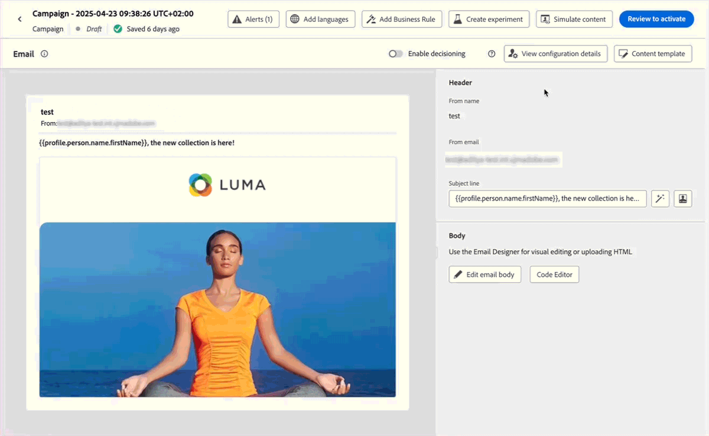

# リリースノート {#release-notes}

>[!CONTEXTUALHELP]
>id="ajo_homepage_card1"
>title="新機能"
>abstract="**Adobe Journey Optimizer** は、新機能、既存機能の強化およびバグ修正を継続的に提供します。これらのリリースノートでは、すべての変更が各月の最終週にまとめられます。"

[!DNL Adobe Journey Optimizer] は、新機能、既存機能の強化、およびバグ修正を継続的に提供します。これらのリリースノートでは、すべての変更が各月の最終週にまとめられます。[!DNL Adobe Journey Optimizer] が [!DNL Adobe Experience Platform] でネイティブに構築され、最新のイノベーションや改善点を引き継いでいます。以下の変更点について詳しくは、[Adobe Experience Platform リリースノート](https://experienceleague.adobe.com/docs/experience-platform/release-notes/latest.html?lang=ja){target="_blank"}を参照してください。

## 2025 年 5 月の早期リリースノート {#25-5-rn}

**以下の早期リリースノートは、リリースの公開日まで予告なく変更される場合があります**。リンク、画面、更新済みのドキュメントは、リリース日に公開されます。

**リリース日**:2025 年 5 月 20～21 日（PT）

### 新機能 {#25-04-features}

このリリースに含まれる新機能を以下に示します。

<table>
<thead>
<tr>
<th><strong>E メールDesignerのテーマ</strong> </th>
</tr>
</thead>
<tbody>
<tr>
<td>

事前承認済みのテーマをすばやく適用して、すべてのメールでブランドの一貫性を確保し、キャンペーンの作成プロセスを迅速化し、高品質のメールを独自に作成できると同時に、デザインチームへの依存を軽減することができます。

この機能は現在ベータ版で、ベータ版のお客様のみご利用いただけます。ベータ版プログラムに参加するには、アドビ担当者にお問い合わせください。

詳しくは、<a href="../email/apply-email-themes.md">詳細なドキュメント</a>を参照してください。

公開日：2025年5月14日（PT）

</td>
</tr>
</tbody>
</table>

<table>
<thead>
<tr>
<th><strong>意思決定 – 新しい AI 式ビルダー</strong> </th>
</tr>
</thead>
<tbody>
<tr>
<td>

新しく改善されたインターフェイスから条件を定義および組み合わせることで、特定の決定ランキング式を作成できるようになりました。静的なオファーの優先度のみに依存するのではなく、ガイド付きインターフェイスを介して AI モデルスコア、オファーの優先度、プロファイル属性、オファー属性、コンテキストシグナルを組み合わせるカスタムランキング式を定義できます。

詳しくは、<a href="../experience-decisioning/exd-ranking-formulas.md">詳細なドキュメント</a>を参照してください。

公開日：2025年5月14日（PT）

</td>
</tr>
</tbody>
</table>

<table>
<thead>
<tr>
<th><strong>オーディエンスを読み取りスケジュールをバッチセグメント化ジョブと同期</strong> </th>
</tr>
</thead>
<tbody>
<tr>
<td>

バッチセグメント化の完了後に毎日のジャーニー実行をトリガーできるようになりました。 すべてのお客様が、毎日スケジュールされるジャーニーでこのオプションを利用できるようになりました。 これにより、最大 6 時間の時間枠を定義して、バッチセグメント化ジョブからのオーディエンスデータを待機し、ジャーニーが最新のデータで実行されるか、準備ができていない場合はスキップされるようにします。

以前は限定提供でリリースされていましたが、現在はすべての環境でこの機能を利用できます（一般提供）。

</td>
</tr>
</tbody>
</table>

<table>
<thead>
<tr>
<th><strong>Adobe Experience Manager コンテンツフラグメントの統合</strong> </th>
</tr>
</thead>
<tbody>
<tr>
<td>

Adobe Experience ManagerとJourney Optimizerの統合により、Adobe Journey Optimizer コンテンツ内でAdobe Experience Manager コンテンツフラグメントを簡単に使用できるようになりました。 このシームレスな接続により、Journey Optimizer内のAEM コンテンツに直接アクセスして使用しやすくなります。

以前は一部の組織（LA）で利用できましたが、この機能は現在は GA であり、次の機能強化が行われています。

<ul>
<li>AEM コンテンツフラグメントを直接選択してオファーを作成します。</li>
<li>エディターモードを使用して、プレースホルダーを定義し、フラグメント署名内のパーソナライゼーション値をマッピングします。</li>
</ul>
</td>
</tr>
</tbody>
</table>

<table>
<thead>
<tr>
<th><strong>キャンペーンおよびジャーニーインベントリのカレンダー表示</strong> </th>
</tr>
</thead>
<tbody>
<tr>
<td>

ジャーニーリストとキャンペーンリストでカレンダー表示を使用できるようになりました。 これにより、すべてのジャーニーとキャンペーンのアクティベーションをそれぞれのリストで視覚化できます。

この変更は、一連の組織のみが使用できます（限定提供）。アクセスするには、アドビ担当者にお問い合わせください。

</td>
</tr>
</tbody>
</table>

<table>
<thead>
<tr>
<th><strong>Adobe Experience Manager Dynamic Media との統合</strong> </th>
</tr>
</thead>
<tbody>
<tr>
<td>

Dynamic Media アセットが Journey Optimizer で直接使用可能になり、アクセスできるようになりました。この統合により、次のことを実行できます。

<ul>
<li>リアルタイムのアップデートでアセットを一元管理します。</li>
<li>幅や高さなどのアセット設定を即座に変更します。</li>
<li>コンテンツを更新し、パーソナライゼーションフィールドを追加して、Dynamic Media テンプレートをカスタマイズします。</li>
</ul>

以前は限定提供でリリースされていましたが、現在はすべての環境でこの機能を利用できます（一般提供）。

</td>
</tr>
</tbody>
</table>

<table>
<thead>
<tr>
<th><strong>競合と優先順位付け</strong> </th>
</tr>
</thead>
<tbody>
<tr>
<td>

Journey Optimizer では、過剰な数のインタラクションで顧客が圧倒されるのを避けるために、キャンペーンとジャーニーの量とタイミングを管理することが不可欠です。Journey Optimizerでは、以前は制限付きアクセス（LA）組織のみが使用できた競合の管理と優先順位付けのツールがいくつか提供され、現在は一般公開（GA）されています。

以前は限定提供でリリースされていましたが、現在はすべての環境でこの機能を使用できます。 この一般提供リリースでは、次の機能強化が導入されました。

<ul>
<li>サポートの拡張：競合管理ツールは、オーディエンスの読み取りジャーニーに加えて、単一ジャーニーとオーディエンスの選定ジャーニーの両方をサポートするようになりました。</li>
<li>トラブルシューティングの改善：クエリサービスで 2 つの新しいステップイベントフィールドが使用できるようになりました。これにより、プロファイルがジャーニーまたはキャンペーンから却下された理由を分析できます。</li>
<li>強化されたレポート：レポートに、ジャーニーまたはキャンペーンからプロファイルを除外した特定のルールが示され、透明性が高く、アクションにつながるインサイトが得られるようになりました。</li>
</ul>
</td>
</tr>
</tbody>
</table>

<table>
<thead>
<tr>
<th><strong>コンテンツのバリエーションをシミュレート</strong> </th>
</tr>
</thead>
<tbody>
<tr>
<td>

以前はベータ版で提供されていましたが、コンテンツバリエーションのシミュレーションが一般提供（GA）されるようになりました。これを使用すると、CSV ファイルまたは JSON ファイルからアップロードした、または手動で追加したサンプル入力データを使用して、コンテンツの様々なバリエーションをプレビューできます。パーソナライゼーションのコンテンツで使用されるすべての属性は、システムによって自動的に検出され、複数のバリアントを作成するテストに使用できます。

以前は限定提供でリリースされていましたが、現在はすべての環境でこの機能を使用できます。 この一般提供リリースで、この機能に多言語コンテンツとコンテンツ実験のサポートが含まれるようになり、様々な言語や処理でのバリエーションをテストできます。 さらに、（プロファイル属性に加えて）コンテキスト属性もサポートされるようになり、より動的で状況に応じたコンテンツテストが可能になりました。

</td>
</tr>
</tbody>
</table>

<table>
<thead>
<tr>
<th><strong>実験の勝者を拡大・縮小</strong> </th>
</tr>
</thead>
<tbody>
<tr>
<td>

勝者のスケールを使用すると、実験の勝者バリエーションを自動または手動でオーディエンス全体にロールアウトできます。 この機能により、パフォーマンスの高い人物を特定した後も、手動で常に監視することなく、その人物のリーチと有効性を最大限に高めることができます。

</td>
</tr>
</tbody>
</table>

<table>
<thead>
<tr>
<th><strong>カスタム SMS プロバイダー</strong> </th>
</tr>
</thead>
<tbody>
<tr>
<td>

Journey Optimizerでは、デフォルトのオプション（Sinch、Infobip および Twilio）以外にも、追加の SMS プロバイダーを設定できるようになりました。 カスタムの SMS プロバイダー設定を使用すると、サードパーティプロバイダーを直接統合し、動的メッセージ用の高度なペイロードカスタマイズを活用し、同意設定（オプトイン/オプトアウト）を管理してコンプライアンスを確保できます。

詳しくは、<a href="../sms/sms-configuration-custom.md">詳細なドキュメント</a>を参照してください。

以前は限定提供でリリースされていましたが、現在はすべての環境でこの機能を利用できます（一般提供）。
</td>
</td>
</tr>
</tbody>
</table>

<table>
<thead>
<tr>
<th><strong>イベントトリガージャーニーの追加 ID</strong> </th>
</tr>
</thead>
<tbody>
<tr>
<td>

プロファイル ID と別のトリガー（注文 ID、購読 ID、処方箋 ID など）を使用してジャーニーを識別できるようになり、同じプロファイルを同じジャーニーに同時に複数回含めることができます。 これにより、複数の注文や購読を並行して管理し、各インスタンスがジャーニーを通じて独自のパスに従うなどのシナリオが可能になります。

この機能は、一連の組織でのみ使用できます（限定提供）。アクセスするには、アドビ担当者にお問い合わせください。

</td>
</tr>
</tbody>
</table>

### 機能強化 {#25-05-improv}

このリリースに含まれる機能強化を以下に示します。

* **サンドボックスコピーの新規オブジェクトのサポート**

   * **キャンペーン** – 公開日：2025 年 5 月 15 日（PT）

     パッケージのエクスポートおよびインポート機能を使用して、複数のサンドボックス間でキャンペーンをコピーする場合、チャネル設定、実験のバリアントと設定、決定ポリシーと項目の依存関係もコピーされるようになりました。 [詳細情報](../configuration/copy-objects-to-sandbox.md)

   * **決定** – 公開日：2025 年 5 月 16 日（PT）

     サンドボックス間で決定オブジェクトをコピーできるようになり、テストおよびデプロイメントワークフローを合理化します。 [詳細情報](../configuration/copy-objects-to-sandbox.md#decisioning)

* **ランディングページのフォルダー** – 公開日：2025 年 5 月 9 日（PT）
ランディングページを簡単に管理するために、フォルダーを使用して、より効果的に構造化階層に整理できるようになりました。 [詳細情報](../landing-pages/manage-lp.md)

* **ダイレクトメール：SFTP 接続用の SSH キーのサポート** – 公開日：2025 年 5 月 5 日（PT）

  ダイレクトメールファイルのルーティング設定で、パスワード認証タイプの既存の SFTP に加えて、SSH キー認証を使用してダイレクトメールファイルを SFTP サーバーに書き出すことができるようになりました。

* **パーソナライゼーションのための錠剤のアクティベーション** – 公開日：2025 年 5 月 5 日（PT）

  パーソナライゼーションエディターに新しい「錠剤」ボタンが追加されました。 有効にすると、プロファイルとコンテキストの属性が錠剤として表示され、コードの読みやすさが向上します。 [詳細情報](../personalization/personalization-build-expressions.md#options)

  >[!AVAILABILITY]
  >
  >この機能は、今後 30 日間にわたってすべての環境に徐々に展開される予定です。

* **E メールテンプレートでのクリックトラッキング**\
  メールテンプレートの画像マップ内の `<area>` 要素のクリックトラッキングが、Journey Optimizerでネイティブにサポートされるようになりました。 これは、画像マップ領域が、標準のハイパーリンクと同じトラッキングラッピング、トラッキングデータおよび追加されたパラメーターを確実に受け取るためです。

* **決定 – Adobe Experience Platform データセットの活用**\
  Journey Optimizerでは、実施要件ルール、ランキング式、キャッピングルールの決定オブジェクトでAdobe Experience Platform データセットを活用できるようになりました。

* **テンプレートとフラグメントのフォルダー**\
  フォルダーを使用すると、コンテンツテンプレートとフラグメントをより簡単かつ効果的に構造化された階層に整理できます。 以前は一連の組織（LA）で使用できましたが、フォルダーはすべてのユーザー（GA）がコンテンツテンプレートとフラグメントを管理するために使用できるようになりました。

* Web チャネルでの **URL にリダイレクト」のサポート**\
  Journey Optimizer web チャネルで、ビジュアルエディターで新しいバリエーションを作成するのではなく、別の既存の URL に訪問者をリダイレクトできるようになりました。 この機能を使用すると、ページ内のいくつかの要素を変更するだけで済むわけではなく、2 つの完全に異なるページを比較する実験を実行できます。

* **キャンペーンリストの右側のパネル**\
  キャンペーンリストでキャンペーンを選択すると、詳細を表示するパネルが開くようになりました。

* **コードベースのエクスペリエンスコンテンツのフォームフィールド**\
  コンテンツテンプレートでは、特定の JSON フィールドまたはHTML フィールドを定義できるようになりました。これにより、技術者以外のユーザーがコードを操作しなくても、コードベースのエクスペリエンスのコンテンツを簡単に編集できます。

* **決定ルールの決定項目属性のサポート**\
  決定項目属性を利用して決定ルールを作成できるようになりました。

<!--
* **Subdomains - 'Custom delegation' method**  
  In addition to the full delegation and the CNAME method, a new subdomain configuration method is now available: the Custom delegation method, which enables you to fully own controlling and maintaining all aspects of DNS that are required for delivering, rendering, and tracking messages.-->

## 2025年4月リリースノート {#25-4-rn}

**リリース日**：2025年4月29～30日（PT）

### 新機能 {#25-04-features}

このリリースに含まれる新機能を以下に示します。

<table>
<thead>
<tr>
<th><strong>パーソナライゼーションエディター - 実践で学ぶ</strong> </th>
</tr>
</thead>
<tbody>
<tr>
<td>

パーソナライゼーション式を実験できるパーソナライゼーションプレイグラウンドが使用可能になりました。これを使用すると、サンプルテンプレートとペイロードを探索して、開始し、独自のパーソナライゼーション式を試すことができます。

詳しくは、<a href="../personalization/personalize.md#playground">詳細なドキュメント</a>を参照してください。

公開日：2025年4月24日（PT）

</td>
</tr>
</tbody>
</table>

<!--table>
<thead>
<tr>
<th><strong>Adobe Experience Manager as a Cloud Service integration</strong> </th>
</tr>
</thead>
<tbody>
<tr>
<td>

The integration between Adobe Journey Optimizer and Adobe Experience Manager as a Cloud Service is now released in General Availability (GA). This integration enables seamless content sourcing and management for personalized customer journeys.

For more information, refer to the <a href="../integrations/aem-templates.md">detailed documentation</a>.

</td>
</tr>
</tbody>
</table-->

<!--<table>
<thead>
<tr>
<th><strong>Simulate content variations (General Availability)</strong> </th>
</tr>
</thead>
<tbody>
<tr>
<td>

Previously available in beta, content variations simulation is now generally available (GA). It allows you to preview different variations of your content using sample input data uploaded from a CSV or JSON file or added manually. All the attributes used in your content for personalization are automatically detected by the system and can be used for your tests to create multiple variants.

With the General Availability release, the feature now includes support for multilingual content and content experiments, enabling you to test variations across different languages and treatments. Additionally, it now supports contextual attributes (in addition to profile attributes), allowing for even more dynamic and situational content testing.

</td>
</tr>
</tbody>
</table>-->

<table>
<thead>
<tr>
<th><strong>LINE チャネル</strong> </th>
</tr>
</thead>
<tbody>
<tr>
<td>

Adobe Journey Optimizer では、クロスチャネル機能を拡張し、LINE チャネルのサポートを含めました。この機能強化により、LINE エクスペリエンスを作成、編集、プレビューできます。これにより、よりパーソナライズされた魅力的なインタラクションが可能になります。LINE を使用すると、より多くのお客様とつながり、関連性の高いコンテンツを送信し、エンゲージメントを向上させることができます。

リクエストに応じて、Adobe Journey Optimizerのお客様は LINE チャネルを有効にすることができます。 組織でこの機能を有効にするには、アドビカスタマーケアまたはアドビ担当者にお問い合わせください。

詳しくは、<a href="../line/get-started-line.md">詳細なドキュメント</a>を参照してください。
</td>
</tr>
</tbody>
</table>

<!--table>
<thead>
<tr>
<th><strong>Custom SMS provider (General Availability)</strong> </th>
</tr>
</thead>
<tbody>
<tr>
<td>

Adobe Journey Optimizer now supports custom SMS providers, allowing you to integrate your preferred SMS services for enhanced communication flexibility.

For more information, refer to the <a href="../sms/sms-configuration-custom.md">detailed documentation</a>.
</td>
</tr>
</tbody>
</table-->

<table>
<thead>
<tr>
<th><strong>ジャーニー指標</strong> </th>
</tr>
</thead>
<tbody>
<tr>
<td>

ジャーニー指標が使用可能になり、ビジネスの主要指標をまたいでアクティビティの影響を測定し、パフォーマンスに関するより明確なインサイトを得ることができるようになりました。

 

詳しくは、<a href="../building-journeys/success-metrics.md">詳細なドキュメント</a>を参照してください。

公開日：2025年4月9日（PT）

</td>
</tr>
</tbody>
</table>

<!--<table>
<thead>
<tr>
<th><strong>Calendar view for campaign and journey inventory (Limited Availability)</strong> </th>
</tr>
</thead>
<tbody>
<tr>
<td>

A new calendar view is now available for campaigns and journey activations. This feature provides a visual representation of scheduled activities, allowing you to view and manage your campaigns and journeys more effectively. Selecting a calendar item opens a right rail with detailed information. This feature is currently in Limited Availability.

</td>
</tr>
</tbody>
</table>-->

<table>
<thead>
<tr>
<th><strong>Adobe Express の統合（限定提供）</strong> </th>
</tr>
</thead>
<tbody>
<tr>
<td>

Adobe Journey Optimizer は、Adobe Express と統合され、クリエイティブアセットを Journey Orchestration とシームレスに接続できるようになりました。この統合により、キャンペーン全体でパーソナライズされたコンテンツを設計およびデプロイするプロセスが簡素化されます。 

この統合は、現在、Healthcare Shield またはプライバシーとセキュリティシールドでは使用できません。

詳しくは、<a href="../integrations/express.md">詳細なドキュメント</a>を参照してください。

</td>
</tr>
</tbody>
</table>

<table>
<thead>
<tr>
<th><strong>バッチセグメント化の完了後の毎日のジャーニー実行のトリガー（限定提供）</strong> </th>
</tr>
</thead>
<tbody>
<tr>
<td>

毎日スケジュールしたジャーニーでは、新しいオプションを使用すると、バッチセグメント化ジョブからのオーディエンスデータを待機する最大 6 時間の時間枠を定義できるので、ジャーニーが最新のデータで実行されるか、準備が整っていない場合はスキップされます。「バッチオーディエンス評価後にトリガー」オプションは、一連の組織に対してのみ使用できます（限定提供）。アクセスするには、アドビ担当者にお問い合わせください。

詳しくは、<a href="../building-journeys/read-audience.md#schedule">詳細なドキュメント</a>を参照してください。

</td>
</tr>
</tbody>
</table>

<!--table>
<thead>
<tr>
<th><strong>Themes in the Email Designer (Beta)</strong> </th>
</tr>
</thead>
<tbody>
<tr>
<td>

You can now quickly apply pre-approved styling themes to your email content to ensure brand consistency across all emails, speed up your campaign creation process and independently produce hight-quality emails while reducing dependency on design teams.

This capability is currently in beta version and only available to beta customers. To join the beta program, contact your Adobe representative.

For more information, refer to the <a href="../content-management/brands-score.md">detailed documentation</a>.

Availability date: May 5, 2025

</td>
</tr>
</tbody>
</table-->

<table>
<thead>
<tr>
<th><strong>ブランド一致スコア（ベータ版）</strong> </th>
</tr>
</thead>
<tbody>
<tr>
<td>

ブランド整合性スコア機能は、E メールデザイナーで直接、明確なフィードバックを提供し、コンテンツがブランドのトーン、スタイル、ガイドラインと合っているかどうかを確認するのに役立ちます。この機能はベータ版で使用できます。

詳しくは、 <a href="../content-management/brands-score.md">詳細なドキュメント</a>を参照してください。

</td>
</tr>
</tbody>
</table>

<!--
<table>
<thead>
<tr>
<th><strong>Decisioning - New AI formula builder</strong> </th>
</tr>
</thead>
<tbody>
<tr>
<td>

You can now create specific Decisioning ranking formulas by defining and combining criteria from a new improved interface. Ranking formulas allow you to define rules that will determine which decision items should be presented first, rather than taking into account the priority scores.

For more information, refer to the <a href="../content-management/brands-score.md">detailed documentation</a>.

Availability date: May 5, 2025

</td>
</tr>
</tbody>
</table>
-->

### 機能強化 {#25-04-improv}

**キャンペーンのプレビュー API**

キャンペーンのプレビュー用の新しい API が、既存のプルーフ送信機能に加えて追加されました。 [詳細情報](https://developer.adobe.com/journey-optimizer-apis/references/simulations/#operation/createCampaignPreview){target="_blank"}。

**サンドボックスツール**

* **カスタムアクション用のサンドボックスツール**

  サンドボックスツール機能を使用してコピーできる Adobe Journey Optimizer オブジェクトのリストにカスタムアクションが含まれるようになり、テストとデプロイメントが効率化されます。[詳細情報](../configuration/copy-objects-to-sandbox.md)

* **キャンペーン用のサンドボックスツール** - 公開日：2025年4月3日（PT）

  パッケージのエクスポート機能とインポート機能を使用して、複数のサンドボックス間でキャンペーンをコピーできるようになりました。キャンペーンは、プロファイル、オーディエンス、スキーマ、インラインメッセージおよび依存オブジェクトに関連するすべての項目と共にコピーされます。決定項目、データ使用ラベル、言語設定など、一部の項目はコピーされません。[詳細情報](../configuration/copy-objects-to-sandbox.md#custom-actions)

**パーソナライゼーション**

* **新しいコンテキスト属性**

  新しいコンテキスト属性の&#x200B;**メッセージプロファイル ID** が、パーソナライゼーションエディターから選択できるようになりました。これは、配信内の各ターゲットプロファイルに送信された各メッセージを一意に識別するメッセージ指向の属性です。この一意の ID は、例えば、受信者が開いたりクリックした各リンクを区別するための URL トラッキングパラメーターとして使用できます。

* **属性パネルに入力した属性** - 公開日：2025年4月2日（PT）

  パーソナライゼーションエディターの属性パネルには、デフォルトで入力した属性のみが表示されるようになりました。すべての属性を表示するには、設定ボタンを使用して「**[!UICONTROL 入力した属性のみを表示]**」オプションをオフに切り替えます。[詳細情報](../personalization/personalization-build-expressions.md)

**メールチャネル**

* **パーソナライズされた URL のトラッキング** – 公開日：2025 年 4 月 30 日（PT）

  メール設定の柔軟性と制御を高めるために、コンテンツ内のリンクごとに電子メールデザイナーで実行する代わりに、電子メールチャネルの設定レベルで、すべての URL トラッキングパラメーターを一度にパーソナライズできるようになりました。 [詳細情報](../email/surface-personalization.md#personalize-url-tracking)

* **E メールデザイナー** - 公開日：2025年4月1日（PT）

  Journey Optimizer のアクセシビリティを強化するために、E メールデザイナーで 2 つの新しいフィールドが使用できるようになりました。これらは、メールコンテンツの `<html>` 要素の `<title>` 要素と `lang` 属性に対応しています。これらの設定は、メールの「**[!UICONTROL 本文]**」セクションの「**[!UICONTROL プリヘッダー]**」フィールドに加えて定義できます。[詳細情報](../email/email-metadata.md)

**ユースケースプレイブック**

* **プレイブックのオーサリングと共有（プライベートベータ版）** – 独自のユースケースプレイブックを作成、管理、共有できるようになりました。 この機能は、現在、一連の組織に対してのみプライベートベータ版として使用できます。 アクセス権を取得するには、Adobe担当者にお問い合わせください。 [詳細情報](../start/playbooks.md)

**ナビゲーション**

* **コンテンツ管理** - 公開日：2025年4月2日（PT）

  コンテンツテンプレートとフラグメントを簡単に管理することを目的に、フォルダーを使用して、より効果的に構造化された階層に整理できるようになりました。詳しくは、[コンテンツテンプレート](../content-management/access-content-templates.md#folders)および[フラグメント](../content-management/manage-fragments.md#folders)の節を参照してください。

  >[!AVAILABILITY]
  >
  >この機能強化は、一連の組織のみが使用できます（限定提供）。

<!--- **Folders for content templates and fragments** - Availability date: May 5, 2025

  Previously available for a set of organizations (LA), folders are now available to all users (GA) to manage their content templates and fragments. Folders let you organize your content templates and fragments more easily and effectively into a structured hierarchy.

<!--- **Right rail in campaigns list**  

  A right rail has been added to the campaigns list, providing detailed information when a campaign is selected.-->

<!--**Playbooks**

- **Create your own playbooks (Beta)**
  
  You can now create your own playbooks in Adobe Journey Optimizer, enabling greater customization and flexibility in journey planning.-->

