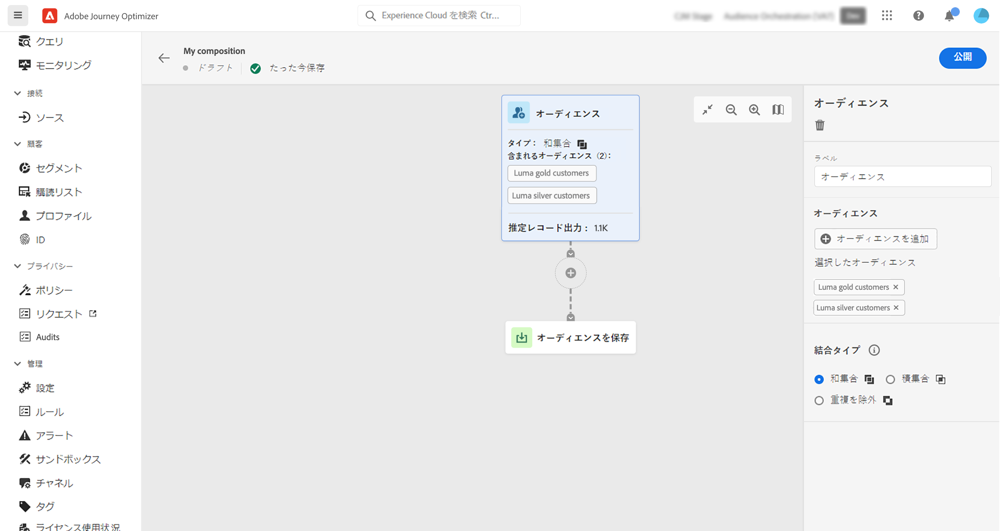
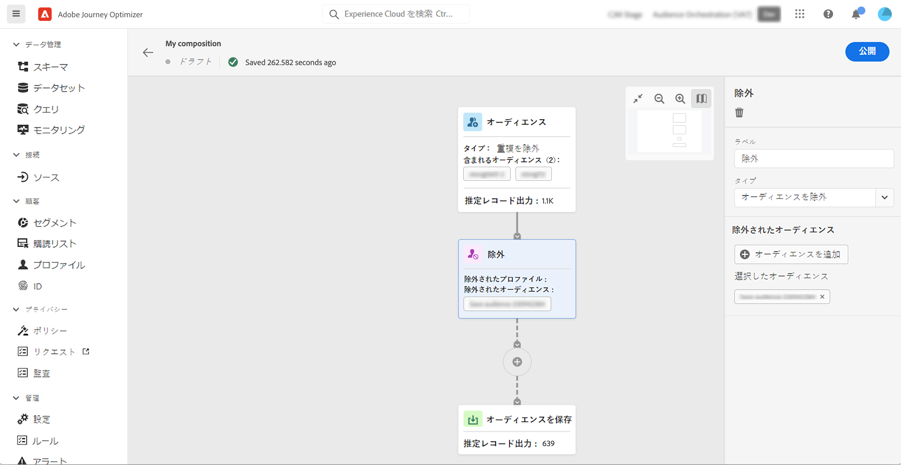
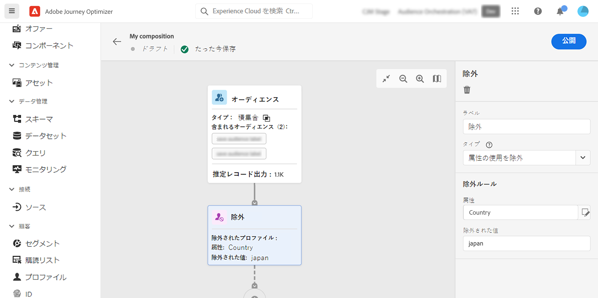
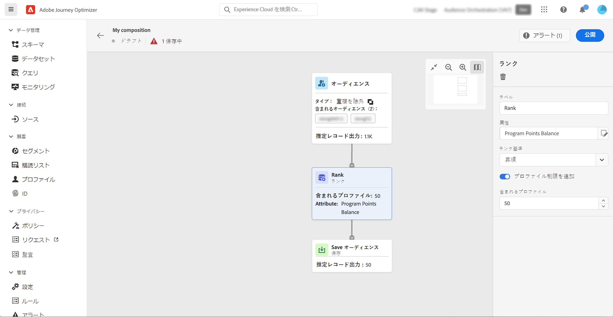
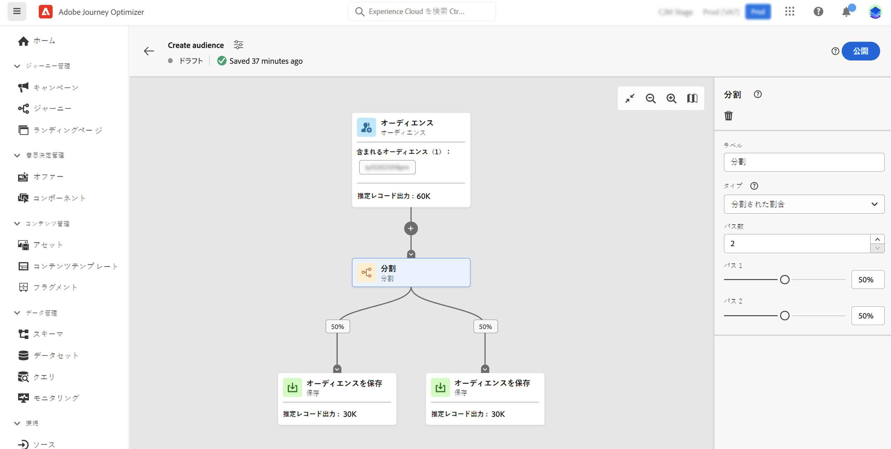
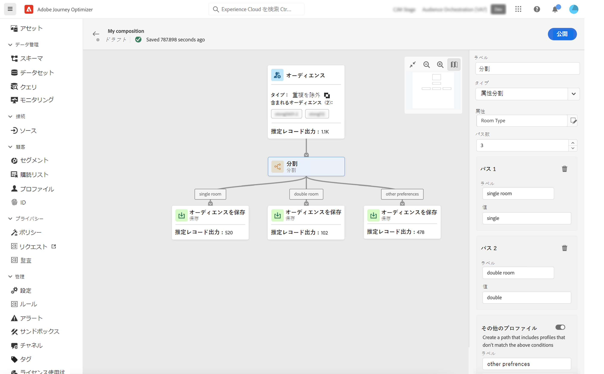
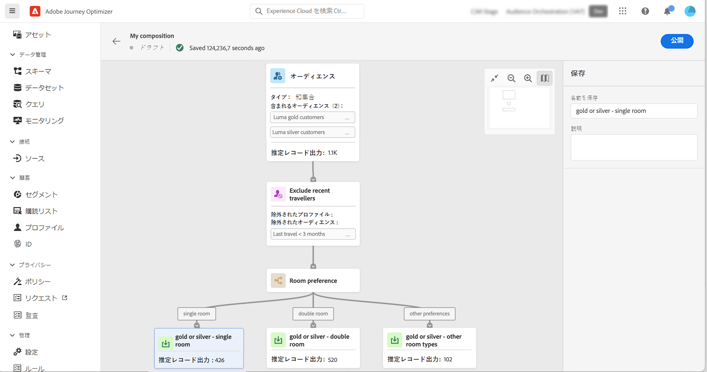

# コンポジションキャンバスの操作 {#composition-canvas}

コンポジションキャンバスは視覚的なキャンバスで、オーディエンスとアクティビティ（分割、除外など）を活用してコンポジションを作成できます。

コンポジションキャンバスでコンポジションを設定する手順は次のとおりです。

1. [開始オーディエンスを定義](#starting-audience)
1. [1 つまたは複数のアクティビティの追加](#action-activities)
1. [結果を新しいオーディエンスに保存](#save)

## 開始オーディエンスを選択 {#starting-audience}

>[!CONTEXTUALHELP]
>id="ajo_ao_merge_types"
>title="結合タイプ"
>abstract="選択したオーディエンスのプロファイルを結合する方法を指定します。"

構成を作成する最初の手順は、構成の基礎として 1 つ以上の既存のオーディエンスを選択することです。

を選択します。 **[!UICONTROL 対象ユーザ]** アクティビティを開き、 **[!UICONTROL オーディエンスを追加]** ボタンをクリックして、1 つまたは複数のオーディエンスを選択します。

この例では、ゴールドオーディエンスとシルバーオーディエンスに属するすべてのプロファイルをターゲットにします。

複数のオーディエンスを選択する場合は、これらのオーディエンスのプロファイルの結合方法を指定します。

* **[!UICONTROL 和集合]**:選択したオーディエンスのすべてのプロファイルを含める
* **[!UICONTROL 積集合]**:選択したすべてのオーディエンスに共通のプロファイルを含める。
* **[!UICONTROL 重複を除外]**:いずれかのオーディエンスにのみ属するプロファイルを含めます。 複数のオーディエンスに属するプロファイルは含まれません。

## アクティビティを追加 {#action-activities}

開始オーディエンスを選択した後にアクティビティを追加して、選択を絞り込みます。

これをおこなうには、合成パスの「 + 」ボタンをクリックし、目的のアクティビティを選択します。 右側のウィンドウが開き、アクティビティを設定できます。

>[!NOTE]
>
>追加できる数は、 **[!UICONTROL 対象ユーザ]** および **[!UICONTROL 除外]** アクティビティを作成します。 ただし、後に追加のアクティビティを追加することはできません **[!UICONTROL ランク]** および **[!UICONTROL 分割]** アクティビティ。

右側のウィンドウの削除ボタンをクリックして、アクティビティをキャンバスからいつでも削除できます。 このアクティビティの後に追加されたすべてのアクティビティもキャンバスから削除されます。

使用可能なアクティビティは次のとおりです。

* [対象ユーザ](#audience):1 つまたは複数の既存のオーディエンスに属する追加のプロファイルを含めます。
* [除外](#exclude):既存のオーディエンスに属するプロファイルを除外したり、特定の属性に基づいてプロファイルを除外したりします。
* [ランク](#rank):特定の属性に基づいてプロファイルをランク付けし、保持するプロファイルの数を指定して、構成に含めます。
* [分割](#split):ランダムな割合または属性に基づいて、コンポジションを複数のパスに分割します。

### オーディエンスアクティビティ {#audience}

>[!CONTEXTUALHELP]
>id="ajo_ao_audience"
>title="オーディエンスアクティビティ"
>abstract="「オーディエンス」アクティビティを使用すると、既存のオーディエンスに属する追加のプロファイルを構成に含めることができます。"

この **[!UICONTROL 対象ユーザ]** 「 」アクティビティを使用すると、既存のオーディエンスに属する追加のプロファイルを構成に含めることができます。

このアクティビティの設定は、開始と同じです [オーディエンスアクティビティ](#starting-audience).

### 除外アクティビティ {#exclude}

>[!CONTEXTUALHELP]
>id="ajo_ao_exclude_type"
>title="タイプを除外"
>abstract="「オーディエンスを除外」タイプを使用して、既存のオーディエンスに属するプロファイルを除外します。 「属性タイプを使用して除外」を使用すると、特定の属性に基づいてプロファイルを除外できます。"

>[!CONTEXTUALHELP]
>id="ajo_ao_exclude"
>title="除外アクティビティ"
>abstract="「除外」アクティビティを使用すると、既存のオーディエンスを選択するかルールを使用して、構成からプロファイルを除外できます。"

この **[!UICONTROL 除外]** 「 」アクティビティを使用すると、構成からプロファイルを除外できます。 除外には、次の 2 つのタイプがあります。

* **[!UICONTROL オーディエンスを除外]**:既存のオーディエンスに属するプロファイルを除外します。

   次をクリック： **[!UICONTROL オーディエンスを追加]** ボタンをクリックし、除外するオーディエンスを選択します。

   

* **[!UICONTROL 属性を使用して除外]**:特定の属性に基づいてプロファイルを除外します。

   検索する属性を選択し、除外する値を指定します。 この例では、住所が日本にある構成プロファイルから除外しています。

   

### アクティビティ A のランク付け {#rank}

>[!CONTEXTUALHELP]
>id="ajo_ao_ranking"
>title="ランキングアクティビティ"
>abstract="「ランク」アクティビティを使用すると、特定の属性に基づいてプロファイルをランク付けし、構成に含めることができます。 例えば、最大量のロイヤルティポイントを持つ 50 個のプロファイルを含めます。"

この **[!UICONTROL ランク]** 「 」アクティビティを使用すると、特定の属性に基づいてプロファイルをランク付けし、構成に含めることができます。 例えば、最大量のロイヤルティポイントを持つ 50 個のプロファイルを含めることができます。

1. 検索する属性を選択し、ランキング順（昇順または降順）を指定します。

   >[注意]
   >
   >次のデータ型を持つ属性を選択できます。整数、数値、短い <!--(other?)-->

1. 切り替え **[!UICONTROL プロファイル制限を追加]** オプションをオンにし、構成に含めるプロファイルの最大数を指定します。

   

### 分割アクティビティ {#split}

>[!CONTEXTUALHELP]
>id="ajo_ao_control_group_text"
>title="コントロール母集団"
>abstract="コントロール母集団を使用して、プロファイルの一部を分離します。 これにより、マーケティングアクティビティの影響を測定し、残りの母集団の行動と比較できます。"

>[!CONTEXTUALHELP]
>id="ajo_ao_split"
>title="分割アクティビティ"
>abstract="「分割」アクティビティを使用すると、コンポジションを複数のパスに分割できます。 構成を公開すると、パスごとに 1 つのオーディエンスがAdobe Experience Platformに保存されます。"

>[!CONTEXTUALHELP]
>id="ajo_ao_split_type"
>title="分割タイプ"
>abstract="プロファイルを複数のパスにランダムに分割するには、「割合」分割タイプを使用します。 「属性分割」タイプを使用すると、特定の属性に基づいてプロファイルを分割できます。"

この **[!UICONTROL 分割]** 「 」アクティビティを使用すると、コンポジションを複数のパスに分割できます。

この操作により、 **[!UICONTROL 保存]** 各パスの最後にあるアクティビティ 構成を公開すると、パスごとに 1 つのオーディエンスがAdobe Experience Platformに保存されます。

次の 2 種類の分割操作を使用できます。

* **[!UICONTROL 割合の分割]**:プロファイルを 2 つ以上のパスにランダムに分割します。 例えば、プロファイルをそれぞれ 45%の 2 つの異なるパスに分割し、コントロール母集団用のパスを追加できます。

   

* **[!UICONTROL 属性の分割]**:特定の属性に基づいてプロファイルを分割します。 この例では、部屋タイプの基本設定に基づいてプロファイルを分割します。

   

   >[!NOTE]
   >
   >この **[!UICONTROL その他のプロファイル]** 「 」オプションを使用すると、他のパスで指定された条件に一致しない残りのプロファイルと共に、追加のパスを作成できます。

## オーディエンスを保存する {#save}

Adobe Experience Platformに保存する結果のオーディエンスを設定します。

これをおこなうには、「 **[!UICONTROL オーディエンスを保存]** アクティビティを作成し、新しいオーディエンスの名前を指定します。

構成が準備できたら、公開できます。 [コンポジションの作成方法を学ぶ](create-compositions.md)

詳細情報:

* [オーディエンス構成の基本を学ぶ](get-started-audience-orchestration.md)
* [合成ワークフローの作成](create-compositions.md)
* [オーディエンスへのアクセスと管理](access-audiences.md)
