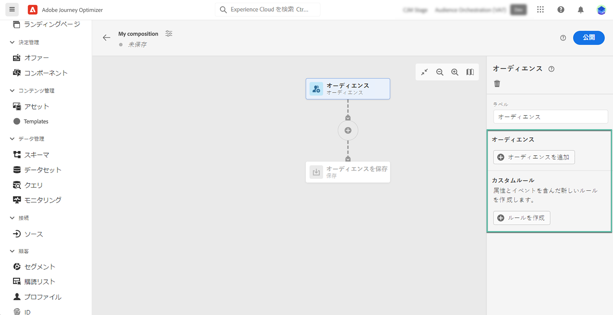

# コンポジションキャンバスの操作 {#composition-canvas}

コンポジションキャンバスは、オーディエンスとアクティビティ（分割、除外など）を活用してコンポジションを作成できる、視覚的なキャンバスです。

コンポジションキャンバスでコンポジションを設定する手順は次のとおりです。

1. [開始オーディエンスを定義する](#starting-audience)
1. [1 つ以上のアクティビティを追加する](#action-activities)
1. [結果を新しいオーディエンスに保存する](#save)

## 開始オーディエンスを選択する {#starting-audience}

コンポジションを作成する最初の手順は、コンポジションの基礎となる 1 つ以上の既存のオーディエンスを選択します。

1. を選択します。 **[!UICONTROL 対象ユーザ]** 「 」アクティビティに、アクティビティのラベルを入力します。

1. ターゲットにするオーディエンスを選択：

   * 次をクリック： **[!UICONTROL オーディエンスを追加]** ボタンをクリックして、1 つ以上の既存のオーディエンスを選択します。
   * 次をクリック： **[!UICONTROL ルールを作成]** ボタンをクリックし、 [セグメント化サービス](https://experienceleague.adobe.com/docs/experience-platform/segmentation/ui/overview.html?lang=ja).

   

1. 複数のオーディエンスを選択する場合は、これらのオーディエンスのプロファイルの結合方法を指定します。

* **[!UICONTROL 和集合]**：選択したオーディエンスのすべてのプロファイルを含めます。
* **[!UICONTROL 積集合]**：選択したすべてのオーディエンスに共通のプロファイルを含めます。
* **[!UICONTROL 重複を除外]**：いずれかのオーディエンスにのみ属するプロファイルを含めます。複数のオーディエンスに属するプロファイルは含まれません。

この例では、ゴールドオーディエンスとシルバーオーディエンスに属するすべてのプロファイルをターゲットにします。

オーディエンスを選択すると、プロファイルの推定数がアクティビティの下部に表示されます。

## アクティビティの追加 {#action-activities}

開始オーディエンスを選択した後にアクティビティを追加して、選択を絞り込みます。

これを行うには、コンポジションパスの「+」ボタンをクリックし、目的のアクティビティを選択します。右側のパネルが開き、アクティビティを設定できます。

>[!NOTE]
>
>必要な数の&#x200B;**[!UICONTROL オーディエンス]**&#x200B;アクティビティおよび&#x200B;**[!UICONTROL 除外]**&#x200B;アクティビティをコンポジションに追加できます。ただし、**[!UICONTROL ランク]**&#x200B;アクティビティおよび&#x200B;**[!UICONTROL 分割]**&#x200B;アクティビティの後に、アクティビティを追加することはできません 。

右側のパネルの削除ボタンをクリックして、アクティビティをキャンバスからいつでも削除できます。このアクティビティの後に追加されたすべてのアクティビティもキャンバスから削除されます。

使用可能なアクティビティは次のとおりです。

* [オーディエンス](#audience)：1 つ以上のオーディエンスに属する追加のプロファイルを含めます。
* [除外](#exclude)：既存オーディエンスに属するプロファイルを除外したり、特定の属性に基づいてプロファイルを除外したりします。
* [ランク](#rank)：特定の属性に基づいてプロファイルをランク付けし、保持するプロファイルの数を指定してコンポジションに含めます。
* [分割](#split)：ランダムな割合または属性に基づいて、コンポジションを複数のパスに分割します。

### オーディエンスアクティビティ {#audience}

>[!CONTEXTUALHELP]
>id="ajo_ao_audience"
>title="オーディエンスアクティビティ"
>abstract="オーディエンスアクティビティを使用すると、既存オーディエンスに属する追加のプロファイルをコンポジションに含めることができます。"

>[!CONTEXTUALHELP]
>id="ajo_ao_merge_types"
>title="結合タイプ"
>abstract="選択したオーディエンスのプロファイルを結合する方法を指定します。"

**[!UICONTROL オーディエンス]**&#x200B;アクティビティを使用すると、既存オーディエンスに属する追加のプロファイルをコンポジションに含めることができます。

このアクティビティの設定は、[オーディエンスアクティビティ](#starting-audience)の開始時と同様です。

### 除外アクティビティ {#exclude}

>[!CONTEXTUALHELP]
>id="ajo_ao_exclude_type"
>title="除外タイプ"
>abstract="除外オーディエンスタイプを使用して、既存オーディエンスに属するプロファイルを除外します。属性タイプを使用した除外では、特定の属性に基づいたプロファイルを除外できます。"

>[!CONTEXTUALHELP]
>id="ajo_ao_exclude"
>title="除外アクティビティ"
>abstract="除外アクティビティを使用すると、既存オーディエンスを選択するかルールを使用して、コンポジションからプロファイルを除外できます。"

**[!UICONTROL 除外]**&#x200B;アクティビティを使用すると、コンポジションからプロファイルを除外できます。次の 2 つのタイプの除外を使用できます。

* **[!UICONTROL オーディエンスを除外]**：既存オーディエンスに属するプロファイルを除外します。

   「**[!UICONTROL オーディエンスを追加]**」ボタンをクリックし、除外するオーディエンスを選択します。

   

* **[!UICONTROL 属性を使用して除外]**：特定の属性に基づいてプロファイルを除外します。

   検索する属性を選択し、除外する値を指定します。この例では、住所が日本にあるコンポジションプロファイルから除外します。

   

### ランクアクティビティ {#rank}

>[!CONTEXTUALHELP]
>id="ajo_ao_ranking"
>title="ランキングアクティビティ"
>abstract="ランクアクティビティを使用すると、特定の属性に基づいてプロファイルをランク付けし、コンポジションに含めることができます。例えば、最大量のロイヤルティポイントを持つ 50 件のプロファイルを含めます。"

>[!CONTEXTUALHELP]
>id="ajo_ao_rank_profilelimit_text"
>title="プロファイル制限を追加"
>abstract="このオプションをオンにして、コンポジションに含めるプロファイルの最大数を指定します。"

**[!UICONTROL ランク]**&#x200B;アクティビティを使用すると、特定の属性に基づいてプロファイルをランク付けし、コンポジションに含めることができます。例えば、最大量のロイヤルティポイントを持つ 50 件のプロファイルを含めることができます。

1. 検索する属性を選択し、ランキング順（昇順または降順）を指定します。

   >[!NOTE]
   >
   >整数、数値、短整数のデータ型を持つ属性を選択できます。<!--(other?)-->

1. 「**[!UICONTROL プロファイル制限を追加]**」オプションをオンに切り替え、コンポジションに含めるプロファイルの最大数を指定します。

   

### 分割アクティビティ {#split}

>[!CONTEXTUALHELP]
>id="ajo_ao_control_group_text"
>title="コントロール母集団"
>abstract="コントロール母集団を使用して、プロファイルの一部を分離します。これにより、マーケティングアクティビティの影響を測定し、残りの母集団の行動と比較できます。"

>[!CONTEXTUALHELP]
>id="ajo_ao_split"
>title="分割アクティビティ"
>abstract="分割アクティビティを使用すると、コンポジションを複数のパスに分割できます。コンポジションを公開すると、パスごとに 1 つのオーディエンスが Adobe Experience Platform に保存されます。"

>[!CONTEXTUALHELP]
>id="ajo_ao_split_type"
>title="分割タイプ"
>abstract="プロファイルを複数のパスにランダムに分割するには、「パーセント」分割タイプを使用します。「属性」分割タイプを使用すると、特定の属性に基づいてプロファイルを分割できます。"

>[!CONTEXTUALHELP]
>id="ajo_ao_split_otherprofiles_text"
>title="その他のプロファイル"
>abstract="他のパスで指定された条件に一致しない残りのプロファイルを含む追加のパスを作成する場合は、このオプションを切り替えてオンにします。"

**[!UICONTROL 分割]**&#x200B;アクティビティを使用すると、コンポジションを複数のパスに分割できます。

この操作により、各パスの最後にある&#x200B;**[!UICONTROL 保存]**&#x200B;アクティビティを自動的に追加できます。コンポジションを公開すると、パスごとに 1 つのオーディエンスが Adobe Experience Platform に保存されます。

次の 2 種類の分割操作を使用できます。

* **[!UICONTROL パーセント分割]**：プロファイルを 2 つ以上のパスにランダムに分割します。例えば、プロファイルをそれぞれ 45%の 2 つの異なるパスに分割し、コントロール母集団用のパスを追加できます。

   

* **[!UICONTROL 属性の分割]**：特定の属性に基づいてプロファイルを分割します。この例では、部屋タイプの希望に基づいてプロファイルを分割します。

   

   >[!NOTE]
   >
   >「**[!UICONTROL その他のプロファイル]**」オプションを使用すると、他のパスで指定された条件に一致しない残りのプロファイルと共に、追加のパスを作成できます。

## オーディエンスを保存する {#save}

Adobe Experience Platform に保存する結果のオーディエンスを設定します。

これを行うには、それぞれのパスの最後にある&#x200B;**[!UICONTROL オーディエンスを保存]**&#x200B;アクティビティを選択し、作成する新しいオーディエンスの名前を指定します。

コンポジションの準備ができたら、公開できます。[コンポジションの作成方法を説明します](create-compositions.md)

詳細情報：

* [オーディエンスコンポジションの基本を学ぶ](get-started-audience-orchestration.md)
* [コンポジションワークフローの作成](create-compositions.md)
* [オーディエンスへのアクセスと管理](access-audiences.md)
