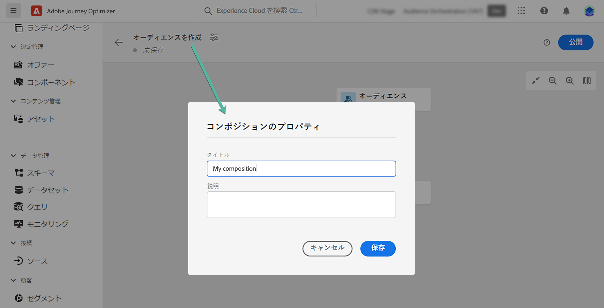

# コンポジションワークフローの作成 {#create-compositions}

コンポジションワークフローを使用すると、既存のオーディエンスを組み合わせて配置し、新しいオーディエンスを作成できます。

## コンポジションワークフローの作成 {#create}

1. **[!UICONTROL セグメント]**&#x200B;メニューにアクセスし、「**[!UICONTROL オーディエンスを作成]**」を選択します。

1. 「**[!UICONTROL オーディエンスを作成]**」を選択します。

   >[!NOTE]
   >
   >**[!UICONTROL ルールを作成]**&#x200B;の作成方法を使用すると、[セグメント化サービス](https://experienceleague.adobe.com/docs/experience-platform/segmentation/ui/overview.html?lang=ja)を使用して新しいセグメント定義を作成できます。

   

1. コンポジションキャンバスには、次の 2 つのデフォルトアクティビティが表示されます。

   * **[!UICONTROL オーディエンス]**：コンポジションの出発点。このアクティビティを使用すると、ワークフローの基礎として 1 つ以上のオーディエンスを選択できます。

   * **[!UICONTROL 保存]**：コンポジションの最後の手順。このアクティビティを使用すると、ワークフローの結果を新しいオーディエンスに保存できます。
   コンポジションワークフローキャンバスでアクティビティを設定する方法について詳しくは、[コンポジションキャンバスの操作](composition-canvas.md)を参照してください。

1. 構成プロパティを開き、タイトルと説明を指定します。

   プロパティでタイトルが定義されていない場合、コンポジションラベルは最初のタイトルになります **[!UICONTROL 対象ユーザ]** アクティビティ。

   

1. **[!UICONTROL オーディエンス]**&#x200B;アクティビティおよび&#x200B;**[!UICONTROL 保存]**&#x200B;アクティビティの間に必要な数のアクティビティを追加して、コンポジションを設定します。[コンポジションキャンバスの操作方法を学ぶ](composition-canvas.md)

   

1. 構成が完了したら、 **[!UICONTROL 公開]** ボタンをクリックして、構成を公開し、結果のオーディエンスをAdobe Experience Platformに保存します。

   公開中にエラーが発生した場合は、問題の解決方法に関する情報と共にアラートが表示されます。

   

1. コンポジションが公開されます。 結果のオーディエンスはAdobe Experience Platformに保存され、Journey Optimizerキャンペーンでターゲットにする準備が整います。 [キャンペーンの基本を学ぶ](../campaigns/get-started-with-campaigns.md)

## コンポジションへのアクセス {#access}

>[!CONTEXTUALHELP]
>id="ajo_ao_publish"
>title="オーディエンスの公開"
>abstract="コンポジションを公開して、結果のオーディエンスを Adobe Experience Platform に保存します。"

「**[!UICONTROL コンポジション]**」タブから作成したすべてのコンポジションにアクセスできます。複数のステータスがあります。

* **[!UICONTROL ドラフト]**：コンポジションは進行中で、公開されていません。
* **[!UICONTROL 公開済み]**:構成が公開され、結果のオーディエンスが保存され、使用できるようになりました。
* **[!UICONTROL アーカイブ済み]**：コンポジションはアーカイブされています。

>[!NOTE]
>
>既存のコンポジションは、リストの「...」ボタンを使用して、いつでも複製または削除できます。

詳細情報：

* [オーディエンスコンポジションの基本を学ぶ](get-started-audience-orchestration.md)
* [コンポジションキャンバスの操作](composition-canvas.md)
* [オーディエンスへのアクセスと管理](access-audiences.md)
