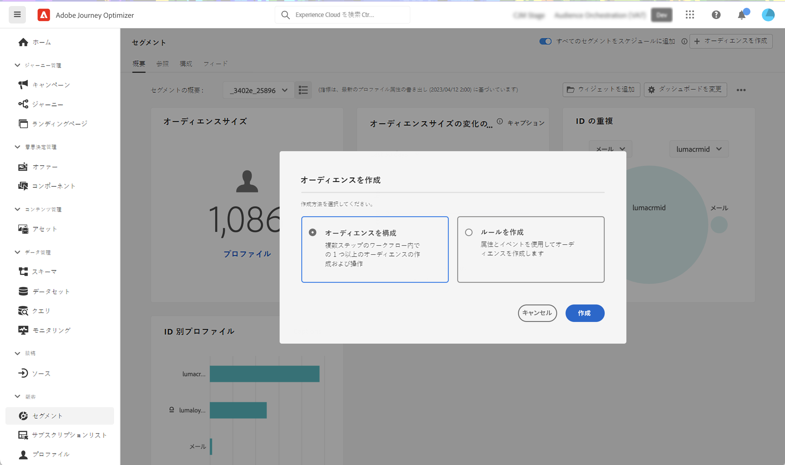
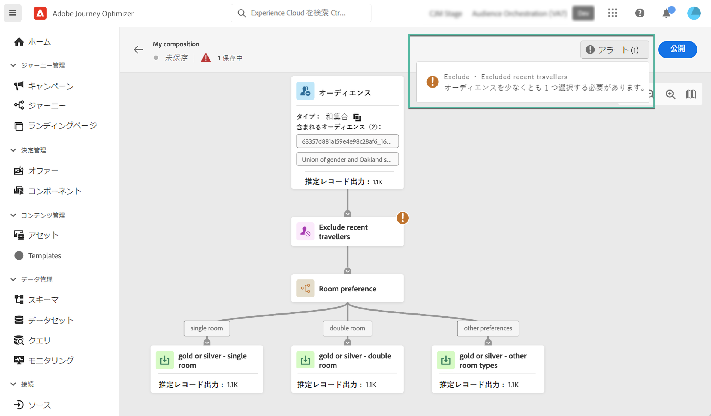
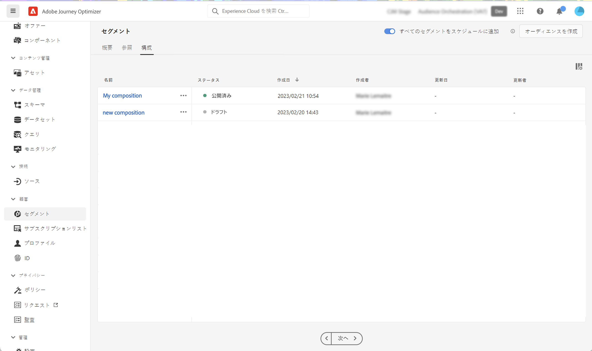

# 合成ワークフローの作成 {#create-compositions}

合成ワークフローを使用すると、既存のオーディエンスを組み合わせて配置し、新しいオーディエンスを作成できます。

## 構成ワークフローの作成 {#create}

1. 次にアクセス： **[!UICONTROL セグメント]** メニューと選択 **[!UICONTROL オーディエンスを作成]**.

1. 選択 **[!UICONTROL オーディエンスを作成]**.

   >[!NOTE]
   >
   >この **[!UICONTROL ルールを作成]** 作成方法を使用すると、 [セグメント化サービス](https://experienceleague.adobe.com/docs/experience-platform/segmentation/pql/overview.html?lang=ja).

   

1. コンポジションキャンバスには、次の 2 つのデフォルトアクティビティが表示されます。

   * **[!UICONTROL 対象ユーザ]**:構成の開始点。 このアクティビティを使用すると、ワークフローの基礎として 1 つ以上のオーディエンスを選択できます。

   * **[!UICONTROL 保存]**:構成の最後のステップ。 このアクティビティを使用すると、ワークフローの結果を新しいオーディエンスに保存できます。
   合成ワークフローキャンバスでアクティビティを設定する方法について詳しくは、 [コンポジションキャンバスの操作](composition-canvas.md).

1. を選択します。 **[!UICONTROL 対象ユーザ]** 「 」アクティビティを選択し、構成のラベルを指定します。

   >[!IMPORTANT]
   >
   >この **[!UICONTROL 対象ユーザ]** アクティビティラベルは、構成のラベルです。 リスト内で構成をより簡単に取得できるよう、わかりやすい名前を付けてください。

   

1. 必要な数のアクティビティを **[!UICONTROL 対象ユーザ]** および **[!UICONTROL 保存]** アクティビティ。 [コンポジションキャンバスの操作方法を説明します。](composition-canvas.md)

   

1. 構成が完了したら、 [**!UICONTROL 公開]**ボタンをクリックして、構成を公開し、結果のオーディエンスをAdobe Experience Platformに保存します。

   公開中にエラーが発生した場合は、問題の解決方法に関する情報と共にアラートが表示されます。

   

1. 構成が公開されます。 結果のオーディエンスは、Adobe Experience Platformに保存されます。 <!-- and are ready to be targeted in Journey Optimizer campaigns. [Get started with campaigns](../campaigns/get-started-with-campaigns.md)-->

## コンポジションにアクセス {#access}

>[!CONTEXTUALHELP]
>id="ajo_ao_publish"
>title="オーディエンスを公開"
>abstract="構成を公開して、結果のオーディエンスをAdobe Experience Platformに保存します。"

作成したすべてのコンポジションには、 **[!UICONTROL 構成]** タブをクリックします。 次の複数のステータスを持つことができます。

* **[!UICONTROL ドラフト]**:コンポジションは進行中で、公開されていません。
* **[!UICONTROL 公開済み]**:構成が公開されたので、結果のオーディエンスが保存されました。 <!-- and are available for use.-->
* **[!UICONTROL アーカイブ済み]**:構成はアーカイブされました。

>[!NOTE]
>
>既存のコンポジションは、リストの楕円形ボタンを使用して、いつでも複製または削除できます。

詳細情報:

* [オーディエンス構成の基本を学ぶ](get-started-audience-orchestration.md)
* [コンポジションキャンバスの操作](composition-canvas.md)
* [オーディエンスへのアクセスと管理](access-audiences.md)
