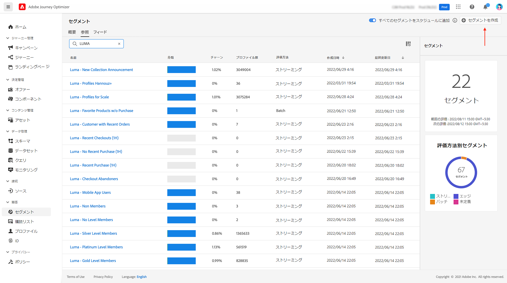
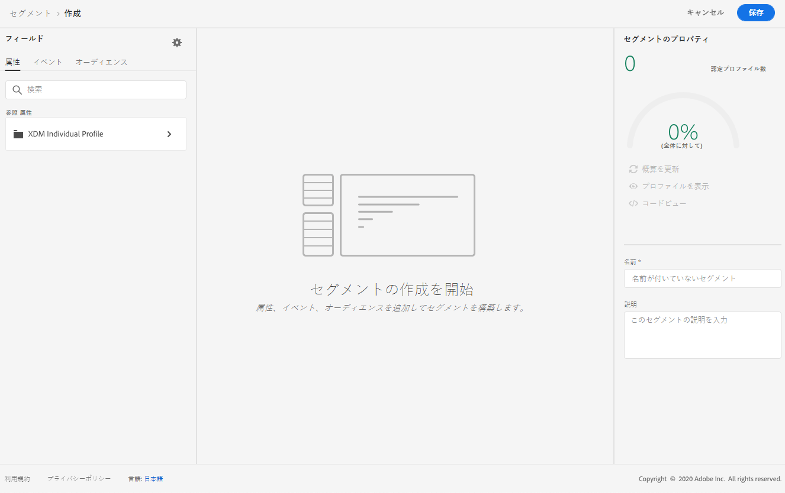
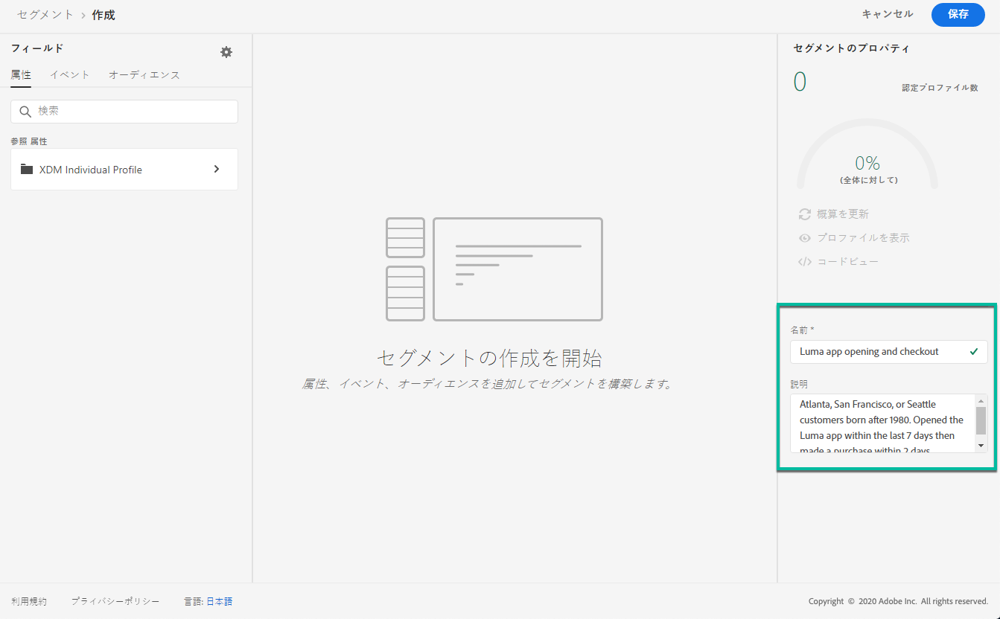
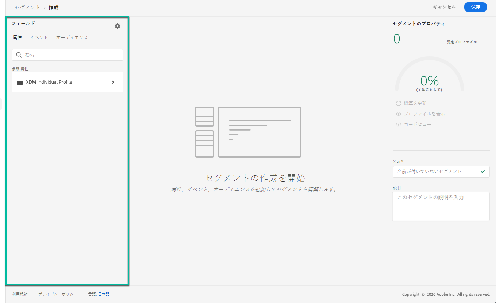
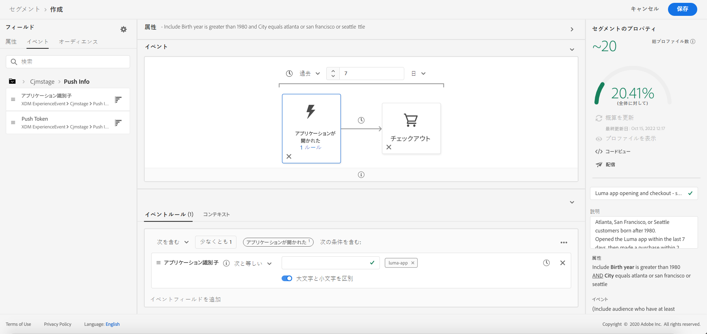
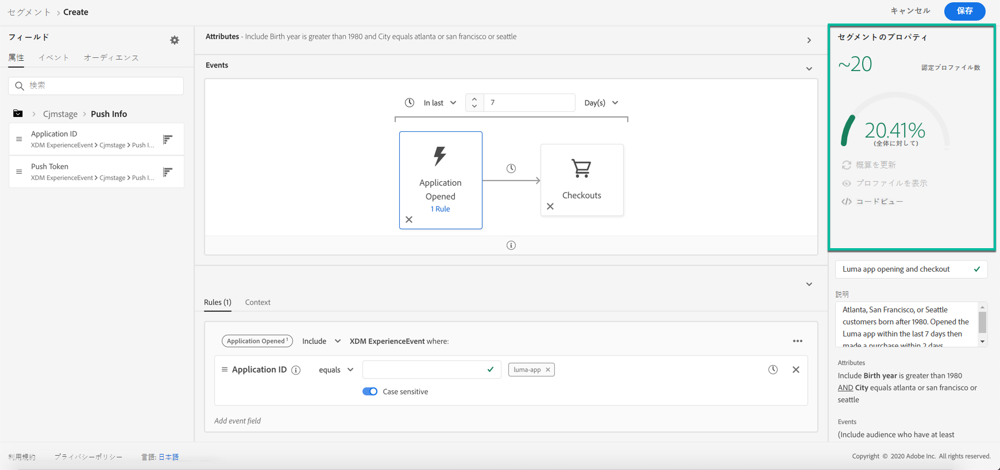

# セグメントの構築 {#build-segments}

>[!CONTEXTUALHELP]
>id="ajo_ao_create_rule"
>title="ルールの作成"
>abstract="構築ルールの作成方法では、Adobe エクスペリエンスプラットフォームセグメンテーションサービスを使用して、新しいセグメント定義を作成することができます。"

この例では、アトランタ、サンフランシスコ、シアトル、出生のすべての顧客を対象として1980の後に、そのセグメントを構築します。 これらのすべてのユーザーは過去7日間にルミナンスアプリケーションを開いた後、アプリケーションを起動してから2時間以内に購入することになりました。

➡️ [ では、このビデオにセグメントを作成する方法について説明しています。](#video-segment)

1. **[!UICONTROL Segments]**&#x200B;メニューにアクセスし、ボタンをクリック **[!UICONTROL Create segment]** します。

   

   「セグメント定義」画面では、セグメントを定義するために必要なすべてのフィールドを設定することができます。 セグメンテーションサービスマニュアル ](https://experienceleague.adobe.com/docs/experience-platform/segmentation/ui/overview.html) のセグメントを設定する方法については、{target = &quot;_blank 「}」を参照して [ ください。

   

1. **[!UICONTROL Segment properties]**&#x200B;ペインで、セグメントの名前と説明を入力します (オプション)。

   

1. 必要に応じて、左側のペインから中央のワークスペースにフィールドをドラッグ &amp; ドロップします。

   >[!NOTE]
   >
   >左側のペインに表示されるフィールドは、組織に設定されている xdm の個別の **プロファイル** と **xdm ExperienceEvent** スキーマによって異なります。  エクスペリエンスデータモデル (XDM) マニュアル ](https://experienceleague.adobe.com/docs/experience-platform/xdm/home.html) の詳細については、{target = &quot;_blank 「}」を参照して [ ください。

   

   この例では、「属性 **」フィールドと** 「イベント **」フィールドに** 基づいてセグメントを構築する必要があります。

   * **属性** : 1980 の後に、アトランタ、サンフランシスコ、シアトルに住むプロファイル

      

   * **イベント** : 過去7日間にルミナンスアプリケーションを開いてから、アプリケーションを起動してから2時間以内に購入しました。

      

1. ワークスペースで新しいフィールドを追加および設定すると、 **[!UICONTROL Segment Properties]** そのセグメントに属する見積もりプロファイルに関する情報が自動的に表示されます。

   

1. セグメントの準備が完了したら、をクリック **[!UICONTROL Save]** します。 Adobe エクスペリエンスプラットフォームセグメントのリストに表示されます。 検索バーを使用して、リスト内の特定のセグメントを検索することができます。

これで、セグメントが journeys に使用できるようになりました。 詳細については、ここ ](../segment/about-segments.md) を [ 参照してください。

## 操作方法のビデオ{#video-segment}

セグメントの作成方法について説明します。

>[!VIDEO](https://video.tv.adobe.com/v/334281?quality=12)
