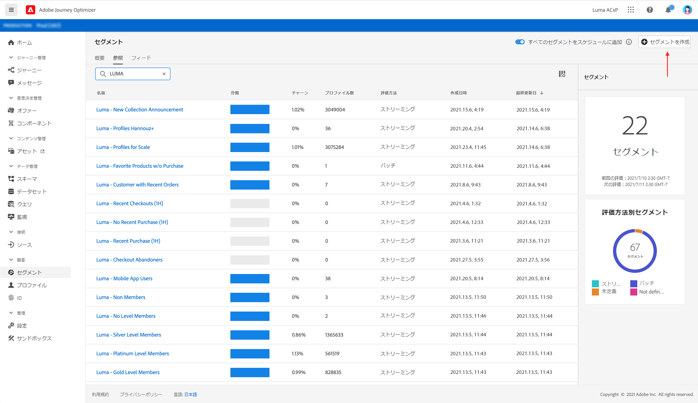
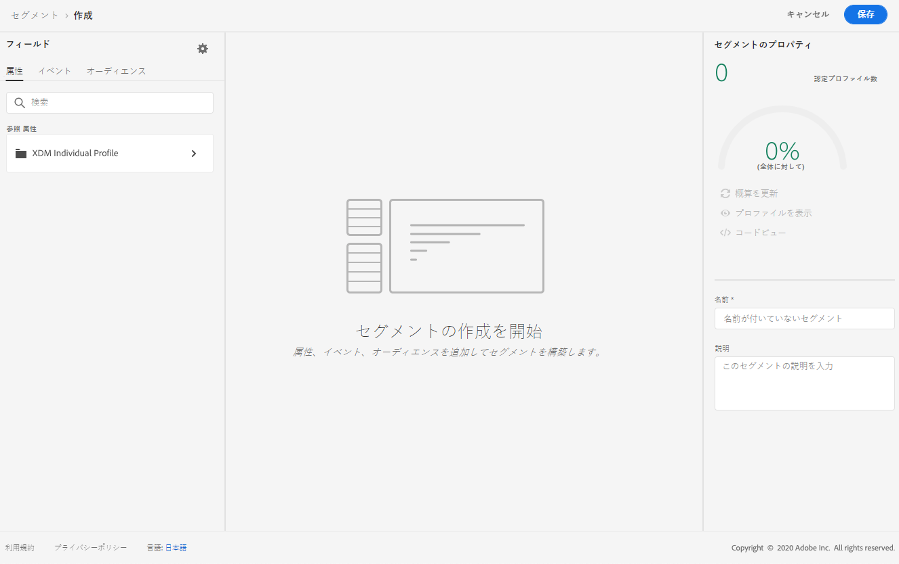
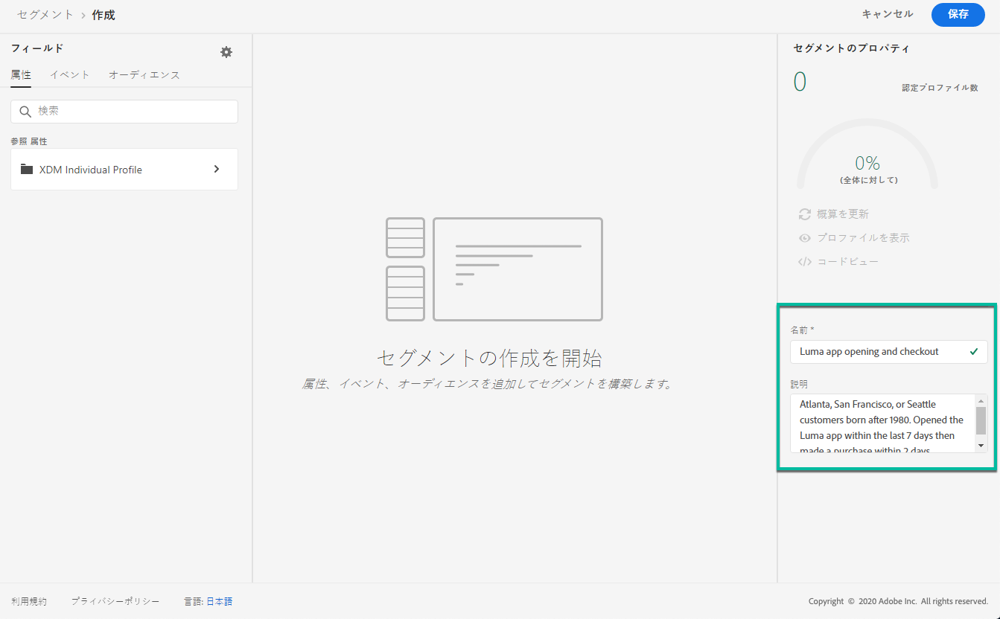
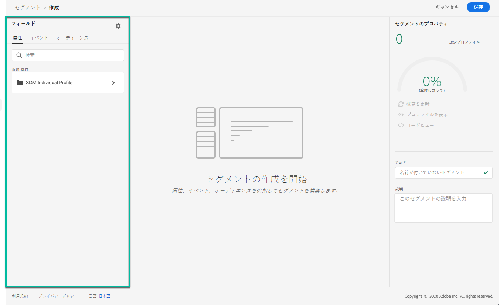
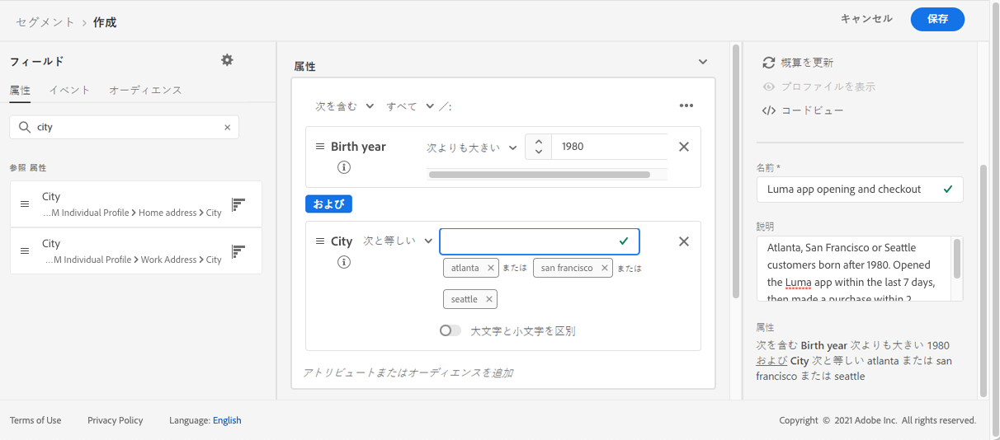
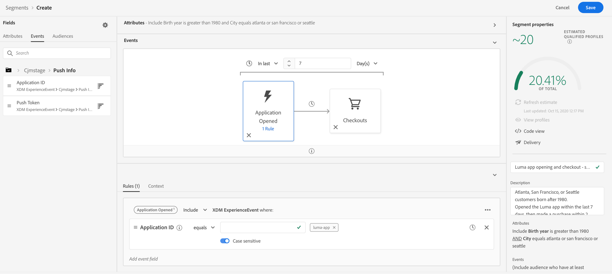

# セグメントの構築 {#build-segments}

この例では、アトランタ、サンフランシスコ、シアトルに住み、1980年以降に生まれたすべての顧客をターゲットするセグメントを作成します。 これらのすべてのお客様は、過去7日以内にLumaアプリを開き、その後2時間以内に購入する必要があります。

1. **[!UICONTROL セグメント]**&#x200B;メニューにアクセスし、「**[!UICONTROL セグメントを作成]**」ボタンをクリックします。

   

   [セグメント定義]画面では、必須フィールドをすべて設定してセグメントを定義できます。 [Segmentation Serviceドキュメント](https://experienceleague.adobe.com/docs/experience-platform/segmentation/ui/overview.html)でセグメントを設定する方法を説明します。

   

1. **[!UICONTROL セグメントプロパティ]**&#x200B;ペインで、セグメントの名前と説明（オプション）を入力します。

   

1. 必要なフィールドを左ペインから中央のワークスペースにドラッグ&amp;ドロップし、必要に応じて設定します。

   >[!NOTE]
   >
   >左側のウィンドウに表示されるフィールドは、**XDM個別プロファイル**&#x200B;と&#x200B;**XDM ExperienceEvent**&#x200B;のスキーマが組織で設定されている方法によって異なります。  詳しくは、[エクスペリエンスデータモデル(XDM)ドキュメント](https://experienceleague.adobe.com/docs/experience-platform/xdm/home.html?lang=ja)を参照してください。

   

   この例では、**属性**&#x200B;と&#x200B;**イベント**&#x200B;の各フィールドを使用してセグメントを作成する必要があります。

   * **属性**:1980年以降、アトランタ、サンフランシスコ、シアトルに住むプロファイル
   * **イベント**:過去7日間にLumaアプリを開き、その後、アプリを開いてから2時間以内に購入したプロファイル。

      

      

1. ワークスペースに新しいフィールドを追加および設定する際に、**[!UICONTROL セグメントのプロパティ]**&#x200B;ペインが自動的に更新され、セグメントに属する予測プロファイルに関する情報が表示されます。

   

1. セグメントの準備が整ったら、「**[!UICONTROL 保存]**」をクリックします。 これは、Adobe Experience Platformセグメントのリストに表示されます。 リスト内の特定のセグメントを検索する際に役立つ検索バーが用意されています。

これで、セグメントをジャーニーで使用できるようになります。 詳しくは、[こちらの節](../segment/about-segments.md)を参照してください。
