# テストプロファイルの作成 {#create-test-profiles}

「テスト」モード ](../building-journeys/testing-the-journey.md) を使用して [ コンテンツ ](../email/preview.md) のプレビューとテストを行う [ 際には、テストプロファイルが必要になります。

テストプロファイルを作成するには、いくつかの方法があります。 このページの詳細については、次の項目を参照してください。

* [既存のプロファイル ](#turning-profile-into-test) をテストプロファイルに変換

* Csv ファイルをアップロード [ するか、API 呼び出し ](#create-test-profiles-api) を使用 [ して、テストプロファイルを作成し ](#create-test-profiles-csv) ます。

   この2つの方法に加え、Adobe 旅オプティマイザーには [ 、テストプロファイルの作成を容易にするための製品内使用 ](#use-case-1) 方法が用意されています。

また、既存のデータセットに json ファイルをアップロードすることもできます。 この方法について詳しくは、Data インジェストのマニュアル ](https://experienceleague.adobe.com/docs/experience-platform/ingestion/tutorials/ingest-batch-data.html#add-data-to-dataset) を参照してください {target = &quot;_blank 「}」を [ 参照してください。

テストプロファイルの作成は、Adobe エクスペリエンスプラットフォームでの定期的なプロファイルの作成と似ています。 詳しくは、リアルタイムカスタマープロファイルの [ マニュアル ](https://experienceleague.adobe.com/docs/experience-platform/profile/home.html) {target = &quot;_blank&quot;} を参照してください。

➡️ [ このビデオでテストプロファイルを作成する方法について説明しています。](#video)

## 知識 {#test-profile-prerequisites}

プロファイルを作成できるようにするために、まず Adobe [!DNL Journey Optimizer] でスキーマとデータセットを作成する必要があります。

スキーマ **を作成するに** は、次の手順に従います。

1. 「データ管理」セクションで、をクリック **[!UICONTROL Schemas]** します。
   
1. **[!UICONTROL Create schema]**&#x200B;右上の「XDM **」というスキーマタイプ** を選択します。
   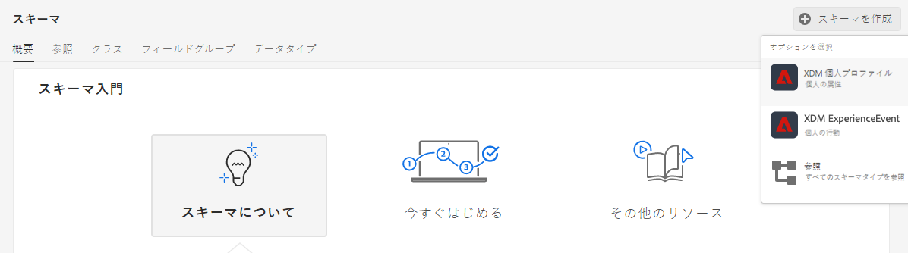
1. 適切なフィールドグループを選択します。 「プロファイルの詳細 **」フィールドグループが** 追加されていることを確認してください。
   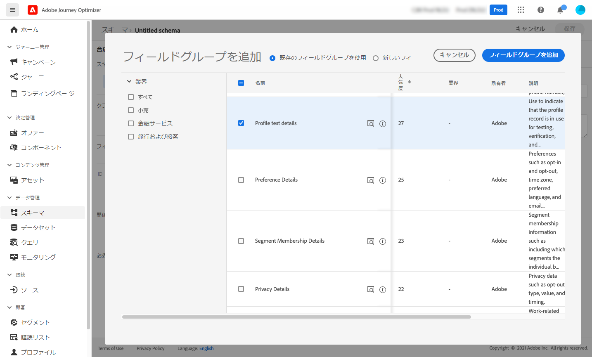完了したら、次のボタンをクリックし **[!UICONTROL Add field groups]** ます。フィールドグループのリストは、スキーマ概要画面に表示されます。
   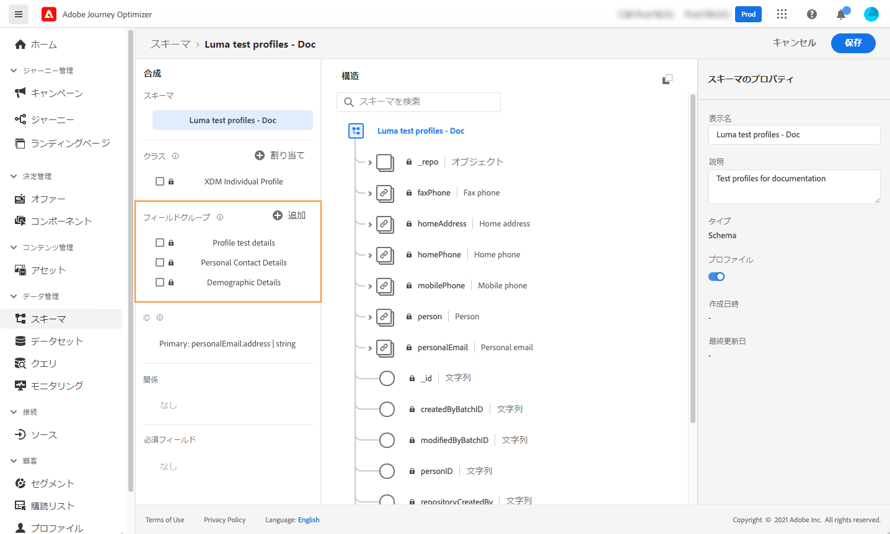

   >[!NOTE]
   >
   >* スキーマの名前をクリックして変更し、プロパティを更新します。
   >
   >* **[!UICONTROL Add]**「フィールドグループ」セクションのボタンをクリックして、スキーマに追加する他のフィールドグループを選択します。


1. フィールドのリストで、プライマリ id として定義するフィールドをクリックします。
   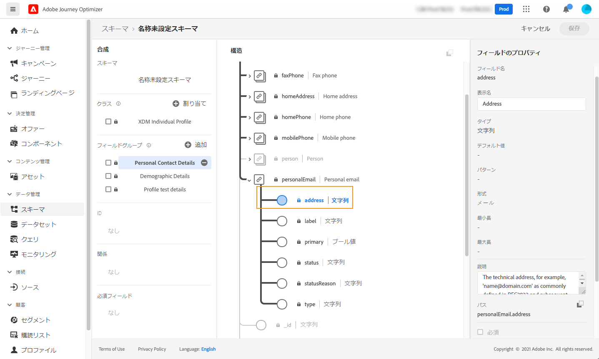
1. **[!UICONTROL Field properties]**&#x200B;右側のペインで、「」オプションと「 **[!UICONTROL Identity]** **[!UICONTROL Primary Identity]** オプション」をオンにして、名前空間を選択します。プライマリ id を電子メールアドレスにする場合は、名前空間を選択 **[!UICONTROL Email]** します。 をクリック **[!UICONTROL Apply]** します。
   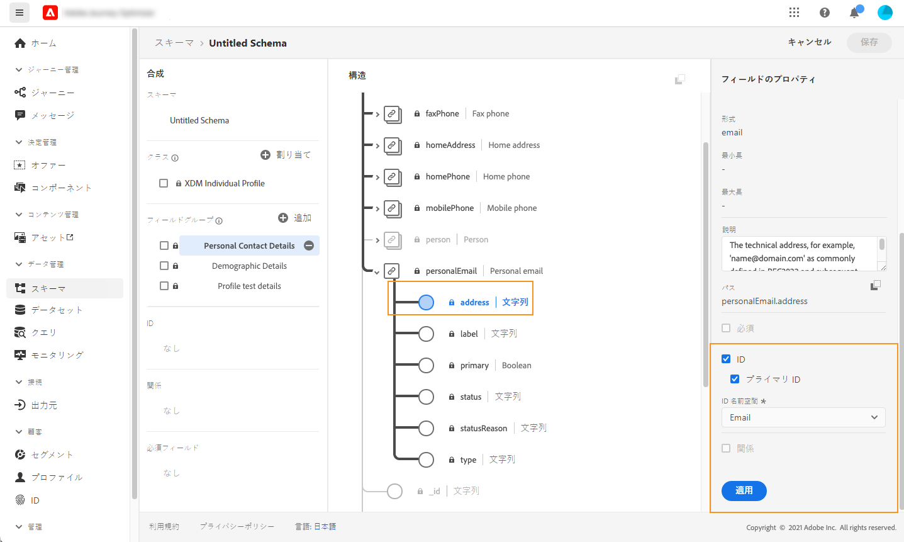
1. スキーマを選択し、 **[!UICONTROL Schema properties]** ウィンドウでオプションを有効に **[!UICONTROL Profile]** します。
   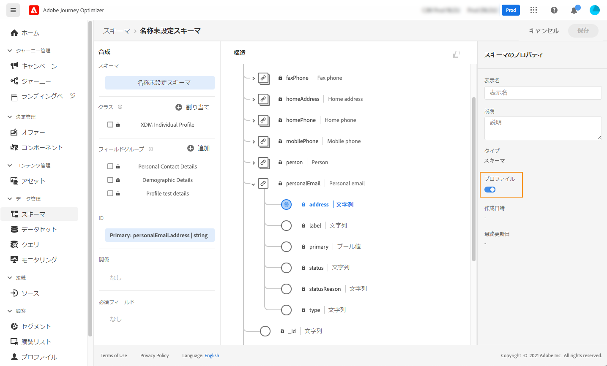
1. 「保存 **」をクリックし** ます。

>[!NOTE]
>
>スキーマ作成について詳しくは、XDM のマニュアル ](https://experienceleague.adobe.com/docs/experience-platform/xdm/ui/resources/schemas.html#prerequisites) (target = &quot;_blank&quot;} を [ 参照してください。

その後、プロファイルがインポートされるデータセット **を作成する** 必要があります。以下の手順を実行します。

1. を **[!UICONTROL Datasets]** 参照し、をクリック **[!UICONTROL Create dataset]** します。
   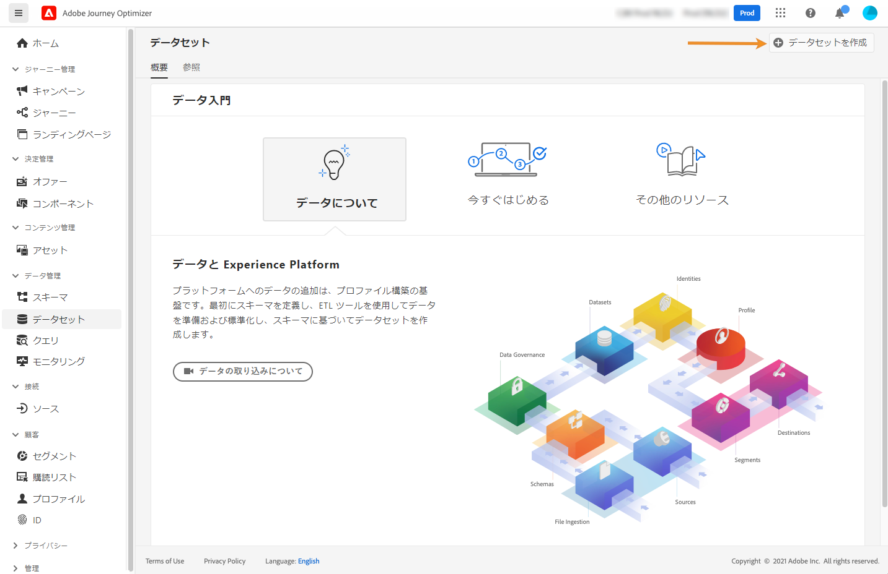
1. 「」を選択 **[!UICONTROL Create dataset from schema]** します。
   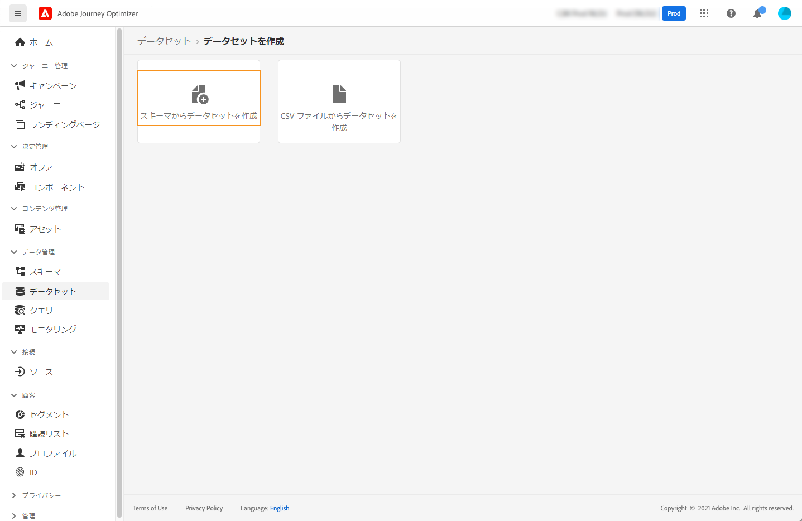
1. 以前に作成したスキーマを選択し、をクリック **[!UICONTROL Next]** します。
   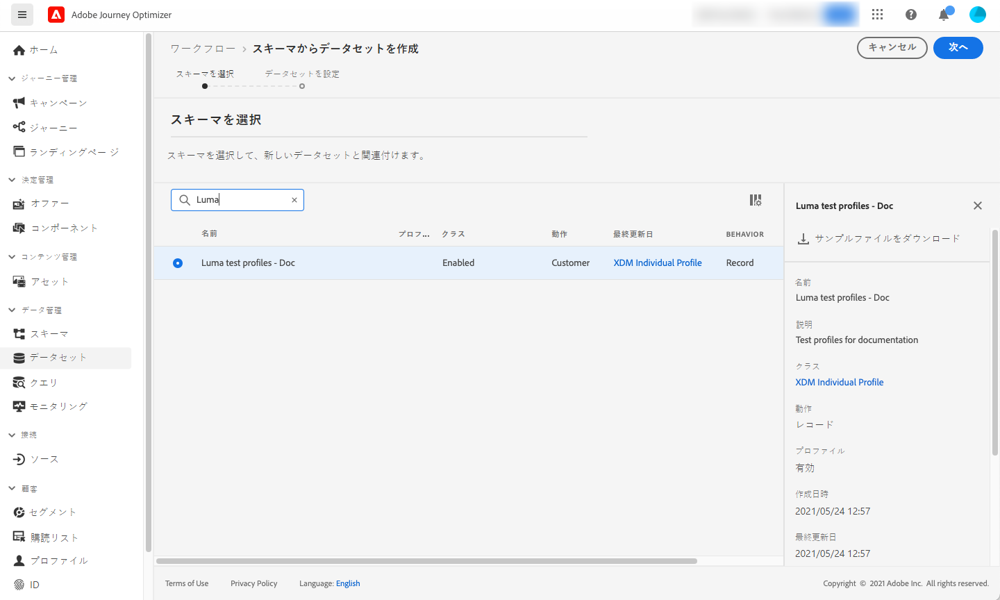
1. 名前を選択し、をクリック **[!UICONTROL Finish]** します。
   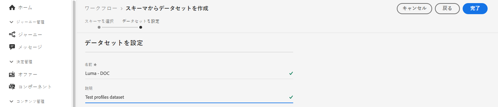
1. **[!UICONTROL Profile]**このオプションを有効にします。
   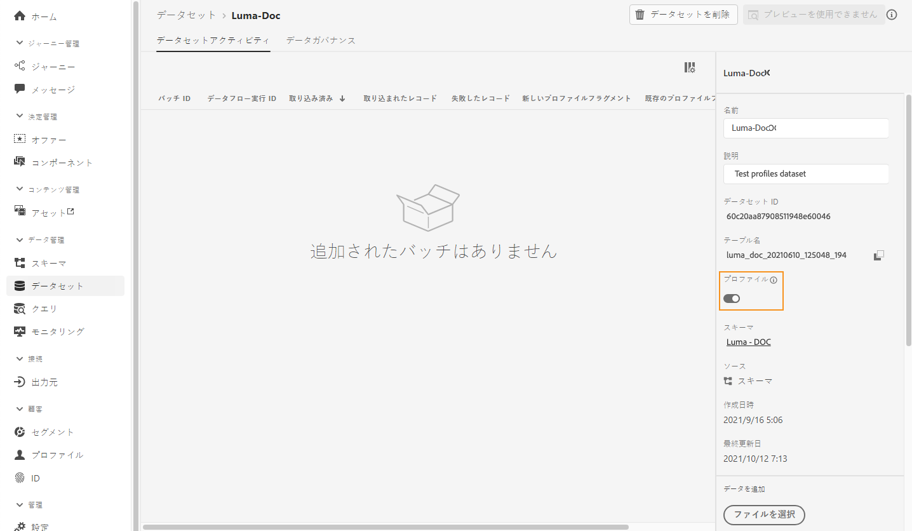

>[!NOTE]
>
> データセットを作成する方法について詳しくは、カタログサービスの [ マニュアル ](https://experienceleague.adobe.com/docs/experience-platform/catalog/datasets/user-guide.html#getting-started) {target = &quot;_blank&quot;} を参照してください。

## 製品内使用例{#use-case-1}

Adobe 旅オプティマイザーのホームページから、「製品内のテストプロファイル」を利用できます。 これを使用すると、パブリッシュ前に journeys をテストするために使用されるテストプロファイルの作成が容易になります。

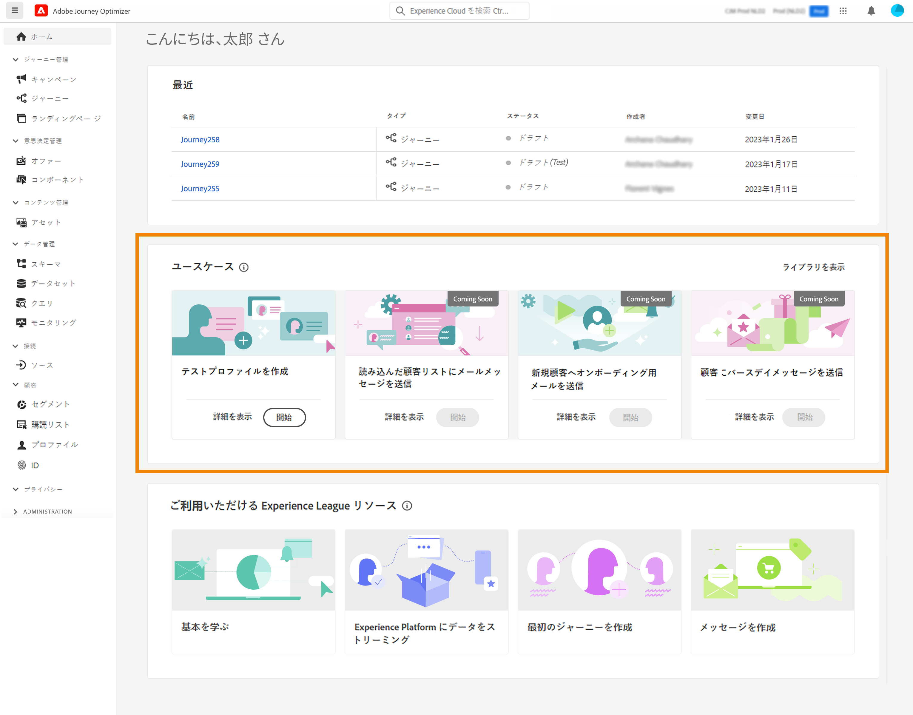

**[!UICONTROL Begin]**&#x200B;ボタンをクリックして、ユースケースを起動します。

次の情報が必要です。

1. **Id 名前空間** : [ テストプロファイルを一意に識別するために使用される id 名前空間 ](../segment/get-started-identity.md) 。 例えば、テストプロファイルの識別に電子メールを使用している場合は、id 名前空間 **電子メール** を選択する必要があります。 一意の識別子が電話番号である場合は、id 名前空間 **の電話** を選択します。

2. **CSV ファイル** : 作成するテストプロファイルのリストを含むカンマ区切りファイルです。 このユースケースには、作成するテストプロファイルのリストが含まれている CSV ファイルに事前に定義されたフォーマットがあることを前提としています。 このファイルの各行には、次のように、正しい順序で次のフィールドを指定する必要があります。

   1. **人物 Id** : テストプロファイルの一意の識別子。 このフィールドの値には、選択した id 名前空間が反映されている必要があります。 (例えば、 **「電話** 」が選択されている場合は、このフィールドの値は「電話番号」にする必要があります。 同様に、電子メール **を選択した場合** は、このフィールドの値を電子メールにします。
   1. **電子メールアドレス** : プロファイルの電子メールアドレスをテストします。 (その **電子メール** が id 名前空間として選択されている場合 **、「個人 Id** 」フィールドと「電子メールアドレス **」フィールドに** 同じ値が含まれる可能性があります。
   1. **最初の名前** : プロファイルの名前をテストします。
   1. ****&#x200B;姓名: プロファイルの名前をテストします。
   1. **市区町村** : 住居のテストプロファイル街
   1. **Country** : 住居のテストの国
   1. **性別** : Test profile 性別をテストします。 使用できる値は男性 **、女性** **、** non_specified です **。**

Id 名前空間を選択し、上記の形式に基づいて CSV ファイルを指定した後、右上の「ボタン」をクリック **[!UICONTROL Run]** します。 このような場合は、使用が完了するまで数分かかることがあります。 ユースケースが処理を完了してテストプロファイルを作成すると、ユーザーに通知する通知が送信されます。

>[!NOTE]
>
>テストプロファイルによって、既存のプロファイルが上書きされることがあります。 ユースケースを実行する前に、CSV にテストプロファイルのみが含まれ、正しいサンドボックスに対して実行されることを確認してください。

## プロファイルのテストプロファイルへの変換{#turning-profile-into-test}

既存のプロファイルをテストプロファイルにすることができます。プロファイル属性は、プロファイルを作成するときと同じように更新することができます。

これを行う簡単な方法は、旅においてアクションアクティビティーを使用 **[!UICONTROL Update Profile]** して、testprofile **ブールフィールドを false から true に変更** することです。

お客様の旅は、a **[!UICONTROL Read Segment]** と **[!UICONTROL Update Profile]** activity で構成されます。 最初に、テストプロファイルに入れるプロファイルを対象とするセグメントを作成する必要があります。

>[!NOTE]
>
> Testprofile **フィールドを更新** する必要があるので、選択したプロファイルにこのフィールドを含める必要があります。関連するスキーマには、 **「プロファイルの詳細** 」フィールドグループが含まれている必要があります。 この項 ](../segment/creating-test-profiles.md#test-profiles-prerequisites) を参照してください [ 。

1. セグメントに **** **移動し、セグメント** を右上に作成します。
   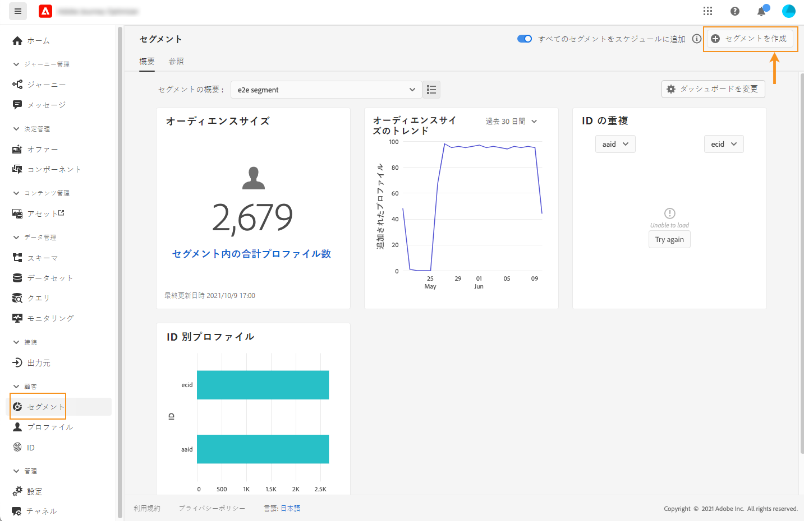
1. セグメントの名前を定義して、セグメントを作成します。必要に応じて、フィールドと値を選択して、プロファイルの対象を指定します。
   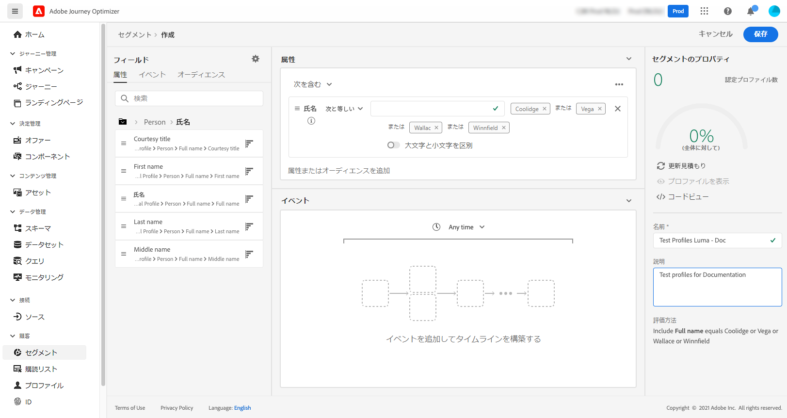
1. 「保存 **」をクリック** して、プロファイルが適切に対象とされているかどうかを確認します。
   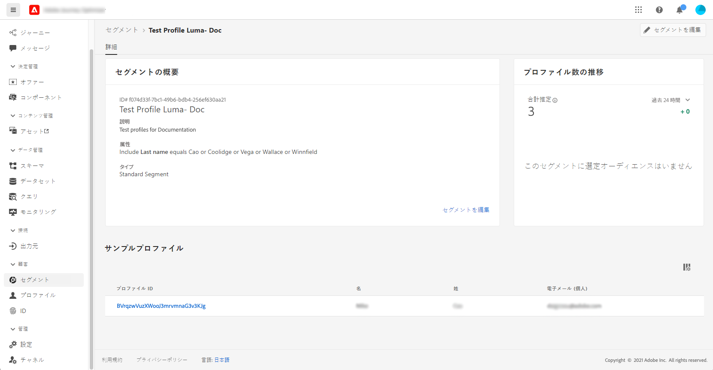

   >[!NOTE]
   >
   > セグメントの計算には時間がかかることがあります。 この節 ](../segment/about-segments.md) では、 [ セグメントについて詳しく説明しています。

1. では、新しい旅を作成して、オーケストレーション操作から開始 **[!UICONTROL Read Segment]** してみましょう。
1. 以前に作成したセグメントと、プロファイルで使用する名前空間を選択します。
   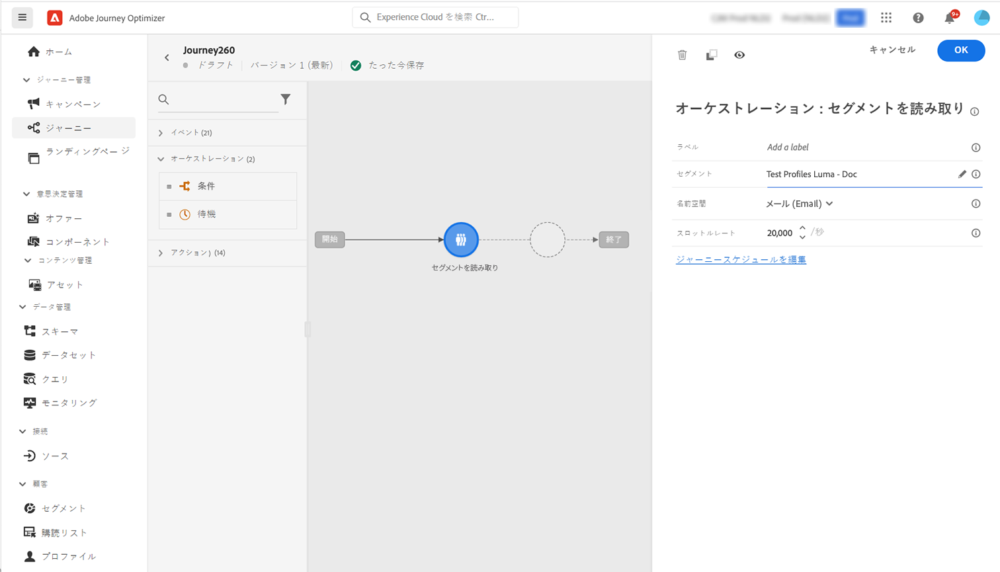
1. アクションアクティビティを **[!UICONTROL Update Profile]** 追加します。
1. スキーマ、 **testprofiles** フィールド、データセットを選択して、値を True **に** 設定します。これ **[!UICONTROL VALUE]** を行うには、フィールドの右側にあるペン **アイコンをクリック** して、true **を選択&#x200B;**[!UICONTROL Advanced mode]**し** ます。
   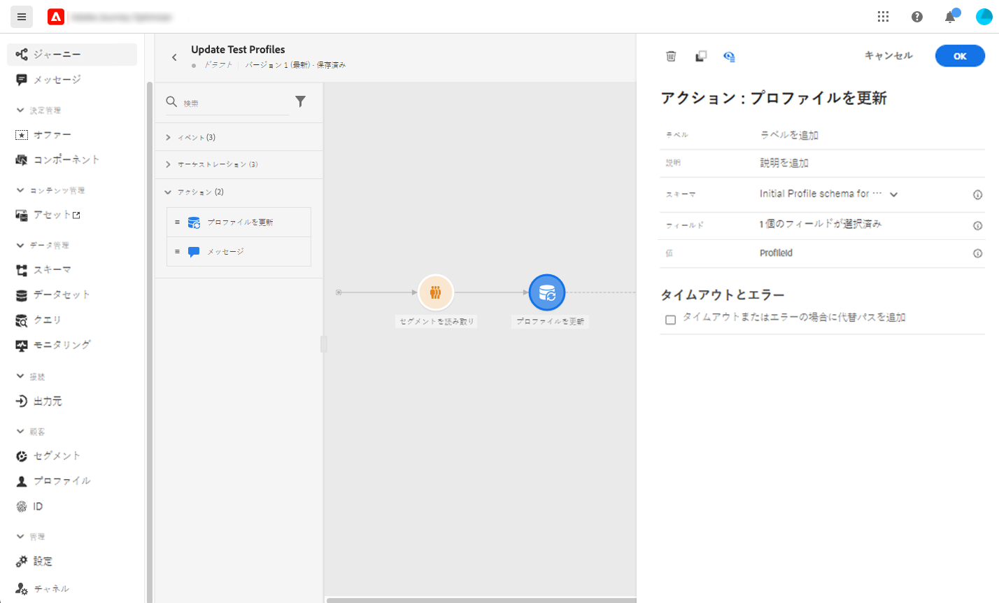
1. をクリック **[!UICONTROL Publish]** します。
1. **[!UICONTROL Segments]**セクションで、プロファイルが正しく更新されたかどうかを確認してください。
   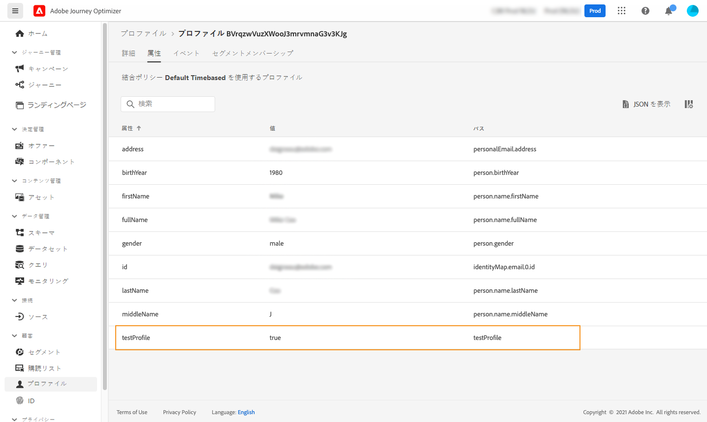

   >[!NOTE]
   >
   > このアクティビティに **[!UICONTROL Update Profile]** ついて詳しくは、次の項 ](../building-journeys/update-profiles.md) を [ 参照してください。

## Csv ファイルを使用したテストプロファイルの作成{#create-test-profiles-csv}

Adobe エクスペリエンスプラットフォームでは、各種のプロファイルフィールドを含む csv ファイルをデータセットにアップロードすることによって、プロファイルを作成することができます。 これは、最も簡単な方法です。

1. スプレッドシートソフトウェアを使用して、簡単な csv ファイルを作成します。
1. 必要なフィールドごとに1つの列を追加します。 最初の id フィールド (上の例では &quot;personID&quot;) および &quot;testProfile&quot; フィールドに「true」が設定されていることを確認してください。
   
1. プロファイルごとに1つの行を追加し、各フィールドに値を入力します。
   
1. スプレッドシートを csv ファイルとして保存します。 区切り文字としてカンマを使用しているかどうかを確認してください。
1. Adobe エクスペリエンスプラットフォーム **のワークフロー** を参照します。
   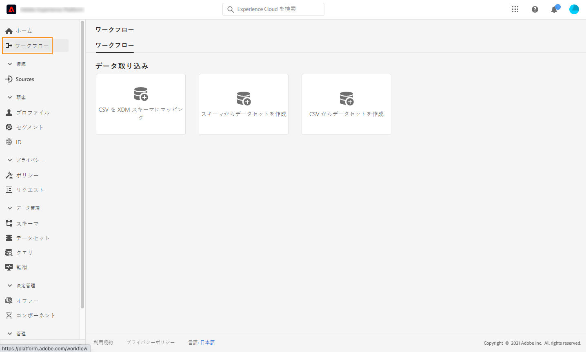
1. 「A を XDM スキーマ **にマップします」を選択してから、「起動** 」 **をクリック** します。
   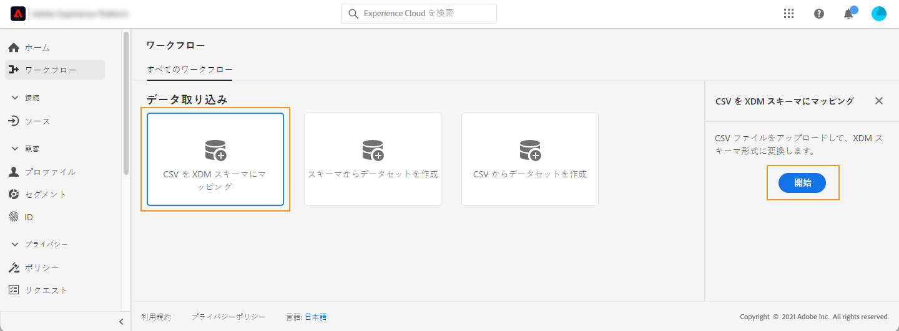
1. プロファイルのインポート先となるデータセットを選択します。 「次へ」 **をクリックし** ます。
   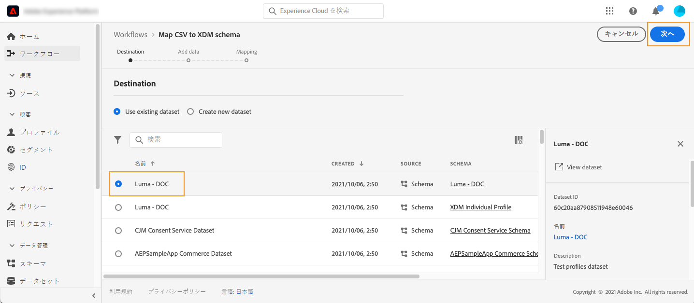
1. 「ファイル **を選択」をクリック** し、csv ファイルを選択します。ファイルがアップロードされたら、「次へ」 **をクリックし** ます。
   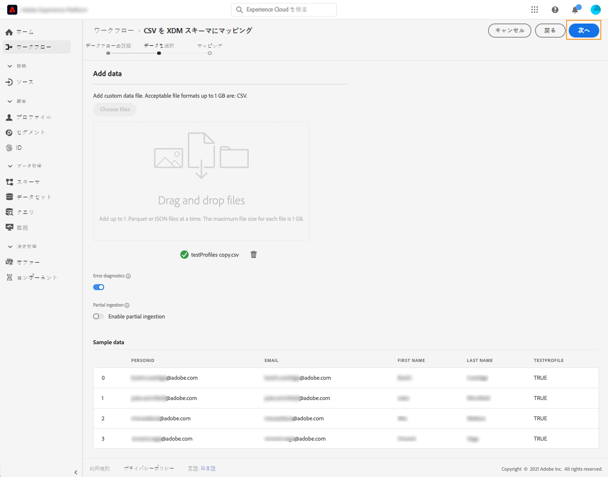
1. 「ソース .csv」フィールドを「スキーマ」フィールドにマップし、「完了」 **をクリック** します。
   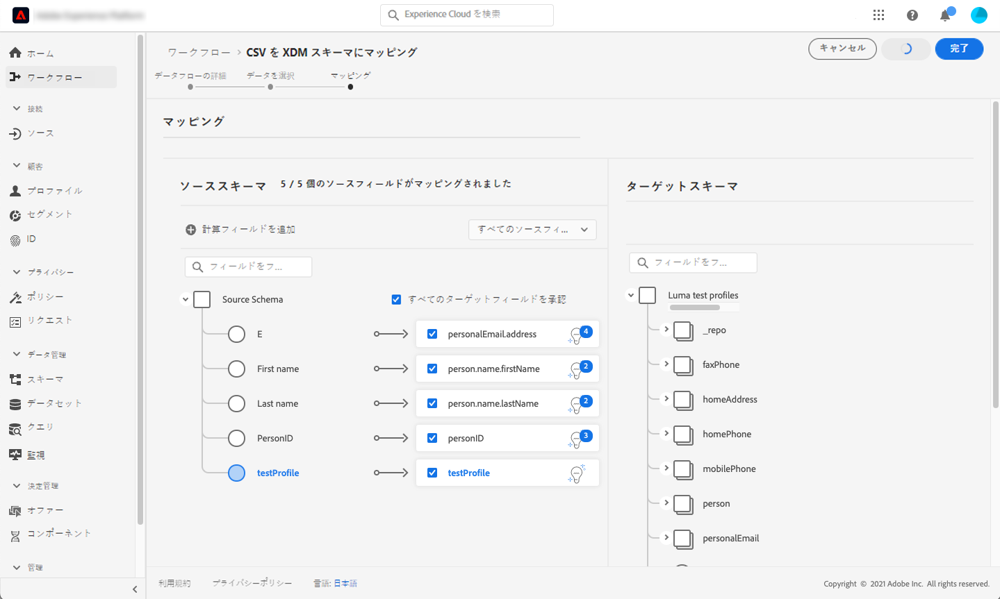
1. データの読み込みが開始されます。 状態は処理中 **から** 正常 **に** 移行されます。右上にある「データセット **のプレビュー」をクリックし** ます。
   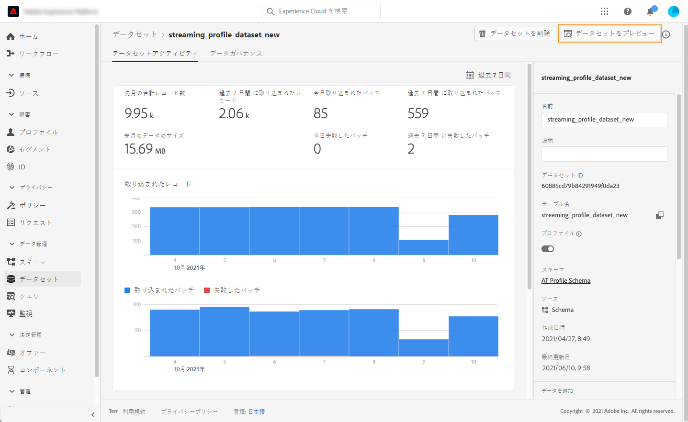
1. テストプロファイルが正しく追加されているかどうかを確認してください。
   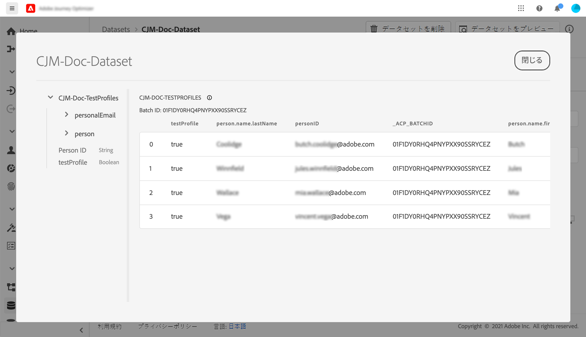

テストプロファイルが追加され、旅をテストするときに使用できるようになりました。 この項 ](../building-journeys/testing-the-journey.md) を [ 参照してください。
>[!NOTE]
>
> Csv のインポートについて詳しくは、Data インジェストのマニュアル ](https://experienceleague.adobe.com/docs/experience-platform/ingestion/tutorials/map-a-csv-file.html#tutorials) を参照してください {target = &quot;_blank 「}」を [ 参照してください。

## API 呼び出しを使用したテストプロファイルの作成{#create-test-profiles-api}

API 呼び出しを使用してテストプロファイルを作成することもできます。 Adobe エクスペリエンスプラットフォームのマニュアル ](https://experienceleague.adobe.com/docs/experience-platform/profile/home.html) について詳しくは、「target = &quot;_blank&quot;}」を [ 参照してください。

&quot;Profile details&quot; フィールドグループが含まれているプロファイルスキーマを使用する必要があります。 TestProfile フラグは、このフィールドグループに含まれています。プロファイルの作成時には、次のような値を渡します。この場合は、testProfile = true を指定します。

既存のプロファイルを更新して、testProfile フラグを「true」に変更することもできます。

テストプロファイルを作成するための API 呼び出しの例を次に示します。

```
curl -X POST \
'https://dcs.adobedc.net/collection/xxxxxxxxxxxxxx' \
-H 'Cache-Control: no-cache' \
-H 'Content-Type: application/json' \
-H 'Postman-Token: xxxxx' \
-H 'cache-control: no-cache' \
-H 'x-api-key: xxxxx' \
-H 'x-gw-ims-org-id: xxxxx' \
-d '{
"header": {
"msgType": "xdmEntityCreate",
"msgId": "xxxxx",
"msgVersion": "xxxxx",
"xactionid":"xxxxx",
"datasetId": "xxxxx",
"imsOrgId": "xxxxx",
"source": {
"name": "Postman"
},
"schemaRef": {
"id": "https://example.adobe.com/mobile/schemas/xxxxx",
"contentType": "application/vnd.adobe.xed-full+json;version=1"
}
},
"body": {
"xdmMeta": {
"schemaRef": {
"contentType": "application/vnd.adobe.xed-full+json;version=1"
}
},
"xdmEntity": {
"_id": "xxxxx",
"_mobile":{
"ECID": "xxxxx"
},
"testProfile":true
}
}
}'
```

## 操作方法のビデオ {#video}

テストプロファイルの作成方法について説明します。

>[!VIDEO](https://video.tv.adobe.com/v/334236?quality=12)
