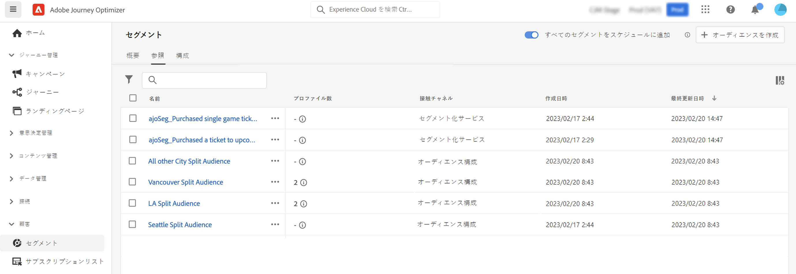

# オーディエンスコンポジションの基本を学ぶ {#get-start-audience-composition}

>[!CONTEXTUALHELP]
>id="ajo_ao_create_composition"
>title="コンポジションの作成"
>abstract="コンポジションワークフローを作成し、既存の Adobe Experience Platform オーディエンスをビジュアルキャンバスに組み合わせ、様々なアクティビティ（分割、除外など）を活用して新しいオーディエンスを作成します。"

>[!BEGINSHADEBOX]

このドキュメントの内容は次のとおりです。

* **[オーディエンスコンポジションの基本を学ぶ](get-started-audience-orchestration.md)**
* [最初のコンポジションワークフローの作成](create-compositions.md)
* [コンポジションキャンバスの操作](composition-canvas.md)
* [オーディエンスへのアクセスと管理](access-audiences.md)

>[!ENDSHADEBOX]

>[!AVAILABILITY]
>
>オーディエンスの構成は、現時点では、限られたグループの顧客のみが利用できます。 ご質問がある場合は、Adobe担当者にお問い合わせください。

オーディエンス構成を使用すると、**コンポジションワークフロー**&#x200B;を作成できます。これにより、既存の Adobe Experience Platform オーディエンスをビジュアルキャンバスに組み合わせ、様々なアクティビティ（分割、除外など）を活用して新しいオーディエンスを作成できます。

完了したら、 **結果オーディエンス** は、既存のオーディエンスと共にAdobe Experience Platformに保存され、でのターゲット顧客に利用できます。 [Journey Optimizerキャンペーン](../campaigns/get-started-with-campaigns.md)またはAdobe [Real-time Customer Data Platformの宛先](https://experienceleague.adobe.com/docs/experience-platform/destinations/home.html?lang=ja).

>[!IMPORTANT]
>
>現時点では、構成ワークフローから生成されたオーディエンスは、ジャーニーで使用できません。
>
>Adobe Journey Optimizerのキャンペーンは、まだポリシー実施サービスと統合されていません。 したがって、オーディエンス属性に適用するデータ使用ラベルは、Journey Optimizerキャンペーンでは適用されません。

オーディエンスコンポジションには、Adobe Journey Optimizer の&#x200B;**[!UICONTROL セグメント]**&#x200B;メニューからアクセスできます。

* 「**[!UICONTROL 概要]**」タブには、組織のセグメントデータに関連する主要指標を含む専用のダッシュボードが表示されます。 詳しくは、[Adobe Experience Platform のダッシュボードガイド](https://experienceleague.adobe.com/docs/experience-platform/dashboards/guides/segments.html?lang=ja)を参照してください。

* 「**[!UICONTROL 参照]**」タブには、Adobe Experience Platform に保存されている既存のオーディエンスがすべて表示されます。

* 「**[!UICONTROL コンポジション]**」タブを使用すると、オーディエンスを組み合わせて新しいオーディエンスを作成するコンポジションワークフローを作成できます。

各カードをクリックして、オーディエンスコンポジションを使用する方法を確認してください。

<table style="table-layout:fixed"><tr style="border: 0;">
<td>

<a href="create-compositions.md"><strong>最初のコンポジションワークフローの作成</strong></a>
</td>
<td>

<a href="composition-canvas.md"><strong>コンポジションキャンバスの操作</strong></a>
</td>
<td>

<a href="access-audiences.md"><strong>オーディエンスへのアクセスと管理</strong></a>
</td>
</tr></table>
