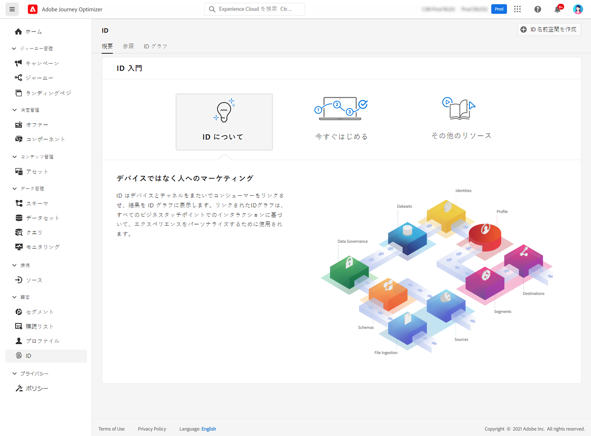

# Id について学習します。 {#identities-gs}

アイデンティティとは、実体に対して一意のデータです。通常は個別の人物です。 ログイン ID、その他の id、ロイヤルティ ID は、既知の id として参照されます。

個人を特定できる情報 (PII) (電子メールアドレス、電話番号など) を使用すると、カスタマーを直接特定できます。 その結果、PII は、システム全体にわたって、顧客の複数のアイデンティティを検索するために使用されます。

で [!DNL Adobe Journey Optimizer] は、 **デバイスとチャネルで id** へのリンクを作成すると、その結果は [ 恒等グラフ ](#id-graph) になります。 リンクされたアイデンティティーグラフは、すべてのビジネス touchpoints でのインタラクションに基づいてエクスペリエンスをカスタマイズするために使用されます。

このドキュメント ](https://experienceleague.adobe.com/docs/experience-platform/identity/home.html) の Id サービス **について詳しくは、{target = &quot;_blank 「}」を [ 参照して** ください。

## Identity 名前空間 {#identity-namespaces}

**Identity namespace** は、id が関連付けられているコンテキストのインジケーターとして機能する Id サービスのコンポーネントです。 例えば、1つの `name@email.com` 値を電子メールアドレス、または `443522` CRM ID として使用することができます。 Id 名前空間の使用については、様々な Adobe エクスペリエンスプラットフォームサービスについて理解しておく必要があります。 名前空間の操作を開始する前に、次のサービスのマニュアルを参照してください。

このドキュメント ](https://experienceleague.adobe.com/docs/experience-platform/identity/namespaces.html) の Identity namespace **について詳しくは、{target = &quot;_blank&quot;} を [ 参照して** ください。

## Id グラフ{#id-graph}

**アイデンティティグラフ** は、特定の顧客についてのアイデンティティ間の関係のマップであり、様々なチャンネル間でユーザーが自分のブランドとどのように作用するかを視覚的に表現したものです。お客様の状況に対応して、すべての顧客 id グラフは、ほぼリアルタイムで、Adobe エクスペリエンス Platform Id サービスによってまとめて管理および更新されています。

ユーザーインターフェイスに [!DNL Adobe Journey Optimizer] 表示されている id グラフビューアを使用すると、顧客 id が stitched になり、どのような意味があるかを視覚化し、理解を深めることができます。 このビューアでは、グラフの異なる部分をドラッグして操作することができるので、複雑なアイデンティティ関係を調べてより効率的にデバッグできます。また、情報を使用している場合の透過性が向上します。

このドキュメント ](https://experienceleague.adobe.com/docs/experience-platform/identity/ui/identity-graph-viewer.html) の Id グラフ **について詳しくは、{target = &quot;_blank 「}」を [ 参照して** ください。
