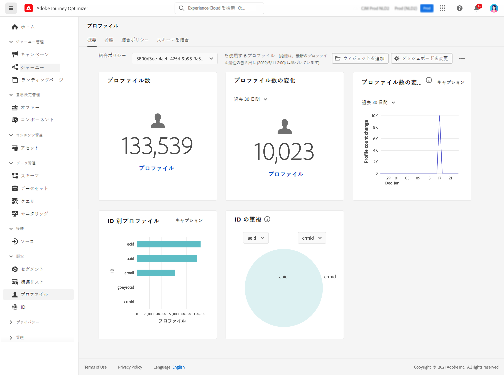

# プロファイルの利用開始 {#profiles-gs}

では、リアルタイムの [!DNL Adobe Journey Optimizer] お客様のプロファイルを活用して、オンライン、オフライン、CRM、サードパーティなどの複数のチャネルのデータを組み合わせることによって、個々のお客様の全体像を把握することができます。 **プロファイル** によって顧客データを統合ビューに統合することで、すべての顧客とのやり取りについて、タイムスタンプのアクションを実行することができます。

>[!NOTE]
>
>アクティブなプロファイルデータセットまたは結合ポリシーを [!DNL Adobe Journey Optimizer] 作成していない場合、その組織ではプロファイル **の** ダッシュボードが表示されません。その代わりに、「概要 **」タブには** 、Adobe エクスペリエンスプラットフォームマニュアルへのリンクが表示されます。これは、リアルタイムのカスタマープロファイルについて学習するのに役立ちます。

プロファイルダッシュボード **にアクセスして操作** する方法、およびダッシュボードに表示されるメトリックスに関する詳細情報については、このセクション ](https://experienceleague.adobe.com/docs/experience-platform/profile/ui/user-guide.html) {target = &quot;_blank&quot;} を [ 参照してください。

複数のソースからデータフラグメントを取り込み、それらを組み合わせて、個々の顧客の完全なビューを表示することができます。 このデータを組み合わせる際には、統合ポリシーはデータの優先度を決定するために使用されるルールで、統合されたビューを作成するために組み合わされるデータはどのようなものになります。

この [ マニュアル ](https://experienceleague.adobe.com/docs/experience-platform/profile/merge-policies/ui-guide.html) の「マージポリシー **について詳しくは、{target = &quot;_blank&quot;}」を参照して** ください。

**関連項目**

* [実際にお客様向けのプロファイルマニュアル ](https://experienceleague.adobe.com/docs/experience-platform/query/home.html) {target = &quot;_blank&quot;}
* [リアルタイムのカスタマープロファイル概要ビデオ ](https://experienceleague.adobe.com/docs/experience-platform/profile/home.html) {target = &quot;_blank&quot;}
