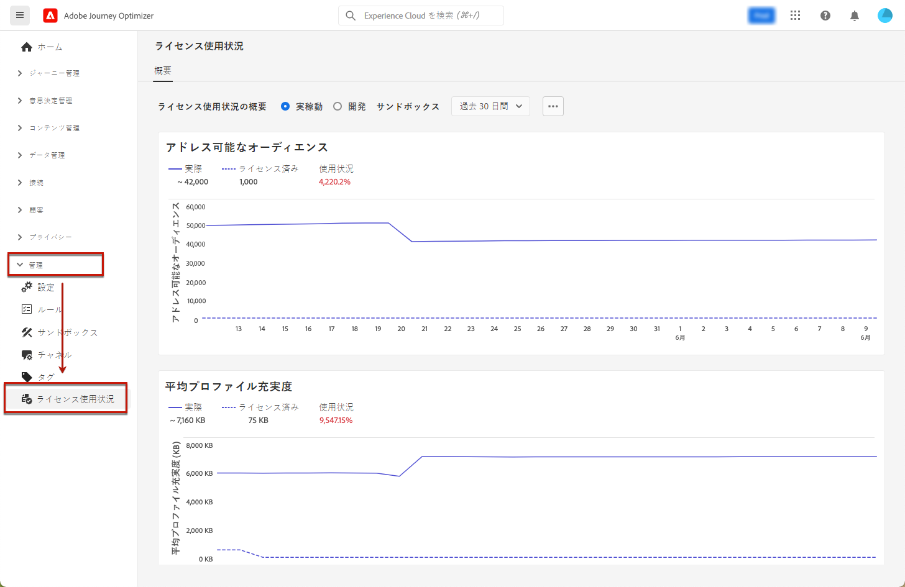

# ライセンス使用状況ダッシュボード {#license-usage}

[!DNL Adobe Journey Optimizer] [ユーザーインターフェイス](../start/user-interface.md)は、毎日のスナップショットでキャプチャされた、組織のライセンス使用状況に関する重要な情報を表示するダッシュボードを提供します。

このダッシュボードにアクセスするには、**[!UICONTROL 管理]**／**[!UICONTROL ライセンスの使用状況]**&#x200B;に移動します。これにより、ダッシュボードに表示される「**[!UICONTROL 概要]**」タブを開きます。

>[!NOTE]
>
>ダッシュボードを表示するには、[ライセンス使用状況ダッシュボードを表示](https://experienceleague.adobe.com/docs/experience-platform/dashboards/permissions.html?lang=ja#available-permissions){target=&quot;_blank&quot;}権限を付与されている必要があります。

詳しくは、Adobe Experience Platform ドキュメントを参照してください。

* [ライセンス使用状況ダッシュボードの概要](https://experienceleague.adobe.com/docs/experience-platform/dashboards/guides/license-usage.html?lang=ja){target=&quot;_blank&quot;}
* [ライセンス使用状況ダッシュボードの確認](https://experienceleague.adobe.com/docs/experience-platform/dashboards/guides/license-usage.html?lang=ja#exploring-the-license-usage-dashboard){target=&quot;_blank&quot;}
* [使用可能な指標](https://experienceleague.adobe.com/docs/experience-platform/dashboards/guides/license-usage.html?lang=ja#available-metrics){target=&quot;_blank&quot;}
