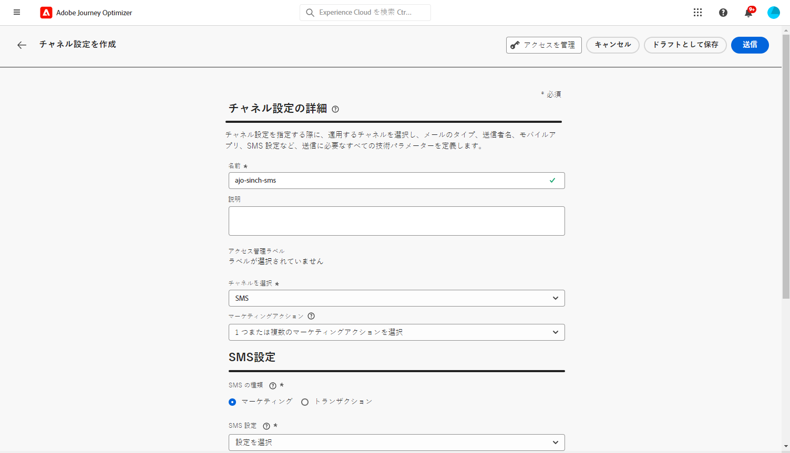
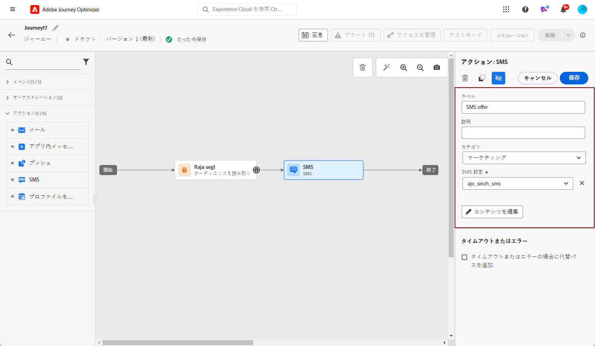
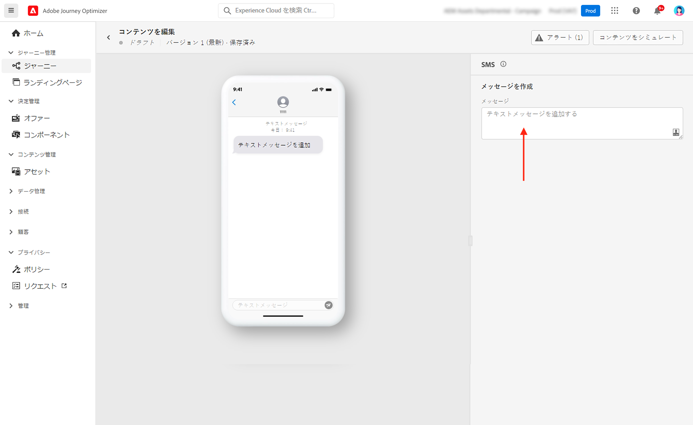
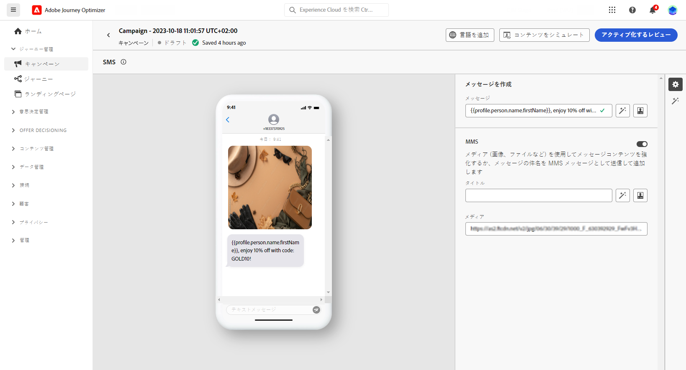

# MMS メッセージの作成 {#create-mms}

## 前提条件{#sms-prerequisites}

SMS メッセージを作成する前に、まず Journey Optimizer を使用して SMS ベンダーを設定する必要があります。次の手順に従います。

* SMS を送信する前に、プロバイダー設定を Journey Optimizer と統合する必要があります。

+++ 新しい Sinch MMS API 資格情報を作成する方法を説明します。

   1. 左側のパネルで、**[!UICONTROL 管理]**／**[!UICONTROL チャネル]**&#x200B;を参照し、**[!UICONTROL API 資格情報]**&#x200B;メニューを選択します。「**[!UICONTROL 新しい API 資格情報の作成]**」ボタンをクリックします。

      

   1. SMS API 資格情報を設定します。

   * **[!DNL Sinch MMS]** の場合：

      * **[!UICONTROL 名前]**：API 資格情報の名前を選択します。

      * **[!UICONTROL プロジェクト ID]**、**[!UICONTROL アプリ ID]** および **[!UICONTROL API トークン]**：Conversation API メニューから、アプリメニューで資格情報を見つけることができます。[詳細情報](https://docs.cc.sinch.com/cloud/service-configuration/en/oxy_ex-1/common/wln1620131604643.html)

     

   1. API 資格情報の設定が完了したら、「**[!UICONTROL 送信]**」をクリックします。

  API 資格情報を作成して設定した後、SMS メッセージ用のチャネルサーフェス（メッセージプリセットなど）を作成する必要があります。

+++

* 完了したら、SMS サーフェスを作成する必要があります。 これらの手順は、Adobe Journey Optimizer システム管理者が実行する必要があります。

+++ チャネルサーフェスの作成方法を説明します。

   1. 左側のパネルで、**[!UICONTROL 管理]**／**[!UICONTROL チャネル]**&#x200B;を参照し、**[!UICONTROL ブランディング]**／**[!UICONTROL チャネルサーフェス]**&#x200B;を選択します。「**[!UICONTROL チャネルサーフェスを作成]**」ボタンをクリックします。

      

   1. サーフェスの名前と説明（オプション）を入力し、SMS チャネルを選択します。

      

      >[!NOTE]
      >
      > 名前は、文字（A ～ Z）で始める必要があります。使用できるのは英数字のみです。アンダースコア（`_`）、ドット（`.`）、ハイフン（`-`）も使用できます。

   1. **SMS 設定**&#x200B;を定義します。

      

      サーフェスを使用して送信する **[!UICONTROL SMS タイプ]**（**[!UICONTROL トランザクション]**&#x200B;または&#x200B;**[!UICONTROL マーケティング]**）を選択することから開始します。

      * プロモーション SMS の場合は、「**マーケティング**」を選択します。これらのメッセージにはユーザーの同意が必要です。
      * 注文確認、パスワードリセット通知、配信情報などの非商用メッセージの場合は、「**トランザクション**」を選択します。

      メッセージの作成時に、選択したメッセージカテゴリに一致する有効なチャネルサーフェスを選択する必要があります。

      >[!CAUTION]
      >
      >**トランザクション** SMS メッセージは、アドビからのお知らせを登録解除したプロファイルに送信できます。これらのメッセージは、特定のコンテキストでのみ送信できます。

   1. **[!UICONTROL SMS 設定]**&#x200B;を選択し、サーフェスと関連付けます。

      SMS メッセージを送信する環境の設定方法については、[この節](#create-api)を参照してください。

   1. コミュニケーションに使用する「**[!UICONTROL 送信者番号]**」を入力します。

   1. 「**[!UICONTROL SMS 実行フィールド]**」を選択して、プロファイルの電話番号に関連付けられた「**[!UICONTROL プロファイル属性]**」を選択します。

   1. SMS メッセージで URL 短縮機能を使用する場合は、**[!UICONTROL サブドメイン]**&#x200B;リストから項目を選択します。

      >[!NOTE]
      >
      >サブドメインを選択するには、1 つ以上の SMS サブドメインを事前に設定していることを確認してください。[方法についてはこちらを参照](sms-subdomains.md)

   1. このサーフェスにを使用する&#x200B;**[!UICONTROL オプトアウト番号]**&#x200B;を入力します。この番号からオプトアウトしたプロファイルは、[!DNL Journey Optimizer] で SMS メッセージを送信する際に使用している他の番号からも、引き続きメッセージを送信できます。

      >[!NOTE]
      >
      >[!DNL Journey Optimizer]の場合、SMS オプトアウトはチャネルレベルで管理されなくなりました。現在は、数値に固有です。

   1. すべてのパラメーターを設定したら、「**[!UICONTROL 送信]**」をクリックして確定します。なお、チャネルサーフェスをドラフトとして保存し、後で設定を再開することもできます。

      

   1. チャネルサーフェスが作成されると、リストに「**[!UICONTROL 処理中]**」のステータスで表示されます。

      >[!NOTE]
      >
      >チェックが成功しなかった場合、考えられる失敗理由について詳しくは[この節](#monitor-channel-surfaces)を参照してください。

   1. チェックが正常に完了すると、チャネルサーフェスのステータスが「**[!UICONTROL アクティブ]**」になります。メッセージの配信に使用する準備が整いました。

      

## SMS メッセージを作成 {#create-sms-journey-campaign}

キャンペーンまたはジャーニーに SMS メッセージを追加する方法については、以下のタブを参照してください。

>[!BEGINTABS]

>[!TAB ジャーニーへの SMS メッセージの追加]

1. ジャーニーを開いて、パレットの「**アクション**」セクションから SMS アクティビティをドラッグ＆ドロップします。

   

1. メッセージに関する基本情報（ラベル、説明、カテゴリ）を入力したあと、使用するメッセージサーフェスを選択します。

   

   ジャーニーの設定方法について詳しくは、[このページ](../building-journeys/journey-gs.md)を参照してください。

   **[!UICONTROL サーフェス]**&#x200B;フィールドはデフォルトで、ユーザーがチャネルで最後に使用したサーフェスで事前入力されます。

これで、「**[!UICONTROL コンテンツを編集]**」ボタンから SMS メッセージのコンテンツのデザインを開始できます。[SMS コンテンツの定義](#sms-content)

>[!TAB キャンペーンへの SMS メッセージの追加]

1. スケジュール済みキャンペーンまたは API トリガーキャンペーンを新規作成し、アクションとして「**[!UICONTROL SMS]**」を選択して、使用する&#x200B;**[!UICONTROL アプリサーフェス]**&#x200B;を選択します。詳しくは、[SMS 設定](sms-configuration.md)を参照してください。

   

1. 「**[!UICONTROL 作成]**」をクリックします。

1. 「**[!UICONTROL プロパティ]**」セクションで、キャンペーンの「**[!UICONTROL タイトル]**」と「**[!UICONTROL 説明]**」を編集します。

   

1. 「**[!UICONTROL オーディエンスを選択]**」ボタンをクリックして、使用可能な Adobe Experience Platform オーディエンスのリストからターゲットオーディエンスを定義します。[詳細情報](../audience/about-audiences.md)

1. 「**[!UICONTROL ID 名前空間]**」フィールドで、選択したオーディエンスから個人を識別するために使用する名前空間を選択します。[詳細情報](../event/about-creating.md#select-the-namespace)

   

1. 「**[!UICONTROL 実験を作成]**」をクリックしてコンテンツ実験の設定を開始し、パフォーマンスを測定してターゲットオーディエンスに最適なオプションを特定するための処理を作成します。[詳細情報](../campaigns/content-experiment.md)

1. 「**[!UICONTROL アクションのトラッキング]**」セクションで、SMS メッセージ内のリンクのクリックを追跡するかどうかを指定します。

1. キャンペーンは、特定の日付に実行するか、繰り返し頻度で実行するように設計されています。キャンペーンの&#x200B;**[!UICONTROL スケジュール]**&#x200B;を設定する方法については、[この節](../campaigns/create-campaign.md#schedule)を参照してください。

1. **[!UICONTROL アクショントリガー]**&#x200B;メニューから、SMS メッセージの「**[!UICONTROL 頻度]**」を選択します。

   * 1 回
   * 毎日
   * 毎週
   * 月

これで、「**[!UICONTROL コンテンツを編集]**」ボタンから SMS メッセージのコンテンツのデザインを開始できます。[SMS コンテンツのデザイン](#sms-content)

>[!ENDTABS]

## MMS コンテンツを定義{#mms-content}

1. ジャーニーまたはキャンペーンの設定画面で、「**[!UICONTROL コンテンツを編集]**」ボタンをクリックして、SMS コンテンツを設定します。

1. 「**[!UICONTROL メッセージ]**」フィールドをクリックして、式エディターを開きます。

   

1. 式エディターを使用して、コンテンツを定義し、動的コンテンツを追加します。プロファイル名や市区町村など、任意の属性を使用できます。式エディターでの[パーソナライズ機能](../personalization/personalize.md)および[動的コンテンツ](../personalization/get-started-dynamic-content.md)の詳細情報。

1. MMS オプションを有効にして、SMS コンテンツにメディアを追加します。

   >[!NOTE]
   >
   > MMS オプションは、Sinch でのみ使用できます。MMS を作成するには、特定の API 資格情報を作成する必要があります。[詳細情報](sms-configuration.md#create-new-api)

   

1. 「**[!UICONTROL タイトル]**」をメディアに追加します。

1. 「**[!UICONTROL メディア]**」フィールドにメディアの URL を入力します。

   

1. 「**[!UICONTROL 保存]**」をクリックして、プレビューでメッセージを確認します。**[!UICONTROL コンテンツをシミュレート]**&#x200B;を使用して、短縮 URL やパーソナライズされたコンテンツをプレビューできます。

これで、SMS メッセージをテストしてオーディエンスに送信できます。[詳細情報](send-sms.md)
送信したら、キャンペーンまたはジャーニーレポート内で SMS の影響を測定できます。レポートについて詳しくは、[この節](../reports/campaign-global-report.md#sms-tab)を参照してください。

>[!NOTE]
>
>業界標準と規制に従って、すべての SMS マーケティングメッセージには、受信者が簡単に登録解除できる方法を含める必要があります。SMS 受信者は、オプトインおよびオプトアウトのキーワードで返信ですることでこれを実行できます。[オプトアウトの管理方法について学ぶ](../privacy/opt-out.md#sms-opt-out-management-sms-opt-out-management)

**関連トピック**

* [SMS メッセージのプレビュー、テスト、送信](send-sms.md)
* [SMS チャネルの設定](sms-configuration.md)
* [SMS レポート](../reports/journey-global-report.md#sms-global)
