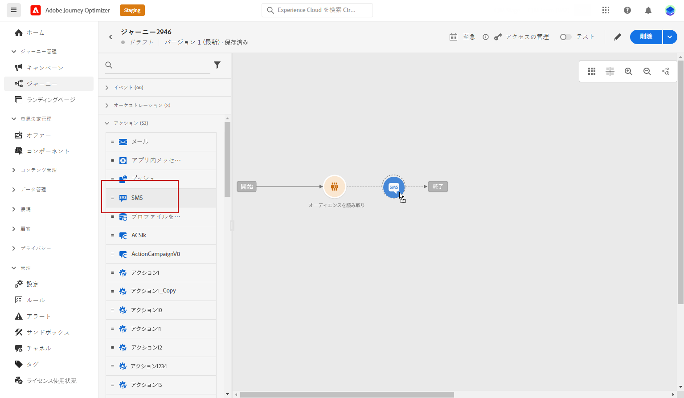
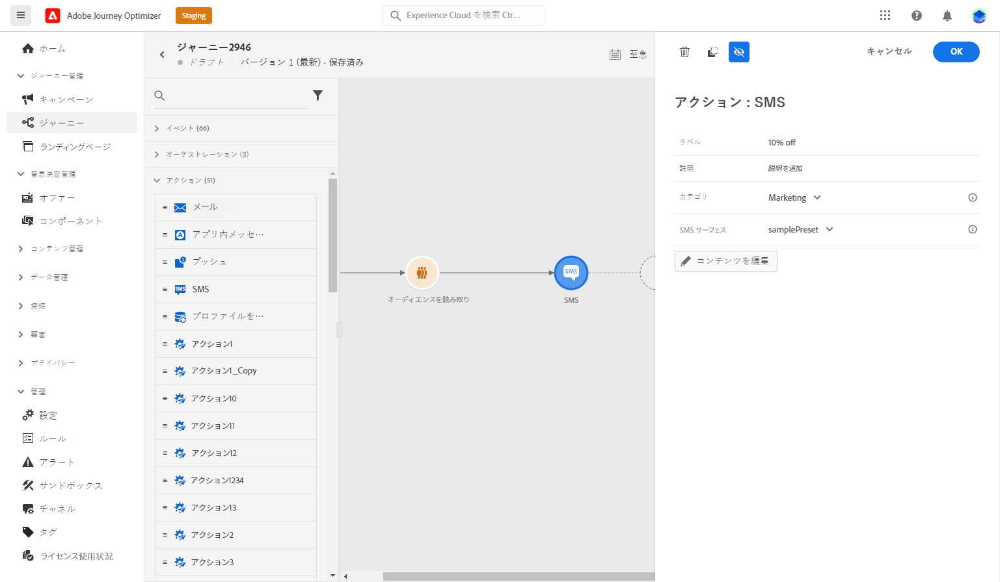
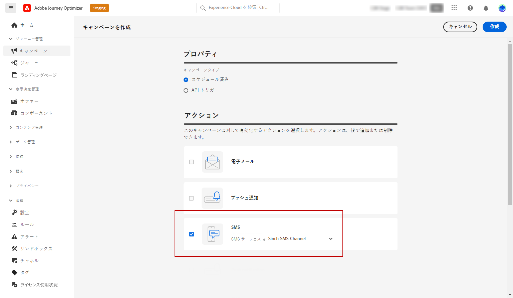
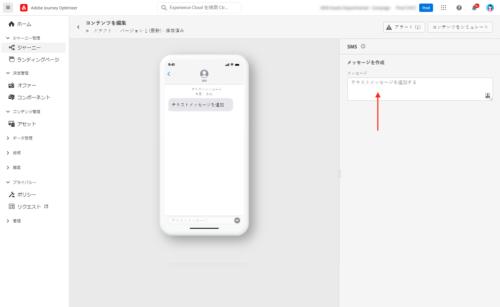
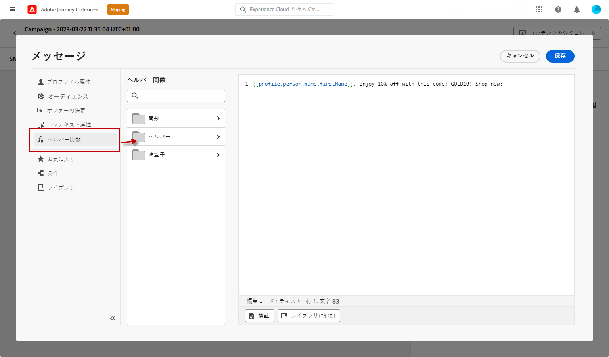
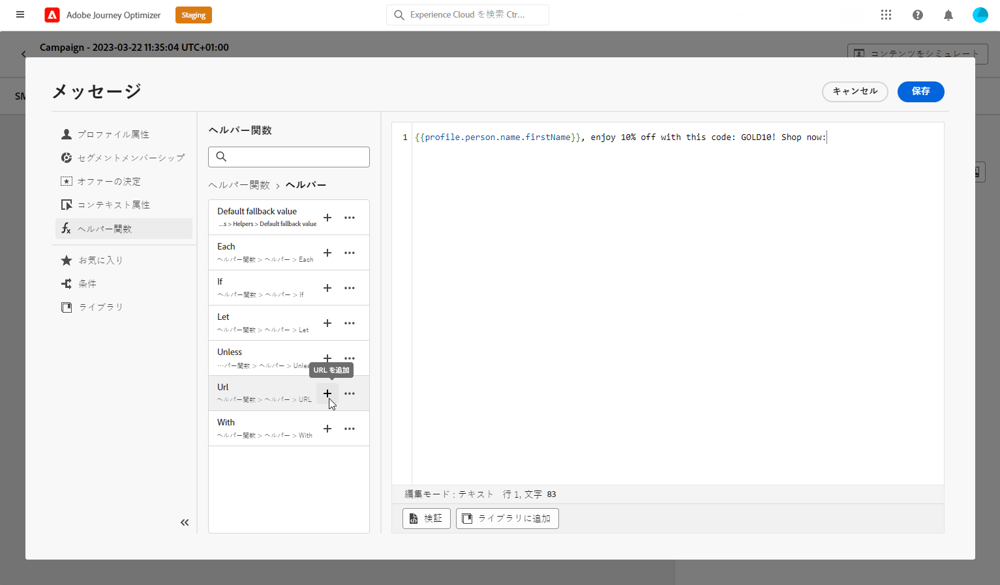
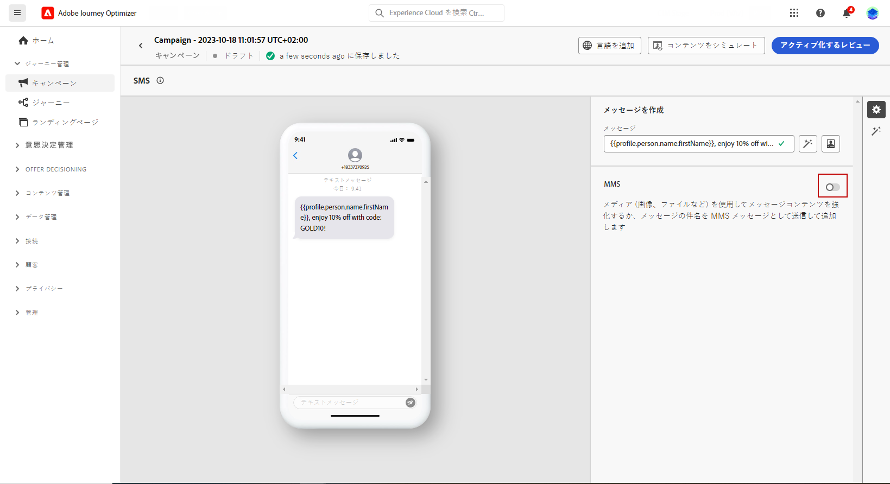
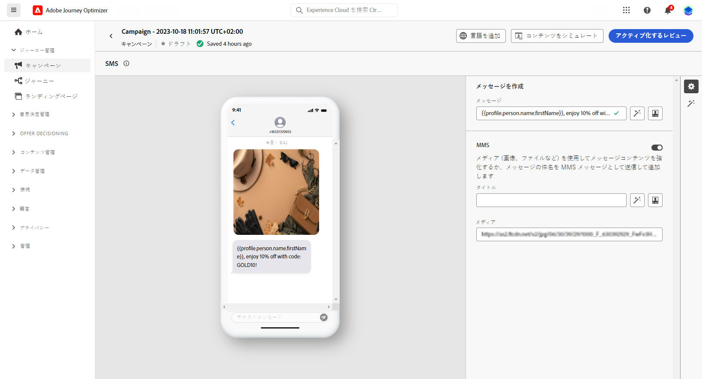

# テキストメッセージ（SMS／MMS）の作成 {#create-sms}

>[!CONTEXTUALHELP]
>id="ajo_message_sms"
>title="テキストメッセージの作成"
>abstract="テキストメッセージ（SMS／MMS）を作成するには、ジャーニーまたはキャンペーンに SMS アクションを追加し、パーソナライゼーションエディターでパーソナライズを開始します。"

Adobe Journey Optimizer を使用して、テキスト（SMS）およびマルチメディア（MMS）メッセージをデザインして送信できます。まず、ジャーニーまたはキャンペーンに SMS アクションを追加し、次に、以下に説明するように、テキストメッセージのコンテンツを定義する必要があります。また、Adobe Journey Optimizer には、送信前にテキストメッセージをテストする機能も用意されているので、レンダリング、パーソナライゼーション属性、その他すべての設定を確認できます。

>[!NOTE]
>
>業界標準と規制に従って、すべての SMS／MMS マーケティングメッセージには、受信者が簡単に登録解除できる方法を含める必要があります。SMS 受信者は、オプトインおよびオプトアウトのキーワードで返信ですることでこれを実行できます。[オプトアウトの管理方法について学ぶ](../privacy/opt-out.md#sms-opt-out-management-sms-opt-out-management)

## テキストメッセージの追加 {#create-sms-journey-campaign}

キャンペーンまたはジャーニーにテキストメッセージ（SMS/MMS）を追加する方法については、以下のタブを参照してください。

>[!BEGINTABS]

>[!TAB ジャーニーへのテキストメッセージの追加]

1. ジャーニーを開いて、パレットの「**アクション**」セクションから SMS アクティビティをドラッグ＆ドロップします。

   

1. メッセージに関する基本情報（ラベル、説明、カテゴリ）を入力したあと、使用するメッセージ設定を選択します。

   

   ジャーニーの設定方法について詳しくは、[このページ](../building-journeys/journey-gs.md)を参照してください。

   **[!UICONTROL 設定]**&#x200B;フィールドはデフォルトで、ユーザーがチャネルで最後に使用した設定で事前入力されます。

これで、以下に説明するように、「**[!UICONTROL コンテンツを編集]**」ボタンから SMS メッセージのコンテンツのデザインを開始できます。

>[!TAB キャンペーンへのテキストメッセージの追加]

1. **[!UICONTROL キャンペーン]**&#x200B;メニューにアクセスし、「**[!UICONTROL キャンペーンを作成]**」をクリックします。

1. 実施するキャンペーンのタイプを選択します。

   * **Scheduled - Marketing**：キャンペーンをすぐに実行するか、指定日に実行します。スケジュール済みキャンペーンは、マーケティングメッセージを送信することを目的としています。ユーザーインターフェイスから設定および実行します。

   * **API トリガー - マーケティング／トランザクション**：API 呼び出しを使用してキャンペーンを実行します。API トリガーキャンペーンは、マーケティングメッセージまたはトランザクションメッセージのいずれか、つまり、個人が実行したアクション（パスワードのリセット、買い物かごの購入など）に続いて送信されるメッセージを送信することを目的としています。

1. 「**[!UICONTROL プロパティ]**」セクションで、キャンペーンの「**[!UICONTROL タイトル]**」と「**[!UICONTROL 説明]**」を編集します。

1. 「**[!UICONTROL オーディエンスを選択]**」ボタンをクリックして、使用可能な Adobe Experience Platform オーディエンスのリストからターゲットオーディエンスを定義します。[詳細情報](../audience/about-audiences.md)

1. 「**[!UICONTROL ID 名前空間]**」フィールドで、選択したオーディエンスから個人を識別するために使用する名前空間を選択します。[詳細情報](../event/about-creating.md#select-the-namespace)

1. 「**[!UICONTROL アクション]**」セクションで、「**[!UICONTROL SMS]**」を選択し、新しい設定を選択または作成します。

   SMS の設定について詳しくは、[このページ](sms-configuration.md)を参照してください。

   

1. 「**[!UICONTROL 実験を作成]**」をクリックしてコンテンツ実験の設定を開始し、パフォーマンスを測定してターゲットオーディエンスに最適なオプションを特定するための処理を作成します。[詳細情報](../content-management/content-experiment.md)

1. 「**[!UICONTROL アクションのトラッキング]**」セクションで、SMS メッセージ内のリンクのクリックを追跡するかどうかを指定します。

1. キャンペーンは、特定の日付に実行するか、繰り返し頻度で実行するように設計されています。キャンペーンの&#x200B;**[!UICONTROL スケジュール]**&#x200B;を設定する方法については、[この節](../campaigns/create-campaign.md#schedule)を参照してください。

1. **[!UICONTROL アクショントリガー]**&#x200B;メニューから、SMS メッセージの「**[!UICONTROL 頻度]**」を選択します。

   * 1 回
   * 毎日
   * 毎週
   * 月

これで、以下に説明するように、「**[!UICONTROL コンテンツを編集]**」ボタンからテキストメッセージのコンテンツのデザインを開始できます。

>[!ENDTABS]

## SMS コンテンツの定義{#sms-content}

>[!CONTEXTUALHELP]
>id="ajo_message_sms_content"
>title="SMS コンテンツの定義"
>abstract="パーソナライゼーションエディターを使用してコンテンツを定義し、動的要素を組み込むことで、テキストメッセージ（SMS／MMS）をカスタマイズおよびパーソナライズします。"

SMS コンテンツを設定するには、次の手順に従います。MMS の設定について詳しくは、[この節](#mms-content)を参照してください。

1. ジャーニーまたはキャンペーンの設定画面で、「**[!UICONTROL コンテンツを編集]**」ボタンをクリックして、テキストメッセージのコンテンツを設定します。

1. 「**[!UICONTROL メッセージ]**」フィールドをクリックして、パーソナライゼーションエディターを開きます。

   

1. パーソナライゼーションエディターを使用して、コンテンツの定義、パーソナライゼーションと動的コンテンツの追加を行います。プロファイル名や市区町村など、任意の属性を使用できます。また、条件ルールを定義することもできます。パーソナライゼーションエディターの[パーソナライゼーション](../personalization/personalize.md)と[動的コンテンツ](../personalization/get-started-dynamic-content.md)について詳しくは、次のページを参照してください。

1. コンテンツを定義したら、追跡する URL をメッセージに追加できます。これを行うには、**[!UICONTROL ヘルパー関数]**&#x200B;メニューにアクセスし、「**[!UICONTROL ヘルパー]**」を選択します。

   URL 短縮機能を使用するには、最初にサブドメインを設定する必要があります。このサブドメインはその後、設定にリンクされます。[詳細情報](sms-subdomains.md)

   >[!NOTE]
   >
   > SMS サブドメインにアクセスして編集するには、実稼動サンドボックスにおける **[!UICONTROL SMS サブドメインの管理]**&#x200B;権限が必要です。権限について詳しくは、[この節](../administration/high-low-permissions.md)を参照してください。

   

1. **[!UICONTROL ヘルパー関数]**&#x200B;メニュー内で、「**[!UICONTROL URL 関数]**」をクリックし、「**[!UICONTROL URL を追加]**」を選択します。

   

1. `originalUrl` フィールドに、短縮する URL をペーストし、「**[!UICONTROL 保存]**」をクリックします。

   >[!CAUTION]
   >
   > 短縮 URL の有効期間は 15 日に設定されています。この期間が経過すると、これらの短縮 URL にはアクセスできなくなり、`404 short-code not found` というメッセージが表示されます。

1. 「**[!UICONTROL 保存]**」をクリックして、プレビューでメッセージを確認します。メッセージのコンテンツをテストして確認するには、[この節](#sms-mms-test)を参照してください。

## MMS コンテンツの定義{#mms-content}

マルチメディアメッセージサービス（MMS）メッセージを送信すると、ビデオ、画像、オーディオクリップ、GIF などのメディアを共有できるようにすることで、通信を強化できます。また、MMS ではメッセージに最大 1600 文字のテキストを含めることができます。

>[!NOTE]
>
> MMS チャネルには、[このページ](../start/guardrails.md#sms-guardrails)にリストされているいくつかの制限があります。

MMS コンテンツを作成するには、次の手順に従います。

1. [この節](#create-sms-journey-campaign)の説明に従って、SMS を作成します。

1. [この節](#sms-content)の説明に従って、SMS コンテンツを編集します。

1. MMS オプションを有効にして、SMS コンテンツにメディアを追加します。

   

1. 「**[!UICONTROL タイトル]**」をメディアに追加します。

1. 「**[!UICONTROL メディア]**」フィールドにメディアの URL を入力します。

   

1. 「**[!UICONTROL 保存]**」をクリックして、プレビューでメッセージを確認します。以下に詳しく説明するように、メッセージのコンテンツをテストして確認できるようになりました。

## メッセージのテストおよび送信 {#sms-mms-test}

「**[!UICONTROL コンテンツをシミュレート]**」ボタンを使用して、テキストメッセージコンテンツ、短縮 URL、パーソナライズされたコンテンツをプレビューできます。

テストを実行してコンテンツを検証したら、テキストメッセージをオーディエンスに送信できます。これらの手順について詳しくは、[このページ](send-sms.md)を参照してください。

送信したら、キャンペーンまたはジャーニーレポート内で SMS の影響を測定できます。レポートについて詳しくは、[この節](../reports/campaign-global-report-cja-sms.md)を参照してください。

**関連トピック**

* [テキストメッセージのプレビュー、テスト、送信](send-sms.md)
* [SMS チャネルの設定](sms-configuration.md)
* [SMS／MMS レポート](../reports/journey-global-report-cja-sms.md)
* [ジャーニーでのメッセージの追加](../building-journeys/journeys-message.md)
* [キャンペーンへのメッセージの追加](../campaigns/create-campaign.md)
