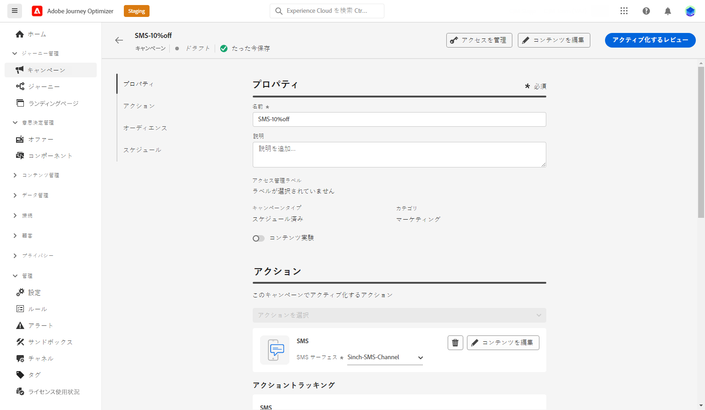
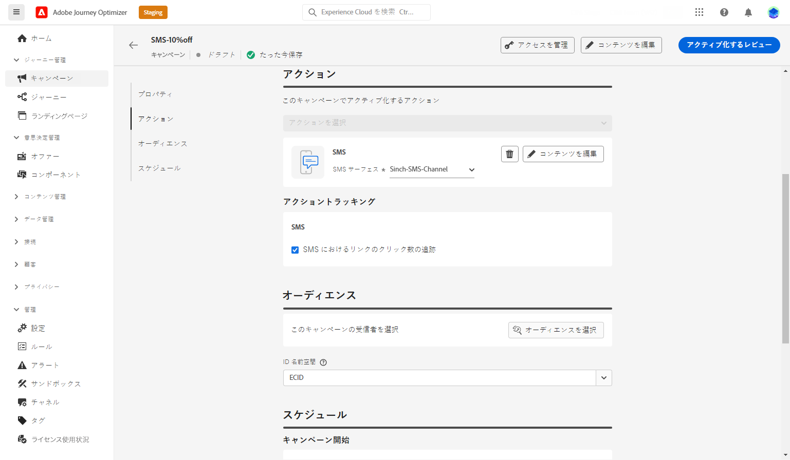

# SMS メッセージの作成 {#create-sms}

>[!CONTEXTUALHELP]
>id="ajo_message_sms"
>title="SMS メッセージの作成"
>abstract="SMS メッセージを追加し、そのパーソナライズを式エディターで開始します。"

## SMS メッセージの追加 {#create-sms-journey-campaign}

キャンペーンまたはジャーニーに SMS メッセージを追加する方法については、以下のタブを参照してください。

>[!BEGINTABS]

>[!TAB ジャーニーへの SMS メッセージの追加]

1. ジャーニーを開いて、パレットの「**アクション**」セクションから SMS アクティビティをドラッグ＆ドロップします。

   

1. メッセージに関する基本情報（ラベル、説明、カテゴリ）を入力したあと、使用するメッセージサーフェスを選択します。

   

   ジャーニーの設定方法について詳しくは、[このページ](../building-journeys/journey-gs.md)を参照してください。

   **[!UICONTROL サーフェス]**&#x200B;フィールドはデフォルトで、ユーザーがチャネルで最後に使用したサーフェスで事前入力されます。

これで、「**[!UICONTROL コンテンツを編集]**」ボタンから SMS メッセージのコンテンツのデザインを開始できます。[SMS コンテンツの定義](#sms-content)

>[!TAB キャンペーンへの SMS メッセージの追加]

1. スケジュール済みキャンペーンまたは API トリガーキャンペーンを新規作成し、アクションとして「**[!UICONTROL SMS]**」を選択して、使用する&#x200B;**[!UICONTROL アプリサーフェス]**&#x200B;を選択します。詳しくは、[SMS 設定](sms-configuration.md)を参照してください。

   

1. 「**[!UICONTROL 作成]**」をクリックします。

1. 「**[!UICONTROL プロパティ]**」セクションで、キャンペーンの「**[!UICONTROL タイトル]**」と「**[!UICONTROL 説明]**」を編集します。

   

1. 「**[!UICONTROL アクションのトラッキング]**」セクションで、SMS メッセージ内のリンクのクリックを追跡するかどうかを指定します。

1. 「**[!UICONTROL オーディエンスを選択]**」ボタンをクリックして、使用可能な Adobe Experience Platform セグメントのリストからターゲットオーディエンスを定義します。 [詳細情報](../segment/about-segments.md)。

1. 「**[!UICONTROL ID 名前空間]**」フィールドで、選択したセグメントから個人を識別するために使用する名前空間を選択します。[詳細情報](../event/about-creating.md#select-the-namespace)。

   

1. キャンペーンは、特定の日付に実行するか、繰り返し頻度で実行するように設計されています。キャンペーンの&#x200B;**[!UICONTROL スケジュール]**&#x200B;を設定する方法については、[この節](../campaigns/create-campaign.md#schedule)を参照してください。

1. **[!UICONTROL アクショントリガー]**&#x200B;メニューから、SMS メッセージの「**[!UICONTROL 頻度]**」を選択します。

   * 1 回
   * 毎日
   * 毎週
   * 月

これで、「**[!UICONTROL コンテンツを編集]**」ボタンから SMS メッセージのコンテンツのデザインを開始できます。[SMS コンテンツのデザイン](#sms-content)

>[!ENDTABS]

## SMS コンテンツの定義{#sms-content}

1. ジャーニーまたはキャンペーンの設定画面で、「**[!UICONTROL コンテンツを編集]**」ボタンをクリックして、SMS コンテンツを設定します。

1. 「**[!UICONTROL メッセージ]**」フィールドをクリックして、式エディターを開きます。

   

1. 式エディターを使用して、コンテンツを定義し、動的コンテンツを追加します。プロファイル名や市区町村など、任意の属性を使用できます。式エディターでの[パーソナライズ機能](../personalization/personalize.md)および[動的コンテンツ](../personalization/get-started-dynamic-content.md)の詳細情報。

1. コンテンツを定義したら、トラック URL をメッセージに追加できます。これを行うには、**[!UICONTROL ヘルパー関数]**&#x200B;メニューにアクセスし、「**[!UICONTROL ヘルパー]**」を選択します。

   URL 短縮機能を使用するには、最初にサブドメインを設定する必要があります。このサブドメインはその後、サーフェスにリンクされます。[詳細情報](sms-subdomains.md)

   >[!CAUTION]
   >
   > SMS サブドメインにアクセスして編集するには、実稼動サンドボックスで **[!UICONTROL SMS サブドメインの管理]**&#x200B;権限が必要です。

   

1. **[!UICONTROL ヘルパー関数]**&#x200B;メニュー内で、「**[!UICONTROL URL 関数]**」をクリックし、「**[!UICONTROL URL を追加]**」を選択します。

   

1. `originalUrl` フィールドに、短縮する URL をペーストします。

1. 「**[!UICONTROL 保存]**」をクリックして、プレビューでメッセージを確認します。**[!UICONTROL コンテンツをシミュレート]**&#x200B;を使用して、短縮 URL やパーソナライズされたコンテンツをプレビューできます。

   

これで、SMS メッセージをテストしてオーディエンスに送信できます。[詳細情報](send-sms.md)
送信したら、キャンペーンまたはジャーニーレポート内で SMS の影響を測定できます。レポートについて詳しくは、[この節](../reports/campaign-global-report.md#sms-tab)を参照してください。

>[!NOTE]
>
>業界標準と規制に従って、すべての SMS マーケティングメッセージには、受信者が簡単に登録解除できる方法を含める必要があります。SMS 受信者は、オプトインおよびオプトアウトのキーワードで返信ですることでこれを実行できます。[オプトアウトの管理方法について学ぶ](../privacy/opt-out.md#sms-opt-out-management-sms-opt-out-management)

**関連トピック**

* [SMS メッセージのプレビュー、テスト、送信](send-sms.md)
* [SMS チャネルの設定](sms-configuration.md)
* [SMS レポート](../reports/journey-global-report.md#sms-global)
* [ジャーニーへのメッセージの追加](../building-journeys/journeys-message.md)
* [キャンペーンへのメッセージの追加](../campaigns/create-campaign.md)
