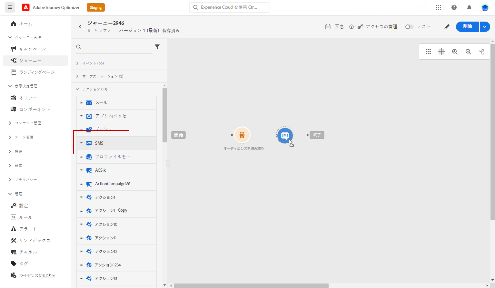
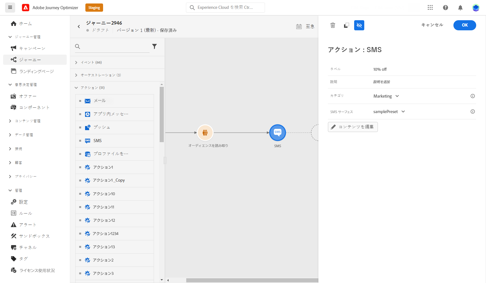
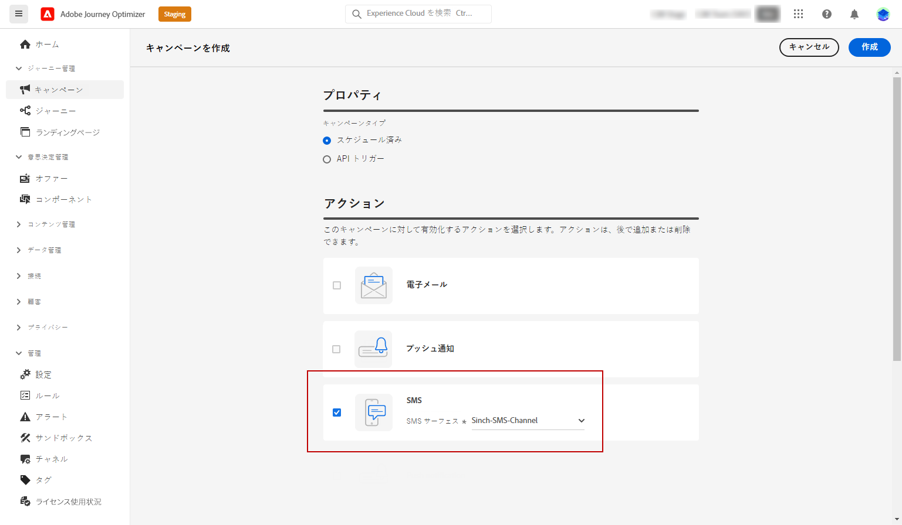
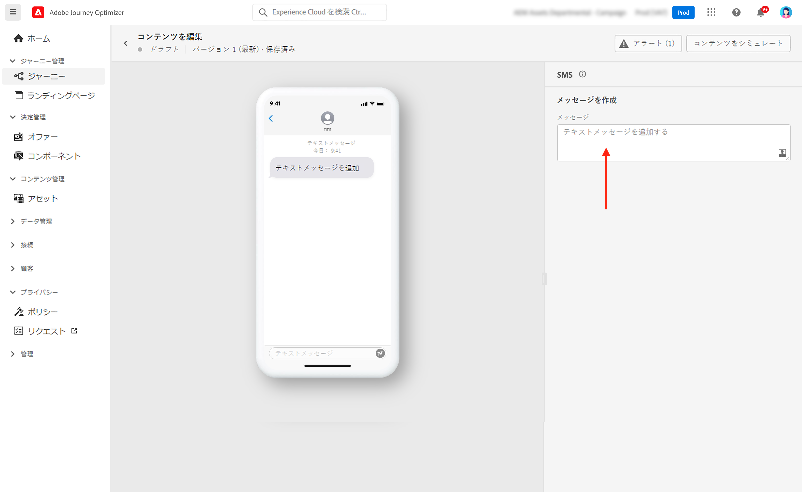
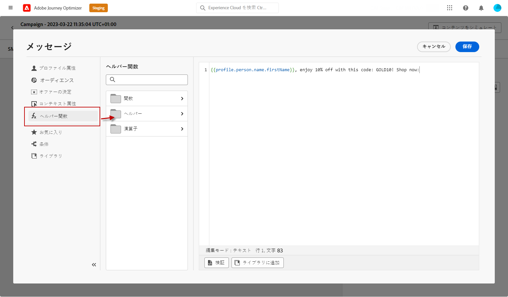
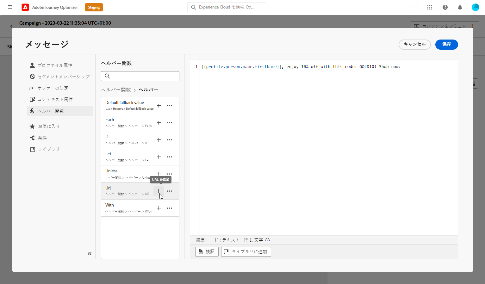
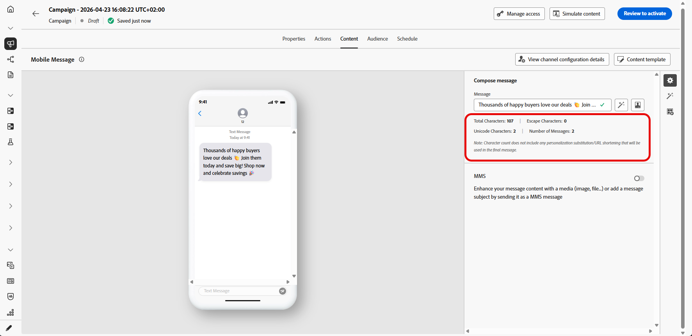
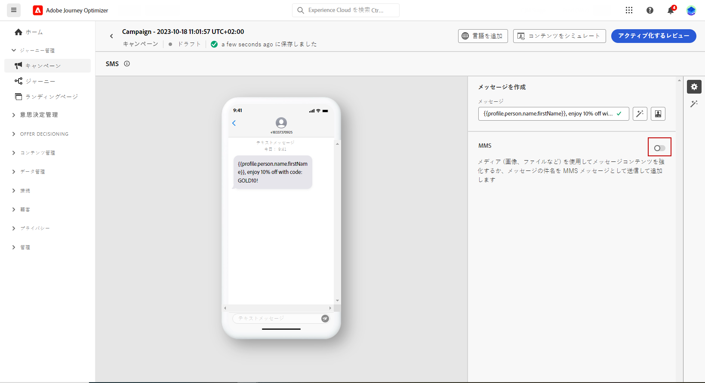
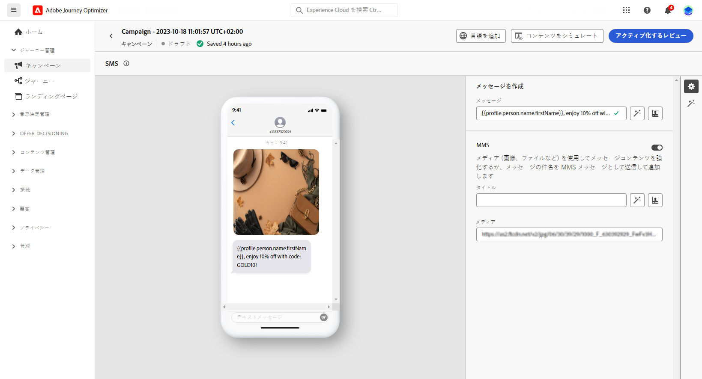
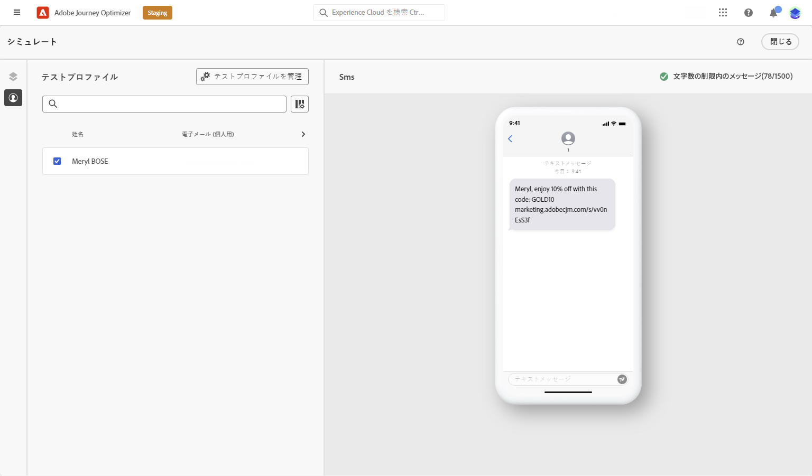

# SMS／MMS／RCS メッセージの作成 {#create-sms}

>[!CONTEXTUALHELP]
>id="ajo_message_sms"
>title="テキストメッセージの作成"
>abstract="テキストメッセージ（SMS／MMS／RCS）を作成するには、ジャーニーまたはキャンペーンに SMS アクションを追加し、パーソナライゼーションエディターでパーソナライゼーションを開始します。"

>[!AVAILABILITY]
>
>RCS は HIPAA 対応サービスではないので、組織が Journey Optimizer で処理することを許可されている場合がある、許可されたヘルスデータ（個人ヘルス情報など）を含むセンシティブな個人データの収集、保存、処理に使用できません。

Adobe Journey Optimizer を使用して、テキスト（SMS）、リッチ通信（RCS）およびマルチメディア（MMS）メッセージををデザインして送信できます。 まず、ジャーニーまたはキャンペーンに SMS アクションを追加し、次に、以下に説明するように、テキストメッセージのコンテンツを定義する必要があります。 また、Adobe Journey Optimizer には、送信前にテキストメッセージをテストする機能も用意されているので、レンダリング、パーソナライゼーション属性、その他すべての設定を確認できます。

業界標準と規制に従って、すべての SMS／MMS マーケティングメッセージには、受信者が簡単に登録解除できる方法を含める必要があります。 SMS 受信者は、オプトインおよびオプトアウトのキーワードで返信ですることでこれを実行できます。 [オプトアウトの管理方法について学ぶ](../privacy/opt-out.md#opt-out-decision-management)

## テキストメッセージの追加 {#create-sms-journey-campaign}

キャンペーンまたはジャーニーにテキストメッセージ（SMS／MMS／RCS）を追加する方法について詳しくは、以下のタブを参照してください。

>[!BEGINTABS]

>[!TAB ジャーニーへのテキストメッセージの追加]

1. ジャーニーを開き、パレットの「**[!UICONTROL アクション]**」セクションから「**[!UICONTROL アクション]**」アクティビティをドラッグ&amp;ドロップします。 [&#x200B; アクションアクティビティ &#x200B;](../building-journeys/journey-action.md)の詳細をご覧ください。

   >[!IMPORTANT]
   >
   >従来のネイティブチャネルアクティビティ（電子メール、プッシュ、SMS、アプリ内、web、コードベースのエクスペリエンス、コンテンツカード）は、2026年3月のリリースで廃止されました。 これらのアクティビティを使用する既存のジャーニーは、変更なしで引き続き機能します。移行は必要ありません。

1. アクションタイプとして&#x200B;**[!UICONTROL SMS]**&#x200B;を選択します。

   

1. ジャーニーキャンバスでアクションを識別するには、**[!UICONTROL ラベル]**&#x200B;を入力します。

1. 「**[!UICONTROL 設定アクション]**」ボタンをクリックします。

1. 「**[!UICONTROL アクション]**」タブに移動します。 そこから、使用するSMS設定を選択または作成します。 [詳細情報](sms-configuration.md)

   

1. さらに、**[!UICONTROL ビジネスルール]** ドロップダウンリストでルールセットを選択して、SMS アクションにキャッピングルールを適用できます。 [詳細情報](../conflict-prioritization/channel-capping.md)

1. 「**[!UICONTROL コンテンツを編集]**」ボタンを選択し、必要に応じてコンテンツを作成します。 [詳細情報](#sms-content)

1. ジャーニーキャンバスに戻ります。 必要に応じて、追加のアクションまたはイベントをドラッグ＆ドロップして、ジャーニーフローを完了します。 [詳細情報](../building-journeys/about-journey-activities.md)

ジャーニーの作成、設定、公開の方法について詳しくは、[このページ &#x200B;](../building-journeys/journey-gs.md)を参照してください。

>[!TAB キャンペーンへのテキストメッセージの追加]

1. **[!UICONTROL キャンペーン]**&#x200B;メニューにアクセスし、「**[!UICONTROL キャンペーンを作成]**」をクリックします。

1. 実施するキャンペーンのタイプを選択します。

   * **Scheduled - Marketing**：キャンペーンをすぐに実行するか、指定日に実行します。 スケジュール済みキャンペーンは、マーケティングメッセージを送信することを目的としています。 ユーザーインターフェイスから設定および実行します。

   * **API トリガー - マーケティング／トランザクション**：API 呼び出しを使用してキャンペーンを実行します。 API トリガーキャンペーンは、マーケティングメッセージまたはトランザクションメッセージのいずれか、つまり、個人が実行したアクション（パスワードのリセット、買い物かごでの購入など）に続いて送信されるメッセージの送信を目的としています。

1. 「**[!UICONTROL プロパティ]**」セクションで、キャンペーンの「**[!UICONTROL タイトル]**」と「**[!UICONTROL 説明]**」を編集します。

1. 「**[!UICONTROL オーディエンスを選択]**」ボタンをクリックして、使用可能な Adobe Experience Platform オーディエンスのリストからターゲットオーディエンスを定義します。 [詳細情報](../audience/about-audiences.md)。

1. 「**[!UICONTROL ID 名前空間]**」フィールドで、選択したオーディエンスから個人を識別するために使用する名前空間を選択します。 [詳細情報](../event/about-creating.md#select-the-namespace)

1. 「**[!UICONTROL アクション]**」セクションで、「**[!UICONTROL SMS]**」を選択し、新しい設定を選択または作成します。

   SMS 設定について詳しくは、[このページ](sms-configuration.md)を参照してください。

   

1. 「**[!UICONTROL 実験を作成]**」をクリックしてコンテンツ実験の設定を開始し、パフォーマンスを測定してターゲットオーディエンスに最適なオプションを特定するための処理を作成します。 [詳細情報](../content-management/content-experiment.md)

1. 「**[!UICONTROL アクションのトラッキング]**」セクションで、SMS メッセージ内のリンクのクリックを追跡するかどうかを指定します。

1. キャンペーンは、特定の日付に実行するか、繰り返し頻度で実行するように設計されています。 キャンペーンの&#x200B;**[!UICONTROL スケジュール]**&#x200B;を設定する方法については、[この節](../campaigns/campaign-schedule.md#action-campaign-schedule)を参照してください。

1. **[!UICONTROL アクショントリガー]**&#x200B;メニューから、SMS メッセージの「**[!UICONTROL 頻度]**」を選択します。

   * 1 回
   * 毎日
   * 毎週
   * 月

これで、以下に説明するように、「**[!UICONTROL コンテンツを編集]**」ボタンからテキストメッセージのコンテンツのデザインを開始できます。

キャンペーンの作成、設定およびアクティベート方法について詳しくは、[このページ &#x200B;](../campaigns/get-started-with-campaigns.md)を参照してください。

>[!ENDTABS]

## SMS／RCS コンテンツの定義{#sms-content}

>[!CONTEXTUALHELP]
>id="ajo_message_sms_content"
>title="SMS コンテンツの定義"
>abstract="パーソナライゼーションエディターを使用してコンテンツを定義し、動的要素を組み込むことで、テキストメッセージ（SMS／MMS／RCS）をカスタマイズおよびパーソナライズします。"


メッセージコンテンツを設定するには、次の手順に従います。 MMS の設定について詳しくは、[この節](#mms-content)を参照してください。

1. ジャーニーまたはキャンペーンの設定画面で、「**[!UICONTROL コンテンツを編集]**」ボタンをクリックして、テキストメッセージのコンテンツを設定します。

1. 「**[!UICONTROL メッセージ]**」フィールドをクリックして、パーソナライゼーションエディターを開きます。

   Infobip、Twilio またはその他のサードパーティプロバイダーを使用した RCS メッセージの場合は、必要な JSON ペイロードを[カスタム SMS 設定](sms-configuration-custom.md#api-credential)に貼り付けます。

   

1. [テキスト生成用の AI アシスタント](../content-management/generative-text.md)を使用して、オーディエンスに合わせた魅力的なテキストメッセージを生成します。

1. パーソナライゼーションエディターを使用して、コンテンツの定義、パーソナライゼーションと動的コンテンツの追加を行います。 プロファイル名や市区町村など、任意の属性を使用できます。 また、条件ルールを定義することもできます。 パーソナライゼーションエディターの[パーソナライゼーション](../personalization/personalize.md)と[動的コンテンツ](../personalization/get-started-dynamic-content.md)について詳しくは、次のページを参照してください。

1. コンテンツを定義したら、追跡する URL をメッセージに追加できます。 これを行うには、**[!UICONTROL ヘルパー関数]**&#x200B;メニューにアクセスし、「**[!UICONTROL ヘルパー]**」を選択します。

   

1. **[!UICONTROL URL]**&#x200B;を選択し、**[!UICONTROL URLを追加]**&#x200B;をクリックします。

   

1. URLを短縮するには、`originalUrl` フィールドにURLを貼り付け、**[!UICONTROL 保存]**&#x200B;をクリックします。

   >[!CAUTION]
   >
   >URL 短縮機能を使用するには、最初にサブドメインを設定する必要があります。このサブドメインはその後、設定にリンクされます。 [詳細情報](sms-subdomains.md)
   >
   > 短縮 URL の有効期間は 30 日に設定されています。 この期間が経過すると、これらの短縮 URL にはアクセスできなくなり、`404 short-code not found` というメッセージが表示されます。

1. モバイルアプリで特定の画面を開くディープリンクを追加するには、`DEEPLINK`型のURL ヘルパーを使用します。 [&#x200B; ディープリンクについて詳しく見る](../email/deeplinks.md)

   ```
   {{url originalUrl='<<deeplink_url>>' type='DEEPLINK' action='CLICK'}}
   ```

   >[!IMPORTANT]
   >
   >ディープリンクを使用する前に、Journey Optimizerで対応する[設定手順](../email/deeplinks.md#configuration)を完了し、モバイルアプリに[&#x200B; ディープリンク処理](../email/deeplinks.md#mobile-implementation)を実装していることを確認してください。 そうしていない場合、ディープリンクはユーザーを意図したアプリ内コンテンツに誘導しません。
   >
   >また、URLがAdobe システムを通じて書き換えられるように、ジャーニーまたはキャンペーンの&#x200B;**[!UICONTROL アクション]** セクションでリンクトラッキングが有効になっていることを確認してください。

1. メッセージの作成時に&#x200B;**[!UICONTROL 文字数]**&#x200B;を使用して、SMSの長さを監視します。 リアルタイムで更新され、複数のセグメントでいつコンテンツが配信されるのかを示します。

   

1. 「**[!UICONTROL 保存]**」をクリックして、プレビューでメッセージを確認します。 メッセージのコンテンツをテストして確認するには、[この節](#sms-mms-test)を参照してください。

## 意思決定によるパーソナライゼーション {#decisioning-sms}

**Decisioning**&#x200B;を使用すると、SMS メッセージのコンテンツをパーソナライズおよび最適化できます。 この機能により、優先順位スコア、数式、AI モデルを使用して、顧客に最適なコンテンツを動的に選択して表示できます。

SMS メッセージで決定ポリシーを作成および使用する方法について詳しくは、[この節](../experience-decisioning/create-decision.md)を参照してください。

## MMS コンテンツの定義{#mms-content}

マルチメディアメッセージサービス（MMS）メッセージを送信すると、ビデオ、画像、オーディオクリップ、GIF などのメディアを共有できるようにすることで、通信を強化できます。 また、MMS ではメッセージに最大 1600 文字のテキストを含めることができます。

>[!NOTE]
>
> MMS チャネルには、[このページ](../start/guardrails.md#sms-guardrails)にリストされているいくつかの制限があります。

MMS コンテンツを作成するには、次の手順に従います。

1. [この節](#create-sms-journey-campaign)の説明に従って、SMS を作成します。

1. [この節](#sms-content)の説明に従って、SMS コンテンツを編集します。

1. MMS オプションを有効にして、SMS コンテンツにメディアを追加します。

   

1. 「**[!UICONTROL タイトル]**」をメディアに追加します。

1. 「**[!UICONTROL メディア]**」フィールドにメディアの URL を入力します。

   

1. 「**[!UICONTROL 保存]**」をクリックして、プレビューでメッセージを確認します。 以下に詳しく説明するように、メッセージのコンテンツをテストして確認できるようになりました。

## メッセージのテストおよび送信 {#sms-mms-test}

「**[!UICONTROL コンテンツをシミュレート]**」ボタンを使用して、テキストメッセージコンテンツ、短縮 URL、パーソナライズされたコンテンツをプレビューできます。



テストを実行してコンテンツを検証したら、テキストメッセージをオーディエンスに送信できます。 これらの手順について詳しくは、[このページ](send-sms.md)を参照してください。

送信したら、キャンペーンまたはジャーニーレポート内で SMS の影響を測定できます。 レポートについて詳しくは、[この節](../reports/campaign-global-report-cja-sms.md)を参照してください。

**関連トピック**

* [テキストメッセージのプレビュー、テスト、送信](send-sms.md)
* [SMS チャネルの設定](sms-configuration.md)
* [SMS／MMS レポート](../reports/journey-global-report-cja-sms.md)
* [ジャーニーでのメッセージの追加](../building-journeys/journey-action.md)
* [キャンペーンへのメッセージの追加](../campaigns/create-campaign.md)
