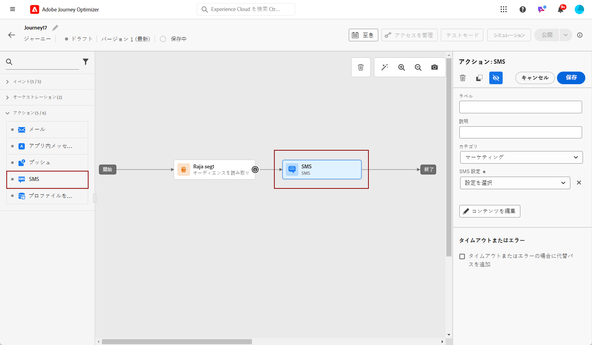

# SMS メッセージの作成 {#create-sms}

>[!CONTEXTUALHELP]
>id="ajo_message_sms"
>title="SMS の作成"
>abstract="テキストメッセージを追加し、式エディターを使用してパーソナライズを開始します。"

>[!NOTE]
>
>業界標準と規制に従って、すべての SMS マーケティングメッセージには、受信者が簡単に登録解除できる方法を含める必要があります。SMS 受信者は、オプトインおよびオプトアウトのキーワードで返信ですることでこれを実行できます。[オプトアウトの管理方法について学ぶ](../privacy/opt-out.md#sms-opt-out-management-sms-opt-out-management)

## ジャーニーまたはキャンペーンでの SMS メッセージの作成 {#create-sms-journey-campaign}

SMS メッセージのパーソナライズを開始するには、次の手順に従います。

>[!BEGINTABS]

>[!TAB ジャーニーへの SMS メッセージの追加]

1. ジャーニーを開いて、パレットの「アクション」セクションから SMS アクティビティをドラッグ＆ドロップします。

   

1. メッセージに関する基本情報（ラベル、説明、カテゴリ）を入力したあと、使用するメッセージサーフェスを選択します。

   

   ジャーニーの設定方法について詳しくは、[このページ](../building-journeys/journey-gs.md)を参照してください。

これで、「**[!UICONTROL コンテンツを編集]**」ボタンから SMS メッセージのコンテンツのデザインを開始できます。[SMS コンテンツのデザイン](#sms-content)

>[!TAB キャンペーンへの SMS メッセージの追加]

1. スケジュール済みキャンペーンまたは API トリガーキャンペーンを新規作成し、アクションとして「**[!UICONTROL SMS]**」を選択して、使用する&#x200B;**[!UICONTROL アプリサーフェス]**&#x200B;を選択します。詳しくは、[SMS 設定](sms-configuration.md)を参照してください。

   

1. 「**[!UICONTROL 作成]**」をクリックします。

1. 「**[!UICONTROL プロパティ]**」セクションで、キャンペーンの「**[!UICONTROL タイトル]**」と「**[!UICONTROL 説明]**」を編集します。

   

1. 「**[!UICONTROL アクションのトラッキング]**」セクションで、SMS メッセージ内のリンクのクリックを追跡するかどうかを指定します。

1. 「**[!UICONTROL オーディエンスを選択]**」ボタンをクリックして、使用可能な Adobe Experience Platform セグメントのリストからターゲットオーディエンスを定義します。 [詳細情報](../segment/about-segments.md)。

1. 「**[!UICONTROL ID 名前空間]**」フィールドで、選択したセグメントから個人を識別するために使用する名前空間を選択します。[詳細情報](../event/about-creating.md#select-the-namespace)。

   

1. キャンペーンは、特定の日付に実行するか、繰り返し頻度で実行するように設計されています。キャンペーンの&#x200B;**[!UICONTROL スケジュール]**&#x200B;を設定する方法については、[この節](../campaigns/create-campaign.md#schedule)を参照してください。

1. **[!UICONTROL アクショントリガー]**&#x200B;メニューから、SMS メッセージの「**[!UICONTROL 頻度]**」を選択します。

   * 1 回
   * 毎日
   * 毎週
   * 月

これで、「**[!UICONTROL コンテンツを編集]**」ボタンから SMS メッセージのコンテンツのデザインを開始できます。[SMS コンテンツのデザイン](#sms-content)

>[!ENDTABS]

## SMS コンテンツの定義{#sms-content}

1. ジャーニーまたはキャンペーンの設定画面で、「**[!UICONTROL コンテンツを編集]**」ボタンをクリックして、SMS コンテンツを設定します。

1. 「**[!UICONTROL メッセージ]**」フィールドをクリックして、式エディターを開きます。

   

1. 式エディターを使用して、コンテンツを定義し、動的コンテンツを追加します。プロファイル名や市区町村など、任意の属性を使用できます。式エディターでの[パーソナライズ機能](../personalization/personalize.md)および[動的コンテンツ](../personalization/get-started-dynamic-content.md)の詳細情報。

1. 「**[!UICONTROL 保存]**」をクリックして、プレビューでメッセージを確認します。[詳細情報](send-sms.md)

   

**関連トピック**

* [SMS チャネルの設定](sms-configuration.md)
* [SMS レポート](../reports/journey-global-report.md#sms-global)
* [ジャーニーでのメッセージの追加](../building-journeys/journeys-message.md)
