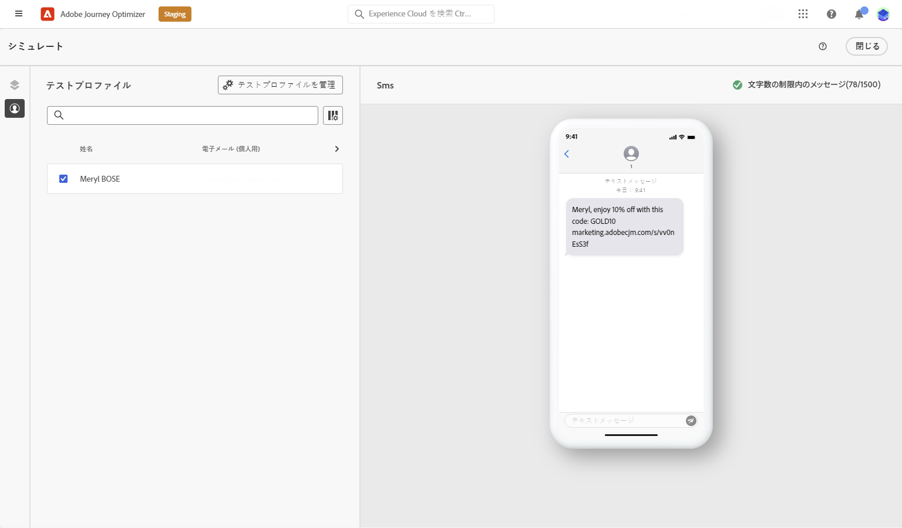

# テキストメッセージ (SMS/MMS) の作成{#create-sms}

>[!CONTEXTUALHELP]
>id="ajo_message_sms"
>title="テキストメッセージの作成"
>abstract="テキストメッセージ (SMS/MMS) を作成するには、ジャーニーまたはキャンペーンに SMS アクションを追加し、式エディターを使用してパーソナライズ機能を開始します。"

Adobe Journey Optimizerでは、テキスト (SMS) およびマルチメディア (MMS) メッセージをデザインして送信できます。 まず、ジャーニーまたはキャンペーンに SMS アクションを追加し、次に、以下に説明するように、テキストメッセージのコンテンツを定義する必要があります。 また、Adobe Journey Optimizerには、送信前にテキストメッセージをテストする機能が用意されているので、レンダリング、パーソナライゼーション属性、その他すべての設定を確認できます。

>[!NOTE]
>
>業界標準と規制に従い、すべての SMS/MMS マーケティングメッセージには、受信者が簡単に購読解除できる方法を含める必要があります。 SMS 受信者は、オプトインおよびオプトアウトのキーワードで返信ですることでこれを実行できます。[オプトアウトの管理方法について学ぶ](../privacy/opt-out.md#sms-opt-out-management-sms-opt-out-management)

## テキストメッセージを追加 {#create-sms-journey-campaign}

以下のタブを参照して、キャンペーンまたはジャーニーにテキストメッセージ (SMS/MMS) を追加する方法を学びます。

>[!BEGINTABS]

>[!TAB メッセージにテキストジャーニーを追加]

1. ジャーニーを開いて、パレットの「**アクション**」セクションから SMS アクティビティをドラッグ＆ドロップします。

   

1. メッセージに関する基本情報（ラベル、説明、カテゴリ）を入力したあと、使用するメッセージサーフェスを選択します。

   

   ジャーニーの設定方法について詳しくは、[このページ](../building-journeys/journey-gs.md)を参照してください。

   **[!UICONTROL サーフェス]**&#x200B;フィールドはデフォルトで、ユーザーがチャネルで最後に使用したサーフェスで事前入力されます。

これで、SMS メッセージのコンテンツのデザインを **[!UICONTROL コンテンツを編集]** ボタンを使用します。

>[!TAB キャンペーンにテキストメッセージを追加する]

1. スケジュール済みキャンペーンまたは API トリガーキャンペーンを新規作成し、アクションとして「**[!UICONTROL SMS]**」を選択して、使用する&#x200B;**[!UICONTROL アプリサーフェス]**&#x200B;を選択します。SMS 設定の詳細については、 [このページ](sms-configuration.md).

   

1. 「**[!UICONTROL 作成]**」をクリックします。

1. 「**[!UICONTROL プロパティ]**」セクションで、キャンペーンの「**[!UICONTROL タイトル]**」と「**[!UICONTROL 説明]**」を編集します。

   

1. 「**[!UICONTROL オーディエンスを選択]**」ボタンをクリックして、使用可能な Adobe Experience Platform オーディエンスのリストからターゲットオーディエンスを定義します。[詳細情報](../audience/about-audiences.md)

1. 「**[!UICONTROL ID 名前空間]**」フィールドで、選択したオーディエンスから個人を識別するために使用する名前空間を選択します。[詳細情報](../event/about-creating.md#select-the-namespace)

   

1. 「**[!UICONTROL 実験を作成]**」をクリックしてコンテンツ実験の設定を開始し、パフォーマンスを測定してターゲットオーディエンスに最適なオプションを特定するための処理を作成します。[詳細情報](../campaigns/content-experiment.md)

1. 「**[!UICONTROL アクションのトラッキング]**」セクションで、SMS メッセージ内のリンクのクリックを追跡するかどうかを指定します。

1. キャンペーンは、特定の日付に実行するか、繰り返し頻度で実行するように設計されています。キャンペーンの&#x200B;**[!UICONTROL スケジュール]**&#x200B;を設定する方法については、[この節](../campaigns/create-campaign.md#schedule)を参照してください。

1. **[!UICONTROL アクショントリガー]**&#x200B;メニューから、SMS メッセージの「**[!UICONTROL 頻度]**」を選択します。

   * 1 回
   * 毎日
   * 毎週
   * 月

これで、 **[!UICONTROL コンテンツを編集]** ボタンを使用します。

>[!ENDTABS]

## SMS コンテンツの定義{#sms-content}

>[!CONTEXTUALHELP]
>id="ajo_message_sms_content"
>title="SMS コンテンツの定義"
>abstract="式エディターを使用してコンテンツを定義し、動的要素を組み込むことで、テキストメッセージ (SMS/MMS) をカスタマイズおよびパーソナライズします。"

SMS コンテンツを設定するには、次の手順に従います。 MMS の設定について詳しくは、 [この節](#mms-content).

1. ジャーニーまたはキャンペーンの設定画面で、 **[!UICONTROL コンテンツを編集]** ボタンを使用して、テキストメッセージのコンテンツを設定します。

1. 「**[!UICONTROL メッセージ]**」フィールドをクリックして、式エディターを開きます。

   

1. 式エディターを使用して、コンテンツの定義、パーソナライゼーションおよび動的コンテンツの追加をおこないます。 プロファイル名や市区町村など、任意の属性を使用できます。 また、条件ルールを定義することもできます。 次のページを参照して、詳細を確認します。 [パーソナライゼーション](../personalization/personalize.md) および [動的コンテンツ](../personalization/get-started-dynamic-content.md) を使用して、式エディターで設定できます。

1. コンテンツを定義した後、トラッキングする URL をメッセージに追加できます。 これを行うには、**[!UICONTROL ヘルパー関数]**&#x200B;メニューにアクセスし、「**[!UICONTROL ヘルパー]**」を選択します。

   URL 短縮機能を使用するには、最初にサブドメインを設定する必要があります。このサブドメインはその後、サーフェスにリンクされます。[詳細情報](sms-subdomains.md)

   >[!CAUTION]
   >
   > SMS サブドメインにアクセスして編集するには、 **[!UICONTROL SMS サブドメインの管理]** 実稼動サンドボックスに対する権限。 権限について詳しくは、[この節](../administration/high-low-permissions.md)を参照してください。

   

1. **[!UICONTROL ヘルパー関数]**&#x200B;メニュー内で、「**[!UICONTROL URL 関数]**」をクリックし、「**[!UICONTROL URL を追加]**」を選択します。

   

1. `originalUrl` フィールドに、短縮する URL をペーストし、「**[!UICONTROL 保存]**」をクリックします。

1. 「**[!UICONTROL 保存]**」をクリックして、プレビューでメッセージを確認します。これで、メッセージの内容をテストして確認できます。詳しくは、 [この節](#sms-mms-test).

## MMS コンテンツを定義{#mms-content}

マルチメディアメッセージサービス (MMS) メッセージを送信すると、ビデオ、画像、オーディオクリップ、GIFなどのメディアを共有でき、通信を強化できます。 また、MMS では、メッセージ内に最大 1600 文字のテキストを使用できます。

>[!NOTE]
>
>* この機能は現在、 **シンチ** のみ。
>
>* MMS チャネルには、 [このページ](../start/guardrails.md#sms-guardrails).
>

MMS コンテンツを作成するには、次の手順に従います。

1. SMS の作成 ( [この節](#create-sms-journey-campaign).

1. SMS コンテンツを編集します。詳しくは、 [この節](#sms-content).

1. MMS オプションを有効にして、SMS コンテンツにメディアを追加します。

   

1. 「**[!UICONTROL タイトル]**」をメディアに追加します。

1. 「**[!UICONTROL メディア]**」フィールドにメディアの URL を入力します。

   

1. 「**[!UICONTROL 保存]**」をクリックして、プレビューでメッセージを確認します。以下に詳しく説明するように、メッセージの内容をテストおよび確認できるようになりました。

## メッセージのテストと送信 {#sms-mms-test}

以下を使用します。 **[!UICONTROL コンテンツをシミュレート]** ボタンを使用して、テキストメッセージコンテンツ、短縮 URL、パーソナライズされたコンテンツをプレビューできます。

テストを実行し、コンテンツを検証したら、テキストメッセージをオーディエンスに送信できます。 これらの手順について詳しくは、 [このページ](send-sms.md)

送信後は、キャンペーンまたはジャーニーレポート内での SMS の影響を測定できます。 レポートについて詳しくは、[この節](../reports/campaign-global-report.md#sms-tab)を参照してください。

**関連トピック**

* [テキストメッセージをプレビュー、テスト、送信します](send-sms.md)
* [SMS チャネルの設定](sms-configuration.md)
* [SMS/MMS レポート](../reports/journey-global-report.md#sms-global)
* [ジャーニーでのメッセージの追加](../building-journeys/journeys-message.md)
* [キャンペーンへのメッセージの追加](../campaigns/create-campaign.md)
