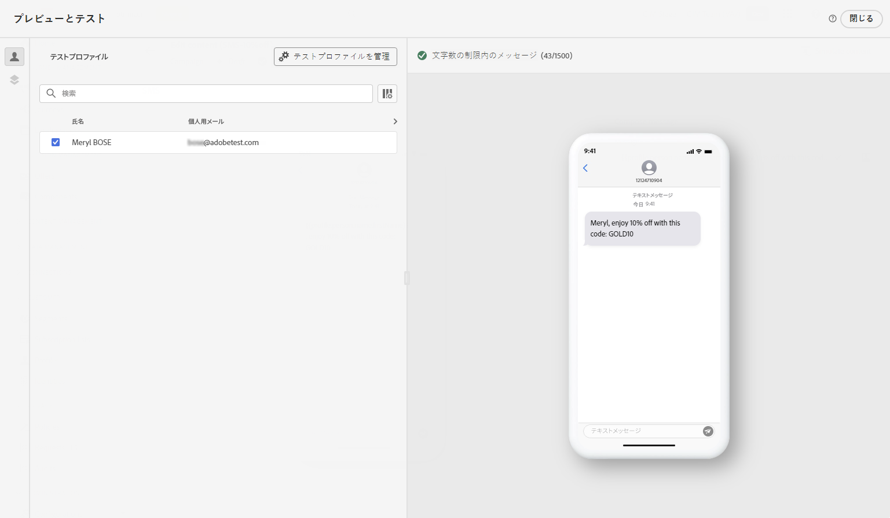
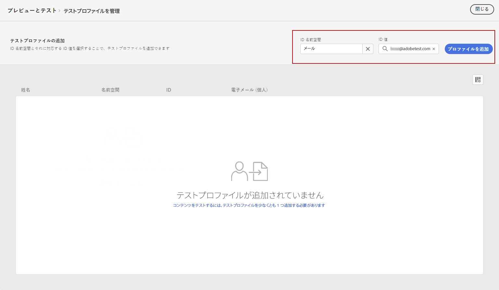
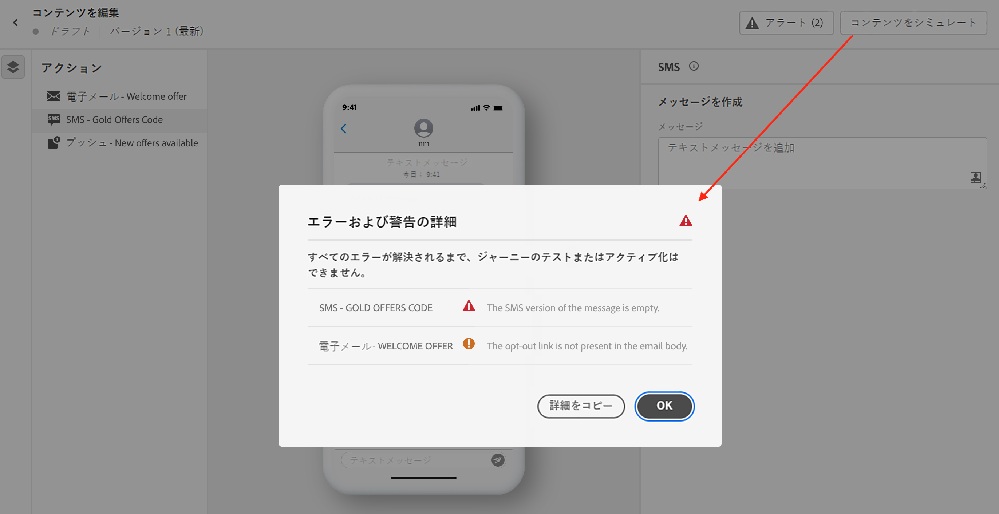

# テキストメッセージ（SMS／MMS）の確認および送信{#send-sms}

## テキストメッセージのプレビュー {#preview-sms}

メッセージコンテンツを定義したら、（CSV／JSON ファイルからアップロードした、または手動で追加した）テストプロファイルやサンプル入力データを使用して、そのコンテンツをプレビューできます。パーソナライズされたコンテンツを挿入した場合は、そのコンテンツがメッセージ内でどのように表示されるかを確認できます。

これを行うには、「**[!UICONTROL コンテンツをシミュレート]**」をクリックし、テストプロファイルデータを使用してメッセージを確認します。

コンテンツをプレビューおよびテストする方法について詳しくは、[コンテンツ管理](../content-management/preview-test.md)の節を参照してください。

### 文字のエンコーディングと制限 {#sms-character-limits}

SMS メッセージの計画や管理に役立つ **[!UICONTROL コンテンツをシミュレート]** メニューにアクセスすると、文字数が表示されます。

Journey Optimizerの SMS エディターでは UTF-8 エンコーディングが使用され、2 バイト文字または Unicode 文字の入力や貼り付けが可能です。 これらの文字は、配信のためにサービスプロバイダーに送信されます。 ほとんどの SMS プロバイダーは、標準メッセージに対して 160 文字の制限がある GSM 7 ビットエンコーディングを使用し、GSM 以外の文字が 70 文字の制限で検出された場合は、UTF-16 （UCS-2）に切り替えます。

文字数カウントは、動的パーソナライゼーションや GSM 以外の 7 ビット特殊文字によって発生する変化を反映していません。

>[!IMPORTANT]
>
>Journey Optimizer SMS 配信レポートは、連結されたメッセージや動的なパーソナライゼーションを考慮しないので、プロバイダーから送信された実際のメッセージ数が反映されない場合があります。 詳細な使用方法と請求方法については、Adobeの担当者にお問い合わせください。
>
>SMS の請求超過を最小限に抑えるためのベストプラクティスについては、[&#x200B; 文字の最適化に関する SMS のベストプラクティス &#x200B;](sms-cost-optimization.md) を参照してください。

## コンテンツの検証 {#sms-validate}

エディターの上部セクションでアラートを確認する必要があります。単純な警告もありますが、メッセージの送信を妨げる可能性のある警告もあります。発生する可能性のあるアラートには、警告とエラーの 2 種類があります。

* **警告**&#x200B;は、レコメンデーションとベストプラクティスを指します。例えば、テキストメッセージが空の場合は警告メッセージが表示されます。

* **エラー**&#x200B;の場合は、それが解決されない限り、ジャーニーのテストやアクティブ化またはキャンペーンの公開はできません。例えば、件名がない場合は、それを警告するエラーメッセージが表示されます。

>[!NOTE]
>
> 配信品質を高めるには、プロバイダーでサポートされている形式の電話番号を使用します。 例えば、Twilio と Sinch では E.164 形式の電話番号のみをサポートしています。

## テキストメッセージの送信 {#sms-send}

>[!IMPORTANT]
>
> キャンペーンが承認ポリシーの対象となっている場合、テキストメッセージを送信できるようにするには、承認をリクエストする必要があります。[詳細情報](../test-approve/gs-approval.md)

テキストメッセージの準備が整ったら、[ジャーニー](../building-journeys/journey-gs.md)または[キャンペーン](../campaigns/create-campaign.md)の設定を完了して送信します。

**関連トピック**

* [SMS チャネルの設定](sms-configuration.md)
* [SMS／MMS レポート](../reports/journey-global-report-cja-sms.md)
* [テキストメッセージの作成](create-sms.md)
* [ジャーニーでのメッセージの追加](../building-journeys/journeys-message.md)
