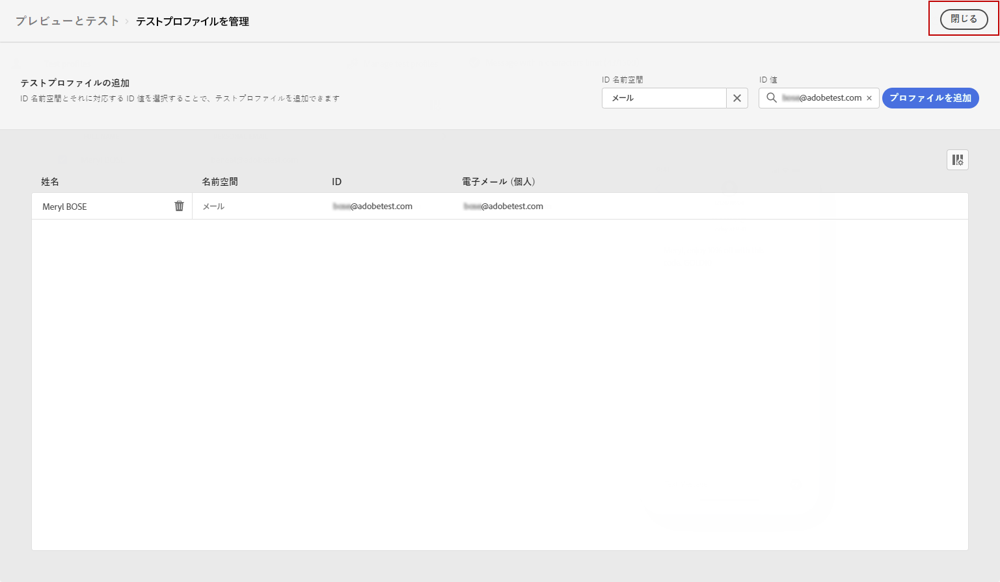

# SMS メッセージを送信する {#send-sms}

## SMS メッセージをプレビュー {#preview-sms}

メッセージコンテンツを定義したら、テストプロファイルを使用してプレビューとテストを行うことができます。パーソナライズされたコンテンツを挿入してある場合は、そのコンテンツがメッセージにどのように表示されるかを、テストプロファイルデータを利用して確認できます。

1. クリック **[!UICONTROL コンテンツをシミュレート]**.

1. クリック **[!UICONTROL テストプロファイルの管理]** をクリックして、テストプロファイルを追加します。

1. テストプロファイルを見つけるには、 **[!UICONTROL ID 名前空間]** および **[!UICONTROL ID 値]** フィールド。 次に、「 **[!UICONTROL プロファイルを追加]**.

   

1. テストプロファイルを選択したら、 **[!UICONTROL テストプロファイルを追加]** ウィンドウ

   

1. プレビューとテストウィンドウでは、メッセージコンテンツでテストプロファイルデータが利用されます。

   例えば、この SMS メッセージの場合、メッセージコンテンツは両方ともパーソナライズされます。

   

## SMS を検証{#sms-preview}

>[!NOTE]
>
> 配信品質を高めるには、必ずプロバイダーがサポートする形式の電話番号を使用する必要があります。例えば、Twilio と Sinch は E.164 形式の電話番号のみをサポートしています。

また、エディターの上部セクションでアラートを確認します。単純な警告もありますが、メッセージの使用を妨げる可能性のある警告もあります。次の 2 種類のアラートが発生する可能性があります。

* **警告**&#x200B;は、推奨奨事項とベストプラクティスを表します。例えば、SMS メッセージが空の場合はメッセージが表示されます。

* **エラー**&#x200B;が解決されない限り、ジャーニーのテストやアクティブ化はできません。例えば、件名がないことを警告するメッセージが表示されます。

SMS メッセージの準備が整ったら、 [ジャーニー](../building-journeys/journey-gs.md) または [campaign](../campaigns/create-campaign.md) 送信する

**関連トピック**

* [SMS チャネルの設定](sms-configuration.md)
* [SMS レポート](../reports/journey-global-report.md#sms-global)
* [SMS メッセージの作成](create-sms.md)
* [ジャーニーでのメッセージの追加](../building-journeys/journeys-message.md)
