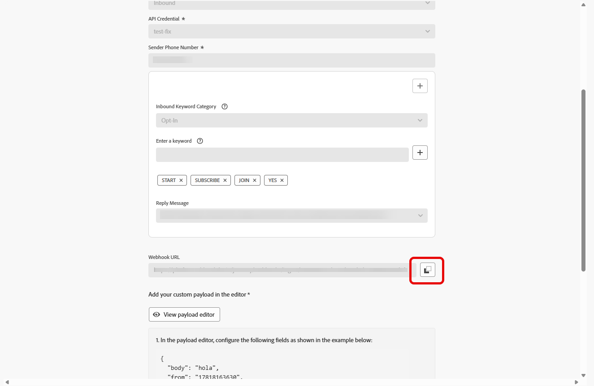

# カスタムプロバイダーの設定 {#sms-configuration-custom}

>[!CONTEXTUALHELP]
>id="ajo_admin_sms_api_byop_provider_url"
>title="プロバイダー URL"
>abstract="接続する予定の外部 API の URL を指定します。この URL は、API の機能にアクセスするためのエンドポイントとして機能します。"

>[!CONTEXTUALHELP]
>id="ajo_admin_sms_api_byop_header_parameters"
>title="ヘッダーパラメーター"
>abstract="適切な認証、コンテンツの書式設定、効果的な API 通信を有効にするために、追加ヘッダーのラベル、タイプ、値を指定します。 "

>[!CONTEXTUALHELP]
>id="ajo_admin_sms_api_byop_provider_payload"
>title="プロバイダーペイロード"
>abstract="処理と応答の生成用に正しいデータの送信を確保するために、リクエストペイロードを指定します。"

この機能により、独自のメッセージプロバイダーを統合および設定できるようになり、デフォルトのオプション（Sinch、Twilio、Infobip）を超える柔軟性が得られます。これにより、SMS メッセージと RCS メッセージの両方に対してシームレスなオーサリング、配信、レポート、同意管理が可能になります。

カスタムプロバイダー設定を使用すると、Journey Optimizer 内でサードパーティのメッセージサービスを直接接続し、動的コンテンツのメッセージペイロードをカスタマイズし、オプトイン／オプトアウトの環境設定を管理して、SMS チャネルと RCS チャネルの両方でコンプライアンスを確保できます。

カスタムプロバイダーを設定するには、次の手順に従います。

1. [API 資格情報の作成](#api-credential)
1. [Webhook の作成](#webhook)
1. [チャネル設定の作成](sms-configuration-surface.md)
1. [SMS チャネルアクションを使用したジャーニーまたはキャンペーンの作成](create-sms.md)

## API 資格情報の作成 {#api-credential}

アドビで標準で使用できないカスタムプロバイダー（Sinch、Infobip、Twilio など）を使用して Journey Optimizer で SMS メッセージと RCS メッセージを送信するには、次の手順に従います。

1. 左側のパネルで、**[!UICONTROL 管理]** `>` **[!UICONTROL チャネル]**&#x200B;に移動し、**[!UICONTROL SMS 設定]**&#x200B;の下にある **[!UICONTROL API 資格情報]**&#x200B;メニューを選択して、「**[!UICONTROL 新しい API 資格情報を作成]**」ボタンをクリックします。

   

1. 以下で説明するように、SMS API 資格情報を設定します。

   * **[!UICONTROL SMS ベンダー]**：カスタム。

   * **[!UICONTROL 名前]**：API 資格情報の名前を入力します。

   * **[!UICONTROL プロバイダーのアプリ ID]**：SMS プロバイダーから提供されたアプリケーション ID を入力します。

   * **[!UICONTROL プロバイダー名]**：SMS プロバイダーの名前を入力します。

   * **[!UICONTROL プロバイダーの URL]**：SMS プロバイダーの URL を入力します。

   * **[!UICONTROL 認証タイプ]**：認証タイプを選択し、選択した認証方法に基づいて[対応するフィールドに入力](#auth-options)します。

     

1. **[!UICONTROL mTLS サポート]** オプションを有効にします。これにより、安全な接続を確立する前に、クライアントとサーバーの両方が互いを認証するようにします。

   mTLS のみを使用するには、「**[!UICONTROL 認証タイプ]**」ドロップダウンから「**[!UICONTROL 認証なし]**」を選択し、「**[!UICONTROL mTLS サポート]**」を有効にします。

1. 「**[!UICONTROL ヘッダー]**」セクションで、「**[!UICONTROL 新しいパラメーターを追加]**」をクリックし、外部サービスに送信されるリクエストメッセージの HTTP ヘッダーを指定します。

   **Content-Type** および **Charset** ヘッダーフィールドはデフォルトで設定され、削除できません。

   

1. **[!UICONTROL プロバイダーペイロード]**&#x200B;を追加して、リクエストペイロードを検証およびカスタマイズします。

   RCS メッセージの場合、このペイロードは後で[コンテンツデザイン](create-sms.md#sms-content)中に使用されます。

1. API 資格情報の設定が完了したら、「**[!UICONTROL 送信]**」をクリックします。

1. **[!UICONTROL API 資格情報]**&#x200B;メニューで、をクリックして、API 資格情報を削除します。

   

1. 既存の資格情報を変更するには、目的の API 資格情報を見つけて、「**[!UICONTROL 編集]**」オプションをクリックして必要な変更を行います。

   

1. 既存の API 資格情報から「**[!UICONTROL SMS 接続を検証]**」をクリックし、指定されたデバイスにサンプルメッセージを送信して、SMS API 資格情報をテストおよび検証します。

1. 「**番号**」フィールドと「**メッセージ**」フィールドに入力し、「**[!UICONTROL 接続を確認]**」をクリックします。

   >[!IMPORTANT]
   >
   >メッセージは、プロバイダーのペイロード形式に合わせて構造化する必要があります。

   

API 資格情報を作成して設定した後、SMS メッセージの [Webhook のインバウンド設定](#webhook)を指定する必要があります。

### カスタム SMS プロバイダーの認証オプション {#auth-options}

>[!CONTEXTUALHELP]
>id="ajo_admin_sms_api_byop_auth_type"
>title="認証タイプ"
>abstract="API へのアクセスに必要な認証方法を指定します。これにより、外部サービスとの安全で承認済みの通信が確保されます。"

>[!BEGINTABS]

>[!TAB API キー]

API 資格情報を作成したら、API キー認証に必要なフィールドに入力します。

* **[!UICONTROL 名前]**：API キー設定の名前を入力します。
* **[!UICONTROL API トークン]**：SMS プロバイダーから提供された API トークンを入力します。

>[!TAB MAC 認証]

API 資格情報を作成したら、MAC 認証に必要なフィールドに入力します。

* **[!UICONTROL 名前]**：MAC 認証設定の名前を入力します。
* **[!UICONTROL API トークン]**：SMS プロバイダーから提供された API トークンを入力します。
* **[!UICONTROL API 秘密鍵]**：SMS プロバイダーから提供された API 秘密鍵を入力します。このは、安全な通信のための MAC（メッセージ認証コード）を生成するために使用されます。
* **[!UICONTROL MAC 認証ハッシュ形式]**：MAC 認証のハッシュ形式を選択します。

>[!TAB OAuth 認証]

API 資格情報を作成したら、OAuth 認証に必要なフィールドに入力します。

* **[!UICONTROL 名前]**：OAuth 認証設定の名前を入力します。

* **[!UICONTROL API トークン]**：SMS プロバイダーから提供された API トークンを入力します。

* **[!UICONTROL OAuth URL]**：OAuth トークンを取得する URL を入力します。

* **[!UICONTROL OAuth 本文]**：`grant_type`、`client_id`、`client_secret` などのパラメーターを含む、JSON 形式の OAuth リクエスト本文を指定します。

>[!TAB JWT 認証]

API 資格情報を作成したら、JWT 認証に必要なフィールドに入力します。

* **[!UICONTROL 名前]**：JWT 認証設定の名前を入力します。

* **[!UICONTROL API トークン]**：SMS プロバイダーから提供された API トークンを入力します。

* **[!UICONTROL JWT ペイロード]**：発行者、件名、オーディエンス、有効期限など、JWT に必要なクレームを含む JSON ペイロードを入力します。

>[!ENDTABS]

## Webhook の作成 {#webhook}

>[!BEGINSHADEBOX]

オプトインキーワードやオプトアウトキーワードを指定していない場合は、ユーザーのプライバシーを遵守するために標準の同意メッセージが使用されます。カスタムキーワードを追加すると、デフォルト設定が自動的に上書きされます。

**デフォルトのキーワード：**

* **オプトイン**：SUBSCRIBE、YES、UNSTOP、START、CONTINUE、RESUME、BEGIN
* **オプトアウト**：STOP、QUIT、CANCEL、END、UNSUBSCRIBE、NO
* **ヘルプ**：HELP

>[!ENDSHADEBOX]

API 資格情報が正常に作成されたら、次の手順では Webhook を作成し、インバウンド設定を指定します。この設定により、システムが受信データまたはメッセージを適切に受信して処理できます。

Webhook を設定する際に、取得するデータのタイプに基づいて目的を定義できます。

* **[!UICONTROL インバウンド]**：オプトインやオプトアウトなどの同意応答を取得し、ユーザーの環境設定を収集する場合は、このオプションを使用します。

* **[!UICONTROL フィードバック]**：このオプションを選択すると、レシートの読み取りやユーザーのインタラクションなど、配信およびエンゲージメントイベントをトラッキングし、レポートや分析をサポートすることができます。

>[!BEGINTABS]

>[!TAB  インバウンド ]

1. 左側のパネルで、**[!UICONTROL 管理]** `>` **[!UICONTROL チャネル]**&#x200B;に移動し、**[!UICONTROL SMS 設定]**&#x200B;の下にある **[!UICONTROL SMS Webhook]** メニューを選択して、「**[!UICONTROL Webhook を作成]**」ボタンをクリックします。

   

1. 以下で説明するように、Webhook 設定を指定します。

   * **[!UICONTROL 名前]**：Webhook の名前を入力します。

   * **[!UICONTROL SMS ベンダーを選択]**：カスタム。

   * **[!UICONTROL タイプ]**：インバウンド。

   * **[!UICONTROL API 資格情報]**:（以前に設定した API 資格情報 [ ドロップダウンから選択 ](#api-credential) ます。

1. 「」をクリックしてキーワードカテゴリを追加し、次のように設定します。

   * **[!UICONTROL 受信キーワードカテゴリ]**：キーワードカテゴリを **[!UICONTROL オプトイン]**、**[!UICONTROL オプトアウト]**、**[!UICONTROL ヘルプ]** または **[!UICONTROL デフォルト]** から選択します。

   * **[!UICONTROL キーワードを入力]**: メッセージを自動的にトリガーにするデフォルトまたはカスタムのキーワードを入力します。 複数のキーワードの場合は、コンマ区切り値を使用します。

   * **[!UICONTROL 返信メッセージ]**：自動的に送信されるカスタムの応答を入力します。

   

1. 「**[!UICONTROL ファジーオプトアウト]**」オプションを有効にすると、オプトアウトキーワードに類似したメッセージ（「CANCIL」など）が検出されます。

1. 「**[!UICONTROL ペイロードエディターを表示]**」をクリックして、リクエストペイロードを検証およびカスタマイズします。

   プロファイル属性を使用してペイロードを動的にパーソナライズし、ビルトインのヘルパー関数を使用して、処理と応答の生成のために正確なデータを確実に送信できます。

1. Webhook の設定が完了したら、「**[!UICONTROL 送信]**」をクリックします。

1. **[!UICONTROL Webhook]** メニューで、をクリックして、Webhook を削除します。

1. 既存の設定を変更するには、目的の Webhook を見つけて、「**[!UICONTROL 編集]**」オプションをクリックして必要な変更を行います。

1. 以前に送信した **[!UICONTROL Webhook]** から新しい **[!UICONTROL Webhook URL]** にアクセスしてコピーします。

   

Webhook のインバウンド設定を作成し指定したら、SMS メッセージ用の[チャネル設定](sms-configuration-surface.md)を作成する必要があります。

設定が完了すると、メッセージオーサリング、パーソナライゼーション、リンクトラッキング、レポートなど、すべての標準のチャネル機能を活用できます。

>[!TAB フィードバック]

1. 左側のパネルで、**[!UICONTROL 管理]** `>` **[!UICONTROL チャネル]**&#x200B;に移動し、**[!UICONTROL SMS 設定]**&#x200B;の下にある **[!UICONTROL SMS Webhook]** メニューを選択して、「**[!UICONTROL Webhook を作成]**」ボタンをクリックします。

   

1. 以下で説明するように、Webhook 設定を指定します。

   * **[!UICONTROL 名前]**：Webhook の名前を入力します。

   * **[!UICONTROL SMS ベンダーを選択]**：カスタム。

   * **[!UICONTROL タイプ]** : フィードバック。

1. 「**[!UICONTROL ペイロードエディターを表示]**」をクリックして、リクエストペイロードを検証およびカスタマイズします。

   プロファイル属性を使用してペイロードを動的にパーソナライズし、ビルトインのヘルパー関数を使用して、処理と応答の生成のために正確なデータを確実に送信できます。

1. Webhook の設定が完了したら、「**[!UICONTROL 送信]**」をクリックします。

1. **[!UICONTROL Webhook]** メニューで、をクリックして、Webhook を削除します。

1. 既存の設定を変更するには、目的の Webhook を見つけて、「**[!UICONTROL 編集]**」オプションをクリックして必要な変更を行います。

1. 以前に送信した **[!UICONTROL Webhook]** から新しい **[!UICONTROL Webhook URL]** にアクセスしてコピーします。

   

Webhook のインバウンド設定を作成し指定したら、SMS メッセージ用の[チャネル設定](sms-configuration-surface.md)を作成する必要があります。

設定が完了すると、メッセージオーサリング、パーソナライゼーション、リンクトラッキング、レポートなど、すべての標準のチャネル機能を活用できます。

>[!ENDTABS]

## チュートリアルビデオ {#video}

>[!VIDEO](https://video.tv.adobe.com/v/3431625)

