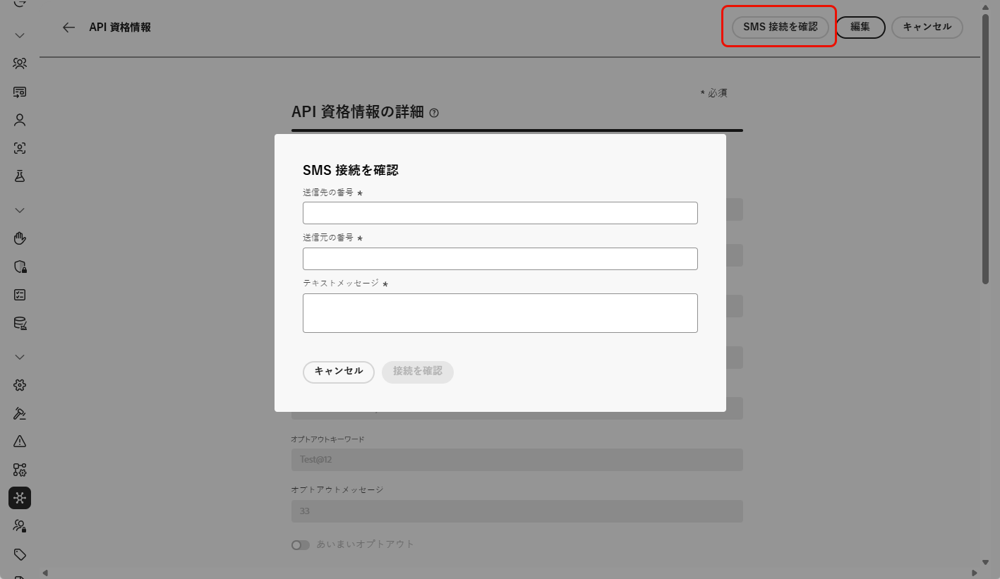

# Infobip プロバイダーの設定 {#sms-configuration-infobip}

InfobipとAdobe Journey Optimizerを統合することで、ジャーニーやキャンペーンの一環として、プロファイルにテキストメッセージを配信できます。

InfobipをSMS プロバイダーとして設定するには、次の手順に従います。

1. [API 資格情報の作成](#api-credential)
1. [Webhook の作成](sms-webhook.md)
1. [チャネル設定の作成](sms-configuration-surface.md)
1. [SMS チャネルアクションを使用したジャーニーまたはキャンペーンの作成](create-sms.md)

## SMS 用の API 資格情報の設定 {#api-credential}

Journey Optimizer に Infobip を設定するには、次の手順に従います。

1. 左側のパネルで、**[!UICONTROL 管理]** `>` **[!UICONTROL チャネル]**&#x200B;を参照し、**[!UICONTROL API 資格情報]**&#x200B;メニューを選択します。 「**[!UICONTROL 新しい API 資格情報を作成]**」ボタンをクリックします。

1. 以下で説明するように、SMS API 資格情報を設定します。

   +++ 設定用の SMS 資格情報のリスト

   | 設定フィールド | 説明 |
   |---|---|
   | SMS ベンダー | Infobip |
   | 名前 | API 資格情報の名前を選択します。 |
   | API ベース URL と API キー | 資格情報を検索するには、web インターフェイスのホームページまたは API キー管理ページにアクセスします。 地域または代替ドメインのエンドポイント（例：`api-ny2.infobip.com`）の場合は、完全なベース URL を指定し、Infobip サポートを使用して認証トークンを確認します。  詳しくは、[Infobip のドキュメント](https://www.infobip.com/docs/api){target="_blank"}を参照してください |
   | プリンシパルエンティティ ID | 割り当てられた DLT プリンシパルエンティティ ID を入力します。 |
   | コンテンツテンプレート ID | 登録済みの DLT コンテンツテンプレート ID を入力します。 |
   | 有効期間 | メッセージの有効期間を時間単位で入力します。 この時間枠内にメッセージを配信できない場合は、システムは追加の再送信を試みます。 デフォルトの有効期間は 48 時間に設定されています。 |
   | コールバックデータ | 通知 URL で送信する追加のクライアントデータを入力します。 |
   | インバウンド番号 | ユニークなインバウンド番号を追加します。 これにより、それぞれに独自のインバウンド番号を持つ異なるサンドボックス間で同じ API 資格情報を使用できます。 |

   +++

1. 「**[!UICONTROL あいまいオプトアウト]**」オプションを有効にすると、オプトアウトキーワード（「キャンシル」など）に類似したメッセージを検出し、「**[!UICONTROL あいまい自動返信]**」フィールドで確認返信をカスタマイズできます。

   **[!UICONTROL あいまいオプトアウト]**&#x200B;は、メッセージが定義済みのオプトアウトキーワードと完全に一致しない場合でも、ユーザーが登録解除を希望していることを示す SMS メッセージを識別します。 一般的なオプトアウトフレーズや特定の攻撃用語を検出できるので、キャンペーンでユーザーの環境設定を適用し、コンプライアンスを維持するのに役立ちます。

1. 「**[!UICONTROL インバウンドのカスタムデータセットを使用]**」を選択して、この資格情報のインバウンド SMSを、ドロップダウンから選択した事前作成データセットにルーティングします。 [ インバウンドキーワードのカスタムデータセットの使用について詳しく見る](custom-dataset-inbound-keywords.md)

   >[!NOTE]
   >
   >データセットスキーマは&#x200B;**[!UICONTROL XDM ExperienceEvent]**&#x200B;である必要があり、少なくとも次のフィールドグループを含める必要があります。
   >* Adobe CJM ExperienceEvent - メッセージインタラクションの詳細
   >* Adobe CJM ExperienceEvent - Message Execution Details
   >* Adobe CJM ExperienceEvent - メッセージプロファイル詳細
   >
   >プロファイルに対してスキーマとデータセットを有効にする必要があります。

1. API 資格情報の設定が完了したら、「**[!UICONTROL 送信]**」をクリックします。

1. **[!UICONTROL API 資格情報]**&#x200B;メニューで、ごみ箱アイコンをクリックして、API 資格情報を削除します。

1. 既存の資格情報を変更するには、目的の API 資格情報を見つけて、「**[!UICONTROL 編集]**」オプションをクリックして必要な変更を行います。

1. 既存の API 資格情報から「**[!UICONTROL SMS 接続を検証]**」をクリックし、指定されたデバイスにサンプルメッセージを送信して、SMS API 資格情報をテストおよび検証します。

1. 「**番号**」フィールドと「**メッセージ**」フィールドに入力し、「**[!UICONTROL 接続を確認]**」をクリックします。

   >[!IMPORTANT]
   >
   >メッセージは、プロバイダーのペイロード形式に合わせて構造化する必要があります。

   

API 資格情報を作成して設定したら、SMS および MMS メッセージ用のチャネル設定を作成する必要があります。 [詳細情報](sms-configuration-surface.md)

## RCS 用の API 資格情報の設定

RCS メッセージは、[カスタム SMS プロバイダー](sms-configuration-custom.md)機能を使用する Infobip を通じて Adobe Journey Optimizer でサポートされます。 これにより、カルーセル、ボタン、マルチメディアコンテンツなどの要素を組み込んだ、検証済みのビジネスプロファイルを通じてリッチでインタラクティブなメッセージを配信できます。

➡️ [Infobip ドキュメントで Infobip が RCS をサポートする方法を見る](https://www.infobip.com/docs/api/channels/rcs)

Infobip で RCS メッセージを有効にするには、カスタム SMS プロバイダー経由で新しい API 資格情報を設定する必要があります。 RCS では異なるペイロード形式が必要なので、既存の Infobip SMS 資格情報とは互換性がありません。

Infobip で RCS を設定するには：

1. **Infobip 経由での RCS のビジネスの登録**

   まず、Infobip プラットフォーム内で RCS オンボーディングと登録のプロセスを完了します。 これには、RCS 送信者プロファイルの設定と、アカウントが RCS 対応であることの確認が含まれます。 詳しくは、[Infobip のドキュメント](https://www.infobip.com/docs/rcs/get-started)を参照してください。

1. **SMS Webhook の作成**

   Journey Optimizer で[カスタム SMS webhook を設定](sms-configuration-custom.md#webhook)します。 この webhook は、Infobip のプラットフォームからの配信レシート、インバウンド RCS メッセージおよびステータス更新の処理を担当します。

1. **SMS ベンダーとしてカスタムを使用した API 資格情報の作成**

   Journey Optimizer 内で、SMS プロバイダーとして「カスタム」を選択して、[新しい API 資格情報を作成](sms-configuration-custom.md#api-credential)します。 適切な RCS エンドポイント認証方法、ベース URL およびヘッダーを使用します。

API資格情報を作成して設定したら、次に[Webhook](sms-webhook.md)とRCS メッセージのチャネル設定を作成する必要があります。 [詳細情報](sms-configuration-surface.md)
