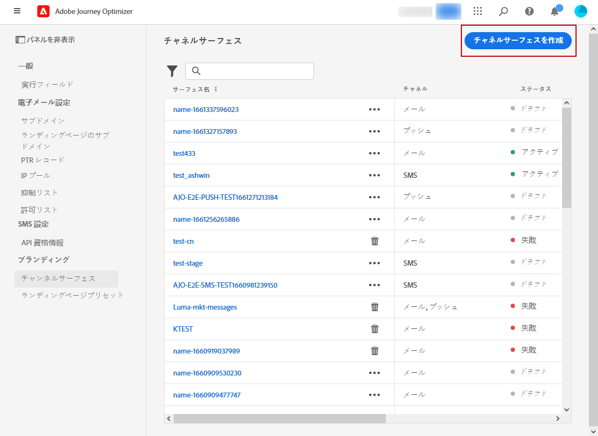
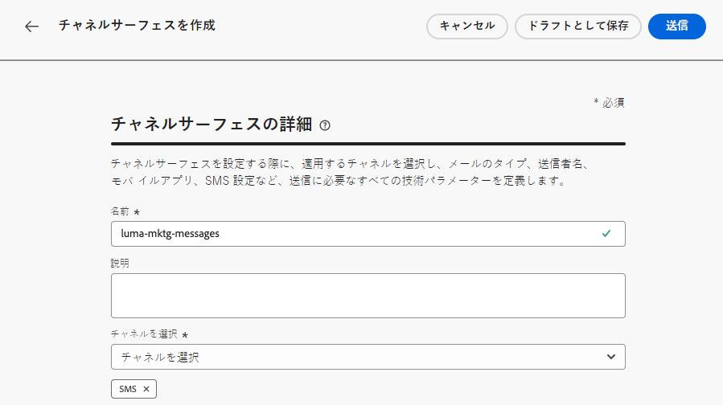
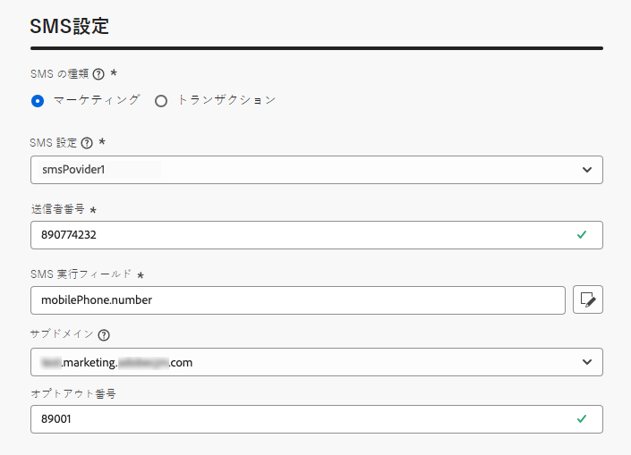
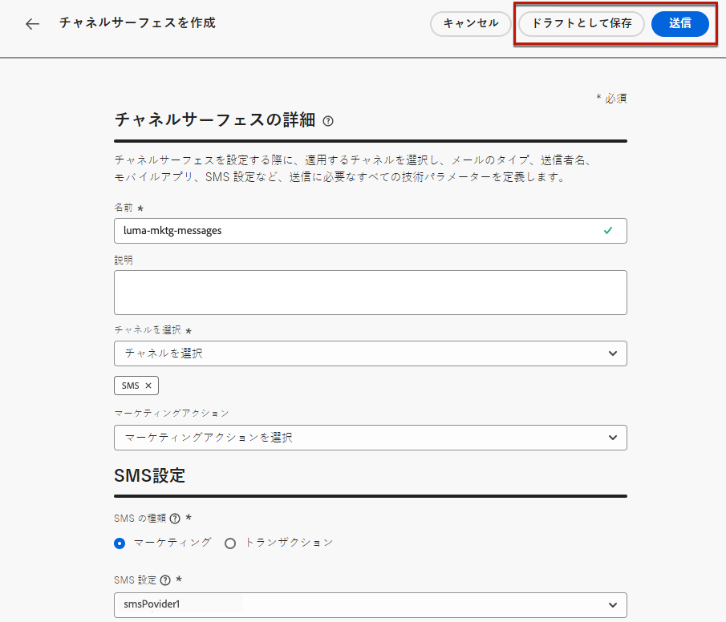
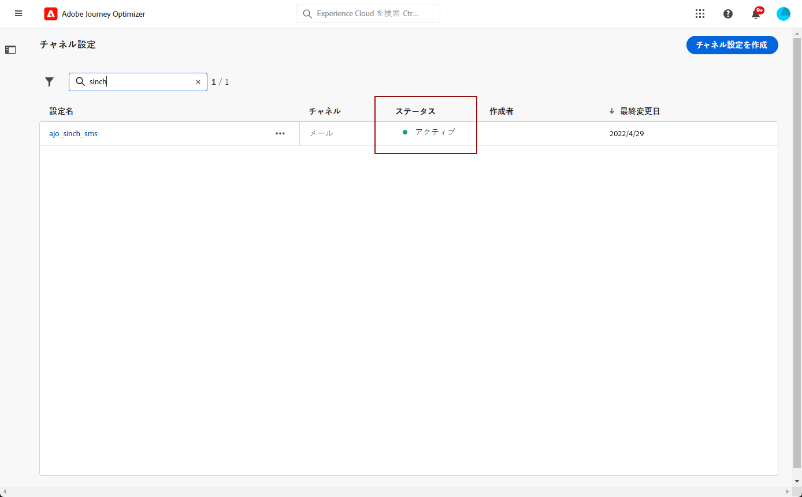

# SMS／MMS 設定の作成 {#message-preset-sms}

>[!CONTEXTUALHELP]
>id="ajo_admin_surface_sms_type"
>title="メッセージカテゴリの定義"
>abstract="この設定を使用するテキストメッセージのタイプを選択します（ユーザーの同意が必要なプロモーションメッセージの場合は「マーケティング」、パスワードリセットなどの非商用メッセージの場合は「トランザクション」）。"
>additional-url="https://experienceleague.adobe.com/docs/journey-optimizer/using/privacy/consent/opt-out.html?lang=ja#sms-opt-out-management" text="マーケティングテキストメッセージのオプトアウト"

SMS／MMS チャネルを設定したら、**[!DNL Journey Optimizer]** から SMS および MMS メッセージを送信できるように、チャネル設定を作成する必要があります。

チャネル設定を作成するには、次の手順に従います。

1. 左側のパネルで、**[!UICONTROL 管理]**／**[!UICONTROL チャネル]**&#x200B;を参照し、**[!UICONTROL 一般設定]**／**[!UICONTROL チャネル設定]**&#x200B;を選択します。「**[!UICONTROL チャネル設定を作成]**」ボタンをクリックします。

   

1. 設定の名前と説明（オプション）を入力し、SMS チャネルを選択します。

   

   >[!NOTE]
   >
   > 名前は、文字（A ～ Z）で始める必要があります。使用できるのは英数字のみです。アンダースコア（`_`）、ドット（`.`）、ハイフン（`-`）も使用できます。

1. **SMS 設定**&#x200B;を定義します。

   

   設定を使用して送信する **[!UICONTROL SMS タイプ]**（**[!UICONTROL トランザクション]**&#x200B;または&#x200B;**[!UICONTROL マーケティング]**）を選択することから開始します。

   * プロモーションテキストメッセージの場合は、「**マーケティング**」を選択します。これらのメッセージにはユーザーの同意が必要です。
   * 注文確認、パスワードリセット通知、配信情報などの非商用メッセージの場合は、「**トランザクション**」を選択します。

   SMS／MMS の作成時に、選択したメッセージカテゴリに一致する有効なチャネル設定を選択する必要があります。

   >[!CAUTION]
   >
   >**トランザクション**&#x200B;メッセージは、アドビからのお知らせで購読を解除したプロファイルに送信できます。これらのメッセージは、特定のコンテキストでのみ送信できます。

1. 「**[!UICONTROL SMS 設定]**」を選択し、設定と関連付けます。

   SMS メッセージを送信する環境の設定方法については、[この節](#create-api)を参照してください。

1. コミュニケーションに使用する「**[!UICONTROL 送信者番号]**」を入力します。

1. 「**[!UICONTROL SMS 実行フィールド]**」を選択して、プロファイルの電話番号に関連付けられた「**[!UICONTROL プロファイル属性]**」を選択します。

1. SMS メッセージで URL 短縮機能を使用する場合は、**[!UICONTROL サブドメイン]**&#x200B;リストから項目を選択します。

   >[!NOTE]
   >
   >サブドメインを選択するには、1 つ以上の SMS／MMS サブドメインを事前に設定していることを確認してください。[方法についてはこちらを参照](sms-subdomains.md)

1. すべてのパラメーターを設定したら、「**[!UICONTROL 送信]**」をクリックして確定します。なお、チャネル設定をドラフトとして保存し、後で設定を再開することもできます。

   

1. チャネル設定が作成されると、リストに「**[!UICONTROL 処理中]**」のステータスで表示されます。

   >[!NOTE]
   >
   >チェックが成功しなかった場合、考えられる失敗理由について詳しくは[この節](#monitor-channel-surfaces)を参照してください。

1. チェックが正常に完了すると、チャネル設定のステータスが「**[!UICONTROL アクティブ]**」になります。メッセージの配信に使用する準備が整いました。

   

これで、Journey Optimizer でテキストメッセージを送信する準備が整いました。
