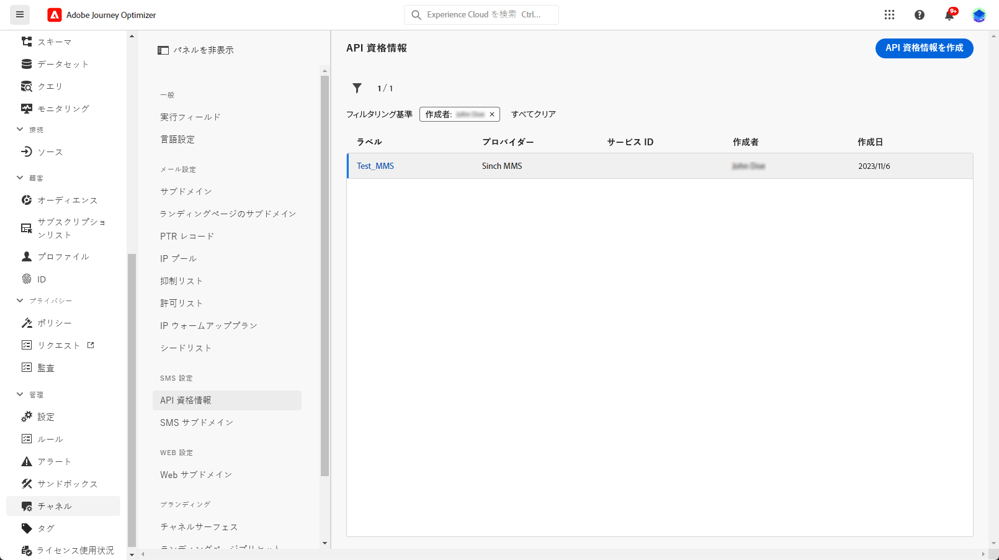

# Twilio プロバイダーの設定 {#sms-configuration-twilio}

Journey Optimizerで Twilio を設定するには、Twilio に使用する新しい API 資格情報を作成する必要があります。

1. 左側のパネルで、**[!UICONTROL 管理]**／**[!UICONTROL チャネル]**&#x200B;を参照し、**[!UICONTROL API 資格情報]**&#x200B;メニューを選択します。「**[!UICONTROL 新しい API 資格情報の作成]**」ボタンをクリックします。

   

1. 以下で説明するように、SMS API 資格情報を設定します。

   * **[!UICONTROL 名前]**：API 資格情報の名前を選択します。

   * **[!UICONTROL アカウント SID]** および&#x200B;**[!UICONTROL 認証トークン]**：Twilio コンソールダッシュボードページの&#x200B;**アカウント情報**&#x200B;パネルにアクセスして、資格情報を検索します。

   * **[!UICONTROL メッセージ SID]**：Twilio の API で作成されたすべてのメッセージに割り当てられる一意の ID を入力します。詳しくは、[Twilio のドキュメント](https://support.twilio.com/hc/en-us/articles/223134387-What-is-a-Message-SID-){target="_blank"}を参照してください。

1. API 資格情報の設定が完了したら、「**[!UICONTROL 送信]**」をクリックします。

API 認証情報を作成して設定した後、SMS および MMS メッセージ用のチャネルサーフェスを作成する必要があります。 [詳細情報](sms-configuration-surface.md)

