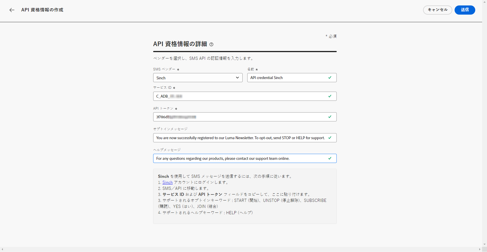
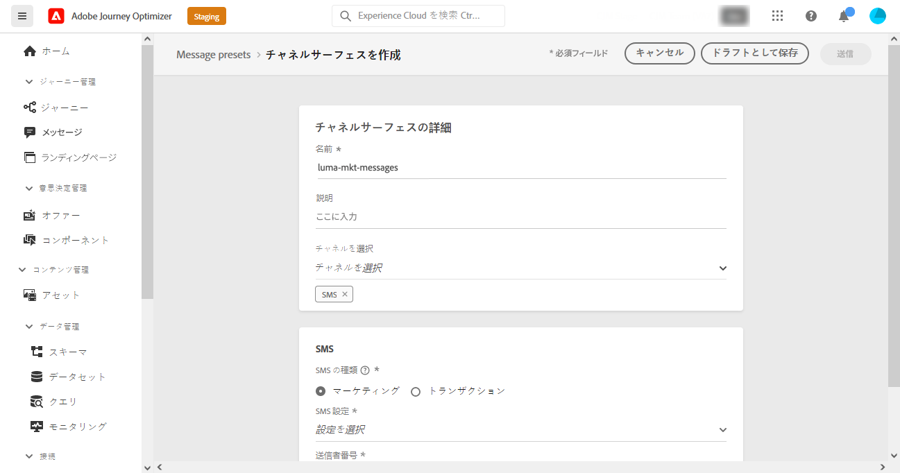
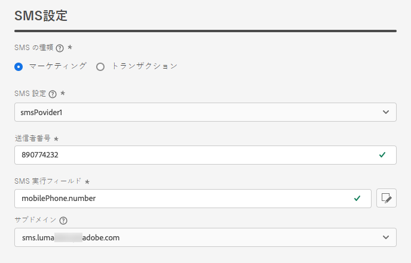
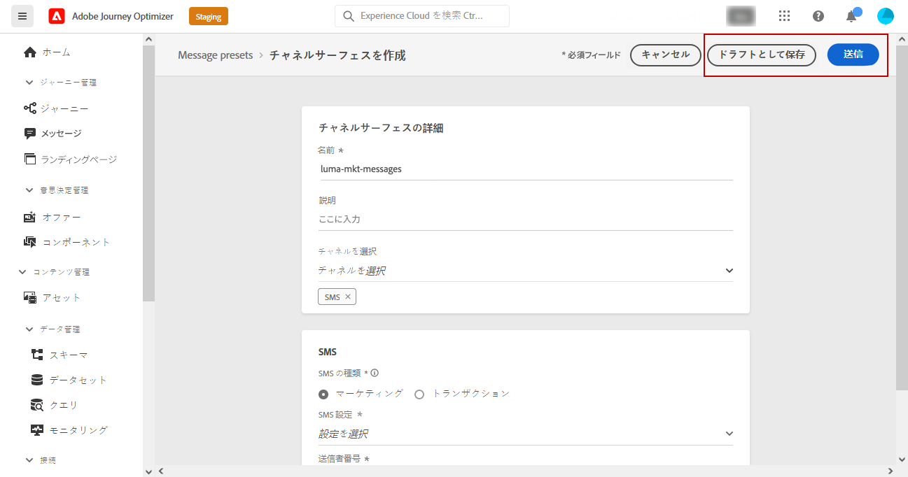

# SMS チャネルの設定 {#sms-configuration}

[!DNL Journey Optimizer] journeys を作成し、対象ユーザーにメッセージを送信することができます。

SMS を送信する前に、インスタンスを設定します。 プロバイダー設定 ](#create-api) を、旅オプティマイザーと統合し [ 、sms サーフェス ](#message-preset-sms) (sms プリセット) を作成する [ 必要があります。これらの手順は、 [ Adobe 旅オプティマイザーのシステム管理者 ](../start/path/administrator.md) が実行する必要があります。

>[!IMPORTANT]
>
>Adobe の旅オプティマイザーは、現在のところ、SMS サービスを提供している Adobe の旅の Twilio などのサードパーティのプロバイダーと統合しています。  SMS 設定を行う前に、これらの SMS プロバイダーのいずれかを使用して、API トークンとサービス ID を受け取るアカウントを作成する必要があります。これにより、Adobe 旅オプティマイザーと適用可能な SMS プロバイダー間の接続を確立することができます。 SMS サービスの利用には、該当する SMS プロバイダーの追加の利用条件が適用されます。 このような Ch and Twilio は、統合によって Adobe Aioptimizer ユーザーが利用できるサードパーティ製品です。また、SMS サービスに関連する問題または調査については、Twilio のユーザーが、その他のサポート対象の SMS プロバイダーに連絡することが必要になります。 アドビシステムズ社では、サードパーティ製品を管理することはできません。

## 新規 API 資格情報の作成 {#create-api}

>[!CONTEXTUALHELP]
>id="ajo_admin_sms_api_header"
>title="SMS 仕入先を、旅オプティマイザーで構成します。"
>abstract="ベンダーを選択し、SMS API の資格情報を入力します。"

>[!CONTEXTUALHELP]
>id="ajo_admin_sms_api"
>title="SMS 仕入先を、旅オプティマイザーで構成します。"
>abstract="SMS を送信する前に、プロバイダーの設定と、旅のオプティマイザーを統合しておく必要があります。 完了したら、SMS サーフェイスを作成する必要があります。 これらの手順は、Adobe 旅オプティマイザーのシステム管理者が実行する必要があります。"
>additional-url="https://experienceleague.adobe.com/docs/journey-optimizer/using/sms/sms-configuration.html?lang=en#message-preset-sms" text="SMS チャンネルサーフェスの作成"

>[!CONTEXTUALHELP]
>id="ajo_admin_sms_configuration"
>title="SMS ベンダー設定を選択します。"
>abstract="SMS ベンダー用に設定されている API 資格情報を選択します。"

以下の手順を実行して、SMS ベンダーを旅のオプティマイザーに設定します。

1. **[!UICONTROL Administration]**> **[!UICONTROL Channels]** > **[!UICONTROL API Credentials]** メニューにアクセスし、をクリック **[!UICONTROL Create API credential]** します。

   

1. 次のように **[!UICONTROL SMS vendor]** 選択します。

   * [!DNL Sinch]. および **[!UICONTROL API Token]** を検索 **[!UICONTROL Service ID]** するには、> () を使用して、SMS にアクセスしてください。
   * [!DNL Twilio]. を検索 **[!UICONTROL Service ID]** **[!UICONTROL API Token]** するには、コンソールのダッシュボードページの「アカウント情報」ペインにアクセスします。

1. API 資格情報に「a」と **[!UICONTROL Name]** 入力します。

1. **[!UICONTROL Service ID]**&#x200B;および **[!UICONTROL API Token]** を入力します。

   

1. API の資格情報の設定が終了したら、をクリックし **[!UICONTROL Submit]** ます。

API 資格情報を作成して設定した後、SMS メッセージのチャネルサーフェス (メッセージプリセット) を作成する必要があります。

## SMS メッセージのチャンネルサーフェスの作成 {#message-preset-sms}

>[!CONTEXTUALHELP]
>id="ajo_admin_surface_sms_type"
>title="SMS カテゴリを定義します。"
>abstract="このサーフェスを使用するときに送信される SMS メッセージの種類を選択します。販促用の SMS メッセージには、ユーザーの同意が必要な場合があります。また、特定のコンテキストのサブスクライブされていないプロファイルに送信することもできます。"
>additional-url="https://experienceleague.adobe.com/docs/journey-optimizer/using/privacy/consent/opt-out.html#sms-opt-out-management" text="「マーケティング SMS メッセージ」のオプトアウト"

SMS チャンネルを設定した後は、から **[!DNL Journey Optimizer]** sms メッセージを送信できるように、チャネルサーフェスを作成する必要があります。

チャンネルサーフェスを作成するには、以下の手順を実行します。

1. **[!UICONTROL Channels]**> **[!UICONTROL Branding]** > **[!UICONTROL Channel surfaces]** メニューにアクセスし、をクリック **[!UICONTROL Create channel surface]** します。

   

1. サーフェスの名前と説明 (オプション) を入力してから、SMS チャンネルを選択します。

   

   >[!NOTE]
   >
   > 名前の先頭には「A-z」の文字を使用する必要があります。 英数字のみを使用できます。 アンダースコア `_` 、ドット `.` 、ハイフン `-` 文字を使用することもできます。

1. SMS **設定を** 構成します。

   

   * **[!UICONTROL SMS Type]**&#x200B;サーフェス **[!UICONTROL Transactional]** **[!UICONTROL Marketing]** とともに送信されるを選択します。

   * サーフェスと関連付けるには **[!UICONTROL SMS configuration]** を選択します。

      環境を設定して SMS メッセージを送信する方法について詳しくは、次の項 ](#create-api) を [ 参照してください。

   * **[!UICONTROL Sender number]**&#x200B;通信に使用するを入力します。

   * **[!UICONTROL SMS Execution Field]**&#x200B;プロファイルの電話番号に関連付けられた「電話番号」を選択するには **[!UICONTROL Profile attribute]** 、「」を選択します。

1. すべてのパラメーターの設定が完了したら、「確認」をクリック **[!UICONTROL Submit]** します。 また、チャンネルサーフェスをドラフトとして保存し、その設定を後で再開することもできます。

   

1. 作成されたチャンネルは、状態と共 **[!UICONTROL Processing]** にリストに表示されます。

   >[!NOTE]
   >
   >確認が成功しなかった場合は、この節 ](#monitor-channel-surfaces) で [ 説明する失敗の理由について詳しく説明しています。

1. チェックが成功すると、チャネルサーフェスはステータスを取得 **[!UICONTROL Active]** します。 このような場合は、メッセージを配信するために使用することができます。

   

これで、旅のオプティマイザーを使用して SMS メッセージを送信する準備が整いました。

**関連トピック**

* [SMS メッセージの作成](create-sms.md)
* [メッセージの追加](../building-journeys/journeys-message.md)
