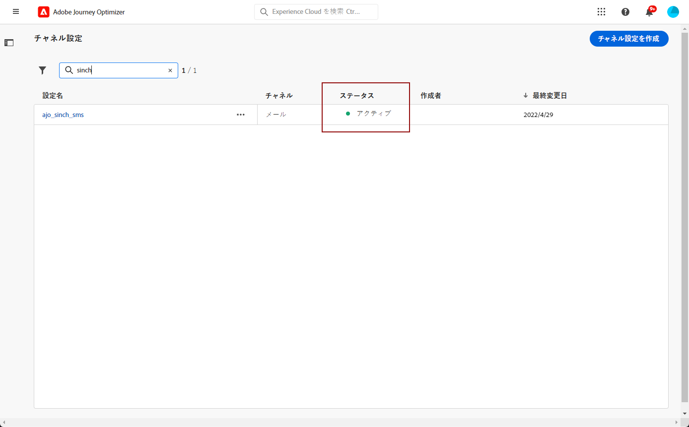

# SMS チャネルの設定 {#sms-configuration}

SMS または MMS を送信する前に、Adobe Journey Optimizer 環境を設定する必要があります。これを実行するには、次の操作を行います。

* Journey Optimizer と[プロバイダー設定を統合](#create-api)する
* MMS にも使用される [SMS サーフェスを作成](#message-preset-sms)する（SMS プリセットなど）

これらの手順は、Adobe Journey Optimizer [システム管理者](../start/path/administrator.md)が実行する必要があります。

## 前提条件{#sms-prerequisites}

Adobe Journey Optimizer は現在、Adobe Journey Optimizer とは独立してテキストメッセージングサービスを提供する、サードパーティプロバイダーと統合されています。テキストメッセージでサポートされているプロバイダーは、**Sinch**、**Twilio** および **Infobip** です。MMS は **Sinch** でのみサポートされます。

SMS チャネルを設定する前に、こうしたいずれかのプロバイダーのアカウントを作成して、Adobe Journey Optimizer と該当するプロバイダー間の接続を設定するために必要な **API トークン**&#x200B;と&#x200B;**サービス ID** を取得する必要があります。

テキストメッセージサービスを使用した場合、該当するプロバイダーが定める追加の利用条件に同意したとみなされます。Adobe Journey Optimizer ユーザーは、サードパーティソリューションとして、統合を通じて Sinch、Twilio、Infobip を利用できます。サードパーティ製品について、アドビは一切関係せず、責任も負いません。テキストメッセージサービス（SMS／MMS）に関する問題やサポートのリクエストについては、プロバイダーにお問い合わせください。

>[!CAUTION]
>
>SMS サブドメインにアクセスして編集するには、実稼動サンドボックスにおける **[!UICONTROL SMS サブドメインの管理]**&#x200B;権限が必要です。権限について詳しくは、[このページ](../administration/high-low-permissions.md#administration-permissions)を参照してください。
>

## 新しい API 資格情報の作成 {#create-api}

>[!CONTEXTUALHELP]
>id="ajo_admin_sms_api_header"
>title="Journey Optimizer での SMS プロバイダーの設定"
>abstract="Adobe Journey Optimizer では、SMS サービスプロバイダーを通じてテキストメッセージを送信します。プロバイダーを選択し、API 認証情報を入力します。"

>[!CONTEXTUALHELP]
>id="ajo_admin_mms_api_header"
>title="Journey Optimizer での MMS プロバイダーの設定"
>abstract="Adobe Journey Optimizer では、MMS サービスプロバイダーを通じてメディアコンテンツを送信します。プロバイダーを選択し、API 認証情報を入力します。"

>[!CONTEXTUALHELP]
>id="ajo_admin_sms_api"
>title="Journey Optimizer での SMS／MMS プロバイダーの設定"
>abstract="テキストメッセージ（SMS／MMS）を送信する前に、プロバイダー設定を Journey Optimizer と統合する必要があります。完了したら、SMS／MMS サーフェスを作成する必要があります。これらの手順は、Adobe Journey Optimizer システム管理者が実行する必要があります。"
>additional-url="https://experienceleague.adobe.com/docs/journey-optimizer/using/sms/sms-configuration.html?lang=ja#message-preset-sms" text="SMS チャネルサーフェスの作成"

>[!CONTEXTUALHELP]
>id="ajo_admin_sms_configuration"
>title="SMS ベンダー設定の選択"
>abstract="SMS ベンダーに設定する API 資格情報を選択します。"

### Sinch {#sinch-api}

お使いの SMS／MMS プロバイダーを Journey Optimizer に設定するには、次の手順に従います。

1. 左側のパネルで、**[!UICONTROL 管理]**／**[!UICONTROL チャネル]**&#x200B;を参照し、**[!UICONTROL API 資格情報]**&#x200B;メニューを選択します。「**[!UICONTROL 新しい API 資格情報の作成]**」ボタンをクリックします。

   

1. 以下で説明するように、SMS API 資格情報を設定します。

   * **[!UICONTROL 名前]**：API 資格情報の名前を選択します。

   * **[!UICONTROL サービス ID]** および **[!UICONTROL API トークン]**：API ページにアクセスして、「SMS」タブで資格情報を検索します。詳しくは、[Sinch のドキュメント](https://developers.sinch.com/docs/sms/getting-started/){target="_blank"}を参照してください。

   * **[!UICONTROL オプトインキーワード]**：**[!UICONTROL オプトインメッセージ]**&#x200B;を自動的にトリガーするデフォルトキーワードまたはカスタムキーワードを入力します。複数のキーワードの場合は、コンマ区切り値を使用します。

   * **[!UICONTROL オプトインメッセージ]**：**[!UICONTROL オプトインメッセージ]**&#x200B;として自動的に送信されるカスタム応答を入力します。

   * **[!UICONTROL オプトアウトキーワード]**：**[!UICONTROL オプトアウトメッセージ]**&#x200B;を自動的にトリガーするデフォルトキーワードまたはカスタムキーワードを入力します。複数のキーワードの場合は、コンマ区切り値を使用します。

   * **[!UICONTROL オプトアウトメッセージ]**：**[!UICONTROL オプトアウトメッセージ]**&#x200B;として自動的に送信されるカスタム応答を入力します。

   * **[!UICONTROL ヘルプキーワード]**：**ヘルプメッセージ**&#x200B;を自動的にトリガーするデフォルトまたはカスタムのキーワードを入力します。複数のキーワードの場合は、コンマ区切り値を使用します。

   * **[!UICONTROL ヘルプメッセージ]**：**ヘルプメッセージ**&#x200B;として自動的に送信されるカスタム応答を入力します。

   * **[!UICONTROL ダブルオプトインキーワード]**：ダブルオプトイン処理をトリガーするキーワードを入力します。ユーザープロファイルが存在しない場合は、確認が成功すると作成されます。複数のキーワードの場合は、コンマ区切り値を使用します。[詳しくは、SMS ダブルオプトインを参照してください](https://video.tv.adobe.com/v/3427129/?learn=on)。

   * **[!UICONTROL ダブルオプトインメッセージ]**：ダブルオプトインの確認に応じて自動的に送信されるカスタム応答を入力します。

1. API 資格情報の設定が完了したら、「**[!UICONTROL 送信]**」をクリックします。

API 資格情報を作成して設定した後、SMS メッセージ用のチャネルサーフェス（メッセージプリセットなど）を作成する必要があります。

### Sinch MMS {#sinch-mms}

Journey Optimizer で Sinch MMS を設定するには、次の手順に従います。

1. 左側のパネルで、**[!UICONTROL 管理]**／**[!UICONTROL チャネル]**&#x200B;を参照し、**[!UICONTROL API 資格情報]**&#x200B;メニューを選択します。「**[!UICONTROL 新しい API 資格情報の作成]**」ボタンをクリックします。

   

1. 以下で説明するように、SMS API 資格情報を設定します。

   * **[!UICONTROL 名前]**：API 資格情報の名前を選択します。

   * **[!UICONTROL プロジェクト ID]**、**[!UICONTROL アプリ ID]** および **[!UICONTROL API トークン]**：Conversation API メニューから、アプリメニューで資格情報を見つけることができます。詳しくは、[Sinch のドキュメント](https://docs.cc.sinch.com/cloud/service-configuration/en/oxy_ex-1/common/wln1620131604643.html){target="_blank"}を参照してください。

   * **[!UICONTROL サービスプラン ID]** および **[!UICONTROL SMS API トークン]**：**[!UICONTROL サービスプラン ID]** および **[!UICONTROL SMS API トークン]**&#x200B;は、API ページの「SMS」タブにあります。

1. API 資格情報の設定が完了したら、「**[!UICONTROL 送信]**」をクリックします。

API 資格情報を作成して設定した後、MMS メッセージ用のチャネルサーフェス（メッセージプリセットなど）を作成する必要があります。

### Twilio {#twilio-api}

Journey Optimizer で Twilio を設定するには、次の手順に従います。

1. 左側のパネルで、**[!UICONTROL 管理]**／**[!UICONTROL チャネル]**&#x200B;を参照し、**[!UICONTROL API 資格情報]**&#x200B;メニューを選択します。「**[!UICONTROL 新しい API 資格情報の作成]**」ボタンをクリックします。

   

1. 以下で説明するように、SMS API 資格情報を設定します。

   * **[!UICONTROL 名前]**：API 資格情報の名前を選択します。

   * **[!UICONTROL アカウント SID]** および&#x200B;**[!UICONTROL 認証トークン]**：Twilio コンソールダッシュボードページの&#x200B;**アカウント情報**&#x200B;パネルにアクセスして、資格情報を検索します。

   * **[!UICONTROL メッセージ SID]**：Twilio の API で作成されたすべてのメッセージに割り当てられる一意の ID を入力します。詳しくは、[Twilio のドキュメント](https://support.twilio.com/hc/en-us/articles/223134387-What-is-a-Message-SID-){target="_blank"}を参照してください。

1. API 資格情報の設定が完了したら、「**[!UICONTROL 送信]**」をクリックします。

API 資格情報を作成して設定した後、SMS メッセージ用のチャネルサーフェス（メッセージプリセットなど）を作成する必要があります。

### Infobip {#infobip-api}

Journey Optimizer で Infobip を設定するには、次の手順に従います。

1. 左側のパネルで、**[!UICONTROL 管理]**／**[!UICONTROL チャネル]**&#x200B;を参照し、**[!UICONTROL API 資格情報]**&#x200B;メニューを選択します。「**[!UICONTROL 新しい API 資格情報の作成]**」ボタンをクリックします。

   

1. 以下で説明するように、SMS API 資格情報を設定します。

   * **[!UICONTROL 名前]**：API 資格情報の名前を選択します。

   * **[!UICONTROL API ベース URL]** および **[!UICONTROL API キー]**：web インターフェイスのホームページまたは API キー管理ページにアクセスして、資格情報を検索します。詳しくは、[Infobip のドキュメント](https://www.infobip.com/docs/api){target="_blank"}を参照してください。

   * **[!UICONTROL オプトインキーワード]**：**[!UICONTROL オプトインメッセージ]**&#x200B;を自動的にトリガーするデフォルトまたはカスタムのキーワードを入力します。複数のキーワードの場合は、コンマ区切り値を使用します。

   * **[!UICONTROL オプトインメッセージ]**：**[!UICONTROL オプトインメッセージ]**&#x200B;として自動的に送信されるカスタム応答を入力します。

   * **[!UICONTROL オプトアウトキーワード]**：**[!UICONTROL オプトアウトメッセージ]**&#x200B;を自動的にトリガーするデフォルトキーワードを入力します。複数のキーワードの場合は、コンマ区切り値を使用します。

   * **[!UICONTROL オプトアウトメッセージ]**：**[!UICONTROL オプトアウトメッセージ]**&#x200B;として自動的に送信されるカスタム応答を入力します。

   * **[!UICONTROL ヘルプキーワード]**：**ヘルプメッセージ**&#x200B;を自動的にトリガーするデフォルトまたはカスタムのキーワードを入力します。複数のキーワードの場合は、コンマ区切り値を使用します。

   * **[!UICONTROL ヘルプメッセージ]**：**ヘルプメッセージ**&#x200B;として自動的に送信されるカスタム応答を入力します。

   * **[!UICONTROL ダブルオプトインキーワード]**：ダブルオプトイン処理をトリガーするキーワードを入力します。ユーザープロファイルが存在しない場合は、確認が成功すると作成されます。複数のキーワードの場合は、コンマ区切り値を使用します。

   * **[!UICONTROL ダブルオプトインメッセージ]**：ダブルオプトインの確認に応じて自動的に送信されるカスタム応答を入力します。

   * **[!UICONTROL プリンシパルエンティティ ID]**：割り当てられた DLT プリンシパルエンティティ ID を入力します。

   * **[!UICONTROL コンテンツテンプレート ID]**：登録済みの DLT コンテンツテンプレート ID を入力します。

   * **[!UICONTROL 有効期間]**：メッセージの有効期間を時間単位で入力します。この時間枠内にメッセージを配信できない場合は、システムは追加の再送信を試みます。デフォルトの有効期間は 48 時間に設定されています。

   * **[!UICONTROL コールバックデータ]**：通知 URL で送信する追加のクライアントデータを入力します。

1. API 資格情報の設定が完了したら、「**[!UICONTROL 送信]**」をクリックします。

API 資格情報を作成して設定した後、SMS メッセージ用のチャネルサーフェス（メッセージプリセットなど）を作成する必要があります。

## SMS サーフェスの作成 {#message-preset-sms}

>[!CONTEXTUALHELP]
>id="ajo_admin_surface_sms_type"
>title="メッセージカテゴリの定義"
>abstract="このサーフェスを使用するテキストメッセージのタイプを選択します（ユーザーの同意が必要なプロモーションメッセージの場合は「マーケティング」、パスワードリセットなどの非商用メッセージの場合は「トランザクション」）。"
>additional-url="https://experienceleague.adobe.com/docs/journey-optimizer/using/privacy/consent/opt-out.html?lang=ja#sms-opt-out-management" text="マーケティングテキストメッセージのオプトアウト"

SMS／MMS チャネルを設定したら、**[!DNL Journey Optimizer]** から SMS メッセージを送信できるように、チャネルサーフェスを作成する必要があります。

チャネルサーフェスを作成するには、次の手順に従います。

1. 左側のパネルで、**[!UICONTROL 管理]**／**[!UICONTROL チャネル]**&#x200B;を参照し、**[!UICONTROL ブランディング]**／**[!UICONTROL チャネルサーフェス]**&#x200B;を選択します。「**[!UICONTROL チャネルサーフェスを作成]**」ボタンをクリックします。

   

1. サーフェスの名前と説明（オプション）を入力し、SMS チャネルを選択します。

   

   >[!NOTE]
   >
   > 名前は、文字（A ～ Z）で始める必要があります。使用できるのは英数字のみです。アンダースコア（`_`）、ドット（`.`）、ハイフン（`-`）も使用できます。

1. **SMS 設定**&#x200B;を定義します。

   

   サーフェスを使用して送信する **[!UICONTROL SMS タイプ]**（**[!UICONTROL トランザクション]**&#x200B;または&#x200B;**[!UICONTROL マーケティング]**）を選択することから開始します。

   * プロモーションテキストメッセージの場合は、「**マーケティング**」を選択します。これらのメッセージにはユーザーの同意が必要です。
   * 注文確認、パスワードリセット通知、配信情報などの非商用メッセージの場合は、「**トランザクション**」を選択します。

   SMS／MMS の作成時に、選択したメッセージカテゴリに一致する有効なチャネルサーフェスを選択する必要があります。

   >[!CAUTION]
   >
   >**トランザクション**&#x200B;メッセージは、アドビからのお知らせで購読を解除したプロファイルに送信できます。これらのメッセージは、特定のコンテキストでのみ送信できます。

1. **[!UICONTROL SMS 設定]**&#x200B;を選択し、サーフェスと関連付けます。

   SMS メッセージを送信する環境の設定方法については、[この節](#create-api)を参照してください。

1. コミュニケーションに使用する「**[!UICONTROL 送信者番号]**」を入力します。

1. 「**[!UICONTROL SMS 実行フィールド]**」を選択して、プロファイルの電話番号に関連付けられた「**[!UICONTROL プロファイル属性]**」を選択します。

1. SMS メッセージで URL 短縮機能を使用する場合は、**[!UICONTROL サブドメイン]**&#x200B;リストから項目を選択します。

   >[!NOTE]
   >
   >サブドメインを選択するには、1 つ以上の SMS／MMS サブドメインを事前に設定していることを確認してください。[方法についてはこちらを参照](sms-subdomains.md)

1. このサーフェスにを使用する&#x200B;**[!UICONTROL オプトアウト番号]**&#x200B;を入力します。この番号からオプトアウトしたプロファイルは、[!DNL Journey Optimizer] でテキストメッセージを送信する際に使用している他の番号からも、引き続きメッセージを送信できます。

   >[!NOTE]
   >
   >[!DNL Journey Optimizer] の場合、テキストメッセージのオプトアウトはチャネルレベルで管理されなくなりました。現在は、数値に固有です。

1. すべてのパラメーターを設定したら、「**[!UICONTROL 送信]**」をクリックして確定します。なお、チャネルサーフェスをドラフトとして保存し、後で設定を再開することもできます。

   

1. チャネルサーフェスが作成されると、リストに「**[!UICONTROL 処理中]**」のステータスで表示されます。

   >[!NOTE]
   >
   >チェックが成功しなかった場合、考えられる失敗理由について詳しくは[この節](#monitor-channel-surfaces)を参照してください。

1. チェックが正常に完了すると、チャネルサーフェスのステータスが「**[!UICONTROL アクティブ]**」になります。メッセージの配信に使用する準備が整いました。

   

これで、Journey Optimizer でテキストメッセージを送信する準備が整いました。

**関連トピック**

* [テキストメッセージ（SMS／MMS）の作成](create-sms.md)
* [ジャーニーでのメッセージの追加](../building-journeys/journeys-message.md)
* [キャンペーンへのメッセージの追加](../campaigns/create-campaign.md)

