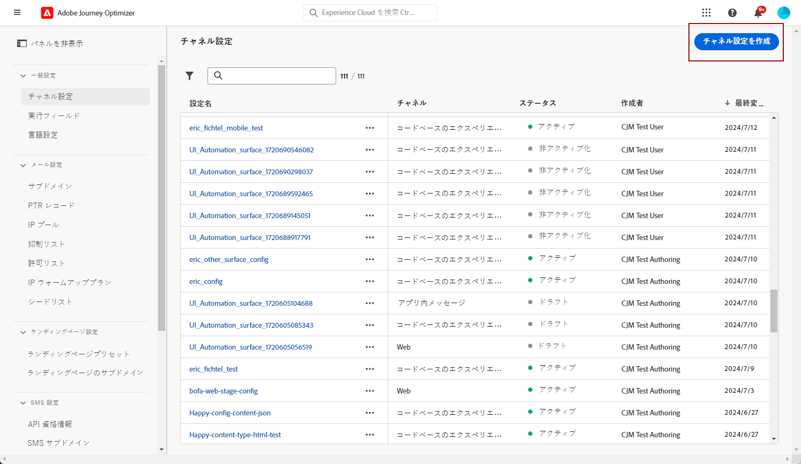
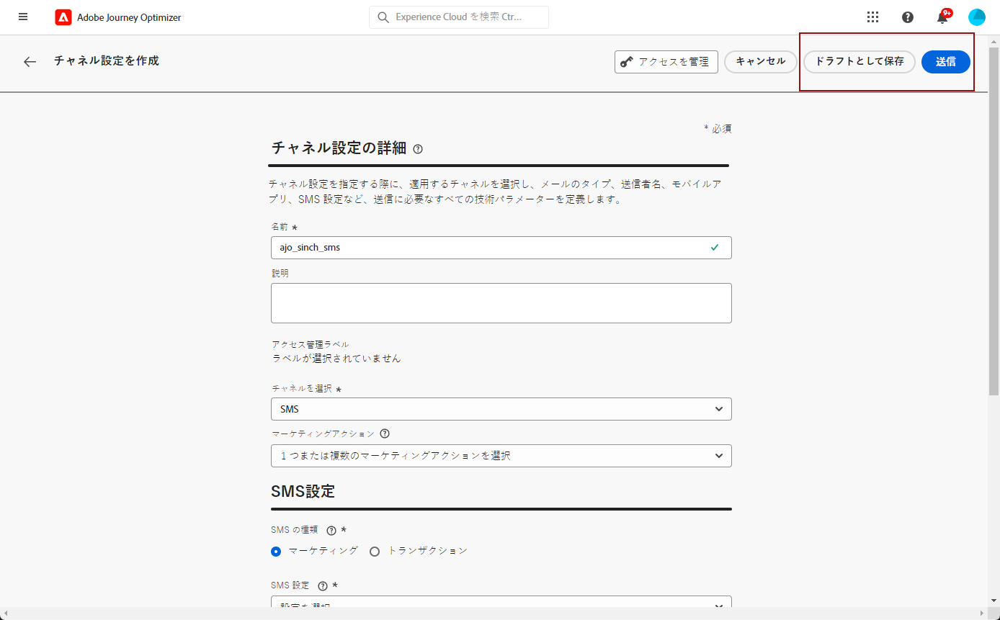

# SMS チャネルの設定 {#sms-configuration}

SMS または MMS を送信する前に、Adobe Journey Optimizer環境を設定する必要があります。 次の手順を実行します。

* [プロバイダー設定の統合](#create-api) Journey Optimizerと
* [SMS サーフェスの作成](#message-preset-sms) （例：SMS プリセット）。MMS にも使用されます。

これらの手順は、Adobe Journey Optimizerが実行する必要があります [システム管理者](../start/path/administrator.md).

## 前提条件{#sms-prerequisites}

Adobe Journey Optimizerは、現在、Adobe Journey Optimizerに依存しないテキストメッセージサービスを提供するサードパーティプロバイダーと統合されています。 テキストメッセージでサポートされるプロバイダーは次のとおりです。 **シンチ**, **Twilio** および **Infobip**. MMS はでのみサポートされます **シンチ**.

SMS チャネルを設定する前に、次のいずれかのプロバイダーのアカウントを作成して、 **API トークン** および **サービス ID**:Adobe Journey Optimizerと該当するプロバイダーの間の接続を設定する必要があります。

テキストメッセージサービスを使用する場合、該当するプロバイダーから提供される追加の利用条件が適用されます。 サードパーティのソリューションである Sinch、Twilio、Infobip は、統合を通じてAdobe Journey Optimizerのユーザーが利用できます。 Adobeは制御せず、サードパーティ製品に対する責任も負いません。 テキストメッセージサービス (SMS/MMS) に関する問題やサポートのリクエストについては、プロバイダーにお問い合わせください。

>[!CAUTION]
>
>SMS サブドメインにアクセスして編集するには、 **[!UICONTROL SMS サブドメインの管理]** 実稼動サンドボックスに対する権限。 での権限の詳細を説明します。 [このページ](../administration/high-low-permissions.md#administration-permissions).
>

## 新しい API 資格情報を作成 {#create-api}

>[!CONTEXTUALHELP]
>id="ajo_admin_sms_api_header"
>title="SMS/MMS プロバイダーをJourney Optimizerで設定する"
>abstract="Adobe Journey Optimizerは、SMS/MMS サービスプロバイダーを通じてテキストメッセージを送信します。 プロバイダーを選択し、API 資格情報を入力します。"

>[!CONTEXTUALHELP]
>id="ajo_admin_sms_api"
>title="SMS/MMS プロバイダーをJourney Optimizerで設定する"
>abstract="テキストメッセージ (SMS/MMS) を送信する前に、プロバイダーの設定をJourney Optimizerに統合する必要があります。 完了したら、SMS/MMS サーフェスを作成する必要があります。 これらの手順は、Adobe Journey Optimizerシステム管理者が実行する必要があります。"
>additional-url="https://experienceleague.adobe.com/docs/journey-optimizer/using/sms/sms-configuration.html?lang=ja#message-preset-sms" text="SMS チャネルサーフェスの作成"

>[!CONTEXTUALHELP]
>id="ajo_admin_sms_configuration"
>title="SMS ベンダー設定の選択"
>abstract="SMS ベンダーに設定する API 資格情報を選択します。"

SMS/MMS プロバイダーをJourney Optimizerで設定するには、次の手順に従います。

1. 左側のパネルで、**[!UICONTROL 管理]**／**[!UICONTROL チャネル]**&#x200B;を参照し、**[!UICONTROL API 資格情報]**&#x200B;メニューを選択します。「**[!UICONTROL 新しい API 資格情報の作成]**」ボタンをクリックします。

   

1. SMS API 資格情報を設定します（以下の説明を参照）。

   

   * **[!DNL Sinch]** の場合：

      * **[!UICONTROL 名前]**：API 資格情報の名前を選択します。

      * **[!UICONTROL サービス ID]** および **[!UICONTROL API トークン]**:API ページにアクセスするには、「 SMS 」タブで資格情報を確認します。 詳しくは、 [Sinch ドキュメント](https://developers.sinch.com/docs/sms/getting-started/){target="_blank"}.

      * **[!UICONTROL オプトインメッセージ]**：**[!UICONTROL オプトインメッセージ]**&#x200B;として自動的に送信されるカスタム応答を入力します。

      * **[!UICONTROL ヘルプメッセージ]**：**ヘルプメッセージ**&#x200B;として自動的に送信されるカスタム応答を入力します。

   * **[!DNL Sinch MMS]** の場合：

      * **[!UICONTROL 名前]**：API 資格情報の名前を選択します。

      * **[!UICONTROL プロジェクト ID]**, **[!UICONTROL アプリ ID]** および **[!UICONTROL API トークン]**：会話 API メニューから、アプリメニューに資格情報を表示できます。 詳しくは、 [Sinch ドキュメント](https://docs.cc.sinch.com/cloud/service-configuration/en/oxy_ex-1/common/wln1620131604643.html){target="_blank"}.

   * **[!DNL Twilio]** の場合：

      * **[!UICONTROL 名前]**：API 資格情報の名前を選択します。

      * **[!UICONTROL アカウント SID]** および&#x200B;**[!UICONTROL 認証トークン]**：Twilio コンソールダッシュボードページの「アカウント情報」パネルにアクセスして、資格情報を検索します。

      * **[!UICONTROL メッセージ SID]**：Twilio の API で作成されたすべてのメッセージに割り当てられる一意の ID を入力します。詳しくは、 [Twilio ドキュメント](https://support.twilio.com/hc/en-us/articles/223134387-What-is-a-Message-SID-){target="_blank"}.

   * **[!DNL Infobip]** の場合：

      * **[!UICONTROL 名前]**：API 資格情報の名前を選択します。

      * **[!UICONTROL API ベース URL]** および **[!UICONTROL API トークン]**：web インターフェイスのホームページまたは API キー管理ページにアクセスして、資格情報を検索します。詳しくは、 [Infobip ドキュメント](https://www.infobip.com/docs/api){target="_blank"}.

1. API 資格情報の設定が完了したら、「**[!UICONTROL 送信]**」をクリックします。

API 資格情報を作成して設定した後、SMS メッセージ用のチャネルサーフェス（メッセージプリセットなど）を作成する必要があります。

## SMS サーフェスの作成 {#message-preset-sms}

>[!CONTEXTUALHELP]
>id="ajo_admin_surface_sms_type"
>title="メッセージカテゴリを定義"
>abstract="この表面を使用するテキストメッセージのタイプを選択します。ユーザーの同意を必要とするプロモーションメッセージの場合は「マーケティング」、パスワードのリセットなどの非商用メッセージの場合は「トランザクション」です。"
>additional-url="https://experienceleague.adobe.com/docs/journey-optimizer/using/privacy/consent/opt-out.html?lang=ja#sms-opt-out-management" text="マーケティングテキストメッセージのオプトアウト"

SMS/MMS チャネルを設定したら、から SMS メッセージを送信するためのチャネルサーフェスを作成する必要があります。 **[!DNL Journey Optimizer]**.

チャネルサーフェスを作成するには、次の手順に従います。

1. 左側のパネルで、**[!UICONTROL 管理]**／**[!UICONTROL チャネル]**&#x200B;を参照し、**[!UICONTROL ブランディング]**／**[!UICONTROL チャネルサーフェス]**&#x200B;を選択します。「**[!UICONTROL チャネルサーフェスを作成]**」ボタンをクリックします。

   

1. サーフェスの名前と説明（オプション）を入力し、SMS チャネルを選択します。

   

   >[!NOTE]
   >
   > 名前は、文字（A ～ Z）で始める必要があります。使用できるのは英数字のみです。アンダースコア（`_`）、ドット（`.`）、ハイフン（`-`）も使用できます。

1. **SMS 設定**&#x200B;を定義します。

   

   サーフェスを使用して送信する **[!UICONTROL SMS タイプ]**（**[!UICONTROL トランザクション]**&#x200B;または&#x200B;**[!UICONTROL マーケティング]**）を選択することから開始します。

   * 選択 **マーケティング** プロモーションテキストメッセージの場合：これらのメッセージにはユーザーの同意が必要です。
   * 注文確認、パスワードリセット通知、配信情報などの非商用メッセージの場合は、「**トランザクション**」を選択します。

   SMS/MMS メッセージを作成する場合は、メッセージ用に選択したカテゴリに一致する有効なチャネルサーフェスを選択する必要があります。

   >[!CAUTION]
   >
   >**トランザクション**&#x200B;メッセージは、アドビからのお知らせで購読を解除したプロファイルに送信できます。これらのメッセージは、特定のコンテキストでのみ送信できます。

1. **[!UICONTROL SMS 設定]**&#x200B;を選択し、サーフェスと関連付けます。

   SMS メッセージを送信する環境の設定方法については、[この節](#create-api)を参照してください。

1. コミュニケーションに使用する「**[!UICONTROL 送信者番号]**」を入力します。

1. 「**[!UICONTROL SMS 実行フィールド]**」を選択して、プロファイルの電話番号に関連付けられた「**[!UICONTROL プロファイル属性]**」を選択します。

1. SMS メッセージで URL 短縮機能を使用する場合は、**[!UICONTROL サブドメイン]**&#x200B;リストから項目を選択します。

   >[!NOTE]
   >
   >サブドメインを選択できるようにするには、少なくとも 1 つの SMS/MMS サブドメインが事前に設定されていることを確認してください。 [方法についてはこちらを参照](sms-subdomains.md)

1. このサーフェスにを使用する&#x200B;**[!UICONTROL オプトアウト番号]**&#x200B;を入力します。この数値からオプトアウトしたプロファイルは、でテキストメッセージを送信するために使用している他の数値からメッセージを送信できます。 [!DNL Journey Optimizer].

   >[!NOTE]
   >
   >In [!DNL Journey Optimizer]、テキストメッセージのオプトアウトは、チャネルレベルでは管理されなくなりました。 現在は、数値に固有です。

1. すべてのパラメーターを設定したら、「**[!UICONTROL 送信]**」をクリックして確定します。なお、チャネルサーフェスをドラフトとして保存し、後で設定を再開することもできます。

   

1. チャネルサーフェスが作成されると、リストに「**[!UICONTROL 処理中]**」のステータスで表示されます。

   >[!NOTE]
   >
   >チェックが成功しなかった場合、考えられる失敗理由について詳しくは[この節](#monitor-channel-surfaces)を参照してください。

1. チェックが正常に完了すると、チャネルサーフェスのステータスが「**[!UICONTROL アクティブ]**」になります。メッセージの配信に使用する準備が整いました。

   

これで、Journey Optimizerでテキストメッセージを送信する準備が整いました。

**関連トピック**

* [テキストメッセージ (SMS/MMS) の作成](create-sms.md)
* [ジャーニーでのメッセージの追加](../building-journeys/journeys-message.md)
* [キャンペーンへのメッセージの追加](../campaigns/create-campaign.md)

